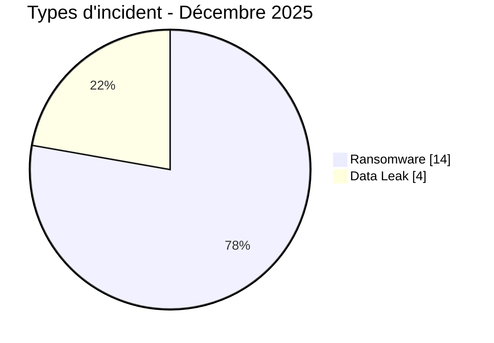
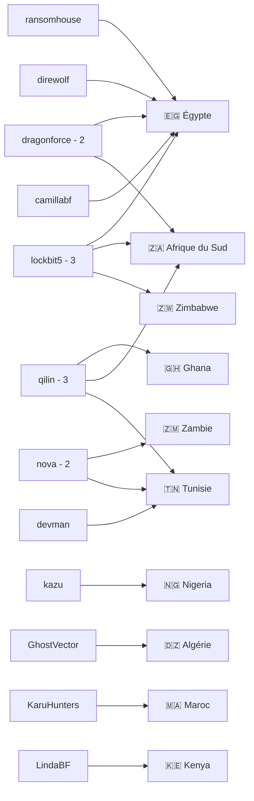
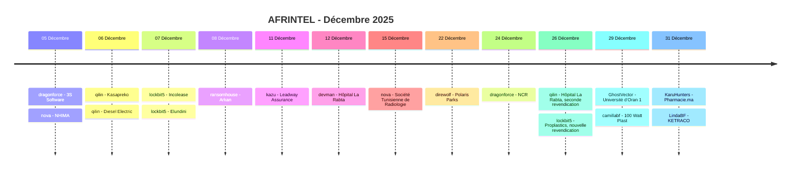

# Rapport CTI - Cyberattaques en Afrique - Décembre 2025

👉🏾 [**English version available here**](./README.md)

## 1. Synthèse exécutive

Décembre 2025 compte **18 fiches incident dans 10 pays africains** : **14 Ransomware** et **4 Data Leak**. Aucun Access Sale, DDoS, Defacement ou Operational Fraud n'est enregistré.

Les 18 fiches correspondent à **17 organisations distinctes sur le mois**, car l'Hôpital La Rabta fait l'objet de deux revendications ransomware, par devman le 12 décembre puis par qilin le 26 décembre. Les éléments disponibles ne permettent pas d'établir si la seconde revendication correspond à une nouvelle intrusion ou à une republication/revente ; elle reste donc comptée comme fiche incident distincte avec cette réserve.

- **Égypte** : 5 fiches, dont 4 Ransomware et 1 Data Leak.
- **Afrique du Sud** : 3 Ransomware.
- **Tunisie** : 3 Ransomware, dont deux revendications visant La Rabta.
- **lockbit5** et **qilin** sont les acteurs les plus visibles avec 3 fiches chacun.
- **dragonforce** et **nova** comptent 2 fiches chacun.
- Les acteurs des quatre Data Leak sont **GhostVector, camillabf, KaruHunters et LindaBF**.
- **NCR Afrique du Sud** : échantillon local cohérent avec des dossiers de consommateurs, des éléments d'enquête et des données opérationnelles pluriannuelles ; confiance High et impact Level 4.
- **Université d'Oran 1** : environ 58 000 enregistrements sont revendiqués, avec échantillon structuré publié.
- **100 Watt Plast** : 180 000 enregistrements sont revendiqués ; une vingtaine de lignes complètes sont visibles dans l'échantillon.
- **Pharmacie.ma** : deux sauvegardes SQL complètes ont été examinées, couvrant jusqu'à environ 27 900 comptes professionnels.
- **KETRACO** : l'échantillon ressemble à un annuaire/newsletter plutôt qu'à un système opérationnel critique ; une valeur de mot de passe répétée abaisse la confiance à Medium.
- **Elsewedy Electric** et **ZANACO** restent des revendications observées sur le site de Clop ; aucune donnée sous-jacente n'a été examinée, leur statut est donc conservé comme `Claim - Unverified`.

### 📋 Liste des victimes

👉🏾 [Voir la liste complète des victimes](./victims_FR.md)

### 1.1 Comparaison avec le mois précédent

| Indicateur | Novembre 2025 | Décembre 2025 | Évolution observée |
|---|---:|---:|---:|
| Total incidents | 14 | 18 | **+4 (+28,6 %)** |
| Ransomware | 10 | 14 | **+4 (+40,0 %)** |
| Data Leak | 4 | 4 | **0 (stable)** |
| Access Sale | 0 | 0 | **0 (stable)** |
| DDoS | 0 | 0 | **0 (stable)** |
| Defacement | 0 | 0 | **0 (stable)** |
| Operational Fraud | 0 | 0 | **0 (stable)** |

## 2. Méthodologie

- **Périmètre** : 54 pays africains.
- **Période** : 1er au 31 décembre 2025.
- **Sources** : OSINT, leak sites, forums underground, publications d'acteurs et échantillons disponibles.
- **Source de vérité** : couple validé `victims_FR.md` / `victims.md`.
- **Comptage** : une fiche correspond à un enregistrement d'incident ou de revendication distincte dans le corpus.
- **Répétitions** : lorsqu'une même organisation est revendiquée à nouveau mais que la relation avec l'incident précédent reste indéterminée, la nouvelle fiche est conservée avec un indicateur de cycle de vie. Un doublon n'est supprimé que lorsque les éléments permettent de relier les publications au même incident sous-jacent avec suffisamment de confiance.
- **Taxonomie** : Ransomware, Data Leak, Access Sale, DDoS, Defacement, Operational Fraud.
- **Qualification** : revendication, échantillon, publication complète et confirmation technique restent distincts.
- **Visualisation** : tableaux, barres textuelles, diagrammes Mermaid simples et chronologie.

## 3. Vue d'ensemble

### 3.1 Répartition par type d'incident

| Type d'incident | Nombre | Part |
|---|---:|---:|
| Ransomware | 14 | 77,8 % |
| Data Leak | 4 | 22,2 % |
| Access Sale | 0 | 0,0 % |
| DDoS | 0 | 0,0 % |
| Defacement | 0 | 0,0 % |
| Operational Fraud | 0 | 0,0 % |
| **Total** | **18** | **100 %** |

**Convention couleur :** 🟧 Ransomware | 🟦 Data Leak | 🟪 Access Sale | 🟥 DDoS | 🟨 Defacement | 🟩 Operational Fraud.

### 3.2 Répartition par pays

| Pays | Ransomware | Data Leak | Total | Distribution |
|---|---:|---:|---:|---|
| 🇪🇬 Égypte | 4 | 1 | 5 | 🟧🟧🟧🟧🟦 |
| 🇿🇦 Afrique du Sud | 3 | 0 | 3 | 🟧🟧🟧 |
| 🇹🇳 Tunisie | 3 | 0 | 3 | 🟧🟧🟧 |
| 🇩🇿 Algérie | 0 | 1 | 1 | 🟦 |
| 🇬🇭 Ghana | 1 | 0 | 1 | 🟧 |
| 🇰🇪 Kenya | 0 | 1 | 1 | 🟦 |
| 🇲🇦 Maroc | 0 | 1 | 1 | 🟦 |
| 🇳🇬 Nigeria | 1 | 0 | 1 | 🟧 |
| 🇿🇲 Zambie | 1 | 0 | 1 | 🟧 |
| 🇿🇼 Zimbabwe | 1 | 0 | 1 | 🟧 |
| **Total** | **14** | **4** | **18** | |

### 3.3 Répartition géographique par région

| Région | Incidents | Part | Activité |
|---|---:|---:|---|
| Afrique du Nord | 10 | 55,6 % | ██████████ |
| Afrique australe | 5 | 27,8 % | █████ |
| Afrique de l'Ouest | 2 | 11,1 % | ██ |
| Afrique de l'Est | 1 | 5,6 % | █ |
| Afrique centrale | 0 | 0,0 % |  |
| **Total** | **18** | **100 %** | |

### 3.4 Répartition sectorielle harmonisée

| Secteur harmonisé | Incidents | Part | Activité |
|---|---:|---:|---|
| Santé / Médical | 4 | 22,2 % | ██████████ |
| Finance / Banque / Assurance | 4 | 22,2 % | ██████████ |
| Gouvernement / Administration | 2 | 11,1 % | █████ |
| Industrie / Fabrication | 2 | 11,1 % | █████ |
| Technologie / IT | 1 | 5,6 % | ██ |
| Agriculture / Agro-industrie | 1 | 5,6 % | ██ |
| Transport / Automobile / Distribution | 1 | 5,6 % | ██ |
| Immobilier / Développement industriel | 1 | 5,6 % | ██ |
| Éducation / Université | 1 | 5,6 % | ██ |
| Énergie / Services publics | 1 | 5,6 % | ██ |
| **Total** | **18** | **100 %** | |

### 3.5 Acteurs / groupes

| Acteur / Groupe | Incidents | Activité |
|---|---:|---|
| lockbit5 | 3 | ██████████ |
| qilin | 3 | ██████████ |
| dragonforce | 2 | ███████ |
| nova | 2 | ███████ |
| kazu | 1 | ███ |
| ransomhouse | 1 | ███ |
| devman | 1 | ███ |
| direwolf | 1 | ███ |
| GhostVector | 1 | ███ |
| camillabf | 1 | ███ |
| KaruHunters | 1 | ███ |
| LindaBF | 1 | ███ |
| **Total** | **18** | |

### 3.6 Cartographie acteurs -> pays

## 4. Analyse détaillée par type d'incident

### 4.1 Ransomware - 14 fiches

Les 14 fiches Ransomware concernent 3S Software, NHIMA, Kasapreko, Diesel Electric, Incolease, Elundini Local Municipality, Arkan, Leadway Assurance / Health, Hôpital La Rabta par devman, Société Tunisienne de Radiologie, Polaris Parks, National Credit Regulator, Hôpital La Rabta par qilin et Proplastics Limited.

Les cas avec le plus d'éléments analytiques sont notamment :

- **National Credit Regulator** : échantillon documentaire local comprenant dossiers de réexamen de dette, correspondances, documents d'enquête et suivi opérationnel pluriannuel.
- **La Rabta** : deux revendications par deux groupes en deux semaines. Le corpus ne permet pas de trancher entre nouvelle intrusion et republication/revente.
- **Proplastics** : nouvelle revendication par lockbit5 après une revendication TheGentlemen en septembre. Le caractère distinct de la compromission n'est pas confirmé.

### 4.2 Data Leak - 4 fiches

- **Université d'Oran 1 Ahmed Ben Bella**, Algérie, acteur GhostVector : environ 58 000 enregistrements revendiqués, avec un échantillon structuré.
- **100 Watt Plast**, Égypte, acteur camillabf : 180 000 lignes revendiquées ; une vingtaine de lignes complètes sont visibles dans la preuve.
- **Pharmacie.ma**, Maroc, acteur KaruHunters : deux sauvegardes SQL complètes examinées et jusqu'à environ 27 900 comptes enregistrés selon la structure observée.
- **KETRACO**, Kenya, acteur LindaBF : export de type annuaire/newsletter ; l'anomalie d'une valeur de mot de passe répétée impose une confiance Medium.

### 4.3 Access Sale - 0 incident

Aucune fiche de décembre 2025 n'est classée Access Sale.

## 5. Impact sectoriel

**Santé / Médical** et **Finance / Banque / Assurance** sont les deux premières catégories harmonisées avec **4 fiches chacune**.

**Gouvernement / Administration** et **Industrie / Fabrication** comptent 2 fiches chacune.

Technologie / IT, Agriculture / Agro-industrie, Transport / Automobile / Distribution, Immobilier / Développement industriel, Éducation / Université et Énergie / Services publics comptent 1 fiche chacune.

## 6. Profil des acteurs

**lockbit5** et **qilin** dominent avec **3 fiches chacun**, devant **dragonforce** et **nova** avec 2.

Les acteurs des Data Leak ont été normalisés en `GhostVector`, `camillabf`, `KaruHunters` et `LindaBF`. Les mentions telles que `source account` ou `publication sur un forum cybercriminel` restent du contexte analytique et ne font plus partie du champ `Acteur / Groupe`.

## 7. Tendances et lacunes de renseignement

### 7.1 Tendances observées

1. **Hausse du volume** : 14 fiches en novembre contre 18 en décembre, soit +28,6 %.
2. **Hausse du Ransomware** : 10 -> 14, soit +40,0 %.
3. **Data Leak stable** : 4 -> 4.
4. **Égypte en tête** : 5 fiches.
5. **Afrique du Nord** : 10 fiches sur 18.
6. **Santé et finance** : 4 fiches chacune.
7. **Répétitions d'organisations** : La Rabta apparaît deux fois dans le mois et Proplastics réapparaît après septembre.

### 7.2 Lacunes de renseignement

- La seconde revendication La Rabta peut représenter une intrusion distincte ou une republication/revente.
- La revendication Proplastics de décembre peut être indépendante de celle de septembre ou liée à une republication/revente.
- Les données sous-jacentes aux revendications Clop Elsewedy Electric et ZANACO n'ont pas été examinées.
- Les 58 000 enregistrements Oran University et 180 000 lignes 100 Watt Plast restent des volumes revendiqués non vérifiés intégralement.
- KETRACO ne permet pas de conclure à une compromission de l'infrastructure électrique opérationnelle.

## 8. Chronologie synthétique

## 9. Cartographie MITRE ATT&CK contextuelle

| Phase | Technique | Portée analytique |
|---|---|---|
| Collecte | T1005 - Data from Local System | Pertinent pour les documents et fichiers locaux examinés, notamment NCR. |
| Collecte | T1213 - Data from Information Repositories | Pertinent pour les bases structurées Oran University, 100 Watt Plast, Pharmacie.ma et KETRACO. |

> Les mappings sont contextuels et défensifs. Ils ne constituent pas une preuve que chaque acteur a utilisé les techniques indiquées.

## 10. Recommandations

- **Santé** : renforcer MFA, segmentation, sauvegardes immuables, EDR et surveillance des accès aux données patients et professionnelles.
- **Finance / Assurance** : surveiller les exports, dossiers clients, comptes privilégiés et transferts inhabituels.
- **Administration publique** : protéger les dossiers citoyens et réglementaires, appliquer PAM et journaliser les consultations sensibles.
- **Énergie / Infrastructure critique** : séparer strictement les services newsletter/annuaire des systèmes opérationnels et vérifier tout indice de mouvement latéral.
- **SOC / CTI** : distinguer `nouvelle revendication`, `nouvelle intrusion confirmée`, `republication` et `revente d'accès` afin d'éviter les doubles comptages non justifiés.

## 11. Conclusion

Décembre 2025 compte **18 fiches incident dans 10 pays**, réparties entre **14 Ransomware et 4 Data Leak**.

Le volume augmente de 28,6 % par rapport à novembre. L'Égypte concentre 5 fiches. lockbit5 et qilin sont les acteurs les plus visibles avec 3 fiches chacun.

La distinction entre fiche incident et organisation distincte reste importante : les 18 fiches concernent 17 organisations sur le mois en raison des deux revendications visant La Rabta. Les cas La Rabta et Proplastics sont conservés avec une réserve explicite sur leur caractère potentiellement répétitif.

**AFRINTEL** - Initiative ouverte de veille CTI sur l'Afrique
