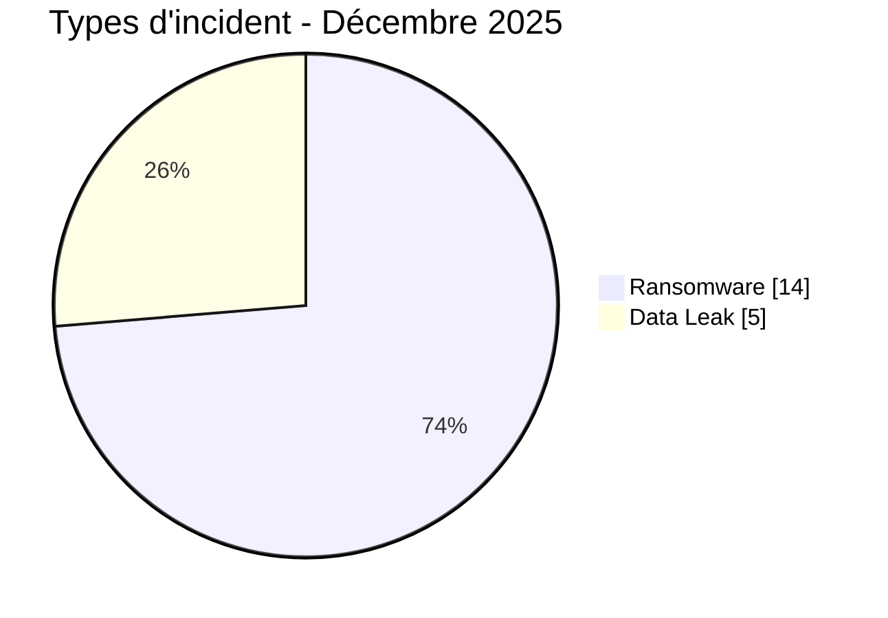
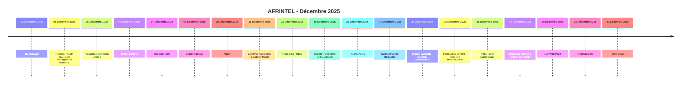

# Rapport CTI AFRINTEL - Cybermenaces en Afrique - Décembre 2025

👉🏾 [English version](./README.md)

   

## 1. Synthèse exécutive

En décembre 2025, AFRINTEL documente **19 cyberincidents** affectant des organisations et services numériques dans **10 pays africains**.

Le paysage est dominé par le **Ransomware avec 14 fiches (73,7 %)**, suivi des **Data Leak avec 5 (26,3 %)**.

La concentration géographique est marquée : **Égypte (6)**, **Afrique du Sud (3)** et **Tunisie (3)** représentent ensemble **12 fiches, soit 63,2 % du mois**. Cette concentration reflète la visibilité du corpus AFRINTEL et non un taux national exhaustif de compromission.

Sur le plan sectoriel, les catégories normalisées les plus représentées sont **Finance / Banque (4)**, **Santé / Médical (3)**, **Gouvernement / Administration (2)**, **Éducation / Université (2)** et **Industrie / Fabrication (2)**. Les labels d'acteurs les plus fréquents sont `qilin` (3), `lockbit5` (3), `dragonforce` (2) et `nova` (2).

La maturité des preuves reste variable : **13 fiches sont `Claim - Unverified` et 6 sont `Claim - Data Sample Published`**. AFRINTEL conserve une séparation stricte entre faits observés, revendications, corroborations, confirmations officielles et inconnues techniques.

Par rapport à novembre, le volume mensuel **augmente de 4 fiches**. Les variations les plus visibles concernent le Ransomware 10→14 (+4), les Data Leak 4→5 (+1) et le Defacement 1→0 (-1).

> **Note de lecture :** les chiffres AFRINTEL décrivent les incidents documentés et la visibilité des menaces observées. Ils ne constituent pas une mesure exhaustive de toutes les cyberattaques réellement survenues en Afrique.

### 1.1 Comparaison avec le mois précédent

| Indicateur | Novembre 2025 | Décembre 2025 | Évolution |
|---|---:|---:|---:|
| Total incidents | 15 | 19 | **+4 (+26,7 %)** |
| Ransomware | 10 | 14 | **+4 (+40,0 %)** |
| Data Leak | 4 | 5 | **+1 (+25,0 %)** |
| Access Sale | 0 | 0 | **Stable** |
| DDoS | 0 | 0 | **Stable** |
| Defacement | 1 | 0 | **-1 (-100,0 %)** |
| Account Takeover | 0 | 0 | **Stable** |
| System Intrusion | 0 | 0 | **Stable** |
| Malware | 0 | 0 | **Stable** |
| Operational Fraud | 0 | 0 | **Stable** |

## 2. Méthodologie

- **Périmètre :** 54 pays africains ; période de référence : décembre 2025.
- **Source de vérité :** couple validé `victims_FR.md` / `victims.md`.
- **Classification :** Ransomware, Data Leak, Access Sale, DDoS, Defacement, Account Takeover, System Intrusion, Malware et Operational Fraud.
- **Comptage :** une fiche canonique correspond à un cyberincident documenté ; les dossiers en investigation restent hors statistiques.
- **Chronologie :** `Date de l'incident` et `Date de publication initiale` sont séparées.
- **Dates incertaines :** lorsqu'aucun jour de compromission n'est établi, la période de publication soutenue par les preuves est conservée sans inventer de date technique d'intrusion.
- **Preuve :** type d'incident, statut, confiance, impact et provenance restent des dimensions distinctes.
- **Limite :** les fréquences reflètent la visibilité AFRINTEL et non l'ensemble des compromissions réelles sur le continent.

## 3. Vue d'ensemble et types d'incident

| Indicateur | Valeur |
|---|---:|
| Incidents documentés | **19** |
| Pays représentés | **10** |
| Régions représentées | **4** |
| Premier pays | **Égypte (6)** |
| Premier secteur normalisé | **Finance / Banque (4)** |
| Premiers labels acteurs | **qilin (3), lockbit5 (3)** |

| Type d'incident | Fiches | Part |
|---|---:|---:|
| Ransomware | 14 | 73,7 % |
| Data Leak | 5 | 26,3 % |
| Access Sale | 0 | 0,0 % |
| DDoS | 0 | 0,0 % |
| Defacement | 0 | 0,0 % |
| Account Takeover | 0 | 0,0 % |
| System Intrusion | 0 | 0,0 % |
| Malware | 0 | 0,0 % |
| Operational Fraud | 0 | 0,0 % |
| **Total** | **19** | **100 %** |

## 4. Répartition géographique

| Pays | Total | Ransomware | Data Leak |
|---|---:|---:|---:|
| Égypte | **6** | 4 | 2 |
| Afrique du Sud | **3** | 3 | 0 |
| Tunisie | **3** | 3 | 0 |
| Zambie | **1** | 1 | 0 |
| Ghana | **1** | 1 | 0 |
| Nigeria | **1** | 1 | 0 |
| Zimbabwe | **1** | 1 | 0 |
| Algérie | **1** | 0 | 1 |
| Maroc | **1** | 0 | 1 |
| Kenya | **1** | 0 | 1 |
| **Total** | **19** | **14** | **5** |

## 5. Répartition régionale

| Région | Fiches | Part |
|---|---:|---:|
| Afrique du Nord | 11 | 57,9 % |
| Afrique australe | 5 | 26,3 % |
| Afrique de l'Ouest | 2 | 10,5 % |
| Afrique de l'Est | 1 | 5,3 % |
| **Total** | **19** | **100 %** |

La région la plus représentée est **l'Afrique du Nord avec 11 fiches (57,9 %)**.

## 6. Impact sectoriel

| Secteur normalisé | Fiches | Part |
|---|---:|---:|
| Finance / Banque | 4 | 21,1 % |
| Santé / Médical | 3 | 15,8 % |
| Gouvernement / Administration | 2 | 10,5 % |
| Éducation / Université | 2 | 10,5 % |
| Industrie / Fabrication | 2 | 10,5 % |
| Technologie / IT | 1 | 5,3 % |
| Agriculture / Agro-industrie | 1 | 5,3 % |
| Non précisé | 1 | 5,3 % |
| Construction / Immobilier | 1 | 5,3 % |
| Énergie / Services publics | 1 | 5,3 % |
| Commerce / E-commerce | 1 | 5,3 % |
| **Total** | **19** | **100 %** |

## 7. Acteurs / groupes

| Acteur / Groupe | Fiches |
|---|---:|
| qilin | 3 |
| lockbit5 | 3 |
| dragonforce | 2 |
| nova | 2 |
| ransomhouse | 1 |
| kazu | 1 |
| devman | 1 |
| direwolf | 1 |
| Habibi | 1 |
| GhostVector | 1 |
| camillabf | 1 |
| KaruHunters | 1 |
| LindaBF | 1 |

## 8. Maturité des preuves

| Maturité de preuve | Fiches | Part |
|---|---:|---:|
| Claim - Unverified | 13 | 68,4 % |
| Claim - Data Sample Published | 6 | 31,6 % |
| **Total** | **19** | **100 %** |

## 9. Chronologie

## 10. Analyse CTI mensuelle

### Ransomware

**14 fiches** sont classées Ransomware. Les principaux pays sont l'Égypte (4), l'Afrique du Sud (3) et la Tunisie (3). Une publication sur un leak site ne prouve pas à elle seule le chiffrement ou l'exfiltration complète.

### Data Leak

**5 fiches** sont classées Data Leak. L'Égypte en compte 2, tandis que l'Algérie, le Maroc et le Kenya en comptent une chacun. Le nouveau dossier Yalla Tager est une **revendication accompagnée d'un échantillon** : le matériel fourni est structurellement cohérent avec des données clients/commerçants, mais le volume revendiqué de 20 000 utilisateurs, le vecteur d'accès, la date d'extraction et la provenance complète restent non vérifiés.

## 11. Incidents notables

| Pays | Organisation | Type | Statut | Impact | Confiance |
|---|---|---|---|---|---|
| Afrique du Sud | National Credit Regulator (NCR) | Ransomware | Claim - Data Sample Published | Level 4 | High |
| Égypte | Yalla Tager Marketplace | Data Leak | Claim - Data Sample Published | Level 3 | Medium |
| Égypte | 100 Watt Plast | Data Leak | Claim - Data Sample Published | N/A | High |
| Maroc | Pharmacie.ma | Data Leak | Claim - Data Sample Published | N/A | N/A |
| Kenya | KETRACO | Data Leak | Claim - Data Sample Published | N/A | Medium |

## 12. Principaux enseignements et lacunes de renseignement

- **Concentration géographique :** l'Égypte représente 6 fiches (31,6 %), devant l'Afrique du Sud (3) et la Tunisie (3).
- **Structure de menace :** le Ransomware reste le premier type avec 14 fiches, suivi des Data Leak (5).
- **Secteurs :** Finance / Banque (4) et Santé / Médical (3) concentrent la plus forte visibilité ; Commerce / E-commerce gagne une fiche avec Yalla Tager.
- **Preuve :** les 19 fiches restent des revendications, dont 6 accompagnées d'échantillons publiés.
- **Yalla Tager :** l'échantillon soutient une revendication d'exposition de données clients/commerçants, sans établir la date ni la méthode de compromission et sans valider le volume annoncé de 20 000 utilisateurs.

### Intelligence gaps

- vecteur d'accès initial souvent non public ;
- date technique exacte de compromission parfois inconnue ;
- volumes revendiqués rarement vérifiables intégralement ;
- attribution technique souvent limitée au pseudonyme ou label de publication ;
- informations publiques sur remédiation, cause racine et conclusions DFIR encore limitées.

## 13. Recommandations

### Organisations

- imposer une MFA résistante au phishing sur les comptes privilégiés, la messagerie, les consoles d'administration et les accès back-office vendeurs/commerçants ;
- appliquer le moindre privilège et surveiller les exports massifs de données clients et commerçants ;
- maintenir des sauvegardes testées et formaliser les procédures de réponse aux violations de données ;
- revoir les interfaces exposées de support client, marketplace, API et administration.

### SOC et détection

- surveiller les authentifications anormales, changements de rôles et créations de comptes privilégiés ;
- détecter les lectures massives de bases, exports CSV inhabituels, créations d'archives et transferts sortants volumineux ;
- corréler IAM, applicatif, WAF, proxy, DNS, cloud et télémétrie EDR ;
- alerter sur les accès anormaux aux jeux de données clients/commerçants depuis de nouveaux appareils, localisations ou comptes de service.

### CTI

- distinguer date de publication, horodatages de compte/client, date d'extraction et date technique de compromission ;
- conserver les volumes revendiqués par l'acteur séparés de la taille de l'échantillon observé ;
- vérifier la parité FR/EN avant toute agrégation statistique.

## 14. Conclusion

**Décembre 2025** compte **19 cyberincidents documentés** dans **10 pays africains** : 14 Ransomware et 5 Data Leak. L'ajout de Yalla Tager porte l'Égypte à 6 fiches et augmente la composante Data Leak accompagnée d'échantillons, sans modifier l'exigence analytique consistant à séparer les données observées du périmètre revendiqué.

👉🏾 [Voir les victimes du mois](./victims_FR.md)

**AFRINTEL** - TLP:CLEAR
