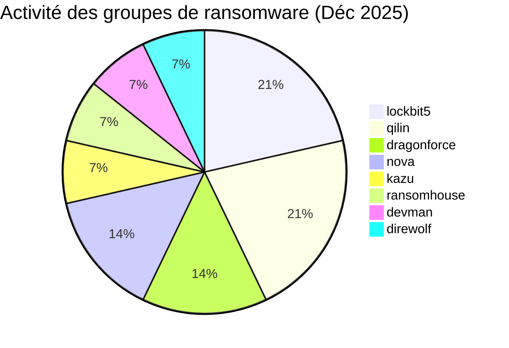
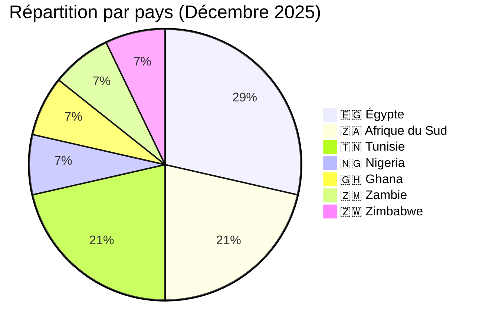
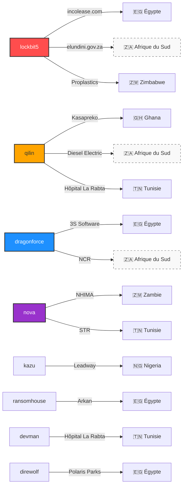

# Rapport CTI : Cyberattaques en Afrique - Décembre 2025 (14 victimes)

👉🏾 [**English version available here**](./README.md)

## 1. Introduction
Ce rapport de **Cyber Threat Intelligence (CTI)** présente une analyse détaillée des cyberattaques survenues en Afrique durant le mois de décembre 2025. Les informations sont issues de sources **OSINT** et de sites de fuites de groupes ransomware, compilées dans le cadre du projet **AFRINTEL**. L'objectif est de fournir une vision claire des tendances et des acteurs menaçants sur le continent.

---

## 2. Résumé exécutif
Décembre 2025 marque une hausse de l'activité des ransomwares avec 14 victimes recensées dans 7 pays africains. Le mois est caractérisé par une concentration d'attaques en Égypte et en Afrique du Sud, ainsi qu'un ciblage persistant du secteur de la santé en Afrique du Nord.

* **Nombre total d'attaques recensées** : 14
* **Acteurs les plus actifs** : `lockbit5` (3 attaques), `qilin` (3 attaques).
    * *Autres groupes actifs* : dragonforce (2), nova (2), kazu, ransomhouse, devman, direwolf (1 chacun).
* **Secteurs les plus ciblés** : Santé (3), Finance/Leasing (2), Assurances (2), Administrations publiques (2).
* **Pays les plus touchés** : 🇪🇬 Égypte (4), 🇿🇦 Afrique du Sud (3), 🇹🇳 Tunisie (3).
* **Incident notable** : Double cyberattaque sur l'**Hôpital La Rabta** (Tunisie) par deux groupes différents (devman et qilin) en l'espace de deux semaines.

---

## 3. Statistiques clés

### 3.1 Répartition par groupe ransomware
| Groupe / Acteur | Nombre d'attaques |
| :--- | :---: |
| **lockbit5** | 3 |
| **qilin** | 3 |
| **dragonforce** | 2 |
| **nova** | 2 |
| **kazu** | 1 |
| **ransomhouse** | 1 |
| **devman** | 1 |
| **direwolf** | 1 |
| **Total** | **14** |

### 3.2 Répartition par secteur d'activité
| Secteur | Nombre d'attaques |
| :--- | :---: |
| 🏥 Santé | 3 |
| 💰 Finance / Leasing | 2 |
| 🛡️ Assurances | 2 |
| 🏛️ Administration publique | 2 |
| 💻 Technologies | 1 |
| 🚚 Logistique / Automobile | 1 |
| 🏗️ Immobilier / Industrie | 1 |
| 🏭 Industrie manufacturière | 1 |
| 🌾 Agroalimentaire | 1 |
| **Total** | **14** |

### 3.3 Répartition par pays
| Pays | Nombre d'attaques |
| :--- | :---: |
| 🇪🇬 Égypte | 4 |
| 🇿🇦 Afrique du Sud | 3 |
| 🇹🇳 Tunisie | 3 |
| 🇳🇬 Nigeria | 1 |
| 🇬🇭 Ghana | 1 |
| 🇿🇲 Zambie | 1 |
| 🇿🇼 Zimbabwe | 1 |
| **Total** | **14** |

---

## 4. Détail des attaques par groupe ransomware

### 4.1 lockbit5 (3 attaques)
* **07/12/2025** : **incolease.com** (Égypte, Finance) - Revendication & divulgation.
* **07/12/2025** : **elundini.gov.za** (Afrique du Sud, Admin publique) - Revendication & divulgation.
* **26/12/2025** : **Proplastics Limited** (Zimbabwe, Industrie manufacturière) - Revendication & divulgation.

### 4.2 qilin (3 attaques)
* **06/12/2025** : **Kasapreko Company Limited** (Ghana, Agroalimentaire) - Revendication & divulgation.
* **06/12/2025** : **Diesel Electric** (Afrique du Sud, Automobile/Logistique) - Revendication & divulgation.
* **26/12/2025** : **Hôpital La Rabta** (Tunisie, Santé) - Deuxième attaque enregistrée.

### 4.3 dragonforce (2 attaques)
* **05/12/2025** : **3S Software** (Égypte, Technologies) - Revendication & divulgation.
* **24/12/2025** : **National Credit Regulator (NCR)** (Afrique du Sud, Admin publique/Régulation financière) - Revendication & divulgation.

### 4.4 nova (2 attaques)
* **05/12/2025** : **National Health Insurance Management Authority (NHIMA)** (Zambie, Assurances) - Revendication & divulgation.
* **15/12/2025** : **Société Tunisienne de Radiologie (STR)** (Tunisie, Santé/Éducation) - Revendication & divulgation.

### 4.5 Autres groupes (1 attaque chacun)
* **kazu** (11/12/2025) : **Leadway Assurance / Health** (Nigeria, Assurances) - Revendication & divulgation.
* **ransomhouse** (08/12/2025) : **Arkan** (Égypte, Finance/Commerce) - Revendication & divulgation.
* **devman** (12/12/2025) : **Hôpital La Rabta** (Tunisie, Santé) - Première attaque enregistrée.
* **direwolf** (22/12/2025) : **Polaris Parks** (Égypte, Immobilier/Industrie) - Revendication & divulgation.

### 4.6 Graphe acteur → victime → pays

---

## 5. Analyse sectorielle
* **Santé (3)** : Forte vulnérabilité en Tunisie avec trois incidents majeurs touchant des CHU et des associations médicales.
* **Administration Publique (2)** : Ciblage d'organismes de régulation critiques (NCR en Afrique du Sud) et de municipalités locales (Elundini).
* **Assurance & Finance (4)** : Focus continu sur les secteurs à forte valeur ajoutée au Nigeria, en Égypte et en Zambie.

---

## 6. Analyse géographique
* **🇪🇬 Égypte** : Reste la cible principale pour le deuxième mois consécutif avec **4 victimes**.
* **🇿🇦 Afrique du Sud** : Hausse significative avec **3 victimes**, incluant un régulateur financier national.
* **🇹🇳 Tunisie** : Émergence comme zone à risque pour les infrastructures de santé avec **3 attaques** en décembre.

---

## 7. TTPs observées (Tactics, Techniques & Procedures)

* **Extorsion à étapes multiples** : Les groupes comme **Lockbit5** et **Qilin** maintiennent la méthode "Revendication & Divulgation" (Double Extorsion) pour maximiser la pression psychologique et financière sur les victimes.
* **Phénomène de Re-victimisation (double revendication)** : 
    * Le cas de l'**Hôpital La Rabta** (Tunisie) est critique : ciblé par le groupe **devman** le 12/12, puis par **qilin** le 26/12. Cela démontre que plusieurs acteurs peuvent exploiter les mêmes vulnérabilités non corrigées ou se revendre des accès via des *Initial Access Brokers* (IABs).
    * **Proplastics Limited** (Zimbabwe) a également subi une seconde attaque par **lockbit5**, illustrant la persistance des acteurs tant que les vecteurs d'entrée initiaux ne sont pas totalement neutralisés.
* **Ciblage des infrastructures de services essentiels** : On observe un focus marqué sur les organismes de régulation (NCR en Afrique du Sud) et les systèmes de gestion de santé (NHIMA en Zambie), visant l'exfiltration massive de données personnelles (PII).

---

## 8. Recommandations
1.  **Secteur de la santé** : Audit urgent des systèmes exposés et mise en place de sauvegardes hors-ligne.
2.  **Secteur public** : Durcissement des portails administratifs et des systèmes de régulation financière.
3.  **Industrie** : Protection des données de la chaîne d'approvisionnement, particulièrement pour les partenaires de marques mondiales.

---

## 9. Conclusion
Décembre 2025 témoigne d'une intensification de l'impact des ransomwares en Afrique du Nord et australe. La répétition des attaques contre des institutions de santé indique que les attaquants privilégient des cibles où l'arrêt d'activité est critique.

---

### ✍🏿 Auteur
**Adama ASSIONGBON** *Consultant SOC & Cyber Threat Intelligence*

**AFRINTEL** - *Initiative ouverte de veille CTI sur l’Afrique*
