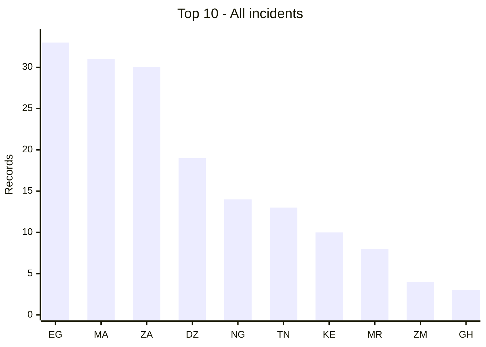
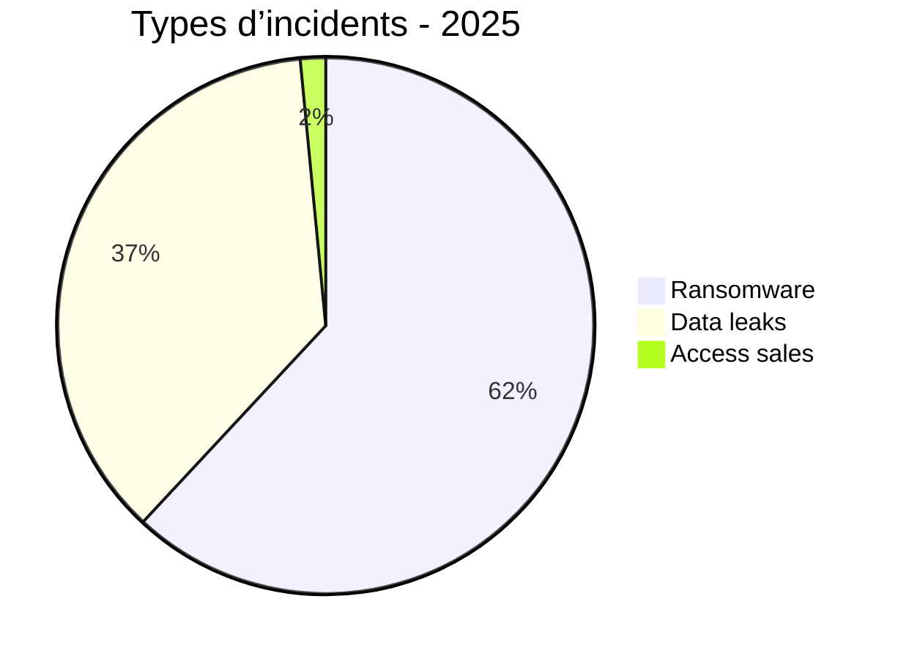
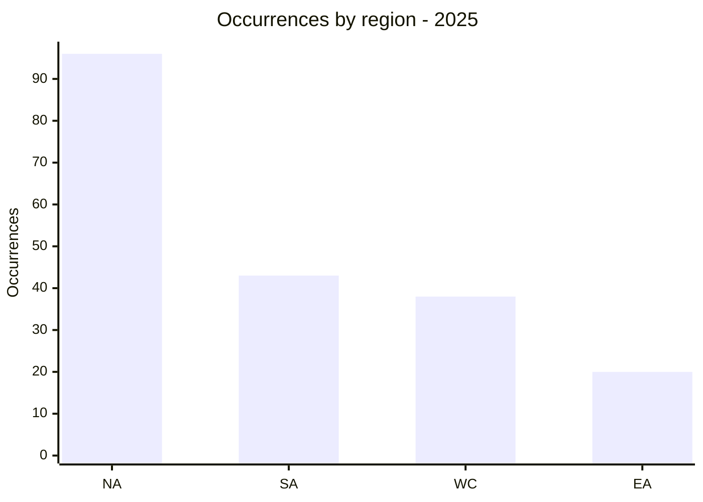
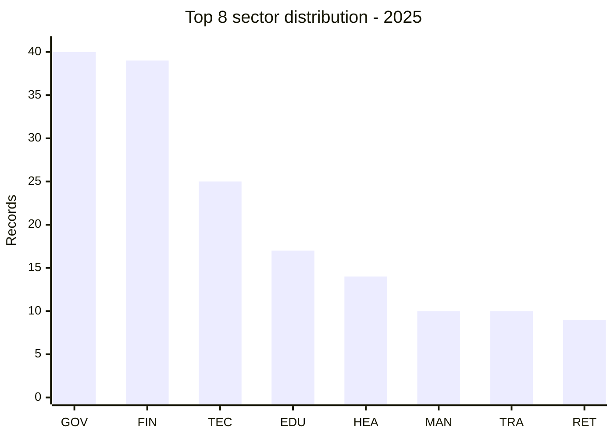
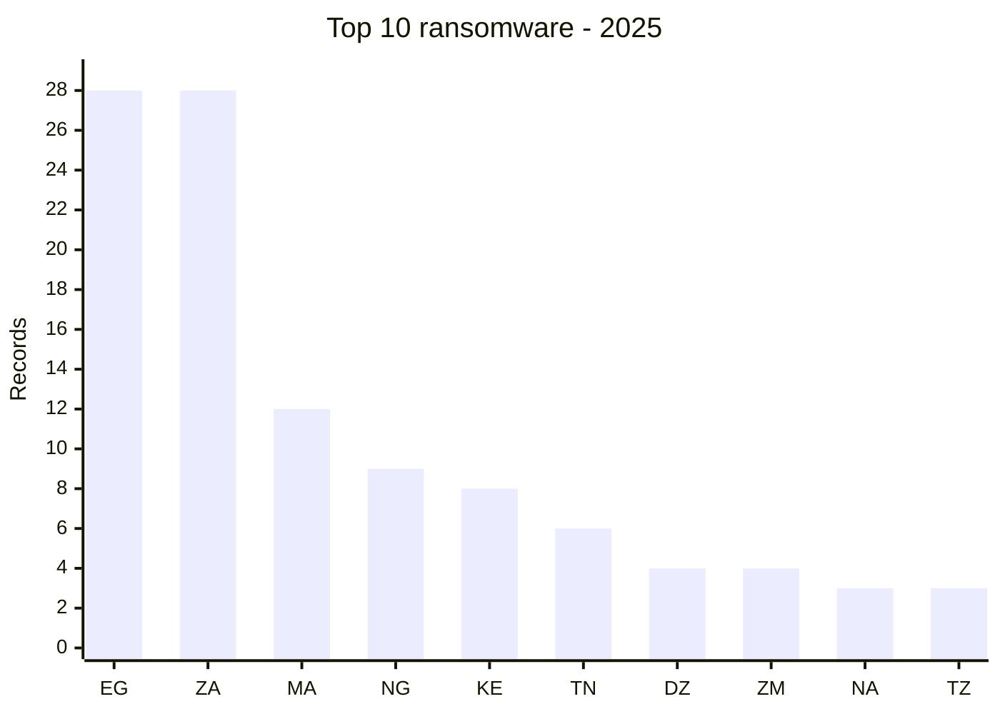
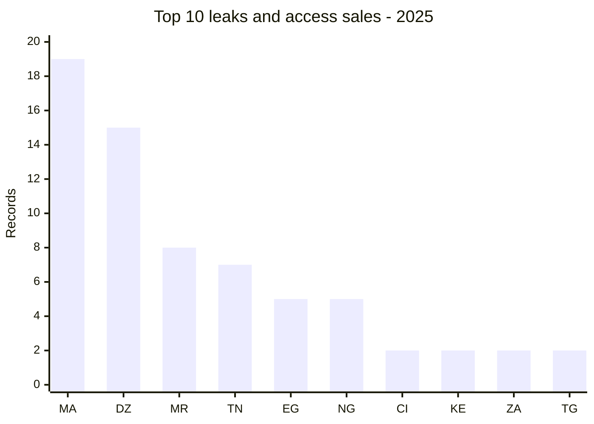
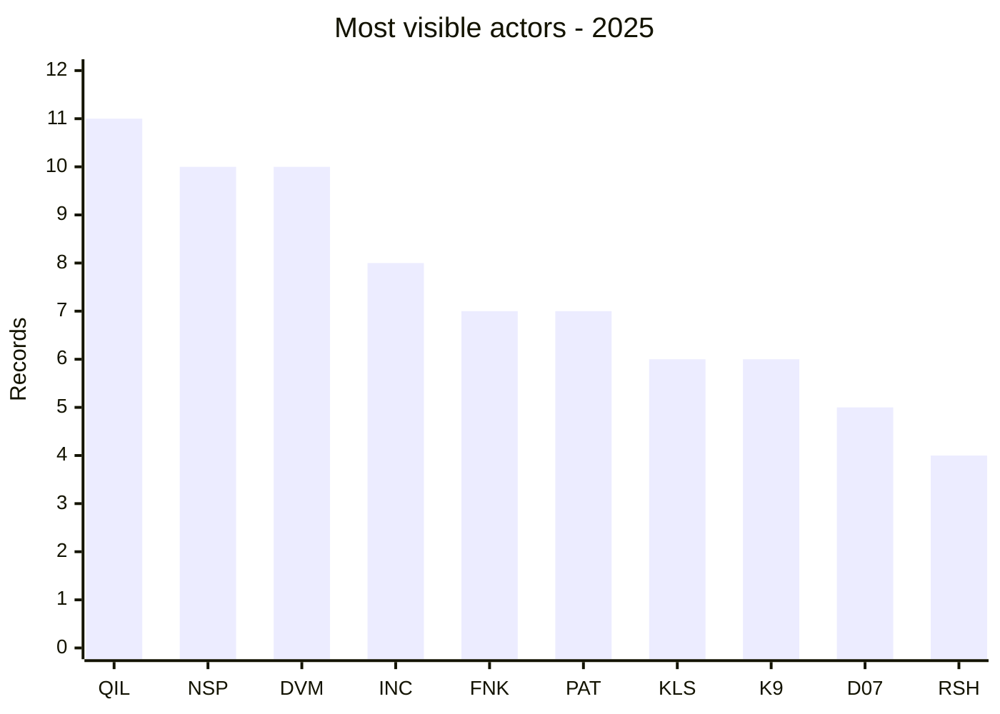

# AFRINTEL global annual CTI report - 2025

👉🏾 [French version](./README_FR.md)

  

---
## 1. Executive summary

AFRINTEL recorded **197 records** in 2025: **122 ransomware claims (61.9%)**, **72 data leaks (36.5%)**, **3 access sales (1.5%)** and **no defacements**. The observed volume was strongly concentrated in North Africa, with **96 records**, followed by Southern Africa (**43**), West and Central Africa (**38**) and East Africa (**20**).

The three most represented countries were **Egypt (33)**, **Morocco (31)** and **South Africa (30)**. This concentration does not necessarily indicate a higher level of compromise in those countries; it reflects the scope of the documented publications and claims collected by AFRINTEL.

The year was marked by the weight of ransomware, but also by significant exposure of data linked to government, financial and technology organizations. Government and administration (**40 records**) and finance and banking (**39**) were the two most represented sectors, together accounting for nearly **40%** of the corpus. The most visible actors were **qilin (11 records)**, **nightspire (10)** and **devman (10)**, although publication frequency alone does not establish a common campaign or operational attribution.

The main CTI challenge remains claim qualification: confirming the intrusion, distinguishing a new compromise from a repost and assessing the actual size of the advertised datasets. Access sales and data leaks should therefore be tracked as risk signals distinct from ransomware, while analysts look for possible links between exposed access, exfiltration and extortion.

## 2. Methodology

The twelve monthly `victims.md` files are the source of truth and contain 197 distinct records for 2025. A record is a documented publication or claim, not necessarily a confirmed intrusion or a unique victim. Reposts and separate claims are retained when the monthly source treats them as distinct records; this limitation is stated in the interpretation. Counts are derived from the source files without extrapolation. Countries use ISO alpha-2 codes in charts, while the tables retain standard country names. Sector labels are mapped to one controlled annual vocabulary; missing or genuinely undetermined activity remains explicitly marked. Ransomware, data leaks, access sales and defacements are counted separately. Forum and leak-site publications remain claims unless independently confirmed.

## 3. Global overview

| Indicator | Value |
| :--- | ---: |
| Records | **197** |
| Ransomware | **122 (61.9%)** |
| Data leaks | **72 (36.5%)** |
| Access sales | **3 (1.5%)** |

### Country ranking

| Rank | Country | Records | Chart |
| :--- | ---: | ---: | ---: |
| 1 | 🇪🇬 Egypt | 33 | █████████████████████████████████ |
| 2 | 🇲🇦 Morocco | 31 | ███████████████████████████████ |
| 3 | 🇿🇦 South Africa | 30 | ██████████████████████████████ |
| 4 | 🇩🇿 Algeria | 19 | ███████████████████ |
| 5 | 🇳🇬 Nigeria | 14 | ██████████████ |
| 6 | 🇹🇳 Tunisia | 13 | █████████████ |
| 7 | 🇰🇪 Kenya | 10 | ██████████ |
| 8 | 🇲🇷 Mauritania | 8 | ████████ |
| 9 | 🇿🇲 Zambia | 4 | ████ |
| 10 | 🇬🇭 Ghana | 3 | ███ |
| 11 | 🇨🇮 Ivory Coast | 3 | ███ |
| 12 | 🇳🇦 Namibia | 3 | ███ |
| 13 | 🇹🇿 Tanzania | 3 | ███ |
| 14 | 🇧🇼 Botswana | 2 | ██ |
| 15 | 🇨🇩 Congo (DRC) | 2 | ██ |
| 16 | 🇲🇺 Mauritius | 2 | ██ |
| 17 | 🇸🇳 Senegal | 2 | ██ |
| 18 | 🇹🇬 Togo | 2 | ██ |
| 19 | 🇺🇬 Uganda | 2 | ██ |
| 20 | 🇿🇼 Zimbabwe | 2 | ██ |
| 21 | 🇦🇴 Angola | 1 | █ |
| 22 | 🇧🇫 Burkina Faso | 1 | █ |
| 23 | 🇨🇲 Cameroon | 1 | █ |
| 24 | 🇩🇯 Djibouti | 1 | █ |
| 25 | 🇪🇷 Eritrea | 1 | █ |
| 26 | 🇬🇦 Gabon | 1 | █ |
| 27 | 🇲🇬 Madagascar | 1 | █ |
| 28 | 🇷🇼 Rwanda | 1 | █ |
| 29 | 🇧🇮 Burundi | 1 | █ |

Legend: EG = Egypt; MA = Morocco; ZA = South Africa; DZ = Algeria; NG = Nigeria; TN = Tunisia; KE = Kenya; MR = Mauritania; ZM = Zambia; GH = Ghana

### Incident type distribution

| Type | Records | Share |
| :--- | ---: | ---: |
| Ransomware | 122 | 61.9% |
| Data leak | 72 | 36.5% |
| Access sale | 3 | 1.5% |
| Defacement | 0 | 0,0% |
| **Total** | **197** | **100%** |

### Aggregate data-exposure view

Data leaks and access sales are combined here for an exposure-oriented view: **72 data leaks + 3 access sales = 75 records**. The detailed counters above remain separate because an access sale does not by itself prove that data were exfiltrated.

| Aggregate category | Records | Share of corpus |
| :--- | ---: | ---: |
| Data leaks + access sales | **75** | **38.1%** |

This aggregate is a derived view and must not be added to the 197-record total a second time.

### Ransomware country ranking

| Rank | Country | ISO | Records | Colour bar |
|---:|---|:---:|---:|---|
| 1 | Egypt | EG | 28 | 🟧🟧🟧🟧🟧🟧🟧🟧🟧🟧🟧🟧🟧🟧🟧🟧🟧🟧🟧🟧🟧🟧🟧🟧🟧🟧🟧🟧 |
| 2 | South Africa | ZA | 28 | 🟧🟧🟧🟧🟧🟧🟧🟧🟧🟧🟧🟧🟧🟧🟧🟧🟧🟧🟧🟧🟧🟧🟧🟧🟧🟧🟧🟧 |
| 3 | Morocco | MA | 12 | 🟧🟧🟧🟧🟧🟧🟧🟧🟧🟧🟧🟧 |
| 4 | Nigeria | NG | 9 | 🟧🟧🟧🟧🟧🟧🟧🟧🟧 |
| 5 | Kenya | KE | 8 | 🟧🟧🟧🟧🟧🟧🟧🟧 |
| 6 | Tunisia | TN | 6 | 🟧🟧🟧🟧🟧🟧 |
| 7 | Algeria | DZ | 4 | 🟧🟧🟧🟧 |
| 8 | Zambia | ZM | 4 | 🟧🟧🟧🟧 |
| 9 | Namibia | NA | 3 | 🟧🟧🟧 |
| 10 | Tanzania | TZ | 3 | 🟧🟧🟧 |
| 11 | Botswana | BW | 2 | 🟧🟧 |
| 12 | Ghana | GH | 2 | 🟧🟧 |
| 13 | Mauritius | MU | 2 | 🟧🟧 |
| 14 | Uganda | UG | 2 | 🟧🟧 |
| 15 | Zimbabwe | ZW | 2 | 🟧🟧 |
| 16 | Cameroon | CM | 1 | 🟧 |
| 17 | Congo (DRC) | CD | 1 | 🟧 |
| 18 | Ivory Coast | CI | 1 | 🟧 |
| 19 | Gabon | GA | 1 | 🟧 |
| 20 | Madagascar | MG | 1 | 🟧 |
| 21 | Rwanda | RW | 1 | 🟧 |
| 22 | Senegal | SN | 1 | 🟧 |

### Data-leak country ranking

| Rank | Country | ISO | Records | Colour bar |
|---:|---|:---:|---:|---|
| 1 | Morocco | MA | 19 | 🟦🟦🟦🟦🟦🟦🟦🟦🟦🟦🟦🟦🟦🟦🟦🟦🟦🟦🟦 |
| 2 | Algeria | DZ | 15 | 🟦🟦🟦🟦🟦🟦🟦🟦🟦🟦🟦🟦🟦🟦🟦 |
| 3 | Mauritania | MR | 8 | 🟦🟦🟦🟦🟦🟦🟦🟦 |
| 4 | Tunisia | TN | 7 | 🟦🟦🟦🟦🟦🟦🟦 |
| 5 | Egypt | EG | 5 | 🟦🟦🟦🟦🟦 |
| 6 | Nigeria | NG | 5 | 🟦🟦🟦🟦🟦 |
| 7 | Ivory Coast | CI | 2 | 🟦🟦 |
| 8 | Kenya | KE | 2 | 🟦🟦 |
| 9 | South Africa | ZA | 2 | 🟦🟦 |
| 10 | Angola | AO | 1 | 🟦 |
| 11 | Congo (DRC) | CD | 1 | 🟦 |
| 12 | Djibouti | DJ | 1 | 🟦 |
| 13 | Eritrea | ER | 1 | 🟦 |
| 14 | Ghana | GH | 1 | 🟦 |
| 15 | Togo | TG | 1 | 🟦 |
| 16 | Burundi | BI | 1 | 🟦 |

### Access-sale country ranking

| Rank | Country | ISO | Records | Colour bar |
|---:|---|:---:|---:|---|
| 1 | Burkina Faso | BF | 1 | 🟨 |
| 2 | Senegal | SN | 1 | 🟨 |
| 3 | Togo | TG | 1 | 🟨 |

Legend: 🟧 Ransomware | 🟦 Data leaks | 🟨 Access sales

### Ransomware, leaks and access sales by country

| Country | Ransomware | Data leaks | Access sales | Total | Barre | Distribution |
| :--- | ---: | ---: | ---: | ---: | ---: | ---: |
| 🇪🇬 Egypt | 28 | 5 | 0 | 33 | █████████████████████████████████ | 🟧🟧🟧🟧🟧🟧🟧🟧🟧🟧🟧🟧🟧🟧🟧🟧🟧🟧🟧🟧🟧🟧🟧🟧🟧🟧🟧🟧 🟦🟦🟦🟦🟦 |
| 🇲🇦 Morocco | 12 | 19 | 0 | 31 | ███████████████████████████████ | 🟧🟧🟧🟧🟧🟧🟧🟧🟧🟧🟧🟧 🟦🟦🟦🟦🟦🟦🟦🟦🟦🟦🟦🟦🟦🟦🟦🟦🟦🟦🟦 |
| 🇿🇦 South Africa | 28 | 2 | 0 | 30 | ██████████████████████████████ | 🟧🟧🟧🟧🟧🟧🟧🟧🟧🟧🟧🟧🟧🟧🟧🟧🟧🟧🟧🟧🟧🟧🟧🟧🟧🟧🟧🟧 🟦🟦 |
| 🇩🇿 Algeria | 4 | 15 | 0 | 19 | ███████████████████ | 🟧🟧🟧🟧 🟦🟦🟦🟦🟦🟦🟦🟦🟦🟦🟦🟦🟦🟦🟦 |
| 🇳🇬 Nigeria | 9 | 5 | 0 | 14 | ██████████████ | 🟧🟧🟧🟧🟧🟧🟧🟧🟧 🟦🟦🟦🟦🟦 |
| 🇹🇳 Tunisia | 6 | 7 | 0 | 13 | █████████████ | 🟧🟧🟧🟧🟧🟧 🟦🟦🟦🟦🟦🟦🟦 |
| 🇰🇪 Kenya | 8 | 2 | 0 | 10 | ██████████ | 🟧🟧🟧🟧🟧🟧🟧🟧 🟦🟦 |
| 🇲🇷 Mauritania | 0 | 8 | 0 | 8 | ████████ | 🟦🟦🟦🟦🟦🟦🟦🟦 |
| 🇿🇲 Zambia | 4 | 0 | 0 | 4 | ████ | 🟧🟧🟧🟧 |
| 🇬🇭 Ghana | 2 | 1 | 0 | 3 | ███ | 🟧🟧 🟦 |
| 🇨🇮 Ivory Coast | 1 | 2 | 0 | 3 | ███ | 🟧 🟦🟦 |
| 🇳🇦 Namibia | 3 | 0 | 0 | 3 | ███ | 🟧🟧🟧 |
| 🇹🇿 Tanzania | 3 | 0 | 0 | 3 | ███ | 🟧🟧🟧 |
| 🇧🇼 Botswana | 2 | 0 | 0 | 2 | ██ | 🟧🟧 |
| 🇨🇩 Congo (DRC) | 1 | 1 | 0 | 2 | ██ | 🟧 🟦 |
| 🇲🇺 Mauritius | 2 | 0 | 0 | 2 | ██ | 🟧🟧 |
| 🇸🇳 Senegal | 1 | 0 | 1 | 2 | ██ | 🟧 🟦 |
| 🇹🇬 Togo | 0 | 1 | 1 | 2 | ██ | 🟦🟦 |
| 🇺🇬 Uganda | 2 | 0 | 0 | 2 | ██ | 🟧🟧 |
| 🇿🇼 Zimbabwe | 2 | 0 | 0 | 2 | ██ | 🟧🟧 |
| 🇦🇴 Angola | 0 | 1 | 0 | 1 | █ | 🟦 |
| 🇧🇫 Burkina Faso | 0 | 0 | 1 | 1 | █ | 🟦 |
| 🇨🇲 Cameroon | 1 | 0 | 0 | 1 | █ | 🟧 |
| 🇩🇯 Djibouti | 0 | 1 | 0 | 1 | █ | 🟦 |
| 🇪🇷 Eritrea | 0 | 1 | 0 | 1 | █ | 🟦 |
| 🇬🇦 Gabon | 1 | 0 | 0 | 1 | █ | 🟧 |
| 🇲🇬 Madagascar | 1 | 0 | 0 | 1 | █ | 🟧 |
| 🇷🇼 Rwanda | 1 | 0 | 0 | 1 | █ | 🟧 |
| 🇧🇮 Burundi | 0 | 1 | 0 | 1 | █ | 🟦 |

### Geographic distribution by region

| Region | Occurrences | Ransomware | Leaks / access | Distribution |
| :--- | ---: | ---: | ---: | ---: |
| North Africa | 96 | 50 | 46 | 🟧🟧🟧🟧🟧🟧🟧🟧🟧🟧 🟦🟦🟦🟦🟦🟦🟦🟦🟦🟦 |
| Southern Africa | 43 | 41 | 2 | 🟧🟧🟧🟧🟧🟧🟧🟧 🟦 |
| West and Central Africa | 38 | 16 | 22 | 🟧🟧🟧 🟦🟦🟦🟦🟦 |
| East Africa | 20 | 15 | 5 | 🟧🟧🟧 🟦 |

Legend: NA = North Africa; SA = Southern Africa; WC = West and Central Africa; EA = East Africa

### Sector distribution

| Normalized sector | Records | Share | Chart |
| :--- | ---: | ---: | ---: |
| Government / Administration | 40 | 20.3% | ██████████ |
| Finance / Banking | 39 | 19.8% | ██████████ |
| Technology / IT | 25 | 12.7% | ██████ |
| Education / University | 17 | 8.6% | ████ |
| Healthcare / Medical | 14 | 7.1% | ████ |
| Manufacturing / Industry | 10 | 5.1% | ██ |
| Transport / Logistics | 10 | 5.1% | ██ |
| Retail / E-commerce | 9 | 4.6% | ██ |
| Professional / Business Services | 7 | 3.6% | ██ |
| Construction / Real Estate | 6 | 3.0% | ██ |
| Defense / Security | 6 | 3.0% | ██ |
| Energy / Utilities | 4 | 2.0% | █ |
| Agriculture / Agribusiness | 3 | 1.5% | █ |
| Legal / Justice | 2 | 1.0% | █ |
| Mining | 2 | 1.0% | █ |
| Not specified | 2 | 1.0% | █ |
| Civil Society / NGO | 1 | 0.5% | █ |

Legend: GOV = Government / Administration; FIN = Finance / Banking; TEC = Technology / IT; EDU = Education / University; HEA = Healthcare / Medical; MAN = Manufacturing / Industry; TRA = Transport / Logistics; RET = Retail / E-commerce

The chart shows the eight largest controlled sectors; the table above is authoritative for the complete 197-record distribution.

### Incident-type charts

Legend: EG = Egypt; ZA = South Africa; MA = Morocco; NG = Nigeria; KE = Kenya; TN = Tunisia; DZ = Algeria; ZM = Zambia; NA = Namibia; TZ = Tanzania

Legend: MA = Morocco; DZ = Algeria; MR = Mauritania; TN = Tunisia; EG = Egypt; NG = Nigeria; CI = Ivory Coast; KE = Kenya; ZA = South Africa; TG = Togo

## 4. Detailed analysis by incident type

Ransomware claims account for **122 records**, or **61.9%** of the corpus. They were particularly dominant in Southern Africa (**41 records**) and remained the majority in North Africa (**50**), while leaks and access sales reached **46** and **22** records respectively in those two regions.

Data leaks and access sales account for **75 records**. Morocco leads with **19 records**, followed by Algeria (**15**), Mauritania (**8**) and Tunisia (**7**). The claimed data involved administrative, financial, healthcare, education and business environments. This distribution shows that data leakage is not only a consequence of ransomware: it also appears as an independent risk involving exposed databases, access sales or reposted samples.

## 5. Sectoral impact

Government and administration (**40 records**) and finance and banking (**39**) ranked highest, followed by technology and IT (**25**) and education (**17**). Government and finance alone represented nearly **40%** of the corpus. This concentration broadens defensive priorities to public systems, financial services, technology providers and education entities, with different risks depending on the data exposed.

## 6. Threat actor profile and risk assessment

| Actor / Group | Records | Activity |
| :--- | ---: | ---: |
| qilin | 11 | ██████████ |
| nightspire | 10 | █████████ |
| devman | 10 | █████████ |
| incransom | 8 | ███████ |
| funksec | 7 | ██████ |
| Phantom Atlas | 7 | ██████ |
| killsec | 6 | █████ |
| kill9 | 6 | █████ |
| Dark 07x Team | 5 | █████ |
| ransomhub | 4 | ████ |

| Country | Level | Rationale |
| :--- | :--- | :--- |
| 🇪🇬 Egypt | 🔴 High | Highest ransomware visibility and the largest national record count. |
| 🇲🇦 Morocco | 🔴 High | Highest data-leak volume and second-largest overall record count. |
| 🇿🇦 South Africa | 🔴 High | High ransomware volume and significant public-sector and financial exposure claims. |
| 🇩🇿 Algeria | 🔴 High | High data-leak volume and repeated government-related publications. |
| 🇳🇬 Nigeria | 🔴 High | Combined ransomware and data-leak activity across public and private-sector targets. |

### Most visible actors chart

Legend: QIL = qilin; NSP = nightspire; DVM = devman; INC = incransom; FNK = funksec; PAT = Phantom Atlas; KLS = killsec; K9 = kill9; D07 = Dark 07x Team; RSH = ransomhub

## 7. Key trends and intelligence gaps

The 2025 record highlights three intelligence gaps. First, a published claim does not always confirm the intrusion or the actual dataset size. Second, the same organization may appear in separate publications, without allowing an immediate conclusion that the case is a new compromise, an update or a repost. Finally, access sales and leaks should be correlated with IAM, VPN, EDR, email, proxy and WAF telemetry to determine whether they represent an active risk or an older exposure.

## 8. Contextual MITRE ATT&CK mapping

| Phase | Technique | Defensive context | Evidence status |
| :--- | ---: | --- | --- |
| Impact | T1486 - Data Encrypted for Impact | Hunt for encryption behavior and recovery impact when a claim is independently corroborated. | Not established by publication alone |
| Exfiltration | T1567 - Exfiltration Over Web Service | Review web-service egress and archive transfers associated with validated exposure cases. | Contextual candidate only |
| Credential access | T1078 - Valid Accounts | Validate advertised access against IAM, VPN and authentication telemetry. | Claim does not prove valid use |

## 9. Recommendations

- Validate claims with logs, EDR, IAM, backups and the affected organisation before treating them as confirmed incidents.
- Enforce phishing-resistant MFA, privileged-access review, network segmentation, offline backups and secret rotation.
- Cloud and application teams: remove public reads, review storage and database exposure, and monitor bulk exports.
- Government and financial organisations: monitor VPN, privileged accounts, remote administration and unusual outbound transfers.
- Education, healthcare and technology providers: apply data minimisation, retention controls and incident-notification procedures.

## 10. SOC and tactical recommendations

- Correlate EDR, VPN, IAM, DNS, proxy, WAF and application logs; alert on impossible travel, new MFA devices, bulk reads, archive creation and unusual egress.
- Track exposed credentials and access claims in a dedicated case queue, then validate or revoke them through trusted internal channels.

## 11. Strategic recommendations

- Maintain an internet-facing asset and data inventory, test response and restoration plans, and define ownership for claim validation, privacy review and executive escalation.

## 12. Conclusion

The 2025 record indicates diverse cyber pressure: ransomware remained dominant, while data leaks and access sales expanded the risk surface across government, banking, technology and education. These figures describe publications observed by AFRINTEL; they should guide monitoring, technical validation and risk reduction without treating a claim as a confirmed compromise.

**AFRINTEL** - TLP:CLEAR
