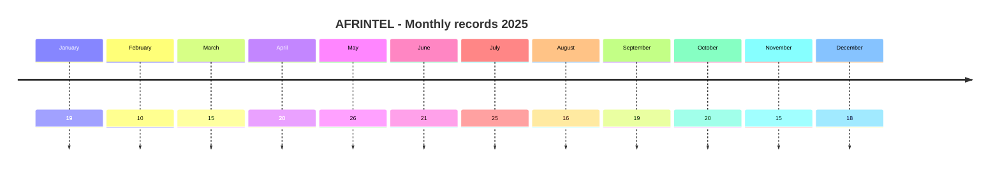
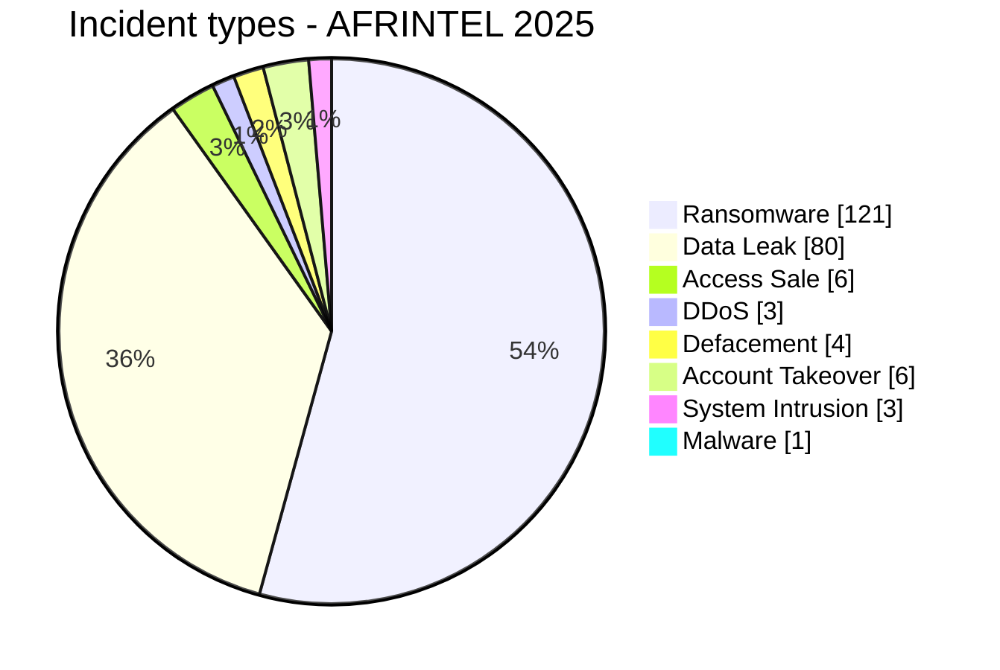

# AFRINTEL Annual CTI Report - Cyber Threats in Africa - 2025

👉🏾 [Version française](./README_FR.md)

   

## 1. Executive summary

In 2025, AFRINTEL documented **224 cyber incidents affecting organizations, institutions, and digital services across 30 African countries**. The corpus highlights a threat landscape largely dominated by **ransomware** and **data leaks**, but also marked by access sales, institutional account takeovers, DDoS attacks, defacements, system intrusions, and malware infections.

**Ransomware remains the most frequently observed threat with 121 records, accounting for 54.0% of the annual corpus**. **Data Leak accounts for 80 records (35.7%)**. Together, these two categories represent **201 of the 224 documented incidents, or 89.7%**. Other recorded events include **6 Access Sale**, **6 Account Takeover**, **4 Defacement**, **3 DDoS**, **3 System Intrusion**, and **1 Malware**. No incident was classified as `Operational Fraud` in the validated annual corpus.

Geographically, activity is strongly concentrated in three countries: **South Africa with 38 incidents, Morocco with 35, and Egypt with 34**. Together, they account for **107 records, or 47.8% of the annual corpus**. Their threat profiles are not identical: South Africa is primarily associated with ransomware publications, while Morocco shows a substantial Data Leak component and also includes several DDoS and access-sale events.

Sector analysis places **Government / Administration first with 51 incidents (22.8%)**, followed by **Finance / Banking with 43 (19.2%)** and **Technology / IT with 20 (8.9%)**. Government and financial organizations together account for **94 records, or 42.0% of the corpus**, confirming their high visibility in the cybercriminal activity monitored during the year.

Activity is relatively balanced between the two halves of the year, with **111 incidents in H1 and 113 in H2**. **May is the busiest month with 26 incidents**, followed by July with 25, while February records 10. This overall balance nevertheless hides significant variation in incident types and affected countries.

From an evidence perspective, the corpus remains heterogeneous. A substantial share of records is based on **claims directly observed on leak sites, underground forums, or other cybercriminal spaces**, sometimes accompanied by data samples. Official confirmations by victims, governments, or competent authorities represent a smaller subset. AFRINTEL therefore systematically distinguishes **what is observed, what is claimed, what is corroborated, and what remains unknown**. A criminal publication, claimed volume, or attribution is not treated as confirmed without sufficient supporting evidence.

The 2025 corpus therefore shows a **diversifying African cyber threat landscape**. Ransomware remains dominant, but the weight of data leaks, access sales, and account compromises confirms that ransomware alone no longer provides an adequate representation of the observed threat environment. This report consequently analyzes the year by **incident type, country, region, sector, actor, and evidence maturity**, while preserving the limitations inherent to a CTI corpus based on publicly or directly observable events.

> **Reading note:** AFRINTEL figures measure documented incidents and the visibility of observed threats. They are not an exhaustive measurement of every compromise that actually occurred across the continent.

👉🏾 [See the annual victim corpus](./victims.md)

## 2. Evolution of the 2025 annual corpus

The former public annual report contained **197 records** and relied on the old six-category taxonomy. Retrospective auditing and AFRINTEL classification revision brings the canonical corpus to **224**, adding **27 records** into their actual 2025 period.

| Indicator | Former 2025 report | Enriched 2025 corpus | Difference |
|---|---:|---:|---:|
| Total incidents | 197 | 224 | **+27 (+13.7%)** |
| Countries covered | 29 | 30 | **+1 (+3.4%)** |
| Ransomware | 121 | 121 | **0 (0.0%)** |
| Data Leak | 73 | 80 | **+7 (+9.6%)** |
| Access Sale | 3 | 6 | **+3 (+100.0%)** |
| DDoS | 0 | 3 | **+3 (new)** |
| Defacement | 0 | 4 | **+4 (new)** |
| Account Takeover | N/A | 6 | **New category** |
| System Intrusion | N/A | 3 | **New category** |
| Malware | N/A | 1 | **New category** |
| Operational Fraud | 0 | 0 | **Stable** |

This does not mean that 27 attacks occurred after the end of 2025. It reflects **retrospective coverage improvement**, integration of missing cases, and the ability to classify events that did not fit the former taxonomy, notably account takeovers, system intrusions, and malware.

Two cases remain under investigation and are **excluded from the 224 canonical incidents** until scope or exact victim identity is sufficiently established.

## 3. Methodology

- **Period:** 1 January through 31 December 2025.
- **Source of truth:** the twelve validated monthly `victims_FR.md` / `victims.md` pairs.
- **Taxonomy:** 9 canonical types: Ransomware, Data Leak, Access Sale, DDoS, Defacement, Account Takeover, System Intrusion, Malware, Operational Fraud.
- **Counting:** one canonical record equals one documented cyber incident; `Under Investigation - Alleged` cases are not counted.
- **Timeline:** `Incident date` and `Initial publication date` are separated. A February disclosure may remain classified in January when evidence places the incident in January.
- **Uncertain dates:** when no exact day is established, the known month or time window is retained; no exact day is invented.
- **Access Sale:** sale-publication timing is separated from the date the access was obtained, which may remain unknown.
- **Sources:** public links are retained for supplementary incidents identified online. They are not retroactively imposed on historical AFRINTEL observations or direct Dark Web observations.
- **Evidence:** incident type, status, confidence, impact, and provenance remain separate dimensions.
- **Sectors:** raw sector labels are normalized once into a controlled annual vocabulary and the same values are rendered in FR and EN.
- **Regions:** six groups preserve comparability with the corrected 2024 annual report: Southern Africa, North Africa, West Africa, East Africa, Central Africa, and Indian Ocean.
- **Limitation:** AFRINTEL measures a documented observable corpus, not every compromise that occurred in Africa.

## 4. Corrected 2024 vs 2025 annual comparison

The final AFRINTEL 2024 baseline contains **119 canonical incidents across 30 African countries**. The 2024 corpus has now undergone chronology review and reclassification under the **same nine incident types** used for 2025. Categories are therefore directly comparable across both years, including valid zero values for 2024.

This harmonization improves comparability, but the changes below still describe **AFRINTEL corpus visibility** rather than an exhaustive measurement of real-world compromise trends across the continent.

### 4.1 Global evolution

| Indicator | Final corrected 2024 | 2025 | Change |
|---|---:|---:|---:|
| Total incidents | 119 | 224 | **+105 (+88.2%)** |
| Countries covered | 30 | 30 | **Stable** |
| Ransomware | 91 | 121 | **+30 (+33.0%)** |
| Data Leak | 13 | 80 | **+67 (+515.4%)** |
| Access Sale | 4 | 6 | **+2 (+50.0%)** |
| DDoS | 2 | 3 | **+1 (+50.0%)** |
| Defacement | 1 | 4 | **+3 (+300.0%)** |
| Account Takeover | 0 | 6 | **+6 (newly observed)** |
| System Intrusion | 7 | 3 | **-4 (-57.1%)** |
| Malware | 0 | 1 | **+1 (newly observed)** |
| Operational Fraud | 1 | 0 | **-1 (-100.0%)** |

The documented annual corpus increases from **119 to 224 incidents**, or **+105 (+88.2%)**. Ransomware rises from 91 to 121 records, while Data Leak increases from 13 to 80. The Data Leak difference is especially large in the corpus, but it requires caution: the 2024 chronology cleanup removed several historical republications that had previously inflated that category.

`Account Takeover`, `System Intrusion`, and `Malware` can now be compared directly because 2024 has been aligned to the same nine-type classification.

### 4.2 H1 and H2

| Period | Final corrected 2024 | 2025 | Change |
|---|---:|---:|---:|
| H1 | 45 | 111 | **+66 (+146.7%)** |
| H2 | 74 | 113 | **+39 (+52.7%)** |
| Year | 119 | 224 | **+105 (+88.2%)** |

The difference is strongest in the first half: **45 incidents in H1 2024 versus 111 in H1 2025**. H2 increases from 74 to 113. These differences measure documented volume across the two harmonized corpora; they do not by themselves demonstrate an equivalent increase in successful real-world compromises.

### 4.3 Evolution of leading countries

| Country | 2024 | 2025 | Change |
|---|---:|---:|---:|
| South Africa | 36 | 38 | **+2 (+5.6%)** |
| Egypt | 14 | 34 | **+20 (+142.9%)** |
| Morocco | 4 | 35 | **+31 (+775.0%)** |
| Algeria | 3 | 19 | **+16 (+533.3%)** |
| Kenya | 4 | 16 | **+12 (+300.0%)** |
| Nigeria | 7 | 15 | **+8 (+114.3%)** |
| Tunisia | 6 | 15 | **+9 (+150.0%)** |

Morocco shows the largest absolute increase in the compared corpus, with **+31 records**, followed by Egypt (+20) and Algeria (+16). South Africa remains comparatively stable in overall volume, from 36 to 38. These differences reflect AFRINTEL visibility, the nature of monitored publications, and available coverage; they should not be interpreted as national compromise rates.

### 4.4 CTI interpretation

Three developments stand out:

1. **The corpus diversifies.** In 2024, **15 of 119 incidents** fall outside Ransomware and Data Leak; in 2025, the figure is **23 of 224**. Account Takeover in particular becomes visible with six records in 2025.
2. **Data Leak becomes much more prominent in the 2025 corpus.** It rises from **13 to 80 records**. This difference combines changes in observable threat activity and coverage; it must not be interpreted as a 515.4% increase in actual African data breaches.
3. **National profiles diverge.** South Africa remains strongly Ransomware-oriented, while Morocco and Algeria show a substantial Data Leak component in 2025.

The 2024-2025 comparison is now **aligned to the same taxonomy and chronology rule**. Methodological caution is still required because visibility, evidence availability, and OSINT/Dark Web coverage can differ between years.

## 5. Monthly evolution

| Month | Total | Ransomware | Data Leak | Access Sale | DDoS | Defacement | Account Takeover | System Intrusion | Malware | Operational Fraud |
|---|---:|---:|---:|---:|---:|---:|---:|---:|---:|---:|
| January | 19 | 16 | 2 | 0 | 0 | 0 | 1 | 0 | 0 | 0 |
| February | 10 | 8 | 0 | 0 | 0 | 0 | 2 | 0 | 0 | 0 |
| March | 15 | 9 | 2 | 1 | 0 | 0 | 2 | 1 | 0 | 0 |
| April | 20 | 7 | 10 | 2 | 1 | 0 | 0 | 0 | 0 | 0 |
| May | 26 | 13 | 9 | 0 | 0 | 2 | 1 | 1 | 0 | 0 |
| June | 21 | 5 | 16 | 0 | 0 | 0 | 0 | 0 | 0 | 0 |
| July | 25 | 5 | 18 | 0 | 0 | 0 | 0 | 1 | 1 | 0 |
| August | 16 | 7 | 5 | 2 | 1 | 1 | 0 | 0 | 0 | 0 |
| September | 19 | 11 | 7 | 0 | 1 | 0 | 0 | 0 | 0 | 0 |
| October | 20 | 16 | 3 | 1 | 0 | 0 | 0 | 0 | 0 | 0 |
| November | 15 | 10 | 4 | 0 | 0 | 1 | 0 | 0 | 0 | 0 |
| December | 18 | 14 | 4 | 0 | 0 | 0 | 0 | 0 | 0 | 0 |
| **2025** | **224** | **121** | **80** | **6** | **3** | **4** | **6** | **3** | **1** | **0** |

H1 contains **111 records** and H2 **113**. The second half exceeds the first by only two records, showing a relatively balanced annual volume despite different monthly profiles.

### 5.1 Monthly volume

| Month | Records | Volume |
|---|---:|---|
| January | 19 | ███████████████████ |
| February | 10 | ██████████ |
| March | 15 | ███████████████ |
| April | 20 | ████████████████████ |
| May | 26 | ██████████████████████████ |
| June | 21 | █████████████████████ |
| July | 25 | █████████████████████████ |
| August | 16 | ████████████████ |
| September | 19 | ███████████████████ |
| October | 20 | ████████████████████ |
| November | 15 | ███████████████ |
| December | 18 | ██████████████████ |

**May is the annual peak with 26 records**, followed by July with 25. February is the lowest-volume month with 10.

## 6. Incident-type distribution

| Incident type | Records | Share |
|---|---:|---:|
| Ransomware | **121** | 54.0% |
| Data Leak | **80** | 35.7% |
| Access Sale | **6** | 2.7% |
| DDoS | **3** | 1.3% |
| Defacement | **4** | 1.8% |
| Account Takeover | **6** | 2.7% |
| System Intrusion | **3** | 1.3% |
| Malware | **1** | 0.4% |
| Operational Fraud | **0** | 0.0% |
| **Total** | **224** | **100%** |

Ransomware and Data Leak together account for **201 of 224 records**, or **89.7%** of the corpus. The remaining 23 records show why AFRINTEL can no longer be reduced to those two categories: access sales, account takeovers, DDoS, defacements, system intrusions, and malware carry distinct operational meaning.

## 7. Country and incident-type distribution

| Country | Total | Ransomware | Data Leak | Access Sale | DDoS | Defacement | Account Takeover | System Intrusion | Malware |
|---|---:|---:|---:|---:|---:|---:|---:|---:|---:|
| South Africa | **38** | 28 | 5 | 1 | 0 | 1 | 1 | 1 | 1 |
| Morocco | **35** | 12 | 19 | 1 | 2 | 1 | 0 | 0 | 0 |
| Egypt | **34** | 27 | 5 | 1 | 1 | 0 | 0 | 0 | 0 |
| Algeria | **19** | 4 | 15 | 0 | 0 | 0 | 0 | 0 | 0 |
| Kenya | **16** | 8 | 4 | 0 | 0 | 1 | 3 | 0 | 0 |
| Nigeria | **15** | 9 | 5 | 0 | 0 | 0 | 0 | 1 | 0 |
| Tunisia | **15** | 6 | 8 | 0 | 0 | 0 | 0 | 1 | 0 |
| Mauritania | **8** | 0 | 8 | 0 | 0 | 0 | 0 | 0 | 0 |
| Ghana | **5** | 2 | 2 | 0 | 0 | 0 | 1 | 0 | 0 |
| Zambia | **4** | 4 | 0 | 0 | 0 | 0 | 0 | 0 | 0 |
| Tanzania | **4** | 3 | 0 | 0 | 0 | 0 | 1 | 0 | 0 |
| Ivory Coast | **4** | 1 | 2 | 0 | 0 | 1 | 0 | 0 | 0 |
| Namibia | **3** | 3 | 0 | 0 | 0 | 0 | 0 | 0 | 0 |
| Uganda | **2** | 2 | 0 | 0 | 0 | 0 | 0 | 0 | 0 |
| Botswana | **2** | 2 | 0 | 0 | 0 | 0 | 0 | 0 | 0 |
| Senegal | **2** | 1 | 0 | 1 | 0 | 0 | 0 | 0 | 0 |
| Togo | **2** | 0 | 1 | 1 | 0 | 0 | 0 | 0 | 0 |
| Mauritius | **2** | 2 | 0 | 0 | 0 | 0 | 0 | 0 | 0 |
| Zimbabwe | **2** | 2 | 0 | 0 | 0 | 0 | 0 | 0 | 0 |
| Congo (DRC) | **2** | 1 | 1 | 0 | 0 | 0 | 0 | 0 | 0 |
| Burkina Faso | **1** | 0 | 0 | 1 | 0 | 0 | 0 | 0 | 0 |
| Rwanda | **1** | 1 | 0 | 0 | 0 | 0 | 0 | 0 | 0 |
| Cameroon | **1** | 1 | 0 | 0 | 0 | 0 | 0 | 0 | 0 |
| Djibouti | **1** | 0 | 1 | 0 | 0 | 0 | 0 | 0 | 0 |
| Eritrea | **1** | 0 | 1 | 0 | 0 | 0 | 0 | 0 | 0 |
| Burundi | **1** | 0 | 1 | 0 | 0 | 0 | 0 | 0 | 0 |
| Seychelles | **1** | 0 | 1 | 0 | 0 | 0 | 0 | 0 | 0 |
| Angola | **1** | 0 | 1 | 0 | 0 | 0 | 0 | 0 | 0 |
| Madagascar | **1** | 1 | 0 | 0 | 0 | 0 | 0 | 0 | 0 |
| Gabon | **1** | 1 | 0 | 0 | 0 | 0 | 0 | 0 | 0 |
| **Total** | **224** | **121** | **80** | **6** | **3** | **4** | **6** | **3** | **1** |
> `Operational Fraud = 0` in the canonical 2025 corpus; the column is omitted for readability.

South Africa leads with **38 records**, including **28 Ransomware**. Morocco has **35**, with a profile led by **19 Data Leak** plus 12 Ransomware, 1 Access Sale, 2 DDoS, and 1 Defacement. Egypt totals **34**, including 27 Ransomware.

Kenya stands out for profile diversity: 8 Ransomware, 4 Data Leak, 3 Account Takeover, and 1 Defacement.

## 8. Regional distribution

| Region | Total | Share | Ransomware | Data Leak | Access Sale | DDoS | Defacement | Account Takeover | System Intrusion | Malware |
|---|---:|---:|---:|---:|---:|---:|---:|---:|---:|---:|
| North Africa | **103** | 46.0% | 49 | 47 | 2 | 3 | 1 | 0 | 1 | 0 |
| Southern Africa | **50** | 22.3% | 39 | 6 | 1 | 0 | 1 | 1 | 1 | 1 |
| West Africa | **37** | 16.5% | 13 | 18 | 3 | 0 | 1 | 1 | 1 | 0 |
| East Africa | **26** | 11.6% | 14 | 7 | 0 | 0 | 1 | 4 | 0 | 0 |
| Central Africa | **4** | 1.8% | 3 | 1 | 0 | 0 | 0 | 0 | 0 | 0 |
| Indian Ocean | **4** | 1.8% | 3 | 1 | 0 | 0 | 0 | 0 | 0 | 0 |
| **Total** | **224** | **100%** | **121** | **80** | **6** | **3** | **4** | **6** | **3** | **1** |

**North Africa accounts for 103 records (46.0%)**. Southern Africa has 50, West Africa 37, and East Africa 26. Central Africa and the Indian Ocean each contain 4.

Regional composition differs sharply: Southern Africa remains primarily Ransomware-oriented, while North Africa combines near-equal Ransomware and Data Leak volumes and contains all three documented DDoS campaigns.

## 9. Normalized sector distribution

| Normalized sector | Records | Share | Activity |
|---|---:|---:|---|
| Government / Administration | 51 | 22.8% | ██████████████████████████ |
| Finance / Banking | 43 | 19.2% | ██████████████████████ |
| Technology / IT | 20 | 8.9% | ██████████ |
| Education / University | 18 | 8.0% | █████████ |
| Healthcare / Medical | 14 | 6.2% | ███████ |
| Transport / Logistics | 10 | 4.5% | █████ |
| Professional / Business Services | 9 | 4.0% | ████ |
| Not specified | 9 | 4.0% | ████ |
| Telecommunications | 9 | 4.0% | ████ |
| Manufacturing / Industry | 8 | 3.6% | ████ |
| Retail / E-commerce | 7 | 3.1% | ████ |
| Construction / Real Estate | 7 | 3.1% | ████ |
| Agriculture / Agribusiness | 4 | 1.8% | ██ |
| Mining | 4 | 1.8% | ██ |
| Media / Entertainment | 3 | 1.3% | ██ |
| Defense / Security | 3 | 1.3% | ██ |
| Energy / Utilities | 3 | 1.3% | ██ |
| Hospitality / Tourism | 1 | 0.4% | █ |
| Legal | 1 | 0.4% | █ |
| **Total** | **224** | **100%** | |
> Visual scale: approximately 1 `█` block per 2 records. Numeric values are authoritative.

Government / Administration ranks first with **51 records (22.8%)**, followed by Finance / Banking with **43 (19.2%)**. Together these sectors account for **94 records**, or **42.0%** of the corpus.

Nine records remain `Not specified` in annual sector aggregation. The value is retained when a more precise normalization cannot be defended from the available label.

## 10. Actor / group profile

Labels with at least three records are shown. `Unknown` represents missing attribution and must not be interpreted as a threat actor.

| Actor / Group | Records | Activity |
|---|---:|---|
| Unknown | 19 | ███████████████████ |
| qilin | 11 | ███████████ |
| nightspire | 10 | ██████████ |
| devman | 10 | ██████████ |
| incransom | 8 | ████████ |
| funksec | 7 | ███████ |
| Phantom Atlas | 7 | ███████ |
| killsec | 6 | ██████ |
| kill9 | 6 | ██████ |
| Dark 07x Team | 5 | █████ |
| ransomhub | 4 | ████ |
| warlock | 4 | ████ |
| mrdump | 4 | ████ |
| clop | 4 | ████ |
| spacebears | 3 | ███ |
| GDLockerSec | 3 | ███ |
| babuk2 | 3 | ███ |
| arcusmedia | 3 | ███ |
| lynx | 3 | ███ |
| dragonforce | 3 | ███ |
| Keymous | 3 | ███ |
| TheGentlemen | 3 | ███ |
| lockbit5 | 3 | ███ |

`qilin` is the most frequent identified actor label with **11 records**, followed by `nightspire` and `devman` with 10 each. Frequency reflects labels in the corpus, not common technical attribution across every victim or proof of a single campaign.

## 11. Evidence maturity

The following table groups record statuses for annual readability. This is an **analytical report grouping**; the detailed original statuses remain preserved in victim records.

| Analytical grouping | Records | Share |
|---|---:|---:|
| Claim - Unverified | 100 | 44.6% |
| Claim - Data Sample Published | 88 | 39.3% |
| Data Fully Published | 10 | 4.5% |
| Victim/Government/Authority Confirmed | 14 | 6.2% |
| Corroborated / Secondary evidence | 10 | 4.5% |
| Attempted | 2 | 0.9% |
| **Total** | **224** | **100%** |

The first two categories account for **188 records**. A substantial part of the corpus therefore relies on directly observed claims or claims accompanied by samples, without automatically confirming initial access, complete exfiltration, or claimed volumes.

The **14 victim/government/authority confirmations** are records whose structured status reflects explicit institutional confirmation. The 10 `Corroborated / Secondary evidence` records rely on stronger independent or secondary evidence than an isolated claim without necessarily reaching official confirmation.

## 12. Annual CTI analysis by incident type

### 12.1 Ransomware - 121 records

Ransomware remains the largest type at **54.0%**. South Africa has 28 Ransomware records, Egypt 27, Morocco 12, Nigeria 9, and Kenya 8.

A victim listing on a leak site does not itself prove encryption. AFRINTEL should continue to track the victim listing, sample, deadline, disclosure, and victim confirmation as separate lifecycle elements.

### 12.2 Data Leak - 80 records

Data Leak represents **35.7%** of the corpus. Morocco leads with 19, followed by Algeria with 15, Mauritania and Tunisia with 8 each, then South Africa, Nigeria, and Egypt with 5.

Growth in this category versus the corrected 2024 corpus is one of the clearest structural changes.

### 12.3 Access Sale - 6 records

The six Access Sale records involve Burkina Faso, Senegal, Morocco, Togo, Egypt, and South Africa, with one each.

An access sale documents an offer or claim of access. It does not automatically prove data exfiltration or access to the victim's entire internal infrastructure. Where the access-acquisition date is unknown, AFRINTEL keeps it separate from the sale-publication date.

### 12.4 DDoS - 3 records

Documented DDoS campaigns concern Morocco twice and Egypt once. This category counts documented campaigns, not necessarily every individual domain targeted within a campaign.

### 12.5 Defacement - 4 records

Defacement records involve South Africa, Ivory Coast, Morocco, and Kenya. Visible unauthorized content modification is not converted into Data Leak without separate evidence of data exposure.

### 12.6 Account Takeover - 6 records

Kenya accounts for 3 Account Takeover records. South Africa, Ghana, and Tanzania have one each. This category now represents compromised X, Facebook, YouTube, or other institutional accounts without forcing them into `Defacement`.

### 12.7 System Intrusion - 3 records

The three System Intrusion records involve South Africa, Nigeria, and Tunisia. The type is used where system access or attempted access is documented but a more specific type such as Data Leak or Ransomware is not sufficiently supported.

### 12.8 Malware - 1 record

One Malware record is documented in South Africa. The type is used when malicious software is explicitly identified and the event is not better described as Ransomware.

### 12.9 Operational Fraud - 0 records

No `Operational Fraud` is present in the canonical 2025 corpus. This does not imply that cyber-enabled fraud did not occur in Africa; it means no validated annual record uses `Operational Fraud` as its primary type.

## 13. Leading countries by incident type

### 13.1 Top 10 Ransomware

| Rank | Country | Records |
|---:|---|---:|
| 1 | South Africa | **28** |
| 2 | Egypt | **27** |
| 3 | Morocco | **12** |
| 4 | Nigeria | **9** |
| 5 | Kenya | **8** |
| 6 | Tunisia | **6** |
| 7 | Algeria | **4** |
| 8 | Zambia | **4** |
| 9 | Namibia | **3** |
| 10 | Tanzania | **3** |

The top ten countries account for **104 of 121 Ransomware records**, or **86.0%** of the annual Ransomware corpus.

### 13.2 Top 10 Data Leak

| Rank | Country | Records |
|---:|---|---:|
| 1 | Morocco | **19** |
| 2 | Algeria | **15** |
| 3 | Mauritania | **8** |
| 4 | Tunisia | **8** |
| 5 | South Africa | **5** |
| 6 | Nigeria | **5** |
| 7 | Egypt | **5** |
| 8 | Kenya | **4** |
| 9 | Ghana | **2** |
| 10 | Ivory Coast | **2** |

Data Leak follows a different geography: Morocco and Algeria together account for **34 of 80 Data Leak records**, or **42.5%**.

### 13.3 Other incident types

| Type | Country distribution | Total |
|---|---|---:|
| Access Sale | Burkina Faso (1), Senegal (1), Morocco (1), Togo (1), Egypt (1), South Africa (1) | **6** |
| DDoS | Morocco (2), Egypt (1) | **3** |
| Defacement | South Africa (1), Ivory Coast (1), Morocco (1), Kenya (1) | **4** |
| Account Takeover | Kenya (3), South Africa (1), Ghana (1), Tanzania (1) | **6** |
| System Intrusion | South Africa (1), Nigeria (1), Tunisia (1) | **3** |
| Malware | South Africa (1) | **1** |

Type-level analysis reveals distinct national profiles. A single global cyberattack ranking by country would hide this operational diversity.

## 14. Trends and intelligence gaps

### 14.1 Observed trends

- **Taxonomy diversification:** 23 records fall outside Ransomware and Data Leak.
- **North Africa weight:** 103 records, or 46.0% of the annual corpus.
- **Sector concentration:** Government / Administration and Finance / Banking account for 42.0% combined.
- **Distinct national profiles:** South Africa is highly Ransomware-oriented, while Morocco and Algeria show a stronger Data Leak component.
- **Account Takeover is now visible:** six events that were difficult to represent cleanly in the old taxonomy now have a dedicated type.
- **Access sales remain distinct from leaks:** six Access Sale records are counted separately, avoiding unsupported conversion of an access offer into assumed exfiltration.

### 14.2 Intelligence gaps

- Initial-access vectors remain unknown in many records.
- Exact technical compromise dates are not always public; some records only support a month or time window.
- Leak-site and forum volumes are not always fully verifiable.
- Nine records remain sectorally `Not specified` after normalization.
- Public remediation details, DFIR conclusions, and root-cause reporting remain limited for a substantial portion of the corpus.
- Two additional cases remain outside statistics in `PENDING_VALIDATION_2025.md`.

These gaps should guide future collection rather than being replaced with assumptions presented as facts.

## 15. 2026 monitoring priorities

This section is a **qualitative projection based only on the 2025 baseline**. It uses no actual 2026 statistics.

Priorities include:

- persistence of Ransomware publications targeting South Africa and Egypt;
- continued Data Leak exposure in Morocco, Algeria, Tunisia, and Mauritania;
- evolution of Access Sale into other observable stages such as reuse, exfiltration, or extortion;
- institutional account takeovers used for fraud, disinformation, or scams;
- DDoS campaigns against government and telecommunications services;
- multi-actor victim records to distinguish new intrusion, republication, resale, or reuse of older data;
- improved availability of evidence through samples, official confirmations, regulatory notices, and DFIR reporting.

## 16. Recommendations

### 16.1 Organizations

- enforce phishing-resistant MFA on privileged accounts, VPN, email, social media, and administration applications;
- apply PAM, least privilege, network segmentation, and secret rotation;
- maintain immutable backups and regularly test restoration;
- strengthen public applications, APIs, and administrative interfaces;
- formalize data-breach notification and response processes.

### 16.2 SOC and detection

- monitor abnormal authentication, MFA changes, and account takeover indicators;
- detect mass database reads, unusual exports, archive creation, and large outbound transfers;
- correlate EDR, IAM, VPN, WAF, proxy, DNS, cloud, and application logs;
- monitor creation of privileged accounts, role changes, and access from unusual locations;
- distinguish DDoS availability events from internal intrusion indicators to avoid unsupported conclusions.

## 17. Conclusion

AFRINTEL documents **224 cyber incidents in Africa in 2025**, across **30 countries** and nine AFRINTEL taxonomy categories. Ransomware remains dominant with 121 records, but 80 Data Leak records and dedicated categories such as Account Takeover, System Intrusion, and Malware show why the observed landscape can no longer be represented accurately by the old six-type taxonomy.

Compared with the final 2024 baseline (**119 incidents**), documented volume in 2025 rises by **88.2%** to 224 incidents. This should be interpreted as evolution in observable corpus coverage, not as an exhaustive measurement of an 88.2% increase in real-world compromises across the continent.

The 2025 report therefore becomes a richer baseline, preserving monthly, geographic, regional, sectoral, actor, incident-type, and evidence-level granularity while keeping a strict separation between observed facts, claims, corroboration, and unknowns.

**AFRINTEL** - TLP:CLEAR
