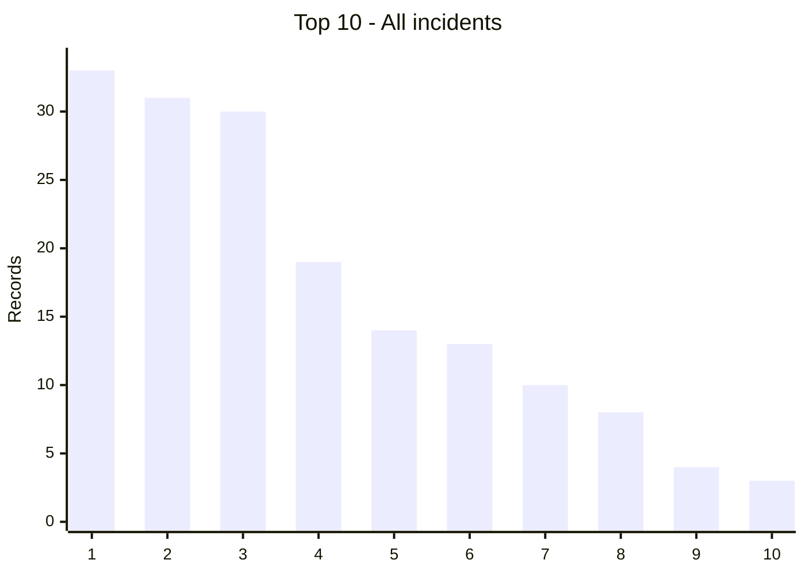
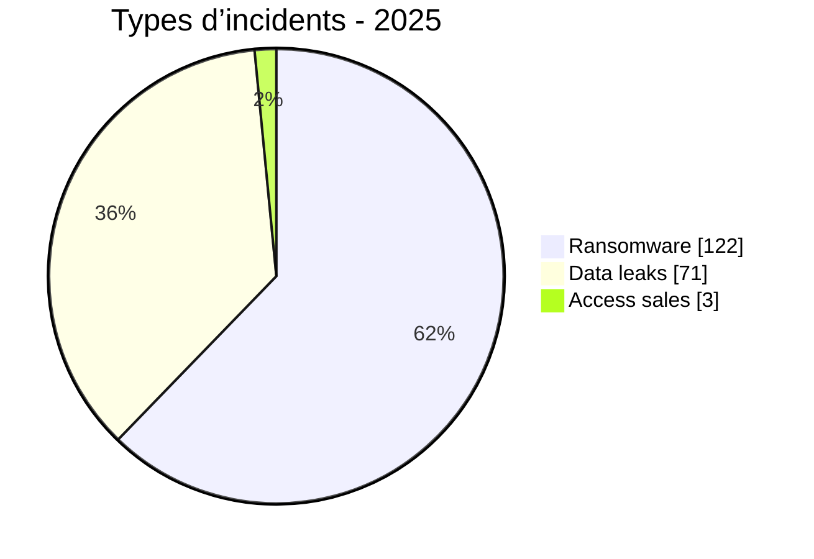
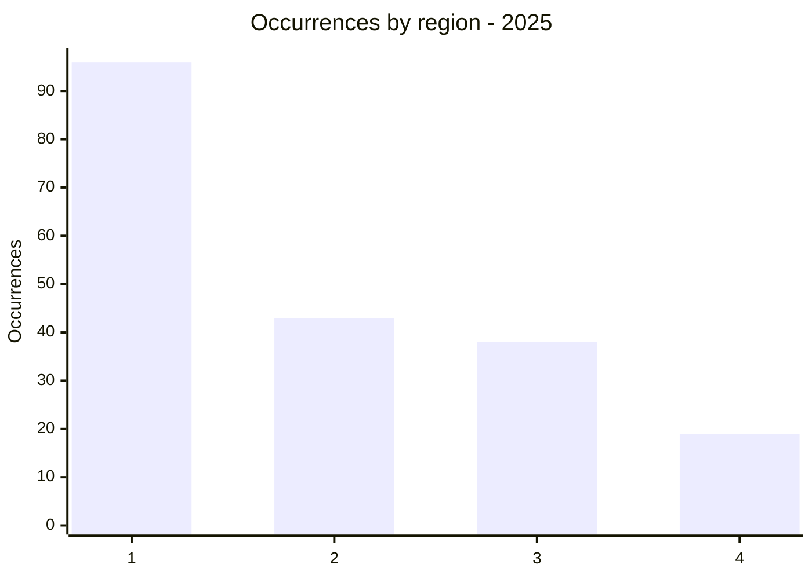
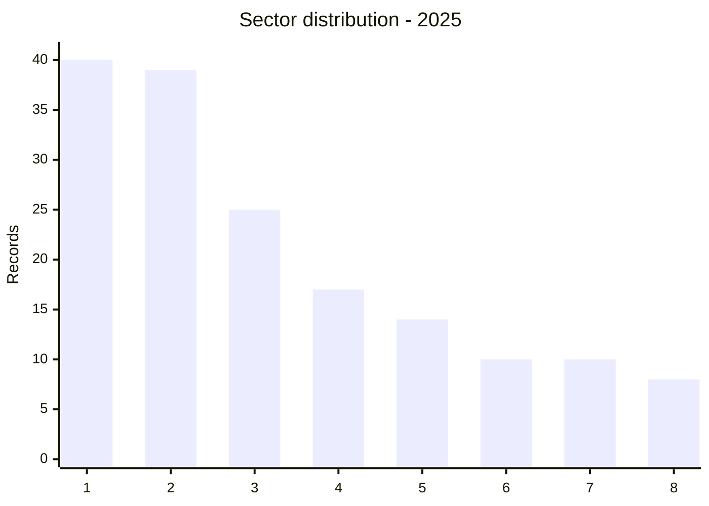
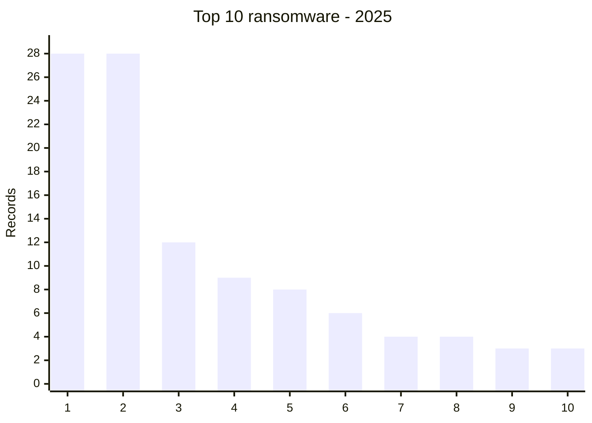
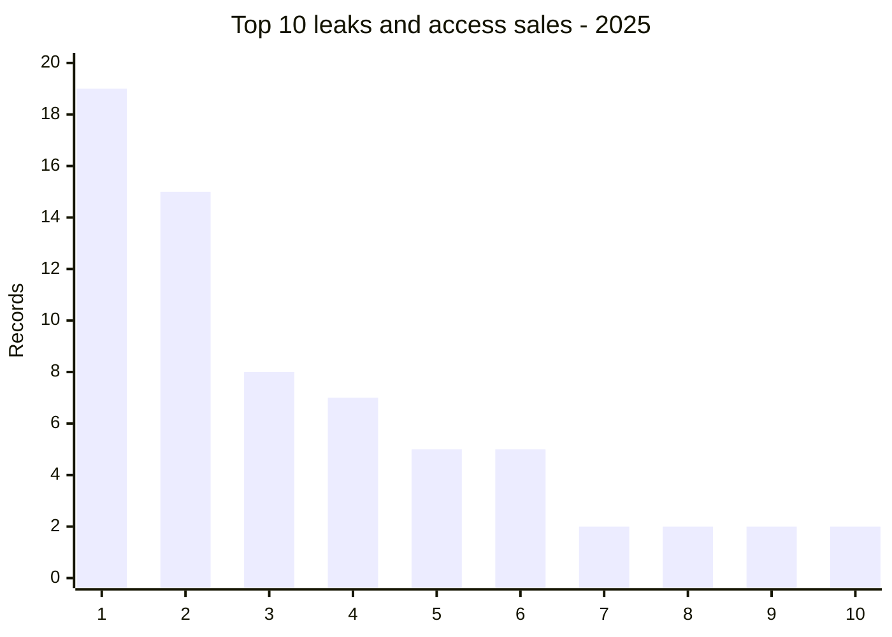
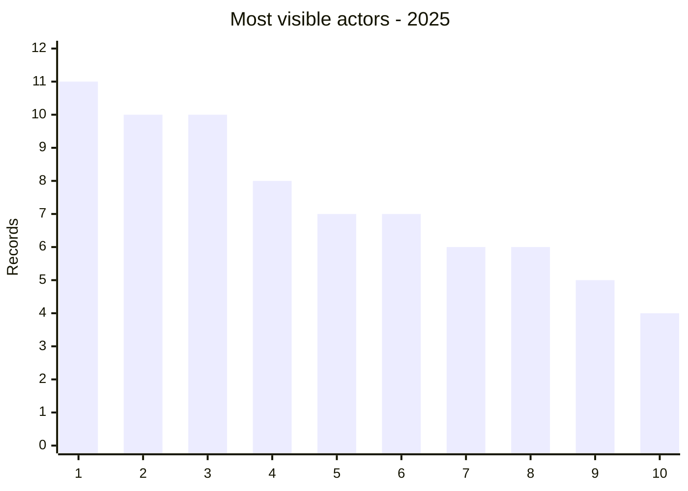

# AFRINTEL global annual CTI report - 2025

👉🏾 [French version](./README_FR.md)

  

---
## 1. Executive summary

AFRINTEL recorded **196 records**: **122 ransomware**, **71 data leaks**, **3 access sales** and **0 defacements**.

## 2. Methodology

The twelve monthly files are the source of truth. A record is a documented publication or claim. Unconfirmed publications remain claims.

## 3. Global overview

| Indicator | Value |
| :--- | ---: |
| Records | **196** |
| Ransomware | **122 (62,2%)** |
| Data leaks | **71 (36,2%)** |
| Access sales | **3 (1,5%)** |

### Country ranking

| Rank | Country | Records | Chart |
| :--- | ---: | ---: | ---: |
| 1 | 🇪🇬 Egypt | 33 | █████████████████████████████████ |
| 2 | 🇲🇦 Morocco | 31 | ███████████████████████████████ |
| 3 | 🇿🇦 South Africa | 30 | ██████████████████████████████ |
| 4 | 🇩🇿 Algeria | 19 | ███████████████████ |
| 5 | 🇳🇬 Nigeria | 14 | ██████████████ |
| 6 | 🇹🇳 Tunisia | 13 | █████████████ |
| 7 | 🇰🇪 Kenya | 10 | ██████████ |
| 8 | 🇲🇷 Mauritania | 8 | ████████ |
| 9 | 🇿🇲 Zambia | 4 | ████ |
| 10 | 🇬🇭 Ghana | 3 | ███ |
| 11 | 🇨🇮 Ivory Coast | 3 | ███ |
| 12 | 🇳🇦 Namibia | 3 | ███ |
| 13 | 🇹🇿 Tanzania | 3 | ███ |
| 14 | 🇧🇼 Botswana | 2 | ██ |
| 15 | 🇨🇩 Congo (DRC) | 2 | ██ |
| 16 | 🇲🇺 Mauritius | 2 | ██ |
| 17 | 🇸🇳 Senegal | 2 | ██ |
| 18 | 🇹🇬 Togo | 2 | ██ |
| 19 | 🇺🇬 Uganda | 2 | ██ |
| 20 | 🇿🇼 Zimbabwe | 2 | ██ |
| 21 | 🇦🇴 Angola | 1 | █ |
| 22 | 🇧🇫 Burkina Faso | 1 | █ |
| 23 | 🇨🇲 Cameroon | 1 | █ |
| 24 | 🇩🇯 Djibouti | 1 | █ |
| 25 | 🇪🇷 Eritrea | 1 | █ |
| 26 | 🇬🇦 Gabon | 1 | █ |
| 27 | 🇲🇬 Madagascar | 1 | █ |
| 28 | 🇷🇼 Rwanda | 1 | █ |

### Incident type distribution

| Type | Records | Share |
| :--- | ---: | ---: |
| Ransomware | 122 | 62,2% |
| Data leak | 71 | 36,2% |
| Access sale | 3 | 1,5% |
| **Total** | **196** | **100%** |

### Ransomware, leaks and access sales by country

| Country | Ransomware | Data leaks | Access sales | Total | Barre | Distribution |
| :--- | ---: | ---: | ---: | ---: | ---: | ---: |
| 🇪🇬 Egypt | 28 | 5 | 0 | 33 | █████████████████████████████████ | 🟧🟧🟧🟧🟧🟧🟧🟧🟧🟧🟧🟧🟧🟧🟧🟧🟧🟧🟧🟧🟧🟧🟧🟧🟧🟧🟧🟧 🟦🟦🟦🟦🟦 |
| 🇲🇦 Morocco | 12 | 19 | 0 | 31 | ███████████████████████████████ | 🟧🟧🟧🟧🟧🟧🟧🟧🟧🟧🟧🟧 🟦🟦🟦🟦🟦🟦🟦🟦🟦🟦🟦🟦🟦🟦🟦🟦🟦🟦🟦 |
| 🇿🇦 South Africa | 28 | 2 | 0 | 30 | ██████████████████████████████ | 🟧🟧🟧🟧🟧🟧🟧🟧🟧🟧🟧🟧🟧🟧🟧🟧🟧🟧🟧🟧🟧🟧🟧🟧🟧🟧🟧🟧 🟦🟦 |
| 🇩🇿 Algeria | 4 | 15 | 0 | 19 | ███████████████████ | 🟧🟧🟧🟧 🟦🟦🟦🟦🟦🟦🟦🟦🟦🟦🟦🟦🟦🟦🟦 |
| 🇳🇬 Nigeria | 9 | 5 | 0 | 14 | ██████████████ | 🟧🟧🟧🟧🟧🟧🟧🟧🟧 🟦🟦🟦🟦🟦 |
| 🇹🇳 Tunisia | 6 | 7 | 0 | 13 | █████████████ | 🟧🟧🟧🟧🟧🟧 🟦🟦🟦🟦🟦🟦🟦 |
| 🇰🇪 Kenya | 8 | 2 | 0 | 10 | ██████████ | 🟧🟧🟧🟧🟧🟧🟧🟧 🟦🟦 |
| 🇲🇷 Mauritania | 0 | 8 | 0 | 8 | ████████ | 🟦🟦🟦🟦🟦🟦🟦🟦 |
| 🇿🇲 Zambia | 4 | 0 | 0 | 4 | ████ | 🟧🟧🟧🟧 |
| 🇬🇭 Ghana | 2 | 1 | 0 | 3 | ███ | 🟧🟧 🟦 |
| 🇨🇮 Ivory Coast | 1 | 2 | 0 | 3 | ███ | 🟧 🟦🟦 |
| 🇳🇦 Namibia | 3 | 0 | 0 | 3 | ███ | 🟧🟧🟧 |
| 🇹🇿 Tanzania | 3 | 0 | 0 | 3 | ███ | 🟧🟧🟧 |
| 🇧🇼 Botswana | 2 | 0 | 0 | 2 | ██ | 🟧🟧 |
| 🇨🇩 Congo (DRC) | 1 | 1 | 0 | 2 | ██ | 🟧 🟦 |
| 🇲🇺 Mauritius | 2 | 0 | 0 | 2 | ██ | 🟧🟧 |
| 🇸🇳 Senegal | 1 | 0 | 1 | 2 | ██ | 🟧 🟦 |
| 🇹🇬 Togo | 0 | 1 | 1 | 2 | ██ | 🟦🟦 |
| 🇺🇬 Uganda | 2 | 0 | 0 | 2 | ██ | 🟧🟧 |
| 🇿🇼 Zimbabwe | 2 | 0 | 0 | 2 | ██ | 🟧🟧 |
| 🇦🇴 Angola | 0 | 1 | 0 | 1 | █ | 🟦 |
| 🇧🇫 Burkina Faso | 0 | 0 | 1 | 1 | █ | 🟦 |
| 🇨🇲 Cameroon | 1 | 0 | 0 | 1 | █ | 🟧 |
| 🇩🇯 Djibouti | 0 | 1 | 0 | 1 | █ | 🟦 |
| 🇪🇷 Eritrea | 0 | 1 | 0 | 1 | █ | 🟦 |
| 🇬🇦 Gabon | 1 | 0 | 0 | 1 | █ | 🟧 |
| 🇲🇬 Madagascar | 1 | 0 | 0 | 1 | █ | 🟧 |
| 🇷🇼 Rwanda | 1 | 0 | 0 | 1 | █ | 🟧 |

### Geographic distribution by region

| Region | Occurrences | Ransomware | Leaks / access | Chart | Distribution |
| :--- | ---: | ---: | ---: | ---: |
| North Africa | 96 | 50 | 46 | ██████████ | 🟧🟧🟧🟧🟧🟧🟧🟧🟧🟧🟧🟧🟧🟧🟧🟧🟧🟧🟧🟧🟧🟧🟧🟧🟧🟧🟧🟧🟧🟧🟧🟧🟧🟧🟧🟧🟧🟧🟧🟧🟧🟧🟧🟧🟧🟧🟧🟧🟧🟧 🟦🟦🟦🟦🟦🟦🟦🟦🟦🟦🟦🟦🟦🟦🟦🟦🟦🟦🟦🟦🟦🟦🟦🟦🟦🟦🟦🟦🟦🟦🟦🟦🟦🟦🟦🟦🟦🟦🟦🟦🟦🟦🟦🟦🟦🟦 |
| Southern Africa | 43 | 41 | 2 | ████ | 🟧🟧🟧🟧🟧🟧🟧🟧🟧🟧🟧🟧🟧🟧🟧🟧🟧🟧🟧🟧🟧🟧🟧🟧🟧🟧🟧🟧🟧🟧🟧🟧🟧🟧🟧🟧🟧🟧🟧🟧🟧 🟦🟦 |
| West and Central Africa | 38 | 16 | 22 | ████ | 🟧🟧🟧🟧🟧🟧🟧🟧🟧🟧🟧🟧🟧🟧🟧🟧 🟦🟦🟦🟦🟦🟦🟦🟦🟦🟦🟦🟦🟦🟦🟦🟦🟦🟦🟦🟦🟦🟦 |
| East Africa | 19 | 15 | 4 | ██ | 🟧🟧🟧🟧🟧🟧🟧🟧🟧🟧🟧🟧🟧🟧🟧 🟦🟦🟦🟦 |

Legend: 1 = North Africa; 2 = Southern Africa; 3 = West and Central Africa; 4 = East Africa

### Sector distribution

| Normalized sector | Records | Share | Chart |
| :--- | ---: | ---: | ---: |
| Government / Administration | 40 | 20,4% | ██████████ |
| Finance / Banking | 39 | 19,9% | ██████████ |
| Technology / IT | 25 | 12,8% | ██████ |
| Education / University | 17 | 8,7% | ████ |
| Healthcare / Medical | 14 | 7,1% | ████ |
| Manufacturing / Industry | 10 | 5,1% | ██ |
| Transport / Logistics | 10 | 5,1% | ██ |
| Retail / E-commerce | 8 | 4,1% | ██ |
| Professional / Business Services | 7 | 3,6% | ██ |
| Construction / Real Estate | 6 | 3,1% | ██ |
| Defense / Security | 6 | 3,1% | ██ |
| Energy / Utilities | 4 | 2,0% | █ |
| Agriculture / Agribusiness | 3 | 1,5% | █ |
| Legal / Justice | 2 | 1,0% | █ |
| Mining | 2 | 1,0% | █ |
| Not specified | 2 | 1,0% | █ |
| Civil Society / NGO | 1 | 0,5% | █ |

Legend: 1 = Technology; 2 = Finance; 3 = Education; 4 = Government; 5 = Retail; 6 = Healthcare; 7 = Manufacturing; 8 = Professional services

### Incident-type charts

Legend: 1 = Egypt; 2 = South Africa; 3 = Morocco; 4 = Nigeria; 5 = Kenya; 6 = Tunisia; 7 = Algeria; 8 = Zambia; 9 = Namibia; 10 = Tanzania

Legend: 1 = Morocco; 2 = Algeria; 3 = Mauritania; 4 = Tunisia; 5 = Egypt; 6 = Nigeria; 7 = Ivory Coast; 8 = Kenya; 9 = South Africa; 10 = Togo

## 4. Detailed analysis by incident type

Ransomware claims represent 122 records. Leaks and access sales represent 74 records and include administrative, financial, healthcare, education and business data.

## 5. Sectoral impact

Government, finance, technology and education account for a substantial share of the records.

## 6. Threat actor profile and risk assessment

| Actor / source | Records |
| :--- | ---: |
| qilin | 11 |
| nightspire | 10 |
| devman | 10 |
| incransom | 8 |
| funksec | 7 |
| Phantom Atlas | 7 |
| killsec | 6 |
| kill9 | 6 |
| Dark 07x Team | 5 |
| ransomhub | 4 |

| Country | Level |
| :--- | ---: |
| 🇪🇬 Egypt | 🔴 High |
| 🇲🇦 Morocco | 🔴 High |
| 🇿🇦 South Africa | 🔴 High |
| 🇩🇿 Algeria | 🔴 High |
| 🇳🇬 Nigeria | 🔴 High |

### Most visible actors chart

Legend: 1 = qilin; 2 = nightspire; 3 = devman; 4 = incransom; 5 = funksec; 6 = Phantom Atlas; 7 = killsec; 8 = kill9; 9 = Dark 07x Team; 10 = ransomhub

## 7. Key trends and intelligence gaps

Main gaps are independent confirmation, actual dataset size and the relationship between repeated claims.

## 8. Contextual MITRE ATT&CK mapping

| Phase | Technique | Context |
| :--- | ---: | ---: |
| Impact | T1486 - Data Encrypted for Impact | Ransomware |
| Exfiltration | T1567 - Exfiltration Over Web Service | Leaks and extortion |
| Credential access | T1078 - Valid Accounts | Access claims |

## 9. Recommendations

- Validate claims with logs, EDR, IAM and backups.
- Enforce MFA, segmentation, offline backups and secret rotation.

## 10. SOC and tactical recommendations

- Correlate EDR, VPN, IAM, DNS, proxy, WAF and application logs.

## 11. Strategic recommendations

- Maintain an asset inventory and test response and restoration plans.

## 12. Conclusion

These figures describe publications observed by AFRINTEL and support monitoring and defensive prioritisation.

**AFRINTEL** - TLP:CLEAR
