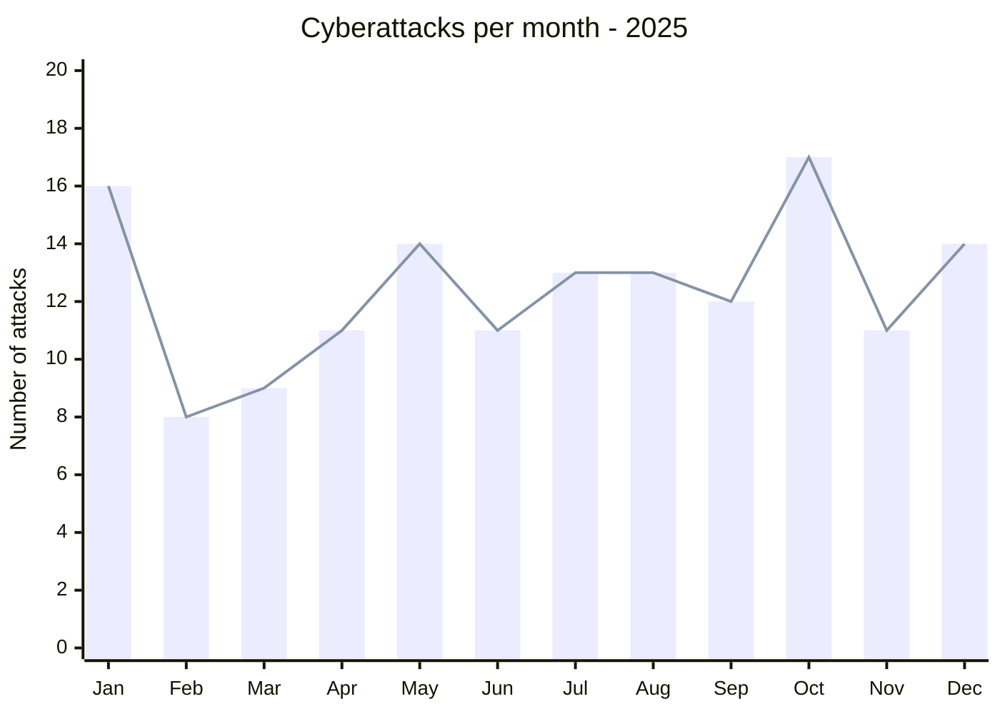
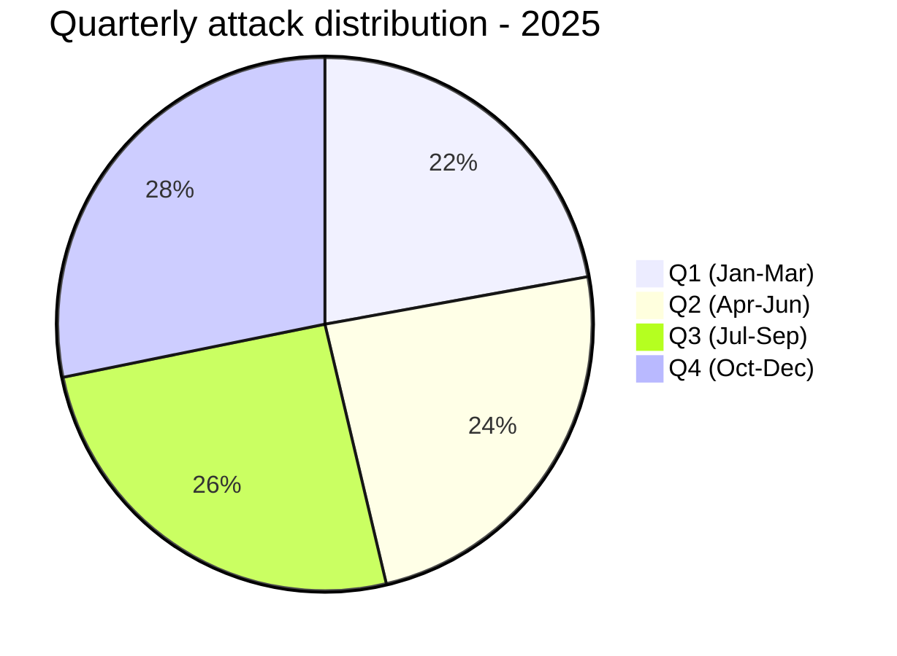
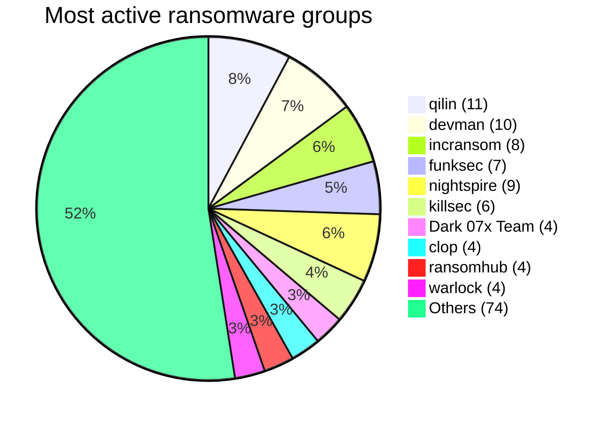
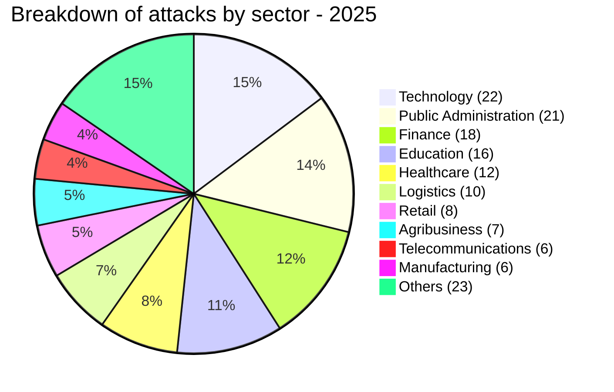
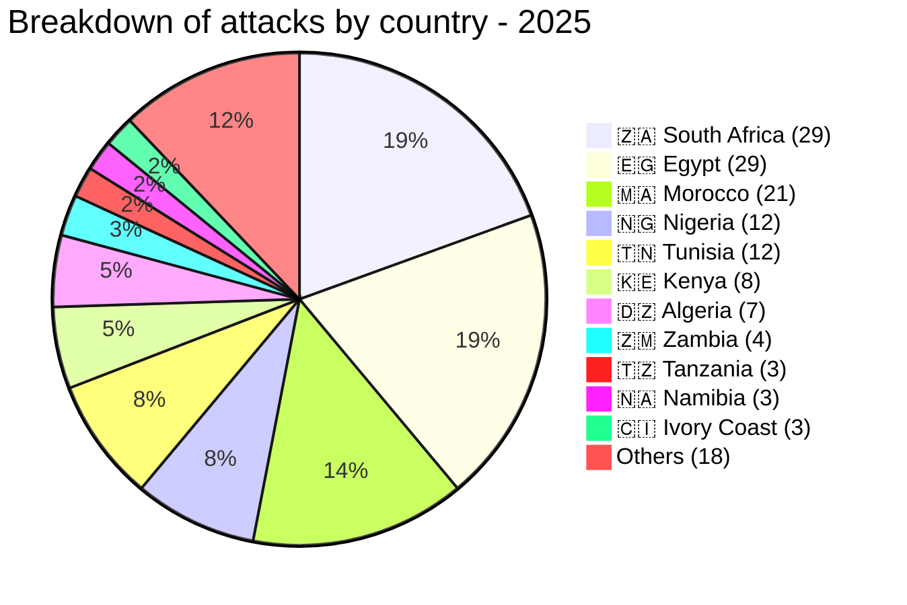
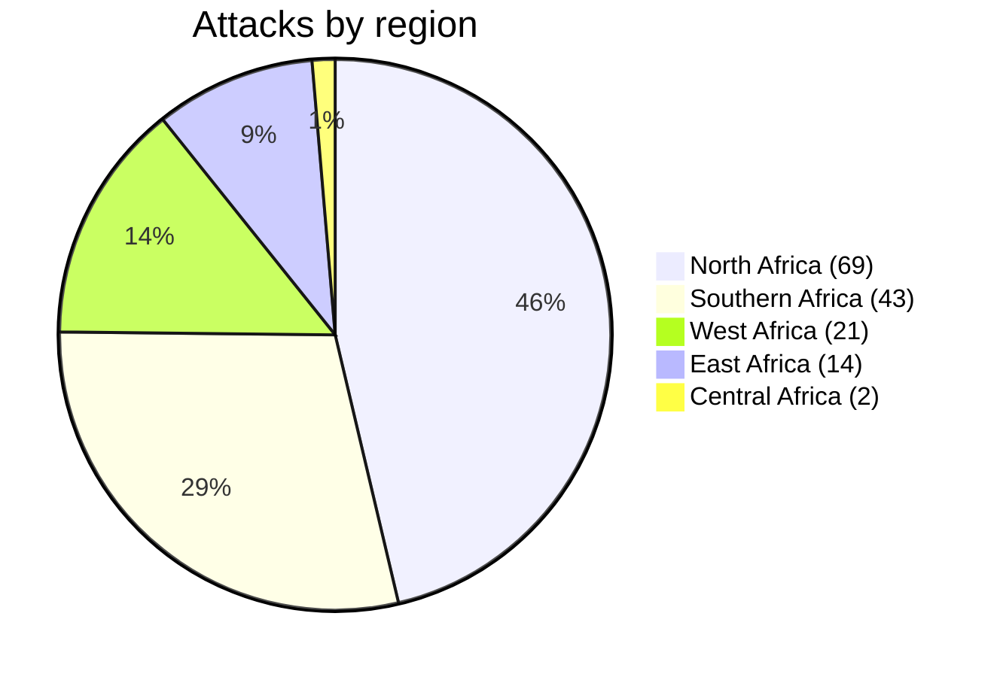

# AFRINTEL - Annual Report 2025: Cyber Attacks in Africa
👉🏾 [**French version available here**](./README_FR.md)

## 1. Introduction
This report provides a comprehensive overview of ransomware and data‑leak attacks targeting African organisations during 2025. All incidents were collected from OSINT sources, ransomware leak sites, and underground forums as part of the AFRINTEL open‑source CTI initiative.

The dataset comprises **149 publicly claimed attacks** affecting **146 unique victims** - three organisations were hit twice by different ransomware groups. The analysis covers monthly trends, threat actors, affected sectors, geographical distribution, and key tactics, techniques and procedures (TTPs).

## 2. Executive Summary
- **Total claims:** 149 (146 unique victims, 3 double claims)
- **Most active month:** October (17 claims)
- **Least active month:** February (8 claims)
- **Most prolific groups:** qilin (11), devman (10), nightspire (9)
- **Most targeted countries:** South Africa & Egypt (29 each), Morocco (21)
- **Most targeted sectors:** Technology (22), Public Administrations (21), Finance (18)
- **Largest exfiltration:** NSSF Kenya - 2.5 TB (devman)
- **Highest ransom demand:** NSSF Kenya - $4.5 million

👉🏾 [**Victims list** ](./victims.md)
## 3. Monthly breakdown
| Month | Jan | Feb | Mar | Apr | May | Jun | Jul | Aug | Sep | Oct | Nov | Dec | **Total** |
| :--- | :---: | :---: | :---: | :---: | :---: | :---: | :---: | :---: | :---: | :---: | :---: | :---: | :---: |
| **Cyberattacks** | 16 | 8 | 9 | 11 | 14 | 11 | 13 | 13 | 12 | 17 | 11 | 14 | **149** |

### 3.1 Quarterly evolution
| Quarter | Months | Attacks | Total |
| :--- | :--- | :---: | :---: |
| **Q1** | Jan-Mar | 16 + 8 + 9 | **33** |
| **Q2** | Apr-Jun | 11 + 14 + 11 | **36** |
| **Q3** | Jul-Sep | 13 + 13 + 12 | **38** |
| **Q4** | Oct-Dec | 17 + 11 + 14 | **42** |

The first quarter (Jan-Mar) saw 33 attacks, followed by 36 in Q2, 38 in Q3 and a peak of 42 in Q4.

## 4. Most active ransomware groups
| Rank | Group            | Claims |
|------|------------------|--------|
| 1    | qilin            | 11     |
| 2    | devman           | 10     |
| 3    | incransom        | 8      |
| 4    | funksec          | 7      |
| 4    | nightspire       | 9      |
| 6    | killsec          | 6      |
| 7    | Dark 07x Team    | 4      |
| 8    | clop             | 4      |
| 8    | ransomhub        | 4      |
| 8    | warlock          | 4      |
| 11   | arcusmedia       | 3      |
| 11   | babuk2           | 3      |
| 11   | dragonforce      | 3      |
| 11   | GDLockerSec      | 3      |
| 11   | lockbit5         | 3      |
| 11   | spacebears       | 3      |
| 11   | thegentlemen     | 3      |
|      | *Other groups*   | 61     |

- **qilin** became the most active actor in the second half of the year, hitting energy, insurance and technology targets across East and Southern Africa.
- **devman** remained a persistent threat, especially in South Africa and Kenya, and claimed the year’s largest data theft (NSSF Kenya, 2.5 TB).
- **incransom** was active throughout the year, often exfiltrating large volumes (100 GB, 39 GB) from logistics and financial companies.

## 5. Most targeted sectors
| Sector                     | Claims |
|----------------------------|--------|
| Technology                 | 22     |
| Public Administrations     | 21     |
| Finance                    | 18     |
| Education                  | 16     |
| Healthcare                 | 12     |
| Logistics                  | 10     |
| Retail                     | 8      |
| Agribusiness               | 7      |
| Telecommunications         | 6      |
| Manufacturing              | 6      |
| *Other sectors*            | 23     |

 
The technology sector was hit hardest, followed closely by government bodies and financial institutions. Critical infrastructure (energy, transport, defence) also suffered several attacks.

## 6. Most targeted countries
| Rank | Country            | Claims |
|------|--------------------|--------|
| 1    | 🇿🇦 South Africa   | 29     |
| 1    | 🇪🇬 Egypt          | 29     |
| 3    | 🇲🇦 Morocco        | 21     |
| 4    | 🇳🇬 Nigeria        | 12     |
| 4    | 🇹🇳 Tunisia        | 12     |
| 6    | 🇰🇪 Kenya          | 8      |
| 7    | 🇩🇿 Algeria        | 7      |
| 8    | 🇿🇲 Zambia         | 4      |
| 9    | 🇹🇿 Tanzania       | 3      |
| 9    | 🇳🇦 Namibia        | 3      |
| 9    | 🇨🇮 Ivory Coast  | 3      |
| 12   | 🇬🇭 Ghana          | 2      |
| 12   | 🇺🇬 Uganda         | 2      |
| 12   | 🇧🇼 Botswana       | 2      |
| 12   | 🇹🇬 Togo           | 2      |
| 12   | 🇿🇼 Zimbabwe       | 2      |
| 12   | 🇲🇺 Mauritius      | 2      |
| 18   | 🇲🇬 Madagascar     | 1      |
| 18   | 🇨🇩 DRC            | 1      |
| 18   | 🇬🇦 Gabon          | 1      |
| 18   | 🇨🇲 Cameroon       | 1      |
| 18   | 🇸🇳 Senegal        | 1      |
| 18   | 🇷🇼 Rwanda         | 1      |

South Africa and Egypt were equally the most heavily targeted nations, accounting for nearly 40 % of all attacks. North Africa (Egypt, Morocco, Algeria, Tunisia) together represented 69 attacks (46 %), while Southern Africa (South Africa, Zambia, Namibia, Botswana, Zimbabwe, Mauritius, Madagascar) contributed 43 attacks (29 %).

## 7. Notable incidents
| Victim | Country | Group | Data volume | Ransom |
|--------|---------|-------|-------------|--------|
| NSSF Kenya | 🇰🇪 Kenya | devman | 2.5 TB | $4.5M |
| INTELS Nigeria | 🇳🇬 Nigeria | ransomhub | 1.5 TB | - |
| DGID Senegal | 🇸🇳 Senegal | BlackShrantac | 1 TB | - |
| SPEED Co | 🇪🇬 Egypt | hunter | 444.8 GB | - |
| INI Investments | 🇪🇬 Egypt | nightspire | 400 GB | - |

- **Double claims** (same victim, different groups):
  - Hopital La Rabta (Tunisia) - devman (12 Dec) & qilin (26 Dec)
  - Netstar South Africa - devman (23 May) & incransom (20 Aug)
  - Proplastics Limited (Zimbabwe) - thegentlemen (9 Sep) & lockbit5 (26 Dec)

## 8. Regional distribution
| Region          | Claims | Share |
|-----------------|--------|-------|
| North Africa    | 69     | 46.3 % |
| Southern Africa | 43     | 28.9 % |
| West Africa     | 21     | 14.1 % |
| East Africa     | 14     | 9.4 %  |
| Central Africa  | 2      | 1.3 %  |

## 9. Observed TTPs
- **Massive data exfiltration** - many groups exfiltrated hundreds of gigabytes or even terabytes before encryption.
- **Double extortion** - nearly all attacks were accompanied by data leaks on dedicated TOR sites.
- **SQL injection** - used against several web applications (e.g., Yasat, New Era Com) to dump databases.
- **Critical infrastructure targeting** - energy (KenGen, Uganda Electricity), transport (SAA, Madagascar Airlines), and defence (Nigerian Navy) were hit.
- **Hacktivist involvement** - groups like DieNet, Phantom Atlas, Dark 07x Team claimed politically motivated leaks.
- **Repeat victimisation** - three organisations were attacked twice by different ransomware groups.

## 10. Recommendations
- **Sector‑specific measures**:
  - **Technology** - implement robust input validation, WAF, and regular penetration testing.
  - **Public administration** - enforce multi‑factor authentication, offline backups, and continuous monitoring.
  - **Finance** - segment networks, encrypt sensitive data, and monitor for unusual access patterns.
  - **Energy & transport** - adopt advanced threat detection and incident response plans.
- **General**:
  - Conduct regular employee awareness training (phishing remains a primary initial access vector).
  - Maintain isolated, offline backups.
  - Share indicators of compromise (IoCs) across regional CSIRTs.

## 11. Conclusion
2025 was a year of sustained ransomware activity across Africa, with a clear trend toward high‑volume data theft and double extortion. South Africa and Egypt bore the brunt, but no region was spared. The rise of groups like qilin, devman and incransom, together with the diversification of targets (from critical infrastructure to insurtech startups), underscores the need for proactive threat intelligence and cross‑border cooperation.

👉🏾 [**Victims list** ](./victims.md)
## ✍🏿 Author
*Adama ASSIONGBON*  
*SOC & Cyber Threat Intelligence Consultant*  
[LinkedIn Profile](https://www.linkedin.com/in/adama-assiongbon-9029893a/)

---
*AFRINTEL - Open CTI Monitoring Initiative on Africa*
