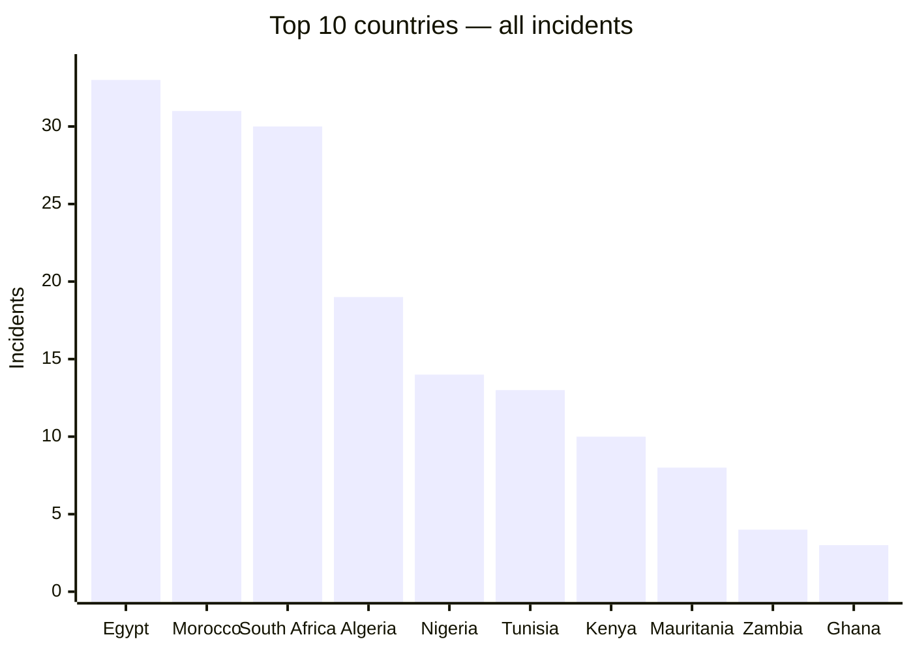
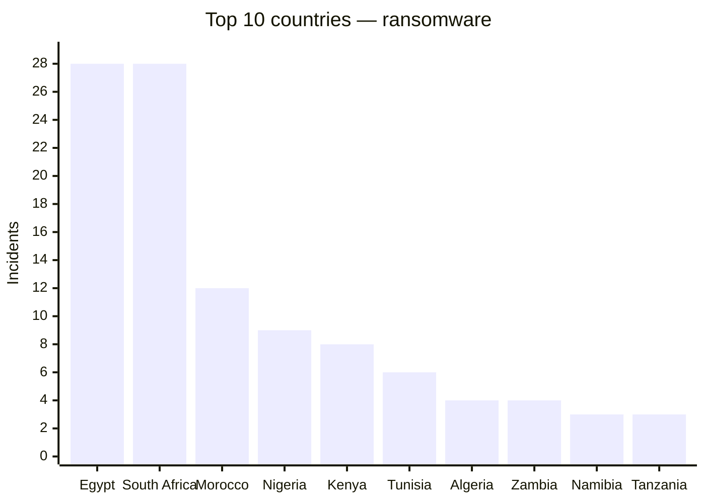
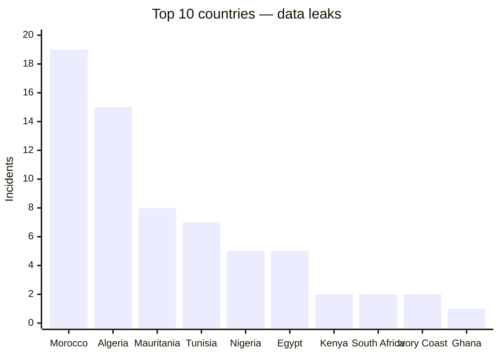

# AFRINTEL global annual CTI report — 2025

This report tracks the public visibility of cyberattacks against African organisations in 2025. Figures are recalculated from the monthly victim cards, claims counted as they appear in those sources, nothing more.

👉🏾 [French version](./README_FR.md)

## 1. Global overview

**196 records** in total: **122 ransomware**, **71 data leaks**, **3 access sales**, **0 defacements**, and 0 left without an explicit incident classification.

This ranking measures public visibility in AFRINTEL's sources, not the true scale of every attack that happened.

## Methodology

The figures come from the annual victim cards, compiled from the monthly files. A record is a documented publication or claim, not necessarily a unique victim. Forum and leak-site posts stay claims when nothing independently confirms them.

## 2. Overall ranking by country

| Country | Incidents |
|---|---:|
| 🇪🇬 Egypt | 33 |
| 🇲🇦 Morocco | 31 |
| 🇿🇦 South Africa | 30 |
| 🇩🇿 Algeria | 19 |
| 🇳🇬 Nigeria | 14 |
| 🇹🇳 Tunisia | 13 |
| 🇰🇪 Kenya | 10 |
| 🇲🇷 Mauritania | 8 |
| 🇿🇲 Zambia | 4 |
| 🇬🇭 Ghana | 3 |
| 🇨🇮 Ivory Coast | 3 |
| 🇳🇦 Namibia | 3 |
| 🇹🇿 Tanzania | 3 |
| 🇧🇼 Botswana | 2 |
| 🇨🇩 Congo (DRC) | 2 |
| 🇲🇺 Mauritius | 2 |
| 🇸🇳 Senegal | 2 |
| 🇹🇬 Togo | 1 |
| 🇺🇬 Uganda | 2 |
| 🇿🇼 Zimbabwe | 2 |
| 🇦🇴 Angola | 1 |
| 🇧🇫 Burkina Faso | 1 |
| 🇨🇲 Cameroon | 1 |
| 🇩🇯 Djibouti | 1 |
| 🇪🇷 Eritrea | 1 |
| 🇬🇦 Gabon | 1 |
| 🇲🇬 Madagascar | 1 |
| 🇷🇼 Rwanda | 1 |

## 3. Ransomware ranking by country

| Country | Ransomware incidents |
|---|---:|
| 🇪🇬 Egypt | 28 |
| 🇿🇦 South Africa | 28 |
| 🇲🇦 Morocco | 12 |
| 🇳🇬 Nigeria | 9 |
| 🇰🇪 Kenya | 8 |
| 🇹🇳 Tunisia | 6 |
| 🇩🇿 Algeria | 4 |
| 🇿🇲 Zambia | 4 |
| 🇳🇦 Namibia | 3 |
| 🇹🇿 Tanzania | 3 |

### Top 10 ransomware

| Country | Ransomware incidents |
|---|---:|
| 🇪🇬 Egypt | 28 |
| 🇿🇦 South Africa | 28 |
| 🇲🇦 Morocco | 12 |
| 🇳🇬 Nigeria | 9 |
| 🇰🇪 Kenya | 8 |
| 🇹🇳 Tunisia | 6 |
| 🇩🇿 Algeria | 4 |
| 🇿🇲 Zambia | 4 |
| 🇳🇦 Namibia | 3 |
| 🇹🇿 Tanzania | 3 |

## 4. Most visible ransomware groups

| Group | Incidents |
|---|---:|
| qilin | 11 |
| devman | 10 |
| incransom | 8 |
| nightspire | 8 |
| funksec | 7 |
| killsec | 6 |
| clop | 4 |
| ransomhub | 4 |
| warlock | 4 |
| GDLockerSec | 3 |
| arcusmedia | 3 |
| babuk2 | 3 |
| dragonforce | 3 |
| lockbit5 | 3 |
| lynx | 3 |
| spacebears | 3 |
| thegentlemen | 3 |
| akira | 2 |
| blackshrantac | 2 |
| direwolf | 2 |
| nova | 2 |
| obscura | 2 |
| radar | 2 |
| ransomhouse | 2 |
| tengu | 2 |
| Datacarry | 1 |
| Wieko | 1 |
| apt73 | 1 |
| arkana | 1 |
| beast | 1 |
| benzona | 1 |
| brotherhood | 1 |
| cicada3301 | 1 |
| crypto24 | 1 |
| d4rk4rmy | 1 |
| everest | 1 |
| flocker | 1 |
| fog | 1 |
| gunra | 1 |
| hunter | 1 |
| kazu | 1 |
| medusa | 1 |
| play | 1 |
| stormous | 1 |
| worldleaks | 1 |
| yurei | 1 |

## 5. Data-leak ranking by country

| Country | Data leaks |
|---|---:|
| 🇲🇦 Morocco | 19 |
| 🇩🇿 Algeria | 15 |
| 🇲🇷 Mauritania | 8 |
| 🇹🇳 Tunisia | 7 |
| 🇪🇬 Egypt | 5 |
| 🇳🇬 Nigeria | 5 |
| 🇨🇮 Ivory Coast | 2 |
| 🇰🇪 Kenya | 2 |
| 🇿🇦 South Africa | 2 |
| 🇹🇬 Togo | 1 |
| 🇦🇴 Angola | 1 |
| 🇨🇩 Congo (DRC) | 1 |
| 🇩🇯 Djibouti | 1 |
| 🇪🇷 Eritrea | 1 |
| 🇬🇭 Ghana | 1 |

### Top 10 data leaks

| Country | Data leaks |
|---|---:|
| 🇲🇦 Morocco | 19 |
| 🇩🇿 Algeria | 15 |
| 🇲🇷 Mauritania | 8 |
| 🇹🇳 Tunisia | 7 |
| 🇪🇬 Egypt | 5 |
| 🇳🇬 Nigeria | 5 |
| 🇨🇮 Ivory Coast | 2 |
| 🇰🇪 Kenya | 2 |
| 🇿🇦 South Africa | 2 |
| 🇹🇬 Togo | 1 |

## Sector distribution

Sectors here are consolidated into a common vocabulary. Where a victim card didn't give enough to work with, the sector is recorded as not specified.

| Normalized sector | Incidents |
|---|---:|
| Government / Administration | 40 |
| Finance / Banking | 39 |
| Technology / IT | 25 |
| Education / University | 17 |
| Healthcare / Medical | 14 |
| Transport / Logistics | 10 |
| Manufacturing / Industry | 10 |
| Retail / E-commerce | 8 |
| Professional / Business Services | 7 |
| Defense / Security | 6 |
| Construction / Real Estate | 6 |
| Energy / Utilities | 4 |
| Agriculture / Agribusiness | 3 |
| Mining | 2 |
| Legal / Justice | 2 |
| Not specified | 2 |
| Civil Society / NGO | 1 |

## 6. Actors or sources associated with data leaks

| Actor / source | Leaks |
|---|---:|
| Phantom Atlas | 7 |
| kill9 | 6 |
| Dark 07x Team | 5 |
| Keymous | 3 |
| Unknown | 3 |
| B4baYega | 2 |
| Evil_BYTE_Officiel | 2 |
| Jabaroot DZ | 2 |
| KaruHunters | 2 |
| Not specified | 2 |
| mrdump, post published on a cybercriminal forum (DarkForums) | 2 |
| nightspire | 2 |
| 0x0day, post published on the cybercriminal forum DarkForums | 1 |
| BIGBROTHER | 1 |
| Chucky_BF | 1 |
| DBhacker_BF | 1 |
| EternalRed | 1 |
| Fire Wire | 1 |
| Gh1nDar | 1 |
| GhostCrawl | 1 |
| GhostVector (source account) | 1 |
| Hepd | 1 |
| KILLUAX | 1 |
| KickingPigs | 1 |
| Killer_Bee | 1 |
| LindaBF, post published on a cybercriminal forum (RaidForums) | 1 |
| MdHackersArmy (post published by Doxeur23azi on a cybercriminal forum, DarkForums) | 1 |
| Mercobyte | 1 |
| MisterSam | 1 |
| N1KA | 1 |
| RL000 | 1 |
| RainbowDF | 1 |
| RiseAgainLuigi & B4baYega | 1 |
| Spirigatito, post published on a cybercriminal forum | 1 |
| TajineSec / Tajinesec_MA (publication claim) | 1 |
| Tanaka | 1 |
| anisanas2 | 1 |
| cache | 1 |
| camillabf, post published on a cybercriminal forum (RaidForums) | 1 |
| mrdump (Telegram channel "Server dump") | 1 |
| mrdump (publication on the Telegram channel \"Server dump\") | 1 |
| oblivion666 | 1 |
| p4xar | 1 |
| privilege | 1 |
| privilege, post published on a cybercriminal forum | 1 |
| sanji_shi5 (source account) | 1 |

## Visualisations

The charts show the ten leading countries; the preceding tables retain the complete rankings.

## 7. CTI reading

Ransomware dominates on sheer volume, but data leaks tell a different story, usually a forum post with a SQL dump or a document sample attached rather than a leak-site listing. Claimed volumes, whether an archive is authentic, and whether repeated claims are actually linked: none of that can be settled here, it has to be checked card by card.

## 8. Cautions

Leak sites and underground forums are treated as claim sources, nothing more. Where a card has no independent confirmation, this report doesn't present the intrusion as established fact. No raw personal data is reproduced anywhere in it.

**AFRINTEL** — TLP:CLEAR
