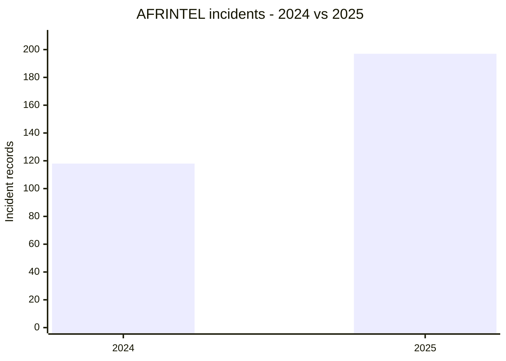
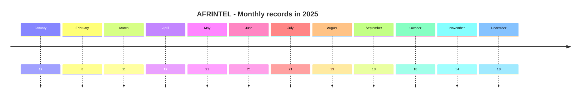
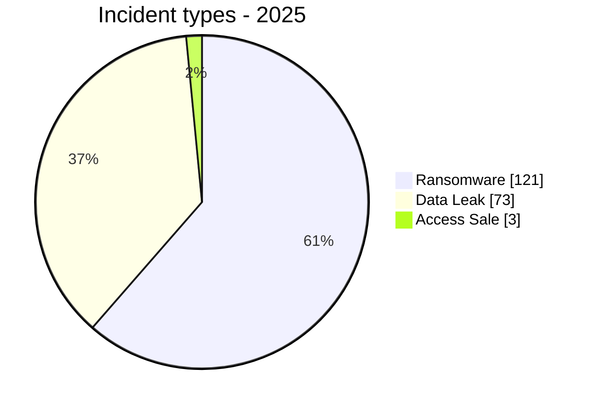
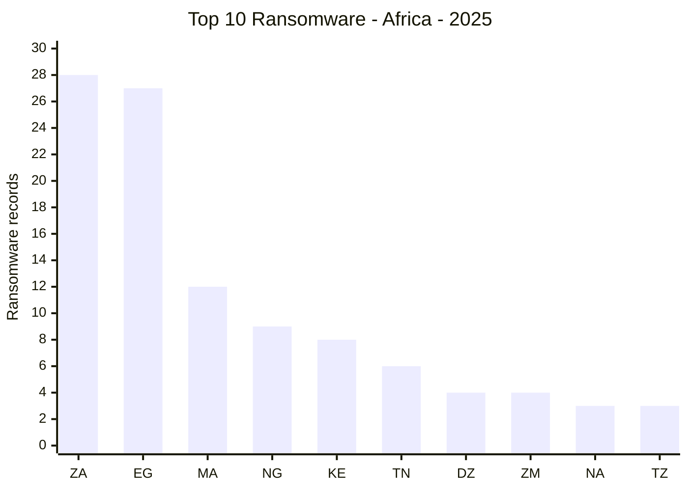
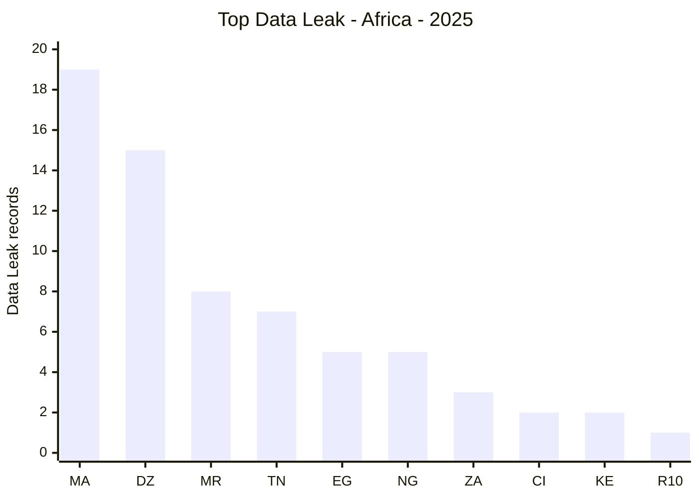

# AFRINTEL global annual CTI report - 2025

👉🏾 [French version](./README_FR.md)

   

## 1. Executive summary

AFRINTEL documented **197 incident records from January through December 2025**: **121 Ransomware (61.4%)**, **73 Data Leak (37.1%)** and **3 Access Sale (1.5%)**. No DDoS, Defacement or Operational Fraud record appears in the validated monthly corpus.

The annual total remains 197, but the composition changes after monthly harmonization. The January North-West University record is now included as a Data Leak, while the October MeamarGroup republication is excluded from the annual unique-incident count because the harmonized source links it to the same underlying compromise already recorded in September.

The most represented countries are **Egypt (32)**, **Morocco (31)** and **South Africa (31)**. The leading actor labels are **qilin (11)**, **nightspire (10)** and **devman (10)**. Government / Administration (**40**) and Finance / Banking (**39**) remain the two leading annual sectors.

These figures describe AFRINTEL's observed corpus and do not turn a criminal claim into a confirmed compromise.

## 2. Corrections from the previous annual version

| Indicator | Previous | Harmonized |
|---|---:|---:|
| Total records | 197 | **197** |
| Ransomware | 122 | **121** |
| Data Leak | 72 | **73** |
| Access Sale | 3 | **3** |
| Egypt | 33 | **32** |
| South Africa | 30 | **31** |
| North Africa | 96 | **95** |
| Southern Africa | 43 | **44** |
| Education / University | 17 | **18** |
| Construction / Real Estate | 6 | **5** |

The January NWU addition adds one Data Leak record. The October MeamarGroup deduplication removes one Ransomware record. The two changes offset each other on the annual total but change the detailed distributions.

## 3. Methodology

- Period strictly limited to **1 January through 31 December 2025**.
- Source of truth: the twelve harmonized monthly victim files for 2025.
- One harmonized monthly card equals one annual record.
- A republication is removed only when the harmonized source explicitly links it to the same underlying incident with sufficient confidence.
- Taxonomy: Ransomware, Data Leak, Access Sale, DDoS, Defacement, Operational Fraud.
- Claims, samples, full publications and independent corroboration remain separate evidence levels.
- The controlled annual sector vocabulary from the previous annual report is retained, with only source-supported harmonization corrections.

## 4. Annual comparison: 2024 vs 2025

This comparison uses the **tabular counts from the AFRINTEL 2024 annual report** and the **197 harmonized 2025 records**.

> **2024 methodology note:** the 2024 report contains several presentation inconsistencies between prose, tables and some older charts. For this comparison, the reference values are the annual and monthly table counts: **118 incidents, 86 Ransomware, 29 Data Leak and 3 Access Sale**. H1 2024 is recalculated as **48** from the six monthly rows, rather than 47 as stated in one executive-summary sentence.

### 4.1 Overall evolution

| Indicator | 2024 | 2025 | Change |
|---|---:|---:|---:|
| Total incidents | 118 | 197 | **+79 (+66.9%)** |
| Countries covered | 27 | 29 | **+2 (+7.4%)** |
| Ransomware | 86 | 121 | **+35 (+40.7%)** |
| Data Leak | 29 | 73 | **+44 (+151.7%)** |
| Access Sale | 3 | 3 | **0 (stable)** |
| Defacement | 0 | 0 | **0 (stable)** |

The documented corpus increases by **79 records**, or **66.9%**, between the two years.

### 4.2 Change in incident structure

| Type | 2024 share | 2025 share | Share change |
|---|---:|---:|---:|
| Ransomware | 72.9% | 61.4% | **-11.5 pp** |
| Data Leak | 24.6% | 37.1% | **+12.5 pp** |
| Access Sale | 2.5% | 1.5% | **-1.0 pp** |

Ransomware remains the leading category in absolute volume, increasing from **86 to 121 records**. Its relative share nevertheless falls from **72.9% to 61.4%** because Data Leak grows much faster.

Data Leak increases from **29 to 73**, or **151.7%**. Its annual share rises from **24.6% to 37.1%**, the largest structural change between the two years.

Access Sale remains at **3 records**. Its relative share falls mechanically from 2.5% to 1.5% as the overall corpus expands.

### 4.3 First half and second half

| Period | 2024 | 2025 | Change |
|---|---:|---:|---:|
| H1 | 48 | 95 | **+47 (+97.9%)** |
| H2 | 70 | 102 | **+32 (+45.7%)** |
| Full year | 118 | 197 | **+79 (+66.9%)** |

Growth is especially strong in the first half: H1 2025 contains almost twice as many records as H1 2024. H2 also rises, but more moderately.

The 2024 monthly peak is **15 records**, reached in August and November. In 2025, the monthly maximum reaches **21 records**, in May, June and July.

### 4.4 Evolution of leading countries

| Country | 2024 | 2025 | Change |
|---|---:|---:|---:|
| South Africa | 30 | 31 | **+1 (+3.3%)** |
| Egypt | 14 | 32 | **+18 (+128.6%)** |
| Morocco | 5 | 31 | **+26 (+520.0%)** |
| Algeria | 7 | 19 | **+12 (+171.4%)** |
| Nigeria | 7 | 14 | **+7 (+100.0%)** |
| Tunisia | 6 | 13 | **+7 (+116.7%)** |

The change is not uniform. **South Africa remains almost stable in total volume, from 30 to 31 records**, while Egypt, Morocco, Algeria, Nigeria and Tunisia increase substantially in the observed corpus.

The largest change concerns **Morocco**, which rises from **5 to 31 records**, largely driven by Data Leak in 2025. Egypt increases from 14 to 32 and Algeria from 7 to 19.

### 4.5 CTI interpretation

Three findings stand out:

1. **AFRINTEL's documented volume increases substantially**, but this measures change in the observed corpus first. It does not by itself establish an equivalent increase in the real number of compromises across Africa.
2. **The incident mix becomes more diversified**: Ransomware remains dominant, but Data Leak becomes much more prominent in 2025.
3. **Country dynamics diverge**: South Africa remains strongly ransomware-oriented, while Morocco and Algeria show a marked rise in Data Leak.

A strict sector-by-sector year-on-year delta is not presented because the annual sector-normalization schemes are not identical across the two reports. Sector counts remain available separately in each annual report.

## 5. Monthly evolution

| Month | Total | Ransomware | Data Leak | Access Sale | DDoS | Defacement | Operational Fraud |
|---|---:|---:|---:|---:|---:|---:|---:|
| January | 17 | 16 | 1 | 0 | 0 | 0 | 0 |
| February | 8 | 8 | 0 | 0 | 0 | 0 | 0 |
| March | 11 | 9 | 1 | 1 | 0 | 0 | 0 |
| April | 17 | 7 | 9 | 1 | 0 | 0 | 0 |
| May | 21 | 13 | 8 | 0 | 0 | 0 | 0 |
| June | 21 | 5 | 16 | 0 | 0 | 0 | 0 |
| July | 21 | 5 | 16 | 0 | 0 | 0 | 0 |
| August | 13 | 7 | 5 | 1 | 0 | 0 | 0 |
| September | 18 | 11 | 7 | 0 | 0 | 0 | 0 |
| October | 18 | 16 | 2 | 0 | 0 | 0 | 0 |
| November | 14 | 10 | 4 | 0 | 0 | 0 | 0 |
| December | 18 | 14 | 4 | 0 | 0 | 0 | 0 |
| **2025** | **197** | **121** | **73** | **3** | **0** | **0** | **0** |

H1 contains **95 records** and H2 **102 records**. The second half therefore contains 7 more records than the first.

## 6. Incident-type distribution

| Incident type | Records | Share |
|---|---:|---:|
| Ransomware | **121** | **61.4%** |
| Data Leak | **73** | **37.1%** |
| Access Sale | **3** | **1.5%** |
| DDoS | 0 | 0.0% |
| Defacement | 0 | 0.0% |
| Operational Fraud | 0 | 0.0% |
| **Total** | **197** | **100%** |

## 7. Country distribution

| Country | Ransomware | Data Leak | Access Sale | Total | Distribution |
|---|---:|---:|---:|---:|---|
| 🇪🇬 Egypt | 27 | 5 | 0 | 32 | 🟧🟧🟧🟧🟧🟧🟧🟧🟧🟧🟧🟧🟧🟧🟧🟧🟧🟧🟧🟧🟧🟧🟧🟧🟧🟧🟧🟦🟦🟦🟦🟦 |
| 🇲🇦 Morocco | 12 | 19 | 0 | 31 | 🟧🟧🟧🟧🟧🟧🟧🟧🟧🟧🟧🟧🟦🟦🟦🟦🟦🟦🟦🟦🟦🟦🟦🟦🟦🟦🟦🟦🟦🟦🟦 |
| 🇿🇦 South Africa | 28 | 3 | 0 | 31 | 🟧🟧🟧🟧🟧🟧🟧🟧🟧🟧🟧🟧🟧🟧🟧🟧🟧🟧🟧🟧🟧🟧🟧🟧🟧🟧🟧🟧🟦🟦🟦 |
| 🇩🇿 Algeria | 4 | 15 | 0 | 19 | 🟧🟧🟧🟧🟦🟦🟦🟦🟦🟦🟦🟦🟦🟦🟦🟦🟦🟦🟦 |
| 🇳🇬 Nigeria | 9 | 5 | 0 | 14 | 🟧🟧🟧🟧🟧🟧🟧🟧🟧🟦🟦🟦🟦🟦 |
| 🇹🇳 Tunisia | 6 | 7 | 0 | 13 | 🟧🟧🟧🟧🟧🟧🟦🟦🟦🟦🟦🟦🟦 |
| 🇰🇪 Kenya | 8 | 2 | 0 | 10 | 🟧🟧🟧🟧🟧🟧🟧🟧🟦🟦 |
| 🇲🇷 Mauritania | 0 | 8 | 0 | 8 | 🟦🟦🟦🟦🟦🟦🟦🟦 |
| 🇿🇲 Zambia | 4 | 0 | 0 | 4 | 🟧🟧🟧🟧 |
| 🇬🇭 Ghana | 2 | 1 | 0 | 3 | 🟧🟧🟦 |
| 🇨🇮 Ivory Coast | 1 | 2 | 0 | 3 | 🟧🟦🟦 |
| 🇳🇦 Namibia | 3 | 0 | 0 | 3 | 🟧🟧🟧 |
| 🇹🇿 Tanzania | 3 | 0 | 0 | 3 | 🟧🟧🟧 |
| 🇧🇼 Botswana | 2 | 0 | 0 | 2 | 🟧🟧 |
| 🇨🇩 Congo (DRC) | 1 | 1 | 0 | 2 | 🟧🟦 |
| 🇲🇺 Mauritius | 2 | 0 | 0 | 2 | 🟧🟧 |
| 🇸🇳 Senegal | 1 | 0 | 1 | 2 | 🟧🟪 |
| 🇹🇬 Togo | 0 | 1 | 1 | 2 | 🟦🟪 |
| 🇺🇬 Uganda | 2 | 0 | 0 | 2 | 🟧🟧 |
| 🇿🇼 Zimbabwe | 2 | 0 | 0 | 2 | 🟧🟧 |
| 🇦🇴 Angola | 0 | 1 | 0 | 1 | 🟦 |
| 🇧🇫 Burkina Faso | 0 | 0 | 1 | 1 | 🟪 |
| 🇧🇮 Burundi | 0 | 1 | 0 | 1 | 🟦 |
| 🇨🇲 Cameroon | 1 | 0 | 0 | 1 | 🟧 |
| 🇩🇯 Djibouti | 0 | 1 | 0 | 1 | 🟦 |
| 🇪🇷 Eritrea | 0 | 1 | 0 | 1 | 🟦 |
| 🇬🇦 Gabon | 1 | 0 | 0 | 1 | 🟧 |
| 🇲🇬 Madagascar | 1 | 0 | 0 | 1 | 🟧 |
| 🇷🇼 Rwanda | 1 | 0 | 0 | 1 | 🟧 |
| **Total** | **121** | **73** | **3** | **197** | |

Key points: Egypt records 32 incidents, Morocco 31 and South Africa 31. South Africa has the largest ransomware count with 28, while Morocco has the largest Data Leak count with 19.

## 8. Regional distribution

| Region | Ransomware | Data Leak | Access Sale | Total | Share |
|---|---:|---:|---:|---:|---:|
| North Africa | 49 | 46 | 0 | 95 | 48.2% |
| Southern Africa | 41 | 3 | 0 | 44 | 22.3% |
| West Africa | 13 | 17 | 3 | 33 | 16.8% |
| East Africa | 15 | 5 | 0 | 20 | 10.2% |
| Central Africa | 3 | 2 | 0 | 5 | 2.5% |
| **Total** | **121** | **73** | **3** | **197** | **100%** |

North Africa represents **95 records (48.2%)**, followed by Southern Africa with 44, West Africa with 33, East Africa with 20 and Central Africa with 5.

## 9. Harmonized sector distribution

| Controlled annual sector | Records | Share | Activity |
|---|---:|---:|---|
| Government / Administration | 40 | 20.3% | ████████████ |
| Finance / Banking | 39 | 19.8% | ████████████ |
| Technology / IT | 25 | 12.7% | ████████ |
| Education / University | 18 | 9.1% | █████ |
| Healthcare / Medical | 14 | 7.1% | ████ |
| Manufacturing / Industry | 10 | 5.1% | ███ |
| Transport / Logistics | 10 | 5.1% | ███ |
| Retail / E-commerce | 9 | 4.6% | ███ |
| Professional / Business Services | 7 | 3.6% | ██ |
| Defense / Security | 6 | 3.0% | ██ |
| Construction / Real Estate | 5 | 2.5% | ██ |
| Energy / Utilities | 4 | 2.0% | █ |
| Agriculture / Agribusiness | 3 | 1.5% | █ |
| Legal / Justice | 2 | 1.0% | █ |
| Mining | 2 | 1.0% | █ |
| Not specified | 2 | 1.0% | █ |
| Civil Society / NGO | 1 | 0.5% | █ |
| **Total** | **197** | **100%** | |

NWU increases Education / University from 17 to 18. Removing the duplicate October MeamarGroup record reduces Construction / Real Estate from 6 to 5.

## 10. Threat actor profile

All actor/group labels with at least four annual records are shown to avoid excluding tied values.

| Actor / Group | Records | Activity |
|---|---:|---|
| qilin | 11 | ████████████ |
| nightspire | 10 | ███████████ |
| devman | 10 | ███████████ |
| incransom | 8 | █████████ |
| funksec | 7 | ████████ |
| Phantom Atlas | 7 | ████████ |
| killsec | 6 | ███████ |
| kill9 | 6 | ███████ |
| Dark 07x Team | 5 | █████ |
| ransomhub | 4 | ████ |
| warlock | 4 | ████ |
| mrdump | 4 | ████ |
| clop | 4 | ████ |

The January NWU record adds SevenZeroDay404 with one record. Removing the October MeamarGroup duplicate leaves obscura with one annual record. The leading ranking is unchanged.

## 11. Annual CTI analysis

### 10.1 Ransomware

Ransomware remains dominant with **121 records**. South Africa records 28, Egypt 27, Morocco 12, Nigeria 9 and Kenya 8. A ransomware listing is not treated as proof of encryption without supporting evidence.

### 10.2 Data Leak

AFRINTEL records **73 Data Leak incidents**. Morocco leads with 19, Algeria with 15, Mauritania with 8, Tunisia with 7, and Egypt and Nigeria with 5 each.

### 10.3 Access Sale

The **3 Access Sale** records concern Burkina Faso, Senegal and Togo. An advertised access sale is kept separate from Data Leak because offered access does not by itself prove data exfiltration.

## 12. Key intelligence findings

- Ransomware remains the leading type, while Data Leak represents more than one third of the corpus.
- North Africa contains nearly half of the annual records.
- Morocco and Algeria are strongly weighted toward Data Leak; South Africa is strongly ransomware-weighted.
- Government and financial organizations remain the most represented controlled sectors.
- Lifecycle tracking matters: a repost, resale or new group claim must not automatically be counted as a new compromise.
- Claimed dataset sizes frequently exceed what AFRINTEL could directly validate.
- Actor visibility reflects publication frequency, not technical attribution or a single coordinated campaign.

## 13. Top countries by incident type

This section isolates the two dominant annual categories to distinguish country-level threat profiles. The figures come exclusively from the **197 harmonized incident records for 2025**.

### 12.1 Top 10 Ransomware

| Rank | Country | Ransomware records |
|---:|---|---:|
| 1 | South Africa | **28** |
| 2 | Egypt | **27** |
| 3 | Morocco | **12** |
| 4 | Nigeria | **9** |
| 5 | Kenya | **8** |
| 6 | Tunisia | **6** |
| 7 | Algeria | **4** |
| 8 | Zambia | **4** |
| 9 | Namibia | **3** |
| 10 | Tanzania | **3** |

The ten countries in this ranking account for **104 of 121 Ransomware records**, or **86.0%** of the annual Ransomware corpus.

#### Static chart

#### Mermaid xychart version

**Legend:** ZA = South Africa, EG = Egypt, MA = Morocco, NG = Nigeria, KE = Kenya, TN = Tunisia, DZ = Algeria, ZM = Zambia, NA = Namibia, TZ = Tanzania.

### 12.2 Top Data Leak

| Rank | Country | Data Leak records |
|---:|---|---:|
| 1 | Morocco | **19** |
| 2 | Algeria | **15** |
| 3 | Mauritania | **8** |
| 4 | Tunisia | **7** |
| 5 | Egypt | **5** |
| 5 | Nigeria | **5** |
| 7 | South Africa | **3** |
| 8 | Ivory Coast | **2** |
| 8 | Kenya | **2** |
| 10 | **7 countries tied** | **1 each** |

**Rank 10 is tied**. The seven countries are: Angola, DRC, Djibouti, Eritrea, Ghana, Togo, Burundi. Each has **1 Data Leak** record. No country is selected arbitrarily from the tie.

#### Static chart

#### Mermaid xychart version

**Legend:** MA = Morocco, DZ = Algeria, MR = Mauritania, TN = Tunisia, EG = Egypt, NG = Nigeria, ZA = South Africa, CI = Ivory Coast, KE = Kenya, R10 = seven countries tied at rank 10.

### 12.3 Analytical finding

The ranking reveals **two clearly different threat profiles**.

**South Africa and Egypt concentrate Ransomware claims**. Together they account for **55 of 121 Ransomware records**, or **45.5%** of the annual Ransomware corpus. South Africa records 28 Ransomware cases out of 31 annual incidents, while Egypt records 27 out of 32.

The **Data Leak** pattern is different. **Morocco and Algeria account for 34 of the 73 Data Leak records**, or **46.6%** of that annual category. Morocco records **19 Data Leak versus 12 Ransomware**, while South Africa shows the opposite pattern with **28 Ransomware versus 3 Data Leak**.

A global cyberattack ranking by country would therefore hide an important part of the operational picture. AFRINTEL should retain incident-type analysis to distinguish countries more exposed to extortion campaigns from those where data publication dominates.

### 12.4 Fast chart maintenance

The Mermaid X/Y blocks directly reproduce the table values and can be edited immediately when a new 2025 incident is added or reclassified. The PNG files provide a static version for exports, presentations or platforms that do not render Mermaid.

## 14. Outlook and monitoring priorities for 2026

This section is a **qualitative projection based only on trends observed in 2025**. It contains no actual 2026 statistics and is not a numerical forecast.

The 2025 baseline suggests prioritizing monitoring of:

- continued high Ransomware activity affecting South Africa and Egypt;
- continued strong Data Leak exposure in Morocco and Algeria;
- changes in Government / Administration and Finance / Banking, the two leading annual controlled sectors;
- new Access Sale activity and whether advertised access later evolves into a Data Leak or extortion event;
- victims claimed successively by several groups, to distinguish a new intrusion from republication, resale or reuse of older data;
- quarterly changes in the Ransomware / Data Leak ratio by country.

The 2025 annual corpus therefore becomes the **AFRINTEL baseline** for future comparison. Any comparison with 2026 should preserve the same taxonomy, deduplication logic and separation between claim, sample, full publication and technical confirmation.

## 15. Recommendations

- Validate claims against SIEM, EDR, IAM, VPN, WAF, cloud, application and backup telemetry.
- Enforce phishing-resistant MFA, PAM, segmentation, secret rotation and immutable backups.
- Detect bulk database reads, large exports, archive creation and unusual outbound transfers.
- Prioritize privileged-account monitoring and sensitive-data export controls in government and financial environments.
- Preserve lifecycle metadata for first claim, sample, full publication, repost and access resale to avoid unjustified double counting.

## 16. Conclusion

The harmonized AFRINTEL annual corpus contains **197 incident records covering January through December 2025**: **121 Ransomware, 73 Data Leak and 3 Access Sale**.

The total remains unchanged from the previous annual report, but the detailed composition is corrected by the January NWU addition and the October MeamarGroup deduplication. Compared with the 118 records documented in 2024, the 2025 corpus increases by 66.9%, with particularly strong growth in Data Leak. Egypt leads with 32 records, while Morocco and South Africa each record 31. The 2025 corpus now serves as the AFRINTEL annual baseline for measuring future changes by incident type, country, sector and actor.

**AFRINTEL** - TLP:CLEAR
