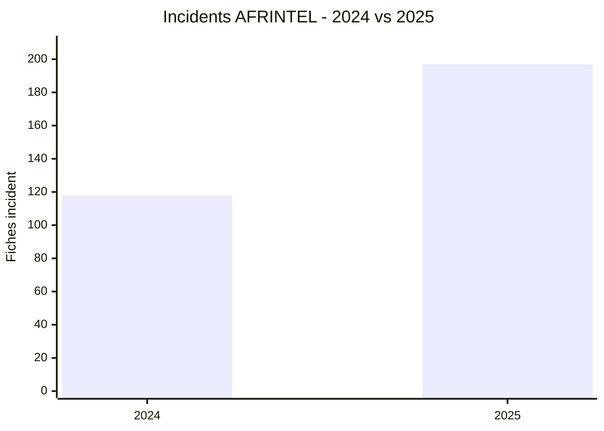
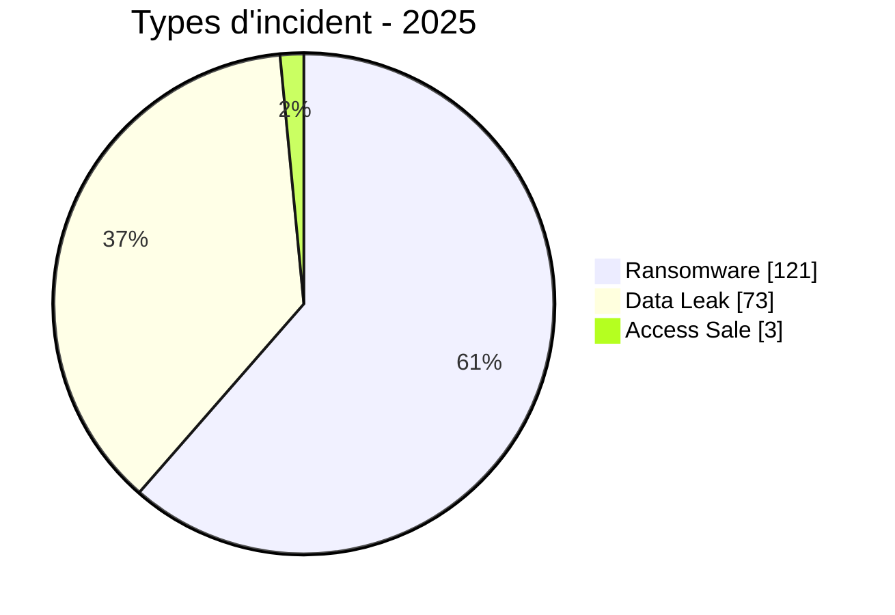
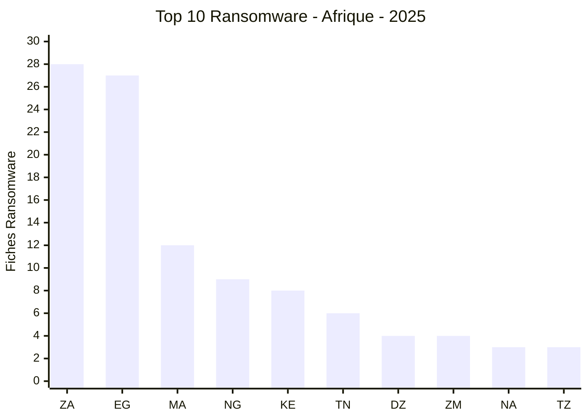
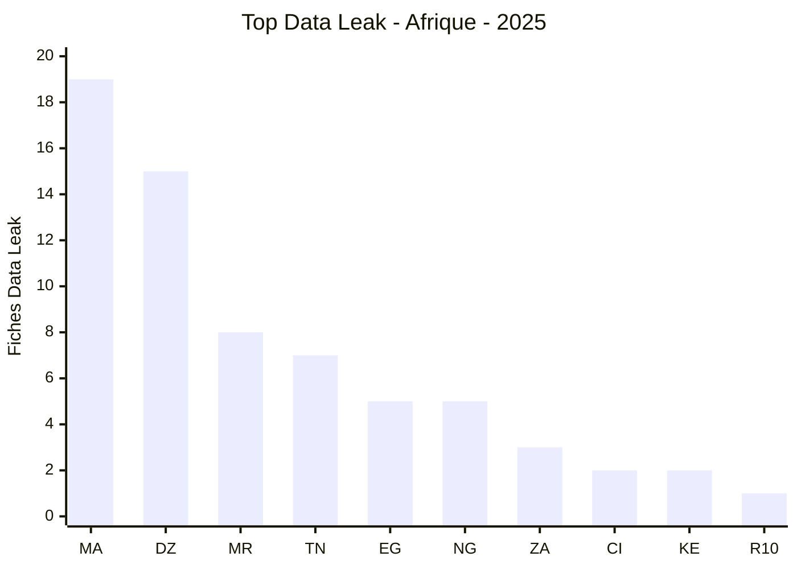

# Rapport CTI annuel AFRINTEL - 2025

👉🏾 [Version anglaise](./README.md)

   

## 1. Résumé exécutif

AFRINTEL a documenté **197 fiches incident de janvier à décembre 2025** : **121 Ransomware (61,4 %)**, **73 Data Leak (37,1 %)** et **3 Access Sale (1,5 %)**. Aucun DDoS, Defacement ou Operational Fraud n'apparaît dans le corpus mensuel validé.

Le total annuel reste à 197, mais sa composition change après harmonisation mensuelle. La fiche North-West University de janvier est désormais intégrée en Data Leak, tandis que la republication MeamarGroup d'octobre est exclue du comptage annuel des incidents uniques, car la source harmonisée la relie au même incident sous-jacent déjà documenté en septembre.

Les pays les plus représentés sont l'**Égypte (32)**, le **Maroc (31)** et l'**Afrique du Sud (31)**. Les principaux labels d'acteurs sont **qilin (11)**, **nightspire (10)** et **devman (10)**. Gouvernement / Administration (**40**) et Finance / Banque (**39**) restent les deux premiers secteurs annuels.

Ces chiffres décrivent le corpus AFRINTEL observé et ne transforment pas une revendication criminelle en compromission confirmée.

## 2. Corrections par rapport à l'ancienne version annuelle

| Indicateur | Ancienne valeur | Valeur harmonisée |
|---|---:|---:|
| Total des fiches | 197 | **197** |
| Ransomware | 122 | **121** |
| Data Leak | 72 | **73** |
| Access Sale | 3 | **3** |
| Égypte | 33 | **32** |
| Afrique du Sud | 30 | **31** |
| Afrique du Nord | 96 | **95** |
| Afrique australe | 43 | **44** |
| Éducation / Université | 17 | **18** |
| Construction / Immobilier | 6 | **5** |

L'ajout de NWU en janvier ajoute une fiche Data Leak. La déduplication de MeamarGroup en octobre retire une fiche Ransomware. Les deux corrections se compensent sur le total annuel mais modifient les répartitions détaillées.

## 3. Méthodologie

- Période strictement limitée au **1er janvier au 31 décembre 2025**.
- Source de vérité : les douze fichiers victimes mensuels harmonisés de 2025.
- Une fiche mensuelle harmonisée correspond à une fiche annuelle.
- Une republication n'est retirée que lorsque la source harmonisée la relie explicitement au même incident sous-jacent avec suffisamment de confiance.
- Taxonomie : Ransomware, Data Leak, Access Sale, DDoS, Defacement, Operational Fraud.
- Revendication, échantillon, publication complète et corroboration indépendante restent des niveaux de preuve distincts.
- La taxonomie sectorielle annuelle contrôlée du rapport précédent est conservée, avec uniquement les corrections soutenues par les sources harmonisées.

## 4. Comparaison annuelle 2024 vs 2025

Cette comparaison utilise les **comptages tabulaires du rapport annuel AFRINTEL 2024** et les **197 fiches harmonisées de 2025**.

> **Point méthodologique 2024 :** le rapport 2024 contient quelques incohérences de présentation entre son texte, ses tableaux et certains anciens graphiques. Pour cette comparaison, les valeurs de référence sont les comptages des tableaux annuels et mensuels : **118 incidents, 86 Ransomware, 29 Data Leak et 3 Access Sale**. Le H1 2024 est recalculé à **48** à partir des six lignes mensuelles, et non 47 comme indiqué dans une phrase du résumé.

### 4.1 Évolution globale

| Indicateur | 2024 | 2025 | Évolution |
|---|---:|---:|---:|
| Total incidents | 118 | 197 | **+79 (+66,9 %)** |
| Pays couverts | 27 | 29 | **+2 (+7,4 %)** |
| Ransomware | 86 | 121 | **+35 (+40,7 %)** |
| Data Leak | 29 | 73 | **+44 (+151,7 %)** |
| Access Sale | 3 | 3 | **0 (stable)** |
| Defacement | 0 | 0 | **0 (stable)** |

Le corpus documenté augmente de **79 fiches**, soit **+66,9 %** entre les deux années.

### 4.2 Évolution de la structure des incidents

| Type | Part 2024 | Part 2025 | Évolution de part |
|---|---:|---:|---:|
| Ransomware | 72,9 % | 61,4 % | **-11,5 points** |
| Data Leak | 24,6 % | 37,1 % | **+12,5 points** |
| Access Sale | 2,5 % | 1,5 % | **-1,0 point** |

Le Ransomware reste la première catégorie en volume, passant de **86 à 121 fiches**. Toutefois, sa part relative diminue de **72,9 % à 61,4 %** car les Data Leak progressent beaucoup plus rapidement.

Les Data Leak passent de **29 à 73**, soit **+151,7 %**. Leur poids dans le corpus annuel progresse de **24,6 % à 37,1 %**. C'est le changement structurel le plus important entre les deux années.

Les Access Sale restent à **3 fiches**. Leur poids relatif baisse mécaniquement de 2,5 % à 1,5 % du fait de l'augmentation du volume total.

### 4.3 Premier semestre et second semestre

| Période | 2024 | 2025 | Évolution |
|---|---:|---:|---:|
| H1 | 48 | 95 | **+47 (+97,9 %)** |
| H2 | 70 | 102 | **+32 (+45,7 %)** |
| Année | 118 | 197 | **+79 (+66,9 %)** |

L'augmentation est particulièrement marquée au premier semestre : le H1 2025 compte presque deux fois plus de fiches que le H1 2024. Le H2 progresse également, mais plus modérément.

Le pic mensuel de 2024 est de **15 fiches**, atteint en août et novembre. En 2025, le maximum mensuel atteint **21 fiches**, en mai, juin et juillet.

### 4.4 Évolution des principaux pays

| Pays | 2024 | 2025 | Évolution |
|---|---:|---:|---:|
| Afrique du Sud | 30 | 31 | **+1 (+3,3 %)** |
| Égypte | 14 | 32 | **+18 (+128,6 %)** |
| Maroc | 5 | 31 | **+26 (+520,0 %)** |
| Algérie | 7 | 19 | **+12 (+171,4 %)** |
| Nigeria | 7 | 14 | **+7 (+100,0 %)** |
| Tunisie | 6 | 13 | **+7 (+116,7 %)** |

L'évolution n'est pas uniforme. **L'Afrique du Sud reste presque stable en volume total, de 30 à 31 fiches**, alors que l'Égypte, le Maroc, l'Algérie, le Nigeria et la Tunisie progressent nettement dans le corpus observé.

Le changement le plus marqué concerne le **Maroc**, qui passe de **5 à 31 fiches**. Cette évolution est surtout portée par les Data Leak en 2025. L'Égypte passe de 14 à 32 fiches et l'Algérie de 7 à 19.

### 4.5 Lecture CTI

Trois constats se dégagent du comparatif :

1. **Le volume AFRINTEL augmente fortement**, mais cette hausse mesure d'abord l'évolution du corpus observé. Elle ne permet pas, à elle seule, de conclure à une augmentation identique du nombre réel de compromissions en Afrique.
2. **La structure se diversifie** : le Ransomware reste dominant, mais les Data Leak prennent beaucoup plus de poids en 2025.
3. **Les dynamiques nationales divergent** : l'Afrique du Sud reste fortement orientée Ransomware, tandis que le Maroc et l'Algérie présentent une montée importante des Data Leak.

La comparaison sectorielle détaillée n'est pas présentée comme une variation stricte, car la normalisation des catégories sectorielles n'est pas identique entre les deux rapports annuels. Les chiffres sectoriels restent disponibles séparément dans chaque rapport.

## 5. Évolution mensuelle

| Mois | Total | Ransomware | Data Leak | Access Sale | DDoS | Defacement | Operational Fraud |
|---|---:|---:|---:|---:|---:|---:|---:|
| Janvier | 17 | 16 | 1 | 0 | 0 | 0 | 0 |
| Février | 8 | 8 | 0 | 0 | 0 | 0 | 0 |
| Mars | 11 | 9 | 1 | 1 | 0 | 0 | 0 |
| Avril | 17 | 7 | 9 | 1 | 0 | 0 | 0 |
| Mai | 21 | 13 | 8 | 0 | 0 | 0 | 0 |
| Juin | 21 | 5 | 16 | 0 | 0 | 0 | 0 |
| Juillet | 21 | 5 | 16 | 0 | 0 | 0 | 0 |
| Août | 13 | 7 | 5 | 1 | 0 | 0 | 0 |
| Septembre | 18 | 11 | 7 | 0 | 0 | 0 | 0 |
| Octobre | 18 | 16 | 2 | 0 | 0 | 0 | 0 |
| Novembre | 14 | 10 | 4 | 0 | 0 | 0 | 0 |
| Décembre | 18 | 14 | 4 | 0 | 0 | 0 | 0 |
| **2025** | **197** | **121** | **73** | **3** | **0** | **0** | **0** |

Le H1 compte **95 fiches** et le H2 **102 fiches**. Le second semestre compte donc 7 fiches de plus que le premier.

## 6. Répartition par type d'incident

| Type d'incident | Fiches | Part |
|---|---:|---:|
| Ransomware | **121** | **61,4 %** |
| Data Leak | **73** | **37,1 %** |
| Access Sale | **3** | **1,5 %** |
| DDoS | 0 | 0,0 % |
| Defacement | 0 | 0,0 % |
| Operational Fraud | 0 | 0,0 % |
| **Total** | **197** | **100 %** |

## 7. Répartition par pays

| Pays | Ransomware | Data Leak | Access Sale | Total | Distribution |
|---|---:|---:|---:|---:|---|
| 🇪🇬 Égypte | 27 | 5 | 0 | 32 | 🟧🟧🟧🟧🟧🟧🟧🟧🟧🟧🟧🟧🟧🟧🟧🟧🟧🟧🟧🟧🟧🟧🟧🟧🟧🟧🟧🟦🟦🟦🟦🟦 |
| 🇲🇦 Maroc | 12 | 19 | 0 | 31 | 🟧🟧🟧🟧🟧🟧🟧🟧🟧🟧🟧🟧🟦🟦🟦🟦🟦🟦🟦🟦🟦🟦🟦🟦🟦🟦🟦🟦🟦🟦🟦 |
| 🇿🇦 Afrique du Sud | 28 | 3 | 0 | 31 | 🟧🟧🟧🟧🟧🟧🟧🟧🟧🟧🟧🟧🟧🟧🟧🟧🟧🟧🟧🟧🟧🟧🟧🟧🟧🟧🟧🟧🟦🟦🟦 |
| 🇩🇿 Algérie | 4 | 15 | 0 | 19 | 🟧🟧🟧🟧🟦🟦🟦🟦🟦🟦🟦🟦🟦🟦🟦🟦🟦🟦🟦 |
| 🇳🇬 Nigeria | 9 | 5 | 0 | 14 | 🟧🟧🟧🟧🟧🟧🟧🟧🟧🟦🟦🟦🟦🟦 |
| 🇹🇳 Tunisie | 6 | 7 | 0 | 13 | 🟧🟧🟧🟧🟧🟧🟦🟦🟦🟦🟦🟦🟦 |
| 🇰🇪 Kenya | 8 | 2 | 0 | 10 | 🟧🟧🟧🟧🟧🟧🟧🟧🟦🟦 |
| 🇲🇷 Mauritanie | 0 | 8 | 0 | 8 | 🟦🟦🟦🟦🟦🟦🟦🟦 |
| 🇿🇲 Zambie | 4 | 0 | 0 | 4 | 🟧🟧🟧🟧 |
| 🇬🇭 Ghana | 2 | 1 | 0 | 3 | 🟧🟧🟦 |
| 🇨🇮 Côte d'Ivoire | 1 | 2 | 0 | 3 | 🟧🟦🟦 |
| 🇳🇦 Namibie | 3 | 0 | 0 | 3 | 🟧🟧🟧 |
| 🇹🇿 Tanzanie | 3 | 0 | 0 | 3 | 🟧🟧🟧 |
| 🇧🇼 Botswana | 2 | 0 | 0 | 2 | 🟧🟧 |
| 🇨🇩 RDC | 1 | 1 | 0 | 2 | 🟧🟦 |
| 🇲🇺 Maurice | 2 | 0 | 0 | 2 | 🟧🟧 |
| 🇸🇳 Sénégal | 1 | 0 | 1 | 2 | 🟧🟪 |
| 🇹🇬 Togo | 0 | 1 | 1 | 2 | 🟦🟪 |
| 🇺🇬 Ouganda | 2 | 0 | 0 | 2 | 🟧🟧 |
| 🇿🇼 Zimbabwe | 2 | 0 | 0 | 2 | 🟧🟧 |
| 🇦🇴 Angola | 0 | 1 | 0 | 1 | 🟦 |
| 🇧🇫 Burkina Faso | 0 | 0 | 1 | 1 | 🟪 |
| 🇧🇮 Burundi | 0 | 1 | 0 | 1 | 🟦 |
| 🇨🇲 Cameroun | 1 | 0 | 0 | 1 | 🟧 |
| 🇩🇯 Djibouti | 0 | 1 | 0 | 1 | 🟦 |
| 🇪🇷 Érythrée | 0 | 1 | 0 | 1 | 🟦 |
| 🇬🇦 Gabon | 1 | 0 | 0 | 1 | 🟧 |
| 🇲🇬 Madagascar | 1 | 0 | 0 | 1 | 🟧 |
| 🇷🇼 Rwanda | 1 | 0 | 0 | 1 | 🟧 |
| **Total** | **121** | **73** | **3** | **197** | |

Principaux constats : l'Égypte compte 32 fiches, le Maroc 31 et l'Afrique du Sud 31. L'Afrique du Sud possède le plus grand nombre de Ransomware avec 28, tandis que le Maroc possède le plus grand nombre de Data Leak avec 19.

## 8. Répartition régionale

| Région | Ransomware | Data Leak | Access Sale | Total | Part |
|---|---:|---:|---:|---:|---:|
| Afrique du Nord | 49 | 46 | 0 | 95 | 48,2 % |
| Afrique australe | 41 | 3 | 0 | 44 | 22,3 % |
| Afrique de l'Ouest | 13 | 17 | 3 | 33 | 16,8 % |
| Afrique de l'Est | 15 | 5 | 0 | 20 | 10,2 % |
| Afrique centrale | 3 | 2 | 0 | 5 | 2,5 % |
| **Total** | **121** | **73** | **3** | **197** | **100 %** |

L'Afrique du Nord représente **95 fiches (48,2 %)**, suivie de l'Afrique australe avec 44, de l'Afrique de l'Ouest avec 33, de l'Afrique de l'Est avec 20 et de l'Afrique centrale avec 5.

## 9. Répartition sectorielle harmonisée

| Secteur annuel contrôlé | Fiches | Part | Activité |
|---|---:|---:|---|
| Gouvernement / Administration | 40 | 20,3 % | ████████████ |
| Finance / Banque | 39 | 19,8 % | ████████████ |
| Technologie / IT | 25 | 12,7 % | ████████ |
| Éducation / Université | 18 | 9,1 % | █████ |
| Santé / Médical | 14 | 7,1 % | ████ |
| Industrie / Fabrication | 10 | 5,1 % | ███ |
| Transport / Logistique | 10 | 5,1 % | ███ |
| Commerce / E-commerce | 9 | 4,6 % | ███ |
| Services professionnels / Business | 7 | 3,6 % | ██ |
| Défense / Sécurité | 6 | 3,0 % | ██ |
| Construction / Immobilier | 5 | 2,5 % | ██ |
| Énergie / Services publics | 4 | 2,0 % | █ |
| Agriculture / Agro-industrie | 3 | 1,5 % | █ |
| Juridique / Justice | 2 | 1,0 % | █ |
| Mines | 2 | 1,0 % | █ |
| Non précisé | 2 | 1,0 % | █ |
| Société civile / ONG | 1 | 0,5 % | █ |
| **Total** | **197** | **100 %** | |

NWU fait passer Éducation / Université de 17 à 18. La suppression du doublon MeamarGroup d'octobre fait passer Construction / Immobilier de 6 à 5.

## 10. Profil des acteurs / groupes

Tous les labels Acteur / Groupe ayant au moins quatre fiches annuelles sont affichés afin de ne pas exclure des valeurs ex aequo.

| Acteur / Groupe | Fiches | Activité |
|---|---:|---|
| qilin | 11 | ████████████ |
| nightspire | 10 | ███████████ |
| devman | 10 | ███████████ |
| incransom | 8 | █████████ |
| funksec | 7 | ████████ |
| Phantom Atlas | 7 | ████████ |
| killsec | 6 | ███████ |
| kill9 | 6 | ███████ |
| Dark 07x Team | 5 | █████ |
| ransomhub | 4 | ████ |
| warlock | 4 | ████ |
| mrdump | 4 | ████ |
| clop | 4 | ████ |

La fiche NWU de janvier ajoute SevenZeroDay404 avec une occurrence. La suppression du doublon MeamarGroup d'octobre laisse obscura à une occurrence annuelle. Le classement des principaux acteurs ne change pas.

## 11. Analyse CTI annuelle

### 10.1 Ransomware

Le Ransomware reste majoritaire avec **121 fiches**. L'Afrique du Sud en compte 28, l'Égypte 27, le Maroc 12, le Nigeria 9 et le Kenya 8. Une présence sur un leak site n'est pas considérée comme une preuve de chiffrement sans élément technique complémentaire.

### 10.2 Data Leak

AFRINTEL recense **73 Data Leak**. Le Maroc arrive en tête avec 19, devant l'Algérie avec 15, la Mauritanie avec 8, la Tunisie avec 7, puis l'Égypte et le Nigeria avec 5 chacun.

### 10.3 Access Sale

Les **3 Access Sale** concernent le Burkina Faso, le Sénégal et le Togo. Une vente d'accès revendiquée reste distincte d'un Data Leak, car l'accès proposé ne prouve pas à lui seul une exfiltration.

## 12. Principaux enseignements CTI

- Le Ransomware reste le premier type, tandis que les Data Leak représentent plus d'un tiers du corpus.
- L'Afrique du Nord concentre près de la moitié des fiches annuelles.
- Le Maroc et l'Algérie présentent un profil fortement orienté Data Leak ; l'Afrique du Sud est très majoritairement Ransomware.
- Les administrations et les organisations financières restent les secteurs contrôlés les plus représentés.
- Le suivi du cycle de vie est essentiel : republication, revente ou nouvelle revendication par un second groupe ne signifie pas automatiquement nouvelle compromission.
- Les volumes annoncés dépassent fréquemment les éléments qu'AFRINTEL a pu valider directement.
- La visibilité d'un acteur reflète une fréquence de publication, pas une attribution technique ni une campagne unique.

## 13. Top des pays les plus exposés par type d'incident

Cette section isole les deux catégories dominantes du corpus annuel afin de distinguer les profils nationaux. Les chiffres proviennent exclusivement des **197 fiches incident harmonisées de 2025**.

### 12.1 Top 10 Ransomware

| Rang | Pays | Fiches Ransomware |
|---:|---|---:|
| 1 | Afrique du Sud | **28** |
| 2 | Égypte | **27** |
| 3 | Maroc | **12** |
| 4 | Nigeria | **9** |
| 5 | Kenya | **8** |
| 6 | Tunisie | **6** |
| 7 | Algérie | **4** |
| 8 | Zambie | **4** |
| 9 | Namibie | **3** |
| 10 | Tanzanie | **3** |

Les dix pays de ce classement concentrent **104 des 121 fiches Ransomware**, soit **86,0 %** du corpus Ransomware annuel.

#### Graphique statique

#### Version Mermaid xychart

**Légende :** ZA = Afrique du Sud, EG = Égypte, MA = Maroc, NG = Nigeria, KE = Kenya, TN = Tunisie, DZ = Algérie, ZM = Zambie, NA = Namibie, TZ = Tanzanie.

### 12.2 Top Data Leak

| Rang | Pays | Fiches Data Leak |
|---:|---|---:|
| 1 | Maroc | **19** |
| 2 | Algérie | **15** |
| 3 | Mauritanie | **8** |
| 4 | Tunisie | **7** |
| 5 | Égypte | **5** |
| 5 | Nigeria | **5** |
| 7 | Afrique du Sud | **3** |
| 8 | Côte d'Ivoire | **2** |
| 8 | Kenya | **2** |
| 10 | **7 pays ex aequo** | **1 chacun** |

Le **rang 10 est ex aequo**. Les sept pays concernés sont : Angola, RDC, Djibouti, Érythrée, Ghana, Togo, Burundi. Ils comptent chacun **1 Data Leak**. Aucun pays n'est sélectionné arbitrairement parmi eux.

#### Graphique statique

#### Version Mermaid xychart

**Légende :** MA = Maroc, DZ = Algérie, MR = Mauritanie, TN = Tunisie, EG = Égypte, NG = Nigeria, ZA = Afrique du Sud, CI = Côte d'Ivoire, KE = Kenya, R10 = sept pays ex aequo au rang 10.

### 12.3 Constat analytique

Le classement fait apparaître **deux profils de menace nettement différents**.

**L'Afrique du Sud et l'Égypte concentrent les revendications Ransomware**. Elles totalisent **55 des 121 fiches Ransomware**, soit **45,5 %** du corpus annuel de cette catégorie. L'Afrique du Sud compte 28 fiches Ransomware sur 31 incidents annuels, tandis que l'Égypte en compte 27 sur 32.

La dynamique **Data Leak** est différente. **Le Maroc et l'Algérie totalisent 34 des 73 Data Leak**, soit **46,6 %** du corpus annuel de cette catégorie. Le Maroc compte **19 Data Leak contre 12 Ransomware**, alors que l'Afrique du Sud présente le profil inverse avec **28 Ransomware contre 3 Data Leak**.

Un classement global des cyberattaques par pays masquerait donc une partie importante de la réalité opérationnelle. L'analyse AFRINTEL doit conserver une lecture par type d'incident afin de distinguer les pays davantage exposés aux campagnes d'extorsion de ceux où les publications de données dominent.

### 12.4 Maintenance rapide des graphiques

Les blocs Mermaid X/Y reprennent directement les valeurs des tableaux et peuvent être modifiés immédiatement lorsqu'une nouvelle fiche 2025 est ajoutée ou requalifiée. Les PNG servent de version statique pour les exports, présentations ou plateformes qui ne rendent pas Mermaid.

## 14. Perspectives et points de surveillance pour 2026

Cette section est une **projection qualitative fondée uniquement sur les tendances observées en 2025**. Elle ne contient aucune statistique réelle de 2026 et ne constitue pas une prévision chiffrée.

La baseline 2025 conduit à surveiller en priorité :

- la persistance d'une forte activité Ransomware visant l'Afrique du Sud et l'Égypte ;
- le maintien d'une forte exposition aux Data Leak au Maroc et en Algérie ;
- l'évolution des secteurs Gouvernement / Administration et Finance / Banque, qui occupent les premières places du corpus sectoriel annuel ;
- l'apparition de nouveaux Access Sale et la transformation éventuelle d'un accès vendu en fuite de données ou en extorsion ;
- les victimes revendiquées successivement par plusieurs groupes, afin de distinguer nouvelle intrusion, republication, revente et réexploitation de données plus anciennes ;
- l'évolution trimestrielle du rapport Ransomware / Data Leak par pays.

Le corpus annuel 2025 constitue ainsi la **baseline AFRINTEL** pour comparer les observations futures. Toute comparaison avec 2026 devra conserver la même taxonomie, la même logique de déduplication et la même séparation entre revendication, échantillon, publication complète et confirmation technique.

## 15. Recommandations

- Valider les revendications avec SIEM, EDR, IAM, VPN, WAF, cloud, journaux applicatifs et sauvegardes.
- Imposer MFA résistante au phishing, PAM, segmentation, rotation des secrets et sauvegardes immuables.
- Détecter les lectures massives de bases, exports volumineux, créations d'archives et transferts sortants inhabituels.
- Prioriser la supervision des comptes privilégiés et le contrôle des exports sensibles dans les environnements publics et financiers.
- Conserver les métadonnées de cycle de vie : première revendication, échantillon, publication complète, republication et revente d'accès.

## 16. Conclusion

Le corpus annuel AFRINTEL harmonisé contient **197 fiches incident couvrant janvier à décembre 2025** : **121 Ransomware, 73 Data Leak et 3 Access Sale**.

Le total reste identique à l'ancien rapport, mais la composition détaillée est corrigée par l'intégration de NWU en janvier et la déduplication de MeamarGroup en octobre. Par rapport aux 118 fiches documentées en 2024, le corpus 2025 progresse de 66,9 %, avec une hausse particulièrement marquée des Data Leak. L'Égypte arrive en tête avec 32 fiches, tandis que le Maroc et l'Afrique du Sud en comptent 31 chacun. Le corpus 2025 constitue désormais la baseline annuelle AFRINTEL pour mesurer les évolutions futures par type d'incident, pays, secteur et acteur.

**AFRINTEL** - TLP:CLEAR
