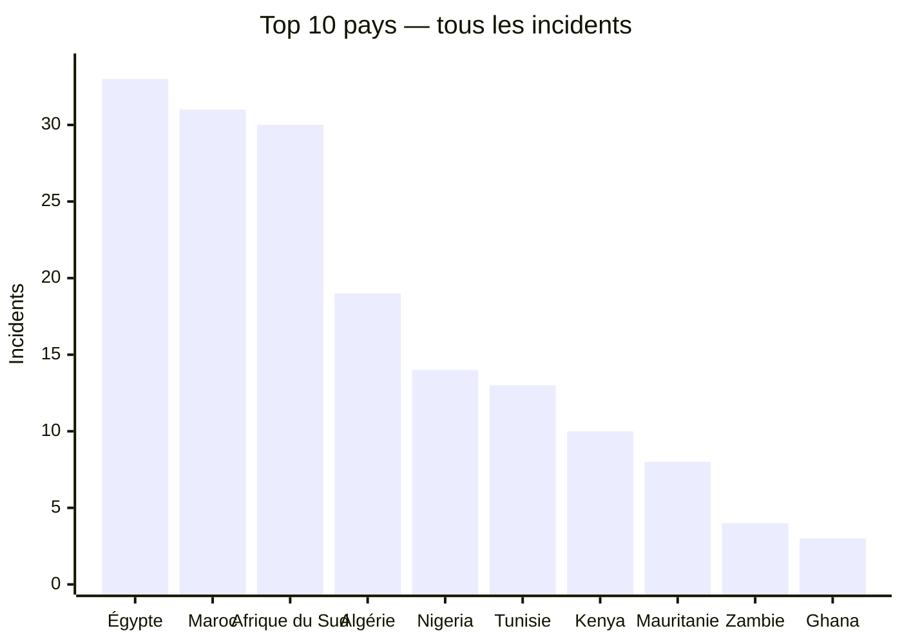
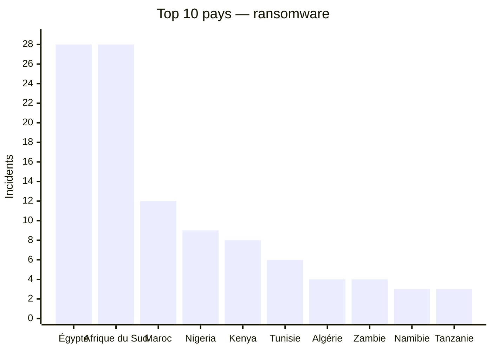
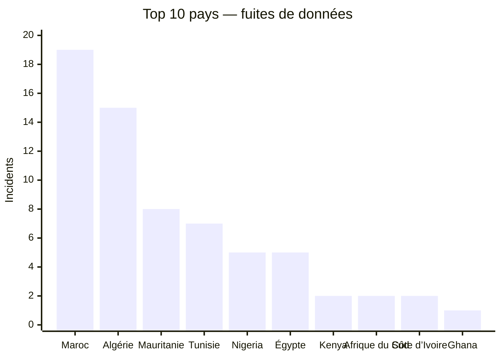

# Rapport CTI annuel global AFRINTEL — 2025

Ce rapport suit la visibilité publique des cyberattaques contre des organisations africaines en 2025. Les chiffres sont recalculés à partir des fiches victimes mensuelles, les revendications comptées telles qu'elles apparaissent dans ces sources, rien de plus.

👉🏾 [Version anglaise](./README.md)

## 1. Vue d’ensemble

**196 fiches** au total : **122 ransomware**, **71 fuites de données**, **3 ventes d'accès**, **0 défacement**, et 0 laissées sans classification d'incident explicite.

Ce classement mesure la présence publique dans les sources AFRINTEL, pas l'ampleur réelle de chaque attaque survenue.

## Méthodologie

Les chiffres viennent des fiches victimes annuelles, compilées à partir des fichiers mensuels. Une fiche correspond à une publication ou revendication documentée, pas forcément à une victime unique. Les publications de forums et de sites de fuite restent des revendications tant que rien ne les confirme de manière indépendante.

## 2. Classement général par pays

| Pays | Incidents |
|---|---:|
| 🇪🇬 Égypte | 33 |
| 🇲🇦 Maroc | 31 |
| 🇿🇦 Afrique du Sud | 30 |
| 🇩🇿 Algérie | 19 |
| 🇳🇬 Nigeria | 14 |
| 🇹🇳 Tunisie | 13 |
| 🇰🇪 Kenya | 10 |
| 🇲🇷 Mauritanie | 8 |
| 🇿🇲 Zambie | 4 |
| 🇬🇭 Ghana | 3 |
| 🇨🇮 Côte d’Ivoire | 3 |
| 🇳🇦 Namibie | 3 |
| 🇹🇿 Tanzanie | 3 |
| 🇧🇼 Botswana | 2 |
| 🇨🇩 Congo (RDC) | 2 |
| 🇲🇺 Maurice | 2 |
| 🇸🇳 Sénégal | 2 |
| 🇹🇬 Togo | 1 |
| 🇺🇬 Ouganda | 2 |
| 🇿🇼 Zimbabwe | 2 |
| 🇦🇴 Angola | 1 |
| 🇧🇫 Burkina Faso | 1 |
| 🇨🇲 Cameroun | 1 |
| 🇩🇯 Djibouti | 1 |
| 🇪🇷 Érythrée | 1 |
| 🇬🇦 Gabon | 1 |
| 🇲🇬 Madagascar | 1 |
| 🇷🇼 Rwanda | 1 |

## 3. Classement ransomware par pays

| Pays | Incidents ransomware |
|---|---:|
| 🇪🇬 Égypte | 28 |
| 🇿🇦 Afrique du Sud | 28 |
| 🇲🇦 Maroc | 12 |
| 🇳🇬 Nigeria | 9 |
| 🇰🇪 Kenya | 8 |
| 🇹🇳 Tunisie | 6 |
| 🇩🇿 Algérie | 4 |
| 🇿🇲 Zambie | 4 |
| 🇳🇦 Namibie | 3 |
| 🇹🇿 Tanzanie | 3 |

### Top 10 ransomware

| Pays | Incidents ransomware |
|---|---:|
| 🇪🇬 Égypte | 28 |
| 🇿🇦 Afrique du Sud | 28 |
| 🇲🇦 Maroc | 12 |
| 🇳🇬 Nigeria | 9 |
| 🇰🇪 Kenya | 8 |
| 🇹🇳 Tunisie | 6 |
| 🇩🇿 Algérie | 4 |
| 🇿🇲 Zambie | 4 |
| 🇳🇦 Namibie | 3 |
| 🇹🇿 Tanzanie | 3 |

## 4. Groupes ransomware les plus présents

| Groupe | Incidents |
|---|---:|
| qilin | 11 |
| devman | 10 |
| incransom | 8 |
| nightspire | 8 |
| funksec | 7 |
| killsec | 6 |
| clop | 4 |
| ransomhub | 4 |
| warlock | 4 |
| GDLockerSec | 3 |
| arcusmedia | 3 |
| babuk2 | 3 |
| dragonforce | 3 |
| lockbit5 | 3 |
| lynx | 3 |
| spacebears | 3 |
| thegentlemen | 3 |
| akira | 2 |
| direwolf | 2 |
| nova | 2 |
| obscura | 2 |
| radar | 2 |
| ransomhouse | 2 |
| tengu | 2 |
| BlackShrantac | 1 |
| Datacarry | 1 |
| Wieko | 1 |
| apt73 | 1 |
| arkana | 1 |
| beast | 1 |
| benzona | 1 |
| blackshrantac | 1 |
| brotherhood | 1 |
| cicada3301 | 1 |
| crypto24 | 1 |
| d4rk4rmy | 1 |
| everest | 1 |
| flocker | 1 |
| fog | 1 |
| gunra | 1 |
| hunter | 1 |
| kazu | 1 |
| medusa | 1 |
| play | 1 |
| stormous | 1 |
| worldleaks | 1 |
| yurei | 1 |

## 5. Classement des fuites de données par pays

| Pays | Fuites de données |
|---|---:|
| 🇲🇦 Maroc | 19 |
| 🇩🇿 Algérie | 15 |
| 🇲🇷 Mauritanie | 8 |
| 🇹🇳 Tunisie | 7 |
| 🇪🇬 Égypte | 5 |
| 🇳🇬 Nigeria | 5 |
| 🇨🇮 Côte d’Ivoire | 2 |
| 🇰🇪 Kenya | 2 |
| 🇿🇦 Afrique du Sud | 2 |
| 🇹🇬 Togo | 1 |
| 🇦🇴 Angola | 1 |
| 🇨🇩 Congo (RDC) | 1 |
| 🇩🇯 Djibouti | 1 |
| 🇪🇷 Érythrée | 1 |
| 🇬🇭 Ghana | 1 |

### Top 10 fuites de données

| Pays | Fuites de données |
|---|---:|
| 🇲🇦 Maroc | 19 |
| 🇩🇿 Algérie | 15 |
| 🇲🇷 Mauritanie | 8 |
| 🇹🇳 Tunisie | 7 |
| 🇪🇬 Égypte | 5 |
| 🇳🇬 Nigeria | 5 |
| 🇨🇮 Côte d’Ivoire | 2 |
| 🇰🇪 Kenya | 2 |
| 🇿🇦 Afrique du Sud | 2 |
| 🇹🇬 Togo | 1 |

## Répartition sectorielle

Les secteurs sont ici regroupés selon une nomenclature commune. Là où une fiche ne donnait pas de quoi trancher, le secteur est indiqué comme non précisé.

| Secteur normalisé | Incidents |
|---|---:|
| Government / Administration | 40 |
| Finance / Banking | 39 |
| Technology / IT | 25 |
| Education / University | 17 |
| Healthcare / Medical | 14 |
| Transport / Logistics | 10 |
| Manufacturing / Industry | 10 |
| Retail / E-commerce | 8 |
| Professional / Business Services | 7 |
| Defense / Security | 6 |
| Construction / Real Estate | 6 |
| Energy / Utilities | 4 |
| Agriculture / Agribusiness | 3 |
| Mining | 2 |
| Legal / Justice | 2 |
| Not specified | 2 |
| Civil Society / NGO | 1 |

## 6. Acteurs ou sources associés aux fuites

| Acteur / source | Fuites |
|---|---:|
| Phantom Atlas | 7 |
| kill9 | 6 |
| Dark 07x Team | 5 |
| Inconnu | 3 |
| Keymous | 3 |
| B4baYega | 2 |
| Evil_BYTE_Officiel | 2 |
| Jabaroot DZ | 2 |
| KaruHunters | 2 |
| Non précisé | 2 |
| mrdump, publication sur un forum cybercriminel (DarkForums) | 2 |
| nightspire | 2 |
| 0x0day, publication postée sur le forum cybercriminel DarkForums | 1 |
| BIGBROTHER | 1 |
| Chucky_BF | 1 |
| DBhacker_BF | 1 |
| EternalRed | 1 |
| Fire Wire | 1 |
| Gh1nDar | 1 |
| GhostCrawl | 1 |
| GhostVector (compte source) | 1 |
| Hepd | 1 |
| KILLUAX | 1 |
| KickingPigs | 1 |
| Killer_Bee | 1 |
| LindaBF, publication sur un forum cybercriminel (RaidForums) | 1 |
| MdHackersArmy (publication postée par Doxeur23azi sur un forum cybercriminel, DarkForums) | 1 |
| Mercobyte | 1 |
| MisterSam | 1 |
| N1KA | 1 |
| RL000 | 1 |
| RainbowDF | 1 |
| RiseAgainLuigi & B4baYega | 1 |
| Spirigatito, publication postée sur un forum cybercriminel | 1 |
| TajineSec / Tajinesec_MA (revendication publiée) | 1 |
| Tanaka | 1 |
| anisanas2 | 1 |
| cache | 1 |
| camillabf, publication sur un forum cybercriminel (RaidForums) | 1 |
| mrdump (canal Telegram « Server dump ») | 1 |
| mrdump (publication sur le canal Telegram « Server dump ») | 1 |
| oblivion666 | 1 |
| p4xar | 1 |
| privilege | 1 |
| privilege, publication sur un forum cybercriminel | 1 |
| sanji_shi5 (compte source) | 1 |

## Visualisations

Les graphiques montrent les dix premiers pays ; les tableaux précédents conservent le classement complet.

## 7. Lecture CTI

Le ransomware domine en volume brut, mais les fuites de données racontent autre chose, le plus souvent un post de forum avec un dump SQL ou un échantillon de document attaché plutôt qu'une inscription sur un site de fuite. Volumes annoncés, authenticité des archives, liens réels entre des revendications répétées : rien de tout ça ne se tranche ici, il faut vérifier fiche par fiche.

## 8. Précautions

Sites de fuite et forums clandestins sont traités comme des sources de revendication, rien de plus. Aucune donnée personnelle brute n'est reproduite dans ce rapport.

**AFRINTEL** — TLP:CLEAR
