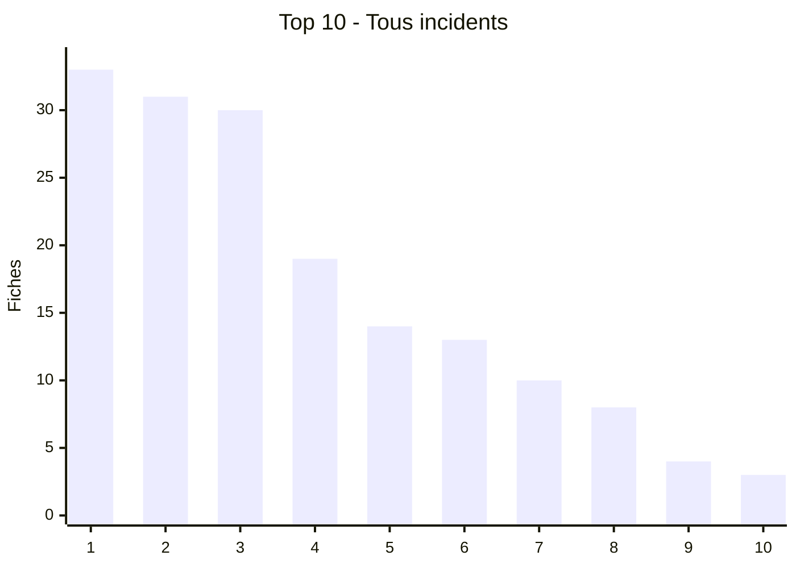
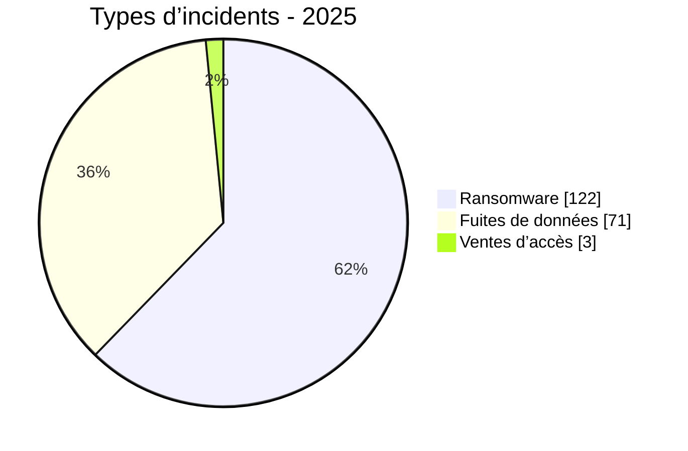
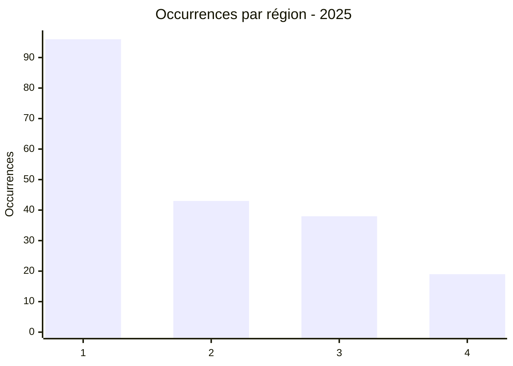
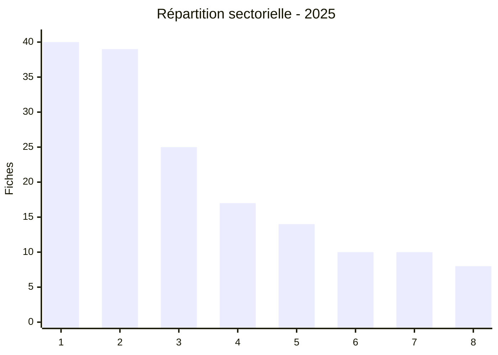
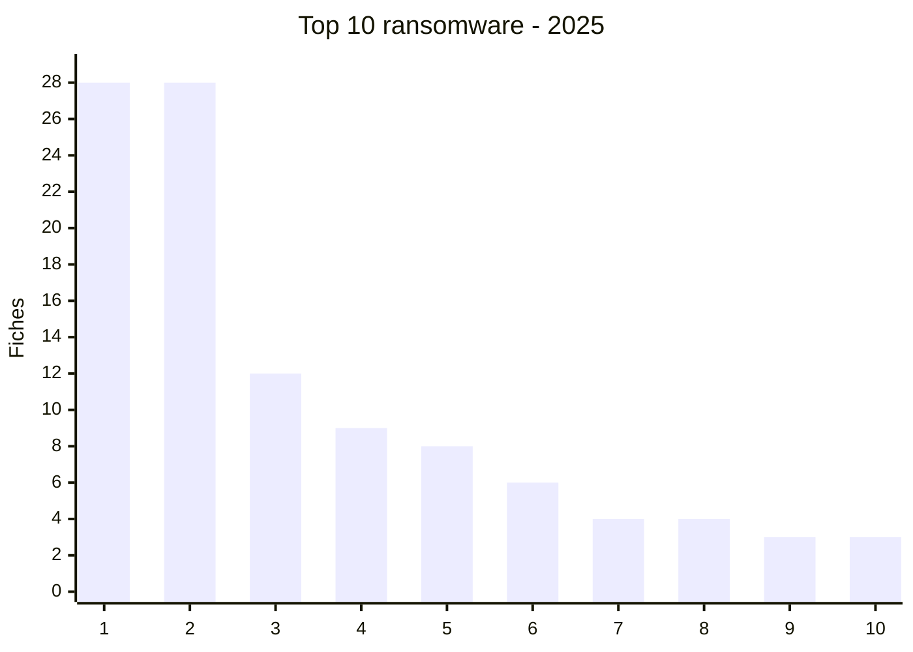
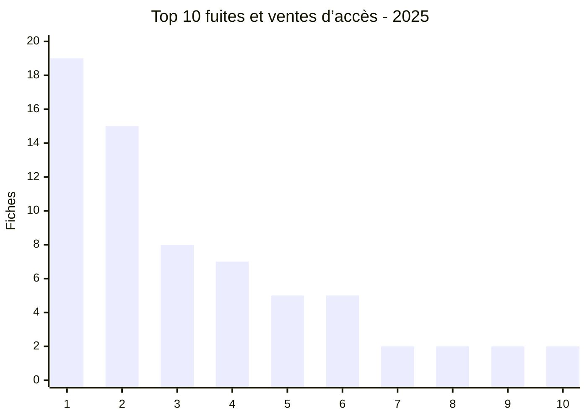

# Rapport CTI annuel AFRINTEL - 2025

👉🏾 [Version anglaise](./README.md)

  

---
## 1. Résumé exécutif

AFRINTEL a recensé **196 fiches** : **122 ransomware**, **71 fuites de données**, **3 ventes d’accès** et **0 défacement.**

## 2. Méthodologie

Les douze fichiers mensuels sont la source de vérité. Une fiche correspond à une publication ou une revendication documentée. Les publications non confirmées restent présentées comme des revendications.

## 3. Vue globale

| Indicateur | Valeur |
| :--- | ---: |
| Fiches | **196** |
| Ransomware | **122 (62,2%)** |
| Fuites de données | **71 (36,2%)** |
| Ventes d’accès | **3 (1,5%)** |

### Classement par pays

| Rang | Pays | Fiches | Barre |
| :--- | ---: | ---: | ---: |
| 1 | 🇪🇬 Égypte | 33 | █████████████████████████████████ |
| 2 | 🇲🇦 Maroc | 31 | ███████████████████████████████ |
| 3 | 🇿🇦 Afrique du Sud | 30 | ██████████████████████████████ |
| 4 | 🇩🇿 Algérie | 19 | ███████████████████ |
| 5 | 🇳🇬 Nigeria | 14 | ██████████████ |
| 6 | 🇹🇳 Tunisie | 13 | █████████████ |
| 7 | 🇰🇪 Kenya | 10 | ██████████ |
| 8 | 🇲🇷 Mauritanie | 8 | ████████ |
| 9 | 🇿🇲 Zambie | 4 | ████ |
| 10 | 🇬🇭 Ghana | 3 | ███ |
| 11 | 🇨🇮 Côte d’Ivoire | 3 | ███ |
| 12 | 🇳🇦 Namibie | 3 | ███ |
| 13 | 🇹🇿 Tanzanie | 3 | ███ |
| 14 | 🇧🇼 Botswana | 2 | ██ |
| 15 | 🇨🇩 RDC | 2 | ██ |
| 16 | 🇲🇺 Maurice | 2 | ██ |
| 17 | 🇸🇳 Sénégal | 2 | ██ |
| 18 | 🇹🇬 Togo | 2 | ██ |
| 19 | 🇺🇬 Ouganda | 2 | ██ |
| 20 | 🇿🇼 Zimbabwe | 2 | ██ |
| 21 | 🇦🇴 Angola | 1 | █ |
| 22 | 🇧🇫 Burkina Faso | 1 | █ |
| 23 | 🇨🇲 Cameroun | 1 | █ |
| 24 | 🇩🇯 Djibouti | 1 | █ |
| 25 | 🇪🇷 Érythrée | 1 | █ |
| 26 | 🇬🇦 Gabon | 1 | █ |
| 27 | 🇲🇬 Madagascar | 1 | █ |
| 28 | 🇷🇼 Rwanda | 1 | █ |

### Répartition par type d’incident

| Type | Fiches | Part |
| :--- | ---: | ---: |
| Ransomware | 122 | 62,2% |
| Fuite de données | 71 | 36,2% |
| Vente d’accès | 3 | 1,5% |
| **Total** | **196** | **100%** |

### Comparaison ransomware, fuites et ventes d’accès par pays

| Pays | Ransomware | Fuites / accès | Total | Distribution |
| :--- | ---: | ---: | ---: | ---: |
| 🇪🇬 Égypte | 28 | 5 | 33 | 🟧🟧🟧🟧🟧🟧🟧🟧🟧🟧🟧🟧🟧🟧🟧🟧🟧🟧🟧🟧🟧🟧🟧🟧🟧🟧🟧🟧 🟦🟦🟦🟦🟦 |
| 🇲🇦 Maroc | 12 | 19 | 31 | 🟧🟧🟧🟧🟧🟧🟧🟧🟧🟧🟧🟧 🟦🟦🟦🟦🟦🟦🟦🟦🟦🟦🟦🟦🟦🟦🟦🟦🟦🟦🟦 |
| 🇿🇦 Afrique du Sud | 28 | 2 | 30 | 🟧🟧🟧🟧🟧🟧🟧🟧🟧🟧🟧🟧🟧🟧🟧🟧🟧🟧🟧🟧🟧🟧🟧🟧🟧🟧🟧🟧 🟦🟦 |
| 🇩🇿 Algérie | 4 | 15 | 19 | 🟧🟧🟧🟧 🟦🟦🟦🟦🟦🟦🟦🟦🟦🟦🟦🟦🟦🟦🟦 |
| 🇳🇬 Nigeria | 9 | 5 | 14 | 🟧🟧🟧🟧🟧🟧🟧🟧🟧 🟦🟦🟦🟦🟦 |
| 🇹🇳 Tunisie | 6 | 7 | 13 | 🟧🟧🟧🟧🟧🟧 🟦🟦🟦🟦🟦🟦🟦 |
| 🇰🇪 Kenya | 8 | 2 | 10 | 🟧🟧🟧🟧🟧🟧🟧🟧 🟦🟦 |
| 🇲🇷 Mauritanie | 0 | 8 | 8 |  🟦🟦🟦🟦🟦🟦🟦🟦 |
| 🇿🇲 Zambie | 4 | 0 | 4 | 🟧🟧🟧🟧 |
| 🇬🇭 Ghana | 2 | 1 | 3 | 🟧🟧 🟦 |
| 🇨🇮 Côte d’Ivoire | 1 | 2 | 3 | 🟧 🟦🟦 |
| 🇳🇦 Namibie | 3 | 0 | 3 | 🟧🟧🟧 |
| 🇹🇿 Tanzanie | 3 | 0 | 3 | 🟧🟧🟧 |
| 🇧🇼 Botswana | 2 | 0 | 2 | 🟧🟧 |
| 🇨🇩 RDC | 1 | 1 | 2 | 🟧 🟦 |
| 🇲🇺 Maurice | 2 | 0 | 2 | 🟧🟧 |
| 🇸🇳 Sénégal | 1 | 1 | 2 | 🟧 🟦 |
| 🇹🇬 Togo | 0 | 2 | 2 |  🟦🟦 |
| 🇺🇬 Ouganda | 2 | 0 | 2 | 🟧🟧 |
| 🇿🇼 Zimbabwe | 2 | 0 | 2 | 🟧🟧 |
| 🇦🇴 Angola | 0 | 1 | 1 |  🟦 |
| 🇧🇫 Burkina Faso | 0 | 1 | 1 |  🟦 |
| 🇨🇲 Cameroun | 1 | 0 | 1 | 🟧 |
| 🇩🇯 Djibouti | 0 | 1 | 1 |  🟦 |
| 🇪🇷 Érythrée | 0 | 1 | 1 |  🟦 |
| 🇬🇦 Gabon | 1 | 0 | 1 | 🟧 |
| 🇲🇬 Madagascar | 1 | 0 | 1 | 🟧 |
| 🇷🇼 Rwanda | 1 | 0 | 1 | 🟧 |

### Répartition géographique par région

| Région | Occurrences | Ransomware | Fuites / accès | Distribution |
| :--- | ---: | ---: | ---: | ---: |
| Afrique du Nord | 96 | 50 | 46 | 🟧🟧🟧🟧🟧🟧🟧🟧🟧🟧 🟦🟦🟦🟦🟦🟦🟦🟦🟦🟦 |
| Afrique australe | 43 | 41 | 2 | 🟧🟧🟧🟧🟧🟧🟧🟧 🟦 |
| Afrique de l’Ouest et centrale | 38 | 16 | 22 | 🟧🟧🟧 🟦🟦🟦🟦🟦 |
| Afrique de l’Est | 19 | 15 | 4 | 🟧🟧🟧 🟦 |

Légende : 1 = Afrique du Nord; 2 = Afrique australe; 3 = Afrique de l’Ouest et centrale; 4 = Afrique de l’Est

### Répartition sectorielle

| Secteur | Fiches | Part | Barre |
| :--- | ---: | ---: | ---: |
| Gouvernement / administration | 40 | 20,4% | ██████████ |
| Finance / banque | 39 | 19,9% | ██████████ |
| Technologies / informatique | 25 | 12,8% | ██████ |
| Éducation / universités | 17 | 8,7% | ████ |
| Santé / médical | 14 | 7,1% | ████ |
| Industrie / fabrication | 10 | 5,1% | ██ |
| Transport / logistique | 10 | 5,1% | ██ |
| Commerce / e-commerce | 8 | 4,1% | ██ |
| Services professionnels | 7 | 3,6% | ██ |
| Construction / immobilier | 6 | 3,1% | ██ |
| Défense / sécurité | 6 | 3,1% | ██ |
| Énergie / services publics | 4 | 2,0% | █ |
| Agriculture / agro-industrie | 3 | 1,5% | █ |
| Juridique / justice | 2 | 1,0% | █ |
| Mines | 2 | 1,0% | █ |
| Non précisé | 2 | 1,0% | █ |
| Société civile / ONG | 1 | 0,5% | █ |

Légende : 1 = Technologies; 2 = Finance; 3 = Éducation; 4 = Gouvernement; 5 = Commerce; 6 = Santé; 7 = Industrie; 8 = Services professionnels

### Graphiques par type d’incident

Légende: 1 = Égypte; 2 = Afrique du Sud; 3 = Maroc; 4 = Nigeria; 5 = Kenya; 6 = Tunisie; 7 = Algérie; 8 = Zambie; 9 = Namibie; 10 = Tanzanie

Légende: 1 = Maroc; 2 = Algérie; 3 = Mauritanie; 4 = Tunisie; 5 = Égypte; 6 = Nigeria; 7 = Côte d’Ivoire; 8 = Kenya; 9 = Afrique du Sud; 10 = Togo

## 4. Analyse détaillée par type d’incident

Les revendications ransomware représentent 122 fiches. Les fuites et ventes d’accès représentent 74 fiches et concernent notamment des données administratives, financières, médicales, éducatives et commerciales.

## 5. Impact sectoriel

Les secteurs gouvernemental, financier, technologique et éducatif concentrent une part importante des fiches.

## 6. Profil des acteurs et évaluation du risque

| Acteur / Groupe | Fiches | Activité |
| :--- | ---: | ---: |
| qilin | 11 | ██████████ |
| nightspire | 10 | █████████ |
| devman | 10 | █████████ |
| incransom | 8 | ███████ |
| funksec | 7 | ██████ |
| Phantom Atlas | 7 | ██████ |
| killsec | 6 | █████ |
| kill9 | 6 | █████ |
| Dark 07x Team | 5 | █████ |
| ransomhub | 4 | ████ |

| Pays | Niveau |
| :--- | ---: |
| 🇪🇬 Égypte | 🔴 Élevé |
| 🇲🇦 Maroc | 🔴 Élevé |
| 🇿🇦 Afrique du Sud | 🔴 Élevé |
| 🇩🇿 Algérie | 🔴 Élevé |
| 🇳🇬 Nigeria | 🔴 Élevé |

### Graphique des acteurs les plus présents

Légende: 1 = qilin; 2 = nightspire; 3 = devman; 4 = incransom; 5 = funksec; 6 = Phantom Atlas; 7 = killsec; 8 = kill9; 9 = Dark 07x Team; 10 = ransomhub

## 7. Tendances et lacunes de renseignement

Les limites principales sont la confirmation indépendante, la taille réelle des jeux de données et le lien entre revendications répétées.

## 8. Cartographie MITRE ATT&CK contextuelle

| Phase | Technique | Contexte |
| :--- | ---: | ---: |
| Impact | T1486 - Data Encrypted for Impact | Ransomware |
| Exfiltration | T1567 - Exfiltration Over Web Service | Leaks and extortion |
| Credential access | T1078 - Valid Accounts | Access claims |

## 9. Recommandations

- Vérifier les revendications avec les journaux, EDR, IAM et sauvegardes.
- Renforcer MFA, segmentation, sauvegardes hors ligne et rotation des secrets.

## 10. Recommandations SOC et tactiques

- Corréler EDR, VPN, IAM, DNS, proxy, WAF et journaux applicatifs.

## 11. Recommandations stratégiques

- Maintenir l’inventaire des actifs et tester les plans de réponse et de restauration.

## 12. Conclusion

Ces chiffres décrivent les publications observées par AFRINTEL et servent à prioriser la veille et la défense.

**AFRINTEL** - TLP:CLEAR
