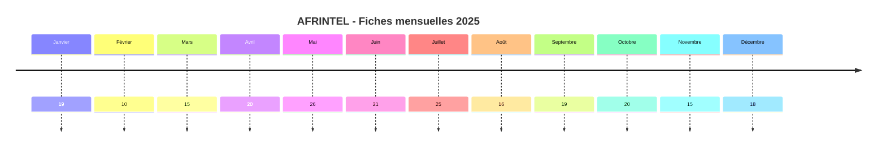
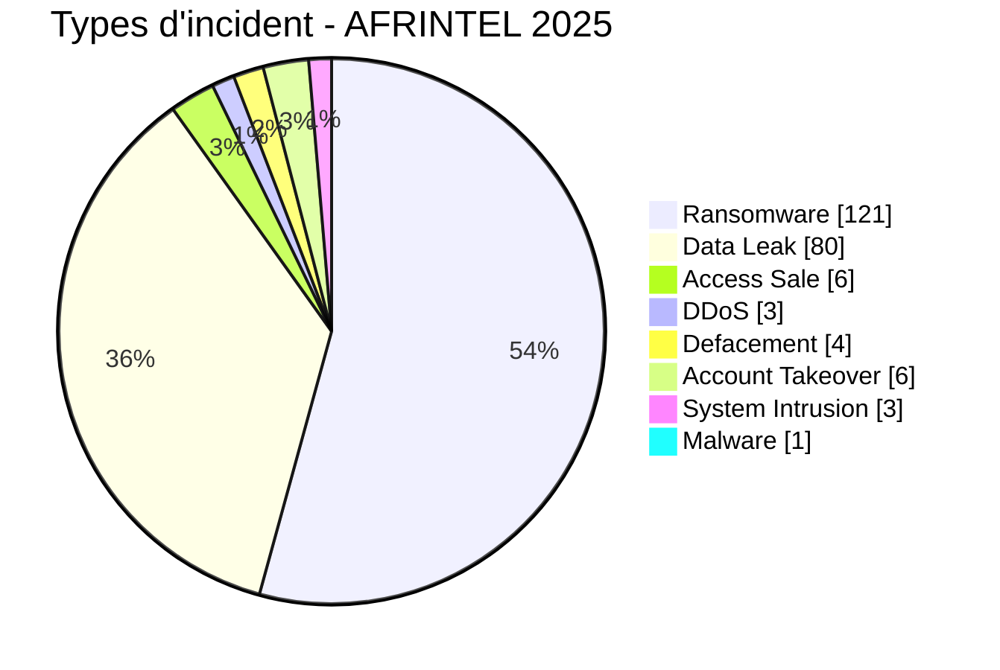

# Rapport CTI annuel AFRINTEL - Cybermenaces en Afrique - 2025

👉🏾 [English version](./README.md)

   

## 1. Synthèse exécutive

En 2025, AFRINTEL a documenté **224 cyberincidents affectant des organisations, institutions et services numériques dans 30 pays africains**. Le corpus met en évidence un paysage de menace largement dominé par le **ransomware** et les **fuites de données**, mais également marqué par des ventes d'accès, des prises de contrôle de comptes institutionnels, des attaques DDoS, des défacements, des intrusions système et des infections par malware.

Le **Ransomware reste la première menace observée avec 121 fiches, soit 54,0 % du corpus annuel**. Les **Data Leak représentent 80 fiches (35,7 %)**. À elles seules, ces deux catégories concentrent **201 des 224 incidents documentés, soit 89,7 %**. Les autres événements recensés comprennent **6 Access Sale**, **6 Account Takeover**, **4 Defacement**, **3 DDoS**, **3 System Intrusion** et **1 Malware**. Aucun incident n'a été classé comme `Operational Fraud` dans le corpus annuel validé.

La répartition géographique montre une forte concentration sur trois pays : **l'Afrique du Sud avec 38 incidents, le Maroc avec 35 et l'Égypte avec 34**. Ces trois pays totalisent **107 fiches, soit 47,8 % du corpus annuel**. Leur profil n'est toutefois pas homogène : l'Afrique du Sud est principalement exposée aux publications ransomware, tandis que le Maroc présente une composante Data Leak importante et concentre également plusieurs événements liés aux DDoS et à la vente d'accès.

L'analyse sectorielle place **Gouvernement / Administration en tête avec 51 incidents (22,8 %)**, suivi de **Finance / Banque avec 43 (19,2 %)** et **Technologie / IT avec 20 (8,9 %)**. Les secteurs public et financier représentent ensemble **94 fiches, soit 42,0 % du corpus**, ce qui confirme leur forte visibilité dans les activités cybercriminelles suivies au cours de l'année.

L'activité reste relativement équilibrée entre les deux semestres, avec **111 incidents au premier semestre et 113 au second**. **Mai est le mois le plus chargé avec 26 incidents**, devant juillet avec 25, tandis que février en compte 10. Cette stabilité du volume global masque cependant des variations importantes dans la nature des événements et les pays concernés.

Du point de vue de la preuve, le corpus reste hétérogène. Une part importante des fiches repose sur des **revendications directement observées sur des leak sites, forums underground ou autres espaces cybercriminels**, parfois accompagnées d'échantillons de données. Les confirmations officielles par les victimes, gouvernements ou autorités compétentes représentent un sous-ensemble plus limité. AFRINTEL distingue donc systématiquement **ce qui est observé, ce qui est revendiqué, ce qui est corroboré et ce qui reste inconnu**. Une publication criminelle, un volume annoncé ou une attribution ne sont pas considérés comme confirmés sans éléments suffisants.

L'année 2025 montre ainsi une **diversification du paysage cyber observé en Afrique**. Le ransomware conserve une position dominante, mais l'importance des fuites de données, des ventes d'accès et des compromissions de comptes confirme qu'une lecture limitée aux seules attaques ransomware ne permet plus de représenter correctement la menace. Ce rapport propose donc une analyse annuelle par **type d'incident, pays, région, secteur, acteur et maturité de la preuve**, tout en conservant les limites inhérentes à un corpus CTI fondé sur des événements publiquement ou directement observables.

> **Note de lecture :** les chiffres AFRINTEL mesurent les incidents documentés dans le corpus et la visibilité des menaces observées. Ils ne constituent pas une mesure exhaustive de toutes les compromissions ayant réellement eu lieu sur le continent.

👉🏾 [Voir le corpus annuel des victimes](./victims_FR.md)

## 2. Évolution du corpus annuel 2025

Le précédent rapport annuel public comptait **197 fiches** et reposait sur l'ancienne taxonomie à six catégories. L'audit rétrospectif et la révision de la classification AFRINTEL portent le corpus canonique à **224**, soit **27 fiches supplémentaires** intégrées dans leur période réelle de 2025.

| Indicateur | Ancien rapport 2025 | Corpus 2025 enrichi | Écart |
|---|---:|---:|---:|
| Total incidents | 197 | 224 | **+27 (+13,7 %)** |
| Pays couverts | 29 | 30 | **+1 (+3,4 %)** |
| Ransomware | 121 | 121 | **0 (0,0 %)** |
| Data Leak | 73 | 80 | **+7 (+9,6 %)** |
| Access Sale | 3 | 6 | **+3 (+100,0 %)** |
| DDoS | 0 | 3 | **+3 (nouveau)** |
| Defacement | 0 | 4 | **+4 (nouveau)** |
| Account Takeover | N/A | 6 | **Nouvelle catégorie** |
| System Intrusion | N/A | 3 | **Nouvelle catégorie** |
| Malware | N/A | 1 | **Nouvelle catégorie** |
| Operational Fraud | 0 | 0 | **Stable** |

Cette évolution ne signifie pas que 27 attaques se sont produites après la clôture de 2025. Elle reflète une **amélioration rétrospective de la couverture**, l'intégration de cas manquants et la possibilité de classer correctement des événements auparavant hors taxonomie, notamment les prises de contrôle de comptes, intrusions système et infections malware.

Deux dossiers restent en investigation et sont **exclus des 224 incidents canoniques** tant que leur portée ou l'identité exacte de la victime n'est pas suffisamment établie.

## 3. Méthodologie

- **Période :** 1er janvier au 31 décembre 2025.
- **Source de vérité :** les douze couples mensuels validés `victims_FR.md` / `victims.md`.
- **Taxonomie :** 9 types canoniques : Ransomware, Data Leak, Access Sale, DDoS, Defacement, Account Takeover, System Intrusion, Malware, Operational Fraud.
- **Comptage :** une fiche canonique correspond à un cyberincident documenté ; les dossiers `Under Investigation - Alleged` ne sont pas comptés.
- **Chronologie :** `Date de l'incident` et `Date de publication initiale` sont séparées. Une publication de février peut rester classée en janvier si les éléments situent l'incident en janvier.
- **Dates incertaines :** lorsqu'un jour exact n'est pas établi, le mois ou la fenêtre temporelle est conservé ; aucun jour n'est inventé.
- **Access Sale :** la date de publication de la vente est distincte de la date d'obtention de l'accès, qui peut rester inconnue.
- **Sources :** les liens publics sont conservés pour les cas complémentaires identifiés en ligne. Ils ne sont pas imposés rétroactivement aux observations historiques AFRINTEL ni aux observations Dark Web directes.
- **Preuve :** type d'incident, statut, confiance, impact et provenance sont des dimensions séparées.
- **Secteurs :** les libellés bruts des fiches sont regroupés une seule fois dans un vocabulaire sectoriel annuel contrôlé, puis les mêmes valeurs sont utilisées en FR et EN.
- **Régions :** six ensembles sont utilisés pour préserver la comparabilité avec le rapport corrigé 2024 : Afrique australe, Afrique du Nord, Afrique de l'Ouest, Afrique de l'Est, Afrique centrale et Océan Indien.
- **Limite :** AFRINTEL mesure un corpus documenté et observable. Les fréquences ne représentent pas l'ensemble des compromissions réellement survenues en Afrique.

## 4. Comparaison annuelle 2024 corrigé vs 2025

Le rapport annuel AFRINTEL 2024 actuellement corrigé contient **128 fiches dans 28 pays**. Il utilise encore principalement l'ancienne taxonomie à six types et conserve une `Attempted Attack` séparée. La comparaison ci-dessous ne transforme donc pas artificiellement les nouvelles catégories complémentaires de 2025 en zéros pour 2024.

### 4.1 Évolution globale

| Indicateur | 2024 corrigé | 2025 | Évolution |
|---|---:|---:|---:|
| Total incidents | 128 | 224 | **+96 (+75,0 %)** |
| Pays couverts | 28 | 30 | **+2 (+7,1 %)** |
| Ransomware | 91 | 121 | **+30 (+33,0 %)** |
| Data Leak | 31 | 80 | **+49 (+158,1 %)** |
| Access Sale | 3 | 6 | **+3 (+100,0 %)** |
| DDoS | 0 | 3 | **+3 (nouveau)** |
| Defacement | 1 | 4 | **+3 (+300,0 %)** |
| Operational Fraud | 1 | 0 | **-1 (-100,0 %)** |
| Account Takeover | N/A | 6 | **N/A** |
| System Intrusion | N/A | 3 | **N/A** |
| Malware | N/A | 1 | **N/A** |

Le corpus annuel documenté passe de **128 à 224 fiches**, soit **+96 (+75,0 %)**. Les Data Leak augmentent de 31 à 80 fiches, tandis que le Ransomware passe de 91 à 121.

`Account Takeover`, `System Intrusion` et `Malware` sont indiqués `N/A` pour 2024, car le corpus 2024 n'a pas encore été rétro-classifié intégralement sous taxonomie AFRINTEL.

### 4.2 Premier semestre et second semestre

| Période | 2024 corrigé | 2025 | Évolution |
|---|---:|---:|---:|
| H1 | 54 | 111 | **+57 (+105,6 %)** |
| H2 | 74 | 113 | **+39 (+52,7 %)** |
| Année | 128 | 224 | **+96 (+75,0 %)** |

La hausse du corpus est surtout marquée au premier semestre : **54 fiches en H1 2024 contre 111 en H1 2025**. Le H2 passe de 74 à 113.

### 4.3 Évolution des principaux pays

| Pays | 2024 | 2025 | Évolution |
|---|---:|---:|---:|
| Afrique du Sud | 35 | 38 | **+3 (+8,6 %)** |
| Égypte | 14 | 34 | **+20 (+142,9 %)** |
| Maroc | 5 | 35 | **+30 (+600,0 %)** |
| Algérie | 7 | 19 | **+12 (+171,4 %)** |
| Kenya | 5 | 16 | **+11 (+220,0 %)** |
| Nigeria | 9 | 15 | **+6 (+66,7 %)** |
| Tunisie | 6 | 15 | **+9 (+150,0 %)** |

Le Maroc présente la plus forte progression dans le corpus comparé, de 5 à 35 fiches. Le Kenya passe de 5 à 16, l'Égypte de 14 à 34 et l'Algérie de 7 à 19. Cette évolution décrit la visibilité du corpus AFRINTEL et ne constitue pas une mesure directe du taux réel de compromission national.

### 4.4 Lecture CTI de la comparaison

Trois évolutions sont particulièrement visibles :

1. **Le corpus se diversifie.** En 2024, les comptages étaient très largement concentrés sur le Ransomware et les Data Leak. En 2025, 23 fiches appartiennent à d'autres types complémentaires.
2. **Les Data Leak progressent fortement.** Ils passent de 31 à 80 fiches dans les corpus annuels corrigés.
3. **La géographie change.** L'Afrique du Sud reste très exposée au Ransomware, tandis que le Maroc et l'Algérie présentent une forte composante Data Leak.

La comparaison doit rester méthodologiquement prudente tant que 2024 n'est pas intégralement rétro-classifié sous la même taxonomie AFRINTEL.

## 5. Évolution mensuelle

| Mois | Total | Ransomware | Data Leak | Access Sale | DDoS | Defacement | Account Takeover | System Intrusion | Malware | Operational Fraud |
|---|---:|---:|---:|---:|---:|---:|---:|---:|---:|---:|
| Janvier | 19 | 16 | 2 | 0 | 0 | 0 | 1 | 0 | 0 | 0 |
| Février | 10 | 8 | 0 | 0 | 0 | 0 | 2 | 0 | 0 | 0 |
| Mars | 15 | 9 | 2 | 1 | 0 | 0 | 2 | 1 | 0 | 0 |
| Avril | 20 | 7 | 10 | 2 | 1 | 0 | 0 | 0 | 0 | 0 |
| Mai | 26 | 13 | 9 | 0 | 0 | 2 | 1 | 1 | 0 | 0 |
| Juin | 21 | 5 | 16 | 0 | 0 | 0 | 0 | 0 | 0 | 0 |
| Juillet | 25 | 5 | 18 | 0 | 0 | 0 | 0 | 1 | 1 | 0 |
| Août | 16 | 7 | 5 | 2 | 1 | 1 | 0 | 0 | 0 | 0 |
| Septembre | 19 | 11 | 7 | 0 | 1 | 0 | 0 | 0 | 0 | 0 |
| Octobre | 20 | 16 | 3 | 1 | 0 | 0 | 0 | 0 | 0 | 0 |
| Novembre | 15 | 10 | 4 | 0 | 0 | 1 | 0 | 0 | 0 | 0 |
| Décembre | 18 | 14 | 4 | 0 | 0 | 0 | 0 | 0 | 0 | 0 |
| **2025** | **224** | **121** | **80** | **6** | **3** | **4** | **6** | **3** | **1** | **0** |

Le H1 totalise **111 fiches** et le H2 **113**. Le second semestre ne dépasse donc le premier que de deux fiches, ce qui traduit une activité documentaire annuelle relativement équilibrée malgré des profils mensuels différents.

### 5.1 Volume mensuel

| Mois | Fiches | Volume |
|---|---:|---|
| Janvier | 19 | ███████████████████ |
| Février | 10 | ██████████ |
| Mars | 15 | ███████████████ |
| Avril | 20 | ████████████████████ |
| Mai | 26 | ██████████████████████████ |
| Juin | 21 | █████████████████████ |
| Juillet | 25 | █████████████████████████ |
| Août | 16 | ████████████████ |
| Septembre | 19 | ███████████████████ |
| Octobre | 20 | ████████████████████ |
| Novembre | 15 | ███████████████ |
| Décembre | 18 | ██████████████████ |

**Mai est le pic annuel avec 26 fiches**, suivi de juillet avec 25. Février est le mois le moins volumineux avec 10 fiches.

## 6. Répartition par type d'incident

| Type d'incident | Fiches | Part |
|---|---:|---:|
| Ransomware | **121** | 54,0 % |
| Data Leak | **80** | 35,7 % |
| Access Sale | **6** | 2,7 % |
| DDoS | **3** | 1,3 % |
| Defacement | **4** | 1,8 % |
| Account Takeover | **6** | 2,7 % |
| System Intrusion | **3** | 1,3 % |
| Malware | **1** | 0,4 % |
| Operational Fraud | **0** | 0,0 % |
| **Total** | **224** | **100 %** |

Le Ransomware et les Data Leak représentent ensemble **201 des 224 fiches**, soit **89,7 %** du corpus. Les 23 fiches restantes montrent toutefois que limiter AFRINTEL à ces deux catégories masquerait une partie opérationnellement importante de la menace : ventes d'accès, prises de contrôle de comptes, DDoS, défacements, intrusions et malware.

## 7. Répartition par pays et par type

| Pays | Total | Ransomware | Data Leak | Access Sale | DDoS | Defacement | Account Takeover | System Intrusion | Malware |
|---|---:|---:|---:|---:|---:|---:|---:|---:|---:|
| Afrique du Sud | **38** | 28 | 5 | 1 | 0 | 1 | 1 | 1 | 1 |
| Maroc | **35** | 12 | 19 | 1 | 2 | 1 | 0 | 0 | 0 |
| Égypte | **34** | 27 | 5 | 1 | 1 | 0 | 0 | 0 | 0 |
| Algérie | **19** | 4 | 15 | 0 | 0 | 0 | 0 | 0 | 0 |
| Kenya | **16** | 8 | 4 | 0 | 0 | 1 | 3 | 0 | 0 |
| Nigeria | **15** | 9 | 5 | 0 | 0 | 0 | 0 | 1 | 0 |
| Tunisie | **15** | 6 | 8 | 0 | 0 | 0 | 0 | 1 | 0 |
| Mauritanie | **8** | 0 | 8 | 0 | 0 | 0 | 0 | 0 | 0 |
| Ghana | **5** | 2 | 2 | 0 | 0 | 0 | 1 | 0 | 0 |
| Zambie | **4** | 4 | 0 | 0 | 0 | 0 | 0 | 0 | 0 |
| Tanzanie | **4** | 3 | 0 | 0 | 0 | 0 | 1 | 0 | 0 |
| Côte d'Ivoire | **4** | 1 | 2 | 0 | 0 | 1 | 0 | 0 | 0 |
| Namibie | **3** | 3 | 0 | 0 | 0 | 0 | 0 | 0 | 0 |
| Ouganda | **2** | 2 | 0 | 0 | 0 | 0 | 0 | 0 | 0 |
| Botswana | **2** | 2 | 0 | 0 | 0 | 0 | 0 | 0 | 0 |
| Sénégal | **2** | 1 | 0 | 1 | 0 | 0 | 0 | 0 | 0 |
| Togo | **2** | 0 | 1 | 1 | 0 | 0 | 0 | 0 | 0 |
| Maurice | **2** | 2 | 0 | 0 | 0 | 0 | 0 | 0 | 0 |
| Zimbabwe | **2** | 2 | 0 | 0 | 0 | 0 | 0 | 0 | 0 |
| Congo (RDC) | **2** | 1 | 1 | 0 | 0 | 0 | 0 | 0 | 0 |
| Burkina Faso | **1** | 0 | 0 | 1 | 0 | 0 | 0 | 0 | 0 |
| Rwanda | **1** | 1 | 0 | 0 | 0 | 0 | 0 | 0 | 0 |
| Cameroun | **1** | 1 | 0 | 0 | 0 | 0 | 0 | 0 | 0 |
| Djibouti | **1** | 0 | 1 | 0 | 0 | 0 | 0 | 0 | 0 |
| Érythrée | **1** | 0 | 1 | 0 | 0 | 0 | 0 | 0 | 0 |
| Burundi | **1** | 0 | 1 | 0 | 0 | 0 | 0 | 0 | 0 |
| Seychelles | **1** | 0 | 1 | 0 | 0 | 0 | 0 | 0 | 0 |
| Angola | **1** | 0 | 1 | 0 | 0 | 0 | 0 | 0 | 0 |
| Madagascar | **1** | 1 | 0 | 0 | 0 | 0 | 0 | 0 | 0 |
| Gabon | **1** | 1 | 0 | 0 | 0 | 0 | 0 | 0 | 0 |
| **Total** | **224** | **121** | **80** | **6** | **3** | **4** | **6** | **3** | **1** |
> `Operational Fraud = 0` dans le corpus canonique 2025 ; la colonne est omise pour préserver la lisibilité.

L'Afrique du Sud arrive en tête avec **38 fiches**, dont **28 Ransomware**. Le Maroc compte **35 fiches**, avec un profil dominé par **19 Data Leak** et complété par 12 Ransomware, 1 Access Sale, 2 DDoS et 1 Defacement. L'Égypte totalise **34 fiches**, dont 27 Ransomware.

Le Kenya se distingue par la diversité de son profil : 8 Ransomware, 4 Data Leak, 3 Account Takeover et 1 Defacement.

## 8. Répartition régionale

| Région | Total | Part | Ransomware | Data Leak | Access Sale | DDoS | Defacement | Account Takeover | System Intrusion | Malware |
|---|---:|---:|---:|---:|---:|---:|---:|---:|---:|---:|
| Afrique du Nord | **103** | 46,0 % | 49 | 47 | 2 | 3 | 1 | 0 | 1 | 0 |
| Afrique australe | **50** | 22,3 % | 39 | 6 | 1 | 0 | 1 | 1 | 1 | 1 |
| Afrique de l'Ouest | **37** | 16,5 % | 13 | 18 | 3 | 0 | 1 | 1 | 1 | 0 |
| Afrique de l'Est | **26** | 11,6 % | 14 | 7 | 0 | 0 | 1 | 4 | 0 | 0 |
| Afrique centrale | **4** | 1,8 % | 3 | 1 | 0 | 0 | 0 | 0 | 0 | 0 |
| Océan Indien | **4** | 1,8 % | 3 | 1 | 0 | 0 | 0 | 0 | 0 | 0 |
| **Total** | **224** | **100 %** | **121** | **80** | **6** | **3** | **4** | **6** | **3** | **1** |

L'**Afrique du Nord concentre 103 fiches (46,0 %)**. L'Afrique australe en compte 50, l'Afrique de l'Ouest 37 et l'Afrique de l'Est 26. L'Afrique centrale et l'Océan Indien comptent chacun 4 fiches.

La composition diffère fortement selon les régions : l'Afrique australe reste principalement Ransomware, alors que l'Afrique du Nord combine presque à parts égales Ransomware et Data Leak et concentre les trois DDoS du corpus.

## 9. Répartition sectorielle normalisée

| Secteur normalisé | Fiches | Part | Activité |
|---|---:|---:|---|
| Gouvernement / Administration | 51 | 22,8 % | ██████████████████████████ |
| Finance / Banque | 43 | 19,2 % | ██████████████████████ |
| Technologie / IT | 20 | 8,9 % | ██████████ |
| Éducation / Université | 18 | 8,0 % | █████████ |
| Santé / Médical | 14 | 6,2 % | ███████ |
| Transport / Logistique | 10 | 4,5 % | █████ |
| Services professionnels / Business | 9 | 4,0 % | ████ |
| Non précisé | 9 | 4,0 % | ████ |
| Télécommunications | 9 | 4,0 % | ████ |
| Industrie / Fabrication | 8 | 3,6 % | ████ |
| Commerce / E-commerce | 7 | 3,1 % | ████ |
| Construction / Immobilier | 7 | 3,1 % | ████ |
| Agriculture / Agro-industrie | 4 | 1,8 % | ██ |
| Mines | 4 | 1,8 % | ██ |
| Médias / Divertissement | 3 | 1,3 % | ██ |
| Défense / Sécurité | 3 | 1,3 % | ██ |
| Énergie / Services publics | 3 | 1,3 % | ██ |
| Hôtellerie / Tourisme | 1 | 0,4 % | █ |
| Juridique | 1 | 0,4 % | █ |
| **Total** | **224** | **100 %** | |
> Échelle visuelle : environ 1 bloc `█` pour 2 fiches. Les nombres sont la référence.

Les administrations publiques arrivent en tête avec **51 fiches (22,8 %)**, devant la Finance / Banque avec **43 (19,2 %)**. Ces deux ensembles représentent à eux seuls **94 fiches**, soit **42,0 %** du corpus.

Neuf fiches restent `Non précisé` dans l'agrégation sectorielle annuelle. Cette valeur est conservée lorsqu'une normalisation plus précise ne peut pas être défendue à partir du libellé disponible.

## 10. Profil des acteurs / groupes

Les labels ayant au moins trois fiches sont affichés. `Unknown` correspond à une absence d'attribution et ne doit pas être interprété comme un groupe cybercriminel.

| Acteur / Groupe | Fiches | Activité |
|---|---:|---|
| Unknown | 19 | ███████████████████ |
| qilin | 11 | ███████████ |
| nightspire | 10 | ██████████ |
| devman | 10 | ██████████ |
| incransom | 8 | ████████ |
| funksec | 7 | ███████ |
| Phantom Atlas | 7 | ███████ |
| killsec | 6 | ██████ |
| kill9 | 6 | ██████ |
| Dark 07x Team | 5 | █████ |
| ransomhub | 4 | ████ |
| warlock | 4 | ████ |
| mrdump | 4 | ████ |
| clop | 4 | ████ |
| spacebears | 3 | ███ |
| GDLockerSec | 3 | ███ |
| babuk2 | 3 | ███ |
| arcusmedia | 3 | ███ |
| lynx | 3 | ███ |
| dragonforce | 3 | ███ |
| Keymous | 3 | ███ |
| TheGentlemen | 3 | ███ |
| lockbit5 | 3 | ███ |

`qilin` est le label d'acteur identifié le plus fréquent avec **11 fiches**, suivi de `nightspire` et `devman` avec 10 chacun. Cette fréquence reflète la présence des labels dans le corpus, pas une attribution technique commune entre toutes les victimes ni l'existence d'une campagne unique.

## 11. Maturité des preuves

Le tableau suivant regroupe les statuts de fiche pour faciliter la lecture annuelle. Il s'agit d'un **regroupement analytique du rapport** : les statuts originaux détaillés restent conservés dans les fiches victimes.

| Regroupement analytique | Fiches | Part |
|---|---:|---:|
| Claim - Unverified | 100 | 44,6 % |
| Claim - Data Sample Published | 88 | 39,3 % |
| Data Fully Published | 10 | 4,5 % |
| Confirmation victime / gouvernement / autorité | 14 | 6,2 % |
| Corroboré / preuve secondaire | 10 | 4,5 % |
| Tentative | 2 | 0,9 % |
| **Total** | **224** | **100 %** |

Les deux premières catégories représentent **188 fiches**. Une part importante du corpus repose donc sur des revendications directement observées ou accompagnées d'échantillons, sans que cela transforme automatiquement le vecteur d'accès, l'exfiltration complète ou les volumes annoncés en faits confirmés.

Les **14 confirmations victime/gouvernement/autorité** représentent les cas où une confirmation institutionnelle explicite est reflétée par le statut structuré. Les 10 dossiers `Corroboré / preuve secondaire` reposent sur des éléments indépendants ou secondaires plus solides qu'une revendication isolée, sans nécessairement atteindre une confirmation officielle.

## 12. Analyse CTI annuelle par type

### 12.1 Ransomware - 121 fiches

Le Ransomware reste le premier type avec **54,0 %** du corpus. L'Afrique du Sud compte 28 fiches Ransomware, l'Égypte 27, le Maroc 12, le Nigeria 9 et le Kenya 8.

Une publication d'une victime sur un leak site ne prouve pas, à elle seule, un chiffrement. Le suivi AFRINTEL doit continuer à distinguer la fiche victime, l'échantillon, l'échéance, la divulgation et la confirmation de la victime.

### 12.2 Data Leak - 80 fiches

Les Data Leak représentent **35,7 %** du corpus. Le Maroc arrive en tête avec 19, devant l'Algérie avec 15, la Mauritanie et la Tunisie avec 8 chacune, puis l'Afrique du Sud, le Nigeria et l'Égypte avec 5.

La croissance de cette catégorie par rapport au corpus 2024 corrigé est l'un des principaux changements structurels observés.

### 12.3 Access Sale - 6 fiches

Les six Access Sale concernent le Burkina Faso, le Sénégal, le Maroc, le Togo, l'Égypte et l'Afrique du Sud, avec une fiche chacun.

Une vente d'accès documente une offre ou revendication d'accès. Elle ne prouve pas automatiquement une exfiltration de données ni un accès à l'infrastructure interne complète de la victime. Lorsque l'accès initial a une date inconnue, AFRINTEL conserve séparément la date de publication de la vente.

### 12.4 DDoS - 3 fiches

Les DDoS documentés concernent le Maroc à deux reprises et l'Égypte une fois. Cette catégorie mesure les campagnes documentées, pas nécessairement chaque domaine individuel ciblé à l'intérieur d'une campagne.

### 12.5 Defacement - 4 fiches

Les Defacement concernent l'Afrique du Sud, la Côte d'Ivoire, le Maroc et le Kenya. Une modification de contenu visible n'est pas reclassée en Data Leak sans preuve distincte d'exposition de données.

### 12.6 Account Takeover - 6 fiches

Le Kenya concentre 3 Account Takeover. L'Afrique du Sud, le Ghana et la Tanzanie en comptent un chacun. Cette catégorie permet désormais de représenter correctement les compromissions de comptes X, Facebook, YouTube ou autres comptes institutionnels sans les forcer dans `Defacement`.

### 12.7 System Intrusion - 3 fiches

Les trois System Intrusion concernent l'Afrique du Sud, le Nigeria et la Tunisie. La catégorie est utilisée lorsque l'accès ou la tentative d'accès système est documenté mais qu'une catégorie plus spécifique comme Data Leak ou Ransomware n'est pas suffisamment soutenue.

### 12.8 Malware - 1 fiche

Une fiche Malware est documentée en Afrique du Sud. Le type est utilisé lorsqu'un logiciel malveillant est explicitement identifié et que l'événement n'est pas mieux décrit comme Ransomware.

### 12.9 Operational Fraud - 0 fiche

Aucun `Operational Fraud` n'est présent dans le corpus canonique 2025. L'absence de fiche ne signifie pas absence de fraude cyber en Afrique ; elle signifie qu'aucun événement du corpus annuel validé n'a été classé comme type principal `Operational Fraud`.

## 13. Pays les plus exposés par type

### 13.1 Top 10 Ransomware

| Rang | Pays | Fiches |
|---:|---|---:|
| 1 | Afrique du Sud | **28** |
| 2 | Égypte | **27** |
| 3 | Maroc | **12** |
| 4 | Nigeria | **9** |
| 5 | Kenya | **8** |
| 6 | Tunisie | **6** |
| 7 | Algérie | **4** |
| 8 | Zambie | **4** |
| 9 | Namibie | **3** |
| 10 | Tanzanie | **3** |

Les dix premiers pays concentrent **104 des 121 fiches Ransomware**, soit **86,0 %** du corpus de cette catégorie.

### 13.2 Top 10 Data Leak

| Rang | Pays | Fiches |
|---:|---|---:|
| 1 | Maroc | **19** |
| 2 | Algérie | **15** |
| 3 | Mauritanie | **8** |
| 4 | Tunisie | **8** |
| 5 | Afrique du Sud | **5** |
| 6 | Nigeria | **5** |
| 7 | Égypte | **5** |
| 8 | Kenya | **4** |
| 9 | Ghana | **2** |
| 10 | Côte d'Ivoire | **2** |

Les Data Leak présentent un profil géographique différent du Ransomware : le Maroc et l'Algérie totalisent **34 des 80 fiches Data Leak**, soit **42,5 %**.

### 13.3 Autres types d'incident

| Type | Répartition pays | Total |
|---|---|---:|
| Access Sale | Burkina Faso (1), Sénégal (1), Maroc (1), Togo (1), Égypte (1), Afrique du Sud (1) | **6** |
| DDoS | Maroc (2), Égypte (1) | **3** |
| Defacement | Afrique du Sud (1), Côte d'Ivoire (1), Maroc (1), Kenya (1) | **4** |
| Account Takeover | Kenya (3), Afrique du Sud (1), Ghana (1), Tanzanie (1) | **6** |
| System Intrusion | Afrique du Sud (1), Nigeria (1), Tunisie (1) | **3** |
| Malware | Afrique du Sud (1) | **1** |

La lecture par type met en évidence des profils nationaux distincts. Un classement global unique par pays masquerait cette diversité opérationnelle.

## 14. Tendances et lacunes de renseignement

### 14.1 Tendances observées

- **Diversification de la taxonomie :** 23 fiches appartiennent à des types autres que Ransomware et Data Leak.
- **Poids de l'Afrique du Nord :** 103 fiches, soit 46,0 % du corpus annuel.
- **Concentration sectorielle :** Gouvernement / Administration et Finance / Banque représentent ensemble 42,0 % des fiches.
- **Profils nationaux différenciés :** l'Afrique du Sud est fortement orientée Ransomware, tandis que le Maroc et l'Algérie affichent une composante Data Leak plus importante.
- **Account Takeover désormais visible :** six événements qui auraient été difficiles à représenter proprement dans l'ancienne taxonomie disposent maintenant d'un type dédié.
- **Les ventes d'accès restent distinctes des fuites :** six Access Sale sont comptées séparément, ce qui évite de transformer une offre d'accès en exfiltration supposée.

### 14.2 Intelligence gaps

- Le vecteur d'accès initial reste inconnu dans de nombreuses fiches.
- Les dates techniques exactes de compromission ne sont pas toujours publiques ; certaines fiches ne disposent que d'un mois ou d'une fenêtre temporelle.
- Les volumes annoncés sur les leak sites et forums ne sont pas systématiquement vérifiables dans leur intégralité.
- Neuf fiches restent sectoriellement `Non précisé` après normalisation.
- Les informations publiques sur la remédiation, les conclusions DFIR et les causes racines restent limitées pour une part importante du corpus.
- Deux dossiers supplémentaires restent hors statistiques dans `PENDING_VALIDATION_2025_FR.md`.

Ces lacunes doivent guider la collecte future sans être remplacées par des hypothèses présentées comme des faits.

## 15. Points de surveillance pour 2026

Cette section constitue une **projection qualitative fondée uniquement sur la baseline 2025**. Elle n'utilise aucune statistique réelle de 2026.

Priorités de surveillance :

- persistance des publications Ransomware visant l'Afrique du Sud et l'Égypte ;
- poursuite des Data Leak au Maroc, en Algérie, en Tunisie et en Mauritanie ;
- évolution des Access Sale vers d'autres phases observables : réutilisation, exfiltration ou extorsion ;
- prises de contrôle de comptes institutionnels et usage de ces comptes pour fraude, désinformation ou escroquerie ;
- campagnes DDoS contre les portails publics et télécoms ;
- événements multi-acteurs afin de distinguer nouvelle intrusion, republication, revente ou réutilisation de données historiques ;
- progression des preuves disponibles : échantillons, confirmations officielles, avis réglementaires et rapports DFIR.

## 16. Recommandations

### 16.1 Organisations

- imposer MFA résistante au phishing sur les comptes privilégiés, VPN, messagerie, réseaux sociaux et applications d'administration ;
- appliquer PAM, moindre privilège, segmentation réseau et rotation des secrets ;
- maintenir des sauvegardes immuables et tester régulièrement la restauration ;
- renforcer la sécurité des applications publiques, API et interfaces administratives ;
- formaliser un processus de notification et de gestion des fuites de données.

### 16.2 SOC et détection

- surveiller les authentifications anormales, changements de MFA et prises de contrôle de comptes ;
- détecter les lectures massives de bases, exports inhabituels, créations d'archives et transferts sortants volumineux ;
- corréler EDR, IAM, VPN, WAF, proxy, DNS, cloud et logs applicatifs ;
- surveiller l'apparition de nouveaux comptes privilégiés, changements de rôles et accès depuis des localisations inhabituelles ;
- distinguer les indisponibilités DDoS des signes d'intrusion interne afin d'éviter les conclusions erronées.

## 17. Conclusion

AFRINTEL documente **224 cyberincidents en Afrique en 2025**, répartis dans **30 pays** et neuf catégories taxonomie AFRINTEL. Le Ransomware reste dominant avec 121 fiches, mais les 80 Data Leak et l'intégration de catégories telles que Account Takeover, System Intrusion et Malware montrent que le paysage observé ne peut plus être décrit correctement avec l'ancienne taxonomie à six types.

Par rapport au corpus corrigé de 2024, le volume documenté augmente de **75,0 %**. Cette progression doit être interprétée comme une évolution du corpus observable et de sa couverture, non comme une mesure exhaustive de la hausse réelle des compromissions sur le continent.

Le rapport 2025 devient ainsi une baseline plus riche : elle conserve la granularité mensuelle, géographique, régionale, sectorielle, par acteur, par type et par niveau de preuve tout en maintenant une séparation stricte entre faits observés, revendications, corroborations et inconnues.

**AFRINTEL** - TLP:CLEAR
