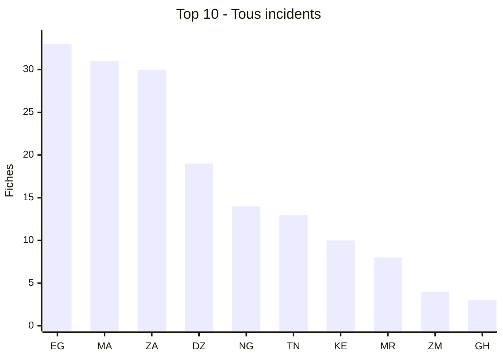
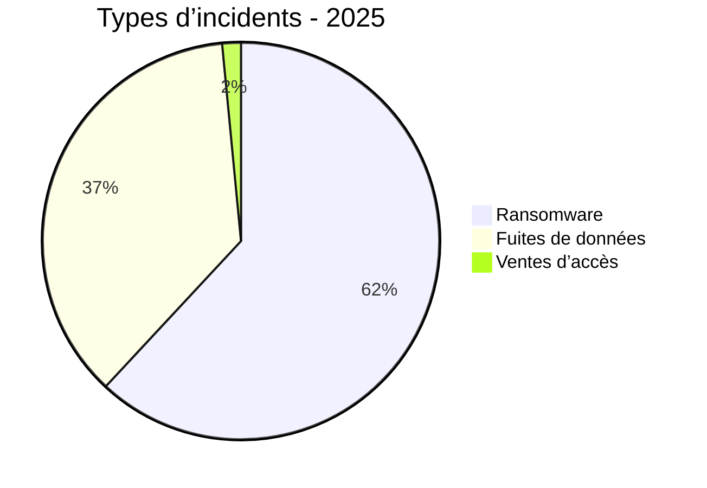
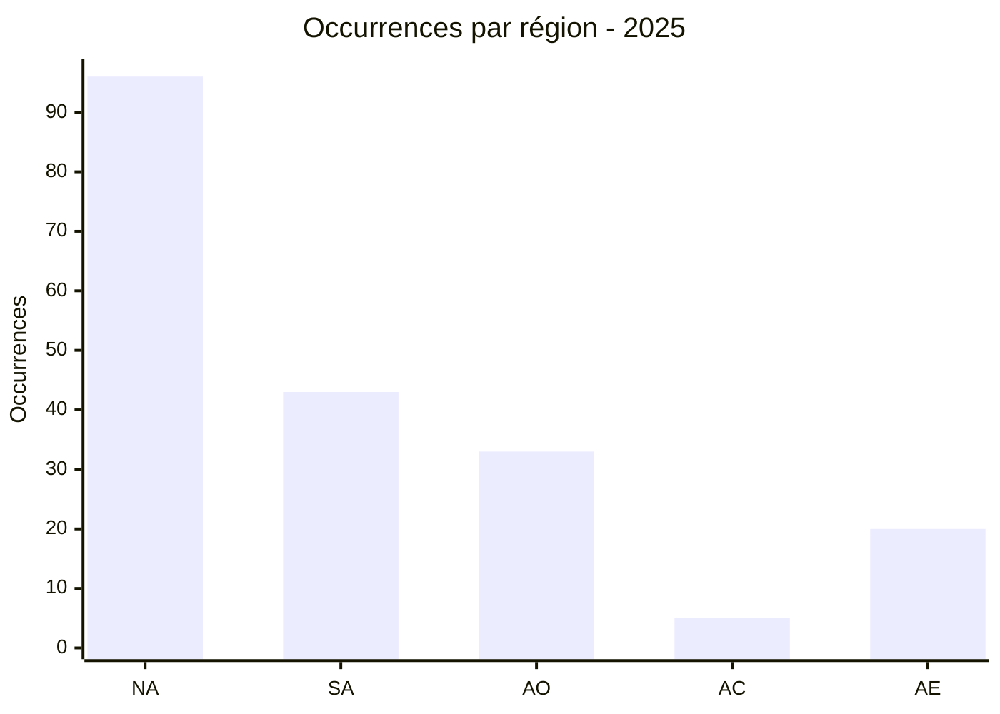
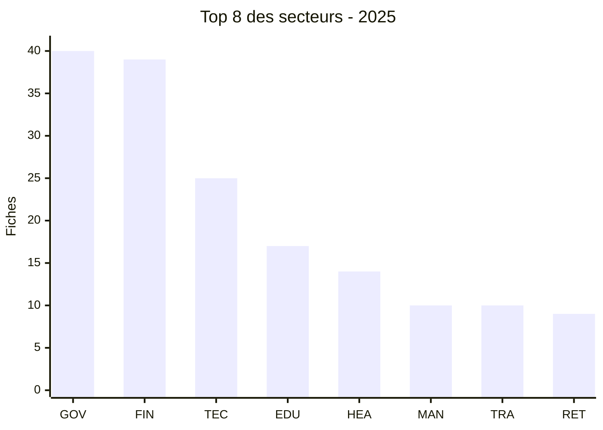
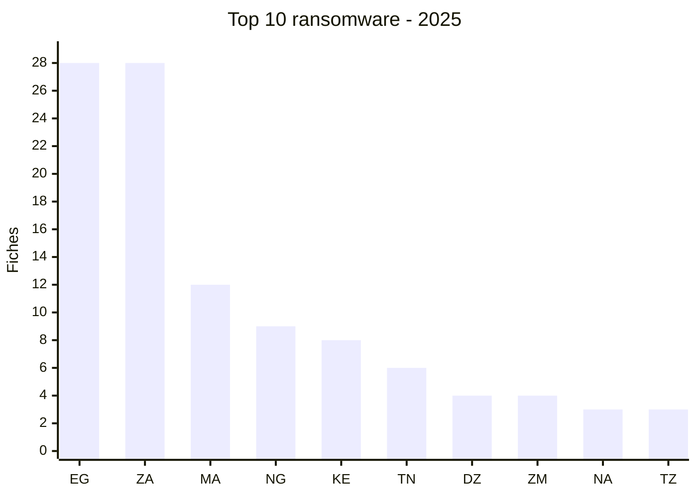
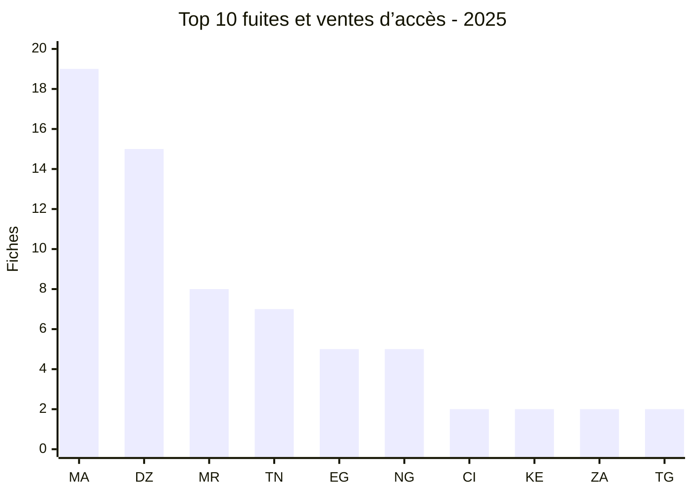
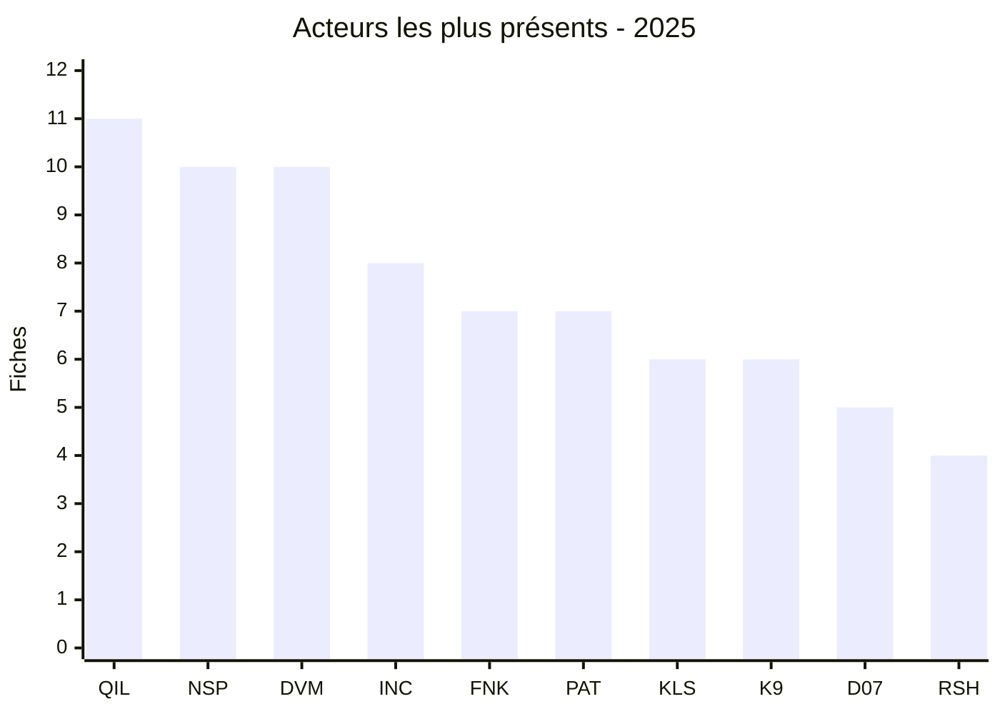

# Rapport CTI annuel AFRINTEL - 2025

👉🏾 [Version anglaise](./README.md)

  

---
## 1. Résumé exécutif

AFRINTEL a recensé **197 fiches** en 2025 : **122 revendications ransomware (61,9 %)**, **72 fuites de données (36,5 %)**, **3 ventes d’accès (1,5 %)** et **aucun défacement**. Le volume observé est fortement concentré en Afrique du Nord, avec **96 fiches**, devant l’Afrique australe (**43**), l’Afrique de l’Ouest (**33**), l’Afrique de l’Est (**20**) et l’Afrique centrale (**5**).

Les trois pays les plus représentés sont l’**Égypte (33)**, le **Maroc (31)** et l’**Afrique du Sud (30)**. Cette concentration ne traduit pas nécessairement un niveau de compromission supérieur dans ces pays : elle reflète le périmètre des publications et revendications documentées par AFRINTEL.

L’année se distingue par le poids du ransomware, mais aussi par une exposition importante des données issues des administrations, des établissements financiers et des organisations technologiques. Le gouvernement et l’administration (**40 fiches**) ainsi que la finance et la banque (**39**) constituent les deux secteurs les plus représentés, soit près de **40 %** du corpus. Les acteurs les plus visibles sont **qilin (11 fiches)**, **nightspire (10)** et **devman (10)**, sans que cette fréquence suffise à établir une campagne commune ou une attribution opérationnelle.

Le principal enjeu CTI reste la qualification des revendications : confirmer l’intrusion, distinguer une nouvelle compromission d’une republication et mesurer la taille réelle des données annoncées. Les ventes d’accès et les fuites doivent donc être suivies comme des signaux de risque distincts du ransomware, tout en recherchant les liens possibles entre accès exposés, exfiltration et extorsion.

## 2. Méthodologie

Les douze fichiers mensuels `victims.md` sont la source de vérité et contiennent 197 fiches distinctes pour 2025. Une fiche correspond à une publication ou une revendication documentée, pas nécessairement à une intrusion confirmée ni à une victime unique. Les republications et revendications distinctes sont conservées lorsque la source mensuelle les traite comme des fiches séparées ; cette limite est rappelée dans l’interprétation. Les comptages sont dérivés des fichiers sources sans extrapolation. Les graphes utilisent les codes ISO alpha-2 et les tableaux les noms normalisés des pays. Les secteurs sont regroupés dans une taxonomie annuelle contrôlée ; une activité réellement indéterminée reste signalée explicitement. Ransomware, fuites de données, ventes d’accès et défacements sont comptés séparément. Les publications de forums et de sites de fuite restent des revendications sans confirmation indépendante.

## 3. Vue globale

| Indicateur | Valeur |
| :--- | ---: |
| Fiches | **197** |
| Ransomware | **122 (61,9%)** |
| Fuites de données | **72 (36,5%)** |
| Ventes d’accès | **3 (1,5%)** |

### Classement par pays

| Rang | Pays | Fiches | Barre |
| :--- | ---: | ---: | ---: |
| 1 | 🇪🇬 Égypte | 33 | █████████████████████████████████ |
| 2 | 🇲🇦 Maroc | 31 | ███████████████████████████████ |
| 3 | 🇿🇦 Afrique du Sud | 30 | ██████████████████████████████ |
| 4 | 🇩🇿 Algérie | 19 | ███████████████████ |
| 5 | 🇳🇬 Nigeria | 14 | ██████████████ |
| 6 | 🇹🇳 Tunisie | 13 | █████████████ |
| 7 | 🇰🇪 Kenya | 10 | ██████████ |
| 8 | 🇲🇷 Mauritanie | 8 | ████████ |
| 9 | 🇿🇲 Zambie | 4 | ████ |
| 10 | 🇬🇭 Ghana | 3 | ███ |
| 11 | 🇨🇮 Côte d’Ivoire | 3 | ███ |
| 12 | 🇳🇦 Namibie | 3 | ███ |
| 13 | 🇹🇿 Tanzanie | 3 | ███ |
| 14 | 🇧🇼 Botswana | 2 | ██ |
| 15 | 🇨🇩 RDC | 2 | ██ |
| 16 | 🇲🇺 Maurice | 2 | ██ |
| 17 | 🇸🇳 Sénégal | 2 | ██ |
| 18 | 🇹🇬 Togo | 2 | ██ |
| 19 | 🇺🇬 Ouganda | 2 | ██ |
| 20 | 🇿🇼 Zimbabwe | 2 | ██ |
| 21 | 🇦🇴 Angola | 1 | █ |
| 22 | 🇧🇫 Burkina Faso | 1 | █ |
| 23 | 🇨🇲 Cameroun | 1 | █ |
| 24 | 🇩🇯 Djibouti | 1 | █ |
| 25 | 🇪🇷 Érythrée | 1 | █ |
| 26 | 🇬🇦 Gabon | 1 | █ |
| 27 | 🇲🇬 Madagascar | 1 | █ |
| 28 | 🇷🇼 Rwanda | 1 | █ |
| 29 | 🇧🇮 Burundi | 1 | █ |

Légende : EG = Égypte ; MA = Maroc ; ZA = Afrique du Sud ; DZ = Algérie ; NG = Nigeria ; TN = Tunisie ; KE = Kenya ; MR = Mauritanie ; ZM = Zambie ; GH = Ghana

### Répartition par type d’incident

| Type | Fiches | Part |
| :--- | ---: | ---: |
| Ransomware | 122 | 61,9% |
| Fuite de données | 72 | 36,5% |
| Vente d’accès | 3 | 1,5% |
| Défacement | 0 | 0,0% |
| **Total** | **197** | **100%** |

### Vue agrégée de l’exposition des données

Les fuites de données et les ventes d’accès sont regroupées ici pour une vue orientée exposition : **72 fuites de données + 3 ventes d’accès = 75 fiches**. Les compteurs détaillés restent séparés, car une vente d’accès ne prouve pas à elle seule l’exfiltration de données.

| Catégorie agrégée | Fiches | Part du corpus |
| :--- | ---: | ---: |
| Fuites de données + ventes d’accès | **75** | **38,1 %** |

Cette vue agrégée est dérivée et ne doit pas être ajoutée une seconde fois au total de 197 fiches.

### Classement des pays par ransomware

| Rang | Pays | ISO | Fiches | Barre couleur |
|---:|---|:---:|---:|---|
| 1 | Égypte | EG | 28 | 🟧🟧🟧🟧🟧🟧🟧🟧🟧🟧🟧🟧🟧🟧🟧🟧🟧🟧🟧🟧🟧🟧🟧🟧🟧🟧🟧🟧 |
| 2 | Afrique du Sud | ZA | 28 | 🟧🟧🟧🟧🟧🟧🟧🟧🟧🟧🟧🟧🟧🟧🟧🟧🟧🟧🟧🟧🟧🟧🟧🟧🟧🟧🟧🟧 |
| 3 | Maroc | MA | 12 | 🟧🟧🟧🟧🟧🟧🟧🟧🟧🟧🟧🟧 |
| 4 | Nigeria | NG | 9 | 🟧🟧🟧🟧🟧🟧🟧🟧🟧 |
| 5 | Kenya | KE | 8 | 🟧🟧🟧🟧🟧🟧🟧🟧 |
| 6 | Tunisie | TN | 6 | 🟧🟧🟧🟧🟧🟧 |
| 7 | Algérie | DZ | 4 | 🟧🟧🟧🟧 |
| 8 | Zambie | ZM | 4 | 🟧🟧🟧🟧 |
| 9 | Namibie | NA | 3 | 🟧🟧🟧 |
| 10 | Tanzanie | TZ | 3 | 🟧🟧🟧 |
| 11 | Botswana | BW | 2 | 🟧🟧 |
| 12 | Ghana | GH | 2 | 🟧🟧 |
| 13 | Maurice | MU | 2 | 🟧🟧 |
| 14 | Ouganda | UG | 2 | 🟧🟧 |
| 15 | Zimbabwe | ZW | 2 | 🟧🟧 |
| 16 | Cameroun | CM | 1 | 🟧 |
| 17 | RDC | CD | 1 | 🟧 |
| 18 | Côte d’Ivoire | CI | 1 | 🟧 |
| 19 | Gabon | GA | 1 | 🟧 |
| 20 | Madagascar | MG | 1 | 🟧 |
| 21 | Rwanda | RW | 1 | 🟧 |
| 22 | Sénégal | SN | 1 | 🟧 |

### Classement des pays par fuites de données

| Rang | Pays | ISO | Fiches | Barre couleur |
|---:|---|:---:|---:|---|
| 1 | Maroc | MA | 19 | 🟦🟦🟦🟦🟦🟦🟦🟦🟦🟦🟦🟦🟦🟦🟦🟦🟦🟦🟦 |
| 2 | Algérie | DZ | 15 | 🟦🟦🟦🟦🟦🟦🟦🟦🟦🟦🟦🟦🟦🟦🟦 |
| 3 | Mauritanie | MR | 8 | 🟦🟦🟦🟦🟦🟦🟦🟦 |
| 4 | Tunisie | TN | 7 | 🟦🟦🟦🟦🟦🟦🟦 |
| 5 | Égypte | EG | 5 | 🟦🟦🟦🟦🟦 |
| 6 | Nigeria | NG | 5 | 🟦🟦🟦🟦🟦 |
| 7 | Côte d’Ivoire | CI | 2 | 🟦🟦 |
| 8 | Kenya | KE | 2 | 🟦🟦 |
| 9 | Afrique du Sud | ZA | 2 | 🟦🟦 |
| 10 | Angola | AO | 1 | 🟦 |
| 11 | RDC | CD | 1 | 🟦 |
| 12 | Djibouti | DJ | 1 | 🟦 |
| 13 | Érythrée | ER | 1 | 🟦 |
| 14 | Ghana | GH | 1 | 🟦 |
| 15 | Togo | TG | 1 | 🟦 |
| 16 | Burundi | BI | 1 | 🟦 |

### Classement des pays par ventes d’accès

| Rang | Pays | ISO | Fiches | Barre couleur |
|---:|---|:---:|---:|---|
| 1 | Burkina Faso | BF | 1 | 🟨 |
| 2 | Sénégal | SN | 1 | 🟨 |
| 3 | Togo | TG | 1 | 🟨 |

Légende : 🟧 Ransomware | 🟦 Fuites de données | 🟨 Ventes d’accès

### Comparaison ransomware, fuites et ventes d’accès par pays

| Pays | Ransomware | Fuites / accès | Total | Distribution |
| :--- | ---: | ---: | ---: | ---: |
| 🇪🇬 Égypte | 28 | 5 | 33 | 🟧🟧🟧🟧🟧🟧🟧🟧🟧🟧🟧🟧🟧🟧🟧🟧🟧🟧🟧🟧🟧🟧🟧🟧🟧🟧🟧🟧 🟦🟦🟦🟦🟦 |
| 🇲🇦 Maroc | 12 | 19 | 31 | 🟧🟧🟧🟧🟧🟧🟧🟧🟧🟧🟧🟧 🟦🟦🟦🟦🟦🟦🟦🟦🟦🟦🟦🟦🟦🟦🟦🟦🟦🟦🟦 |
| 🇿🇦 Afrique du Sud | 28 | 2 | 30 | 🟧🟧🟧🟧🟧🟧🟧🟧🟧🟧🟧🟧🟧🟧🟧🟧🟧🟧🟧🟧🟧🟧🟧🟧🟧🟧🟧🟧 🟦🟦 |
| 🇩🇿 Algérie | 4 | 15 | 19 | 🟧🟧🟧🟧 🟦🟦🟦🟦🟦🟦🟦🟦🟦🟦🟦🟦🟦🟦🟦 |
| 🇳🇬 Nigeria | 9 | 5 | 14 | 🟧🟧🟧🟧🟧🟧🟧🟧🟧 🟦🟦🟦🟦🟦 |
| 🇹🇳 Tunisie | 6 | 7 | 13 | 🟧🟧🟧🟧🟧🟧 🟦🟦🟦🟦🟦🟦🟦 |
| 🇰🇪 Kenya | 8 | 2 | 10 | 🟧🟧🟧🟧🟧🟧🟧🟧 🟦🟦 |
| 🇲🇷 Mauritanie | 0 | 8 | 8 |  🟦🟦🟦🟦🟦🟦🟦🟦 |
| 🇿🇲 Zambie | 4 | 0 | 4 | 🟧🟧🟧🟧 |
| 🇬🇭 Ghana | 2 | 1 | 3 | 🟧🟧 🟦 |
| 🇨🇮 Côte d’Ivoire | 1 | 2 | 3 | 🟧 🟦🟦 |
| 🇳🇦 Namibie | 3 | 0 | 3 | 🟧🟧🟧 |
| 🇹🇿 Tanzanie | 3 | 0 | 3 | 🟧🟧🟧 |
| 🇧🇼 Botswana | 2 | 0 | 2 | 🟧🟧 |
| 🇨🇩 RDC | 1 | 1 | 2 | 🟧 🟦 |
| 🇲🇺 Maurice | 2 | 0 | 2 | 🟧🟧 |
| 🇸🇳 Sénégal | 1 | 1 | 2 | 🟧 🟦 |
| 🇹🇬 Togo | 0 | 2 | 2 |  🟦🟦 |
| 🇺🇬 Ouganda | 2 | 0 | 2 | 🟧🟧 |
| 🇿🇼 Zimbabwe | 2 | 0 | 2 | 🟧🟧 |
| 🇦🇴 Angola | 0 | 1 | 1 |  🟦 |
| 🇧🇫 Burkina Faso | 0 | 1 | 1 |  🟦 |
| 🇨🇲 Cameroun | 1 | 0 | 1 | 🟧 |
| 🇩🇯 Djibouti | 0 | 1 | 1 |  🟦 |
| 🇪🇷 Érythrée | 0 | 1 | 1 |  🟦 |
| 🇬🇦 Gabon | 1 | 0 | 1 | 🟧 |
| 🇲🇬 Madagascar | 1 | 0 | 1 | 🟧 |
| 🇷🇼 Rwanda | 1 | 0 | 1 | 🟧 |
| 🇧🇮 Burundi | 0 | 1 | 1 | 🟦 |

### Répartition géographique par région

| Région | Occurrences | Ransomware | Fuites / accès | Distribution |
| :--- | ---: | ---: | ---: | ---: |
| Afrique du Nord | 96 | 50 | 46 | 🟧🟧🟧🟧🟧🟧🟧🟧🟧🟧 🟦🟦🟦🟦🟦🟦🟦🟦🟦🟦 |
| Afrique australe | 43 | 41 | 2 | 🟧🟧🟧🟧🟧🟧🟧🟧 🟦 |
| Afrique de l’Ouest | 33 | 13 | 20 | 🟧🟧🟧 🟦🟦🟦🟦 |
| Afrique centrale | 5 | 3 | 2 | 🟧 🟦 |
| Afrique de l’Est | 20 | 15 | 5 | 🟧🟧🟧 🟦 |

Légende : NA = Afrique du Nord ; SA = Afrique australe ; AO = Afrique de l’Ouest ; AC = Afrique centrale ; AE = Afrique de l’Est

### Répartition sectorielle

| Secteur | Fiches | Part | Barre |
| :--- | ---: | ---: | ---: |
| Gouvernement / administration | 40 | 20,3% | ██████████ |
| Finance / banque | 39 | 19,8% | ██████████ |
| Technologies / informatique | 25 | 12,7% | ██████ |
| Éducation / universités | 17 | 8,6% | ████ |
| Santé / médical | 14 | 7,1% | ████ |
| Industrie / fabrication | 10 | 5,1% | ██ |
| Transport / logistique | 10 | 5,1% | ██ |
| Commerce / e-commerce | 9 | 4,6% | ██ |
| Services professionnels | 7 | 3,6% | ██ |
| Construction / immobilier | 6 | 3,0% | ██ |
| Défense / sécurité | 6 | 3,0% | ██ |
| Énergie / services publics | 4 | 2,0% | █ |
| Agriculture / agro-industrie | 3 | 1,5% | █ |
| Juridique / justice | 2 | 1,0% | █ |
| Mines | 2 | 1,0% | █ |
| Non précisé | 2 | 1,0% | █ |
| Société civile / ONG | 1 | 0,5% | █ |

Légende : GOV = Gouvernement / administration ; FIN = Finance / banque ; TEC = Technologies / informatique ; EDU = Éducation / universités ; HEA = Santé / médical ; MAN = Industrie / fabrication ; TRA = Transport / logistique ; RET = Commerce / e-commerce

Le graphique présente les huit secteurs contrôlés les plus représentés ; le tableau ci-dessus fait foi pour la répartition complète des 197 fiches.

### Graphiques par type d’incident

Légende : EG = Égypte ; ZA = Afrique du Sud ; MA = Maroc ; NG = Nigeria ; KE = Kenya ; TN = Tunisie ; DZ = Algérie ; ZM = Zambie ; NA = Namibie ; TZ = Tanzanie

Légende : MA = Maroc ; DZ = Algérie ; MR = Mauritanie ; TN = Tunisie ; EG = Égypte ; NG = Nigeria ; CI = Côte d’Ivoire ; KE = Kenya ; ZA = Afrique du Sud ; TG = Togo

## 4. Analyse détaillée par type d’incident

Les revendications ransomware représentent **122 fiches**, soit **61,9 %** du corpus. Elles dominent particulièrement en Afrique australe (**41 fiches**) et restent majoritaires en Afrique du Nord (**50**), tandis que les fuites et ventes d’accès atteignent respectivement **46** et **22** fiches dans ces deux régions.

Les fuites de données et ventes d’accès représentent **75 fiches**. Le Maroc arrive en tête avec **19 fiches**, suivi de l’Algérie (**15**), de la Mauritanie (**8**) et de la Tunisie (**7**). Les données revendiquées concernent notamment des environnements administratifs, financiers, médicaux, éducatifs et commerciaux. Cette répartition montre que la fuite de données ne constitue pas seulement une conséquence du ransomware : elle apparaît aussi comme un risque autonome, associé à l’exposition de bases, à la revente d’accès ou à la republication d’échantillons.

## 5. Impact sectoriel

Les secteurs gouvernemental et administratif (**40 fiches**) ainsi que financier et bancaire (**39**) arrivent en tête, devant les technologies et l’informatique (**25**) et l’éducation (**17**). À eux seuls, les secteurs gouvernemental et financier représentent près de **40 %** du corpus. Cette concentration élargit la priorité de défense aux systèmes publics, aux services financiers, aux prestataires technologiques et aux établissements éducatifs, avec des risques distincts selon la nature des données exposées.

## 6. Profil des acteurs et évaluation du risque

| Acteur / Groupe | Fiches | Activité |
| :--- | ---: | ---: |
| qilin | 11 | ██████████ |
| nightspire | 10 | █████████ |
| devman | 10 | █████████ |
| incransom | 8 | ███████ |
| funksec | 7 | ██████ |
| Phantom Atlas | 7 | ██████ |
| killsec | 6 | █████ |
| kill9 | 6 | █████ |
| Dark 07x Team | 5 | █████ |
| ransomhub | 4 | ████ |

| Pays | Niveau | Justification |
| :--- | :--- | :--- |
| 🇪🇬 Égypte | 🔴 Élevé | Plus forte visibilité ransomware et plus grand volume national de fiches. |
| 🇲🇦 Maroc | 🔴 Élevé | Plus grand volume de fuites et deuxième volume global. |
| 🇿🇦 Afrique du Sud | 🔴 Élevé | Volume ransomware élevé et revendications sensibles dans les secteurs public et financier. |
| 🇩🇿 Algérie | 🔴 Élevé | Volume élevé de fuites et publications répétées concernant des administrations. |
| 🇳🇬 Nigeria | 🔴 Élevé | Activité combinée ransomware et fuites visant des organisations publiques et privées. |

### Graphique des acteurs les plus présents

Légende : QIL = qilin ; NSP = nightspire ; DVM = devman ; INC = incransom ; FNK = funksec ; PAT = Phantom Atlas ; KLS = killsec ; K9 = kill9 ; D07 = Dark 07x Team ; RSH = ransomhub

## 7. Tendances et lacunes de renseignement

L’année 2025 met en évidence trois lacunes de renseignement. Premièrement, la revendication publiée ne permet pas toujours de confirmer l’intrusion ni le volume réel des données. Deuxièmement, une même organisation peut apparaître dans des publications distinctes, sans qu’il soit possible de conclure immédiatement à une nouvelle compromission, une mise à jour ou une republication. Enfin, les ventes d’accès et les fuites doivent être corrélées avec les journaux IAM, VPN, EDR, messagerie, proxy et WAF afin de déterminer si elles correspondent à un risque actif ou à une exposition ancienne.

## 8. Cartographie MITRE ATT&CK contextuelle

| Phase | Technique | Contexte défensif | Niveau de preuve |
| :--- | ---: | --- | --- |
| Impact | T1486 - Data Encrypted for Impact | Rechercher les comportements de chiffrement et l’impact sur la restauration lorsqu’une revendication est corroborée. | Non établi par la publication seule |
| Exfiltration | T1567 - Exfiltration Over Web Service | Examiner les sorties vers des services web et les transferts d’archives dans les cas validés. | Hypothèse contextuelle |
| Accès aux identifiants | T1078 - Valid Accounts | Vérifier les accès annoncés avec les journaux IAM, VPN et d’authentification. | Une revendication ne prouve pas l’utilisation d’un compte valide |

## 9. Recommandations

- Vérifier les revendications avec les journaux, EDR, IAM, sauvegardes et l’organisation concernée avant de les traiter comme des incidents confirmés.
- Imposer une MFA résistante au phishing, revoir les accès privilégiés, segmenter les réseaux, maintenir des sauvegardes hors ligne et faire tourner les secrets.
- Équipes cloud et applicatives : supprimer les lectures publiques, revoir l’exposition des stockages et bases, et surveiller les exports massifs.
- Administrations et organisations financières : surveiller les VPN, comptes privilégiés, accès distants et transferts sortants inhabituels.
- Éducation, santé et technologies : appliquer la minimisation des données, des durées de conservation et des procédures de notification.

## 10. Recommandations SOC et tactiques

- Corréler EDR, VPN, IAM, DNS, proxy, WAF et journaux applicatifs ; alerter sur les déplacements impossibles, nouveaux appareils MFA, lectures massives, créations d’archives et sorties inhabituelles.
- Suivre les identifiants et accès exposés dans une file dédiée, puis les valider ou les révoquer par des canaux internes de confiance.

## 11. Recommandations stratégiques

- Maintenir un inventaire des actifs et données exposés sur Internet, tester les plans de réponse et de restauration, et définir les responsabilités pour la validation, la protection des données et l’escalade exécutive.

## 12. Conclusion

L’année 2025 indique une pression cyber diversifiée : le ransomware reste majoritaire, mais les fuites de données et les ventes d’accès élargissent la surface de risque vers les administrations, les banques, les technologies et l’éducation. Les chiffres décrivent les publications observées par AFRINTEL ; ils doivent guider la veille, la validation technique et la réduction du risque, sans transformer une revendication en compromission confirmée.

**AFRINTEL** - TLP:CLEAR
