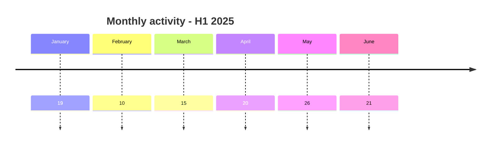
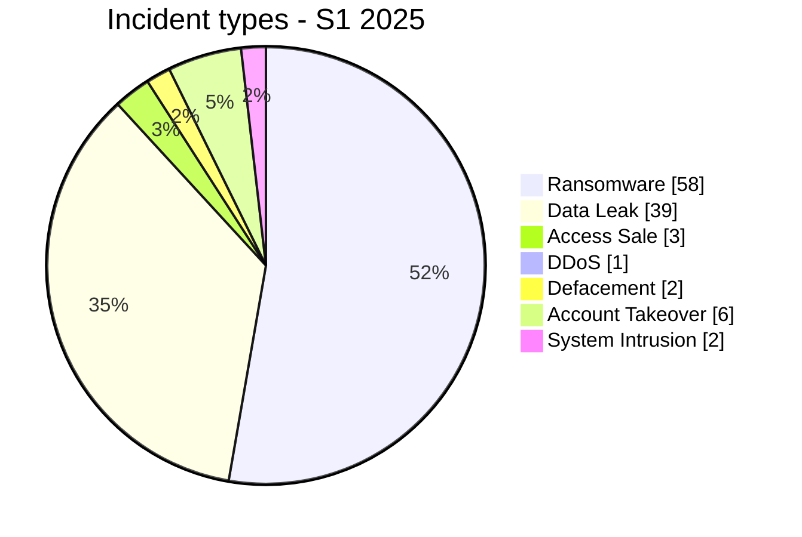

# AFRINTEL Semiannual CTI Report - Cyber Threats in Africa - H1 2025

👉🏾 [Version française](./README_H1_FR.md)

   

## 1. Executive summary

Between January-June 2025, AFRINTEL documented **111 cyber incidents** affecting organizations, institutions, and digital services across Africa.

The semester is dominated by **Ransomware with 58 records (52.3%)** and **Data Leak with 39 (35.1%)**. Together, they account for **97 incidents, or 87.4% of the semester corpus**. Other events include 3 Access Sale, 6 Account Takeover, 2 Defacement, 1 DDoS, 2 System Intrusion, and 0 Malware.

Geographic concentration is significant: **South Africa (23)**, **Egypt (17)**, and **Morocco (16)** lead the semester. Together, these countries represent **56 records, or 50.5%**.

At sector level, **Government / Administration (27)**, **Finance / Banking (19)**, and **Technology / IT (12)** are most represented. The top two sectors account for **46 records, or 41.4%**.

Activity varies across the semester: **May is the highest-volume month with 26 incidents**, while **February records 10**.

Evidence maturity remains heterogeneous. AFRINTEL distinguishes unverified claims, sample-backed publications, claimed full publications, independent corroboration, and victim or authority confirmation. **A criminal claim, attribution, or advertised volume is not treated as confirmed without sufficient supporting evidence.**

> **Reading note:** AFRINTEL figures measure documented incidents and the visibility of observed threats. They are not an exhaustive measurement of every compromise that actually occurred across Africa.

👉🏾 [See semester victims](./victims_H1.md)

## 2. Methodology

- **Period:** January-June 2025.
- **Source of truth:** the six validated monthly `victims_FR.md` / `victims.md` pairs.
- **Counting:** one canonical record equals one documented cyber incident; cases under investigation remain outside statistics.
- **Classification:** Ransomware, Data Leak, Access Sale, DDoS, Defacement, Account Takeover, System Intrusion, Malware, and Operational Fraud.
- **Timeline:** `Incident date` and `Initial publication date` remain separate.
- **Uncertain dates:** when no exact day is established, the evidence-supported month or time window is retained; no exact day is invented.
- **Sources:** public links are retained for supplementary cases found online; they are not retroactively imposed on historical or direct Dark Web observations.
- **Sectors:** normalization is calculated once and the same values are used in FR and EN.
- **Limitation:** the corpus represents AFRINTEL visibility rather than every cyberattack that actually occurred across the continent.

## 3. Corrected H1 2024 vs H1 2025 comparison

The final corrected H1 2024 corpus contains **45 canonical incidents**, compared with **111** in H1 2025. The 2024 baseline has undergone chronology review and reclassification under the **same nine incident types** used for 2025, so the categories below are directly comparable and valid zero values are no longer shown as `N/A`.

| Indicator | Final corrected 2024 | 2025 | Change |
|---|---:|---:|---:|
| Total incidents | 45 | 111 | **+66 (+146.7%)** |
| Ransomware | 34 | 58 | **+24 (+70.6%)** |
| Data Leak | 4 | 39 | **+35 (+875.0%)** |
| Access Sale | 1 | 3 | **+2 (+200.0%)** |
| DDoS | 2 | 1 | **-1 (-50.0%)** |
| Defacement | 0 | 2 | **+2 (newly observed)** |
| Account Takeover | 0 | 6 | **+6 (newly observed)** |
| System Intrusion | 3 | 2 | **-1 (-33.3%)** |
| Malware | 0 | 0 | **Stable** |
| Operational Fraud | 1 | 0 | **-1 (-100.0%)** |

The documented H1 corpus increases from **45 to 111 incidents**, an increase of **66 (+146.7%)**. The largest absolute differences are Data Leak (**+35**) and Ransomware (**+24**). These figures describe the evolution of the AFRINTEL observable corpus and should not be interpreted as an equivalent increase in successful real-world compromises.

## 4. Monthly evolution

| Month | Total | Ransomware | Data Leak | Access Sale | DDoS | Defacement | Account Takeover | System Intrusion | Malware | Operational Fraud |
|---|---:|---:|---:|---:|---:|---:|---:|---:|---:|---:|
| January | 19 | 16 | 2 | 0 | 0 | 0 | 1 | 0 | 0 | 0 |
| February | 10 | 8 | 0 | 0 | 0 | 0 | 2 | 0 | 0 | 0 |
| March | 15 | 9 | 2 | 1 | 0 | 0 | 2 | 1 | 0 | 0 |
| April | 20 | 7 | 10 | 2 | 1 | 0 | 0 | 0 | 0 | 0 |
| May | 26 | 13 | 9 | 0 | 0 | 2 | 1 | 1 | 0 | 0 |
| June | 21 | 5 | 16 | 0 | 0 | 0 | 0 | 0 | 0 | 0 |
| **Total** | **111** | **58** | **39** | **3** | **1** | **2** | **6** | **2** | **0** | **0** |

### 4.1 Monthly volume

| Month | Records | Volume |
|---|---:|---|
| January | 19 | ███████████████████ |
| February | 10 | ██████████ |
| March | 15 | ███████████████ |
| April | 20 | ████████████████████ |
| May | 26 | ██████████████████████████ |
| June | 21 | █████████████████████ |

## 5. Incident-type distribution

| Incident type | Records | Share |
|---|---:|---:|
| Ransomware | **58** | 52.3% |
| Data Leak | **39** | 35.1% |
| Access Sale | **3** | 2.7% |
| DDoS | **1** | 0.9% |
| Defacement | **2** | 1.8% |
| Account Takeover | **6** | 5.4% |
| System Intrusion | **2** | 1.8% |
| Malware | **0** | 0.0% |
| Operational Fraud | **0** | 0.0% |
| **Total** | **111** | **100%** |

Ransomware and Data Leak together account for **97 records (87.4%)**.

## 6. Geographic distribution

### 6.1 Countries by incident type

| Country | Total | Ransomware | Data Leak | Access Sale | DDoS | Defacement | Account Takeover | System Intrusion | Malware |
|---|---:|---:|---:|---:|---:|---:|---:|---:|---:|
| South Africa | **23** | 17 | 3 | 0 | 0 | 1 | 1 | 1 | 0 |
| Egypt | **17** | 15 | 2 | 0 | 0 | 0 | 0 | 0 | 0 |
| Morocco | **16** | 5 | 9 | 1 | 1 | 0 | 0 | 0 | 0 |
| Algeria | **13** | 2 | 11 | 0 | 0 | 0 | 0 | 0 | 0 |
| Kenya | **7** | 3 | 1 | 0 | 0 | 0 | 3 | 0 | 0 |
| Mauritania | **7** | 0 | 7 | 0 | 0 | 0 | 0 | 0 | 0 |
| Nigeria | **6** | 4 | 1 | 0 | 0 | 0 | 0 | 1 | 0 |
| Ghana | **4** | 1 | 2 | 0 | 0 | 0 | 1 | 0 | 0 |
| Zambia | **2** | 2 | 0 | 0 | 0 | 0 | 0 | 0 | 0 |
| Botswana | **2** | 2 | 0 | 0 | 0 | 0 | 0 | 0 | 0 |
| Tanzania | **2** | 1 | 0 | 0 | 0 | 0 | 1 | 0 | 0 |
| Tunisia | **2** | 1 | 1 | 0 | 0 | 0 | 0 | 0 | 0 |
| Uganda | **1** | 1 | 0 | 0 | 0 | 0 | 0 | 0 | 0 |
| Namibia | **1** | 1 | 0 | 0 | 0 | 0 | 0 | 0 | 0 |
| Burkina Faso | **1** | 0 | 0 | 1 | 0 | 0 | 0 | 0 | 0 |
| Rwanda | **1** | 1 | 0 | 0 | 0 | 0 | 0 | 0 | 0 |
| Senegal | **1** | 0 | 0 | 1 | 0 | 0 | 0 | 0 | 0 |
| Ivory Coast | **1** | 0 | 0 | 0 | 0 | 1 | 0 | 0 | 0 |
| Cameroon | **1** | 1 | 0 | 0 | 0 | 0 | 0 | 0 | 0 |
| Togo | **1** | 0 | 1 | 0 | 0 | 0 | 0 | 0 | 0 |
| Mauritius | **1** | 1 | 0 | 0 | 0 | 0 | 0 | 0 | 0 |
| Djibouti | **1** | 0 | 1 | 0 | 0 | 0 | 0 | 0 | 0 |
| **Total** | **111** | **58** | **39** | **3** | **1** | **2** | **6** | **2** | **0** |

> `Operational Fraud = 0` in this semester; the column is omitted for readability.

### 6.2 Regional distribution

| Region | Total | Share | Ransomware | Data Leak | Access Sale | DDoS | Defacement | Account Takeover | System Intrusion | Malware |
|---|---:|---:|---:|---:|---:|---:|---:|---:|---:|---:|
| North Africa | **48** | 43.2% | 23 | 23 | 1 | 1 | 0 | 0 | 0 | 0 |
| Southern Africa | **28** | 25.2% | 22 | 3 | 0 | 0 | 1 | 1 | 1 | 0 |
| West Africa | **21** | 18.9% | 5 | 11 | 2 | 0 | 1 | 1 | 1 | 0 |
| East Africa | **12** | 10.8% | 6 | 2 | 0 | 0 | 0 | 4 | 0 | 0 |
| Central Africa | **1** | 0.9% | 1 | 0 | 0 | 0 | 0 | 0 | 0 | 0 |
| Indian Ocean | **1** | 0.9% | 1 | 0 | 0 | 0 | 0 | 0 | 0 | 0 |
| **Total** | **111** | **100%** | **58** | **39** | **3** | **1** | **2** | **6** | **2** | **0** |

The leading region is **North Africa with 48 incidents (43.2%)**.

## 7. Sector distribution

| Sector | Records | Share | Activity |
|---|---:|---:|---|
| Government / Administration | 27 | 24.3% | ██████████████ |
| Finance / Banking | 19 | 17.1% | ██████████ |
| Technology / IT | 12 | 10.8% | ██████ |
| Education / University | 10 | 9.0% | █████ |
| Healthcare / Medical | 7 | 6.3% | ████ |
| Professional / Business Services | 7 | 6.3% | ████ |
| Telecommunications | 5 | 4.5% | ██ |
| Retail / E-commerce | 4 | 3.6% | ██ |
| Transport / Logistics | 3 | 2.7% | ██ |
| Media / Entertainment | 3 | 2.7% | ██ |
| Not specified | 3 | 2.7% | ██ |
| Defense / Security | 3 | 2.7% | ██ |
| Agriculture / Agribusiness | 2 | 1.8% | █ |
| Manufacturing / Industry | 2 | 1.8% | █ |
| Mining | 2 | 1.8% | █ |
| Hospitality / Tourism | 1 | 0.9% | █ |
| Construction / Real Estate | 1 | 0.9% | █ |
| **Total** | **111** | **100%** | |

## 8. Actor / group profile

`Unknown` represents missing attribution and is not a threat actor.

| Actor / Group | Records | Activity |
|---|---:|---|
| Unknown | 13 | █████████████ |
| devman | 8 | ████████ |
| funksec | 7 | ███████ |
| nightspire | 6 | ██████ |
| Phantom Atlas | 6 | ██████ |
| kill9 | 6 | ██████ |
| ransomhub | 4 | ████ |
| killsec | 4 | ████ |
| mrdump | 4 | ████ |
| GDLockerSec | 3 | ███ |
| babuk2 | 3 | ███ |
| spacebears | 2 | ██ |
| arcusmedia | 2 | ██ |
| lynx | 2 | ██ |
| Jabaroot DZ | 2 | ██ |
| B4baYega | 2 | ██ |
| incransom | 2 | ██ |
| warlock | 2 | ██ |
| Keymous | 2 | ██ |

## 9. Evidence maturity

| Analytical grouping | Records | Share |
|---|---:|---:|
| Claim - Unverified | 46 | 41.4% |
| Claim - Data Sample Published | 47 | 42.3% |
| Data Fully Published | 3 | 2.7% |
| Victim/Government/Authority Confirmed | 11 | 9.9% |
| Corroborated / Secondary evidence | 3 | 2.7% |
| Attempted | 1 | 0.9% |
| **Total** | **111** | **100%** |

This grouping improves semester-level readability without replacing the detailed statuses in victim records.

## 10. CTI analysis by incident type

### Ransomware - 58

Ransomware represents **58 records (52.3%)**. Leading countries are South Africa (17), Egypt (15), Morocco (5). A leak-site listing does not itself prove encryption.

### Data Leak - 39

Data Leak represents **39 records (35.1%)**. Leading countries are Algeria (11), Morocco (9), Mauritania (7). Publication, observed sample, and claimed aggregate volume remain separate evidence levels.

### Access Sale - 3

The semester contains **3 Access Sale records**. Main distribution: Burkina Faso (1), Senegal (1), Morocco (1). An access offer proves neither data leakage nor access to the victim's entire internal infrastructure.

### DDoS - 1

The semester documents **1 DDoS campaign**. Distribution: Morocco (1). Counts refer to documented campaigns, not necessarily every individual targeted domain.

### Defacement - 2

The semester contains **2 Defacement records**. Distribution: South Africa (1), Ivory Coast (1). Visible modification is not reclassified as Data Leak without separate evidence.

### Account Takeover - 6

The semester documents **6 Account Takeover records**. Distribution: Kenya (3), South Africa (1), Ghana (1). This category represents institutional account compromises without conflating them with website defacement.

### System Intrusion - 2

The semester contains **2 System Intrusion records**. Distribution: South Africa (1), Nigeria (1). It is used when system access or attempted access is established without enough evidence for a more specific category.

### Malware - 0

No incident is classified as `Malware` during this semester. This zero value reflects the canonical AFRINTEL corpus for H1 2025 and does not imply an absence of malware activity across Africa.

### Operational Fraud - 0

No incident is classified as `Operational Fraud` during this semester. Absence from the corpus does not imply absence of cyber-enabled fraud on the continent.

## 11. Leading countries by incident type

### 11.1 Top 10 Ransomware

| Rank | Country | Records |
|---:|---|---:|
| 1 | South Africa | **17** |
| 2 | Egypt | **15** |
| 3 | Morocco | **5** |
| 4 | Nigeria | **4** |
| 5 | Kenya | **3** |
| 6 | Algeria | **2** |
| 7 | Zambia | **2** |
| 8 | Botswana | **2** |
| 9 | Uganda | **1** |
| 10 | Ghana | **1** |

### 11.2 Top 10 Data Leak

| Rank | Country | Records |
|---:|---|---:|
| 1 | Algeria | **11** |
| 2 | Morocco | **9** |
| 3 | Mauritania | **7** |
| 4 | South Africa | **3** |
| 5 | Egypt | **2** |
| 6 | Ghana | **2** |
| 7 | Kenya | **1** |
| 8 | Nigeria | **1** |
| 9 | Togo | **1** |
| 10 | Tunisia | **1** |

### 11.3 Other incident types

| Type | Country distribution | Total |
|---|---|---:|
| Access Sale | Burkina Faso (1), Senegal (1), Morocco (1) | **3** |
| DDoS | Morocco (1) | **1** |
| Defacement | South Africa (1), Ivory Coast (1) | **2** |
| Account Takeover | Kenya (3), South Africa (1), Ghana (1), Tanzania (1) | **6** |
| System Intrusion | South Africa (1), Nigeria (1) | **2** |
| Malware | - | **0** |

## 12. Key CTI findings

- Ransomware remains the leading semester category, while Data Leak accounts for a major share of the corpus.
- Country-level ranking should be paired with incident-type analysis.
- Government and financial organizations remain among the most represented sectors.
- Access sales remain separate from data leaks until exfiltration is supported.
- Institutional account takeover is tracked as a distinct threat when observed.
- Availability of technical evidence, official confirmations, and DFIR conclusions remains uneven.

## 13. Intelligence gaps

- initial-access vectors are frequently unknown;
- exact technical compromise dates are sometimes unavailable;
- claimed volumes are rarely fully verifiable;
- technical attribution is often limited to a publication handle or label;
- public information on remediation, root cause, and post-incident investigations remains limited;
- cases under investigation remain excluded from canonical statistics.

## 14. Recommendations

### 14.1 Organizations

- enforce phishing-resistant MFA for privileged accounts, VPN, email, social media, and administration consoles;
- apply PAM, least privilege, segmentation, and regular secret rotation;
- maintain immutable backups and test restoration;
- strengthen public applications, APIs, and administration interfaces;
- formalize incident-response and data-breach notification procedures.

### 14.2 SOC and detection

- monitor abnormal authentication, MFA changes, privileged-account creation, and role elevation;
- detect mass database reads, unusual exports, archive creation, and large outbound transfers;
- correlate EDR, IAM, VPN, WAF, proxy, DNS, cloud, and application logs;
- monitor exposed institutional social-media accounts;
- distinguish DDoS, internal intrusion, and data exposure.

### 14.3 CTI

- separate first observation, incident date, initial publication, sample, disclosure, and confirmation;
- track republication and resale without automatically counting them as new compromise;
- preserve the evidence hierarchy between claim, corroboration, and confirmation;
- maintain FR/EN parity before generating statistics.

## 15. Conclusion

H1 2025 contains **111 documented cyber incidents**. Ransomware and Data Leak remain dominant, but the other types confirm a more diverse threat landscape than a view limited to extortion and leaks.

The CTI value of the report comes from separating **incident type, timeline, evidence level, geography, sector, and actor**, providing a structured picture of the observable African threat environment without turning uncertainty into certainty.

**AFRINTEL** - TLP:CLEAR
