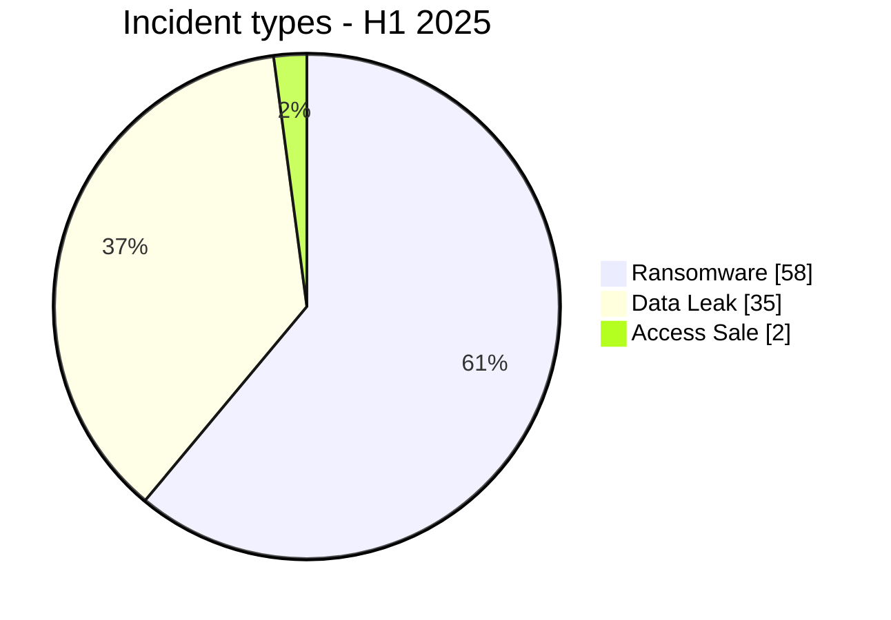
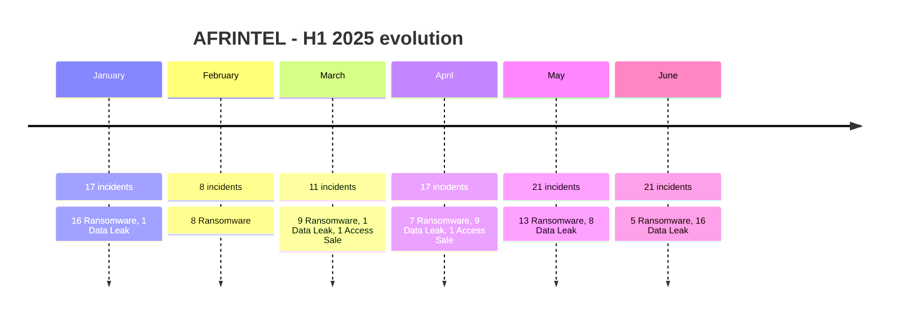

# AFRINTEL CTI Report - First Half of 2025

👉🏾 [**French version available here**](./README_H1_FR.md)

## 1. Executive summary

AFRINTEL documented **95 unique incidents** between January and June 2025, split into **58 Ransomware**, **35 Data Leak** and **2 Access Sale**.

- **Ransomware**: 58 incidents, or **61.1%** of the corpus.
- **Data Leak**: 35 incidents, or **36.8%**.
- **Access Sale**: 2 incidents, or **2.1%**.
- **21 African countries** appear in the first-half corpus.
- **South Africa** leads with **18 incidents**, followed by Egypt with 17, Morocco with 14 and Algeria with 13.
- **Government / Administration** is the leading harmonized sector with **26 incidents**.
- **devman** is the most visible label with **8 records**, followed by funksec with 7.
- The H1 total rises from 94 to **95** after the addition of the **North-West University (NWU)** Data Leak record to January 2025.

These figures describe publications, claims and incidents documented by AFRINTEL. They do not independently confirm every compromise and are not an exhaustive measurement of real cyber activity across Africa.

## 2. Corrections to the H1 consolidation

| Item | Previous value | Harmonized value |
|---|---:|---:|
| H1 total | 94 | **95** |
| January | 16 | **17** |
| H1 Ransomware | 58 | **58** |
| Data Leak + Access Sale | 36 | **37** |
| Data Leak | not separated | **35** |
| Access Sale | not separated | **2** |
| South Africa | 17 | **18** |

The total changes because **North-West University (NWU)** was added as a January Data Leak. The 58 Ransomware incidents remain unchanged.

## 3. Methodology

- **Scope**: 54 African countries.
- **Period**: 1 January to 30 June 2025.
- **Source of truth**: harmonized monthly `victims_FR.md` / `victims.md` pairs.
- **Workflow**: qualification and editorial control in `victims_FR.md`, followed by English synchronization and parity checks.
- **Counting**: one unique incident card equals one monthly occurrence.
- **Taxonomy**: Ransomware, Data Leak, Access Sale, DDoS, Defacement, Operational Fraud.
- **Qualification**: actor claim, published sample, full publication and independent confirmation remain distinct evidence levels.

## 4. Incident-type distribution

| Incident type | H1 2025 | Share |
|---|---:|---:|
| Ransomware | **58** | **61.1%** |
| Data Leak | **35** | **36.8%** |
| Access Sale | **2** | **2.1%** |
| DDoS | 0 | 0.0% |
| Defacement | 0 | 0.0% |
| Operational Fraud | 0 | 0.0% |
| **Total** | **95** | **100%** |

**Color convention:** 🟧 Ransomware | 🟦 Data Leak | 🟪 Access Sale | 🟥 DDoS | 🟨 Defacement | 🟩 Operational Fraud.

## 5. Monthly evolution

| Month | Incidents | Ransomware | Data Leak | Access Sale |
|---|---:|---:|---:|---:|
| January | 17 | 16 | 1 | 0 |
| February | 8 | 8 | 0 | 0 |
| March | 11 | 9 | 1 | 1 |
| April | 17 | 7 | 9 | 1 |
| May | 21 | 13 | 8 | 0 |
| June | 21 | 5 | 16 | 0 |
| **H1 2025** | **95** | **58** | **35** | **2** |

February is the lowest month with 8 incidents, while May and June each reach 21. The incident mix shifts sharply in June, with Data Leak rising to 16 while Ransomware falls to 5.

## 6. Country distribution

| Country | Ransomware | Data Leak | Access Sale | Total | Distribution |
|---|---:|---:|---:|---:|---|
| 🇿🇦 South Africa | 17 | 1 | 0 | 18 | 🟧🟧🟧🟧🟧🟧🟧🟧🟧🟧🟧🟧🟧🟧🟧🟧🟧🟦 |
| 🇪🇬 Egypt | 15 | 2 | 0 | 17 | 🟧🟧🟧🟧🟧🟧🟧🟧🟧🟧🟧🟧🟧🟧🟧🟦🟦 |
| 🇲🇦 Morocco | 5 | 9 | 0 | 14 | 🟧🟧🟧🟧🟧🟦🟦🟦🟦🟦🟦🟦🟦🟦 |
| 🇩🇿 Algeria | 2 | 11 | 0 | 13 | 🟧🟧🟦🟦🟦🟦🟦🟦🟦🟦🟦🟦🟦 |
| 🇲🇷 Mauritania | 0 | 7 | 0 | 7 | 🟦🟦🟦🟦🟦🟦🟦 |
| 🇳🇬 Nigeria | 4 | 1 | 0 | 5 | 🟧🟧🟧🟧🟦 |
| 🇰🇪 Kenya | 3 | 0 | 0 | 3 | 🟧🟧🟧 |
| 🇧🇼 Botswana | 2 | 0 | 0 | 2 | 🟧🟧 |
| 🇬🇭 Ghana | 1 | 1 | 0 | 2 | 🟧🟦 |
| 🇹🇳 Tunisia | 1 | 1 | 0 | 2 | 🟧🟦 |
| 🇿🇲 Zambia | 2 | 0 | 0 | 2 | 🟧🟧 |
| 🇧🇫 Burkina Faso | 0 | 0 | 1 | 1 | 🟪 |
| 🇨🇲 Cameroon | 1 | 0 | 0 | 1 | 🟧 |
| 🇩🇯 Djibouti | 0 | 1 | 0 | 1 | 🟦 |
| 🇲🇺 Mauritius | 1 | 0 | 0 | 1 | 🟧 |
| 🇳🇦 Namibia | 1 | 0 | 0 | 1 | 🟧 |
| 🇷🇼 Rwanda | 1 | 0 | 0 | 1 | 🟧 |
| 🇸🇳 Senegal | 0 | 0 | 1 | 1 | 🟪 |
| 🇹🇬 Togo | 0 | 1 | 0 | 1 | 🟦 |
| 🇹🇿 Tanzania | 1 | 0 | 0 | 1 | 🟧 |
| 🇺🇬 Uganda | 1 | 0 | 0 | 1 | 🟧 |
| **Total** | **58** | **35** | **2** | **95** | |

### Geographic highlights

- **South Africa**: 18 incidents, including 17 Ransomware and 1 Data Leak.
- **Egypt**: 17 incidents, including 15 Ransomware and 2 Data Leak.
- **Morocco**: 14 incidents, including 5 Ransomware and 9 Data Leak.
- **Algeria**: 13 incidents, strongly weighted toward Data Leak, with 11 versus 2 Ransomware.
- **Mauritania**: 7 Data Leak records, mainly linked to the kill9 banking campaign in May.
- **Nigeria**: 5 incidents, including 4 Ransomware and 1 Data Leak.

## 7. Regional distribution

> Regional grouping follows the model used in the harmonized AFRINTEL monthly reports.

| Region | Incidents | Share | Activity |
|---|---:|---:|---|
| North Africa | 53 | 55.8% | ██████████ |
| Southern Africa | 24 | 25.3% | █████ |
| West Africa | 10 | 10.5% | ██ |
| East Africa | 7 | 7.4% | █ |
| Central Africa | 1 | 1.1% | █ |
| **Total** | **95** | **100%** | |

North Africa accounts for **53 of 95 incidents (55.8%)**, followed by Southern Africa with 24.

## 8. Harmonized sector distribution

For the H1 consolidation, closely related monthly categories were grouped into a common sector taxonomy. For example, Insurance / Insurtech is consolidated into Finance / Banking, while professional, HR and legal categories are grouped under Professional / HR / Legal Services.

| Harmonized sector | Incidents | Share | Activity |
|---|---:|---:|---|
| Government / Administration | 26 | 27.4% | ██████████ |
| Finance / Banking | 18 | 18.9% | ███████ |
| Technology / IT | 12 | 12.6% | █████ |
| Education / University | 10 | 10.5% | ████ |
| Professional / HR / Legal Services | 7 | 7.4% | ███ |
| Healthcare / Medical | 6 | 6.3% | ██ |
| Retail / Distribution | 4 | 4.2% | ██ |
| Telecommunications | 3 | 3.2% | █ |
| Transport / Logistics / Aviation | 2 | 2.1% | █ |
| Manufacturing / Industry | 2 | 2.1% | █ |
| Energy / Utilities | 1 | 1.1% | █ |
| Hospitality / Tourism | 1 | 1.1% | █ |
| Agriculture / Agribusiness | 1 | 1.1% | █ |
| Mining / Extractive | 1 | 1.1% | █ |
| Conglomerate / Multi-sectoral | 1 | 1.1% | █ |
| **Total** | **95** | **100%** | |

**Government / Administration** accounts for **26 incidents (27.4%)**, followed by **Finance / Banking** with 18, **Technology / IT** with 12 and **Education / University** with 10.

## 9. Most visible actors / groups

The first half contains **46 distinct actor or group labels** across the harmonized incident cards. Some labels represent collaborations or publication accounts and should not automatically be interpreted as 46 independent technical groups.

| Actor / Group | Incidents | Activity |
|---|---:|---|
| devman | 8 | ██████████ |
| funksec | 7 | █████████ |
| nightspire | 6 | ████████ |
| Phantom Atlas | 6 | ████████ |
| kill9 | 6 | ████████ |
| ransomhub | 4 | █████ |
| killsec | 4 | █████ |
| mrdump | 4 | █████ |
| GDLockerSec | 3 | ████ |
| babuk2 | 3 | ████ |
| spacebears | 2 | ██ |
| arcusmedia | 2 | ██ |
| lynx | 2 | ██ |
| Jabaroot DZ | 2 | ██ |
| B4baYega | 2 | ██ |
| incransom | 2 | ██ |
| warlock | 2 | ██ |
| Keymous | 2 | ██ |

Labels appearing once account for **28 additional incidents**.

The five most visible labels are **devman (8)**, **funksec (7)**, **nightspire (6)**, **Phantom Atlas (6)** and **kill9 (6)**.

## 10. First-half CTI analysis

### 10.1 Ransomware

With **58 incidents**, Ransomware remains the leading incident type across H1. It dominates January, February and May in particular. Publication frequency does not mean encryption was confirmed in every case: the classification reflects the ransomware context documented in the incident cards.

### 10.2 Data Leak

The **35 Data Leak** records become especially prominent from April and peak in June with 16 cases. Several incidents include structured samples or full publications, but actor-claimed volumes remain separate from volumes actually observed.

### 10.3 Access Sale

The **2 Access Sale** incidents concern the Burkina Faso government COVID-19/vaccination dashboard in March and the Senegalese Armed Forces in April. In both cases, a claimed access sale does not by itself prove data exfiltration.

## 11. Major trends

1. **Data exposure rises in Q2**: April and June contain a large share of the H1 Data Leak records.
2. **South Africa, Egypt, Morocco and Algeria dominate the corpus** with 62 combined incidents out of 95.
3. **Public-sector exposure is significant**: 26 harmonized Government / Administration incidents.
4. **Temporary actor concentration**: devman in May, kill9 against Mauritanian banks, mrdump in June.
5. **Evidence depth varies widely**: some records rely on actor claims only, while others include samples, structured exports, observed access or full publications.
6. **Claim-to-evidence gaps remain common**: several large claimed volumes cannot be validated in full from collected material.

## 12. Intelligence gaps

- Initial-access vectors remain unknown across a large part of the corpus.
- Actor-claimed volumes are not always independently verifiable.
- Some publications disappear or become inaccessible before full collection.
- Temporal duplicates or republications remain possible when the same dataset reappears under another actor or at a later date.
- AFRINTEL statistics describe an observed corpus and do not cover unreported, undetected or confidentially handled incidents.

## 13. Strategic recommendations

- **Public sector**: strengthen PAM, MFA, export monitoring and administrative-system segmentation.
- **Finance / Banking**: monitor customer databases, identity data, payment activity, administrative access and bulk exports.
- **Technology / MSP**: isolate customer environments and harden service accounts.
- **Education**: protect student systems, administrative identities and database exports.
- **Healthcare**: apply segmentation, encryption, EDR and strict clinical-data access controls.
- **SOC / CTI**: correlate claims with EDR, IAM, VPN, proxy, email, SIEM and cloud telemetry before raising confidence.
- **CTI governance**: keep publication date, detection date, incident type, evidence status, claimed volume and actually observed volume as separate structured fields.

## 14. Conclusion

The first half of 2025 closes with **95 AFRINTEL incidents across 21 African countries**: **58 Ransomware, 35 Data Leak and 2 Access Sale**.

Ransomware remains the majority across the full semester, but the rise in Data Leak during Q2 materially changes the threat profile. South Africa becomes the most represented country with 18 incidents after the January North-West University addition, ahead of Egypt with 17.

**AFRINTEL** - TLP:CLEAR
