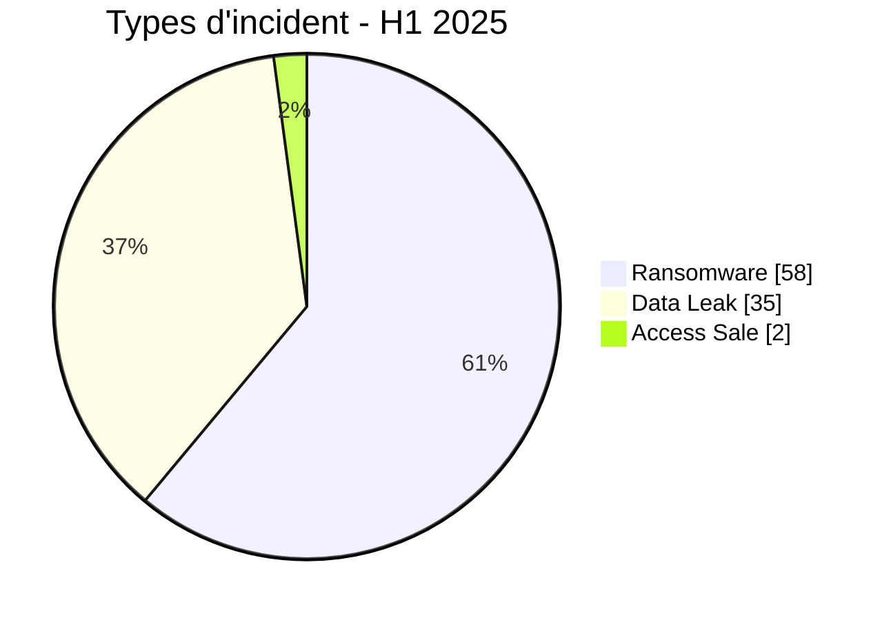
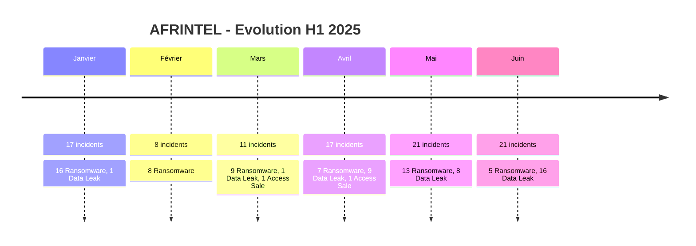

# Rapport CTI AFRINTEL - Premier semestre 2025

👉🏾 [**English version available here**](./README_H1.md)

## 1. Résumé exécutif

AFRINTEL a documenté **95 incidents uniques** entre janvier et juin 2025, répartis entre **58 Ransomware**, **35 Data Leak** et **2 Access Sale**.

- **Ransomware** : 58 incidents, soit **61,1 %** du corpus.
- **Data Leak** : 35 incidents, soit **36,8 %**.
- **Access Sale** : 2 incidents, soit **2,1 %**.
- **21 pays africains** apparaissent dans le corpus du semestre.
- **Afrique du Sud** arrive en tête avec **18 incidents**, devant l'Égypte avec 17, le Maroc avec 14 et l'Algérie avec 13.
- **Gouvernement / Administration** est le premier secteur harmonisé avec **26 incidents**.
- **devman** est le label le plus visible avec **8 fiches**, suivi de funksec avec 7.
- Le total H1 passe de 94 à **95** après intégration de la fiche **North-West University (NWU)** en Afrique du Sud dans janvier 2025.

Les chiffres décrivent les publications, revendications et incidents documentés dans AFRINTEL. Ils ne constituent pas une confirmation indépendante de chaque compromission ni une mesure exhaustive de l'activité cyber réelle en Afrique.

## 2. Corrections apportées à la consolidation H1

| Élément | Ancienne valeur | Valeur harmonisée |
|---|---:|---:|
| Total H1 | 94 | **95** |
| Janvier | 16 | **17** |
| Ransomware H1 | 58 | **58** |
| Data Leak + Access Sale | 36 | **37** |
| Data Leak | non séparé | **35** |
| Access Sale | non séparé | **2** |
| Afrique du Sud | 17 | **18** |

Le changement de total provient de l'ajout de **North-West University (NWU)** comme Data Leak en janvier. Les 58 incidents Ransomware restent inchangés.

## 3. Méthodologie

- **Périmètre** : 54 pays africains.
- **Période** : 1er janvier au 30 juin 2025.
- **Source de vérité** : couples mensuels harmonisés `victims_FR.md` / `victims.md`.
- **Workflow** : qualification et contrôle éditorial dans `victims_FR.md`, puis synchronisation anglaise et contrôle de parité.
- **Comptage** : une fiche incident unique = une occurrence mensuelle.
- **Taxonomie** : Ransomware, Data Leak, Access Sale, DDoS, Defacement, Operational Fraud.
- **Qualification** : une revendication d'acteur, un échantillon publié, une publication complète et une confirmation indépendante sont distingués.

## 4. Répartition par type d'incident

| Type d'incident | H1 2025 | Part |
|---|---:|---:|
| Ransomware | **58** | **61,1 %** |
| Data Leak | **35** | **36,8 %** |
| Access Sale | **2** | **2,1 %** |
| DDoS | 0 | 0,0 % |
| Defacement | 0 | 0,0 % |
| Operational Fraud | 0 | 0,0 % |
| **Total** | **95** | **100 %** |

**Convention couleur :** 🟧 Ransomware | 🟦 Data Leak | 🟪 Access Sale | 🟥 DDoS | 🟨 Defacement | 🟩 Operational Fraud.

## 5. Évolution mensuelle

| Mois | Incidents | Ransomware | Data Leak | Access Sale |
|---|---:|---:|---:|---:|
| Janvier | 17 | 16 | 1 | 0 |
| Février | 8 | 8 | 0 | 0 |
| Mars | 11 | 9 | 1 | 1 |
| Avril | 17 | 7 | 9 | 1 |
| Mai | 21 | 13 | 8 | 0 |
| Juin | 21 | 5 | 16 | 0 |
| **H1 2025** | **95** | **58** | **35** | **2** |

Février est le mois le moins chargé avec 8 incidents, tandis que mai et juin atteignent chacun 21. Le profil change fortement en juin : les Data Leak passent à 16 alors que le Ransomware recule à 5.

## 6. Répartition par pays

| Pays | Ransomware | Data Leak | Access Sale | Total | Distribution |
|---|---:|---:|---:|---:|---|
| 🇿🇦 Afrique du Sud | 17 | 1 | 0 | 18 | 🟧🟧🟧🟧🟧🟧🟧🟧🟧🟧🟧🟧🟧🟧🟧🟧🟧🟦 |
| 🇪🇬 Égypte | 15 | 2 | 0 | 17 | 🟧🟧🟧🟧🟧🟧🟧🟧🟧🟧🟧🟧🟧🟧🟧🟦🟦 |
| 🇲🇦 Maroc | 5 | 9 | 0 | 14 | 🟧🟧🟧🟧🟧🟦🟦🟦🟦🟦🟦🟦🟦🟦 |
| 🇩🇿 Algérie | 2 | 11 | 0 | 13 | 🟧🟧🟦🟦🟦🟦🟦🟦🟦🟦🟦🟦🟦 |
| 🇲🇷 Mauritanie | 0 | 7 | 0 | 7 | 🟦🟦🟦🟦🟦🟦🟦 |
| 🇳🇬 Nigeria | 4 | 1 | 0 | 5 | 🟧🟧🟧🟧🟦 |
| 🇰🇪 Kenya | 3 | 0 | 0 | 3 | 🟧🟧🟧 |
| 🇧🇼 Botswana | 2 | 0 | 0 | 2 | 🟧🟧 |
| 🇬🇭 Ghana | 1 | 1 | 0 | 2 | 🟧🟦 |
| 🇹🇳 Tunisie | 1 | 1 | 0 | 2 | 🟧🟦 |
| 🇿🇲 Zambie | 2 | 0 | 0 | 2 | 🟧🟧 |
| 🇧🇫 Burkina Faso | 0 | 0 | 1 | 1 | 🟪 |
| 🇨🇲 Cameroun | 1 | 0 | 0 | 1 | 🟧 |
| 🇩🇯 Djibouti | 0 | 1 | 0 | 1 | 🟦 |
| 🇲🇺 Maurice | 1 | 0 | 0 | 1 | 🟧 |
| 🇳🇦 Namibie | 1 | 0 | 0 | 1 | 🟧 |
| 🇷🇼 Rwanda | 1 | 0 | 0 | 1 | 🟧 |
| 🇸🇳 Sénégal | 0 | 0 | 1 | 1 | 🟪 |
| 🇹🇬 Togo | 0 | 1 | 0 | 1 | 🟦 |
| 🇹🇿 Tanzanie | 1 | 0 | 0 | 1 | 🟧 |
| 🇺🇬 Ouganda | 1 | 0 | 0 | 1 | 🟧 |
| **Total** | **58** | **35** | **2** | **95** | |

### Principaux constats géographiques

- **Afrique du Sud** : 18 incidents, dont 17 Ransomware et 1 Data Leak.
- **Égypte** : 17 incidents, dont 15 Ransomware et 2 Data Leak.
- **Maroc** : 14 incidents, dont 5 Ransomware et 9 Data Leak.
- **Algérie** : 13 incidents, avec 11 Data Leak contre 2 Ransomware.
- **Mauritanie** : 7 Data Leak, principalement liés à la campagne kill9 de mai.
- **Nigeria** : 5 incidents, dont 4 Ransomware et 1 Data Leak.

## 7. Répartition régionale

> Le regroupement régional reprend celui utilisé dans les rapports mensuels AFRINTEL harmonisés.

| Région | Incidents | Part | Activité |
|---|---:|---:|---|
| Afrique du Nord | 53 | 55,8 % | ██████████ |
| Afrique australe | 24 | 25,3 % | █████ |
| Afrique de l'Ouest | 10 | 10,5 % | ██ |
| Afrique de l'Est | 7 | 7,4 % | █ |
| Afrique centrale | 1 | 1,1 % | █ |
| **Total** | **95** | **100 %** | |

L'Afrique du Nord concentre **53 incidents sur 95 (55,8 %)**. L'Afrique australe suit avec 24 incidents.

## 8. Répartition sectorielle harmonisée

Pour la consolidation H1, les catégories mensuelles proches ont été regroupées dans une taxonomie commune. Par exemple, Assurance / Insurtech est consolidé dans Finance / Banque, et les catégories professionnelles, RH et juridiques sont regroupées dans Services professionnels / RH / Juridique.

| Secteur harmonisé | Incidents | Part | Activité |
|---|---:|---:|---|
| Gouvernement / Administration | 26 | 27,4 % | ██████████ |
| Finance / Banque | 18 | 18,9 % | ███████ |
| Technologie / IT | 12 | 12,6 % | █████ |
| Éducation / Université | 10 | 10,5 % | ████ |
| Services professionnels / RH / Juridique | 7 | 7,4 % | ███ |
| Santé / Médical | 6 | 6,3 % | ██ |
| Commerce / Distribution | 4 | 4,2 % | ██ |
| Télécommunications | 3 | 3,2 % | █ |
| Transport / Logistique / Aviation | 2 | 2,1 % | █ |
| Industrie / Fabrication | 2 | 2,1 % | █ |
| Énergie / Services publics | 1 | 1,1 % | █ |
| Hôtellerie / Tourisme | 1 | 1,1 % | █ |
| Agriculture / Agro-industrie | 1 | 1,1 % | █ |
| Mines / Extraction | 1 | 1,1 % | █ |
| Conglomérat / Multi-sectoriel | 1 | 1,1 % | █ |
| **Total** | **95** | **100 %** | |

Le secteur **Gouvernement / Administration** représente **26 incidents (27,4 %)**, devant **Finance / Banque** avec 18, **Technologie / IT** avec 12 et **Éducation / Université** avec 10.

## 9. Acteurs / groupes les plus visibles

Le semestre comprend **46 labels d'acteurs ou groupes distincts** dans les fiches harmonisées. Certains labels correspondent à des collaborations ou comptes de publication et ne doivent pas être interprétés automatiquement comme 46 groupes techniques indépendants.

| Acteur / Groupe | Incidents | Activité |
|---|---:|---|
| devman | 8 | ██████████ |
| funksec | 7 | █████████ |
| nightspire | 6 | ████████ |
| Phantom Atlas | 6 | ████████ |
| kill9 | 6 | ████████ |
| ransomhub | 4 | █████ |
| killsec | 4 | █████ |
| mrdump | 4 | █████ |
| GDLockerSec | 3 | ████ |
| babuk2 | 3 | ████ |
| spacebears | 2 | ██ |
| arcusmedia | 2 | ██ |
| lynx | 2 | ██ |
| Jabaroot DZ | 2 | ██ |
| B4baYega | 2 | ██ |
| incransom | 2 | ██ |
| warlock | 2 | ██ |
| Keymous | 2 | ██ |

Les labels apparaissant une seule fois représentent ensemble **28 incidents supplémentaires**.

Les cinq labels les plus présents sont **devman (8)**, **funksec (7)**, **nightspire (6)**, **Phantom Atlas (6)** et **kill9 (6)**.

## 10. Analyse CTI semestrielle

### 10.1 Ransomware

Avec **58 incidents**, le Ransomware reste le premier type du semestre. Il domine particulièrement janvier, février et mai. La fréquence des publications ne signifie pas que le chiffrement a été confirmé pour chaque cas : la classification décrit le contexte ransomware documenté dans les fiches.

### 10.2 Data Leak

Les **35 Data Leak** deviennent particulièrement visibles à partir d'avril et culminent en juin avec 16 cas. Plusieurs dossiers disposent d'échantillons structurés ou de publications complètes, mais les volumes annoncés par les acteurs restent séparés des volumes réellement observés.

### 10.3 Access Sale

Les **2 Access Sale** concernent le tableau de bord gouvernemental COVID-19/vaccination du Burkina Faso en mars et les Forces Armées Sénégalaises en avril. Dans les deux cas, la vente revendiquée d'un accès ne constitue pas à elle seule une preuve d'exfiltration de données.

## 11. Tendances majeures

1. **Hausse de l'exposition de données au deuxième trimestre** : avril et juin concentrent une part importante des Data Leak.
2. **Afrique du Sud, Égypte, Maroc et Algérie dominent le corpus** avec 62 incidents cumulés sur 95.
3. **Secteur public fortement représenté** : 26 incidents harmonisés Gouvernement / Administration.
4. **Concentration ponctuelle par acteur** : devman en mai, kill9 sur les banques mauritaniennes, mrdump en juin.
5. **Hétérogénéité du niveau de preuve** : certaines fiches reposent sur une revendication seule, d'autres sur des échantillons, exports structurés, accès observés ou publications complètes.
6. **Écart fréquent entre revendication et preuve** : plusieurs volumes massifs annoncés ne peuvent être validés intégralement à partir des éléments collectés.

## 12. Lacunes de renseignement

- Les vecteurs d'accès initiaux restent inconnus pour une grande partie du corpus.
- Les volumes revendiqués par les acteurs ne sont pas toujours vérifiables.
- Certaines publications disparaissent ou deviennent inaccessibles avant collecte complète.
- Des doublons temporels ou republications restent possibles lorsqu'un même jeu de données réapparaît sous un autre acteur ou à une date ultérieure.
- Les statistiques AFRINTEL décrivent un corpus observé et ne couvrent pas les incidents non publiés, non détectés ou traités confidentiellement.

## 13. Recommandations stratégiques

- **Secteur public** : renforcer PAM, MFA, supervision des exports et segmentation des systèmes administratifs.
- **Finance / Banque** : surveiller les bases clients, données d'identité, paiements, accès administrateurs et exports massifs.
- **Technologie / MSP** : isoler les environnements clients et renforcer les comptes de service.
- **Éducation** : sécuriser les systèmes étudiants, identités administratives et exports de bases.
- **Santé** : appliquer segmentation, chiffrement, EDR et contrôle strict des accès aux données cliniques.
- **SOC / CTI** : corréler les revendications avec EDR, IAM, VPN, proxy, messagerie, SIEM et journaux cloud avant d'élever le niveau de confiance.
- **Gouvernance CTI** : conserver séparément date de publication, date de détection, type d'incident, statut de preuve, volume revendiqué et volume réellement observé.

## 14. Conclusion

Le premier semestre 2025 se clôt sur **95 incidents AFRINTEL dans 21 pays africains** : **58 Ransomware, 35 Data Leak et 2 Access Sale**.

Le Ransomware reste majoritaire sur l'ensemble du semestre, mais la progression des Data Leak au deuxième trimestre modifie fortement le profil de menace. L'Afrique du Sud devient le pays le plus représenté avec 18 incidents après l'intégration de North-West University en janvier, devant l'Égypte avec 17.

**AFRINTEL** - TLP:CLEAR
