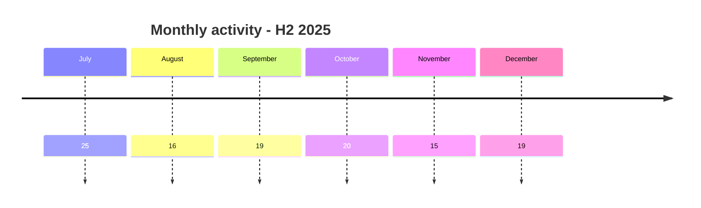
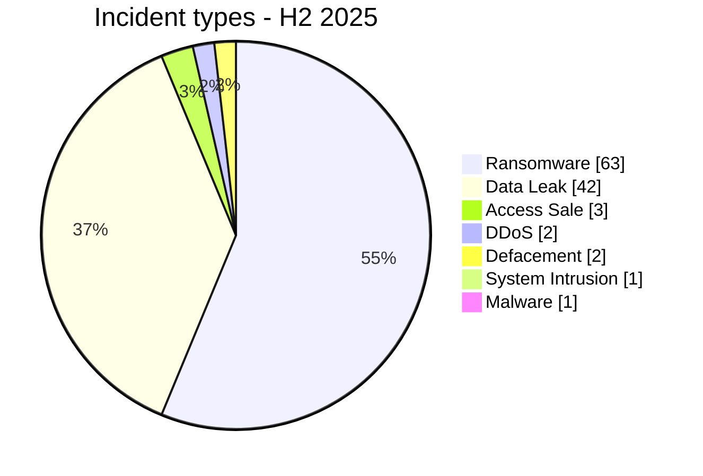

# AFRINTEL Semiannual CTI Report - Cyber Threats in Africa - H2 2025

👉🏾 [Version française](./README_H2_FR.md)

   

## 1. Executive summary

Between July-December 2025, AFRINTEL documented **114 cyber incidents** affecting organizations, institutions, and digital services across Africa.

The semester is dominated by **Ransomware with 63 records (55.3%)** and **Data Leak with 42 (36.8%)**. Together, they account for **105 incidents, or 92.1% of the semester corpus**. Other events include 3 Access Sale, 0 Account Takeover, 2 Defacement, 2 DDoS, 1 System Intrusion, and 1 Malware.

Geographic concentration is significant: **Morocco (19)**, **Egypt (18)**, and **South Africa (15)** lead the semester. Together, these countries represent **52 records, or 45.6%**.

At sector level, **Finance / Banking (24)**, **Government / Administration (24)**, and **Education / University (8)** are most represented. The top two sectors account for **48 records, or 42.1%**.

Activity varies across the semester: **July is the highest-volume month with 25 incidents**, while **November records 15**.

Evidence maturity remains heterogeneous. AFRINTEL distinguishes unverified claims, sample-backed publications, claimed full publications, independent corroboration, and victim or authority confirmation. **A criminal claim, attribution, or advertised volume is not treated as confirmed without sufficient supporting evidence.**

> **Reading note:** AFRINTEL figures measure documented incidents and the visibility of observed threats. They are not an exhaustive measurement of every compromise that actually occurred across Africa.

👉🏾 [See semester victims](./victims_H2.md)

## 2. Methodology

- **Period:** July-December 2025.
- **Source of truth:** the six validated monthly `victims_FR.md` / `victims.md` pairs.
- **Counting:** one canonical record equals one documented cyber incident; cases under investigation remain outside statistics.
- **Classification:** Ransomware, Data Leak, Access Sale, DDoS, Defacement, Account Takeover, System Intrusion, Malware, and Operational Fraud.
- **Timeline:** `Incident date` and `Initial publication date` remain separate.
- **Uncertain dates:** when no exact day is established, the evidence-supported month or time window is retained; no exact day is invented.
- **Sources:** public links are retained for supplementary cases found online; they are not retroactively imposed on historical or direct Dark Web observations.
- **Sectors:** normalization is calculated once and the same values are used in FR and EN.
- **Limitation:** the corpus represents AFRINTEL visibility rather than every cyberattack that actually occurred across the continent.

## 3. Corrected H2 2024 vs H2 2025 comparison

The final corrected H2 2024 corpus contains **74 canonical incidents**, compared with **114** in H2 2025. The 2024 baseline has undergone chronology review and reclassification under the **same nine incident types** used for 2025, so the categories below are directly comparable and valid zero values are no longer shown as `N/A`.

| Indicator | Final corrected 2024 | 2025 | Change |
|---|---:|---:|---:|
| Total incidents | 74 | 114 | **+40 (+54.1%)** |
| Ransomware | 57 | 63 | **+6 (+10.5%)** |
| Data Leak | 9 | 42 | **+33 (+366.7%)** |
| Access Sale | 3 | 3 | **0 (0.0%)** |
| DDoS | 0 | 2 | **+2 (newly observed)** |
| Defacement | 1 | 2 | **+1 (+100.0%)** |
| Account Takeover | 0 | 0 | **Stable** |
| System Intrusion | 4 | 1 | **-3 (-75.0%)** |
| Malware | 0 | 1 | **+1 (newly observed)** |
| Operational Fraud | 0 | 0 | **Stable** |

The documented H2 corpus increases from **74 to 114 incidents**, an increase of **40 (+54.1%)**. Data Leak shows the largest absolute difference (**+33**), while Ransomware rises by six records. These figures describe AFRINTEL corpus visibility and do not by themselves demonstrate an equivalent increase in successful real-world compromises.
### 3.1 H1 vs H2 2025

| Indicator | H1 2025 | H2 2025 | Change |
|---|---:|---:|---:|
| Total incidents | 111 | 114 | **+3 (+2.7%)** |
| Ransomware | 58 | 63 | **+5 (+8.6%)** |
| Data Leak | 39 | 42 | **+3 (+7.7%)** |
| Access Sale | 3 | 3 | **0 (0.0%)** |
| DDoS | 1 | 2 | **+1 (+100.0%)** |
| Defacement | 2 | 2 | **0 (0.0%)** |
| Account Takeover | 6 | 0 | **-6 (-100.0%)** |
| System Intrusion | 2 | 1 | **-1 (-50.0%)** |
| Malware | 0 | 1 | **+1 (new)** |
| Operational Fraud | 0 | 0 | **Stable** |

Overall volume is almost stable: **111 incidents in H1 versus 114 in H2**. The structure still changes: all six Account Takeover records of the year are concentrated in H1, while H2 contains more Ransomware and the year's only Malware incident.

## 4. Monthly evolution

| Month | Total | Ransomware | Data Leak | Access Sale | DDoS | Defacement | Account Takeover | System Intrusion | Malware | Operational Fraud |
|---|---:|---:|---:|---:|---:|---:|---:|---:|---:|---:|
| July | 25 | 5 | 18 | 0 | 0 | 0 | 0 | 1 | 1 | 0 |
| August | 16 | 7 | 5 | 2 | 1 | 1 | 0 | 0 | 0 | 0 |
| September | 19 | 11 | 7 | 0 | 1 | 0 | 0 | 0 | 0 | 0 |
| October | 20 | 16 | 3 | 1 | 0 | 0 | 0 | 0 | 0 | 0 |
| November | 15 | 10 | 4 | 0 | 0 | 1 | 0 | 0 | 0 | 0 |
| December | 19 | 14 | 5 | 0 | 0 | 0 | 0 | 0 | 0 | 0 |
| **Total** | **114** | **63** | **42** | **3** | **2** | **2** | **0** | **1** | **1** | **0** |

### 4.1 Monthly volume

| Month | Records | Volume |
|---|---:|---|
| July | 25 | █████████████████████████ |
| August | 16 | ████████████████ |
| September | 19 | ███████████████████ |
| October | 20 | ████████████████████ |
| November | 15 | ███████████████ |
| December | 19 | ███████████████████ |

## 5. Incident-type distribution

| Incident type | Records | Share |
|---|---:|---:|
| Ransomware | **63** | 55.3% |
| Data Leak | **42** | 36.8% |
| Access Sale | **3** | 2.6% |
| DDoS | **2** | 1.8% |
| Defacement | **2** | 1.8% |
| Account Takeover | **0** | 0.0% |
| System Intrusion | **1** | 0.9% |
| Malware | **1** | 0.9% |
| Operational Fraud | **0** | 0.0% |
| **Total** | **114** | **100%** |

Ransomware and Data Leak together account for **105 records (92.1%)**.

## 6. Geographic distribution

### 6.1 Countries by incident type

| Country | Total | Ransomware | Data Leak | Access Sale | DDoS | Defacement | Account Takeover | System Intrusion | Malware |
|---|---:|---:|---:|---:|---:|---:|---:|---:|---:|
| Morocco | **19** | 7 | 10 | 0 | 1 | 1 | 0 | 0 | 0 |
| Egypt | **18** | 12 | 4 | 1 | 1 | 0 | 0 | 0 | 0 |
| South Africa | **15** | 11 | 2 | 1 | 0 | 0 | 0 | 0 | 1 |
| Tunisia | **13** | 5 | 7 | 0 | 0 | 0 | 0 | 1 | 0 |
| Nigeria | **9** | 5 | 4 | 0 | 0 | 0 | 0 | 0 | 0 |
| Kenya | **9** | 5 | 3 | 0 | 0 | 1 | 0 | 0 | 0 |
| Algeria | **6** | 2 | 4 | 0 | 0 | 0 | 0 | 0 | 0 |
| Ivory Coast | **3** | 1 | 2 | 0 | 0 | 0 | 0 | 0 | 0 |
| Tanzania | **2** | 2 | 0 | 0 | 0 | 0 | 0 | 0 | 0 |
| Namibia | **2** | 2 | 0 | 0 | 0 | 0 | 0 | 0 | 0 |
| Zimbabwe | **2** | 2 | 0 | 0 | 0 | 0 | 0 | 0 | 0 |
| Congo (DRC) | **2** | 1 | 1 | 0 | 0 | 0 | 0 | 0 | 0 |
| Zambia | **2** | 2 | 0 | 0 | 0 | 0 | 0 | 0 | 0 |
| Mauritania | **1** | 0 | 1 | 0 | 0 | 0 | 0 | 0 | 0 |
| Eritrea | **1** | 0 | 1 | 0 | 0 | 0 | 0 | 0 | 0 |
| Burundi | **1** | 0 | 1 | 0 | 0 | 0 | 0 | 0 | 0 |
| Seychelles | **1** | 0 | 1 | 0 | 0 | 0 | 0 | 0 | 0 |
| Uganda | **1** | 1 | 0 | 0 | 0 | 0 | 0 | 0 | 0 |
| Mauritius | **1** | 1 | 0 | 0 | 0 | 0 | 0 | 0 | 0 |
| Togo | **1** | 0 | 0 | 1 | 0 | 0 | 0 | 0 | 0 |
| Angola | **1** | 0 | 1 | 0 | 0 | 0 | 0 | 0 | 0 |
| Senegal | **1** | 1 | 0 | 0 | 0 | 0 | 0 | 0 | 0 |
| Madagascar | **1** | 1 | 0 | 0 | 0 | 0 | 0 | 0 | 0 |
| Gabon | **1** | 1 | 0 | 0 | 0 | 0 | 0 | 0 | 0 |
| Ghana | **1** | 1 | 0 | 0 | 0 | 0 | 0 | 0 | 0 |
| **Total** | **114** | **63** | **42** | **3** | **2** | **2** | **0** | **1** | **1** |

> `Operational Fraud = 0` in this semester; the column is omitted for readability.

### 6.2 Regional distribution

| Region | Total | Share | Ransomware | Data Leak | Access Sale | DDoS | Defacement | Account Takeover | System Intrusion | Malware |
|---|---:|---:|---:|---:|---:|---:|---:|---:|---:|---:|
| North Africa | **56** | 49.1% | 26 | 25 | 1 | 2 | 1 | 0 | 1 | 0 |
| Southern Africa | **22** | 19.3% | 17 | 3 | 1 | 0 | 0 | 0 | 0 | 1 |
| West Africa | **16** | 14.0% | 8 | 7 | 1 | 0 | 0 | 0 | 0 | 0 |
| East Africa | **14** | 12.3% | 8 | 5 | 0 | 0 | 1 | 0 | 0 | 0 |
| Indian Ocean | **3** | 2.6% | 2 | 1 | 0 | 0 | 0 | 0 | 0 | 0 |
| Central Africa | **3** | 2.6% | 2 | 1 | 0 | 0 | 0 | 0 | 0 | 0 |
| **Total** | **114** | **100%** | **63** | **42** | **3** | **2** | **2** | **0** | **1** | **1** |

The leading region is **North Africa with 56 incidents (49.1%)**.

## 7. Sector distribution

| Sector | Records | Share | Activity |
|---|---:|---:|---|
| Finance / Banking | 24 | 21.1% | ████████████ |
| Government / Administration | 24 | 21.1% | ████████████ |
| Education / University | 8 | 7.0% | ████ |
| Technology / IT | 8 | 7.0% | ████ |
| Healthcare / Medical | 7 | 6.1% | ████ |
| Transport / Logistics | 7 | 6.1% | ████ |
| Construction / Real Estate | 6 | 5.3% | ███ |
| Manufacturing / Industry | 6 | 5.3% | ███ |
| Not specified | 6 | 5.3% | ███ |
| Telecommunications | 4 | 3.5% | ██ |
| Retail / E-commerce | 4 | 3.5% | ██ |
| Energy / Utilities | 3 | 2.6% | ██ |
| Mining | 2 | 1.8% | █ |
| Professional / Business Services | 2 | 1.8% | █ |
| Agriculture / Agribusiness | 2 | 1.8% | █ |
| Legal | 1 | 0.9% | █ |
| **Total** | **114** | **100%** | |

## 8. Actor / group profile

`Unknown` represents missing attribution and is not a threat actor.

| Actor / Group | Records | Activity |
|---|---:|---|
| qilin | 11 | ███████████ |
| Unknown | 6 | ██████ |
| incransom | 6 | ██████ |
| Dark 07x Team | 5 | █████ |
| nightspire | 4 | ████ |
| clop | 4 | ████ |
| TheGentlemen | 3 | ███ |
| lockbit5 | 3 | ███ |
| devman | 2 | ██ |
| KaruHunters | 2 | ██ |
| warlock | 2 | ██ |
| direwolf | 2 | ██ |
| Not specified | 2 | ██ |
| killsec | 2 | ██ |
| radar | 2 | ██ |
| privilege | 2 | ██ |
| BlackShrantac | 2 | ██ |
| tengu | 2 | ██ |
| dragonforce | 2 | ██ |
| nova | 2 | ██ |

## 9. Evidence maturity

| Analytical grouping | Records | Share |
|---|---:|---:|
| Claim - Unverified | 54 | 47.4% |
| Claim - Data Sample Published | 42 | 36.8% |
| Data Fully Published | 7 | 6.1% |
| Victim/Government/Authority Confirmed | 3 | 2.6% |
| Corroborated / Secondary evidence | 7 | 6.1% |
| Attempted | 1 | 0.9% |
| **Total** | **114** | **100%** |

This grouping improves semester-level readability without replacing the detailed statuses in victim records.

## 10. CTI analysis by incident type

### Ransomware - 63

Ransomware represents **63 records (55.3%)**. Leading countries are Egypt (12), South Africa (11), Morocco (7). A leak-site listing does not itself prove encryption.

### Data Leak - 42

Data Leak represents **42 records (36.8%)**. Leading countries are Morocco (10), Tunisia (7), while Nigeria, Algeria, and Egypt have 4 each. Publication, observed sample, and claimed aggregate volume remain separate evidence levels.

### Access Sale - 3

The semester contains **3 Access Sale records**. Main distribution: Togo (1), Egypt (1), South Africa (1). An access offer proves neither data leakage nor access to the victim's entire internal infrastructure.

### DDoS - 2

The semester documents **2 DDoS campaigns**. Distribution: Egypt (1), Morocco (1). Counts refer to documented campaigns, not necessarily every individual targeted domain.

### Defacement - 2

The semester contains **2 Defacement records**. Distribution: Morocco (1), Kenya (1). Visible modification is not reclassified as Data Leak without separate evidence.

### Account Takeover - 0

No incident is classified as `Account Takeover` during this semester. This zero value reflects the canonical AFRINTEL corpus for H2 2025 and does not imply an absence of account compromise activity across Africa.

### System Intrusion - 1

The semester contains **1 System Intrusion record**. Distribution: Tunisia (1). It is used when system access or attempted access is established without enough evidence for a more specific category.

### Malware - 1

The semester documents **1 Malware incident**. Distribution: South Africa (1). The type is used when malicious software is explicitly established.

### Operational Fraud - 0

No incident is classified as `Operational Fraud` during this semester. Absence from the corpus does not imply absence of cyber-enabled fraud on the continent.

## 11. Leading countries by incident type

### 11.1 Top 10 Ransomware

| Rank | Country | Records |
|---:|---|---:|
| 1 | Egypt | **12** |
| 2 | South Africa | **11** |
| 3 | Morocco | **7** |
| 4 | Kenya | **5** |
| 5 | Tunisia | **5** |
| 6 | Nigeria | **5** |
| 7 | Tanzania | **2** |
| 8 | Namibia | **2** |
| 9 | Algeria | **2** |
| 10 | Zimbabwe | **2** |

### 11.2 Top 10 Data Leak

| Rank | Country | Records |
|---:|---|---:|
| 1 | Morocco | **10** |
| 2 | Tunisia | **7** |
| 3 | Nigeria | **4** |
| 4 | Algeria | **4** |
| 5 | Egypt | **4** |
| 6 | Kenya | **3** |
| 7 | South Africa | **2** |
| 8 | Ivory Coast | **2** |
| 9 | Mauritania | **1** |
| 10 | Eritrea | **1** |

### 11.3 Other incident types

| Type | Country distribution | Total |
|---|---|---:|
| Access Sale | Togo (1), Egypt (1), South Africa (1) | **3** |
| DDoS | Egypt (1), Morocco (1) | **2** |
| Defacement | Morocco (1), Kenya (1) | **2** |
| Account Takeover | - | **0** |
| System Intrusion | Tunisia (1) | **1** |
| Malware | South Africa (1) | **1** |

## 12. Key CTI findings

- Ransomware remains the leading semester category, while Data Leak accounts for a major share of the corpus.
- Country-level ranking should be paired with incident-type analysis.
- Government and financial organizations remain among the most represented sectors.
- Access sales remain separate from data leaks until exfiltration is supported.
- Institutional account takeover is tracked as a distinct threat when observed.
- Availability of technical evidence, official confirmations, and DFIR conclusions remains uneven.

## 13. Intelligence gaps

- initial-access vectors are frequently unknown;
- exact technical compromise dates are sometimes unavailable;
- claimed volumes are rarely fully verifiable;
- technical attribution is often limited to a publication handle or label;
- public information on remediation, root cause, and post-incident investigations remains limited;
- cases under investigation remain excluded from canonical statistics.

## 14. Recommendations

### 14.1 Organizations

- enforce phishing-resistant MFA for privileged accounts, VPN, email, social media, and administration consoles;
- apply PAM, least privilege, segmentation, and regular secret rotation;
- maintain immutable backups and test restoration;
- strengthen public applications, APIs, and administration interfaces;
- formalize incident-response and data-breach notification procedures.

### 14.2 SOC and detection

- monitor abnormal authentication, MFA changes, privileged-account creation, and role elevation;
- detect mass database reads, unusual exports, archive creation, and large outbound transfers;
- correlate EDR, IAM, VPN, WAF, proxy, DNS, cloud, and application logs;
- monitor exposed institutional social-media accounts;
- distinguish DDoS, internal intrusion, and data exposure.

### 14.3 CTI

- separate first observation, incident date, initial publication, sample, disclosure, and confirmation;
- track republication and resale without automatically counting them as new compromise;
- preserve the evidence hierarchy between claim, corroboration, and confirmation;
- maintain FR/EN parity before generating statistics.

## 15. Conclusion

H2 2025 contains **114 documented cyber incidents**. Ransomware and Data Leak remain dominant, but the other types confirm a more diverse threat landscape than a view limited to extortion and leaks.

The CTI value of the report comes from separating **incident type, timeline, evidence level, geography, sector, and actor**, providing a structured picture of the observable African threat environment without turning uncertainty into certainty.

**AFRINTEL** - TLP:CLEAR
