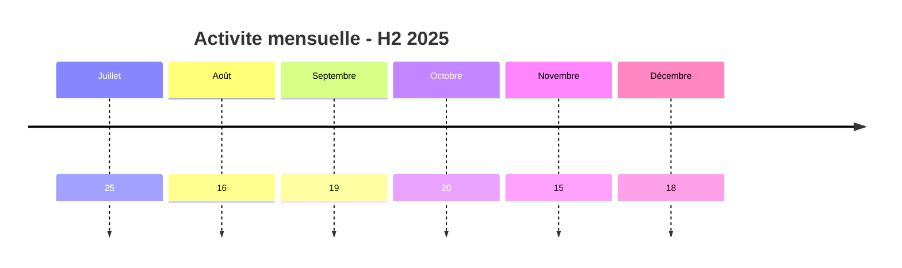
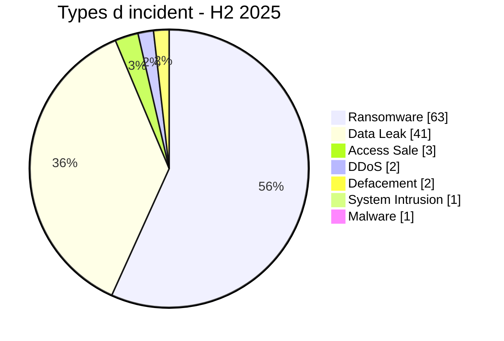

# Rapport CTI semestriel AFRINTEL - Cybermenaces en Afrique - S2 2025

👉🏾 [English version](./README_H2.md)

   

## 1. Synthèse exécutive

Entre juillet-décembre 2025, AFRINTEL a documenté **113 cyberincidents** affectant des organisations, institutions et services numériques en Afrique.

Le semestre est dominé par le **Ransomware avec 63 fiches (55,8 %)** et les **Data Leak avec 41 (36,3 %)**. Ensemble, ces deux catégories représentent **104 incidents, soit 92,0 % du corpus semestriel**. Les autres événements comprennent 3 Access Sale, 0 Account Takeover, 2 Defacement, 2 DDoS, 1 System Intrusion et 1 Malware.

La concentration géographique est marquée : **Maroc (19)**, **Égypte (17)** et **Afrique du Sud (15)** arrivent en tête. Ensemble, ces trois pays représentent **51 fiches, soit 45,1 %** du semestre.

Sur le plan sectoriel, **Finance / Banque (24)**, **Gouvernement / Administration (24)** et **Éducation / Université (8)** sont les secteurs les plus représentés. Les deux premiers concentrent **48 fiches, soit 42,5 %**.

L'activité varie au fil du semestre : **Juillet est le mois le plus volumineux avec 25 incidents**, tandis que **Novembre en compte 15**.

La maturité des preuves demeure hétérogène. AFRINTEL distingue les revendications non vérifiées, les publications accompagnées d'échantillons, les publications complètes revendiquées, les corroborations indépendantes et les confirmations par victimes ou autorités. **Une revendication criminelle, une attribution ou un volume annoncé ne sont pas considérés comme confirmés sans éléments suffisants.**

> **Note de lecture :** les chiffres AFRINTEL mesurent les incidents documentés et la visibilité des menaces observées. Ils ne constituent pas une mesure exhaustive de toutes les compromissions réellement survenues en Afrique.

👉🏾 [Voir les victimes du semestre](./victims_H2_FR.md)

## 2. Méthodologie

- **Période :** juillet-décembre 2025.
- **Source de vérité :** les six couples mensuels validés `victims_FR.md` / `victims.md`.
- **Comptage :** une fiche canonique correspond à un cyberincident documenté ; les dossiers en investigation restent hors statistiques.
- **Classification :** Ransomware, Data Leak, Access Sale, DDoS, Defacement, Account Takeover, System Intrusion, Malware et Operational Fraud.
- **Chronologie :** `Date de l'incident` et `Date de publication initiale` restent séparées.
- **Dates incertaines :** lorsqu'un jour exact n'est pas établi, le mois ou la fenêtre soutenue par les preuves est conservé ; aucun jour n'est inventé.
- **Sources :** les liens publics sont conservés pour les ajouts retrouvés en ligne ; ils ne sont pas imposés rétroactivement aux observations historiques ou Dark Web directes.
- **Secteurs :** normalisation calculée une seule fois puis appliquée avec les mêmes valeurs en FR et EN.
- **Limite :** le corpus représente la visibilité AFRINTEL et non l'ensemble des cyberattaques réellement survenues sur le continent.

## 3. Comparaison S2 2024 corrigé vs S2 2025

Le corpus corrigé de S2 2024 contient **74 fiches**, contre **113** sur S2 2025.

| Indicateur | 2024 corrigé | 2025 | Évolution |
|---|---:|---:|---:|
| Total incidents | 74 | 113 | **+39 (+52,7 %)** |
| Ransomware | 56 | 63 | **+7 (+12,5 %)** |
| Data Leak | 14 | 41 | **+27 (+192,9 %)** |
| Access Sale | 2 | 3 | **+1 (+50,0 %)** |
| DDoS | 0 | 2 | **+2 (nouveau)** |
| Defacement | 1 | 2 | **+1 (+100,0 %)** |
| Operational Fraud | 0 | 0 | **Stable** |
| Account Takeover | N/A | 0 | **N/A** |
| System Intrusion | N/A | 1 | **N/A** |
| Malware | N/A | 1 | **N/A** |

`Account Takeover`, `System Intrusion` et `Malware` restent `N/A` côté 2024 tant que le corpus 2024 n'a pas été rétro-classifié intégralement selon la taxonomie actuelle.

### 3.1 S1 vs S2 2025

| Indicateur | S1 2025 | S2 2025 | Évolution |
|---|---:|---:|---:|
| Total incidents | 111 | 113 | **+2 (+1,8 %)** |
| Ransomware | 58 | 63 | **+5 (+8,6 %)** |
| Data Leak | 39 | 41 | **+2 (+5,1 %)** |
| Access Sale | 3 | 3 | **0 (0,0 %)** |
| DDoS | 1 | 2 | **+1 (+100,0 %)** |
| Defacement | 2 | 2 | **0 (0,0 %)** |
| Account Takeover | 6 | 0 | **-6 (-100,0 %)** |
| System Intrusion | 2 | 1 | **-1 (-50,0 %)** |
| Malware | 0 | 1 | **+1 (nouveau)** |
| Operational Fraud | 0 | 0 | **Stable** |

Le volume global est presque stable : **111 incidents au S1 contre 113 au S2**. La structure évolue néanmoins : les six Account Takeover de l'année sont concentrés au S1, alors que le S2 compte davantage de Ransomware et contient l'unique incident Malware de 2025.

## 4. Évolution mensuelle

| Mois | Total | Ransomware | Data Leak | Access Sale | DDoS | Defacement | Account Takeover | System Intrusion | Malware | Operational Fraud |
|---|---:|---:|---:|---:|---:|---:|---:|---:|---:|---:|
| Juillet | 25 | 5 | 18 | 0 | 0 | 0 | 0 | 1 | 1 | 0 |
| Août | 16 | 7 | 5 | 2 | 1 | 1 | 0 | 0 | 0 | 0 |
| Septembre | 19 | 11 | 7 | 0 | 1 | 0 | 0 | 0 | 0 | 0 |
| Octobre | 20 | 16 | 3 | 1 | 0 | 0 | 0 | 0 | 0 | 0 |
| Novembre | 15 | 10 | 4 | 0 | 0 | 1 | 0 | 0 | 0 | 0 |
| Décembre | 18 | 14 | 4 | 0 | 0 | 0 | 0 | 0 | 0 | 0 |
| **Total** | **113** | **63** | **41** | **3** | **2** | **2** | **0** | **1** | **1** | **0** |

### 4.1 Volume mensuel

| Mois | Fiches | Volume |
|---|---:|---|
| Juillet | 25 | █████████████████████████ |
| Août | 16 | ████████████████ |
| Septembre | 19 | ███████████████████ |
| Octobre | 20 | ████████████████████ |
| Novembre | 15 | ███████████████ |
| Décembre | 18 | ██████████████████ |

## 5. Répartition par type d'incident

| Type d'incident | Fiches | Part |
|---|---:|---:|
| Ransomware | **63** | 55,8 % |
| Data Leak | **41** | 36,3 % |
| Access Sale | **3** | 2,7 % |
| DDoS | **2** | 1,8 % |
| Defacement | **2** | 1,8 % |
| Account Takeover | **0** | 0,0 % |
| System Intrusion | **1** | 0,9 % |
| Malware | **1** | 0,9 % |
| Operational Fraud | **0** | 0,0 % |
| **Total** | **113** | **100 %** |

Le Ransomware et les Data Leak représentent ensemble **104 fiches (92,0 %)**.

## 6. Répartition géographique

### 6.1 Pays par type d'incident

| Pays | Total | Ransomware | Data Leak | Access Sale | DDoS | Defacement | Account Takeover | System Intrusion | Malware |
|---|---:|---:|---:|---:|---:|---:|---:|---:|---:|
| Maroc | **19** | 7 | 10 | 0 | 1 | 1 | 0 | 0 | 0 |
| Égypte | **17** | 12 | 3 | 1 | 1 | 0 | 0 | 0 | 0 |
| Afrique du Sud | **15** | 11 | 2 | 1 | 0 | 0 | 0 | 0 | 1 |
| Tunisie | **13** | 5 | 7 | 0 | 0 | 0 | 0 | 1 | 0 |
| Nigeria | **9** | 5 | 4 | 0 | 0 | 0 | 0 | 0 | 0 |
| Kenya | **9** | 5 | 3 | 0 | 0 | 1 | 0 | 0 | 0 |
| Algérie | **6** | 2 | 4 | 0 | 0 | 0 | 0 | 0 | 0 |
| Côte d'Ivoire | **3** | 1 | 2 | 0 | 0 | 0 | 0 | 0 | 0 |
| Tanzanie | **2** | 2 | 0 | 0 | 0 | 0 | 0 | 0 | 0 |
| Namibie | **2** | 2 | 0 | 0 | 0 | 0 | 0 | 0 | 0 |
| Zimbabwe | **2** | 2 | 0 | 0 | 0 | 0 | 0 | 0 | 0 |
| Congo (RDC) | **2** | 1 | 1 | 0 | 0 | 0 | 0 | 0 | 0 |
| Zambie | **2** | 2 | 0 | 0 | 0 | 0 | 0 | 0 | 0 |
| Mauritanie | **1** | 0 | 1 | 0 | 0 | 0 | 0 | 0 | 0 |
| Érythrée | **1** | 0 | 1 | 0 | 0 | 0 | 0 | 0 | 0 |
| Burundi | **1** | 0 | 1 | 0 | 0 | 0 | 0 | 0 | 0 |
| Seychelles | **1** | 0 | 1 | 0 | 0 | 0 | 0 | 0 | 0 |
| Ouganda | **1** | 1 | 0 | 0 | 0 | 0 | 0 | 0 | 0 |
| Maurice | **1** | 1 | 0 | 0 | 0 | 0 | 0 | 0 | 0 |
| Togo | **1** | 0 | 0 | 1 | 0 | 0 | 0 | 0 | 0 |
| Angola | **1** | 0 | 1 | 0 | 0 | 0 | 0 | 0 | 0 |
| Sénégal | **1** | 1 | 0 | 0 | 0 | 0 | 0 | 0 | 0 |
| Madagascar | **1** | 1 | 0 | 0 | 0 | 0 | 0 | 0 | 0 |
| Gabon | **1** | 1 | 0 | 0 | 0 | 0 | 0 | 0 | 0 |
| Ghana | **1** | 1 | 0 | 0 | 0 | 0 | 0 | 0 | 0 |
| **Total** | **113** | **63** | **41** | **3** | **2** | **2** | **0** | **1** | **1** |

> `Operational Fraud = 0` sur ce semestre ; la colonne est omise pour préserver la lisibilité.

### 6.2 Répartition régionale

| Région | Total | Part | Ransomware | Data Leak | Access Sale | DDoS | Defacement | Account Takeover | System Intrusion | Malware |
|---|---:|---:|---:|---:|---:|---:|---:|---:|---:|---:|
| Afrique du Nord | **55** | 48,7 % | 26 | 24 | 1 | 2 | 1 | 0 | 1 | 0 |
| Afrique australe | **22** | 19,5 % | 17 | 3 | 1 | 0 | 0 | 0 | 0 | 1 |
| Afrique de l'Ouest | **16** | 14,2 % | 8 | 7 | 1 | 0 | 0 | 0 | 0 | 0 |
| Afrique de l'Est | **14** | 12,4 % | 8 | 5 | 0 | 0 | 1 | 0 | 0 | 0 |
| Océan Indien | **3** | 2,7 % | 2 | 1 | 0 | 0 | 0 | 0 | 0 | 0 |
| Afrique centrale | **3** | 2,7 % | 2 | 1 | 0 | 0 | 0 | 0 | 0 | 0 |
| **Total** | **113** | **100 %** | **63** | **41** | **3** | **2** | **2** | **0** | **1** | **1** |

La région la plus représentée est **Afrique du Nord avec 55 incidents (48,7 %)**.

## 7. Répartition sectorielle

| Secteur | Fiches | Part | Activité |
|---|---:|---:|---|
| Finance / Banque | 24 | 21,2 % | ████████████ |
| Gouvernement / Administration | 24 | 21,2 % | ████████████ |
| Éducation / Université | 8 | 7,1 % | ████ |
| Technologie / IT | 8 | 7,1 % | ████ |
| Santé / Médical | 7 | 6,2 % | ████ |
| Transport / Logistique | 7 | 6,2 % | ████ |
| Construction / Immobilier | 6 | 5,3 % | ███ |
| Industrie / Fabrication | 6 | 5,3 % | ███ |
| Non précisé | 6 | 5,3 % | ███ |
| Télécommunications | 4 | 3,5 % | ██ |
| Commerce / E-commerce | 3 | 2,7 % | ██ |
| Énergie / Services publics | 3 | 2,7 % | ██ |
| Mines | 2 | 1,8 % | █ |
| Services professionnels / Business | 2 | 1,8 % | █ |
| Agriculture / Agro-industrie | 2 | 1,8 % | █ |
| Juridique | 1 | 0,9 % | █ |
| **Total** | **113** | **100 %** | |

## 8. Profil des acteurs / groupes

`Unknown` représente une absence d'attribution et non un acteur cybercriminel.

| Acteur / Groupe | Fiches | Activité |
|---|---:|---|
| qilin | 11 | ███████████ |
| Unknown | 6 | ██████ |
| incransom | 6 | ██████ |
| Dark 07x Team | 5 | █████ |
| nightspire | 4 | ████ |
| clop | 4 | ████ |
| TheGentlemen | 3 | ███ |
| lockbit5 | 3 | ███ |
| devman | 2 | ██ |
| KaruHunters | 2 | ██ |
| warlock | 2 | ██ |
| direwolf | 2 | ██ |
| Not specified | 2 | ██ |
| killsec | 2 | ██ |
| radar | 2 | ██ |
| privilege | 2 | ██ |
| BlackShrantac | 2 | ██ |
| tengu | 2 | ██ |
| dragonforce | 2 | ██ |
| nova | 2 | ██ |

## 9. Maturité des preuves

| Regroupement analytique | Fiches | Part |
|---|---:|---:|
| Claim - Unverified | 54 | 47,8 % |
| Claim - Data Sample Published | 41 | 36,3 % |
| Data Fully Published | 7 | 6,2 % |
| Confirmation victime / gouvernement / autorité | 3 | 2,7 % |
| Corroboré / preuve secondaire | 7 | 6,2 % |
| Tentative | 1 | 0,9 % |
| **Total** | **113** | **100 %** |

Ce regroupement facilite la lecture semestrielle sans remplacer les statuts détaillés des fiches victimes.

## 10. Analyse CTI par type d'incident

### Ransomware - 63

Le Ransomware représente **63 fiches (55,8 %)**. Les pays les plus représentés sont Égypte (12), Afrique du Sud (11), Maroc (7). Une présence sur un leak site ne prouve pas à elle seule un chiffrement.

### Data Leak - 41

Les Data Leak représentent **41 fiches (36,3 %)**. Les principaux pays sont Maroc (10), Tunisie (7), Nigeria (4). Publication, échantillon observé et volume global revendiqué restent des niveaux de preuve distincts.

### Access Sale - 3

Le semestre compte **3 Access Sale**. Répartition principale : Togo (1), Égypte (1), Afrique du Sud (1). Une offre d'accès ne prouve ni une fuite de données ni un accès à l'ensemble de l'infrastructure interne.

### DDoS - 2

Le semestre documente **2 campagne(s) DDoS**. Répartition : Égypte (1), Maroc (1). Le comptage porte sur les campagnes documentées, pas nécessairement sur chaque domaine individuel ciblé.

### Defacement - 2

Le semestre compte **2 Defacement**. Répartition : Maroc (1), Kenya (1). Un contenu visible modifié n'est pas reclassé en Data Leak sans preuve distincte.

### System Intrusion - 1

Le semestre compte **1 System Intrusion**. Répartition : Tunisie (1). Ce type est retenu lorsque l'accès ou la tentative d'accès système est établi sans preuve suffisante pour une catégorie plus spécifique.

### Malware - 1

Le semestre documente **1 incident Malware**. Répartition : Afrique du Sud (1). Le type est utilisé lorsque la présence d'un logiciel malveillant est explicitement établie.

### Operational Fraud - 0

Aucun incident n'est classé `Operational Fraud` sur ce semestre. Cette absence dans le corpus ne signifie pas absence de fraude cyber sur le continent.

## 11. Pays les plus exposés par type

### 11.1 Top 10 Ransomware

| Rang | Pays | Fiches |
|---:|---|---:|
| 1 | Égypte | **12** |
| 2 | Afrique du Sud | **11** |
| 3 | Maroc | **7** |
| 4 | Kenya | **5** |
| 5 | Tunisie | **5** |
| 6 | Nigeria | **5** |
| 7 | Tanzanie | **2** |
| 8 | Namibie | **2** |
| 9 | Algérie | **2** |
| 10 | Zimbabwe | **2** |

### 11.2 Top 10 Data Leak

| Rang | Pays | Fiches |
|---:|---|---:|
| 1 | Maroc | **10** |
| 2 | Tunisie | **7** |
| 3 | Nigeria | **4** |
| 4 | Algérie | **4** |
| 5 | Kenya | **3** |
| 6 | Égypte | **3** |
| 7 | Afrique du Sud | **2** |
| 8 | Côte d'Ivoire | **2** |
| 9 | Mauritanie | **1** |
| 10 | Érythrée | **1** |

### 11.3 Autres types d'incident

| Type | Répartition pays | Total |
|---|---|---:|
| Access Sale | Togo (1), Égypte (1), Afrique du Sud (1) | **3** |
| DDoS | Égypte (1), Maroc (1) | **2** |
| Defacement | Maroc (1), Kenya (1) | **2** |
| Account Takeover | - | **0** |
| System Intrusion | Tunisie (1) | **1** |
| Malware | Afrique du Sud (1) | **1** |

## 12. Principaux enseignements CTI

- Le Ransomware reste la première catégorie du semestre, mais les Data Leak représentent une part majeure du corpus.
- Une lecture globale par pays doit être complétée par une lecture par type d'incident.
- Les administrations et les organisations financières restent parmi les secteurs les plus représentés.
- Les ventes d'accès restent séparées des fuites de données tant que l'exfiltration n'est pas démontrée.
- Les prises de contrôle de comptes institutionnels constituent une menace distincte lorsqu'elles sont observées.
- La disponibilité des preuves techniques, confirmations officielles et conclusions DFIR reste inégale.

## 13. Intelligence gaps

- vecteurs d'accès initial souvent inconnus ;
- dates techniques exactes parfois non publiques ;
- volumes revendiqués rarement vérifiables dans leur intégralité ;
- attribution technique souvent limitée au pseudonyme ou label de publication ;
- informations publiques sur remédiation, cause racine et investigations post-incident limitées ;
- cas en investigation exclus des statistiques canoniques.

## 14. Recommandations

### 14.1 Organisations

- imposer MFA résistante au phishing pour comptes privilégiés, VPN, messagerie, réseaux sociaux et consoles d'administration ;
- appliquer PAM, moindre privilège, segmentation et rotation des secrets ;
- maintenir des sauvegardes immuables et tester la restauration ;
- renforcer applications publiques, API et interfaces administratives ;
- formaliser réponse à incident et notification des violations de données.

### 14.2 SOC et détection

- surveiller authentifications anormales, changements MFA, comptes privilégiés et élévations de rôles ;
- détecter lectures massives de bases, exports inhabituels, créations d'archives et transferts sortants volumineux ;
- corréler EDR, IAM, VPN, WAF, proxy, DNS, cloud et logs applicatifs ;
- surveiller les comptes institutionnels exposés sur les réseaux sociaux ;
- distinguer DDoS, intrusion interne et exposition de données.

### 14.3 CTI

- distinguer première observation, date d'incident, publication initiale, échantillon, divulgation et confirmation ;
- suivre republications et reventes sans les compter automatiquement comme nouvelles compromissions ;
- conserver la hiérarchie de preuve entre claim, corroboration et confirmation ;
- maintenir la parité FR/EN avant toute statistique.

## 15. Conclusion

Le S2 2025 compte **113 cyberincidents documentés**. Le Ransomware et les Data Leak restent dominants, mais les autres types confirment un paysage de menace plus diversifié qu'une lecture limitée à l'extorsion et aux fuites.

La valeur CTI du rapport repose sur la séparation entre **type d'incident, chronologie, niveau de preuve, géographie, secteur et acteur**, afin de présenter une photographie structurée de la menace observable en Afrique sans transformer les zones d'incertitude en certitudes.

**AFRINTEL** - TLP:CLEAR
