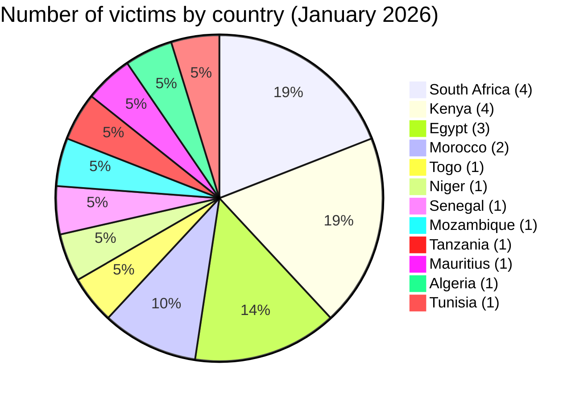
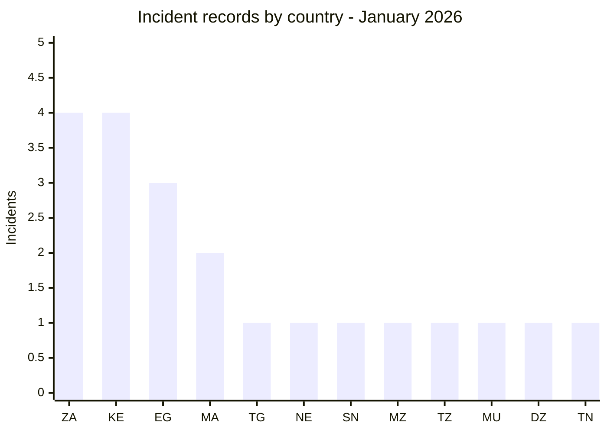
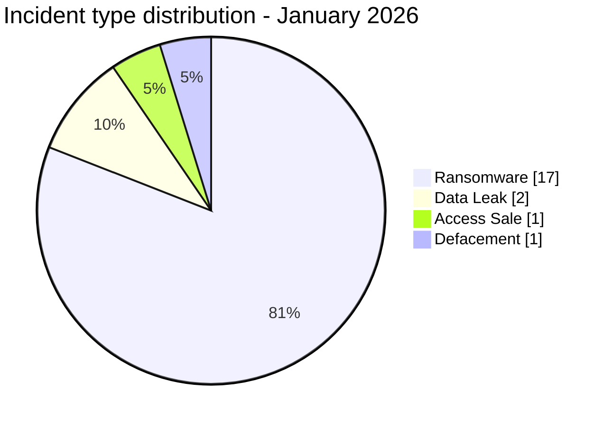
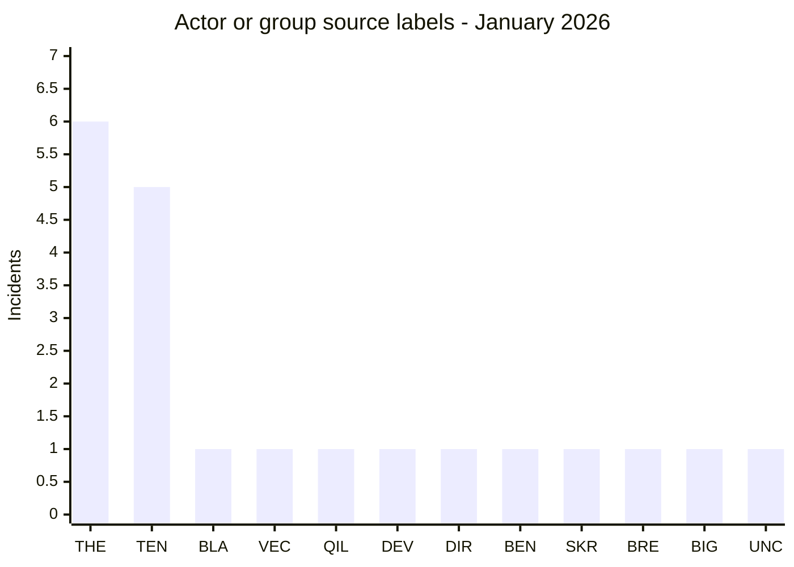
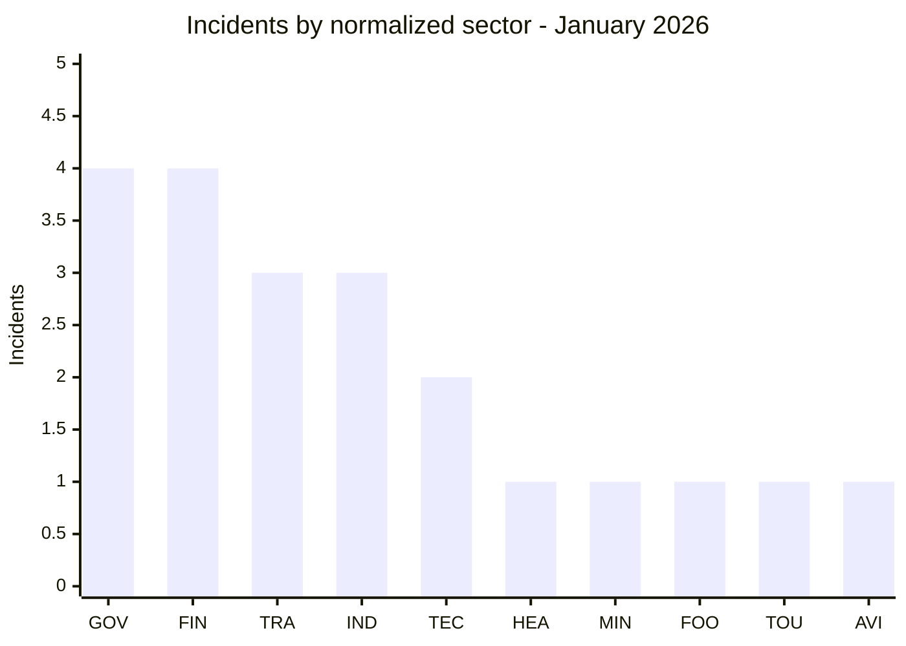

# CTI Report - Cyberattacks in Africa (January 2026)

👉🏾 [**French version available here**](./README_FR.md)

## 1. Executive summary

January 2026 brought in **21 cyber incidents** against African targets, claimed or detected over the month. Ransomware drove most of it, with two groups showing up across borders, alongside two data leaks, one access sale and a coordinated government defacement. Key findings:

- **17 ransomware claims (81.0%)**, **2 data leaks (9.5%)**, **1 access sale (4.8%)**, and **1 defacement (4.8%)**.
- **12 countries** affected; **South Africa** (4 incidents) and **Kenya** (4) are the most targeted, followed by **Egypt** (3).
- **11 identified threat actors** and **1 unattributed defacement**; **TheGentlemen** (6 records) and **tengu** (5) account for 11 records across 7 distinct countries.
- Government, financial services, and transport sectors account for the majority of victims.
- Critical incidents: coordinated defacement of 7+ Nigerien state websites displaying political messages about the country’s geopolitical situation, PixPay Senegal financial data leak (mobile payment), AOM Aviation Morocco data leak (aviation database), and Bigbrother IAB repeatedly selling access to Togolese government infrastructure.

### 📋 Victim list

👉🏾 [View full victim list](./victims.md)

### 1.1 Month-over-month comparison

> Comparison uses the harmonized December 2025 AFRINTEL corpus and the validated January 2026 victim files. It describes documented incident records and does not by itself establish a change in the real number of compromises.

| Indicator | December 2025 | January 2026 | Observed change |
|---|---:|---:|---:|
| Total incidents | 18 | 21 | **+3 (+16.7%)** |
| Ransomware | 14 | 17 | **+3 (+21.4%)** |
| Data Leak | 4 | 2 | **-2 (-50.0%)** |
| Access Sale | 0 | 1 | **+1 (new)** |
| DDoS | 0 | 0 | **0 (stable)** |
| Defacement | 0 | 1 | **+1 (new)** |
| Operational Fraud | 0 | 0 | **0 (stable)** |

The overall documented volume increases by **16.7%**. Ransomware rises from 14 to 17 records and its share increases from **77.8% to 81.0%**. Data Leak decreases from 4 to 2 records. January also introduces one Access Sale and one Defacement, categories not recorded in the harmonized December corpus.

## 2. Methodology

- **Scope**: 54 African countries.
- **Period**: 1-31 January 2026 (incidents disclosed or claimed during this month; actual attack dates may be earlier).
- **Sources**: Dark web, DLS (leak sites), OSINT, Telegram channels, underground forums, media reports.
- **Inclusion**: Publicly claimed or attributed incidents with identified victim, country, sector.
- **Typology**:
  - *Ransomware*: victim publication or claim by a ransomware group. Encryption is not presumed without supporting evidence.
  - *Data breach / intrusion*: unencrypted exfiltration, database sold or published.
  - *Access sale*: sale of compromised credentials or system access by an Initial Access Broker (IAB).
  - *Defacement*: website visual modification, often for political or ideological purposes.

All statistics in this report are calculated once from the validated bilingual pair [`victims.md`](./victims.md) / [`victims_FR.md`](./victims_FR.md). After synchronization, this pair is the source of truth for both language versions; figures are not recomputed independently by language.

## 3. Global overview

| Indicator                     | Value |
|-------------------------------|-------|
| Total victims                 | 21    |
| Countries affected            | 12    |
| Distinct actors               | 12    |
| Ransomware incidents          | 17 (81.0%) |
| Access sale (IAB)             | 1 (4.8%) |
| Data leaks                    | 2 (9.5%) |
| Defacement                    | 1 (4.8%) |

**Most targeted countries:**
- 🇿🇦 South Africa: 4 victims
- 🇰🇪 Kenya: 4 victims
- 🇪🇬 Egypt: 3 victims
- 🇲🇦 Morocco: 2 victims
- 🇹🇬 Togo: 1 victim
- 🇳🇪 Niger: 1 victim (7+ government sites)
- 🇸🇳 Senegal: 1 victim
- 🇲🇿 Mozambique: 1 victim
- 🇹🇿 Tanzania: 1 victim
- 🇲🇺 Mauritius: 1 victim
- 🇩🇿 Algeria: 1 victim
- 🇹🇳 Tunisia: 1 victim

**Country code legend:** `ZA` = South Africa | `KE` = Kenya | `EG` = Egypt | `MA` = Morocco | `TG` = Togo | `NE` = Niger | `SN` = Senegal | `MZ` = Mozambique | `TZ` = Tanzania | `MU` = Mauritius | `DZ` = Algeria | `TN` = Tunisia

**Incident type by country:**
| Country | Ransomware | Data leak | Access sale | Defacement |
|---------|:----------:|:---------:|:-----------:|:----------:|
| South Africa | 4 | 0 | 0 | 0 |
| Kenya | 4 | 0 | 0 | 0 |
| Egypt | 3 | 0 | 0 | 0 |
| Morocco | 1 | 1 | 0 | 0 |
| Togo | 0 | 0 | 1 | 0 |
| Niger | 0 | 0 | 0 | 1 |
| Senegal | 0 | 1 | 0 | 0 |
| Mozambique | 1 | 0 | 0 | 0 |
| Tanzania | 1 | 0 | 0 | 0 |
| Mauritius | 1 | 0 | 0 | 0 |
| Algeria | 1 | 0 | 0 | 0 |
| Tunisia | 1 | 0 | 0 | 0 |

**Color convention:** 🟧 Ransomware | 🟦 Data Leak / Access Sale | 🟨 Defacement.

### Ransomware versus Data Leak / Access Sale by country

This comparison covers **20 of the 21 January incidents**: **17 ransomware records** and **3 Data Leak / Access Sale records**. The Niger event is excluded because it is classified separately as **Defacement**.

**Visual legend:** 🟧 Ransomware | 🟦 Data Leak / Access Sale | 🟨 Defacement

| Code | Country | Ransomware | Bar | Data Leak / Access Sale | Bar |
|---|---|---:|---|---:|---|
| `ZA` | South Africa | **4** | 🟧🟧🟧🟧 | **0** | - |
| `KE` | Kenya | **4** | 🟧🟧🟧🟧 | **0** | - |
| `EG` | Egypt | **3** | 🟧🟧🟧 | **0** | - |
| `MA` | Morocco | **1** | 🟧 | **1** | 🟦 |
| `TG` | Togo | **0** | - | **1** | 🟦 |
| `SN` | Senegal | **0** | - | **1** | 🟦 |
| `MZ` | Mozambique | **1** | 🟧 | **0** | - |
| `TZ` | Tanzania | **1** | 🟧 | **0** | - |
| `MU` | Mauritius | **1** | 🟧 | **0** | - |
| `DZ` | Algeria | **1** | 🟧 | **0** | - |
| `TN` | Tunisia | **1** | 🟧 | **0** | - |
|  | **Compared total** | **17** |  | **3** |  |

```mermaid
xychart-beta
    title "Ransomware vs Data Leak / Access Sale by country - January 2026"
    x-axis ["ZA", "KE", "EG", "MA", "TG", "SN", "MZ", "TZ", "MU", "DZ", "TN"]
    y-axis "Incidents" 0 --> 5
    bar [4, 4, 3, 1, 0, 0, 1, 1, 1, 1, 1]
    bar [0, 0, 0, 1, 1, 1, 0, 0, 0, 0, 0]
```

**Series legend:** first bar series = 🟧 Ransomware | second bar series = 🟦 Data Leak / Access Sale.

**Country legend:** `ZA` = South Africa | `KE` = Kenya | `EG` = Egypt | `MA` = Morocco | `TG` = Togo | `NE` = Niger | `SN` = Senegal | `MZ` = Mozambique | `TZ` = Tanzania | `MU` = Mauritius | `DZ` = Algeria | `TN` = Tunisia

> 🟨 `NE` = Niger: **1 Defacement** incident, shown separately and excluded from the 20-record comparison.

**Most prolific actors:**
| Actor | Type | Incidents | Countries targeted |
|-------|------|:---------:|-------------------|
| TheGentlemen | Ransomware | 6 | Egypt, Kenya, Mauritius, South Africa |
| tengu | Ransomware | 5 | Algeria, Egypt, Kenya, Morocco, Tunisia |
| blackshrantac | Ransomware | 1 | Kenya |
| vect | Ransomware | 1 | South Africa |
| qilin | Ransomware | 1 | Mozambique |
| devman | Ransomware | 1 | Kenya |
| direwolf | Ransomware | 1 | Egypt |
| benzona | Ransomware | 1 | Tanzania |
| skra1a | Data leak | 1 | Morocco |
| breach3d | Data leak | 1 | Senegal |
| Bigbrother | Initial Access Broker | 1 | Togo |
| Unclaimed | Defacement | 1 | Niger |

**Actor/group code legend:** `THE` = TheGentlemen | `TEN` = tengu | `BLA` = blackshrantac | `VEC` = vect | `QIL` = qilin | `DEV` = devman | `DIR` = direwolf | `BEN` = benzona | `SKR` = skra1a | `BRE` = breach3d | `BIG` = Bigbrother | `UNC` = Unclaimed / Non revendiqué

## 4. Geographic summary

> **For details of each incident, see [`victims.md`](./victims.md).**

- **Concentration:** South Africa and Kenya each saw 4 incidents, Egypt trailed with 3. Between them, that's 11 of the month's 21 records.
- **Ransomware activity:** 17 claims in total. TheGentlemen alone accounts for 6, tengu for 5, and both showed up across several regions rather than sticking to one.
- **Other incident types:** two data leaks, an access sale against Togolese government infrastructure, and a coordinated defacement hitting Nigerien government sites round out the month.
- **Notable exposure:** PixPay and AOM Aviation both went public with financial and aviation data respectively; how far the exposure actually reaches depends on material AFRINTEL hasn't independently verified.

---

## 5. Detailed analysis by incident type

### 5.1 Ransomware - 17 incidents

| Country | Incidents | Main actor labels |
|---|---:|---|
| South Africa | 4 | TheGentlemen (3), vect (1) |
| Kenya | 4 | TheGentlemen, devman, blackshrantac, tengu |
| Egypt | 3 | TheGentlemen, direwolf, tengu |
| Morocco | 1 | tengu |
| Mozambique | 1 | qilin |
| Tanzania | 1 | benzona |
| Mauritius | 1 | TheGentlemen |
| Algeria | 1 | tengu |
| Tunisia | 1 | tengu |
| **Total** | **17** | |

### 5.2 Data Leak - 2 incidents

| Victim | Country | Actor / Group |
|---|---|---|
| PixPay | Senegal | breach3d |
| AOM Aviation Group | Morocco | skra1a |

### 5.3 Access Sale - 1 incident

| Victim | Country | Actor / Group |
|---|---|---|
| Government of Togo | Togo | Bigbrother |

The record describes an advertised access sale. The report does not independently confirm that the advertised access remained valid.

### 5.4 Defacement - 1 incident

| Victim | Country | Actor / Group |
|---|---|---|
| Nigerien government websites (7+) | Niger | Unclaimed |

The source material supports a coordinated defacement classification. It does not establish the technical dependency or initial access path used across the affected sites.

## 6. Sectoral impact

| Sector | Incidents | Percentage |
|--------|:---------:|:----------:|
| Government / Public administration | 4 | 19.0% |
| Financial services / FinTech | 4 | 19.0% |
| Transport / Logistics | 3 | 14.3% |
| Industry / Engineering | 3 | 14.3% |
| Technology / IT | 2 | 9.5% |
| Healthcare | 1 | 4.8% |
| Mining | 1 | 4.8% |
| Food industry | 1 | 4.8% |
| Tourism | 1 | 4.8% |
| Aviation | 1 | 4.8% |

**Sector code legend:** `GOV` = Government / Public administration | `FIN` = Financial services / FinTech | `TRA` = Transport / Logistics | `IND` = Industry / Engineering | `TEC` = Technology / IT | `HEA` = Healthcare | `MIN` = Mining | `FOO` = Food industry | `TOU` = Tourism | `AVI` = Aviation

**Takeaways:**
- Government and financial services tie at the top, 4 incidents each, both sectors staying attractive targets month after month.
- January's ransomware listings touched organizations supporting water, transport, port and mining functions. That establishes sector exposure; it doesn't tell us whether operations were actually disrupted, the source cards don't go that far.
- Healthcare NGOs, CCBRT Tanzania in this case, look like an underprotected category worth watching.

## 7. Threat actor profile

| Actor | Type | Incidents | Primary targets |
|-------|------|:---------:|-----------------|
| TheGentlemen | Ransomware group | 6 | Egypt, Kenya, Mauritius, South Africa |
| tengu | Ransomware group | 5 | Algeria, Egypt, Kenya, Morocco, Tunisia |
| blackshrantac | Ransomware | 1 | Kenya (public services) |
| vect | Ransomware | 1 | South Africa (engineering) |
| qilin | Ransomware | 1 | Mozambique (infrastructure) |
| devman | Ransomware | 1 | Kenya (social security) |
| direwolf | Ransomware | 1 | Egypt (engineering) |
| benzona | Ransomware | 1 | Tanzania (healthcare NGO) |
| skra1a | Data broker | 1 | Morocco (aviation) |
| breach3d | Data broker | 1 | Senegal (fintech) |
| Bigbrother | Initial Access Broker | 1 | Togo (government) |
| Unclaimed | Defacement | 1 | Niger (government) |

**Emerging actors:** benzona (first appearance in AFRINTEL), vect, direwolf.

### 7.1 Risk assessment

| Country | Risk level |
|---------|-----------|
| South Africa | 🔴 High (4 ransomware, industrial/government) |
| Kenya | 🔴 High (4 ransomware, critical public institutions) |
| Egypt | 🟠 Medium-High (3 ransomware, multiple sectors) |
| Morocco | 🟠 Medium (data leak + ransomware) |
| Togo | 🟠 Medium (two IAB publications, September 2025 and January 2026) |
| Niger | 🟠 Medium (coordinated defacement, unresolved attribution) |
| Others | 🟡 Low-Medium |

## 8. Key trends and intelligence gaps

### Trends

1. **TheGentlemen and tengu dominate the month.** Between them, 52% of January's records, TheGentlemen in 4 countries, tengu in 5, seven distinct countries covered once the two are combined.
2. **Kenya stands out.** All 4 incidents there hit public institutions, water, pension, social security, mining. That reads less like scattered opportunism and more like deliberate targeting of government-adjacent infrastructure.
3. **Togo keeps coming up.** Bigbrother sold access in September 2025, then claimed new access again in January. Two publications on the same government infrastructure is reason enough to push credential and access review now, not later.
4. **Niger's government sites went down together.** More than seven state websites defaced with the same political messaging, but the source material doesn't identify what technical dependency the operation actually exploited.
5. **Two unrelated sectors leaked data.** PixPay (mobile payments) and AOM Aviation (civil aviation) don't share a pattern beyond both being data publications, not enough on their own to call a sector trend.

### Gaps

- The Niger defacement attackers remain unattributed.
- Bigbrother's buyer and the nature of exploited access are unknown.
- Actual data volumes in leak incidents have not been independently verified.

## 9. MITRE ATT&CK mapping (contextual)

| Phase | Technique | Analytical scope |
| :--- | :--- | :--- |
| Initial access | T1566 - Phishing | Defensive detection hypothesis, not observed from the claims alone |
| Initial access | T1190 - Exploit Public-Facing Application | Defensive detection hypothesis, not observed from the claims alone |
| Account access | T1078 - Valid Accounts | Relevant to access or credential sales, without confirming use of the accounts |
| Collection | T1005 - Data from Local System | Contextual hypothesis when internal data is published; the collection mechanism remains unknown |
| Impact | T1486 - Data Encrypted for Impact | Relevant to ransomware preparedness, without confirming encryption for every entry |

> These techniques are defensive hypotheses. A claim, data sale or leak-site publication is not sufficient to treat them as observed.

## 10. Recommendations

### For African governments and enterprises

- **Patch management**: Priority for public-facing applications (CMS, web portals, financial platforms).
- **IAB monitoring**: Any claim of access sale to government infrastructure must trigger immediate credential rotation and forensic audit, not just acknowledgment.
- **MFA enforcement**: All privileged accounts and VPN access must use multi-factor authentication.
- **Incident response**: Establish dedicated IR playbooks for ransomware and defacement scenarios, including communication protocols.
- **Third-party risk**: Logistics software (Paltrack), aviation platforms, and fintech providers must be included in security assessments.

### For CTI analysts

- Track **TheGentlemen** and **tengu** for new African publications; together they appeared across 7 distinct countries in January.
- Monitor **Bigbrother** for new Togolese government access claims and buyer activity.
- Watch for follow-on operations tied to Niger defacement (possible escalation after reconnaissance).
- Alert on any PixPay or AOM data appearing on secondary markets.

## 11. SOC tactical recommendations

### Detection priorities

- Monitor **ransomware deployment patterns (T1486)**: file encryption events, shadow copy deletion, rapid file modification
- Detect **IAB staging activity**: unusual VPN logins, off-hours privileged account activity, lateral movement signals
- Track **data exfiltration (T1041)**: large outbound transfers, use of cloud storage services, Tor exit node connections
- For government portals: monitor **web application logs** for exploitation attempts (T1190)

### Monitoring sources

- EDR / Sysmon
- Firewall / Proxy logs
- DNS logs
- Identity and access management logs
- Web application firewall (WAF)
- VPN authentication logs

## 12. Strategic recommendations

- Establish **regional CTI sharing mechanisms** between East African governments (Kenya, Tanzania, Mozambique) given cross-border ransomware activity.
- Mandate **minimum security baselines** for government websites in West Africa (CMS patching, web application firewalls) following the Niger mass defacement.
- Create **national IAB watchlists**: when a country's government infrastructure appears on criminal forums, a structured response protocol should be pre-defined.
- Prioritize **FinTech regulatory security requirements**: mobile payment platforms hold financial data at a scale that makes leaks highly damaging.

## 13. Conclusion

January 2026 closes with **21 documented or claimed incidents across 12 African countries**: **17 Ransomware, 2 Data Leak, 1 Access Sale and 1 Defacement**.

South Africa and Kenya record four incidents each, followed by Egypt with three. TheGentlemen and tengu account for **11 of the 21 records**, while the non-ransomware portion of the month includes two data publications, one advertised access sale and one coordinated government defacement.

Compared with the harmonized December 2025 corpus, the documented total rises from **18 to 21 (+16.7%)**. Ransomware increases from **14 to 17 (+21.4%)**, Data Leak decreases from **4 to 2 (-50.0%)**, while January records **1 Access Sale** and **1 Defacement**, compared with none in December.

**AFRINTEL** - African Cyber Threat Intelligence  
[GitHub AFRINTEL](https://github.com/Hatchepsoute/AFRINTEL)
