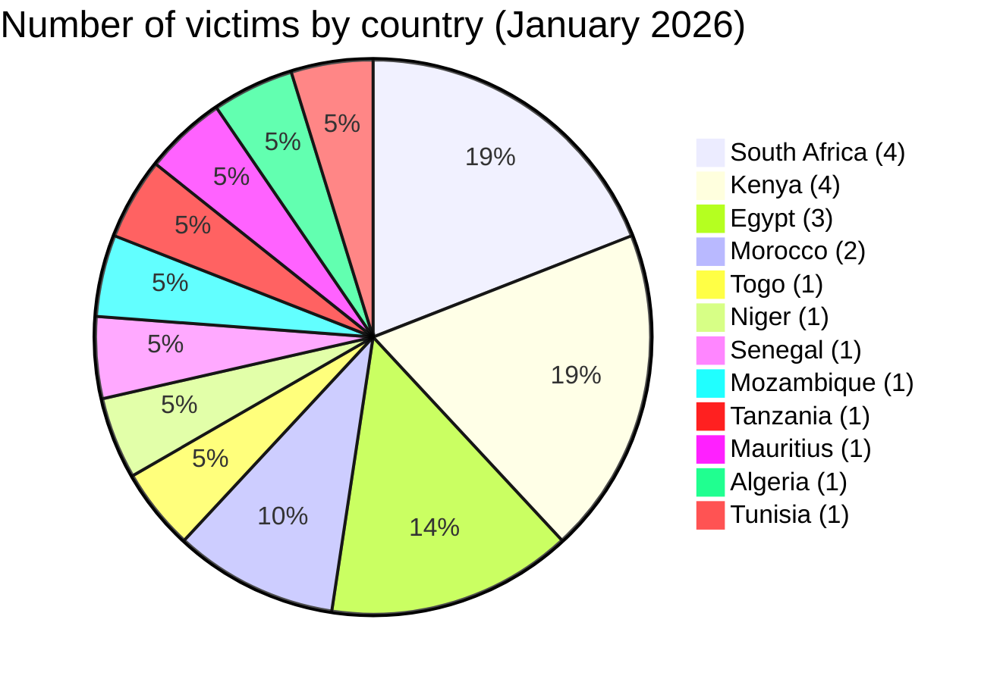
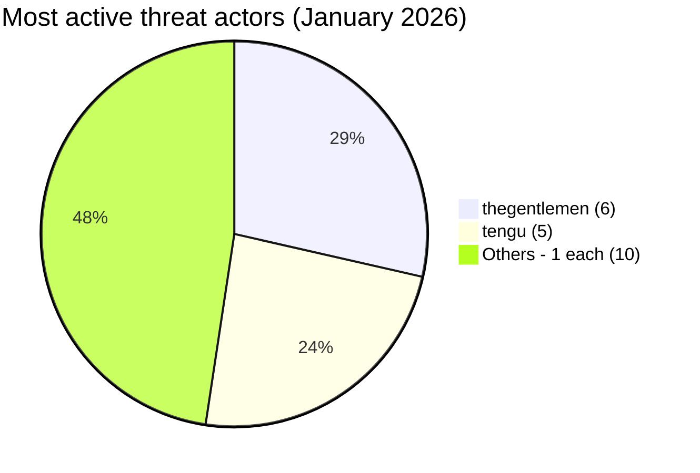
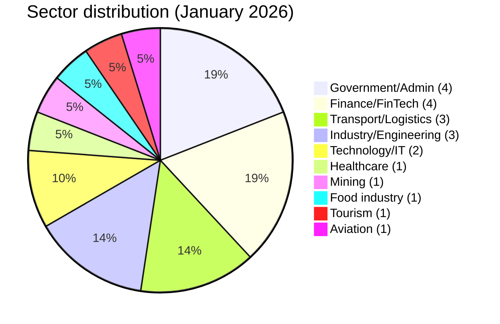

# CTI Report - Cyberattacks in Africa (January 2026)

👉🏾 [**French version available here**](./README_FR.md)

## 1. Executive summary

In January 2026, **21 cyber incidents** targeting African entities were publicly claimed or detected. The month was dominated by ransomware with a notable cross-border presence of two groups, alongside two data leaks and a coordinated government defacement. Key findings:

- **18 ransomware/access-sale claims (85.7%)** and **2 data leaks (9.5%)** and **1 defacement (4.8%)**.
- **12 countries** affected; **South Africa** (4 incidents) and **Kenya** (4) are the most targeted, followed by **Egypt** (3).
- **12 distinct threat actors**; **thegentlemen** (6 incidents) and **tengu** (5) dominate the landscape with a combined pan-African reach.
- Government, financial services, and transport sectors account for the majority of victims.
- Critical incidents: coordinated defacement of 7+ Nigerien government websites (politically charged, unclaimed), PixPay Senegal financial data leak (mobile payment), AOM Aviation Morocco data leak (aviation database), and Bigbrother IAB repeatedly selling access to Togolese government infrastructure.

### 📋 Victim list

👉🏾 [View full victim list](./victims.md)

## 2. Methodology

- **Scope**: 54 African countries.
- **Period**: 1-31 January 2026 (incidents disclosed or claimed during this month; actual attack dates may be earlier).
- **Sources**: Dark web, DLS (leak sites), OSINT, Telegram channels, underground forums, media reports.
- **Inclusion**: Publicly claimed or attributed incidents with identified victim, country, sector.
- **Typology**:
  - *Ransomware*: encryption + ransom demand (claim on DLS).
  - *Data breach / intrusion*: unencrypted exfiltration, database sold or published.
  - *Access sale*: sale of compromised credentials or system access by an Initial Access Broker (IAB).
  - *Defacement*: website visual modification, often for political or ideological purposes.

## 3. Global overview

| Indicator                     | Value |
|-------------------------------|-------|
| Total victims                 | 21    |
| Countries affected            | 12    |
| Distinct actors               | 12    |
| Ransomware incidents          | 17 (81.0%) |
| Access sale (IAB)             | 1 (4.8%) |
| Data leaks                    | 2 (9.5%) |
| Defacement                    | 1 (4.8%) |

**Most targeted countries:**
- 🇿🇦 South Africa: 4 victims
- 🇰🇪 Kenya: 4 victims
- 🇪🇬 Egypt: 3 victims
- 🇲🇦 Morocco: 2 victims
- 🇹🇬 Togo: 1 victim
- 🇳🇪 Niger: 1 victim (7+ government sites)
- 🇸🇳 Senegal: 1 victim
- 🇲🇿 Mozambique: 1 victim
- 🇹🇿 Tanzania: 1 victim
- 🇲🇺 Mauritius: 1 victim
- 🇩🇿 Algeria: 1 victim
- 🇹🇳 Tunisia: 1 victim

**Incident type by country:**
| Country | Ransomware | Data leak | Access sale | Defacement |
|---------|:----------:|:---------:|:-----------:|:----------:|
| South Africa | 4 | 0 | 0 | 0 |
| Kenya | 4 | 0 | 0 | 0 |
| Egypt | 3 | 0 | 0 | 0 |
| Morocco | 1 | 1 | 0 | 0 |
| Togo | 0 | 0 | 1 | 0 |
| Niger | 0 | 0 | 0 | 1 |
| Senegal | 0 | 1 | 0 | 0 |
| Mozambique | 1 | 0 | 0 | 0 |
| Tanzania | 1 | 0 | 0 | 0 |
| Mauritius | 1 | 0 | 0 | 0 |
| Algeria | 1 | 0 | 0 | 0 |
| Tunisia | 1 | 0 | 0 | 0 |

**Most prolific actors:**
| Actor | Type | Incidents | Countries targeted |
|-------|------|:---------:|-------------------|
| thegentlemen | Ransomware | 6 | Egypt, Kenya, Mauritius, South Africa |
| tengu | Ransomware | 5 | Algeria, Egypt, Kenya, Morocco, Tunisia |
| blackshrantac | Ransomware | 1 | Kenya |
| vect | Ransomware | 1 | South Africa |
| qilin | Ransomware | 1 | Mozambique |
| devman | Ransomware | 1 | Kenya |
| direwolf | Ransomware | 1 | Egypt |
| benzona | Ransomware | 1 | Tanzania |
| skra1a | Data leak | 1 | Morocco |
| breach3d | Data leak | 1 | Senegal |
| Bigbrother | Initial Access Broker | 1 | Togo |
| Unclaimed | Defacement | 1 | Niger |

## 4. Country-by-country overview

> All entries cover publicly claimed incidents only. Claims remain unverified unless independently confirmed.

### 🇿🇦 South Africa (4 incidents: 4 ransomware)

South Africa recorded four ransomware incidents in January, all targeting industrial and government-linked organizations. The threat actor thegentlemen struck three victims on the same day, January 20: Paltrack, a logistics software company serving the agri-food sector; Rola Motor Group, an automotive dealership and distribution network; and Witzenberg Municipality, a local government entity in the Western Cape. The concentration of three claims on a single day suggests coordinated targeting across distinct sectors. A fourth victim, Hytec South Africa, a hydraulic and mechanical engineering company, was claimed by the threat actor vect. Local government and industrial supply chain represent a recurring exposure pattern for South Africa.

---

### 🇰🇪 Kenya (4 incidents: 4 ransomware)

Kenya recorded the joint-highest victim count in January with four ransomware claims, all targeting public or quasi-public institutions. The threat actor blackshrantac claimed the National Water Authority on January 8, a critical utility responsible for the country's water resource management. On January 20, the threat actor thegentlemen claimed CPF Financial Services, a pension and capital management provider, and the threat actor devman claimed NSSF, the national social security fund, making January 20 the most active single day of the month. The threat actor tengu claimed NAMICO, the National Mining Corporation, on January 26. The breadth of sectors affected reflects a pattern of deliberate targeting of Kenyan government-linked infrastructure.

---

### 🇪🇬 Egypt (3 incidents: 3 ransomware)

Egypt recorded three ransomware claims from three different actors across distinct sectors. The threat actor thegentlemen claimed Real Tech, a technology and IT security company, on January 11. The threat actor direwolf claimed Tepco-Group, an electrical engineering firm, on January 13. The threat actor tengu claimed skyegtours.com, a tourism and travel platform, on January 27. The distribution across sectors and actors suggests opportunistic targeting rather than a coordinated campaign against Egypt.

---

### 🇲🇦 Morocco (2 incidents: 1 ransomware, 1 data leak)

Morocco was hit by two distinct incident types in January. The threat actor tengu claimed Nafae Sanitaire, a construction and plumbing supply company, on January 17. The threat actor skra1a published an aviation database from AOM Aviation Group (Air Ocean Maroc) on January 31, exposing operational and civil aviation data on the deep web. The aviation sector data exposure is notable given the sensitivity of operational and passenger records.

---

### 🇹🇬 Togo (1 incident: access sale)

The threat actor Bigbrother, operating as an Initial Access Broker, claimed new accesses to Togolese government platforms on January 3. This follows a prior access claim to gouv.tg infrastructure in September 2025. The recurring targeting of the same government entity by the same IAB indicates persistent access and a risk of escalation: unsold or unpatched access can be leveraged for ransomware, espionage, or destructive operations.

---

### 🇳🇪 Niger (1 incident: defacement)

On January 4, seven or more Nigerien government websites were simultaneously defaced displaying an identical politically charged message. The coordinated nature across multiple domains (ANSI, MAGEL, urbanism, industry, women's promotion ministries) indicates either a common vulnerability in shared hosting infrastructure or a coordinated access operation. The attack was unclaimed, which is unusual for hacktivist defacements and may suggest a politically motivated actor avoiding attribution.

---

### 🇸🇳 Senegal (1 incident: data leak)

PixPay, a Senegalese mobile payment platform, had its financial database published by the threat actor breach3d on January 16. Mobile payment data exposure creates direct risks of payment fraud, account takeover, and targeted phishing against users.

---

### 🇲🇿 Mozambique (1 incident: ransomware)

CFM Mozambique, the national railway and port authority, was claimed by the threat actor Qilin on January 16. Targeting national transport infrastructure poses risks to supply chain logistics and port operations.

---

### 🇹🇿 Tanzania (1 incident: ransomware)

CCBRT, a healthcare NGO providing specialized rehabilitation services, was claimed by the threat actor benzona on January 17. Healthcare NGOs represent a distinct target category: limited cybersecurity budgets, sensitive patient data, and donor and partner communications of operational value.

---

### 🇲🇺 Mauritius (1 incident: ransomware)

Rogers Capital, a financial services and technology provider, was claimed by the threat actor thegentlemen on January 14. Financial services providers in island economies often serve as hubs for regional capital flows, increasing the sensitivity of their data.

---

### 🇩🇿 Algeria (1 incident: ransomware)

Tahkout Group, a major industrial conglomerate involved in automotive assembly and transport, was claimed by the threat actor tengu on January 28. The group's broad industrial footprint amplifies the potential disruption impact of any operational compromise.

---

### 🇹🇳 Tunisia (1 incident: ransomware)

FRUIT-BONTÉ, an agri-food and fruit processing company, was claimed by the threat actor tengu on January 27. The agri-food sector in North Africa is increasingly targeted, suggesting ransomware groups are expanding beyond traditional sectors.

---

## 5. Detailed analysis by incident type

### 5.1 Ransomware and access sales (18 claims)

| Country | Attacks | Main actors |
|---------|:-------:|-------------|
| South Africa | 4 | thegentlemen (3), vect (1) |
| Kenya | 4 | thegentlemen, devman, blackshrantac, tengu |
| Egypt | 3 | thegentlemen, direwolf, tengu |
| Morocco | 1 | tengu |
| Mozambique | 1 | qilin |
| Tanzania | 1 | benzona |
| Mauritius | 1 | thegentlemen |
| Algeria | 1 | tengu |
| Tunisia | 1 | tengu |
| Togo | 1 | Bigbrother (IAB, access sale) |

**Key observations:**
- **thegentlemen** and **tengu** collectively account for 11 of 21 incidents (52%). Their simultaneous pan-African presence in January suggests either two prolific groups operating independently or groups with shared tooling.
- January 20 was the most active single day: 5 claims in South Africa and Kenya alone (Paltrack, Rola, Witzenberg, CPF, NSSF).
- **Bigbrother/Togo** represents an IAB pattern: prior SSH access sold (September 2025), then new access claimed (January 2026). Persistent access increases risk of future high-impact operations.

### 5.2 Data leaks (2 incidents)

| Victim | Actor | Sector | Data exposed |
|--------|-------|--------|-------------|
| PixPay (Senegal) | breach3d | FinTech / Mobile payment | Financial database |
| AOM Aviation Group (Morocco) | skra1a | Air transport / Civil aviation | Aviation database |

### 5.3 Defacement (1 incident)

| Victim | Actor | Sector | Scope |
|--------|-------|--------|-------|
| Nigerien government websites (7+) | Unclaimed | Public administration | Coordinated, politically motivated |

## 6. Sectoral impact

| Sector | Incidents | Percentage |
|--------|:---------:|:----------:|
| Government / Public administration | 4 | 19.0% |
| Financial services / FinTech | 4 | 19.0% |
| Transport / Logistics | 3 | 14.3% |
| Industry / Engineering | 3 | 14.3% |
| Technology / IT | 2 | 9.5% |
| Healthcare | 1 | 4.8% |
| Mining | 1 | 4.8% |
| Food industry | 1 | 4.8% |
| Tourism | 1 | 4.8% |
| Aviation | 1 | 4.8% |

**Takeaways:**
- Government and financial services share the top position (4 incidents each), confirming their sustained attractiveness as targets.
- The simultaneous presence of critical infrastructure (water, transport, ports, mining) indicates ransomware groups are no longer limiting themselves to easy commercial targets.
- Healthcare NGOs (CCBRT Tanzania) represent an underprotected category.

## 7. Threat actor profile

| Actor | Type | Incidents | Primary targets |
|-------|------|:---------:|-----------------|
| thegentlemen | Ransomware group | 6 | Egypt, Kenya, Mauritius, South Africa |
| tengu | Ransomware group | 5 | Algeria, Egypt, Kenya, Morocco, Tunisia |
| blackshrantac | Ransomware | 1 | Kenya (public services) |
| vect | Ransomware | 1 | South Africa (engineering) |
| qilin | Ransomware | 1 | Mozambique (infrastructure) |
| devman | Ransomware | 1 | Kenya (social security) |
| direwolf | Ransomware | 1 | Egypt (engineering) |
| benzona | Ransomware | 1 | Tanzania (healthcare NGO) |
| skra1a | Data broker | 1 | Morocco (aviation) |
| breach3d | Data broker | 1 | Senegal (fintech) |
| Bigbrother | Initial Access Broker | 1 | Togo (government) |
| Unclaimed | Defacement | 1 | Niger (government) |

**Emerging actors:** benzona (first appearance in AFRINTEL), vect, direwolf.

### 7.1 Risk assessment

| Country | Risk level |
|---------|-----------|
| South Africa | 🔴 High (4 ransomware, industrial/government) |
| Kenya | 🔴 High (4 ransomware, critical public institutions) |
| Egypt | 🟠 Medium-High (3 ransomware, multiple sectors) |
| Morocco | 🟠 Medium (data leak + ransomware) |
| Togo | 🟠 Medium (persistent IAB access since September 2025) |
| Niger | 🟠 Medium (coordinated defacement, unresolved attribution) |
| Others | 🟡 Low-Medium |

## 8. Key trends and intelligence gaps

### Trends

1. **Dual dominance of thegentlemen and tengu**: 52% of all January incidents are attributed to two groups operating simultaneously across 7 countries each. Their simultaneous expansion across East, North, and Southern Africa in a single month is a notable operational pattern.
2. **Surge in Kenya**: 4 incidents, all targeting public institutions (water, pension, social security, mining). Pattern consistent with deliberate targeting of government-adjacent infrastructure.
3. **IAB activity on Togolese government**: Bigbrother's repeated claims suggest persistent access that has not been remediated, increasing risk of more severe follow-on operations.
4. **Coordinated government defacement in Niger**: Unclaimed, politically motivated, affecting 7+ ministries simultaneously. Likely exploiting shared CMS vulnerabilities or hosting infrastructure.
5. **Financial data leaks emerging**: PixPay (mobile payment) and AOM Aviation (civil aviation) indicate data brokers are active in new sectors beyond the typical government/university targets.

### Gaps

- Many ransomware claims remain unverified; no public confirmation from victims.
- The Niger defacement attackers remain unattributed.
- Bigbrother's buyer and the nature of exploited access are unknown.
- Actual data volumes in leak incidents have not been independently verified.

## 9. MITRE ATT&CK mapping (contextual)

| Incident | Techniques |
|----------|-----------|
| Niger defacement | T1190 - Exploit Public-Facing App, T1491 - Defacement |
| Bigbrother/Togo | T1078 - Valid Accounts, T1650 - Acquire Access |
| PixPay | T1005 - Data from Local System, T1041 - Exfiltration |
| AOM Aviation | T1005 - Data from Local System, T1041 - Exfiltration |
| General ransomware | T1486 - Ransomware, T1490 - Inhibit System Recovery |

**Common techniques observed:**
- T1566 - Phishing (likely initial vector for most ransomware)
- T1190 - Exploit Public-Facing Application
- T1078 - Valid Accounts (Togo IAB activity)
- T1486 - Ransomware (17 incidents)
- T1491 - Defacement (Niger)

## 10. Recommendations

### For African governments and enterprises

- **Patch management**: Priority for public-facing applications (CMS, web portals, financial platforms).
- **IAB monitoring**: Any claim of access sale to government infrastructure must trigger immediate credential rotation and forensic audit, not just acknowledgment.
- **MFA enforcement**: All privileged accounts and VPN access must use multi-factor authentication.
- **Incident response**: Establish dedicated IR playbooks for ransomware and defacement scenarios, including communication protocols.
- **Third-party risk**: Logistics software (Paltrack), aviation platforms, and fintech providers must be included in security assessments.

### For CTI analysts

- Track **thegentlemen** and **tengu** for new African campaigns; their simultaneous 12-country reach in one month suggests active expansion.
- Monitor **Bigbrother** for new Togolese government access claims and buyer activity.
- Watch for follow-on operations tied to Niger defacement (possible escalation after reconnaissance).
- Alert on any PixPay or AOM data appearing on secondary markets.

## 11. SOC tactical recommendations

### Detection priorities

- Monitor **ransomware deployment patterns (T1486)**: file encryption events, shadow copy deletion, rapid file modification
- Detect **IAB staging activity**: unusual VPN logins, off-hours privileged account activity, lateral movement signals
- Track **data exfiltration (T1041)**: large outbound transfers, use of cloud storage services, Tor exit node connections
- For government portals: monitor **web application logs** for exploitation attempts (T1190)

### Monitoring sources

- EDR / Sysmon
- Firewall / Proxy logs
- DNS logs
- Identity and access management logs
- Web application firewall (WAF)
- VPN authentication logs

## 12. Strategic recommendations

- Establish **regional CTI sharing mechanisms** between East African governments (Kenya, Tanzania, Mozambique) given cross-border ransomware activity.
- Mandate **minimum security baselines** for government websites in West Africa (CMS patching, web application firewalls) following the Niger mass defacement.
- Create **national IAB watchlists**: when a country's government infrastructure appears on criminal forums, a structured response protocol should be pre-defined.
- Prioritize **FinTech regulatory security requirements**: mobile payment platforms hold financial data at a scale that makes leaks highly damaging.

## 13. Conclusion

January 2026 opens the year with a broad and geographically dispersed ransomware wave across Africa. The dominance of two groups (thegentlemen and tengu) across 12 countries, the persistence of IAB Bigbrother against Togolese government infrastructure, and the coordinated Niger defacement all point to a threat landscape becoming more organized and deliberate. South Africa and Kenya remain the primary targets, but the spread across West, East, Central, and North Africa confirms that no African sub-region is out of scope. AFRINTEL will continue tracking these actors and emerging data leak activity as the year progresses.

**AFRINTEL** - African Cyber Threat Intelligence
[GitHub AFRINTEL](https://github.com/Hatchepsoute/AFRINTEL)
