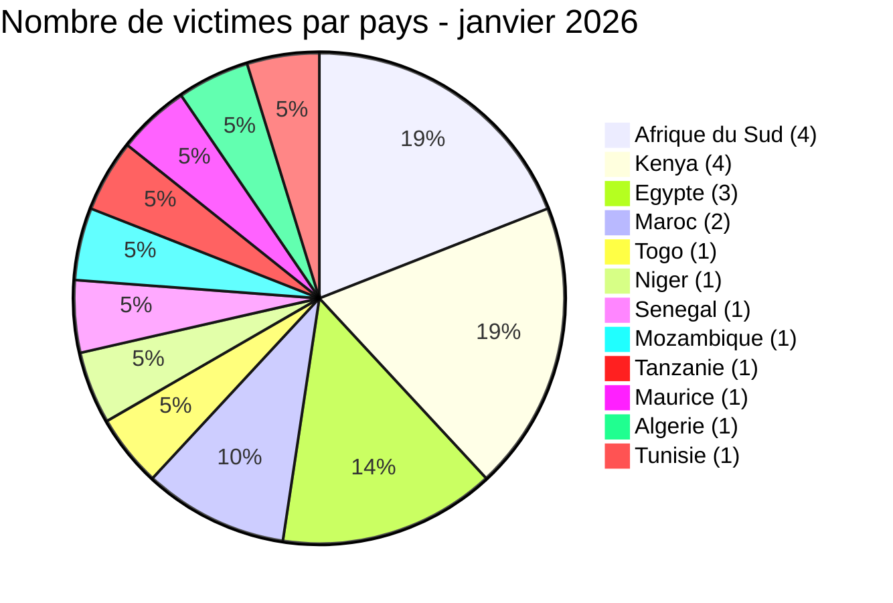
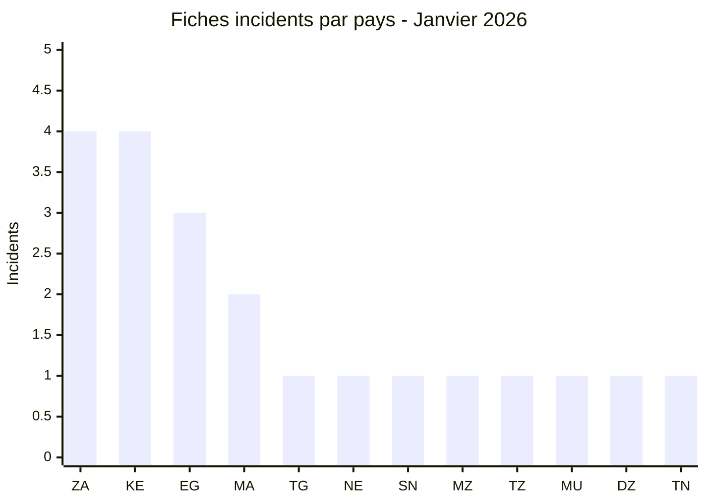
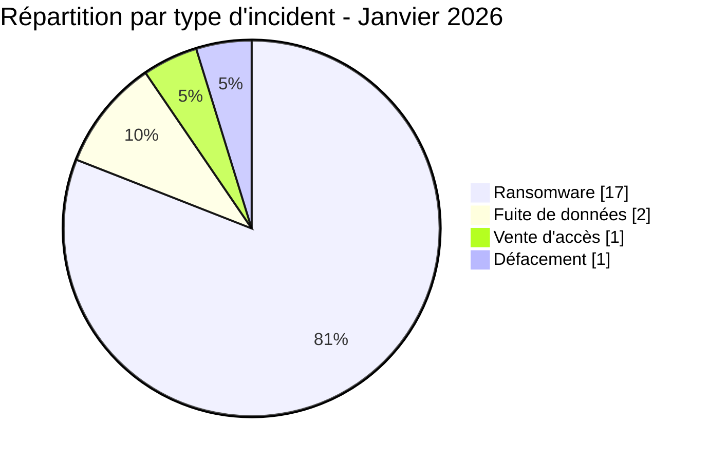
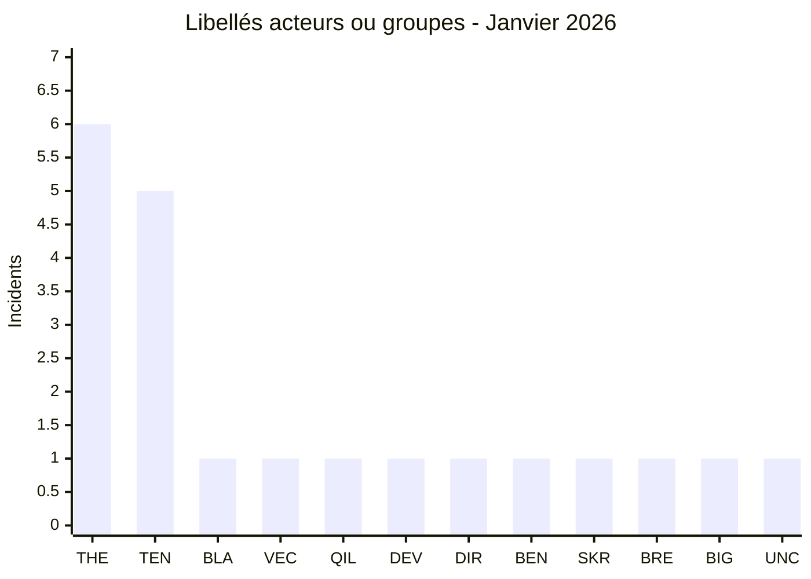
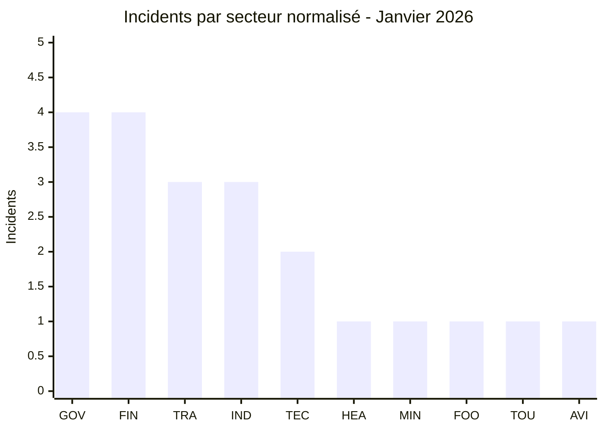

# Rapport CTI - Cyberattaques en Afrique (janvier 2026)

👉🏾 [**English version available here**](./README.md)

## 1. Synthèse exécutive

Janvier 2026 a rapporté **21 incidents cyber** contre des cibles africaines, revendiqués ou détectés dans le mois. Le ransomware a mené la danse, avec deux groupes actifs au-delà des frontières, aux côtés de deux fuites de données, une vente d'accès et un défacement gouvernemental coordonné. Points clés :

- **17 revendications ransomware (81,0 %)**, **2 fuites de données (9,5 %)**, **1 vente d'accès (4,8 %)** et **1 défacement (4,8 %)**.
- **12 pays** touchés : **l'Afrique du Sud** (4 incidents) et le **Kenya** (4) sont les plus ciblés, suivis de l'**Égypte** (3).
- **11 acteurs identifiés** et **1 défacement non attribué** : **TheGentlemen** (6 fiches) et **tengu** (5) regroupent 11 fiches dans 7 pays distincts.
- Les secteurs gouvernemental, financier et des transports représentent la majorité des victimes.
- Incidents critiques : défacement coordonné de 7+ sites de l’État nigérien affichant des messages politiques liés à la situation géopolitique du pays, fuite de données PixPay Sénégal (paiement mobile), fuite de données AOM Aviation Maroc (base de données aviation), et l'acteur IAB Bigbrother vendant de manière répétée des accès à l'infrastructure gouvernementale togolaise.

### 📋 Liste des victimes

👉🏾 [Voir la liste complète des victimes](./victims_FR.md)

### 1.1 Étude comparative - Décembre 2025 vs Janvier 2026

> Cette comparaison utilise le **corpus AFRINTEL corrigé de décembre 2025 (19 incidents)** et le corpus victimes validé de janvier 2026 (21 incidents). La baseline de décembre intègre la Data Leak de Yalla Tager Marketplace ajoutée rétrospectivement au 26 décembre 2025. Les chiffres décrivent la visibilité documentée par AFRINTEL et ne doivent pas être interprétés comme une mesure directe du nombre réel de compromissions en Afrique.

#### 1.1.1 Évolution du volume global et des types d'incident

| Indicateur | Décembre 2025 | Janvier 2026 | Évolution observée |
|---|---:|---:|---:|
| Total incidents | **19** | **21** | **+2 (+10,5 %)** |
| Ransomware | 14 | 17 | **+3 (+21,4 %)** |
| Data Leak | 5 | 2 | **-3 (-60,0 %)** |
| Access Sale | 0 | 1 | **+1 (nouveau)** |
| DDoS | 0 | 0 | **Stable** |
| Defacement | 0 | 1 | **+1 (nouveau)** |
| Account Takeover | 0 | 0 | **Stable** |
| System Intrusion | 0 | 0 | **Stable** |
| Malware | 0 | 0 | **Stable** |
| Operational Fraud | 0 | 0 | **Stable** |

Le volume mensuel documenté progresse donc modérément, de **19 à 21 incidents (+10,5 %)**, mais sa composition évolue nettement. Le Ransomware passe de **14 à 17 fiches** et sa part augmente de **73,7 % à 81,0 %**. À l'inverse, les Data Leak passent de **5 à 2 fiches**, soit une baisse de leur part de **26,3 % à 9,5 %**.

Décembre ne comportait que des Ransomware et Data Leak. Janvier introduit **1 Access Sale** et **1 Defacement**, qui représentent ensemble **2 des 21 incidents (9,5 %)**. Le mois est donc davantage dominé par le ransomware tout en présentant une légère diversification hors des deux catégories principales.

```mermaid
xychart-beta
    title "Comparaison des types d'incident - Décembre 2025 vs Janvier 2026"
    x-axis ["Ransomware", "Data Leak", "Access Sale", "Defacement"]
    y-axis "Incidents" 0 --> 18
    bar [14, 5, 0, 0]
    bar [17, 2, 1, 1]
```

**Légende des séries :** première série = décembre 2025 | deuxième série = janvier 2026.

#### 1.1.2 Évolution géographique

Le nombre de pays représentés passe de **10 en décembre à 12 en janvier (+20,0 %)**. Dans le même temps, la concentration sur les trois premiers pays diminue :

- **Décembre 2025 :** Égypte (6), Afrique du Sud (3), Tunisie (3) = **12 incidents sur 19 (63,2 %)**.
- **Janvier 2026 :** Afrique du Sud (4), Kenya (4), Égypte (3) = **11 incidents sur 21 (52,4 %)**.

Janvier présente donc une dispersion géographique plus large. Le changement le plus visible est la progression du **Kenya de 1 à 4 fiches**, tandis que l'**Égypte passe de 6 à 3** et la **Tunisie de 3 à 1**.

| Pays | Décembre 2025 | Janvier 2026 | Évolution |
|---|---:|---:|---:|
| Kenya | 1 | 4 | **+3 (+300,0 %)** |
| Afrique du Sud | 3 | 4 | **+1 (+33,3 %)** |
| Maroc | 1 | 2 | **+1 (+100,0 %)** |
| Égypte | 6 | 3 | **-3 (-50,0 %)** |
| Tunisie | 3 | 1 | **-2 (-66,7 %)** |
| Algérie | 1 | 1 | **Stable** |

Le profil de décembre était fortement porté par la visibilité en Afrique du Nord, notamment en Égypte et en Tunisie. En janvier, une part plus importante de l'activité observée se déplace vers des cibles d'**Afrique de l'Est et d'Afrique australe**, particulièrement au Kenya et en Afrique du Sud.

#### 1.1.3 Évolution sectorielle

La hiérarchie sectorielle change également entre les deux mois.

| Indicateur sectoriel | Décembre 2025 | Janvier 2026 | Lecture |
|---|---:|---:|---|
| Finance / services financiers | 4 | 4 | **Stable en tête** |
| Gouvernement / administration publique | 2 | 4 | **+2 ; rejoint la première place** |
| Santé / médical | 3 | 1 | **-2** |
| Technologie / IT | 1 | 2 | **+1** |
| Transport / logistique | - | 3 | **Plus visible en janvier** |
| Industrie / ingénierie | 2 | 3 | **Visibilité plus forte en janvier** |

Décembre était dominé par **Finance / Banque (4)** et **Santé / Médical (3)**. En janvier, **Gouvernement / Administration publique et Services financiers / FinTech arrivent à égalité avec 4 incidents chacun**, devant **Transport / Logistique et Industrie / Ingénierie avec 3 chacun**.

Cette évolution est opérationnellement importante : janvier comprend plusieurs revendications ransomware visant des organisations liées aux services publics, aux transports, aux ports, aux retraites, à la sécurité sociale et aux mines. Elle indique une modification de l'exposition sectorielle observée, mais les éléments source ne permettent pas d'établir un niveau équivalent de perturbation opérationnelle pour toutes ces victimes.

#### 1.1.4 Concentration des acteurs / groupes

Les labels d'acteurs les plus visibles changent fortement entre les deux mois.

- **Décembre :** `qilin` (3) et `lockbit5` (3) dominaient, soit ensemble **6 des 19 fiches (31,6 %)**.
- **Janvier :** `TheGentlemen` (6) et `tengu` (5) représentent **11 des 21 fiches (52,4 %)**.

Janvier présente donc une concentration nettement plus forte autour de deux groupes ransomware. TheGentlemen apparaît en **Égypte, au Kenya, à Maurice et en Afrique du Sud**, tandis que tengu est observé en **Algérie, Égypte, Kenya, Maroc et Tunisie**.

Plusieurs labels persistent d'un mois à l'autre (`qilin`, `devman`, `direwolf`), mais la hiérarchie globale change. La visibilité mensuelle des acteurs peut donc évoluer rapidement et ne doit pas être interprétée comme un classement stable de la prévalence des menaces sur le long terme.

#### 1.1.5 Maturité des preuves

| Statut de preuve | Décembre 2025 | Janvier 2026 |
|---|---:|---:|
| Claim - Unverified | 13 (68,4 %) | 14 (66,7 %) |
| Claim - Data Sample Published | 6 (31,6 %) | 6 (28,6 %) |
| Under Investigation | 0 | 1 (4,8 %) |
| **Total** | **19** | **21** |

Le nombre absolu de fiches accompagnées d'un échantillon reste **stable à six**, alors que janvier comporte deux incidents supplémentaires. Janvier comprend également une fiche **Under Investigation**, correspondant au défacement coordonné des sites gouvernementaux nigériens.

Il n'y a donc **pas d'amélioration nette de la maturité des preuves d'un mois à l'autre**. La majorité des fiches des deux mois reste constituée de revendications criminelles ou de publications accompagnées d'éléments de preuve, sans confirmation systématique des victimes.

#### 1.1.6 Lecture CTI

Cinq signaux comparatifs ressortent :

1. **Intensification du ransomware :** +3 fiches et une hausse de **7,3 points de pourcentage** dans le corpus mensuel.
2. **Recul de la visibilité Data Leak :** 5 à 2 fiches (**-60,0 %**), sans que cela puisse être assimilé à une baisse équivalente des fuites réelles en Afrique.
3. **Réduction de la concentration géographique :** la part des trois premiers pays passe de **63,2 % à 52,4 %**, tandis que le nombre de pays représentés passe de 10 à 12.
4. **Hausse de la concentration des acteurs :** les deux principaux labels passent de **31,6 % des fiches de décembre à 52,4 % en janvier**, sous l'effet de TheGentlemen et tengu.
5. **Légère diversification des types de menace :** janvier ajoute un Access Sale et un Defacement, alors que décembre ne comportait que Ransomware et Data Leak.

Pour les SOC, le passage de décembre à janvier renforce les priorités autour de la **préparation ransomware, la surveillance des accès privilégiés, la revue des expositions IAB, le durcissement des applications web gouvernementales et la corrélation intersectorielle**. Pour la CTI, les principaux points de surveillance sont l'activité transfrontalière de **TheGentlemen et tengu**, les revendications répétées de vente d'accès visant l'infrastructure gouvernementale togolaise, ainsi que toute republication ou revente secondaire de données associées aux fuites de décembre et janvier.
## 2. Méthodologie

- **Périmètre** : 54 pays africains.
- **Période** : 1-31 janvier 2026 (incidents divulgués ou revendiqués durant ce mois ; les dates réelles d'attaque peuvent être antérieures).
- **Sources** : Dark web, DLS (sites de fuite), OSINT, canaux Telegram, forums underground, rapports médias.
- **Inclusion** : Incidents revendiqués ou attribués publiquement, avec victime, pays et secteur identifiés.
- **Typologie** :
  - *Ransomware* : publication d’une victime ou revendication par un groupe ransomware. Le chiffrement n’est pas présumé sans élément probant.
  - *Fuite de données / intrusion* : exfiltration non chiffrée, base de données vendue ou publiée.
  - *Vente d'accès* : vente d'identifiants compromis ou d'accès à des systèmes par un Initial Access Broker (IAB).
  - *Défacement* : modification visuelle de sites web, souvent à des fins politiques ou idéologiques.

Toutes les statistiques de ce rapport sont calculées une seule fois à partir du couple bilingue validé [`victims_FR.md`](./victims_FR.md) / [`victims.md`](./victims.md). Après synchronisation, ce couple constitue la source de vérité des deux versions ; les chiffres ne sont pas recalculés séparément par langue.

## 3. Vue d'ensemble

| Indicateur | Valeur |
|------------|--------|
| Total des victimes | 21 |
| Pays touchés | 12 |
| Acteurs distincts | 12 |
| Incidents ransomware | 17 (81,0 %) |
| Vente d'accès (IAB) | 1 (4,8 %) |
| Fuites de données | 2 (9,5 %) |
| Défacement | 1 (4,8 %) |

**Pays les plus ciblés :**
- 🇿🇦 Afrique du Sud : 4 victimes
- 🇰🇪 Kenya : 4 victimes
- 🇪🇬 Égypte : 3 victimes
- 🇲🇦 Maroc : 2 victimes
- 🇹🇬 Togo : 1 victime
- 🇳🇪 Niger : 1 victime (7+ sites gouvernementaux)
- 🇸🇳 Sénégal : 1 victime
- 🇲🇿 Mozambique : 1 victime
- 🇹🇿 Tanzanie : 1 victime
- 🇲🇺 Maurice : 1 victime
- 🇩🇿 Algérie : 1 victime
- 🇹🇳 Tunisie : 1 victime

**Légende codes pays :** `ZA` = Afrique du Sud | `KE` = Kenya | `EG` = Égypte | `MA` = Maroc | `TG` = Togo | `NE` = Niger | `SN` = Sénégal | `MZ` = Mozambique | `TZ` = Tanzanie | `MU` = Maurice | `DZ` = Algérie | `TN` = Tunisie

**Type d'incident par pays :**
| Pays | Ransomware | Fuite de données | Vente d'accès | Défacement |
|------|:----------:|:----------------:|:-------------:|:----------:|
| Afrique du Sud | 4 | 0 | 0 | 0 |
| Kenya | 4 | 0 | 0 | 0 |
| Égypte | 3 | 0 | 0 | 0 |
| Maroc | 1 | 1 | 0 | 0 |
| Togo | 0 | 0 | 1 | 0 |
| Niger | 0 | 0 | 0 | 1 |
| Sénégal | 0 | 1 | 0 | 0 |
| Mozambique | 1 | 0 | 0 | 0 |
| Tanzanie | 1 | 0 | 0 | 0 |
| Maurice | 1 | 0 | 0 | 0 |
| Algérie | 1 | 0 | 0 | 0 |
| Tunisie | 1 | 0 | 0 | 0 |

**Convention couleur :** 🟧 Ransomware | 🟦 Fuite de données / Vente d'accès | 🟨 Défacement.

### Comparaison Ransomware et Fuite de données / Vente d'accès par pays

Cette comparaison couvre **20 des 21 incidents de janvier** : **17 ransomware** et **3 incidents Fuite de données / Vente d'accès**. L'événement du Niger est exclu car il est classé séparément en **Défacement**.

**Légende visuelle :** 🟧 Ransomware | 🟦 Fuite de données / Vente d'accès | 🟨 Défacement

| Code | Pays | Ransomware | Barre | Fuite / vente d'accès | Barre |
|---|---|---:|---|---:|---|
| `ZA` | Afrique du Sud | **4** | 🟧🟧🟧🟧 | **0** | - |
| `KE` | Kenya | **4** | 🟧🟧🟧🟧 | **0** | - |
| `EG` | Égypte | **3** | 🟧🟧🟧 | **0** | - |
| `MA` | Maroc | **1** | 🟧 | **1** | 🟦 |
| `TG` | Togo | **0** | - | **1** | 🟦 |
| `SN` | Sénégal | **0** | - | **1** | 🟦 |
| `MZ` | Mozambique | **1** | 🟧 | **0** | - |
| `TZ` | Tanzanie | **1** | 🟧 | **0** | - |
| `MU` | Maurice | **1** | 🟧 | **0** | - |
| `DZ` | Algérie | **1** | 🟧 | **0** | - |
| `TN` | Tunisie | **1** | 🟧 | **0** | - |
|  | **Total comparé** | **17** |  | **3** |  |

```mermaid
xychart-beta
    title "Ransomware vs Fuite de données / Vente d'accès par pays - Janvier 2026"
    x-axis ["ZA", "KE", "EG", "MA", "TG", "SN", "MZ", "TZ", "MU", "DZ", "TN"]
    y-axis "Incidents" 0 --> 5
    bar [4, 4, 3, 1, 0, 0, 1, 1, 1, 1, 1]
    bar [0, 0, 0, 1, 1, 1, 0, 0, 0, 0, 0]
```

**Légende des séries :** première série = 🟧 Ransomware | deuxième série = 🟦 Fuite de données / Vente d'accès.

**Légende pays :** `ZA` = Afrique du Sud | `KE` = Kenya | `EG` = Égypte | `MA` = Maroc | `TG` = Togo | `NE` = Niger | `SN` = Sénégal | `MZ` = Mozambique | `TZ` = Tanzanie | `MU` = Maurice | `DZ` = Algérie | `TN` = Tunisie

> 🟨 `NE` = Niger : **1 incident de Défacement**, présenté séparément et exclu du comparatif des 20 incidents.

**Acteurs les plus prolifiques :**
| Acteur | Type | Incidents | Pays ciblés |
|--------|------|:---------:|------------|
| TheGentlemen | Ransomware | 6 | Égypte, Kenya, Maurice, Afrique du Sud |
| tengu | Ransomware | 5 | Algérie, Égypte, Kenya, Maroc, Tunisie |
| blackshrantac | Ransomware | 1 | Kenya |
| vect | Ransomware | 1 | Afrique du Sud |
| qilin | Ransomware | 1 | Mozambique |
| devman | Ransomware | 1 | Kenya |
| direwolf | Ransomware | 1 | Égypte |
| benzona | Ransomware | 1 | Tanzanie |
| skra1a | Courtier de données | 1 | Maroc |
| breach3d | Courtier de données | 1 | Sénégal |
| Bigbrother | Initial Access Broker | 1 | Togo |
| Non revendiqué | Défacement | 1 | Niger |

**Légende codes acteurs/groupes :** `THE` = TheGentlemen | `TEN` = tengu | `BLA` = blackshrantac | `VEC` = vect | `QIL` = qilin | `DEV` = devman | `DIR` = direwolf | `BEN` = benzona | `SKR` = skra1a | `BRE` = breach3d | `BIG` = Bigbrother | `UNC` = Non revendiqué / Unclaimed

## 4. Synthèse géographique

> **Pour le détail de chaque incident, voir [`victims_FR.md`](./victims_FR.md).**

- **Concentration :** l'Afrique du Sud et le Kenya à 4 incidents chacun, l'Égypte suit avec 3. À eux trois, ça fait 11 des 21 fiches du mois.
- **Activité ransomware :** 17 revendications au total. TheGentlemen en couvre 6 à lui seul, tengu 5, et les deux se sont montrés sur plusieurs régions plutôt que de rester cantonnés à une zone.
- **Autres types d'incidents :** deux fuites de données, une vente d'accès visant l'infrastructure gouvernementale togolaise, et un défacement coordonné de sites gouvernementaux nigériens complètent le tableau du mois.
- **Exposition notable :** PixPay et AOM Aviation ont chacun rendu publiques des données financières et aéronautiques ; jusqu'où va vraiment cette exposition dépend d'éléments qu'AFRINTEL n'a pas pu vérifier de manière indépendante.

---

## 5. Analyse détaillée par type d'incident

### 5.1 Ransomware - 17 incidents

| Pays | Incidents | Acteurs / Groupes principaux |
|---|---:|---|
| Afrique du Sud | 4 | TheGentlemen (3), vect (1) |
| Kenya | 4 | TheGentlemen, devman, blackshrantac, tengu |
| Égypte | 3 | TheGentlemen, direwolf, tengu |
| Maroc | 1 | tengu |
| Mozambique | 1 | qilin |
| Tanzanie | 1 | benzona |
| Maurice | 1 | TheGentlemen |
| Algérie | 1 | tengu |
| Tunisie | 1 | tengu |
| **Total** | **17** | |

### 5.2 Data Leak - 2 incidents

| Victime | Pays | Acteur / Groupe |
|---|---|---|
| PixPay | Sénégal | breach3d |
| AOM Aviation Group | Maroc | skra1a |

### 5.3 Access Sale - 1 incident

| Victime | Pays | Acteur / Groupe |
|---|---|---|
| Gouvernement du Togo | Togo | Bigbrother |

La fiche décrit une vente d'accès proposée. Le rapport ne confirme pas indépendamment que l'accès annoncé était encore valide.

### 5.4 Défacement - 1 incident

| Victime | Pays | Acteur / Groupe |
|---|---|---|
| Sites gouvernementaux nigériens (7+) | Niger | Non revendiqué |

Les éléments source justifient la classification en défacement coordonné. Ils ne permettent pas d'établir la dépendance technique ou le vecteur d'accès initial utilisé sur l'ensemble des sites.

## 6. Impact sectoriel

| Secteur | Incidents | Pourcentage |
|---------|:---------:|:-----------:|
| Gouvernement / Administration publique | 4 | 19,0 % |
| Services financiers / FinTech | 4 | 19,0 % |
| Transport / Logistique | 3 | 14,3 % |
| Industrie / Ingénierie | 3 | 14,3 % |
| Technologie / Informatique | 2 | 9,5 % |
| Santé | 1 | 4,8 % |
| Mines | 1 | 4,8 % |
| Agroalimentaire | 1 | 4,8 % |
| Tourisme | 1 | 4,8 % |
| Aviation | 1 | 4,8 % |

**Légende codes secteurs :** `GOV` = Gouvernement / Administration publique | `FIN` = Services financiers / FinTech | `TRA` = Transport / Logistique | `IND` = Industrie / Ingénierie | `TEC` = Technologie / Informatique | `HEA` = Santé | `MIN` = Mines | `FOO` = Agroalimentaire | `TOU` = Tourisme | `AVI` = Aviation

**Enseignements :**
- Gouvernement et services financiers sont à égalité en tête, 4 incidents chacun, deux secteurs qui restent attractifs mois après mois.
- Les listings ransomware de janvier touchent des organisations liées à l'eau, au transport, aux ports et aux mines. Ça établit l'exposition sectorielle, ça ne dit rien sur un éventuel arrêt d'activité, les fiches sources ne vont pas jusque-là.
- Les ONG de santé, CCBRT Tanzanie en l'occurrence, ressortent comme une catégorie sous-protégée à surveiller.

## 7. Profil des acteurs de menaces

| Acteur | Type | Incidents | Cibles principales |
|--------|------|:---------:|-------------------|
| TheGentlemen | Groupe ransomware | 6 | Égypte, Kenya, Maurice, Afrique du Sud |
| tengu | Groupe ransomware | 5 | Algérie, Égypte, Kenya, Maroc, Tunisie |
| blackshrantac | Ransomware | 1 | Kenya (services publics) |
| vect | Ransomware | 1 | Afrique du Sud (ingénierie) |
| qilin | Ransomware | 1 | Mozambique (infrastructure) |
| devman | Ransomware | 1 | Kenya (sécurité sociale) |
| direwolf | Ransomware | 1 | Égypte (ingénierie) |
| benzona | Ransomware | 1 | Tanzanie (ONG santé) |
| skra1a | Courtier de données | 1 | Maroc (aviation) |
| breach3d | Courtier de données | 1 | Sénégal (fintech) |
| Bigbrother | Initial Access Broker | 1 | Togo (gouvernement) |
| Non revendiqué | Défacement | 1 | Niger (gouvernement) |

**Acteurs émergents :** benzona, vect, direwolf (première apparition dans AFRINTEL).

### 7.1 Niveau de risque

| Pays | Niveau de risque |
|------|----------------|
| Afrique du Sud | 🔴 Élevé (4 ransomwares, industrie/gouvernement) |
| Kenya | 🔴 Élevé (4 ransomwares, institutions publiques critiques) |
| Égypte | 🟠 Moyen-Élevé (3 ransomwares, secteurs multiples) |
| Maroc | 🟠 Moyen (fuite de données + ransomware) |
| Togo | 🟠 Moyen (deux publications IAB, septembre 2025 et janvier 2026) |
| Niger | 🟠 Moyen (défacement coordonné, attribution non résolue) |
| Autres | 🟡 Faible-Moyen |

## 8. Tendances clés et lacunes de renseignement

### Tendances

1. **TheGentlemen et tengu dominent le mois.** À eux deux, 52 % des fiches de janvier, TheGentlemen dans 4 pays, tengu dans 5, sept pays distincts une fois les deux combinés.
2. **Le Kenya se démarque.** Les 4 incidents touchent tous des institutions publiques : eau, retraites, sécurité sociale, mines. Ça ne ressemble pas à de l'opportunisme dispersé, plutôt à un ciblage délibéré des infrastructures liées au gouvernement.
3. **Le Togo revient sans cesse.** Bigbrother a vendu un accès en septembre 2025, puis en a revendiqué un nouveau en janvier. Deux publications sur la même infrastructure gouvernementale, c'est déjà une raison suffisante pour lancer la revue des accès et des identifiants maintenant, pas plus tard.
4. **Les sites gouvernementaux nigériens sont tombés ensemble.** Plus de sept sites de l'État défigurés avec le même message politique, mais la source ne dit pas quelle dépendance technique commune l'opération a exploitée.
5. **Deux secteurs sans lien ont fui des données.** PixPay (paiement mobile) et AOM Aviation (aviation civile) n'ont rien en commun à part être deux publications de données, pas de quoi parler de tendance sectorielle sur cette seule base.

### Lacunes

- Les attaquants du défacement nigérien restent non attribués.
- L'acheteur de l'accès Bigbrother et la nature de l'accès exploité sont inconnus.
- Les volumes réels de données dans les incidents de fuite n'ont pas été vérifiés de manière indépendante.

## 9. Cartographie MITRE ATT&CK (contextuelle)

| Phase | Technique | Portée analytique |
| :--- | :--- | :--- |
| Accès initial | T1566 - Phishing | Hypothèse de détection défensive, non observée à partir des seules revendications |
| Accès initial | T1190 - Exploit Public-Facing Application | Hypothèse de détection défensive, non observée à partir des seules revendications |
| Accès par comptes | T1078 - Valid Accounts | Pertinent pour les ventes d'accès ou d’identifiants, sans confirmer leur utilisation |
| Collecte | T1005 - Data from Local System | Hypothèse contextuelle lorsque des données internes sont publiées, le mécanisme de collecte restant inconnu |
| Impact | T1486 - Data Encrypted for Impact | Pertinent pour la préparation ransomware, sans confirmer un chiffrement pour chaque fiche |

> Ces techniques constituent des hypothèses défensives. Une revendication, une vente de données ou une publication sur un site de fuite ne suffit pas à les considérer comme observées.

## 10. Recommandations

### Pour les gouvernements et entreprises africains

- **Gestion des correctifs** : priorité aux applications web (CMS, portails gouvernementaux, plateformes financières).
- **Surveillance IAB** : toute revendication de vente d'accès à une infrastructure gouvernementale doit déclencher une rotation immédiate des identifiants et un audit forensique.
- **MFA obligatoire** : tous les comptes privilégiés et accès VPN doivent utiliser l'authentification multi-facteurs.
- **Réponse aux incidents** : établir des playbooks IR dédiés aux scénarios ransomware et défacement, incluant des protocoles de communication.
- **Risque tiers** : les logiciels logistiques (Paltrack), les plateformes aviation et les prestataires fintech doivent être inclus dans les évaluations de sécurité.

### Pour les analystes CTI

- Suivre les nouvelles publications de **TheGentlemen** et **tengu** ; les deux groupes apparaissent ensemble dans 7 pays distincts en janvier.
- Surveiller **Bigbrother** pour de nouvelles revendications d'accès au gouvernement togolais et l'activité des acheteurs potentiels.
- Surveiller les opérations de suivi liées au défacement nigérien (possible escalade après reconnaissance).
- Émettre une alerte si des données PixPay ou AOM apparaissent sur des marchés secondaires.

## 11. Recommandations SOC tactiques

### Priorités de détection

- Surveiller les **patterns de déploiement ransomware (T1486)** : événements de chiffrement de fichiers, suppression de copies shadow, modification rapide de fichiers
- Détecter l'**activité de staging IAB** : connexions VPN inhabituelles, activité en dehors des heures normales sur des comptes privilégiés, signaux de mouvement latéral
- Pister l'**exfiltration de données (T1041)** : transferts sortants volumineux, utilisation de services de stockage cloud, connexions vers des nœuds de sortie Tor
- Pour les portails gouvernementaux : surveiller les **journaux d'applications web** pour les tentatives d'exploitation (T1190)

### Sources de surveillance

- EDR / Sysmon
- Journaux firewall / proxy
- Journaux DNS
- Journaux de gestion des identités et des accès
- Pare-feu applicatif web (WAF)
- Journaux d'authentification VPN

## 12. Recommandations stratégiques

- Établir des **mécanismes de partage CTI régionaux** entre les gouvernements d'Afrique de l'Est (Kenya, Tanzanie, Mozambique) face à l'activité ransomware transfrontalière.
- Imposer des **standards de sécurité minimaux** pour les sites gouvernementaux en Afrique de l'Ouest (correctifs CMS, pare-feu applicatifs) suite au défacement massif nigérien.
- Créer des **listes de surveillance IAB nationales** : quand l'infrastructure gouvernementale d'un pays apparaît sur des forums criminels, un protocole de réponse structuré doit être prédéfini.
- Prioriser les **exigences de sécurité réglementaires FinTech** : les plateformes de paiement mobile détiennent des données financières à une échelle qui rend les fuites très dommageables.

## 13. Conclusion

Janvier 2026 se clôture avec **21 incidents documentés ou revendiqués dans 12 pays africains** : **17 Ransomware, 2 Data Leak, 1 Access Sale et 1 Défacement**.

L'Afrique du Sud et le Kenya comptent quatre incidents chacun, devant l'Égypte avec trois. TheGentlemen et tengu représentent **11 des 21 fiches**, tandis que la partie hors ransomware comprend deux publications de données, une vente d'accès annoncée et un défacement gouvernemental coordonné.

Par rapport au corpus corrigé de décembre 2025, le total documenté passe de **19 à 21 (+10,5 %)**. Le Ransomware augmente de **14 à 17 (+21,4 %)**, les Data Leak diminuent de **5 à 2 (-60,0 %)**, tandis que janvier enregistre **1 Access Sale** et **1 Defacement**, contre aucun en décembre. La comparaison met également en évidence une dispersion géographique plus large, mais une concentration plus forte autour des deux principaux groupes ransomware, TheGentlemen et tengu.

**AFRINTEL** - Cyber Threat Intelligence africaine  
[GitHub AFRINTEL](https://github.com/Hatchepsoute/AFRINTEL)
