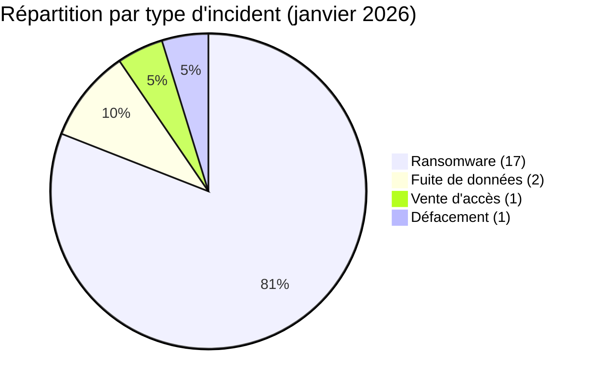
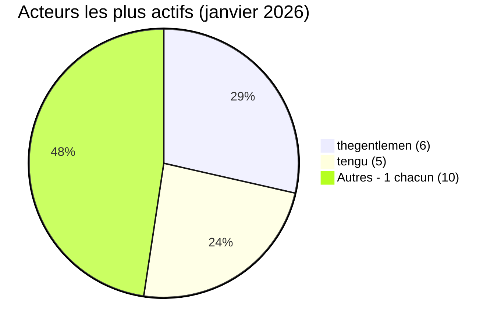
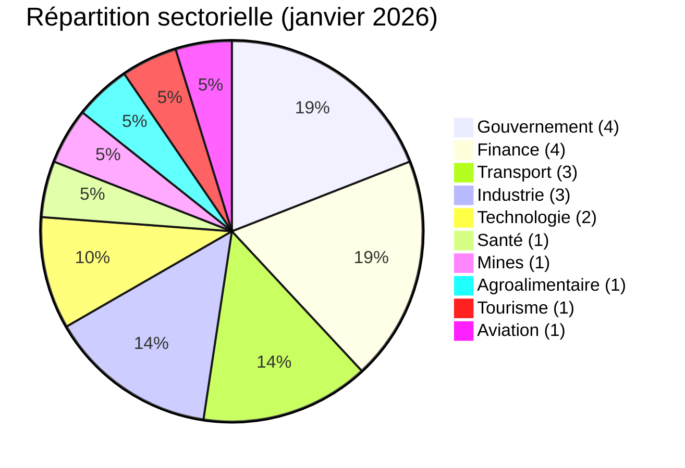

# Rapport CTI - Cyberattaques en Afrique (janvier 2026)

👉🏾 [**English version available here**](./README.md)

## 1. Synthèse exécutive

En janvier 2026, **21 incidents cyber** visant des entités africaines ont été publiquement revendiqués ou détectés. Le mois est dominé par les ransomwares, avec une présence transnationale notable de deux groupes, associée à deux fuites de données et un défacement gouvernemental coordonné. Points clés :

- **18 revendications ransomware/vente d'accès (85,7 %)**, **2 fuites de données (9,5 %)** et **1 défacement (4,8 %)**.
- **12 pays** touchés : **l'Afrique du Sud** (4 incidents) et le **Kenya** (4) sont les plus ciblés, suivis de l'**Égypte** (3).
- **12 acteurs distincts** : **thegentlemen** (6 incidents) et **tengu** (5) dominent avec une portée panafricaine combinée.
- Les secteurs gouvernemental, financier et des transports représentent la majorité des victimes.
- Incidents critiques : défacement coordonné de 7+ sites gouvernementaux nigériens (à caractère politique, non revendiqué), fuite de données PixPay Sénégal (paiement mobile), fuite de données AOM Aviation Maroc (base de données aviation), et l'acteur IAB Bigbrother vendant de manière répétée des accès à l'infrastructure gouvernementale togolaise.

### 📋 Liste des victimes

👉🏾 [Voir la liste complète des victimes](./victims_FR.md)

## 2. Méthodologie

- **Périmètre** : 54 pays africains.
- **Période** : 1-31 janvier 2026 (incidents divulgués ou revendiqués durant ce mois ; les dates réelles d'attaque peuvent être antérieures).
- **Sources** : Dark web, DLS (sites de fuite), OSINT, canaux Telegram, forums underground, rapports médias.
- **Inclusion** : Incidents revendiqués ou attribués publiquement, avec victime, pays et secteur identifiés.
- **Typologie** :
  - *Ransomware* : chiffrement + demande de rançon (revendication sur DLS).
  - *Fuite de données / intrusion* : exfiltration non chiffrée, base de données vendue ou publiée.
  - *Vente d'accès* : vente d'identifiants compromis ou d'accès à des systèmes par un Initial Access Broker (IAB).
  - *Défacement* : modification visuelle de sites web, souvent à des fins politiques ou idéologiques.

## 3. Vue d'ensemble

| Indicateur | Valeur |
|------------|--------|
| Total des victimes | 21 |
| Pays touchés | 12 |
| Acteurs distincts | 12 |
| Incidents ransomware | 17 (81,0 %) |
| Vente d'accès (IAB) | 1 (4,8 %) |
| Fuites de données | 2 (9,5 %) |
| Défacement | 1 (4,8 %) |

**Pays les plus ciblés :**
- 🇿🇦 Afrique du Sud : 4 victimes
- 🇰🇪 Kenya : 4 victimes
- 🇪🇬 Égypte : 3 victimes
- 🇲🇦 Maroc : 2 victimes
- 🇹🇬 Togo : 1 victime
- 🇳🇪 Niger : 1 victime (7+ sites gouvernementaux)
- 🇸🇳 Sénégal : 1 victime
- 🇲🇿 Mozambique : 1 victime
- 🇹🇿 Tanzanie : 1 victime
- 🇲🇺 Maurice : 1 victime
- 🇩🇿 Algérie : 1 victime
- 🇹🇳 Tunisie : 1 victime

**Type d'incident par pays :**
| Pays | Ransomware | Fuite de données | Vente d'accès | Défacement |
|------|:----------:|:----------------:|:-------------:|:----------:|
| Afrique du Sud | 4 | 0 | 0 | 0 |
| Kenya | 4 | 0 | 0 | 0 |
| Égypte | 3 | 0 | 0 | 0 |
| Maroc | 1 | 1 | 0 | 0 |
| Togo | 0 | 0 | 1 | 0 |
| Niger | 0 | 0 | 0 | 1 |
| Sénégal | 0 | 1 | 0 | 0 |
| Mozambique | 1 | 0 | 0 | 0 |
| Tanzanie | 1 | 0 | 0 | 0 |
| Maurice | 1 | 0 | 0 | 0 |
| Algérie | 1 | 0 | 0 | 0 |
| Tunisie | 1 | 0 | 0 | 0 |

**Acteurs les plus prolifiques :**
| Acteur | Type | Incidents | Pays ciblés |
|--------|------|:---------:|------------|
| thegentlemen | Ransomware | 6 | Égypte, Kenya, Maurice, Afrique du Sud |
| tengu | Ransomware | 5 | Algérie, Égypte, Kenya, Maroc, Tunisie |
| blackshrantac | Ransomware | 1 | Kenya |
| vect | Ransomware | 1 | Afrique du Sud |
| qilin | Ransomware | 1 | Mozambique |
| devman | Ransomware | 1 | Kenya |
| direwolf | Ransomware | 1 | Égypte |
| benzona | Ransomware | 1 | Tanzanie |
| skra1a | Courtier de données | 1 | Maroc |
| breach3d | Courtier de données | 1 | Sénégal |
| Bigbrother | Initial Access Broker | 1 | Togo |
| Non revendiqué | Défacement | 1 | Niger |

## 4. Vue d'ensemble pays par pays

> Tous les éléments présentés proviennent d'incidents revendiqués publiquement. Les revendications restent non confirmées sauf preuve indépendante.

### 🇿🇦 Afrique du Sud (4 incidents : 4 ransomwares)

L'Afrique du Sud enregistre quatre incidents ransomware en janvier, ciblant tous des organisations industrielles ou liées au gouvernement. L'acteur malveillant thegentlemen a revendiqué trois victimes le même jour, le 20 janvier : Paltrack, un éditeur de logiciels logistiques pour l'agroalimentaire ; Rola Motor Group, un réseau de concessions et distribution automobile ; et Witzenberg Municipality, une entité de gouvernement local du Cap-Occidental. La concentration de trois revendications en une seule journée suggère un ciblage coordonné sur des secteurs distincts. Une quatrième victime, Hytec South Africa, spécialisée dans l'ingénierie hydraulique et mécanique, a été revendiquée par l'acteur malveillant vect. Le gouvernement local et la chaîne d'approvisionnement industrielle représentent un profil d'exposition récurrent pour l'Afrique du Sud.

---

### 🇰🇪 Kenya (4 incidents : 4 ransomwares)

Le Kenya enregistre le score le plus élevé en janvier avec quatre revendications ransomware, toutes visant des institutions publiques ou parapubliques. L'acteur malveillant blackshrantac a revendiqué la National Water Authority le 8 janvier, service d'utilité critique responsable de la gestion des ressources en eau. Le 20 janvier, l'acteur malveillant thegentlemen a revendiqué CPF Financial Services, gestionnaire de fonds de retraite et de capitaux, tandis que l'acteur malveillant devman a revendiqué le NSSF, le fonds national de sécurité sociale, faisant du 20 janvier la journée la plus chargée du mois. L'acteur malveillant tengu a ensuite revendiqué NAMICO, la National Mining Corporation, le 26 janvier. La diversité des secteurs touchés, tous publics ou parapublics, reflète un ciblage délibéré des institutions liées au gouvernement kenyan.

---

### 🇪🇬 Égypte (3 incidents : 3 ransomwares)

L'Égypte enregistre trois revendications ransomware issues de trois acteurs distincts opérant dans des secteurs différents. L'acteur malveillant thegentlemen a revendiqué Real Tech, une société de technologie et de sécurité informatique, le 11 janvier. L'acteur malveillant direwolf a revendiqué Tepco-Group, un bureau d'ingénierie électrique, le 13 janvier. L'acteur malveillant tengu a revendiqué skyegtours.com, une plateforme de tourisme et de voyages, le 27 janvier. La dispersion des secteurs et des acteurs suggère un ciblage opportuniste plutôt qu'une campagne coordonnée spécifiquement contre l'Égypte.

---

### 🇲🇦 Maroc (2 incidents : 1 ransomware, 1 fuite de données)

Le Maroc est touché par deux types d'incidents distincts en janvier. L'acteur malveillant tengu a revendiqué Nafae Sanitaire, une entreprise de fournitures en construction et plomberie, le 17 janvier. L'acteur malveillant skra1a a publié une base de données aviation issue d'AOM Aviation Group (Air Ocean Maroc) le 31 janvier, exposant des données opérationnelles et de l'aviation civile sur le dark web. L'exposition des données du secteur aérien est notable compte tenu de la sensibilité des données opérationnelles et passagers.

---

### 🇹🇬 Togo (1 incident : vente d'accès)

L'acteur malveillant Bigbrother, opérant en tant qu'Initial Access Broker, a revendiqué de nouveaux accès à des plateformes gouvernementales togolaises le 3 janvier. Cela fait suite à une première revendication d'accès à l'infrastructure gouv.tg en septembre 2025. Le ciblage répété de la même entité gouvernementale par le même IAB indique un accès persistant et un risque d'escalade : un accès non vendu ou non corrigé peut être exploité pour des opérations ransomware, d'espionnage ou destructrices.

---

### 🇳🇪 Niger (1 incident : défacement)

Le 4 janvier, sept sites gouvernementaux nigériens ou plus ont été simultanément défacés, affichant un message à caractère politique identique. La nature coordonnée sur plusieurs domaines (ANSI, MAGEL, urbanisme, industrie, promotion de la femme) indique soit une vulnérabilité commune dans l'infrastructure d'hébergement partagé, soit une opération d'accès coordonnée. L'attaque n'a pas été revendiquée, ce qui est inhabituel pour les défacements hacktivistes, et pourrait suggérer un acteur à motivation politique évitant l'attribution.

---

### 🇸🇳 Sénégal (1 incident : fuite de données)

PixPay, une plateforme de paiement mobile sénégalaise, a vu sa base de données financières publiée par l'acteur malveillant breach3d le 16 janvier. L'exposition de données de paiement mobile crée des risques directs de fraude, de prise de contrôle de comptes et de phishing ciblé contre les utilisateurs.

---

### 🇲🇿 Mozambique (1 incident : ransomware)

CFM Mozambique, l'autorité nationale des chemins de fer et des ports, a été revendiquée par l'acteur malveillant Qilin le 16 janvier. Cibler des infrastructures de transport nationales fait peser des risques sur la logistique de la chaîne d'approvisionnement et les opérations portuaires.

---

### 🇹🇿 Tanzanie (1 incident : ransomware)

CCBRT, une ONG de santé fournissant des services de réhabilitation spécialisée, a été revendiquée par l'acteur malveillant benzona le 17 janvier. Les ONG de santé représentent une catégorie spécifique : budgets de cybersécurité limités, données patients sensibles, et communications partenaires et donateurs de valeur opérationnelle.

---

### 🇲🇺 Maurice (1 incident : ransomware)

Rogers Capital, prestataire de services financiers et technologiques, a été revendiquée par l'acteur malveillant thegentlemen le 14 janvier. Les prestataires de services financiers dans les économies insulaires servent souvent de hubs pour les flux de capitaux régionaux, ce qui augmente la sensibilité des données.

---

### 🇩🇿 Algérie (1 incident : ransomware)

Tahkout Group, important conglomérat industriel impliqué dans l'assemblage automobile et le transport, a été revendiqué par l'acteur malveillant tengu le 28 janvier. L'empreinte industrielle étendue du groupe amplifie l'impact potentiel de toute compromission opérationnelle.

---

### 🇹🇳 Tunisie (1 incident : ransomware)

FRUIT-BONTÉ, entreprise agroalimentaire et de transformation fruitière, a été revendiquée par l'acteur malveillant tengu le 27 janvier. Le secteur agroalimentaire en Afrique du Nord est de plus en plus ciblé, indiquant que les groupes ransomwares s'étendent au-delà des secteurs traditionnels.

---

## 5. Analyse détaillée par type d'incident

### 5.1 Ransomware et ventes d'accès (18 revendications)

| Pays | Attaques | Acteurs principaux |
|------|:--------:|-------------------|
| Afrique du Sud | 4 | thegentlemen (3), vect (1) |
| Kenya | 4 | thegentlemen, devman, blackshrantac, tengu |
| Égypte | 3 | thegentlemen, direwolf, tengu |
| Maroc | 1 | tengu |
| Mozambique | 1 | qilin |
| Tanzanie | 1 | benzona |
| Maurice | 1 | thegentlemen |
| Algérie | 1 | tengu |
| Tunisie | 1 | tengu |
| Togo | 1 | Bigbrother (IAB, vente d'accès) |

**Observations clés :**
- **thegentlemen** et **tengu** totalisent 11 des 21 incidents (52 %). Leur présence panafricaine simultanée en janvier suggère deux groupes prolifiques opérant indépendamment ou partageant des outils.
- Le 20 janvier a été la journée la plus active : 5 revendications en Afrique du Sud et au Kenya (Paltrack, Rola, Witzenberg, CPF, NSSF).
- **Bigbrother/Togo** illustre un schéma IAB : accès SSH vendu en septembre 2025, puis nouvel accès revendiqué en janvier 2026. La persistance de l'accès augmente le risque d'opérations à fort impact en aval.

### 5.2 Fuites de données (2 incidents)

| Victime | Acteur | Secteur | Données exposées |
|---------|--------|---------|-----------------|
| PixPay (Sénégal) | breach3d | FinTech / Paiement mobile | Base de données financières |
| AOM Aviation Group (Maroc) | skra1a | Transport aérien / Aviation civile | Base de données aviation |

### 5.3 Défacement (1 incident)

| Victime | Acteur | Secteur | Portée |
|---------|--------|---------|--------|
| Sites gouvernementaux nigériens (7+) | Non revendiqué | Administration publique | Coordonné, à motivation politique |

## 6. Impact sectoriel

| Secteur | Incidents | Pourcentage |
|---------|:---------:|:-----------:|
| Gouvernement / Administration publique | 4 | 19,0 % |
| Services financiers / FinTech | 4 | 19,0 % |
| Transport / Logistique | 3 | 14,3 % |
| Industrie / Ingénierie | 3 | 14,3 % |
| Technologie / Informatique | 2 | 9,5 % |
| Santé | 1 | 4,8 % |
| Mines | 1 | 4,8 % |
| Agroalimentaire | 1 | 4,8 % |
| Tourisme | 1 | 4,8 % |
| Aviation | 1 | 4,8 % |

**Enseignements :**
- Le gouvernement et les services financiers partagent la première place (4 incidents chacun), confirmant leur attractivité persistante comme cibles.
- La présence simultanée d'infrastructures critiques (eau, transport, ports, mines) indique que les groupes ransomwares ne se limitent plus aux cibles commerciales faciles.
- Les ONG de santé (CCBRT Tanzanie) représentent une catégorie sous-protégée.

## 7. Profil des acteurs de menaces

| Acteur | Type | Incidents | Cibles principales |
|--------|------|:---------:|-------------------|
| thegentlemen | Groupe ransomware | 6 | Égypte, Kenya, Maurice, Afrique du Sud |
| tengu | Groupe ransomware | 5 | Algérie, Égypte, Kenya, Maroc, Tunisie |
| blackshrantac | Ransomware | 1 | Kenya (services publics) |
| vect | Ransomware | 1 | Afrique du Sud (ingénierie) |
| qilin | Ransomware | 1 | Mozambique (infrastructure) |
| devman | Ransomware | 1 | Kenya (sécurité sociale) |
| direwolf | Ransomware | 1 | Égypte (ingénierie) |
| benzona | Ransomware | 1 | Tanzanie (ONG santé) |
| skra1a | Courtier de données | 1 | Maroc (aviation) |
| breach3d | Courtier de données | 1 | Sénégal (fintech) |
| Bigbrother | Initial Access Broker | 1 | Togo (gouvernement) |
| Non revendiqué | Défacement | 1 | Niger (gouvernement) |

**Acteurs émergents :** benzona, vect, direwolf (première apparition dans AFRINTEL).

### 7.1 Niveau de risque

| Pays | Niveau de risque |
|------|----------------|
| Afrique du Sud | 🔴 Élevé (4 ransomwares, industrie/gouvernement) |
| Kenya | 🔴 Élevé (4 ransomwares, institutions publiques critiques) |
| Égypte | 🟠 Moyen-Élevé (3 ransomwares, secteurs multiples) |
| Maroc | 🟠 Moyen (fuite de données + ransomware) |
| Togo | 🟠 Moyen (accès IAB persistant depuis septembre 2025) |
| Niger | 🟠 Moyen (défacement coordonné, attribution non résolue) |
| Autres | 🟡 Faible-Moyen |

## 8. Tendances clés et lacunes de renseignement

### Tendances

1. **Double dominance de thegentlemen et tengu** : 52 % des incidents de janvier sont attribués à deux groupes opérant simultanément dans 7 pays chacun. Leur expansion conjointe en Afrique de l'Est, du Nord et Australe en un seul mois constitue un schéma opérationnel notable.
2. **Vague sur le Kenya** : 4 incidents, tous ciblant des institutions publiques (eau, retraites, sécurité sociale, mines). Schéma cohérent avec un ciblage délibéré des infrastructures liées au gouvernement.
3. **Activité IAB sur le gouvernement togolais** : les revendications répétées de Bigbrother suggèrent un accès persistant non remédiué, augmentant le risque d'opérations de suivi à plus fort impact.
4. **Défacement gouvernemental coordonné au Niger** : non revendiqué, à motivation politique, touchant 7+ ministères simultanément. Exploite probablement des vulnérabilités CMS partagées ou une infrastructure d'hébergement commune.
5. **Émergence des fuites de données** : PixPay (paiement mobile) et AOM Aviation (aviation civile) indiquent que les courtiers en données s'étendent à de nouveaux secteurs.

### Lacunes

- La plupart des revendications ransomware restent non vérifiées ; aucune confirmation publique des victimes.
- Les attaquants du défacement nigérien restent non attribués.
- L'acheteur de l'accès Bigbrother et la nature de l'accès exploité sont inconnus.
- Les volumes réels de données dans les incidents de fuite n'ont pas été vérifiés de manière indépendante.

## 9. Cartographie MITRE ATT&CK (contextuelle)

| Incident | Techniques |
|----------|-----------|
| Défacement Niger | T1190 - Exploitation d'application web, T1491 - Défacement |
| Bigbrother/Togo | T1078 - Comptes valides, T1650 - Acquisition d'accès |
| PixPay | T1005 - Données du système local, T1041 - Exfiltration |
| AOM Aviation | T1005 - Données du système local, T1041 - Exfiltration |
| Ransomware général | T1486 - Chiffrement, T1490 - Inhibition de la récupération système |

**Techniques couramment observées :**
- T1566 - Phishing (vecteur initial probable pour la majorité des ransomwares)
- T1190 - Exploitation d'application web
- T1078 - Comptes valides (activité IAB Togo)
- T1486 - Ransomware (17 incidents)
- T1491 - Défacement (Niger)

## 10. Recommandations

### Pour les gouvernements et entreprises africains

- **Gestion des correctifs** : priorité aux applications web (CMS, portails gouvernementaux, plateformes financières).
- **Surveillance IAB** : toute revendication de vente d'accès à une infrastructure gouvernementale doit déclencher une rotation immédiate des identifiants et un audit forensique.
- **MFA obligatoire** : tous les comptes privilégiés et accès VPN doivent utiliser l'authentification multi-facteurs.
- **Réponse aux incidents** : établir des playbooks IR dédiés aux scénarios ransomware et défacement, incluant des protocoles de communication.
- **Risque tiers** : les logiciels logistiques (Paltrack), les plateformes aviation et les prestataires fintech doivent être inclus dans les évaluations de sécurité.

### Pour les analystes CTI

- Suivre **thegentlemen** et **tengu** pour de nouvelles campagnes africaines ; leur portée simultanée sur 12 pays en un mois indique une expansion active.
- Surveiller **Bigbrother** pour de nouvelles revendications d'accès au gouvernement togolais et l'activité des acheteurs potentiels.
- Surveiller les opérations de suivi liées au défacement nigérien (possible escalade après reconnaissance).
- Émettre une alerte si des données PixPay ou AOM apparaissent sur des marchés secondaires.

## 11. Recommandations SOC tactiques

### Priorités de détection

- Surveiller les **patterns de déploiement ransomware (T1486)** : événements de chiffrement de fichiers, suppression de copies shadow, modification rapide de fichiers
- Détecter l'**activité de staging IAB** : connexions VPN inhabituelles, activité en dehors des heures normales sur des comptes privilégiés, signaux de mouvement latéral
- Pister l'**exfiltration de données (T1041)** : transferts sortants volumineux, utilisation de services de stockage cloud, connexions vers des nœuds de sortie Tor
- Pour les portails gouvernementaux : surveiller les **journaux d'applications web** pour les tentatives d'exploitation (T1190)

### Sources de surveillance

- EDR / Sysmon
- Journaux firewall / proxy
- Journaux DNS
- Journaux de gestion des identités et des accès
- Pare-feu applicatif web (WAF)
- Journaux d'authentification VPN

## 12. Recommandations stratégiques

- Établir des **mécanismes de partage CTI régionaux** entre les gouvernements d'Afrique de l'Est (Kenya, Tanzanie, Mozambique) face à l'activité ransomware transfrontalière.
- Imposer des **standards de sécurité minimaux** pour les sites gouvernementaux en Afrique de l'Ouest (correctifs CMS, pare-feu applicatifs) suite au défacement massif nigérien.
- Créer des **listes de surveillance IAB nationales** : quand l'infrastructure gouvernementale d'un pays apparaît sur des forums criminels, un protocole de réponse structuré doit être prédéfini.
- Prioriser les **exigences de sécurité réglementaires FinTech** : les plateformes de paiement mobile détiennent des données financières à une échelle qui rend les fuites très dommageables.

## 13. Conclusion

Janvier 2026 ouvre l'année avec une vague ransomware large et géographiquement dispersée en Afrique. La domination de deux groupes (thegentlemen et tengu) sur 12 pays, la persistance de l'IAB Bigbrother contre l'infrastructure gouvernementale togolaise, et le défacement coordonné nigérien indiquent un paysage de menaces de plus en plus organisé et délibéré. L'Afrique du Sud et le Kenya restent les principales cibles, mais la diffusion en Afrique de l'Ouest, de l'Est, centrale et du Nord confirme qu'aucune sous-région africaine n'est hors de portée. AFRINTEL continuera de suivre ces acteurs et l'activité croissante des fuites de données au fil de l'année.

**AFRINTEL** - Cyber Threat Intelligence africaine
[GitHub AFRINTEL](https://github.com/Hatchepsoute/AFRINTEL)
