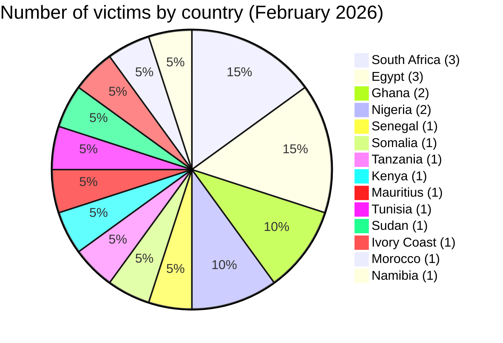
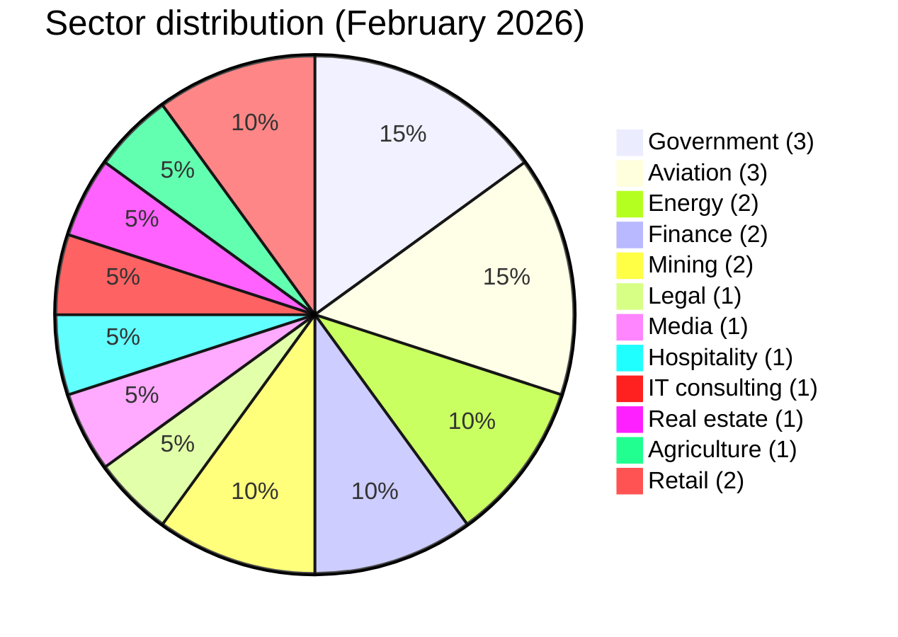

# CTI Report - Cyberattacks in Africa (February 2026)

👉🏾 [**French version available here**](./README_FR.md)

## 1. Executive summary

February 2026 recorded **20 cyber incidents** publicly claimed or detected across Africa, all attributed to ransomware or data extortion groups. The month is defined by one extraordinary event: the alleged 139 TB exfiltration from DAF SENEGAL (Directorate of General Administration and Equipment), by far the largest data breach claim recorded by AFRINTEL in 2026. Key findings:

- **20 ransomware / data extortion incidents (100%)**.
- **14 countries** affected; **South Africa** (3), **Egypt** (3), **Ghana** (2) and **Nigeria** (2) lead.
- **11 distinct threat actors**; **thegentlemen** (5 incidents) dominates, followed by **0APT** (3) and **LockBit 5.0** (3).
- Aviation sector under sustained pressure: BlueSky Somalia, Nile Air Egypt, Air Côte d'Ivoire all claimed in February.
- Noteworthy: 0APT, responsible for 3 large-volume claims (BlueSky 3.5 TB, Global Media Alliance 2.5 TB, Vertex Law 850 GB), subsequently disappeared from public leak sites. Claims remain unverified.

> **Note:** The Diesel-Electric South Africa claim (LockBit 5.0, February 27) may overlap with a separate LockBit 5.0 claim for the same victim in March 2026. Requires independent verification.

### 📋 Victim list

👉🏾 [View full victim list](./victims.md)

## 2. Methodology

- **Scope**: 54 African countries.
- **Period**: 1-28 February 2026 (incidents disclosed or claimed during this month; actual attack dates may be earlier).
- **Sources**: Dark web, DLS (leak sites), OSINT, Telegram channels, underground forums.
- **Inclusion**: Publicly claimed or attributed incidents with identified victim, country, sector.
- **Typology**: All incidents this month involve ransomware encryption, double extortion (encrypt + threaten to publish), or large-scale data exfiltration by criminal groups. No pure data broker activity identified.

## 3. Global overview

| Indicator                     | Value |
|-------------------------------|-------|
| Total victims                 | 20    |
| Countries affected            | 14    |
| Distinct actors               | 11    |
| Ransomware / data extortion   | 20 (100%) |

**Most targeted countries:**
- 🇿🇦 South Africa: 3 victims
- 🇪🇬 Egypt: 3 victims
- 🇬🇭 Ghana: 2 victims
- 🇳🇬 Nigeria: 2 victims
- 🇸🇳 Senegal: 1 victim
- 🇸🇴 Somalia: 1 victim
- 🇹🇿 Tanzania: 1 victim
- 🇰🇪 Kenya: 1 victim
- 🇲🇺 Mauritius: 1 victim
- 🇹🇳 Tunisia: 1 victim
- 🇸🇩 Sudan: 1 victim
- 🇨🇮 Ivory Coast: 1 victim
- 🇲🇦 Morocco: 1 victim
- 🇳🇦 Namibia: 1 victim

**Top 3 largest claimed breaches:**
| Rank | Victim | Actor | Volume |
|:---:|--------|-------|-------:|
| 1 | 🇸🇳 DAF SENEGAL | The Green Blood Group | 139 TB |
| 2 | 🇸🇴 BlueSky Aviation (Somalia) | 0APT | 3.5 TB |
| 3 | 🇬🇭 Global Media Alliance (Ghana) | 0APT | 2.5 TB |

**Most prolific actors:**
| Actor | Incidents | Countries |
|-------|:---------:|----------|
| thegentlemen | 5 | Kenya, Ghana, Egypt, South Africa, Tunisia |
| 0APT | 3 | Somalia, Ghana, Tanzania |
| LockBit 5.0 | 3 | Mauritius, Egypt, South Africa |
| incransom | 2 | Nigeria, Ivory Coast |
| vect | 1 | South Africa |
| tengu | 1 | Morocco |
| payload | 1 | Egypt |
| apt73/bashe | 1 | Sudan |
| qilin | 1 | Namibia |
| killsec | 1 | Nigeria |
| The Green Blood Group | 1 | Senegal |

## 4. Country-by-country overview

> All entries cover publicly claimed incidents only. Claims remain unverified unless independently confirmed.

### 🇸🇳 Senegal (1 incident - Critical)

DAF Senegal (Direction de l'Administration Générale et de l'Équipement), a central government administrative body, is the most critical claim of the month. The threat actor The Green Blood Group claims 139 TB of exfiltrated data including citizen databases and biometric records. If even partially authentic, this would represent one of the largest government data exposures in African history. Biometric record exposure creates irreversible risks: unlike passwords, biometric identifiers cannot be changed. Potential consequences include identity fraud at national scale, tampering with government service delivery, and exploitation of citizen identity infrastructure.

---

### 🇸🇴 Somalia (1 incident)

BlueSky Aviation (bluesky-air.com), a Somali aviation services company, was claimed by the threat actor 0APT with 3.5 TB of alleged exfiltration. This is one of three large-volume claims made by the threat actor 0APT in February before the group disappeared from public data leak sites. The claim remains unverified. Aviation sector exposure risks include operational data, passenger records, and flight logistics information.

---

### 🇬🇭 Ghana (2 incidents)

Global Media Alliance (gmaworld.com), an integrated media and communications company, was claimed by the threat actor 0APT with 2.5 TB of alleged data. Its exposure would risk advertiser contracts, editorial content, and personnel data. Ghana Bauxite Company (ghanabauxite.com), a state-linked mining enterprise, was claimed by the threat actor thegentlemen. Its targeting reflects the group's emerging interest in African extractive industries alongside its traditional multi-sector approach.

---

### 🇹🇿 Tanzania (1 incident)

Vertex Law Chambers (vertexlaw.co.tz), a law firm, was claimed by the threat actor 0APT with 850 GB of alleged exfiltration. A law firm breach creates particularly high sensitivity: client files, privileged communications, court records, and business contracts are all potentially exposed.

---

### 🇰🇪 Kenya (1 incident)

Wells Fargo Kenya (fargo.co.ke), a local security and financial logistics provider, was claimed by the threat actor thegentlemen. Financial and security logistics data exposure creates risks of physical security compromise and financial fraud.

---

### 🇳🇬 Nigeria (2 incidents)

Getly (getly.app), a fintech application, was claimed by the threat actor killsec on February 9. Mobile fintech breaches directly expose users' financial accounts and transaction histories. Midwestern Oil and Gas (midwesternog.com), an upstream oil and gas company, was claimed by the threat actor incransom on February 12. Critical energy sector targeting in Nigeria mirrors a broader trend observed across February with aviation, energy, and mining all affected.

---

### 🇪🇬 Egypt (3 incidents)

Egypt records three distinct ransomware groups in February. Nile Air (nileair.com), a private airline at Cairo International Airport, was claimed by the threat actor thegentlemen on February 13. SODIC (sodic.com), one of Egypt's leading real estate developers, was claimed by the threat actor payload on February 17. The Ministry of Agriculture (moa.gov.eg), responsible for food security and land management, was claimed by the threat actor LockBit 5.0 on February 20. The simultaneous targeting by three different groups across aviation, real estate, and government illustrates Egypt's sustained exposure.

---

### 🇲🇺 Mauritius (1 incident)

Sands Suites (sands.mu), a luxury resort, was claimed by the threat actor LockBit 5.0 on February 14. Hospitality sector breaches typically expose guest personal data, payment information, and loyalty program records.

---

### 🇿🇦 South Africa (3 incidents)

Intsika Yethu Municipality (intsikayethu.gov.za), a local municipality in the Eastern Cape, was claimed by the threat actor thegentlemen on February 15. Municipal data breaches risk exposing citizen service records, infrastructure details, and staff data. EnerTec (enertec.co.za), an energy solutions and battery distribution company, was claimed by the threat actor vect on February 24, with 151.79 GB of data alleged. Diesel-Electric (diesel-electric.co.za), a major automotive components distributor, was claimed by the threat actor LockBit 5.0 on February 27. A possible re-publication of this same victim appeared under LockBit 5.0 in March 2026, requiring verification.

---

### 🇹🇳 Tunisia (1 incident)

BITS (bits.com.tn), an IT services and consulting firm, was claimed by the threat actor thegentlemen on February 15. IT consulting firms hold client infrastructure documentation and access credentials, creating high secondary breach risk.

---

### 🇸🇩 Sudan (1 incident)

Amtaar Investment (amtaar.com), a major agricultural investment firm managing 6,000 hectares of irrigated land with a key role in national food security, was claimed by the threat actor apt73/bashe on February 18, with 3.5 GB of data partially published. This is the only February incident with confirmed partial data publication. Sudan's conflict context amplifies the potential strategic impact of agricultural sector data exposure.

---

### 🇨🇮 Ivory Coast (1 incident)

Air Côte d'Ivoire (aircotedivoire.com), the national airline, was claimed by the threat actor incransom on February 19. Combined with BlueSky Somalia and Nile Air Egypt, February 2026 becomes the month with the most African airline ransomware claims recorded in AFRINTEL.

---

### 🇲🇦 Morocco (1 incident)

Shora Advisory (shora.ma), an accounting and financial advisory firm, was claimed by the threat actor tengu on February 20. Financial advisory firms hold sensitive business financial records, tax data, and corporate strategy documents.

---

### 🇳🇦 Namibia (1 incident)

CYMOT (cymot.com), a Namibian retailer of automotive spares, tools, and equipment, was claimed by the threat actor Qilin on February 22.

---

## 5. Detailed analysis by incident type

### 5.1 Ransomware and data extortion (20 incidents)

| Country | Incidents | Main actors |
|---------|:---------:|-------------|
| South Africa | 3 | thegentlemen, vect, LockBit 5.0 |
| Egypt | 3 | thegentlemen, payload, LockBit 5.0 |
| Ghana | 2 | 0APT, thegentlemen |
| Nigeria | 2 | killsec, incransom |
| Senegal | 1 | The Green Blood Group (139 TB) |
| Somalia | 1 | 0APT (3.5 TB) |
| Tanzania | 1 | 0APT (850 GB) |
| Kenya | 1 | thegentlemen |
| Mauritius | 1 | LockBit 5.0 |
| Tunisia | 1 | thegentlemen |
| Sudan | 1 | apt73/bashe (3.5 GB leaked) |
| Ivory Coast | 1 | incransom |
| Morocco | 1 | tengu |
| Namibia | 1 | qilin |

**Key observations:**
- **0APT** emerged as a new prolific actor in early February (3 claims in 5 days) then disappeared from public DLS. The authenticity of TB-scale claims remains unverified.
- **Aviation sector**: 3 airlines claimed (BlueSky Somalia, Nile Air Egypt, Air Côte d'Ivoire) by 3 different actors. Likely independent opportunistic targeting.
- **thegentlemen** continues its January 2026 pattern with 5 new claims in 4 countries.
- **LockBit 5.0** claims 3 victims, confirming its operational continuity under the LockBit 5.x branding.

## 6. Sectoral impact

| Sector | Incidents | Percentage |
|--------|:---------:|:----------:|
| Government / Administration | 3 | 15.0% |
| Airlines / Aviation | 3 | 15.0% |
| Energy | 2 | 10.0% |
| Finance / Banking / FinTech | 2 | 10.0% |
| Mining / Extractive | 2 | 10.0% |
| Legal | 1 | 5.0% |
| Media | 1 | 5.0% |
| Hospitality | 1 | 5.0% |
| IT consulting | 1 | 5.0% |
| Real estate | 1 | 5.0% |
| Agriculture | 1 | 5.0% |
| Retail | 1 | 5.0% |
| Accounting | 1 | 5.0% |

**Takeaways:**
- Government, aviation, and energy form the critical infrastructure cluster (8 incidents, 40%).
- Aviation's concentration (3 airlines in one month) is unprecedented in AFRINTEL records.
- The DAF Senegal breach (government biometric data) represents a potential Level 4 impact scenario if confirmed.

## 7. Threat actor profile

| Actor | Type | Incidents | Primary targets |
|-------|------|:---------:|-----------------|
| thegentlemen | Ransomware group | 5 | Cross-sector, 4 countries |
| 0APT | Unknown (disappeared) | 3 | Aviation, media, legal |
| LockBit 5.0 | Ransomware | 3 | Hospitality, government, automotive |
| incransom | Ransomware | 2 | Energy, aviation |
| The Green Blood Group | Ransomware / extortion | 1 | Senegal (government) |
| apt73/bashe | Ransomware | 1 | Sudan (agriculture) |
| vect | Ransomware | 1 | South Africa (energy) |
| tengu | Ransomware | 1 | Morocco (accounting) |
| payload | Ransomware | 1 | Egypt (real estate) |
| killsec | Ransomware | 1 | Nigeria (fintech) |
| qilin | Ransomware | 1 | Namibia (retail) |

**Actor notes:**
- **0APT**: Large TB-scale claims with no published evidence. Disappeared after February. Low confidence until verified.
- **The Green Blood Group**: First AFRINTEL appearance. 139 TB government claim, unverified.
- **LockBit 5.0**: Third consecutive month of African activity.

### 7.1 Risk assessment

| Country | Risk level |
|---------|-----------|
| Senegal | 🔴 Critical (139 TB government + biometric - unverified) |
| South Africa | 🔴 High (3 incidents: government, energy, automotive) |
| Egypt | 🔴 High (3 incidents including government ministry) |
| Sudan | 🟠 Medium-High (partial data confirmed, critical agriculture sector) |
| Somalia | 🟠 Medium (claim unverified, aviation sector) |
| Nigeria | 🟠 Medium (fintech + oil sector) |
| Others | 🟡 Low-Medium |

## 8. Key trends and intelligence gaps

### Trends

1. **DAF Senegal - potential record breach**: 139 TB including biometric data is an extraordinary claim. If confirmed, it marks a significant escalation in attacks against West African governments.
2. **Aviation sector under attack**: Three airlines claimed in one month across three countries and three actors. Independent opportunistic targeting rather than a coordinated campaign.
3. **0APT emergence and disappearance**: Three high-volume claims in 5 days then silence. Either the group went underground, claims were fabricated, or an established actor tested a new persona.
4. **thegentlemen maintains pace**: Five incidents in February following six in January confirms consistent pan-African operational tempo.
5. **LockBit 5.0 persistence**: Three claims confirm continued African targeting.

### Gaps

- DAF Senegal 139 TB claim not independently verified. No victim statement or external confirmation.
- 0APT's true identity, tooling, and infrastructure are unknown.
- Diesel-Electric South Africa: potential overlap between February and March 2026 LockBit 5.0 claims requires clarification.
- The Green Blood Group's prior activity and technical capabilities are not documented.

## 9. MITRE ATT&CK mapping (contextual)

| Incident | Techniques |
|----------|-----------|
| DAF Senegal | T1486 - Ransomware, T1041 - Exfiltration, T1005 - Data from Local System |
| 0APT clusters | T1041 - Exfiltration, T1486 - Ransomware (assumed) |
| Amtaar Sudan | T1486 - Ransomware, T1041 - Exfiltration (partial publish confirmed) |
| thegentlemen (general) | T1486 - Ransomware, T1566 - Phishing (likely initial vector) |

**Common techniques observed:**
- T1566 - Phishing (assumed primary initial vector)
- T1190 - Exploit Public-Facing Application
- T1486 - Ransomware (20 incidents)
- T1041 - Exfiltration (DAF Senegal, Amtaar Sudan, 0APT clusters)

## 10. Recommendations

### For African governments and enterprises

- **Biometric data protection**: Organizations holding national biometric databases must treat these as highest-sensitivity assets requiring offline backups, strict access controls, and real-time anomaly detection on outbound data flows.
- **Volume-based exfiltration detection**: Implement outbound transfer thresholds; 139 TB cannot leave a network undetected with proper monitoring in place.
- **Aviation sector hardening**: Airport and airline OT systems must be segmented from IT networks; ransomware affecting reservation systems risks direct operational disruption.
- **Ransomware IR playbooks**: Government ministries must maintain tested incident response plans with verified offline backups.

### For CTI analysts

- Track **The Green Blood Group** for additional claims or evidence publication.
- Monitor **0APT** for reappearance under the same or alternative aliases.
- Verify the **Diesel-Electric** double-claim (February + March) against victim communications.
- Watch **apt73/bashe** expanding into East/Central Africa (Sudan is first AFRINTEL appearance for this region).

## 11. SOC tactical recommendations

### Detection priorities

- **Large-scale exfiltration detection (T1041)**: Alert on outbound transfers exceeding 10 GB in 24 hours from non-backup systems
- **Ransomware deployment (T1486)**: Monitor mass file modification events, VSS deletion, and encryption process signatures
- **Lateral movement pre-encryption**: Detect abnormal admin account usage, RDP chain movements, PsExec or similar tool usage
- **Aviation and OT monitoring**: Segregate reservation and operational systems; detect unauthorized cross-segment connections

### Monitoring sources

- EDR / Sysmon
- DLP (Data Loss Prevention): outbound volume alerts
- Network flow analysis (NetFlow/IPFIX)
- Firewall / Proxy logs
- Identity and access management logs

## 12. Strategic recommendations

- West African governments must establish **minimum IT security requirements for government administration systems**, following the DAF Senegal claim.
- Create **cross-border aviation sector information sharing** between North African, West African, and East African CERT teams.
- Develop **national biometric data protection frameworks** with specific security controls for government databases holding fingerprints, facial recognition data, and identity records.
- **Critical infrastructure registries** should mandate cybersecurity incident reporting timelines for faster regional situational awareness.

## 13. Conclusion

February 2026 is marked above all by the scale and sensitivity of the DAF Senegal claim: if confirmed, 139 TB of citizen and biometric data would constitute one of the most significant government breaches in Africa's cyber history. Beyond this single case, the month demonstrates a broad threat landscape: 14 countries, 11 actors, and a particularly intense focus on aviation, energy, and critical government entities. thegentlemen, LockBit 5.0, and 0APT (briefly) all maintain high operational pace. AFRINTEL continues monitoring all active groups and will update assessments as verification progresses.

**AFRINTEL** - African Cyber Threat Intelligence
[GitHub AFRINTEL](https://github.com/Hatchepsoute/AFRINTEL)
