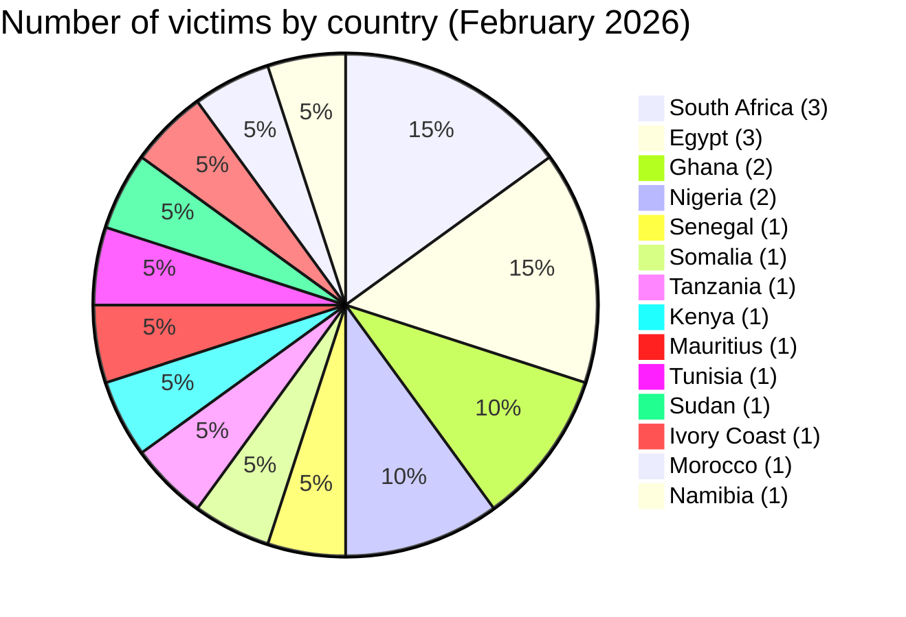
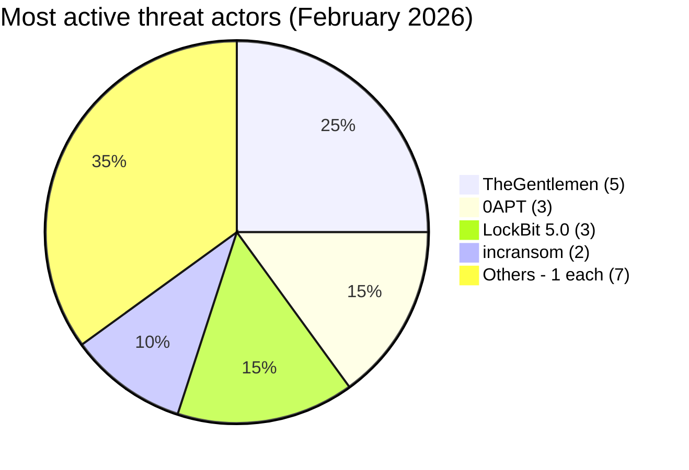
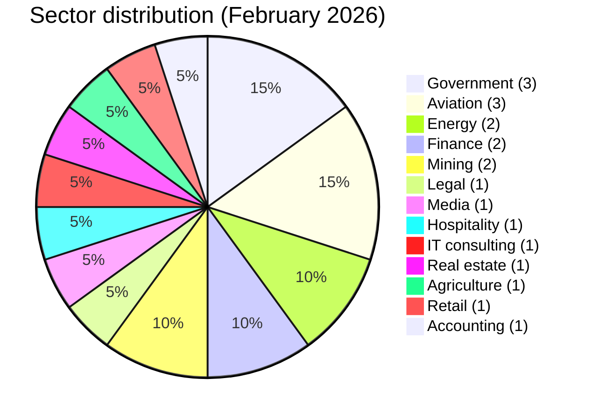

# CTI Report - Cyberattacks in Africa (February 2026)

👉🏾 [**French version available here**](./README_FR.md)

## 1. Executive summary

February 2026 brought **20 cyber incidents** across **14 African countries**, every one of them tied to ransomware or data extortion. The event that stands out is the publication of sensitive **DAF Senegal** data, citizen and biometric records AFRINTEL was able to review. The actor claims **139 TB**; that figure couldn't be measured from what was actually accessible. Key findings:

- **20 ransomware / data extortion incidents (100%)**.
- **14 countries** affected; **South Africa** (3), **Egypt** (3), **Ghana** (2) and **Nigeria** (2) lead.
- **11 distinct threat actors**; **TheGentlemen** (5 incidents) dominates, followed by **0APT** (3) and **LockBit 5.0** (3).
- Aviation sector under sustained pressure: BlueSky Somalia, Nile Air Egypt, Air Côte d'Ivoire all claimed in February.
- Noteworthy: 0APT, responsible for 3 large-volume claims (BlueSky 3.5 TB, Global Media Alliance 2.5 TB, Vertex Law 850 GB), subsequently disappeared from public leak sites.

> **Note:** The Diesel-Electric South Africa claim (LockBit 5.0, February 27) may overlap with a separate LockBit 5.0 claim for the same victim in March 2026. Requires independent verification.

### 📋 Victim list

👉🏾 [View full victim list](./victims.md)

## 2. Methodology

- **Scope**: 54 African countries.
- **Period**: 1-28 February 2026 (incidents disclosed or claimed during this month; actual attack dates may be earlier).
- **Sources**: Dark web, DLS (leak sites), OSINT, Telegram channels, underground forums.
- **Inclusion**: Publicly claimed or attributed incidents with identified victim, country, sector.
- **Typology**: All incidents this month were attributed to ransomware or data-extortion groups. Encryption, operational disruption and initial access are not presumed when the source only documents a victim listing or an exfiltration claim. No standalone data-broker activity was identified.

## 3. Global overview

| Indicator                     | Value |
|-------------------------------|-------|
| Total victims                 | 20    |
| Countries affected            | 14    |
| Distinct actors               | 11    |
| Ransomware / data extortion   | 20 (100%) |

**Most targeted countries:**
- 🇿🇦 South Africa: 3 victims
- 🇪🇬 Egypt: 3 victims
- 🇬🇭 Ghana: 2 victims
- 🇳🇬 Nigeria: 2 victims
- 🇸🇳 Senegal: 1 victim
- 🇸🇴 Somalia: 1 victim
- 🇹🇿 Tanzania: 1 victim
- 🇰🇪 Kenya: 1 victim
- 🇲🇺 Mauritius: 1 victim
- 🇹🇳 Tunisia: 1 victim
- 🇸🇩 Sudan: 1 victim
- 🇨🇮 Ivory Coast: 1 victim
- 🇲🇦 Morocco: 1 victim
- 🇳🇦 Namibia: 1 victim

**Top 3 largest claimed breaches:**
| Rank | Victim | Actor | Volume |
|:---:|--------|-------|-------:|
| 1 | 🇸🇳 DAF SENEGAL | The Green Blood Group | 139 TB |
| 2 | 🇸🇴 BlueSky Aviation (Somalia) | 0APT | 3.5 TB |
| 3 | 🇬🇭 Global Media Alliance (Ghana) | 0APT | 2.5 TB |

**Most prolific actors:**
| Actor | Incidents | Countries |
|-------|:---------:|----------|
| TheGentlemen | 5 | Kenya, Ghana, Egypt, South Africa, Tunisia |
| 0APT | 3 | Somalia, Ghana, Tanzania |
| LockBit 5.0 | 3 | Mauritius, Egypt, South Africa |
| incransom | 2 | Nigeria, Ivory Coast |
| vect | 1 | South Africa |
| tengu | 1 | Morocco |
| payload | 1 | Egypt |
| apt73/bashe | 1 | Sudan |
| qilin | 1 | Namibia |
| killsec | 1 | Nigeria |
| The Green Blood Group | 1 | Senegal |

## 4. Geographic summary

> **For details of each incident, see [`victims.md`](./victims.md).**

- **Distribution:** 20 incidents spread across 14 countries. South Africa and Egypt at 3 each, Ghana and Nigeria at 2 each.
- **Actor activity:** TheGentlemen led with 5 incidents, 0APT and LockBit 5.0 followed with 3 apiece.
- **Sector signal:** BlueSky Aviation, Nile Air and Air Côte d'Ivoire, three airlines, three countries, sustained pressure on the aviation sector this month.
- **High-volume claims:** the 139 TB attributed to DAF Senegal and the three 0APT claims are the numbers that jump out, but none of the claimed volumes or compromise details have been independently confirmed.

---

## 5. Detailed analysis by incident type

### 5.1 Ransomware and data extortion (20 incidents)

| Country | Incidents | Main actors |
|---------|:---------:|-------------|
| South Africa | 3 | TheGentlemen, vect, LockBit 5.0 |
| Egypt | 3 | TheGentlemen, payload, LockBit 5.0 |
| Ghana | 2 | 0APT, TheGentlemen |
| Nigeria | 2 | killsec, incransom |
| Senegal | 1 | The Green Blood Group (139 TB) |
| Somalia | 1 | 0APT (3.5 TB) |
| Tanzania | 1 | 0APT (850 GB) |
| Kenya | 1 | TheGentlemen |
| Mauritius | 1 | LockBit 5.0 |
| Tunisia | 1 | TheGentlemen |
| Sudan | 1 | apt73/bashe (3.5 GB leaked) |
| Ivory Coast | 1 | incransom |
| Morocco | 1 | tengu |
| Namibia | 1 | qilin |

**Key observations:**
- **0APT** came out of nowhere in early February, 3 claims in 5 days, then went quiet on public leak sites for the rest of the month.
- **Aviation**: 3 airlines claimed (BlueSky Somalia, Nile Air Egypt, Air Côte d'Ivoire), 3 different actors. Reads more like independent opportunism than a coordinated push.
- **TheGentlemen** shows up 5 times this month, across 5 countries.
- **LockBit 5.0** published 3 victims under the 5.x branding.

## 6. Sectoral impact

| Sector | Incidents | Percentage |
|--------|:---------:|:----------:|
| Government / Administration | 3 | 15.0% |
| Airlines / Aviation | 3 | 15.0% |
| Energy | 2 | 10.0% |
| Finance / Banking / FinTech | 2 | 10.0% |
| Mining / Extractive | 2 | 10.0% |
| Legal | 1 | 5.0% |
| Media | 1 | 5.0% |
| Hospitality | 1 | 5.0% |
| IT consulting | 1 | 5.0% |
| Real estate | 1 | 5.0% |
| Agriculture | 1 | 5.0% |
| Retail | 1 | 5.0% |
| Accounting | 1 | 5.0% |

**Takeaways:**
- Government, aviation and energy together make up a critical-infrastructure cluster, 8 incidents, 40% of the month.
- Three aviation organizations went public this month, each claimed by a different actor.
- DAF Senegal, government and biometric data both, clears the bar for AFRINTEL's Level 4 impact rating.

## 7. Threat actor profile

| Actor | Type | Incidents | Primary targets |
|-------|------|:---------:|-----------------|
| TheGentlemen | Ransomware group | 5 | Cross-sector, 5 countries |
| 0APT | Unknown (disappeared) | 3 | Aviation, media, legal |
| LockBit 5.0 | Ransomware | 3 | Hospitality, government, automotive |
| incransom | Ransomware | 2 | Energy, aviation |
| The Green Blood Group | Ransomware / extortion | 1 | Senegal (government) |
| apt73/bashe | Ransomware | 1 | Sudan (agriculture) |
| vect | Ransomware | 1 | South Africa (energy) |
| tengu | Ransomware | 1 | Morocco (accounting) |
| payload | Ransomware | 1 | Egypt (real estate) |
| killsec | Ransomware | 1 | Nigeria (fintech) |
| qilin | Ransomware | 1 | Namibia (retail) |

**Actor notes:**
- **0APT**: Large TB-scale claims with no published evidence. Disappeared after February. Low confidence until verified.
- **The Green Blood Group**: First AFRINTEL appearance. 139 TB government claim.
- **LockBit 5.0**: Third consecutive month of African activity.

### 7.1 Risk assessment

| Country | Risk level |
|---------|-----------|
| Senegal | 🔴 Critical (139 TB government + biometric) |
| South Africa | 🔴 High (3 incidents: government, energy, automotive) |
| Egypt | 🔴 High (3 incidents including government ministry) |
| Sudan | 🟠 Medium-High (partial data confirmed, critical agriculture sector) |
| Somalia | 🟠 Medium (aviation sector) |
| Nigeria | 🟠 Medium (fintech + oil sector) |
| Others | 🟡 Low-Medium |

## 8. Key trends and intelligence gaps

### Trends

1. **DAF Senegal could be a record-breaking breach.** 139 TB including biometric data is an extraordinary number to claim. If it holds up, that's a real escalation against West African governments.
2. **Aviation took a hit.** Three airlines, three countries, three actors, in one month. Looks like independent opportunism rather than anyone running a coordinated campaign against the sector.
3. **0APT burned bright and went dark.** Three high-volume claims in five days, then nothing more on public leak sites for the rest of the month.
4. **TheGentlemen isn't slowing down.** Five incidents in February on the heels of six in January, a steady pan-African tempo.
5. **LockBit 5.0 keeps showing up.** Three claims this month, African targeting hasn't let up.

### Gaps

- 0APT's true identity, tooling, and infrastructure are unknown.
- Diesel-Electric South Africa: potential overlap between February and March 2026 LockBit 5.0 claims requires clarification.
- The Green Blood Group's prior activity and technical capabilities are not documented.

## 9. MITRE ATT&CK mapping (contextual)

| Phase | Technique | Analytical scope |
| :--- | :--- | :--- |
| Initial access | T1566 - Phishing | Defensive detection hypothesis, not observed from the claims alone |
| Initial access | T1190 - Exploit Public-Facing Application | Defensive detection hypothesis, not observed from the claims alone |
| Account access | T1078 - Valid Accounts | Relevant to access or credential sales, without confirming use of the accounts |
| Collection | T1005 - Data from Local System | Contextual hypothesis when internal data is published; the collection mechanism remains unknown |
| Impact | T1486 - Data Encrypted for Impact | Relevant to ransomware preparedness, without confirming encryption for every entry |

> These techniques are defensive hypotheses. A claim, data sale or leak-site publication is not sufficient to treat them as observed.

## 10. Recommendations

### For African governments and enterprises

- **Biometric data protection**: Organizations holding national biometric databases must treat these as highest-sensitivity assets requiring offline backups, strict access controls, and real-time anomaly detection on outbound data flows.
- **Volume-based exfiltration detection**: Implement baselines and alerts for unusual sustained outbound transfers from systems holding sensitive data.
- **Aviation sector hardening**: Airport and airline OT systems must be segmented from IT networks; ransomware affecting reservation systems risks direct operational disruption.
- **Ransomware IR playbooks**: Government ministries must maintain tested incident response plans with verified offline backups.

### For CTI analysts

- Track **The Green Blood Group** for additional claims or evidence publication.
- Monitor **0APT** for reappearance under the same or alternative aliases.
- Verify the **Diesel-Electric** double-claim (February + March) against victim communications.
- Track additional **apt73/bashe** publications affecting Sudan and neighbouring regions.

## 11. SOC tactical recommendations

### Detection priorities

- **Large-scale exfiltration detection (T1041)**: Alert on outbound transfers exceeding 10 GB in 24 hours from non-backup systems
- **Ransomware deployment (T1486)**: Monitor mass file modification events, VSS deletion, and encryption process signatures
- **Lateral movement pre-encryption**: Detect abnormal admin account usage, RDP chain movements, PsExec or similar tool usage
- **Aviation and OT monitoring**: Segregate reservation and operational systems; detect unauthorized cross-segment connections

### Monitoring sources

- EDR / Sysmon
- DLP (Data Loss Prevention): outbound volume alerts
- Network flow analysis (NetFlow/IPFIX)
- Firewall / Proxy logs
- Identity and access management logs

## 12. Strategic recommendations

- West African governments must establish **minimum IT security requirements for government administration systems**, following the DAF Senegal claim.
- Create **cross-border aviation sector information sharing** between North African, West African, and East African CERT teams.
- Develop **national biometric data protection frameworks** with specific security controls for government databases holding fingerprints, facial recognition data, and identity records.
- **Critical infrastructure registries** should mandate cybersecurity incident reporting timelines for faster regional situational awareness.

## 13. Conclusion

February closed with 20 ransomware or data-extortion publications across 14 countries and 11 actors. DAF Senegal is the case that matters most, citizen and biometric information, a claimed 139 TB. Aviation took three of the month's records, and government, energy and finance kept turning up too. TheGentlemen published five victims; 0APT and LockBit 5.0 published three each.

**AFRINTEL** - African Cyber Threat Intelligence
[GitHub AFRINTEL](https://github.com/Hatchepsoute/AFRINTEL)
