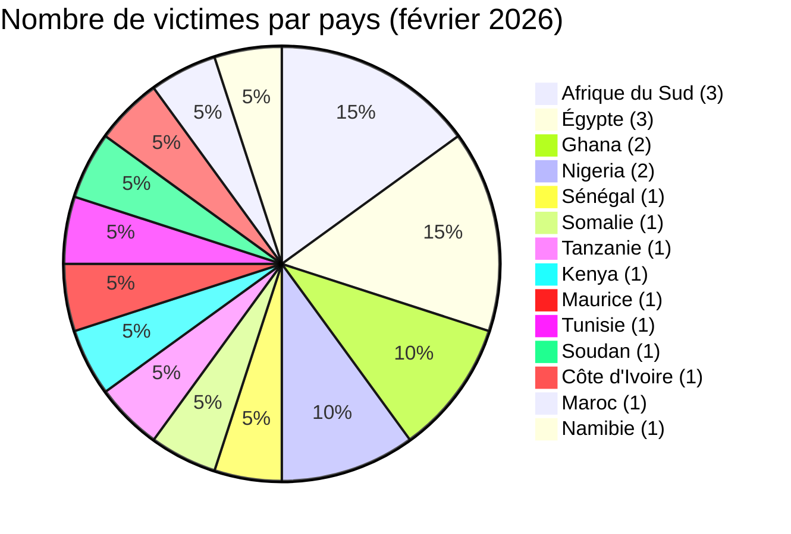
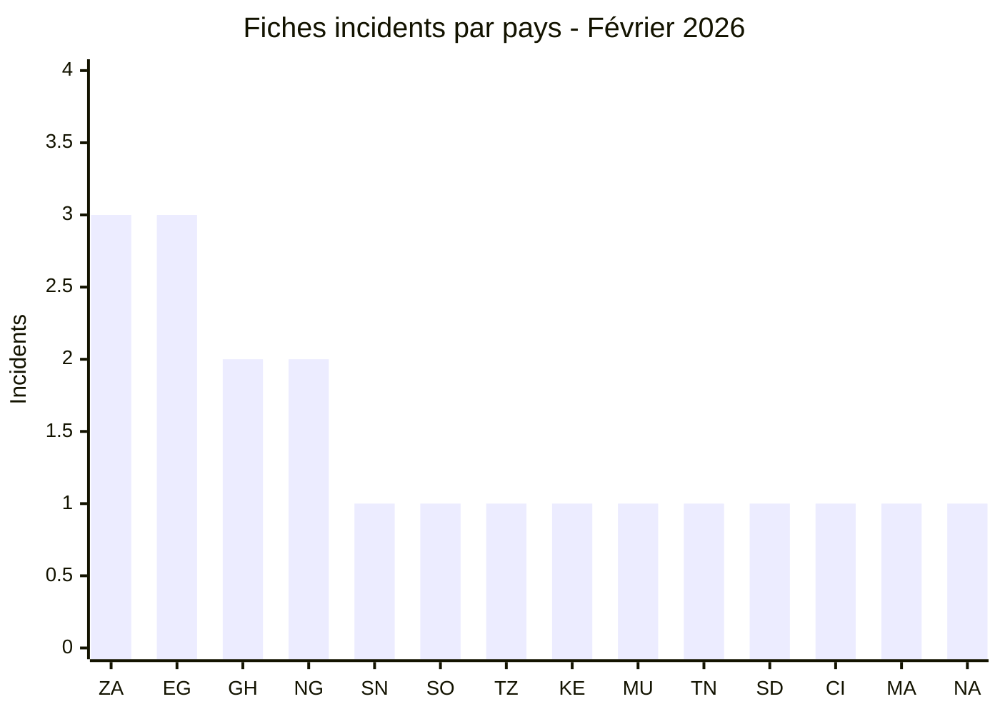
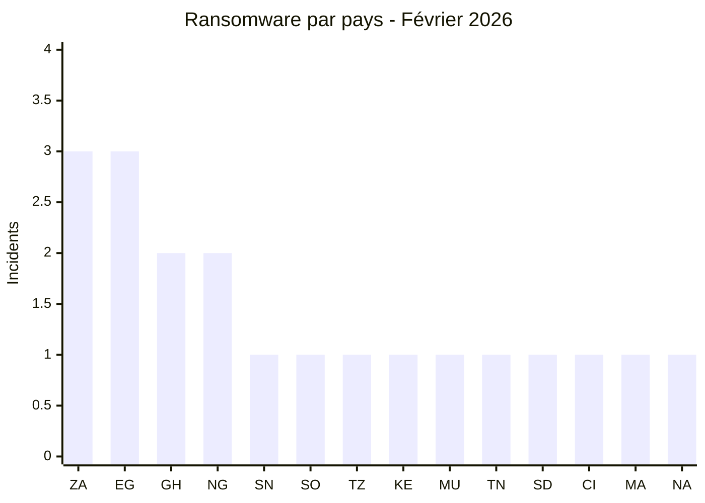
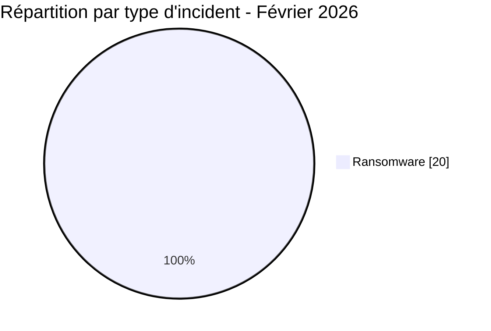
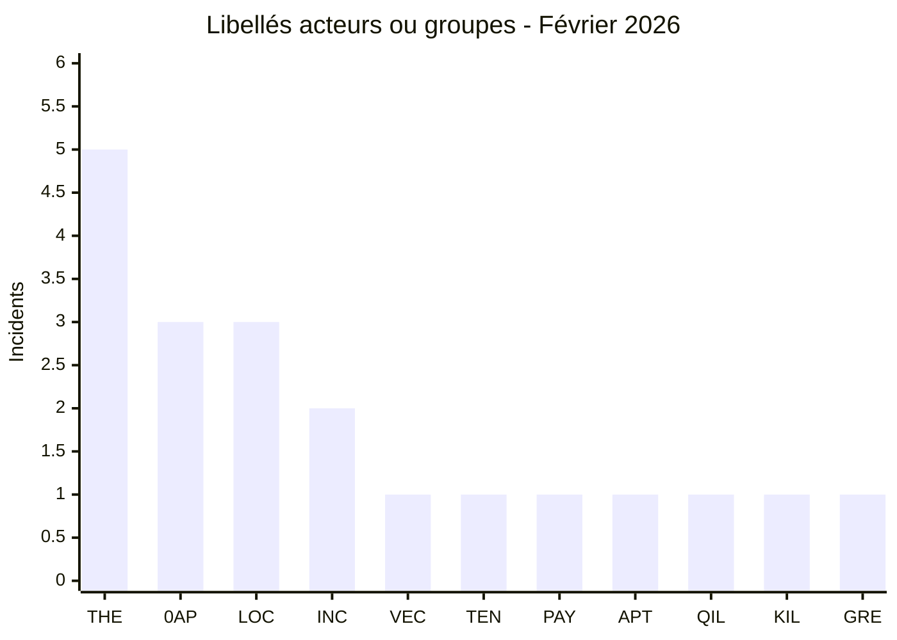
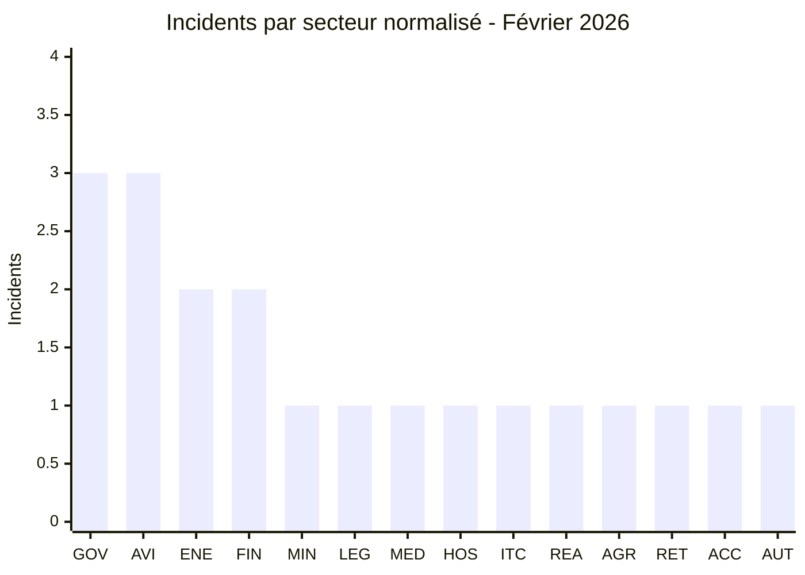

# Rapport CTI - Cyberattaques en Afrique (février 2026)

👉🏾 [**English version available here**](./README.md)

## 1. Synthèse exécutive

Février 2026 a rapporté **20 incidents cyber** dans **14 pays africains**, tous liés à des groupes ransomware ou d'extorsion de données. Le fait marquant, c'est la publication de données sensibles attribuées à la **DAF Sénégal**, des informations citoyennes et biométriques qu'AFRINTEL a pu consulter. L'acteur revendique **139 To** ; ce chiffre n'a pas pu être mesuré à partir de ce qui était réellement accessible. Points clés :

- **20 incidents ransomware / extorsion de données (100 %)**.
- **14 pays** touchés : l'**Afrique du Sud** (3), l'**Égypte** (3), le **Ghana** (2) et le **Nigeria** (2) en tête.
- **11 acteurs distincts** : **TheGentlemen** (5 incidents) domine, suivi de **0APT** (3) et **LockBit 5.0** (3).
- Le secteur de l'aviation sous pression soutenue : BlueSky Somalia, Nile Air Égypte, Air Côte d'Ivoire tous revendiqués en février.
- À noter : 0APT, responsable de 3 revendications à fort volume (BlueSky 3,5 To, Global Media Alliance 2,5 To, Vertex Law 850 Go), a ensuite disparu des sites de fuite publics.

> **Note :** La revendication Diesel-Electric Afrique du Sud (LockBit 5.0, 27 février) pourrait se chevaucher avec une revendication distincte du même acteur pour la même victime en mars 2026. Vérification indépendante requise.

### 📋 Liste des victimes

👉🏾 [Voir la liste complète des victimes](./victims_FR.md)

### 1.1 Comparaison avec le mois précédent

> Comparaison fondée sur les corpus mensuels AFRINTEL validés. Une variation du nombre de fiches documentées ne prouve pas, à elle seule, une variation du nombre réel de compromissions.

| Indicateur | Janvier 2026 | Février 2026 | Évolution observée |
|---|---:|---:|---:|
| Total incidents | 21 | 20 | **-1 (-4,8 %)** |
| Ransomware | 17 | 20 | **+3 (+17,6 %)** |
| Data Leak | 2 | 0 | **-2 (-100,0 %)** |
| Access Sale | 1 | 0 | **-1 (-100,0 %)** |
| DDoS | 0 | 0 | **0 (stable)** |
| Defacement | 1 | 0 | **-1 (-100,0 %)** |
| Operational Fraud | 0 | 0 | **0 (stable)** |

> Règle de lecture : si la valeur du mois précédent est `0` et celle du mois courant est supérieure à `0`, l'évolution est indiquée comme `nouveau` plutôt qu'avec un pourcentage artificiel. Les catégories absentes restent affichées à `0`.

## 2. Méthodologie

- **Périmètre** : 54 pays africains.
- **Période** : 1-28 février 2026 (incidents divulgués ou revendiqués durant ce mois ; les dates réelles d'attaque peuvent être antérieures).
- **Sources** : Dark web, DLS (sites de fuite), OSINT, canaux Telegram, forums underground.
- **Inclusion** : Incidents revendiqués ou attribués publiquement, avec victime, pays et secteur identifiés.
- **Typologie** : tous les incidents du mois sont attribués à des groupes ransomware ou d’extorsion de données. Le chiffrement, l’interruption opérationnelle et le vecteur d’accès initial ne sont pas présumés lorsque la source documente uniquement une victime publiée ou une revendication d’exfiltration. Aucune activité autonome de courtier en données n’a été identifiée.

Tous les chiffres de ce rapport sont calculés une seule fois à partir du couple bilingue validé [`victims_FR.md`](./victims_FR.md) / [`victims.md`](./victims.md). La version française est contrôlée en premier, puis la version anglaise est synchronisée et vérifiée en parité.

## 3. Vue d'ensemble

| Indicateur | Valeur |
|------------|--------|
| Total des victimes | 20 |
| Pays touchés | 14 |
| Acteurs distincts | 11 |
| Ransomware / extorsion de données | 20 (100 %) |

**Pays les plus ciblés :**
- 🇿🇦 Afrique du Sud : 3 victimes
- 🇪🇬 Égypte : 3 victimes
- 🇬🇭 Ghana : 2 victimes
- 🇳🇬 Nigeria : 2 victimes
- 🇸🇳 Sénégal : 1 victime
- 🇸🇴 Somalie : 1 victime
- 🇹🇿 Tanzanie : 1 victime
- 🇰🇪 Kenya : 1 victime
- 🇲🇺 Maurice : 1 victime
- 🇹🇳 Tunisie : 1 victime
- 🇸🇩 Soudan : 1 victime
- 🇨🇮 Côte d'Ivoire : 1 victime
- 🇲🇦 Maroc : 1 victime
- 🇳🇦 Namibie : 1 victime

**Légende codes pays :** `ZA` = Afrique du Sud | `EG` = Égypte | `GH` = Ghana | `NG` = Nigeria | `SN` = Sénégal | `SO` = Somalie | `TZ` = Tanzanie | `KE` = Kenya | `MU` = Maurice | `TN` = Tunisie | `SD` = Soudan | `CI` = Côte d'Ivoire | `MA` = Maroc | `NA` = Namibie

### Comparaison Ransomware et Fuite de données / Vente d'accès par pays

Les **20 incidents de février** sont classés **Ransomware** dans la taxonomie mensuelle structurée. Aucune Data Leak ni Access Sale autonome n'est classée séparément ce mois-ci.

**Légende visuelle :** 🟧 Ransomware | 🟦 Fuite de données / Vente d'accès

| Code | Pays | Ransomware | Fuite / vente d'accès | Répartition |
|---|---|---:|---:|---|
| `ZA` | Afrique du Sud | **3** | **0** | 🟧🟧🟧 |
| `EG` | Égypte | **3** | **0** | 🟧🟧🟧 |
| `GH` | Ghana | **2** | **0** | 🟧🟧 |
| `NG` | Nigeria | **2** | **0** | 🟧🟧 |
| `SN` | Sénégal | **1** | **0** | 🟧 |
| `SO` | Somalie | **1** | **0** | 🟧 |
| `TZ` | Tanzanie | **1** | **0** | 🟧 |
| `KE` | Kenya | **1** | **0** | 🟧 |
| `MU` | Maurice | **1** | **0** | 🟧 |
| `TN` | Tunisie | **1** | **0** | 🟧 |
| `SD` | Soudan | **1** | **0** | 🟧 |
| `CI` | Côte d'Ivoire | **1** | **0** | 🟧 |
| `MA` | Maroc | **1** | **0** | 🟧 |
| `NA` | Namibie | **1** | **0** | 🟧 |
|  | **Total** | **20** | **0** | 🟧 Ransomware |

**Légende pays :** `ZA` = Afrique du Sud | `EG` = Égypte | `GH` = Ghana | `NG` = Nigeria | `SN` = Sénégal | `SO` = Somalie | `TZ` = Tanzanie | `KE` = Kenya | `MU` = Maurice | `TN` = Tunisie | `SD` = Soudan | `CI` = Côte d'Ivoire | `MA` = Maroc | `NA` = Namibie

> La série bleue vaut zéro sur l'ensemble du mois et n'est donc pas tracée comme une seconde série entièrement nulle.

**Top 3 des plus grands volumes revendiqués :**
| Rang | Victime | Acteur | Volume |
|:---:|---------|--------|-------:|
| 1 | 🇸🇳 DAF SÉNÉGAL | The Green Blood Group | 139 To |
| 2 | 🇸🇴 BlueSky Aviation (Somalie) | 0APT | 3,5 To |
| 3 | 🇬🇭 Global Media Alliance (Ghana) | 0APT | 2,5 To |

**Convention couleur :** 🟧 Ransomware | 🟦 Data Leak | 🟪 Access Sale | 🟥 DDoS | 🟨 Defacement | 🟩 Operational Fraud.

**Acteurs les plus prolifiques :**
| Acteur | Incidents | Pays |
|--------|:---------:|------|
| TheGentlemen | 5 | Kenya, Ghana, Égypte, Afrique du Sud, Tunisie |
| 0APT | 3 | Somalie, Ghana, Tanzanie |
| LockBit 5.0 | 3 | Maurice, Égypte, Afrique du Sud |
| incransom | 2 | Nigeria, Côte d'Ivoire |
| vect | 1 | Afrique du Sud |
| tengu | 1 | Maroc |
| payload | 1 | Égypte |
| apt73/bashe | 1 | Soudan |
| qilin | 1 | Namibie |
| killsec | 1 | Nigeria |
| The Green Blood Group | 1 | Sénégal |

**Légende codes acteurs/groupes :** `THE` = TheGentlemen | `0AP` = 0APT | `LOC` = LockBit 5.0 | `INC` = incransom | `VEC` = vect | `TEN` = tengu | `PAY` = payload | `APT` = apt73/bashe | `QIL` = qilin | `KIL` = killsec | `GRE` = The Green Blood Group

## 4. Synthèse géographique

> **Pour le détail de chaque incident, voir [`victims_FR.md`](./victims_FR.md).**

- **Répartition :** 20 incidents dans 14 pays. Afrique du Sud et Égypte à 3 chacune, Ghana et Nigéria à 2 chacun.
- **Activité des acteurs :** TheGentlemen en tête avec 5 incidents, 0APT et LockBit 5.0 suivent avec 3 chacun.
- **Signal sectoriel :** BlueSky Aviation, Nile Air et Air Côte d'Ivoire, trois compagnies, trois pays, une pression soutenue sur le secteur aérien ce mois-ci.
- **Revendications volumétriques :** les 139 To attribués à DAF Sénégal et les trois revendications de 0APT sont les chiffres qui marquent, mais ni les volumes ni les détails de compromission n'ont été confirmés de manière indépendante.

---

## 5. Analyse détaillée par type d'incident

### 5.1 Ransomware - 20 incidents

| Pays | Incidents | Acteurs principaux |
|------|:---------:|-------------------|
| Afrique du Sud | 3 | TheGentlemen, vect, LockBit 5.0 |
| Égypte | 3 | TheGentlemen, payload, LockBit 5.0 |
| Ghana | 2 | 0APT, TheGentlemen |
| Nigeria | 2 | killsec, incransom |
| Sénégal | 1 | The Green Blood Group (139 To) |
| Somalie | 1 | 0APT (3,5 To) |
| Tanzanie | 1 | 0APT (850 Go) |
| Kenya | 1 | TheGentlemen |
| Maurice | 1 | LockBit 5.0 |
| Tunisie | 1 | TheGentlemen |
| Soudan | 1 | apt73/bashe (3,5 Go publiés) |
| Côte d'Ivoire | 1 | incransom |
| Maroc | 1 | tengu |
| Namibie | 1 | qilin |

**Observations clés :**
- **0APT** est sorti de nulle part début février, 3 revendications en 5 jours, puis silence radio sur les DLS publics pour le reste du mois.
- **Secteur aérien** : 3 compagnies revendiquées (BlueSky Somalie, Nile Air Égypte, Air Côte d'Ivoire), 3 acteurs différents. Ça ressemble plus à de l'opportunisme indépendant qu'à une campagne coordonnée.
- **TheGentlemen** apparaît dans 5 incidents répartis dans 5 pays en février.
- **LockBit 5.0** revendique 3 victimes, toujours sous le branding LockBit 5.x.

## 6. Impact sectoriel

| Secteur | Incidents | Pourcentage |
|---|---:|---:|
| Gouvernement / Administration | 3 | 15,0 % |
| Compagnies aériennes / Aviation | 3 | 15,0 % |
| Énergie | 2 | 10,0 % |
| Finance / Banque / FinTech | 2 | 10,0 % |
| Mines / Extraction | 1 | 5,0 % |
| Juridique | 1 | 5,0 % |
| Médias | 1 | 5,0 % |
| Hôtellerie | 1 | 5,0 % |
| Conseil IT | 1 | 5,0 % |
| Immobilier | 1 | 5,0 % |
| Agriculture | 1 | 5,0 % |
| Commerce de détail | 1 | 5,0 % |
| Comptabilité | 1 | 5,0 % |
| Automobile | 1 | 5,0 % |
| **Total** | **20** | **100 %** |

**Légende codes secteurs :** `GOV` = Gouvernement / Administration | `AVI` = Compagnies aériennes / Aviation | `ENE` = Énergie | `FIN` = Finance / Banque / FinTech | `MIN` = Mines / Extraction | `LEG` = Juridique | `MED` = Médias | `HOS` = Hôtellerie | `ITC` = Conseil IT | `REA` = Immobilier | `AGR` = Agriculture | `RET` = Commerce de détail | `ACC` = Comptabilité | `AUT` = Automobile

**Enseignements :**
- Gouvernement, aviation et énergie représentent ensemble **8 incidents sur 20 (40,0 %)**. Il s'agit d'une concentration sectorielle dans le corpus documenté, pas d'une preuve que chaque cas a affecté des opérations critiques.
- Trois compagnies aériennes en un mois, du jamais-vu dans les archives AFRINTEL.
- DAF Sénégal, données gouvernementales et biométriques réunies, coche les cases du niveau d'impact 4 si la revendication se confirme.

## 7. Profil des acteurs de menaces

| Acteur | Type | Incidents | Cibles principales |
|--------|------|:---------:|-------------------|
| TheGentlemen | Groupe ransomware | 5 | Multi-secteur, 4 pays |
| 0APT | Inconnu (disparu) | 3 | Aviation, médias, juridique |
| LockBit 5.0 | Ransomware | 3 | Hôtellerie, gouvernement, automobile |
| incransom | Ransomware | 2 | Énergie, aviation |
| The Green Blood Group | Ransomware / extorsion | 1 | Sénégal (gouvernement) |
| apt73/bashe | Ransomware | 1 | Soudan (agriculture) |
| vect | Ransomware | 1 | Afrique du Sud (énergie) |
| tengu | Ransomware | 1 | Maroc (comptabilité) |
| payload | Ransomware | 1 | Égypte (immobilier) |
| killsec | Ransomware | 1 | Nigeria (fintech) |
| qilin | Ransomware | 1 | Namibie (commerce) |

**Notes sur les acteurs :**
- **0APT** : Revendications à fort volume sans preuves publiées. Disparu après février. Faible niveau de confiance jusqu'à vérification.
- **The Green Blood Group** : Première apparition AFRINTEL. Revendication de 139 To sur un gouvernement.
- **LockBit 5.0** : Troisième mois consécutif d'activité africaine.

### 7.1 Niveau de risque

| Pays | Niveau de risque |
|------|----------------|
| Sénégal | 🔴 Critique (139 To gouvernement + biométrie) |
| Afrique du Sud | 🔴 Élevé (3 incidents : gouvernement, énergie, automobile) |
| Égypte | 🔴 Élevé (3 incidents dont un ministère gouvernemental) |
| Soudan | 🟠 Moyen-Élevé (fuite partielle confirmée, secteur agricole critique) |
| Somalie | 🟠 Moyen (secteur aérien) |
| Nigeria | 🟠 Moyen (fintech + secteur pétrolier) |
| Autres | 🟡 Faible-Moyen |

## 8. Tendances clés et lacunes de renseignement

### Tendances

1. **DAF Sénégal pourrait être une violation record.** 139 To dont des données biométriques, c'est un chiffre extraordinaire à revendiquer. S'il se confirme, c'est une vraie escalade contre les gouvernements ouest-africains.
2. **L'aviation a pris cher.** Trois compagnies, trois pays, trois acteurs, en un seul mois. Ça ressemble à de l'opportunisme indépendant, pas à une campagne coordonnée contre le secteur.
3. **0APT a brillé puis disparu.** Trois revendications à fort volume en 5 jours, puis plus rien sur les DLS publics pour le reste du mois. Objectifs atteints, revendications fabriquées, ou acteur existant testant un nouveau pseudonyme, impossible de trancher.
4. **TheGentlemen ne ralentit pas.** Cinq incidents en février après six en janvier, un tempo panafricain qui tient la distance.
5. **LockBit 5.0 continue d'apparaître.** Trois revendications ce mois-ci, le ciblage africain ne faiblit pas.

### Lacunes

- La revendication de 139 To DAF Sénégal n'est pas vérifiée de manière indépendante. Aucune déclaration de la victime ni confirmation externe.
- L'identité réelle, les outils et l'infrastructure de 0APT sont inconnus.
- Diesel-Electric Afrique du Sud : chevauchement potentiel entre les revendications de février et mars 2026 à confirmer.
- Les capacités et activités antérieures de The Green Blood Group ne sont pas documentées.

### Comparaison factuelle avec janvier 2026

Le tableau standardisé placé en haut de ce rapport constitue la référence numérique de la comparaison mensuelle.

Février contient **20 incidents documentés contre 21 en janvier (-4,8 %)**. Le Ransomware passe de **17 à 20 (+17,6 %)**, tandis que les trois autres types présents en janvier disparaissent du corpus structuré de février : Data Leak 2 -> 0, Access Sale 1 -> 0 et Defacement 1 -> 0.

```mermaid
xychart-beta
    title "Incidents documentés - Janvier vs Février 2026"
    x-axis ["JAN", "FEB"]
    y-axis "Incidents" 0 --> 22
    bar [21, 20]
    bar [17, 20]
```

**Légende des séries :** première série = total incidents | deuxième série = Ransomware.  
**Légende temporelle :** `JAN` = Janvier 2026 | `FEB` = Février 2026.

Cette évolution décrit le corpus public documenté par AFRINTEL et ne doit pas être interprétée automatiquement comme une variation du nombre réel d'attaques.

## 9. Cartographie MITRE ATT&CK (contextuelle)

| Phase | Technique | Portée analytique |
| :--- | :--- | :--- |
| Accès initial | T1566 - Phishing | Hypothèse de détection défensive, non observée à partir des seules revendications |
| Accès initial | T1190 - Exploit Public-Facing Application | Hypothèse de détection défensive, non observée à partir des seules revendications |
| Accès par comptes | T1078 - Valid Accounts | Pertinent pour les ventes d’accès ou d’identifiants, sans confirmer leur utilisation |
| Collecte | T1005 - Data from Local System | Hypothèse contextuelle lorsque des données internes sont publiées, le mécanisme de collecte restant inconnu |
| Impact | T1486 - Data Encrypted for Impact | Pertinent pour la préparation ransomware, sans confirmer un chiffrement pour chaque fiche |

> Ces techniques constituent des hypothèses défensives. Une revendication, une vente de données ou une publication sur un site de fuite ne suffit pas à les considérer comme observées.

## 10. Recommandations

### Pour les gouvernements et entreprises africains

- **Protection des données biométriques** : les organisations détenant des bases de données biométriques nationales doivent les traiter comme des actifs de plus haute sensibilité avec des sauvegardes hors ligne, des contrôles d'accès stricts et une détection en temps réel des flux de données sortants.
- **Détection d'exfiltration par volume** : mettre en place des seuils de transferts sortants ; 139 To ne peuvent pas quitter un réseau inaperçus avec une surveillance adéquate.
- **Durcissement du secteur aérien** : les systèmes technologiques opérationnels (OT) des aéroports et compagnies aériennes doivent être segmentés des réseaux informatiques.
- **Plans de réponse aux incidents ransomware** : tous les ministères gouvernementaux doivent disposer de playbooks IR testés avec des sauvegardes hors ligne vérifiées.

### Pour les analystes CTI

- Suivre **The Green Blood Group** pour des revendications supplémentaires ou des publications de preuves.
- Surveiller **0APT** pour une réapparition sous le même pseudonyme ou un pseudonyme alternatif.
- Vérifier la **double revendication Diesel-Electric** (février + mars) auprès des communications de la victime.
- Surveiller l'expansion d'**apt73/bashe** vers l'Afrique centrale et de l'Est (Soudan : première apparition AFRINTEL pour cette région).

## 11. Recommandations SOC tactiques

### Priorités de détection

- **Détection d'exfiltration à grande échelle (T1041)** : alerte sur les transferts sortants dépassant 10 Go en 24 heures depuis des systèmes non de sauvegarde
- **Déploiement ransomware (T1486)** : surveiller les événements de modification de masse de fichiers, la suppression VSS et les signatures de processus de chiffrement
- **Mouvement latéral pré-chiffrement** : détecter l'utilisation anormale de comptes admin, les chaînes RDP, l'utilisation de PsExec ou d'outils similaires
- **Surveillance aviation et OT** : segmenter les systèmes de réservation et opérationnels ; détecter les connexions non autorisées entre segments

### Sources de surveillance

- EDR / Sysmon
- DLP (Data Loss Prevention) : alertes sur les volumes sortants
- Analyse de flux réseau (NetFlow/IPFIX)
- Journaux firewall / proxy
- Journaux de gestion des identités et des accès

## 12. Recommandations stratégiques

- Les gouvernements d'Afrique de l'Ouest doivent établir des **exigences minimales de sécurité IT pour les systèmes d'administration gouvernementale**, suite à la revendication DAF Sénégal.
- Créer un **partage d'informations transfrontalier pour le secteur aérien** entre les équipes CERT d'Afrique du Nord, de l'Ouest et de l'Est.
- Développer des **cadres nationaux de protection des données biométriques** avec des contrôles de sécurité spécifiques pour les bases de données gouvernementales contenant empreintes digitales, données de reconnaissance faciale et enregistrements d'identité.
- Les **registres d'infrastructures critiques** doivent imposer des délais de signalement des incidents cyber pour une meilleure conscience situationnelle régionale.

## 13. Conclusion

Février 2026 se clôture avec **20 incidents Ransomware documentés dans 14 pays africains**. L'Afrique du Sud et l'Égypte comptent trois incidents chacune, tandis que le Ghana et le Nigeria en comptent deux chacun.

TheGentlemen arrive en tête avec cinq fiches, devant 0APT et LockBit 5.0 avec trois chacune. Plusieurs cas comprennent des échantillons publiés ou des données divulguées, mais les volumes revendiqués comme les **139 To attribués à DAF Sénégal** restent des affirmations d'acteur tant qu'ils ne peuvent pas être mesurés indépendamment à partir des éléments disponibles.

Par rapport à janvier, le total documenté diminue légèrement de **21 à 20**, tandis que le Ransomware passe de **17 à 20** et que le corpus structuré de février ne contient aucune Data Leak, Access Sale, DDoS, Defacement ni Operational Fraud autonome.

**AFRINTEL** - Cyber Threat Intelligence africaine  
[GitHub AFRINTEL](https://github.com/Hatchepsoute/AFRINTEL)
