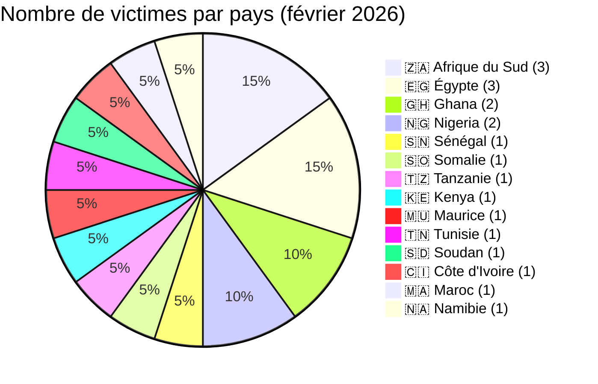
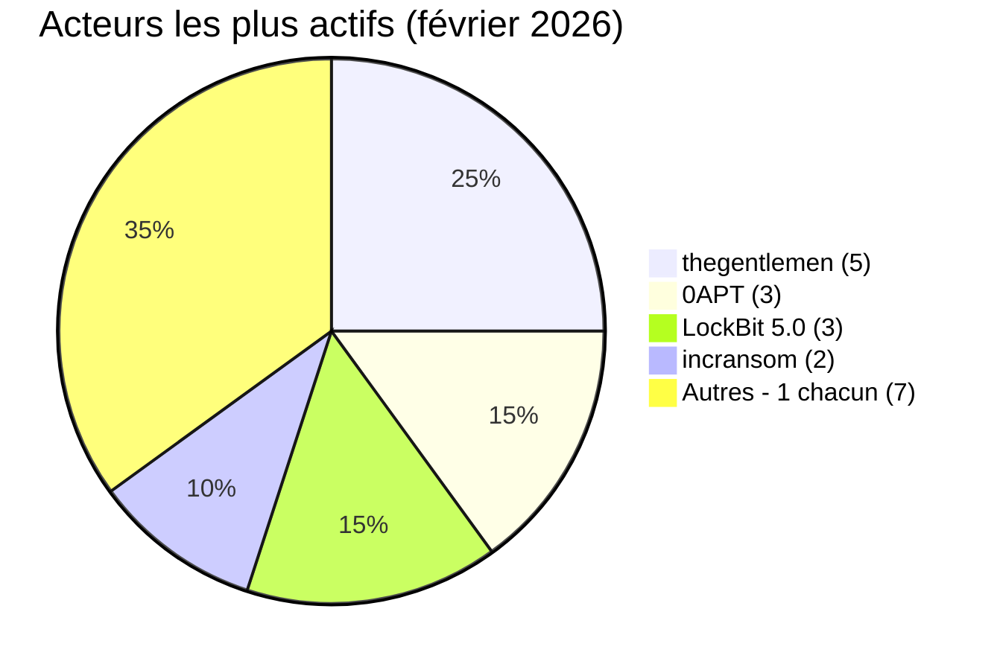
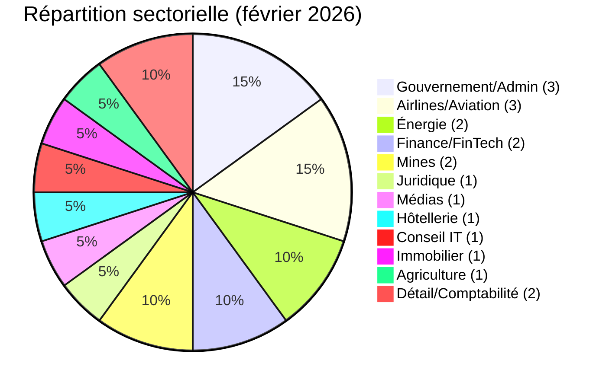

# Rapport CTI - Cyberattaques en Afrique (février 2026)

👉🏾 [**English version available here**](./README.md)

## 1. Synthèse exécutive

Février 2026 enregistre **20 incidents cyber** publiquement revendiqués ou détectés à travers l'Afrique, tous attribués à des groupes ransomwares ou d'extorsion de données. Le mois est marqué par un événement extraordinaire : l'exfiltration alléguée de 139 To depuis la DAF SENEGAL (Direction de l'Administration Générale et de l'Équipement), de loin la plus grande revendication de fuite de données enregistrée par AFRINTEL en 2026. Points clés :

- **20 incidents ransomware / extorsion de données (100 %)**.
- **14 pays** touchés : l'**Afrique du Sud** (3), l'**Égypte** (3), le **Ghana** (2) et le **Nigeria** (2) en tête.
- **11 acteurs distincts** : **thegentlemen** (5 incidents) domine, suivi de **0APT** (3) et **LockBit 5.0** (3).
- Le secteur de l'aviation sous pression soutenue : BlueSky Somalia, Nile Air Égypte, Air Côte d'Ivoire tous revendiqués en février.
- À noter : 0APT, responsable de 3 revendications à fort volume (BlueSky 3,5 To, Global Media Alliance 2,5 To, Vertex Law 850 Go), a ensuite disparu des sites de fuite publics. Les revendications restent non vérifiées.

> **Note :** La revendication Diesel-Electric Afrique du Sud (LockBit 5.0, 27 février) pourrait se chevaucher avec une revendication distincte du même acteur pour la même victime en mars 2026. Vérification indépendante requise.

### 📋 Liste des victimes

👉🏾 [Voir la liste complète des victimes](./victims_FR.md)

## 2. Méthodologie

- **Périmètre** : 54 pays africains.
- **Période** : 1-28 février 2026 (incidents divulgués ou revendiqués durant ce mois ; les dates réelles d'attaque peuvent être antérieures).
- **Sources** : Dark web, DLS (sites de fuite), OSINT, canaux Telegram, forums underground.
- **Inclusion** : Incidents revendiqués ou attribués publiquement, avec victime, pays et secteur identifiés.
- **Typologie** : Tous les incidents de ce mois impliquent un chiffrement ransomware, une double extorsion (chiffrement + menace de publication) ou une exfiltration massive de données par des groupes criminels. Aucune activité de courtier en données pure identifiée.

## 3. Vue d'ensemble

| Indicateur | Valeur |
|------------|--------|
| Total des victimes | 20 |
| Pays touchés | 14 |
| Acteurs distincts | 11 |
| Ransomware / extorsion de données | 20 (100 %) |

**Pays les plus ciblés :**
- 🇿🇦 Afrique du Sud : 3 victimes
- 🇪🇬 Égypte : 3 victimes
- 🇬🇭 Ghana : 2 victimes
- 🇳🇬 Nigeria : 2 victimes
- 🇸🇳 Sénégal : 1 victime
- 🇸🇴 Somalie : 1 victime
- 🇹🇿 Tanzanie : 1 victime
- 🇰🇪 Kenya : 1 victime
- 🇲🇺 Maurice : 1 victime
- 🇹🇳 Tunisie : 1 victime
- 🇸🇩 Soudan : 1 victime
- 🇨🇮 Côte d'Ivoire : 1 victime
- 🇲🇦 Maroc : 1 victime
- 🇳🇦 Namibie : 1 victime

**Top 3 des plus grandes fuites revendiquées :**
| Rang | Victime | Acteur | Volume |
|:---:|---------|--------|-------:|
| 1 | 🇸🇳 DAF SÉNÉGAL | The Green Blood Group | 139 To |
| 2 | 🇸🇴 BlueSky Aviation (Somalie) | 0APT | 3,5 To |
| 3 | 🇬🇭 Global Media Alliance (Ghana) | 0APT | 2,5 To |

**Acteurs les plus prolifiques :**
| Acteur | Incidents | Pays |
|--------|:---------:|------|
| thegentlemen | 5 | Kenya, Ghana, Égypte, Afrique du Sud, Tunisie |
| 0APT | 3 | Somalie, Ghana, Tanzanie |
| LockBit 5.0 | 3 | Maurice, Égypte, Afrique du Sud |
| incransom | 2 | Nigeria, Côte d'Ivoire |
| vect | 1 | Afrique du Sud |
| tengu | 1 | Maroc |
| payload | 1 | Égypte |
| apt73/bashe | 1 | Soudan |
| qilin | 1 | Namibie |
| killsec | 1 | Nigeria |
| The Green Blood Group | 1 | Sénégal |

## 4. Vue d'ensemble pays par pays

> Tous les éléments présentés proviennent d'incidents revendiqués publiquement. Les revendications restent non confirmées sauf preuve indépendante.

### 🇸🇳 Sénégal (1 incident - Critique)

**DAF SÉNÉGAL** (Direction de l'Administration Générale et de l'Équipement) est la revendication la plus critique du mois. The Green Blood Group revendique 139 To de données exfiltrées incluant des bases de données citoyennes et des enregistrements biométriques. Si même partiellement authentique, cela représenterait l'une des plus grandes expositions de données gouvernementales de l'histoire africaine. L'exposition de données biométriques crée des risques irréversibles : contrairement aux mots de passe, les identifiants biométriques ne peuvent pas être modifiés. Risques : fraude identitaire à l'échelle nationale, perturbation de la fourniture des services publics et exploitation potentielle de l'infrastructure d'identité citoyenne.

### 🇸🇴 Somalie (1 incident)

**BlueSky Aviation** (bluesky-air.com) a été revendiquée par 0APT avec 3,5 To d'exfiltration alléguée. C'est l'une des trois revendications à fort volume faites par 0APT en février avant que le groupe disparaisse des sites de fuite publics. La revendication reste non vérifiée. Les risques d'une exposition du secteur aérien incluent les données opérationnelles, les dossiers passagers et les informations logistiques de vol.

### 🇬🇭 Ghana (2 incidents)

**Global Media Alliance** (gmaworld.com) a été revendiquée par 0APT (2,5 To). En tant qu'entreprise de médias et communications intégrée, son exposition risquerait des contrats publicitaires, des contenus éditoriaux et des données personnelles. **Ghana Bauxite Company** (ghanabauxite.com) a été revendiquée par thegentlemen. Entreprise minière liée à l'État, son ciblage illustre l'intérêt croissant du groupe pour les industries extractives africaines.

### 🇹🇿 Tanzanie (1 incident)

**Vertex Law Chambers** (vertexlaw.co.tz, 0APT, 850 Go). Une fuite dans un cabinet d'avocats crée une sensibilité particulièrement élevée : dossiers clients, communications privilégiées, archives judiciaires et contrats commerciaux sont tous potentiellement exposés.

### 🇰🇪 Kenya (1 incident)

**Wells Fargo Kenya** (fargo.co.ke, thegentlemen) est un prestataire local de sécurité et de logistique financière. L'exposition de données de sécurité physique et de logistique financière crée des risques de compromission de la sécurité physique et de fraude financière.

### 🇳🇬 Nigeria (2 incidents)

**Getly** (getly.app, killsec, 9 février) est une application fintech. Les violations de fintech mobile exposent directement les comptes financiers et les historiques de transactions des utilisateurs. **Midwestern Oil & Gas** (midwesternog.com, incransom, 12 février) est une société pétrolière et gazière en amont. Le ciblage du secteur énergétique critique au Nigeria reflète une tendance plus large observée en février (aviation, énergie, mines toutes touchées).

### 🇪🇬 Égypte (3 incidents)

L'Égypte enregistre trois groupes ransomwares distincts en février. **Nile Air** (nileair.com, thegentlemen, 13 février) est une compagnie aérienne privée à l'aéroport du Caire. **sodic.com** (payload, 17 février) est l'un des principaux promoteurs immobiliers égyptiens. Le **Ministère de l'Agriculture** (moa.gov.eg, LockBit 5.0, 20 février) est responsable de la sécurité alimentaire et de l'aménagement foncier. Le ciblage simultané par trois groupes différents sur l'aviation, l'immobilier et le gouvernement illustre l'exposition soutenue de l'Égypte.

### 🇲🇺 Maurice (1 incident)

**Sands Suites** (sands.mu, LockBit 5.0, 14 février) est un complexe hôtelier de luxe. Les violations du secteur hôtelier exposent généralement les données personnelles des clients, les informations de paiement et les programmes de fidélité.

### 🇿🇦 Afrique du Sud (3 incidents)

**Intsika Yethu Municipality** (intsikayethu.gov.za, thegentlemen, 15 février) est une municipalité locale du Cap-Oriental. Les violations de données municipales risquent d'exposer les dossiers de services aux citoyens, les détails d'infrastructure et les données du personnel. **EnerTec** (enertec.co.za, vect, 24 février, 151,79 Go) est une société de solutions énergétiques et de distribution de batteries. **Diesel-Electric** (diesel-electric.co.za, LockBit 5.0, 27 février) est un distributeur majeur de composants automobiles. Une possible republication de la même victime est apparue sous LockBit 5.0 en mars 2026 et nécessite une vérification.

### 🇹🇳 Tunisie (1 incident)

**BITS** (bits.com.tn, thegentlemen, 15 février) est une société de services et de conseil informatique. Les cabinets de conseil IT détiennent la documentation d'infrastructure des clients et des identifiants d'accès, créant un risque élevé de violation secondaire.

### 🇸🇩 Soudan (1 incident)

**Amtaar Investment** (amtaar.com, apt73/bashe, 18 février) : 3,5 Go de données ont été revendiqués et partiellement publiés. Amtaar est une grande entreprise d'investissement agricole gérant 6 000 hectares de terres irriguées, jouant un rôle clé dans la sécurité alimentaire nationale. C'est le seul incident de février avec une publication partielle de données confirmée. Le contexte du conflit soudanais amplifie l'impact stratégique potentiel de l'exposition de données du secteur agricole.

### 🇨🇮 Côte d'Ivoire (1 incident)

**Air Côte d'Ivoire** (aircotedivoire.com, incransom, 19 février) est la compagnie aérienne nationale. Avec BlueSky Somalie et Nile Air Égypte, février 2026 devient le mois le plus actif pour les revendications ransomware sur les compagnies aériennes africaines dans les archives AFRINTEL.

### 🇲🇦 Maroc (1 incident)

**Shora Advisory** (shora.ma, tengu, 20 février) est un cabinet de conseil en comptabilité et finance. Les cabinets de conseil financier détiennent des données financières d'entreprise sensibles, des données fiscales et des documents de stratégie.

### 🇳🇦 Namibie (1 incident)

**CYMOT** (cymot.com, qilin, 22 février) est un détaillant namibien de pièces automobiles, outils et équipements.

---

## 5. Analyse détaillée par type d'incident

### 5.1 Ransomware et extorsion de données (20 incidents)

| Pays | Incidents | Acteurs principaux |
|------|:---------:|-------------------|
| Afrique du Sud | 3 | thegentlemen, vect, LockBit 5.0 |
| Égypte | 3 | thegentlemen, payload, LockBit 5.0 |
| Ghana | 2 | 0APT, thegentlemen |
| Nigeria | 2 | killsec, incransom |
| Sénégal | 1 | The Green Blood Group (139 To) |
| Somalie | 1 | 0APT (3,5 To) |
| Tanzanie | 1 | 0APT (850 Go) |
| Kenya | 1 | thegentlemen |
| Maurice | 1 | LockBit 5.0 |
| Tunisie | 1 | thegentlemen |
| Soudan | 1 | apt73/bashe (3,5 Go publiés) |
| Côte d'Ivoire | 1 | incransom |
| Maroc | 1 | tengu |
| Namibie | 1 | qilin |

**Observations clés :**
- **0APT** a émergé comme nouvel acteur prolifique début février (3 revendications en 5 jours) puis a disparu des DLS publics. L'authenticité des volumes revendiqués (total 6,85 To sur 3 victimes) reste non vérifiée.
- **Secteur aérien** : 3 compagnies aériennes revendiquées (BlueSky Somalie, Nile Air Égypte, Air Côte d'Ivoire) par 3 acteurs différents. Ciblage opportuniste indépendant probable.
- **thegentlemen** poursuit son rythme de janvier 2026 avec 5 nouvelles revendications dans 4 pays.
- **LockBit 5.0** revendique 3 victimes, confirmant sa continuité opérationnelle sous le branding LockBit 5.x.

## 6. Impact sectoriel

| Secteur | Incidents | Pourcentage |
|---------|:---------:|:-----------:|
| Gouvernement / Administration | 3 | 15,0 % |
| Airlines / Aviation | 3 | 15,0 % |
| Énergie | 2 | 10,0 % |
| Finance / Banque / FinTech | 2 | 10,0 % |
| Mines / Extraction | 2 | 10,0 % |
| Juridique | 1 | 5,0 % |
| Médias | 1 | 5,0 % |
| Hôtellerie | 1 | 5,0 % |
| Conseil IT | 1 | 5,0 % |
| Immobilier | 1 | 5,0 % |
| Agriculture | 1 | 5,0 % |
| Commerce de détail | 1 | 5,0 % |
| Comptabilité | 1 | 5,0 % |

**Enseignements :**
- Gouvernement, aviation et énergie forment le cluster infrastructures critiques (8 incidents, 40 %).
- La concentration aviation (3 compagnies aériennes en un mois) est inédite dans les archives AFRINTEL.
- La violation DAF Sénégal (données gouvernementales biométriques) représente un scénario d'impact de niveau 4 si confirmé.

## 7. Profil des acteurs de menaces

| Acteur | Type | Incidents | Cibles principales |
|--------|------|:---------:|-------------------|
| thegentlemen | Groupe ransomware | 5 | Multi-secteur, 4 pays |
| 0APT | Inconnu (disparu) | 3 | Aviation, médias, juridique |
| LockBit 5.0 | Ransomware | 3 | Hôtellerie, gouvernement, automobile |
| incransom | Ransomware | 2 | Énergie, aviation |
| The Green Blood Group | Ransomware / extorsion | 1 | Sénégal (gouvernement) |
| apt73/bashe | Ransomware | 1 | Soudan (agriculture) |
| vect | Ransomware | 1 | Afrique du Sud (énergie) |
| tengu | Ransomware | 1 | Maroc (comptabilité) |
| payload | Ransomware | 1 | Égypte (immobilier) |
| killsec | Ransomware | 1 | Nigeria (fintech) |
| qilin | Ransomware | 1 | Namibie (commerce) |

**Notes sur les acteurs :**
- **0APT** : Revendications à fort volume sans preuves publiées. Disparu après février. Faible niveau de confiance jusqu'à vérification.
- **The Green Blood Group** : Première apparition AFRINTEL. Revendication de 139 To sur un gouvernement, non vérifiée.
- **LockBit 5.0** : Troisième mois consécutif d'activité africaine.

### 7.1 Niveau de risque

| Pays | Niveau de risque |
|------|----------------|
| Sénégal | 🔴 Critique (139 To gouvernement + biométrie - non vérifiés) |
| Afrique du Sud | 🔴 Élevé (3 incidents : gouvernement, énergie, automobile) |
| Égypte | 🔴 Élevé (3 incidents dont un ministère gouvernemental) |
| Soudan | 🟠 Moyen-Élevé (fuite partielle confirmée, secteur agricole critique) |
| Somalie | 🟠 Moyen (revendication non vérifiée, secteur aérien) |
| Nigeria | 🟠 Moyen (fintech + secteur pétrolier) |
| Autres | 🟡 Faible-Moyen |

## 8. Tendances clés et lacunes de renseignement

### Tendances

1. **DAF Sénégal - violation potentiellement record** : 139 To incluant des données biométriques est une revendication extraordinaire. Si confirmée, elle marquerait une escalade significative des attaques contre les gouvernements ouest-africains.
2. **Secteur aérien sous attaque** : trois compagnies aériennes revendiquées en un mois dans trois pays par trois acteurs différents. Ciblage opportuniste indépendant plutôt que campagne coordonnée.
3. **Émergence et disparition de 0APT** : trois revendications à fort volume en 5 jours puis silence. Soit le groupe a atteint ses objectifs, soit les revendications étaient fabriquées, soit un acteur existant a testé un nouveau pseudonyme.
4. **thegentlemen maintient le rythme** : cinq incidents en février après six en janvier confirme un tempo opérationnel panafricain soutenu.
5. **Persistance de LockBit 5.0** : trois revendications confirment la continuité africaine sous le branding LockBit 5.x.

### Lacunes

- La revendication de 139 To DAF Sénégal n'est pas vérifiée de manière indépendante. Aucune déclaration de la victime ni confirmation externe.
- L'identité réelle, les outils et l'infrastructure de 0APT sont inconnus.
- Diesel-Electric Afrique du Sud : chevauchement potentiel entre les revendications de février et mars 2026 à confirmer.
- Les capacités et activités antérieures de The Green Blood Group ne sont pas documentées.

## 9. Cartographie MITRE ATT&CK (contextuelle)

| Incident | Techniques |
|----------|-----------|
| DAF Sénégal | T1486 - Ransomware, T1041 - Exfiltration, T1005 - Données du système local |
| Clusters 0APT | T1041 - Exfiltration, T1486 - Ransomware (supposé) |
| Amtaar Soudan | T1486 - Ransomware, T1041 - Exfiltration (publication partielle confirmée) |
| thegentlemen (général) | T1486 - Ransomware, T1566 - Phishing (vecteur initial probable) |

**Techniques couramment observées :**
- T1566 - Phishing (vecteur initial principal supposé)
- T1190 - Exploitation d'application web
- T1486 - Ransomware (20 incidents)
- T1041 - Exfiltration (DAF Sénégal, Amtaar Soudan, clusters 0APT)

## 10. Recommandations

### Pour les gouvernements et entreprises africains

- **Protection des données biométriques** : les organisations détenant des bases de données biométriques nationales doivent les traiter comme des actifs de plus haute sensibilité avec des sauvegardes hors ligne, des contrôles d'accès stricts et une détection en temps réel des flux de données sortants.
- **Détection d'exfiltration par volume** : mettre en place des seuils de transferts sortants ; 139 To ne peuvent pas quitter un réseau inaperçus avec une surveillance adéquate.
- **Durcissement du secteur aérien** : les systèmes technologiques opérationnels (OT) des aéroports et compagnies aériennes doivent être segmentés des réseaux informatiques.
- **Plans de réponse aux incidents ransomware** : tous les ministères gouvernementaux doivent disposer de playbooks IR testés avec des sauvegardes hors ligne vérifiées.

### Pour les analystes CTI

- Suivre **The Green Blood Group** pour des revendications supplémentaires ou des publications de preuves.
- Surveiller **0APT** pour une réapparition sous le même pseudonyme ou un pseudonyme alternatif.
- Vérifier la **double revendication Diesel-Electric** (février + mars) auprès des communications de la victime.
- Surveiller l'expansion d'**apt73/bashe** vers l'Afrique centrale et de l'Est (Soudan : première apparition AFRINTEL pour cette région).

## 11. Recommandations SOC tactiques

### Priorités de détection

- **Détection d'exfiltration à grande échelle (T1041)** : alerte sur les transferts sortants dépassant 10 Go en 24 heures depuis des systèmes non de sauvegarde
- **Déploiement ransomware (T1486)** : surveiller les événements de modification de masse de fichiers, la suppression VSS et les signatures de processus de chiffrement
- **Mouvement latéral pré-chiffrement** : détecter l'utilisation anormale de comptes admin, les chaînes RDP, l'utilisation de PsExec ou d'outils similaires
- **Surveillance aviation et OT** : segmenter les systèmes de réservation et opérationnels ; détecter les connexions non autorisées entre segments

### Sources de surveillance

- EDR / Sysmon
- DLP (Data Loss Prevention) : alertes sur les volumes sortants
- Analyse de flux réseau (NetFlow/IPFIX)
- Journaux firewall / proxy
- Journaux de gestion des identités et des accès

## 12. Recommandations stratégiques

- Les gouvernements d'Afrique de l'Ouest doivent établir des **exigences minimales de sécurité IT pour les systèmes d'administration gouvernementale**, suite à la revendication DAF Sénégal.
- Créer un **partage d'informations transfrontalier pour le secteur aérien** entre les équipes CERT d'Afrique du Nord, de l'Ouest et de l'Est.
- Développer des **cadres nationaux de protection des données biométriques** avec des contrôles de sécurité spécifiques pour les bases de données gouvernementales contenant empreintes digitales, données de reconnaissance faciale et enregistrements d'identité.
- Les **registres d'infrastructures critiques** doivent imposer des délais de signalement des incidents cyber pour une meilleure conscience situationnelle régionale.

## 13. Conclusion

Février 2026 est avant tout marqué par l'ampleur et la sensibilité de la revendication DAF Sénégal : si confirmés, 139 To de données citoyennes et biométriques constitueraient l'une des violations gouvernementales les plus significatives de l'histoire cyber africaine. Au-delà de ce cas unique, le mois démontre un paysage de menaces large et diversifié : 14 pays, 11 acteurs, et une intensité particulière sur l'aviation, l'énergie et les entités gouvernementales critiques. thegentlemen, LockBit 5.0 et 0APT (brièvement) maintiennent tous un rythme opérationnel élevé. AFRINTEL continue de surveiller tous les groupes actifs et mettra à jour les évaluations au fur et à mesure de la vérification.

**AFRINTEL** - Cyber Threat Intelligence africaine
[GitHub AFRINTEL](https://github.com/Hatchepsoute/AFRINTEL)
