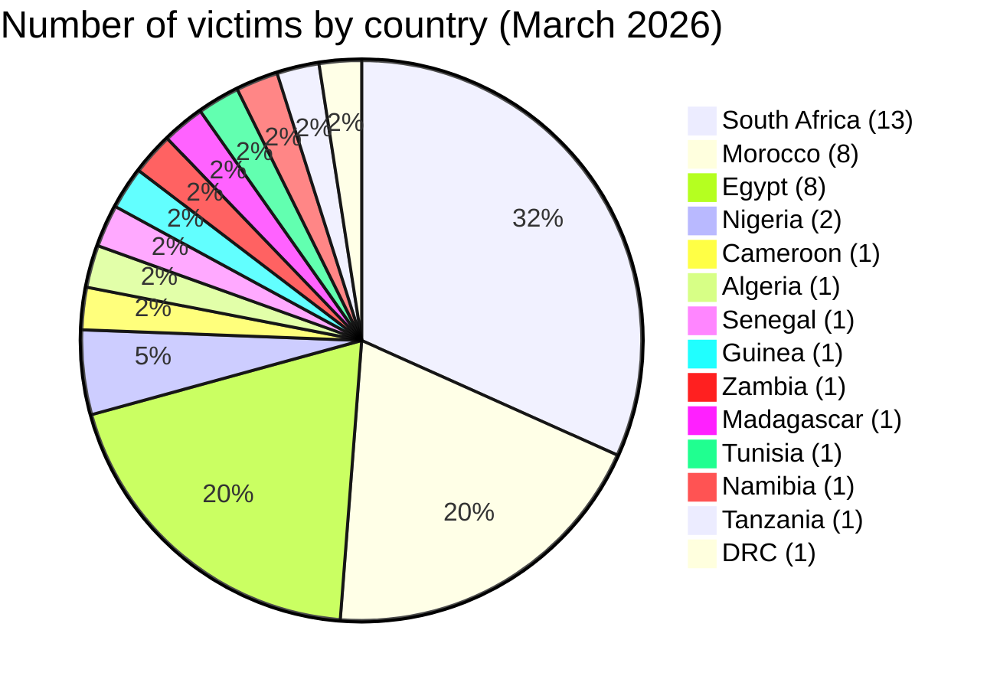
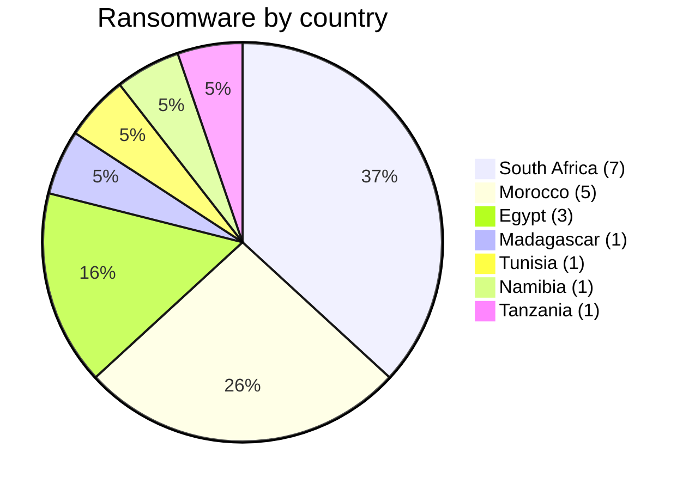
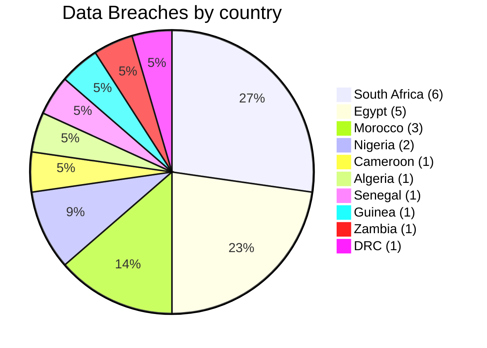
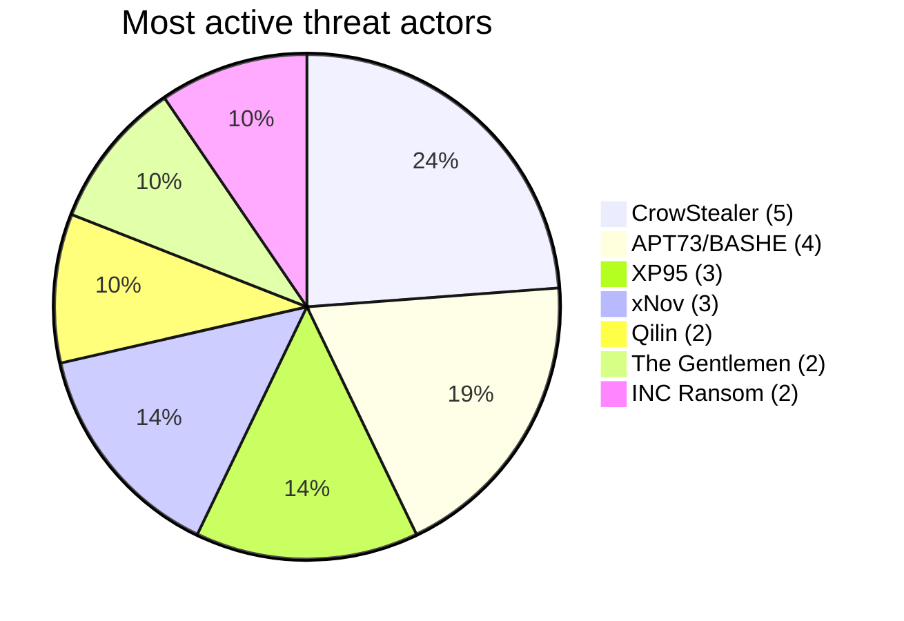
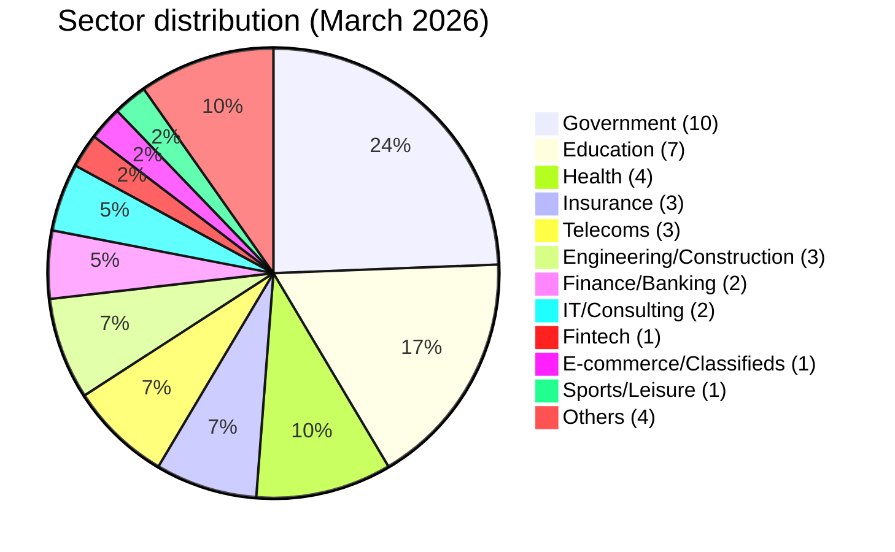

# CTI Report - Cyberattacks in Africa (March 2026)

👉🏾 [**French version available here**](./README_FR.md)
## 1. Executive summary

In March 2026, **41 cyber incidents** targeting African entities were publicly claimed or detected. The continent continues to face a dual threat: **ransomware** (encryption with ransom demand) and **data breaches / system intrusions** (exfiltration without encryption or direct financial fraud). Key findings:

- **19 ransomware attacks (46.3%)** and **22 data breaches / intrusions (53.7%)**.
- **14 countries** affected; **South Africa** (13 incidents), **Morocco** (8) and **Egypt** (8) account for 71% of all victims.
- **27 distinct threat actors**; **CrowStealer** (5 incidents), **APT73/BASHE** (4) and **XP95** (3) are the most active.
- **Government and education sectors** represent 39% of victims, highlighting a strategic focus on public institutions.
- Massive data leaks: Egyptian health ministry (3.8M records), Gauteng provincial government (3.8 TB), Remita Nigeria (3 TB), Stats SA (154 GB). In Morocco, several major breaches hit government institutions, including the Ministry of Justice (300 GB of court case files).
- New major incident: **UBA Senegal** - a coordinated cyber heist involving system compromise, database manipulation, and over 3,400 fraudulent ATM withdrawals totaling 1.143 billion FCFA (~$1.9M USD), disclosed in March but executed in late January.
- Emerging threats: **Loozap (Cameroon)** - 34,000 user accounts leaked (SHA1 passwords); **Guinea Ministry of Health** - suspected compromise of DHIS2 dashboards by actor Keymous.

### 📋 Victim list

👉🏾 [View full victim list](./victims.md)

## 2. Methodology

- **Scope**: 54 African countries.
- **Period**: 1 - 31 March 2026 (incidents disclosed or claimed during this month; actual attack dates may be earlier).
- **Sources**: Dark web, DLS (leak sites), OSINT, Telegram channels, underground forums, media reports.
- **Inclusion**: Publicly claimed or attributed incidents with identified victim, country, sector.
- **Typology**:
  - *Ransomware*: encryption + ransom demand (claim on DLS).
  - *Data breach / intrusion*: unencrypted exfiltration, database sold or published, or system compromise leading to financial fraud.

## 3. Global overview

| Indicator                     | Value |
|-------------------------------|-------|
| Total victims                 | 41    |
| Countries affected            | 14    |
| Distinct actors               | 27    |
| Ransomware incidents          | 19 (46.3%) |
| Data breaches / intrusions    | 22 (53.7%) |

**Most targeted countries:**
- 🇿🇦 South Africa: 13 victims
- 🇲🇦 Morocco: 8 victims
- 🇪🇬 Egypt: 8 victims
- 🇳🇬 Nigeria: 2 victims
- 🇨🇲 Cameroon: 1 victim
- 🇩🇿 Algeria: 1 victim
- 🇸🇳 Senegal: 1 victim
- 🇬🇳 Guinea: 1 victim
- 🇿🇲 Zambia: 1 victim
- 🇲🇬 Madagascar: 1 victim
- 🇹🇳 Tunisia: 1 victim
- 🇳🇦 Namibia: 1 victim
- 🇹🇿 Tanzania: 1 victim
- 🇨🇩 DRC: 1 victim

**Ransomware vs data breaches by country:**
| Country               | Ransomware | Data Breach |
|-----------------------|------------|-------------|
| South Africa          | 7          | 6           |
| Morocco               | 5          | 3           |
| Egypt                 | 3          | 5           |
| Nigeria               | 0          | 2           |
| Cameroon              | 0          | 1           |
| Algeria               | 0          | 1           |
| Senegal               | 0          | 1           |
| Guinea                | 0          | 1           |
| Zambia                | 0          | 1           |
| Madagascar            | 1          | 0           |
| Tunisia               | 1          | 0           |
| Namibia               | 1          | 0           |
| Tanzania              | 1          | 0           |
| DRC                   | 0          | 1           |

**Sector distribution:**
| Sector                    | Incidents | Percentage |
|---------------------------|-----------|------------|
| Government / Admin        | 10        | 24.4%      |
| Education / University    | 7         | 17.1%      |
| Health                    | 4         | 9.8%       |
| Insurance                 | 3         | 7.3%       |
| Telecommunications        | 3         | 7.3%       |
| Engineering/Construction  | 3         | 7.3%       |
| Finance / Banking         | 2         | 4.9%       |
| IT/Consulting             | 2         | 4.9%       |
| Fintech                   | 1         | 2.4%       |
| E-commerce / Classifieds  | 1         | 2.4%       |
| Sports / Leisure          | 1         | 2.4%       |
| Others                    | 4         | 9.8%       |

**Most prolific actors:**
| Actor            | Type            | Incidents | Primary targets |
|------------------|-----------------|-----------|-----------------|
| CrowStealer      | Data broker     | 5         | Egyptian government & education |
| APT73/BASHE      | Ransomware      | 4         | Moroccan state institutions |
| XP95             | Ransomware      | 3         | South African government |
| xNov             | Data breach     | 3         | Moroccan supply chain, South African sports |
| Qilin            | Ransomware      | 2         | Morocco, Madagascar |
| The Gentlemen    | Ransomware      | 2         | Tunisia, South Africa |
| INC Ransom       | Ransomware      | 2         | Namibia, South Africa |

## 4. Country-by-country overview

> All items presented originate from incidents claimed on the dark web, on ransomware group websites, and underground forums.

### 🇿🇦 South Africa (13 incidents: 7 ransomware, 6 data breaches)

South Africa recorded the highest victim count in March with 13 incidents across government, education, insurance, engineering, and IT sectors. The threat actor XP95 drove the most impactful events: Gauteng Provincial Government, with 3.8 TB of provincial data put up for sale at $25,000; Stats SA, the national statistics authority, with 154 GB exfiltrated and a $100,000 ransom demand; and GCRA, the Gauteng City Region Academy, with 147 GB taken. These are data extortion incidents, not standard ransomware: the threat actor XP95 sells exfiltrated data rather than encrypting systems. The Gauteng breach potentially compromises health, education, housing, and economic data for South Africa's most populous province. The threat actor Blackwinter99 published admin credentials for UNISA, Africa's largest distance learning institution, creating direct compromise risk. The threat actor LockBit 5.0 claimed Diesel-Electric Group, a major automotive components distributor. The threat actor Lynx claimed Lion of Africa Insurance, a specialized insurer. The threat actor DragonForce claimed The Unlimited, an insurance services company, with 137 GB alleged. The threat actor TheGentlemen claimed Elundini Municipality, a local government entity. The threat actor NightSpire claimed Semenya Furumele Consulting, a professional services firm. The threat actor INC Ransom claimed ETFSA, a wealth management provider. The threat actor TelephoneHooliganism offered access credentials to Walter Sisulu University for $1,150. The threat actor Coinbase Cartel claimed Nashua, an IT managed services provider. The threat actor xNov exposed an equestrian event database from Eventing South Africa.

---

### 🇲🇦 Morocco (8 incidents: 5 ransomware, 3 data breaches)

Morocco was heavily targeted in March, with a notable concentration on state institutions. The threat actor APT73/BASHE struck four strategic Moroccan entities: HACA, the audiovisual regulation authority; Maroc Telecom, the national telecommunications operator; 2M TV, the national public broadcaster; and IRES, the Royal Cabinet think tank. This concentration on state media and telecoms suggests a possible geopolitical motivation behind the campaign. The threat actor xNov exposed student health insurance records from ONOUSC, covering 3,631 entries, and published Smarteez supply chain data for the L'Oréal Morocco network, including 22 OAuth2 secrets and GPS coordinates for 296 pharmacies. The threat actor anisanas2 leaked 300 GB from the Ministry of Justice, including approximately 150,000 court case files. The threat actor Qilin claimed Outsourcia, a major BPO and business process services firm.

---

### 🇪🇬 Egypt (8 incidents: 3 ransomware, 5 data breaches)

Egypt recorded eight incidents in March, with the threat actor CrowStealer dominating through five systematic breaches targeting government and education infrastructure. The threat actor CrowStealer claimed Canadian International College (CIC Cairo) with 2,925 student records; the Waste Management Regulatory Authority (WMRA); Orascom Construction, one of Egypt's largest engineering groups; the Ministry of Health with 3.8 million patient records sold for $2,500; and the Ministry of Education. The Ministry of Health breach is the largest single health data exposure recorded by AFRINTEL for the continent in March. The threat actor Crypto24 claimed Rowad Modern Engineering. The threat actor PEAR claimed INTERACT Technology Solutions. The threat actor Payload claimed Grid Fine Finishes, a construction finishing services company.

---

### 🇳🇬 Nigeria (2 incidents: 2 data breaches)

Nigeria recorded two high-severity breaches. The threat actor Bytetobreach claimed Remita, operated by SystemSpecs and serving as Nigeria's government payment processing backbone, with 3 TB of data including KYC documents, source code, Docker registries, and government HSM encryption keys. The exposure of HSM keys constitutes a sovereign financial infrastructure risk. The threat actor AshleyWood2022 leaked more than 11,000 staff records from Ahmadu Bello University, one of Nigeria's largest federal universities.

---

### 🇸🇳 Senegal (1 incident: system intrusion)

UBA Senegal suffered a coordinated cyber-heist executed on January 30-31 but publicly disclosed on March 24. Attackers compromised the bank's internal systems, manipulated databases to increase withdrawal limits and transfer funds, then coordinated over 3,400 fraudulent ATM withdrawals across multiple cities, resulting in 1.143 billion FCFA (approximately $1.9 million) in losses. This incident represents a distinct attack category: direct financial fraud through system compromise, without ransomware deployment. The attack vector and actor identity have not been publicly confirmed.

---

### 🇿🇲 Zambia (1 incident: critical government breach)

ZISPIS, the national social protection information system, was claimed by the threat actor Spirigatito with approximately 34.1 million records (500 GB) allegedly exfiltrated, potentially affecting 15 million individuals. Exposed data categories include full personal, socioeconomic, financial, and GPS data. This represents one of the largest government data breaches in Sub-Saharan Africa recorded by AFRINTEL.

---

### 🇨🇲 Cameroon (1 incident)

Loozap, a classifieds and e-commerce platform, had 34,000 user accounts leaked by the threat actor zimablue, including SHA1-hashed passwords, IP addresses, and personal data. The use of SHA1 indicates inadequate security practices. The incident date was January 28, identified in March.

---

### 🇩🇿 Algeria (1 incident)

Bridges (tebridges.dz), a CRM services provider, had a database of 672,000 records sold for $1,743 by the threat actor Grubder. The attack date was February 2, identified in March.

---

### 🇬🇳 Guinea (1 incident: suspected)

Guinea's Ministry of Health had its DHIS2 health surveillance dashboards reportedly compromised by the threat actor Keymous. Activity was observed in July 2025 and identified in March 2026. Government staff records and health surveillance tools were potentially exposed. Published artifacts suggest credential-based access rather than a conventional data dump. Partially confirmed.

---

### 🇲🇬 Madagascar (1 incident)

Orange Madagascar, the national telecommunications operator and market leader, was claimed by the threat actor Qilin. Targeting a critical national telecoms operator poses risks to connectivity and communications infrastructure.

---

### 🇹🇳 Tunisia (1 incident)

K.PROPHA, a pharmaceutical distribution company, was claimed by the threat actor TheGentlemen.

---

### 🇳🇦 Namibia (1 incident)

Namibia Airports Company, the authority managing national airport infrastructure, was claimed by the threat actor INC Ransom. Airports represent critical national infrastructure with both physical and data security implications.

---

### 🇹🇿 Tanzania (1 incident)

SBC Tanzania, the PepsiCo bottling partner and beverage distributor, was claimed by the threat actor Morpheus.

---

### 🇨🇩 DRC (1 incident: historical)

FRAP, the Fund for the Reform of Public Administration, was breached in September 2025 by the threat actor privillege, with the incident identified and reported in March 2026. This highlights the delay between intrusion and public disclosure common in public administration breaches.

---

## 5. Detailed analysis by incident type

### 5.1 Ransomware (19 incidents)

| Country          | Ransomware attacks | Main actors |
|------------------|--------------------|-------------|
| South Africa     | 7                  | XP95 (3), LockBit 5.0, Lynx, DragonForce, The Gentlemen, NightSpire, INC Ransom, Coinbase Cartel |
| Morocco          | 5                  | APT73/BASHE (3), Qilin, The Gentlemen |
| Egypt            | 3                  | Crypto24, PEAR, Payload |
| Madagascar       | 1                  | Qilin |
| Tunisia          | 1                  | The Gentlemen |
| Namibia          | 1                  | INC Ransom |
| Tanzania         | 1                  | Morpheus |

**Key observations**:
- **XP95** emerged as a major threat in South Africa, striking Gauteng provincial government (3.8 TB), Stats SA (154 GB) and GCRA (147 GB). Data is being sold, not just encrypted.
- **APT73/BASHE** targeted strategic Moroccan institutions (HACA, Maroc Telecom, 2M TV, IRES), suggesting possible geopolitical motivation.
- Insurance sector heavily hit in South Africa (Lion of Africa, The Unlimited).

### 5.2 Data breaches / System intrusions (22 incidents)

| Country          | Breaches/Intrusions | Main actors |
|------------------|---------------------|-------------|
| Egypt            | 5                   | CrowStealer (5) |
| South Africa     | 6                   | xNov (2), TelephoneHooliganism, Blackwinter99, XP95 |
| Morocco          | 3                   | xNov (2), anisanas2 |
| Nigeria          | 2                   | AshleyWood2022, Bytetobreach |
| Cameroon         | 1                   | zimablue |
| Algeria          | 1                   | Grubder |
| Senegal          | 1                   | Coordinated network |
| Guinea           | 1                   | Keymous |
| Zambia           | 1                   | Spirigatito |
| DRC              | 1                   | privillege |

**Key observations**:
- **CrowStealer** dominates Egyptian breaches, including a medical database of 3.8 million patients (Ministry of Health) sold for $2,500.
- **xNov** exposed student records (ONOUSC, 3,631 entries), L'Oréal Morocco supply chain data (296 pharmacies, 361,000 sales records, OAuth2 secrets), and Eventing South Africa (equestrian database).
- **UBA Senegal** (disclosed in March, executed in late January): attackers compromised the internal information system, manipulated databases (created/modified accounts, increased withdrawal limits, transferred funds), then coordinated over 3,400 ATM withdrawals across multiple cities in a few hours, netting 1.143 billion FCFA (~$1.9M). Potential exploited vulnerabilities: lack of real-time SOC monitoring, insufficient anti-fraud procedures, possible internal complicity.
- **Loozap (Cameroon)** - 34,000 user accounts leaked with SHA1‑hashed passwords, IP addresses, personal data.
- **Guinea Ministry of Health** - suspected compromise of DHIS2 dashboards by Keymous, exposing health surveillance tools and government email/staff records.
- Massive Nigerian breaches: Remita (3 TB, including KYC documents and government HSM keys) and Ahmadu Bello University (11,000+ staff records).

## 6. Sectoral impact

| Sector                | Incidents | Percentage |
|-----------------------|-----------|------------|
| Government / Admin    | 10        | 24.4%      |
| Education / University| 7         | 17.1%      |
| Health                | 4         | 9.8%       |
| Insurance             | 3         | 7.3%       |
| Telecommunications    | 3         | 7.3%       |
| Engineering/Construction | 3      | 7.3%       |
| Finance / Banking     | 2         | 4.9%       |
| IT/Consulting         | 2         | 4.9%       |
| Fintech               | 1         | 2.4%       |
| E-commerce / Classifieds | 1      | 2.4%       |
| Sports / Leisure      | 1         | 2.4%       |
| Others                | 4         | 9.8%       |

**Takeaways**:
- Public sector (government + education) accounts for **41.5%** of all incidents.
- Health data remains highly valued: Egyptian health ministry breach (3.8M records), South African insurance leaks, Guinea health ministry compromise.
- Telecoms (Orange Madagascar, Maroc Telecom) are strategic targets.
- The UBA Senegal incident highlights a new trend: **direct financial fraud through system compromise**, bypassing traditional ransomware.
- E‑commerce platforms (Loozap) are increasingly targeted for user credential theft.

## 7. Threat actor profile

| Actor            | Type            | Incidents | Primary targets |
|------------------|-----------------|-----------|-----------------|
| CrowStealer      | Data broker     | 5         | Egyptian government & education |
| APT73/BASHE      | Ransomware      | 4         | Moroccan state institutions |
| XP95             | Ransomware      | 3         | South African government |
| xNov             | Data breach     | 3         | Moroccan supply chain, South African sports, education |
| Qilin            | Ransomware      | 2         | Morocco, Madagascar |
| The Gentlemen    | Ransomware      | 2         | Tunisia, South Africa |
| INC Ransom       | Ransomware      | 2         | Namibia, South Africa |

**Emerging actors**: xNov (supply chain focus), XP95 (South African government targeting), zimablue (Cameroon e‑commerce), Keymous (West African health ministries), Grubder (Algerian tech sector).

### 7.1 Risk assessment

| Country | Risk Level |
|--------|-----------|
| South Africa | 🔴 Critical |
| Morocco | 🔴 High |
| Egypt | 🔴 High |
| Nigeria | 🟠 Medium-High |
| Senegal | 🟠 Medium (post-UBA) |
| Cameroon | 🟠 Medium (emerging) |
| Guinea | 🟠 Medium |
| Others | 🟠 Medium |

## 8. Key trends and intelligence gaps

### Trends
1. **Ransomware evolves into data extortion** - XP95 and others sell exfiltrated data instead of merely encrypting.
2. **Supply chain attacks** - Smarteez (L'Oréal Morocco provider) shows vulnerability of digital service providers.
3. **Massive health data leaks** - Egyptian health ministry breach (3.8M records) highlights poor security in public health IT.
4. **Geopolitical targeting** - APT73/BASHE focus on Moroccan state media and telecoms.
5. **Direct financial fraud via system compromise** - UBA Senegal demonstrates that attackers bypass ransomware to go straight for the money, exploiting weak SOC and anti-fraud controls.
6. **E‑commerce credential theft** - Loozap (Cameroon) leak of 34,000 accounts with weak SHA1 hashing.

### Gaps
- Many attacks go undetected or unreported; this list only includes publicly disclosed incidents.
- Actual data volumes may be inflated by actors.
- The UBA Senegal attack was executed in late January but only disclosed in March - significant delay in public awareness.
- Guinea’s Ministry of Health compromise remains partially confirmed (correlated access, not full disclosure).

## 9. MITRE ATT&CK mapping (contextual)

| Incident | Techniques |
|---------|-----------|
| Smarteez | T1552 - Credentials in Files |
| Gauteng | T1041 - Exfiltration |
| ONOUSC | T1078 - Valid Accounts |
| Egypt Health DB | T1005 - Data from Local System |
| UBA Senegal | T1190 - Exploit Public-Facing App, T1078 - Valid Accounts, T1048 - Exfiltration over Alternative Protocol, T1531 - Account Manipulation |
| Loozap | T1190 - Exploit Public-Facing App, T1005 - Data from Local System (weak SHA1 storage) |
| Guinea Health | T1190, T1078 (suspected) |

**Common techniques observed**:
- T1566 - Phishing  
- T1190 - Exploit Public-Facing Application  
- T1041 - Exfiltration  
- T1078 - Valid Accounts  
- T1486 - Ransomware  
- T1531 - Account Manipulation (UBA Senegal)

## 10. Recommendations

### For African governments and enterprises
- **Database security**: Encrypt sensitive data, implement access controls, regular audits.
- **Third-party risk management**: Audit digital service providers, enforce cybersecurity clauses.
- **Incident response**: Offline backups, tabletop exercises, communication protocols.
- **Staff training**: Phishing awareness (primary initial vector).
- **Real-time monitoring**: Deploy or strengthen Security Operations Centers (SOC) with 24/7 capability; implement transaction anomaly detection (especially for financial institutions).
- **Anti-fraud mechanisms**: Dynamic withdrawal limits, automatic blocking on abnormal patterns, behavioral analysis.
- **Password security**: Enforce strong hashing (bcrypt, Argon2) instead of SHA1; implement MFA for all user accounts.

### For CTI analysts
- Monitor **XP95**, **xNov**, **zimablue**, **Keymous** for new campaigns.
- Track supply chain exposures (especially digital marketing and logistics providers).
- Prioritize monitoring of government, education, and health sectors in North, West, and Southern Africa.
- Watch for **non-ransomware financial intrusions** - UBA Senegal is likely not an isolated case.

## 11. SOC tactical recommendations

### Detection priorities
- Monitor **data exfiltration patterns (T1041)**  
- Detect **privileged account abuse (T1078)**  
- Track **API / OAuth misuse**  
- Analyze **outbound traffic anomalies**  
- For banks: implement **real-time ATM transaction anomaly detection** (velocity, location, amount spikes)

### Monitoring sources
- EDR / Sysmon  
- Firewall / Proxy  
- DNS logs  
- Identity logs  
- Core banking system logs (for financial institutions)

## 12. Strategic recommendations

- Enforce **MFA on all critical systems**  
- Implement **network segmentation** (separate ATM network from core banking)  
- Audit **third-party providers**  
- Maintain **offline backups**  
- Conduct **incident response exercises** including red-team simulations  
- **Regulatory push**: Central banks should mandate minimum SOC and fraud detection standards for financial institutions

## 13. Conclusion

March 2026 confirms that **Africa is a prime target for industrialized cybercrime**. The convergence of ransomware groups, data brokers, supply chain attacks, direct financial intrusions (UBA Senegal), and e‑commerce credential theft (Loozap) creates a high-risk environment. South Africa, Morocco, and Egypt remain the most affected, but **West and Central Africa are emerging as new hotspots** (Senegal, Cameroon, Guinea). Health ministries are increasingly targeted, as seen in Egypt and Guinea. Financial institutions and e‑commerce platforms must urgently strengthen real-time monitoring, anti-fraud capabilities, and password security. AFRINTEL will continue tracking these trends.

**AFRINTEL** - African Cyber Threat Intelligence 
[GitHub AFRINTEL](https://github.com/Hatchepsoute/AFRINTEL)
