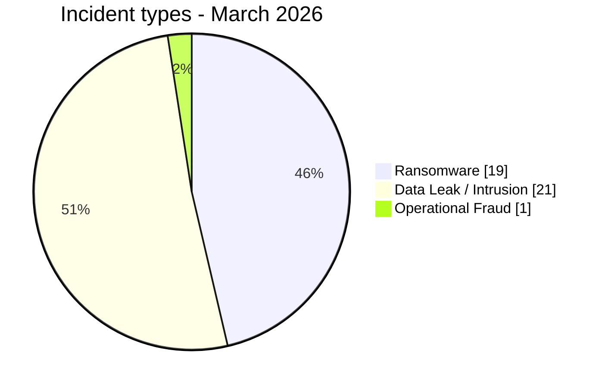
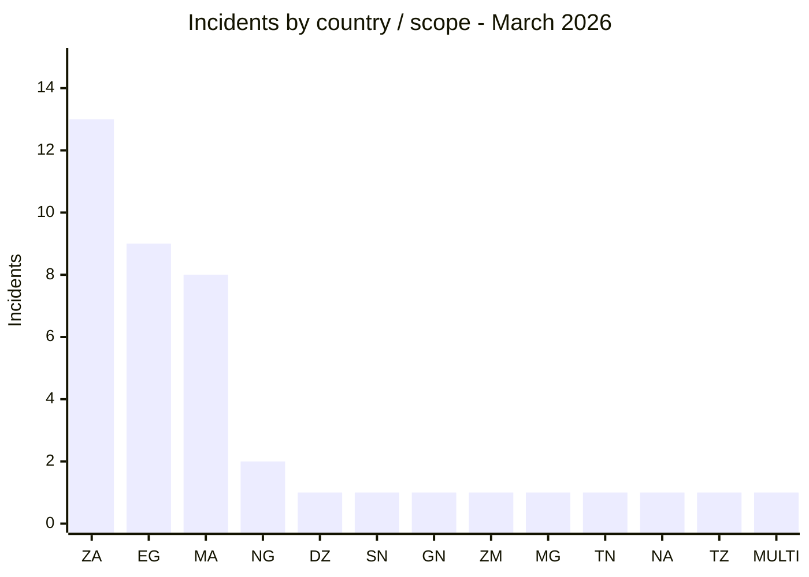
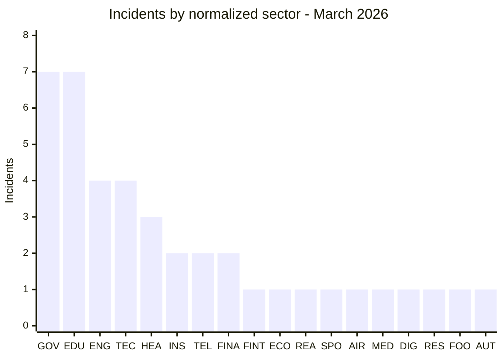
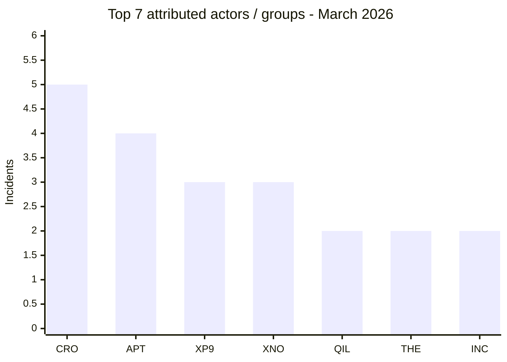
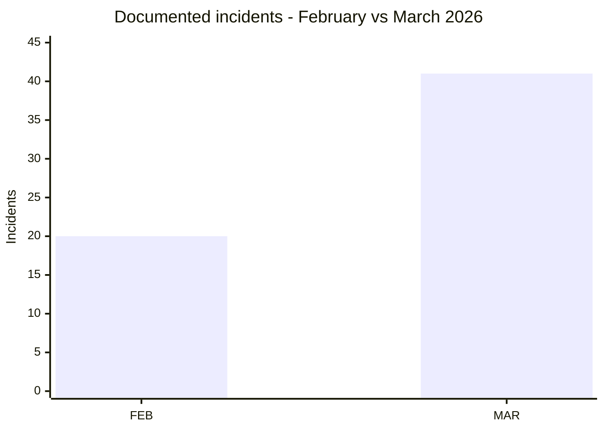

[](https://github.com/Hatchepsoute/AFRINTEL)


# CTI Report - Cyberattacks in Africa (March 2026)

👉🏾 [**French version available here**](./README_FR.md)

## 1. Executive summary

March 2026 records **41 incidents** disclosed, claimed or identified by AFRINTEL: **19 ransomware claims/publications (46.3%)**, **21 data leaks or system intrusions (51.2%)**, and **1 operational-fraud incident (2.4%)**.

**South Africa (13), Egypt (9) and Morocco (8) account for 30 of the 41 records, or 73.2%.** The month also shows a broader threat mix than February: data exposure and system compromise slightly exceed ransomware activity.

Several high-impact records involve government, education, health and financial environments. Examples include the **3.8 million-record claim** attributed to Egypt's Ministry of Health, **3.8 TB** attributed to Gauteng Provincial Government, **3 TB** attributed to Remita, and **300 GB** attributed to Morocco's Ministry of Justice. These figures remain subject to the evidence and limitations documented in the individual victim cards.

UBA Senegal is represented in this report under the newly formalized AFRINTEL category **Operational Fraud**. Its current historical victim card describes the event as operational fraud outside the previous four-type taxonomy; this report applies the updated six-type taxonomy without changing the underlying facts.

### Victim list

👉🏾 [View the full victim list](./victims.md)

---


### 1.1 Month-over-month comparison

> Comparison based on validated AFRINTEL monthly corpora. A change in documented records does not, by itself, prove a change in the real number of compromises.

| Indicator | February 2026 | March 2026 | Observed change |
|---|---:|---:|---:|
| Total incidents | 20 | 41 | **+21 (+105.0%)** |
| Ransomware | 20 | 19 | **-1 (-5.0%)** |
| Data Leak | 0 | 21 | **+21 (new)** |
| Access Sale | 0 | 0 | **0 (stable)** |
| DDoS | 0 | 0 | **0 (stable)** |
| Defacement | 0 | 0 | **0 (stable)** |
| Operational Fraud | 0 | 1 | **+1 (new)** |

> Reading rule: when the previous month is `0` and the current month is greater than `0`, the change is marked `new` instead of using an artificial percentage. Categories that are absent remain displayed as `0`.

## 2. Methodology

- **Scope:** African organizations and African multi-country datasets.
- **Period:** 1-31 March 2026; some incidents occurred earlier but were identified or disclosed during March.
- **Sources:** DLS/leak sites, underground forums, OSINT, public advisories and material reviewed in the individual victim records.
- **Counting rule:** one victim card = one global incident. The Loozap record remains one multi-country incident globally.
- **Taxonomy:** `Ransomware`, `Data Leak`, `Access Sale`, `DDoS`, `Defacement`, `Operational Fraud`. Only three categories are present in March.
- **Ransomware:** a publication or claim does not automatically establish encryption.
- **Evidence discipline:** claimed volumes, access and attribution are not upgraded to confirmed facts without supporting evidence.
- **Sector normalization:** each record is assigned once to one primary sector for statistical consistency.

---

## 3. Global overview

| Indicator | March 2026 |
|---|---:|
| Total incidents | **41** |
| Direct-country records | **40** |
| Multi-country records | **1** |
| Direct countries | **12** |
| Attributed actors / groups | **26** |
| Unattributed incidents | **1** |
| Ransomware | **19 (46.3%)** |
| Data leaks / intrusions | **21 (51.2%)** |
| Operational fraud | **1 (2.4%)** |

### 3.1 Incident-type distribution



**Color convention used throughout the report:** 🟧 Ransomware | 🟦 Data Leak / Intrusion | 🟩 Operational Fraud.


### 3.2 Country ranking

| Code | Country / scope | Ransomware | Data leak / intrusion | Operational fraud | Total |
|---|---|---:|---:|---:|---:|
| `ZA` | South Africa | 7 | 6 | 0 | **13** |
| `EG` | Egypt | 3 | 6 | 0 | **9** |
| `MA` | Morocco | 5 | 3 | 0 | **8** |
| `NG` | Nigeria | 0 | 2 | 0 | **2** |
| `DZ` | Algeria | 0 | 1 | 0 | **1** |
| `SN` | Senegal | 0 | 0 | 1 | **1** |
| `GN` | Guinea | 0 | 1 | 0 | **1** |
| `ZM` | Zambia | 0 | 1 | 0 | **1** |
| `MG` | Madagascar | 1 | 0 | 0 | **1** |
| `TN` | Tunisia | 1 | 0 | 0 | **1** |
| `NA` | Namibia | 1 | 0 | 0 | **1** |
| `TZ` | Tanzania | 1 | 0 | 0 | **1** |
| `MULTI` | Multi-country | 0 | 1 | 0 | **1** |
|  | **Total** | **19** | **21** | **1** | **41** |

```text
- `ZA` South Africa         █████████████ **13**
- `EG` Egypt                █████████ **9**
- `MA` Morocco              ████████ **8**
- `NG` Nigeria              ██ **2**
- `DZ` Algeria              █ **1**
- `SN` Senegal              █ **1**
- `GN` Guinea               █ **1**
- `ZM` Zambia               █ **1**
- `MG` Madagascar           █ **1**
- `TN` Tunisia              █ **1**
- `NA` Namibia              █ **1**
- `TZ` Tanzania             █ **1**
- `MULTI` Multi-country        █ **1**
```



**Country legend:** `ZA` = South Africa | `EG` = Egypt | `MA` = Morocco | `NG` = Nigeria | `DZ` = Algeria | `SN` = Senegal | `GN` = Guinea | `ZM` = Zambia | `MG` = Madagascar | `TN` = Tunisia | `NA` = Namibia | `TZ` = Tanzania | `MULTI` = Multi-country

### 3.3 Ransomware vs Data Leak / Intrusion by country

This comparison covers **40 of the 41 March incidents**: **19 ransomware records** and **21 data leaks / intrusions**. The UBA Senegal case is excluded from this two-category comparison because it is classified separately as **Operational Fraud**.

**Visual legend:** 🟧 Ransomware | 🟦 Data Leak / Intrusion | 🟩 Operational Fraud

| Code | Country / scope | Ransomware | Bar | Data leak / intrusion | Bar |
|---|---|---:|---|---:|---|
| `ZA` | South Africa | **7** | 🟧🟧🟧🟧🟧🟧🟧 | **6** | 🟦🟦🟦🟦🟦🟦 |
| `EG` | Egypt | **3** | 🟧🟧🟧 | **6** | 🟦🟦🟦🟦🟦🟦 |
| `MA` | Morocco | **5** | 🟧🟧🟧🟧🟧 | **3** | 🟦🟦🟦 |
| `NG` | Nigeria | **0** | - | **2** | 🟦🟦 |
| `DZ` | Algeria | **0** | - | **1** | 🟦 |
| `GN` | Guinea | **0** | - | **1** | 🟦 |
| `ZM` | Zambia | **0** | - | **1** | 🟦 |
| `MG` | Madagascar | **1** | 🟧 | **0** | - |
| `TN` | Tunisia | **1** | 🟧 | **0** | - |
| `NA` | Namibia | **1** | 🟧 | **0** | - |
| `TZ` | Tanzania | **1** | 🟧 | **0** | - |
| `MULTI` | Multi-country | **0** | - | **1** | 🟦 |
|  | **Compared total** | **19** |  | **21** |  |

```mermaid
xychart-beta
    title "Ransomware vs Data Leak / Intrusion by country - March 2026"
    x-axis ["ZA", "EG", "MA", "NG", "DZ", "GN", "ZM", "MG", "TN", "NA", "TZ", "MULTI"]
    y-axis "Incidents" 0 --> 8
    bar [7, 3, 5, 0, 0, 0, 0, 1, 1, 1, 1, 0]
    bar [6, 6, 3, 2, 1, 1, 1, 0, 0, 0, 0, 1]
```



**Series legend:** first bar series = 🟧 Ransomware | second bar series = 🟦 Data Leak / Intrusion.

**Country legend:** `ZA` = South Africa | `EG` = Egypt | `MA` = Morocco | `NG` = Nigeria | `DZ` = Algeria | `GN` = Guinea | `ZM` = Zambia | `MG` = Madagascar | `TN` = Tunisia | `NA` = Namibia | `TZ` = Tanzania | `MULTI` = Multi-country.

> 🟩 `SN` = Senegal: **1 Operational Fraud** incident, shown separately and not included in the 40-record comparison.

### 3.4 Regional distribution


| Region | Incidents | Share |
|---|---:|---:|
| North Africa | 19 | 46.3% |
| Southern Africa | 15 | 36.6% |
| West Africa | 4 | 9.8% |
| East Africa | 1 | 2.4% |
| Indian Ocean | 1 | 2.4% |
| Multi-country | 1 | 2.4% |
| **Total** | **41** | **100%** |

The regional view keeps the multi-country Loozap record separate rather than duplicating it across several regions.

---

## 4. Detailed analysis by incident type

### 4.1 Ransomware - 19 incidents

| Country | Incidents | Main actors / groups |
|---|---:|---|
| 🇿🇦 South Africa | **7** | LockBit 5.0, Lynx, DragonForce, TheGentlemen, NightSpire, INC Ransom, Coinbase Cartel |
| 🇲🇦 Morocco | **5** | APT73/BASHE (4), Qilin |
| 🇪🇬 Egypt | **3** | Crypto24, PEAR, Payload |
| 🇲🇬 Madagascar | **1** | Qilin |
| 🇹🇳 Tunisia | **1** | TheGentlemen |
| 🇳🇦 Namibia | **1** | INC Ransom |
| 🇹🇿 Tanzania | **1** | Morpheus |
| **Total** | **19** | |

APT73/BASHE accounts for four Moroccan publications: **HACA, Maroc Telecom, 2M TV and IRES**. South Africa shows the widest ransomware-group diversity in the month. These counts represent observed publications/claims and do not imply confirmed encryption for every victim.

### 4.2 Data leaks / system intrusions - 21 incidents

| Country / scope | Incidents | Main actors / groups |
|---|---:|---|
| 🇿🇦 South Africa | **6** | XP95 (3), xNov, TelephoneHooliganism, Blackwinter99 |
| 🇪🇬 Egypt | **6** | CrowStealer (5), Al-Sheikh |
| 🇲🇦 Morocco | **3** | xNov (2), anisanas2 |
| 🇳🇬 Nigeria | **2** | AshleyWood2022, Bytetobreach |
| 🌍 Multi-country | **1** | zimablue |
| 🇩🇿 Algeria | **1** | Grubder |
| 🇬🇳 Guinea | **1** | Keymous |
| 🇿🇲 Zambia | **1** | Spirigatito |
| **Total** | **21** | |

XP95 is associated with three South African exfiltration/extortion records: **Gauteng Provincial Government, Stats SA and GCRA**. CrowStealer accounts for five Egyptian data-publication records. Loozap remains a single global record despite the multi-country user exposure described in its sample.

### 4.3 Operational Fraud - 1 incident

| Victim | Country | Attribution | Classification |
|---|---|---|---|
| United Bank for Africa (UBA Senegal) | 🇸🇳 Senegal | Unattributed | **Operational Fraud** |

The source record describes a cyber-enabled ATM cash-out operation involving **3,421 transactions**. Privileged access to card-authorization infrastructure was assessed as likely in the referenced advisory, while the initial-access vector and exact technical sequence remain unknown.

---

## 5. Sectoral impact

| Code | Normalized sector | Incidents | Share |
|---|---|---:|---:|
| `GOV` | Government / Public administration | 7 | 17.1% |
| `EDU` | Education / Training | 7 | 17.1% |
| `ENG` | Engineering / Construction | 4 | 9.8% |
| `TEC` | Technology / IT / Consulting / BPO | 4 | 9.8% |
| `HEA` | Healthcare / Pharmaceutical | 3 | 7.3% |
| `INS` | Insurance | 2 | 4.9% |
| `TEL` | Telecommunications | 2 | 4.9% |
| `FINA` | Finance / Banking / Wealth management | 2 | 4.9% |
| `FINT` | Fintech / Payment services | 1 | 2.4% |
| `ECO` | E-commerce / Online classifieds | 1 | 2.4% |
| `REA` | Real estate / Classifieds | 1 | 2.4% |
| `SPO` | Sports / Leisure | 1 | 2.4% |
| `AIR` | Air transport | 1 | 2.4% |
| `MED` | Media / Audiovisual | 1 | 2.4% |
| `DIG` | Digital marketing / Supply-chain services | 1 | 2.4% |
| `RES` | Research / Think tank | 1 | 2.4% |
| `FOO` | Food & Beverage | 1 | 2.4% |
| `AUT` | Automotive | 1 | 2.4% |
|  | **Total** | **41** | **100%** |



**Sector legend:** `GOV` = Government / Public administration | `EDU` = Education / Training | `ENG` = Engineering / Construction | `TEC` = Technology / IT / Consulting / BPO | `HEA` = Healthcare / Pharmaceutical | `INS` = Insurance | `TEL` = Telecommunications | `FINA` = Finance / Banking / Wealth management | `FINT` = Fintech / Payment services | `ECO` = E-commerce / Online classifieds | `REA` = Real estate / Classifieds | `SPO` = Sports / Leisure | `AIR` = Air transport | `MED` = Media / Audiovisual | `DIG` = Digital marketing / Supply-chain services | `RES` = Research / Think tank | `FOO` = Food & Beverage | `AUT` = Automotive

Government/public administration and education/training each account for **7 incidents (17.1%)**, or **14 of 41 (34.1%) combined**.

---

## 6. Threat Actor Profile

| Code | Actor / Group | Incidents | Dominant activity |
|---|---|---:|---|
| `CRO` | CrowStealer | **5** | Data leaks |
| `APT` | APT73/BASHE | **4** | Ransomware |
| `XP9` | XP95 | **3** | Data exfiltration / extortion |
| `XNO` | xNov | **3** | Data leaks |
| `QIL` | Qilin | **2** | Ransomware |
| `THE` | TheGentlemen | **2** | Ransomware |
| `INC` | INC Ransom | **2** | Ransomware |



**Actor legend:** `CRO` = CrowStealer | `APT` = APT73/BASHE | `XP9` = XP95 | `XNO` = xNov | `QIL` = Qilin | `THE` = TheGentlemen | `INC` = INC Ransom

The chart is explicitly a **Top 7** view. The remaining **19 attributed actors each appear once**, and UBA Senegal is unattributed.

### 6.1 Monthly exposure assessment by country

This is a **volume-based monthly exposure indicator**, not a national cyber-risk rating:

- 🔴 **High:** 8 or more March incidents
- 🟠 **Medium:** 2-7 incidents
- 🟡 **Low-Medium:** 1 incident

| Country | March incidents | Exposure level |
|---|---:|---|
| 🇿🇦 South Africa | 13 | 🔴 High |
| 🇪🇬 Egypt | 9 | 🔴 High |
| 🇲🇦 Morocco | 8 | 🔴 High |
| 🇳🇬 Nigeria | 2 | 🟠 Medium |
| 🇩🇿 Algeria | 1 | 🟡 Low-Medium |
| 🇸🇳 Senegal | 1 | 🟡 Low-Medium |
| 🇬🇳 Guinea | 1 | 🟡 Low-Medium |
| 🇿🇲 Zambia | 1 | 🟡 Low-Medium |
| 🇲🇬 Madagascar | 1 | 🟡 Low-Medium |
| 🇹🇳 Tunisia | 1 | 🟡 Low-Medium |
| 🇳🇦 Namibia | 1 | 🟡 Low-Medium |
| 🇹🇿 Tanzania | 1 | 🟡 Low-Medium |

---

## 7. Key Trends & Intelligence Gaps

**Trends supported by the March corpus**

- March rises from **20 incidents in February to 41**, an increase of **21 records (+105.0%)**.
- Data leaks/intrusions represent **51.2%** of March, slightly above ransomware at **46.3%**.
- South Africa, Egypt and Morocco account for **73.2%** of the month's records.
- Government/public administration and education/training together account for **34.1%** of the normalized sector distribution.
- The actor landscape is fragmented: the Top 7 actors account for **21 incidents**, while 19 additional attributed actors appear once.



**Time legend:** `FEB` = February 2026 | `MAR` = March 2026.

**Priority intelligence gaps**

- Initial-access vectors remain unknown for several high-impact records.
- Claimed total volumes cannot always be independently validated from the available samples.
- Victim-side DFIR reporting or detailed public technical confirmation is absent for many claim-based incidents in the material available to AFRINTEL.
- Historical ransomware cards do not all contain complete lifecycle metadata, so negotiation, ransom payment, resale and final disclosure status must remain unknown unless separately documented.

---

## 8. MITRE ATT&CK Mapping - Contextual

Only techniques supported by specific March evidence or directly useful to interpret a documented record are listed.

| Technique | Name | March context | Assessment |
|---|---|---|---|
| **T1657** | Financial Theft | UBA Senegal ATM cash-out | Documented financial impact; exact intrusion sequence unknown |
| **T1552.001** | Unsecured Credentials: Credentials In Files | Remita source/configuration material | Hardcoded API/cloud/database credentials were described in reviewed technical material |
| **T1530** | Data from Cloud Storage Object | Remita cloud-storage exposure | Access to a KYC-related storage bucket was described in the reviewed material |
| **T1078** | Valid Accounts | UNISA administrative credentials | Defensive relevance; exposure was documented, adversary use is not independently confirmed |

No encryption technique is marked as observed solely because a victim appeared on a ransomware leak site.

---

## 9. Recommendations

| Organization type | Priority actions |
|---|---|
| Government / public administration | MFA for privileged accounts, privileged-access review, database export monitoring, tested offline backups |
| Education | Protect helpdesk/admin portals, enforce MFA, review exposed credentials, segment student/administrative systems |
| Finance / fintech | Monitor privileged transaction-control changes, cloud/IAM access, secrets management, fraud analytics and high-risk transaction patterns |
| Telecom / IT / BPO | Protect support and CRM platforms, rotate exposed secrets, monitor mailbox and administrative access, review third-party access |
| All organizations | Maintain incident-response evidence, centralize logs, preserve timelines and monitor for data exfiltration as well as encryption |

---

## 10. SOC & Tactical Recommendations

| Qualification | Defensive action | Relevant telemetry |
|---|---|---|
| **Observed** | Detect unusually large database exports and sustained outbound transfers | DB audit logs, EDR, proxy, firewall, cloud logs |
| **Observed** | Alert on access to sensitive cloud-storage locations and KYC repositories | Cloud audit logs, IAM, object-storage access logs |
| **Observed** | Detect exposure or use of hardcoded application/cloud secrets | Secret scanning, CI/CD logs, IAM, cloud audit |
| **Hypothesis** | Hunt for anomalous privileged authentication around high-impact incidents where initial access is unknown | VPN, SSO, IAM, Windows/Linux auth, PAM |
| **Preventive** | Enforce MFA, least privilege and privileged-session monitoring | IAM, PAM, IdP |
| **Preventive** | Separate backup infrastructure and test restoration | Backup platform, EDR, asset inventory |

Preventive controls are not presented as evidence that the corresponding adversary behavior was observed.

---

## 11. Strategic Recommendations

1. **Treat data exfiltration as a first-class incident scenario**, not only as a secondary ransomware effect.
2. **Standardize incident taxonomy and evidence status** across CTI, SOC and executive reporting.
3. **Improve victim-side technical disclosure and DFIR traceability** where legally and operationally possible, so claims can be compared with confirmed timelines and impact.
4. **Prioritize identity, secrets and cloud-storage governance** in sectors handling financial, government, education and health data.
5. **Maintain bilingual and arithmetic consistency** between victim records, monthly reports, statistics and STIX/OpenCTI exports.

---

## 12. Conclusion

March 2026 confirms a **clear increase in documented cyber activity across Africa**, with **41 incidents**, compared with 20 in February. The month also shows a more diversified threat landscape: **19 ransomware incidents, 21 data leaks or system intrusions, and 1 operational-fraud incident**.

**South Africa, Egypt and Morocco account for 73.2% of all incidents**, while the observed cases show that the threat extends beyond encryption to data exfiltration, system compromise, exposed secrets and cyber-enabled fraud.

For AFRINTEL, this reinforces the need to distinguish **actor claims, available evidence, confidence level and actual incident type** in order to maintain reliable monthly and semester-level cyber-threat assessments.

**AFRINTEL** - African Cyber Threat Intelligence  
Repository: https://github.com/Hatchepsoute/AFRINTEL
