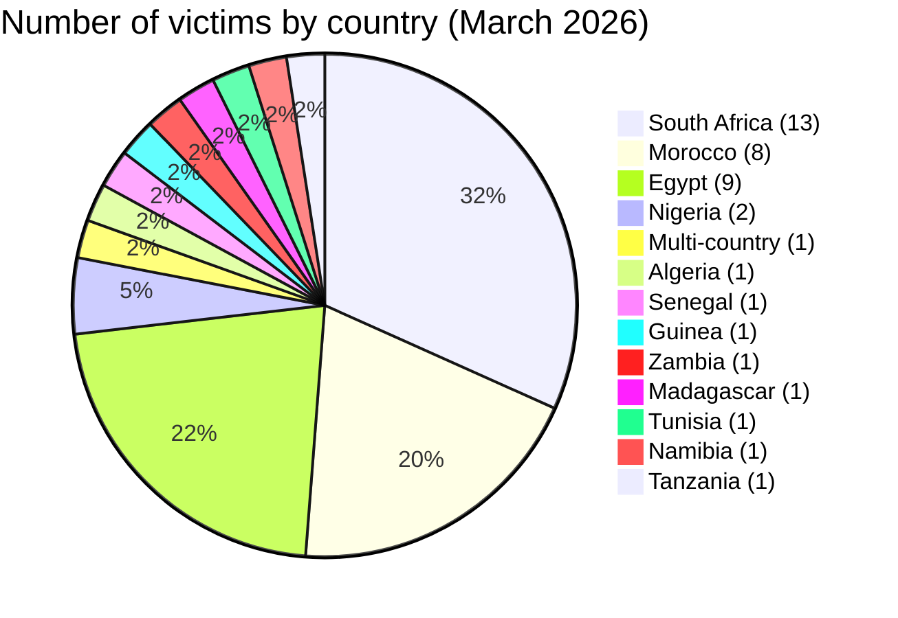
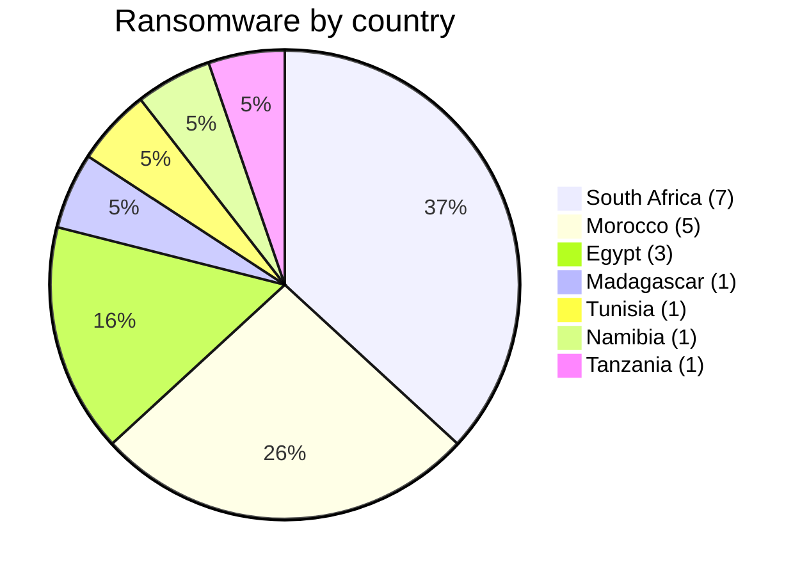
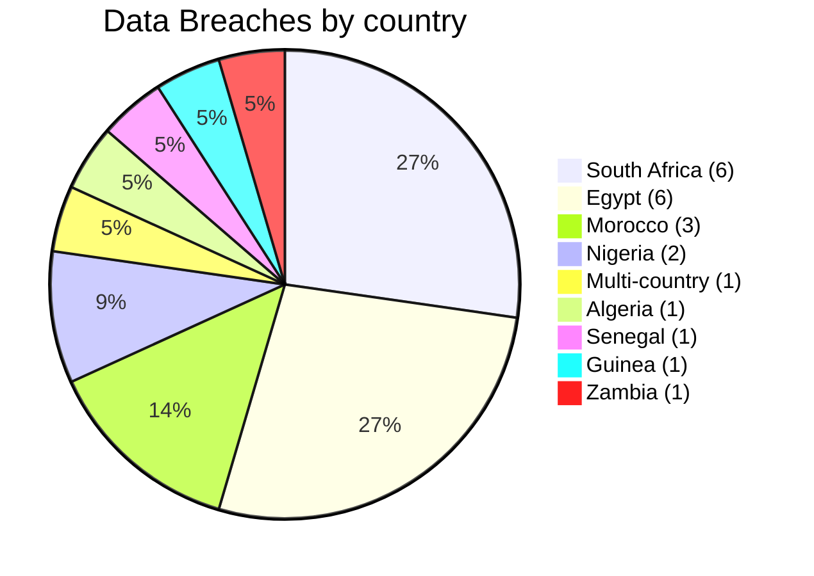
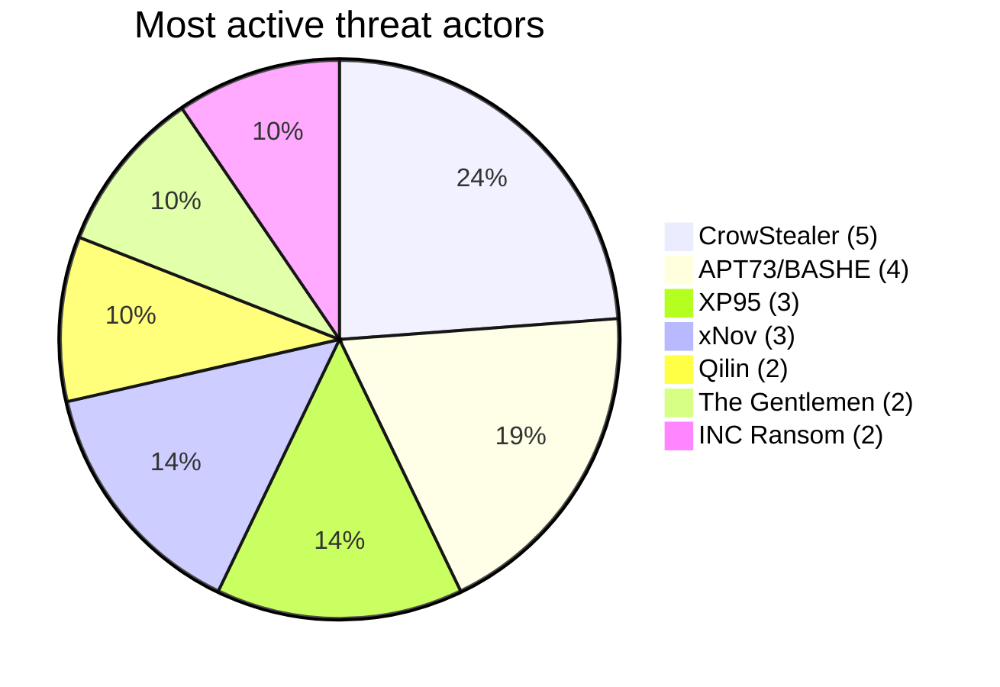
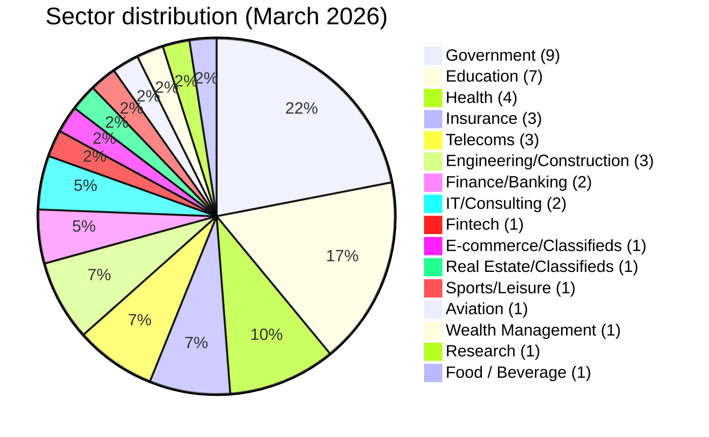

# CTI Report - Cyberattacks in Africa (March 2026)

👉🏾 [**French version available here**](./README_FR.md)
## 1. Executive summary

March 2026 brought in **41 cyber incidents** against African targets, claimed or detected over the month. The continent kept facing the same two-front threat it's seen all year: **ransomware claims or publications** on one side, **data breaches and system intrusions** on the other. A ransomware listing alone doesn't prove encryption happened or that anything got disrupted. Key findings:

- **19 ransomware attacks (46.3%)** and **22 data breaches / intrusions (53.7%)**.
- **13 countries** affected; **South Africa** (13 incidents), **Morocco** (8) and **Egypt** (9) account for 73% of all victims.
- **26 attributed threat actors and 1 incident without public attribution**; **CrowStealer** (5 incidents), **APT73/BASHE** (4) and **XP95** (3) are the most active.
- **Government and education sectors** represent 39% of victims, highlighting a strategic focus on public institutions.
- Massive data leaks: Egyptian health ministry (3.8M records), Gauteng provincial government (3.8 TB), Remita Nigeria (3 TB), Stats SA (154 GB). In Morocco, several major breaches hit government institutions, including the Ministry of Justice (300 GB of court case files).
- Updated major incident: **UBA Senegal** - ngCERT advisory ngCERT-2026-060005 reports 3,421 ATM transactions. Losses were previously reported at 1.143 billion FCFA; ngCERT describes them as exceeding USD 2 million. The operation occurred in late January and was disclosed in March.
- Emerging threats: **Loozap (Multi-country)** - 34,000 user accounts leaked (SHA1 passwords), affecting users across several African countries; **Guinea Ministry of Health** - suspected compromise of DHIS2 dashboards by actor Keymous.

### 📋 Victim list

👉🏾 [View full victim list](./victims.md)

## 2. Methodology

- **Scope**: 54 African countries.
- **Period**: 1 - 31 March 2026 (incidents disclosed or claimed during this month; actual attack dates may be earlier).
- **Sources**: Dark web, DLS (leak sites), OSINT, Telegram channels, underground forums, media reports.
- **Inclusion**: Publicly claimed or attributed incidents with identified victim, country, sector.
- **Typology**:
  - *Ransomware*: victim publication or claim by a ransomware group. Encryption is not presumed without supporting evidence.
  - *Data breach / intrusion*: unencrypted exfiltration, database sold or published, or system compromise leading to financial fraud.

## 3. Global overview

| Indicator                     | Value |
|-------------------------------|-------|
| Total victims                 | 41    |
| Countries affected            | 12 (plus 1 multi-country incident) |
| Attributed actors             | 26    |
| Ransomware incidents          | 19 (46.3%) |
| Data breaches / intrusions    | 22 (53.7%) |

**Most targeted countries:**
- 🇿🇦 South Africa: 13 victims
- 🇲🇦 Morocco: 8 victims
- 🇪🇬 Egypt: 9 victims
- 🇳🇬 Nigeria: 2 victims
- 🌍 Multi-country (Africa): 1 victim
- 🇩🇿 Algeria: 1 victim
- 🇸🇳 Senegal: 1 victim
- 🇬🇳 Guinea: 1 victim
- 🇿🇲 Zambia: 1 victim
- 🇲🇬 Madagascar: 1 victim
- 🇹🇳 Tunisia: 1 victim
- 🇳🇦 Namibia: 1 victim
- 🇹🇿 Tanzania: 1 victim

**Ransomware vs data breaches by country:**
| Country               | Ransomware | Data Breach |
|-----------------------|------------|-------------|
| South Africa          | 7          | 6           |
| Morocco               | 5          | 3           |
| Egypt                 | 3          | 6           |
| Nigeria               | 0          | 2           |
| Multi-country         | 0          | 1           |
| Algeria               | 0          | 1           |
| Senegal               | 0          | 1           |
| Guinea                | 0          | 1           |
| Zambia                | 0          | 1           |
| Madagascar            | 1          | 0           |
| Tunisia               | 1          | 0           |
| Namibia               | 1          | 0           |
| Tanzania              | 1          | 0           |

**Sector distribution:**
| Sector                    | Incidents | Percentage |
|---------------------------|-----------|------------|
| Government / Admin        | 9         | 22.0%      |
| Education / University    | 7         | 17.1%      |
| Health                    | 4         | 9.8%       |
| Insurance                 | 3         | 7.3%       |
| Telecommunications        | 3         | 7.3%       |
| Engineering/Construction  | 3         | 7.3%       |
| Finance / Banking         | 2         | 4.9%       |
| IT/Consulting             | 2         | 4.9%       |
| Fintech                   | 1         | 2.4%       |
| E-commerce / Classifieds  | 1         | 2.4%       |
| Real Estate / Classifieds | 1         | 2.4%       |
| Sports / Leisure          | 1         | 2.4%       |
| Aviation                  | 1         | 2.4%       |
| Wealth Management         | 1         | 2.4%       |
| Research / Think tank    | 1         | 2.4%       |
| Food / Beverage          | 1         | 2.4%       |

**Most prolific actors:**
| Actor            | Type            | Incidents | Primary targets |
|------------------|-----------------|-----------|-----------------|
| CrowStealer      | Data broker     | 5         | Egyptian government & education |
| APT73/BASHE      | Ransomware      | 4         | Moroccan state institutions |
| XP95             | Ransomware      | 3         | South African government |
| xNov             | Data breach     | 3         | Moroccan supply chain, South African sports |
| Qilin            | Ransomware      | 2         | Morocco, Madagascar |
| The Gentlemen    | Ransomware      | 2         | Tunisia, South Africa |
| INC Ransom       | Ransomware      | 2         | Namibia, South Africa |

## 4. Geographic summary

> **For details of each incident, see [`victims.md`](./victims.md).**

- **Concentration:** South Africa (13), Morocco (8) and Egypt (8) between them account for 29 of the month's 41 incidents, 70.7%.
- **Threat mix:** 19 ransomware claims or publications, 22 data breaches or system intrusions, spread across 14 countries.
- **Public-sector exposure:** government and education kept showing up, with sizable claims touching institutions in Egypt, Morocco, South Africa, Senegal and Guinea.
- **High-impact cases:** the reported UBA Senegal fraud, plus large-volume claims against the Egyptian Ministry of Health, the Gauteng provincial government, Remita and the Moroccan Ministry of Justice.

---

## 5. Detailed analysis by incident type

### 5.1 Ransomware (19 incidents)

| Country          | Ransomware attacks | Main actors |
|------------------|--------------------|-------------|
| South Africa     | 7                  | XP95 (3), LockBit 5.0, Lynx, DragonForce, The Gentlemen, NightSpire, INC Ransom, Coinbase Cartel |
| Morocco          | 5                  | APT73/BASHE (3), Qilin, The Gentlemen |
| Egypt            | 3                  | Crypto24, PEAR, Payload |
| Madagascar       | 1                  | Qilin |
| Tunisia          | 1                  | The Gentlemen |
| Namibia          | 1                  | INC Ransom |
| Tanzania         | 1                  | Morpheus |

**Key observations**:
- **XP95** turned into a major threat in South Africa this month, hitting Gauteng provincial government (3.8 TB), Stats SA (154 GB) and GCRA (147 GB). Data is being sold here, not just encrypted.
- **APT73/BASHE** went after strategic Moroccan institutions, HACA, Maroc Telecom, 2M TV, IRES, a pattern that hints at something more geopolitical than opportunistic.
- Insurance took a beating in South Africa too: Lion of Africa, The Unlimited.

### 5.2 Data breaches / System intrusions (22 incidents)

| Country          | Breaches/Intrusions | Main actors |
|------------------|---------------------|-------------|
| Egypt            | 6                   | CrowStealer (5), Al-Sheikh |
| South Africa     | 6                   | xNov (2), TelephoneHooliganism, Blackwinter99, XP95 |
| Morocco          | 3                   | xNov (2), anisanas2 |
| Nigeria          | 2                   | AshleyWood2022, Bytetobreach |
| Multi-country    | 1                   | zimablue |
| Algeria          | 1                   | Grubder |
| Senegal          | 1                   | Unattributed |
| Guinea           | 1                   | Keymous |
| Zambia           | 1                   | Spirigatito |

**Key observations**:
- **CrowStealer** dominates the Egyptian breaches, including a medical database covering 3.8 million patients (Ministry of Health) sold for $2,500.
- **xNov** put out student records (ONOUSC, 3,631 entries), L'Oréal Morocco supply-chain data (296 pharmacies, 361,000 sales records, OAuth2 secrets), and an equestrian database from Eventing South Africa.
- **UBA Senegal** (disclosed in March, but the operation ran in late January): per [ngCERT advisory ngCERT-2026-060005](https://cert.gov.ng/advisories/alert-on-cyber-enabled-atm-cash-out-attacks-targeting-african-financial-institutions), the cash-out involved 3,421 ATM transactions. Losses were previously put at 1.143 billion FCFA; ngCERT now says over USD 2 million. Privileged access to card-authorization infrastructure looks likely, but how it was obtained, the exact technical sequence and any insider involvement are all still unknown.
- **Loozap (multi-country)**, 34,000 user accounts leaked with SHA1-hashed passwords, IP addresses and personal data, touching users across Egypt, Kenya, Ghana, Ethiopia, Nigeria and Mozambique.
- **Guinea's Ministry of Health**, a suspected DHIS2 dashboard compromise by Keymous, exposing health surveillance tools plus government email and staff records.
- Two big Nigerian breaches: Remita (3 TB, KYC documents and government HSM keys among it) and Ahmadu Bello University (11,000+ staff records).

## 6. Sectoral impact

| Sector                | Incidents | Percentage |
|-----------------------|-----------|------------|
| Government / Admin    | 9         | 22.0%      |
| Education / University| 7         | 17.1%      |
| Health                | 4         | 9.8%       |
| Insurance             | 3         | 7.3%       |
| Telecommunications    | 3         | 7.3%       |
| Engineering/Construction | 3      | 7.3%       |
| Finance / Banking     | 2         | 4.9%       |
| IT/Consulting         | 2         | 4.9%       |
| Fintech               | 1         | 2.4%       |
| E-commerce / Classifieds | 1      | 2.4%       |
| Real Estate / Classifieds | 1    | 2.4%       |
| Sports / Leisure      | 1         | 2.4%       |
| Aviation              | 1         | 2.4%       |
| Wealth Management     | 1         | 2.4%       |
| Research / Think tank| 1         | 2.4%       |
| Food / Beverage      | 1         | 2.4%       |

**Takeaways**:
- Public sector, government plus education, makes up **39%** of the month's incidents.
- Health data is still a prime target: the Egyptian health ministry breach (3.8M records), South African insurance leaks, and Guinea's health ministry compromise all point the same way.
- Telecoms, Orange Madagascar, Maroc Telecom, keep coming up as strategic targets.
- UBA Senegal is a different kind of risk worth calling out on its own: **direct financial fraud against payment-authorization controls**, not the usual ransomware playbook.
- E-commerce platforms like Loozap are seeing more credential-theft targeting.

## 7. Threat actor profile

| Actor            | Type            | Incidents | Primary targets |
|------------------|-----------------|-----------|-----------------|
| CrowStealer      | Data broker     | 5         | Egyptian government & education |
| APT73/BASHE      | Ransomware      | 4         | Moroccan state institutions |
| XP95             | Ransomware      | 3         | South African government |
| xNov             | Data breach     | 3         | Moroccan supply chain, South African sports, education |
| Qilin            | Ransomware      | 2         | Morocco, Madagascar |
| The Gentlemen    | Ransomware      | 2         | Tunisia, South Africa |
| INC Ransom       | Ransomware      | 2         | Namibia, South Africa |

**Emerging actors**: xNov (supply chain focus), XP95 (South African government targeting), zimablue (pan-African e‑commerce), Keymous (West African health ministries), Grubder (Algerian tech sector).

### 7.1 Risk assessment

| Country | Risk Level |
|--------|-----------|
| South Africa | 🔴 Critical |
| Morocco | 🔴 High |
| Egypt | 🔴 High |
| Nigeria | 🟠 Medium-High |
| Senegal | 🟠 Medium (post-UBA) |
| Multi-country (Loozap) | 🟠 Medium (emerging) |
| Guinea | 🟠 Medium |
| Remaining countries | 🟠 Medium |

## 8. Key trends and intelligence gaps

### Trends
1. **Ransomware is drifting toward data extortion.** XP95 and others are selling what they exfiltrate instead of just encrypting it.
2. **Supply-chain exposure is showing up.** Smarteez, an L'Oréal Morocco provider, is a reminder that digital service providers are a weak point too.
3. **Health data leaks got big this month.** The Egyptian health ministry breach, 3.8M records, points to real gaps in public health IT security.
4. **Some of this looks geopolitical.** APT73/BASHE went specifically after Moroccan state media and telecoms.
5. **UBA Senegal is a different kind of threat.** Direct financial fraud against payment-authorization controls, coordinated cash-out at scale. The public evidence doesn't say how they got in or which SOC control failed.
6. **E-commerce credentials are being stolen.** Loozap's multi-country leak, 34,000 accounts, weak SHA1 hashing, hit users across several African countries at once.

### Gaps
- Many attacks go undetected or unreported; this list only includes publicly disclosed incidents.
- Actual data volumes may be inflated by actors.
- The UBA Senegal operation occurred in late January, was disclosed in March and was subsequently documented by ngCERT on 25 June 2026; the initial-access vector remains unknown.
- Guinea’s Ministry of Health compromise remains partially confirmed (correlated access, not full disclosure).

## 9. MITRE ATT&CK mapping (contextual)

| Phase | Technique | Analytical scope |
| :--- | :--- | :--- |
| Initial access | T1566 - Phishing | Defensive detection hypothesis, not observed from the claims alone |
| Initial access | T1190 - Exploit Public-Facing Application | Defensive detection hypothesis, not observed from the claims alone |
| Account access | T1078 - Valid Accounts | Relevant to access or credential sales, without confirming use of the accounts |
| Collection | T1005 - Data from Local System | Contextual hypothesis when internal data is published; the collection mechanism remains unknown |
| Impact | T1486 - Data Encrypted for Impact | Relevant to ransomware preparedness, without confirming encryption for every entry |

> These techniques are defensive hypotheses. A claim, data sale or leak-site publication is not sufficient to treat them as observed.

## 10. Recommendations

### For African governments and enterprises
- **Database security**: Encrypt sensitive data, implement access controls, regular audits.
- **Third-party risk management**: Audit digital service providers, enforce cybersecurity clauses.
- **Incident response**: Offline backups, tabletop exercises, communication protocols.
- **Staff training**: Phishing awareness (primary initial vector).
- **Real-time monitoring**: Deploy or strengthen Security Operations Centers (SOC) with 24/7 capability; implement transaction anomaly detection (especially for financial institutions).
- **Anti-fraud mechanisms**: Dynamic withdrawal limits, automatic blocking on abnormal patterns, behavioral analysis.
- **Password security**: Enforce strong hashing (bcrypt, Argon2) instead of SHA1; implement MFA for all user accounts.

### For CTI analysts
- Monitor **XP95**, **xNov**, **zimablue**, **Keymous** for new campaigns.
- Track supply chain exposures (especially digital marketing and logistics providers).
- Prioritize monitoring of government, education, and health sectors in North, West, and Southern Africa.
- Watch for **non-ransomware financial intrusions** - UBA Senegal warrants broader monitoring of cash-out activity across African financial institutions.

## 11. SOC tactical recommendations

### Detection priorities
- Monitor **data exfiltration patterns (T1041)**  
- Detect **privileged account abuse (T1078)**  
- Track **API / OAuth misuse**  
- Analyze **outbound traffic anomalies**  
- For banks: implement **real-time ATM transaction anomaly detection** (velocity, location, amount spikes)

### Monitoring sources
- EDR / Sysmon  
- Firewall / Proxy  
- DNS logs  
- Identity logs  
- Core banking system logs (for financial institutions)

## 12. Strategic recommendations

- Enforce **MFA on all critical systems**  
- Implement **network segmentation** (separate ATM network from core banking)  
- Audit **third-party providers**  
- Maintain **offline backups**  
- Conduct **incident response exercises** including red-team simulations  
- **Regulatory push**: Central banks should mandate minimum SOC and fraud detection standards for financial institutions

## 13. Conclusion

March makes the case that **Africa has become a prime target for industrialized cybercrime**. Ransomware groups, data brokers, supply-chain attacks, direct financial fraud (UBA Senegal), and e-commerce credential theft (Loozap) all converging in one month adds up to a genuinely high-risk environment. South Africa, Morocco and Egypt still take the brunt of it, but **West Africa is emerging as a new hotspot**, Senegal and Guinea both, alongside a multi-country credential leak that hit several African e-commerce markets at once. Health ministries keep getting targeted, Egypt and Guinea both this month. Financial institutions and e-commerce platforms need to move fast on real-time monitoring, anti-fraud controls and password security. AFRINTEL keeps watching how this develops.

**AFRINTEL** - African Cyber Threat Intelligence 
[GitHub AFRINTEL](https://github.com/Hatchepsoute/AFRINTEL)
