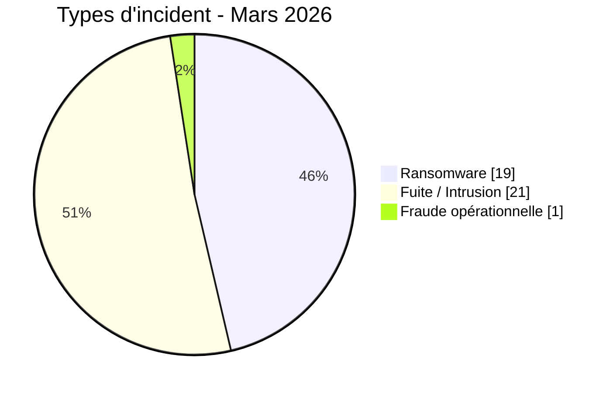
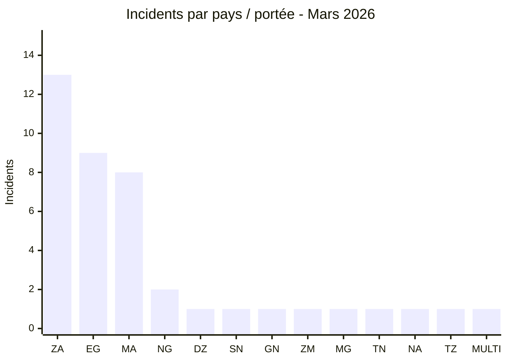
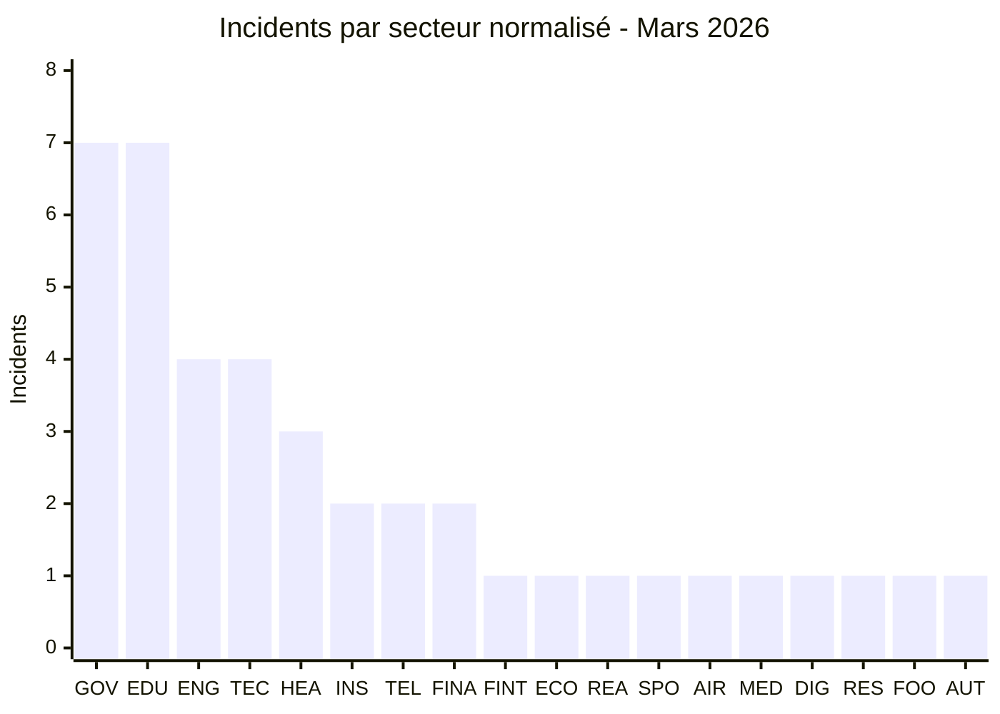
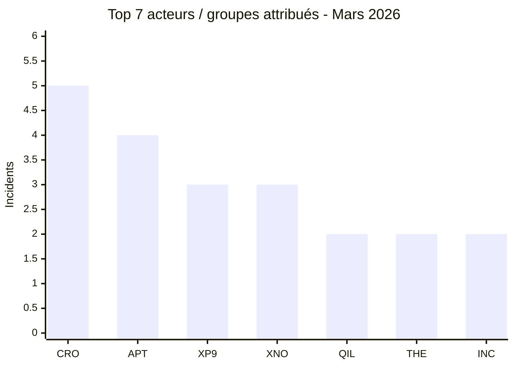
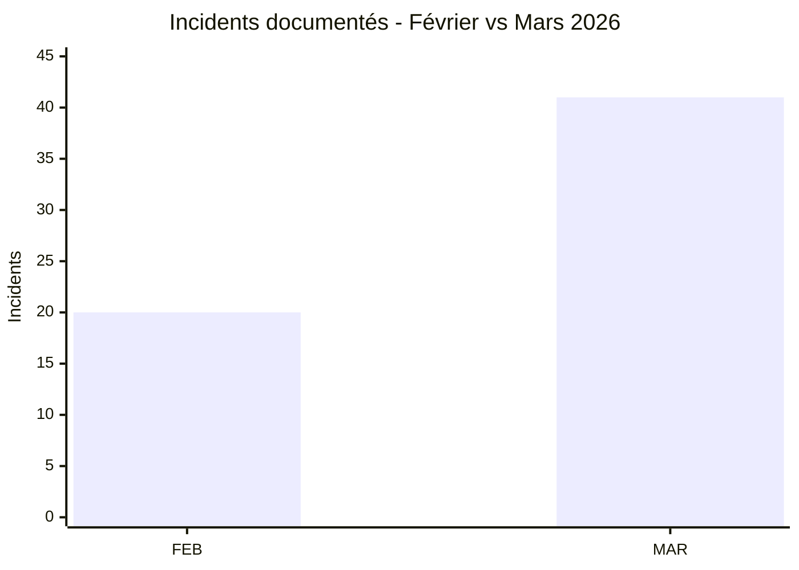

[](https://github.com/Hatchepsoute/AFRINTEL)


# Rapport CTI - Cyberattaques en Afrique (Mars 2026)

👉🏾 [**English version available here**](./README.md)

## 1. Synthèse exécutive

Mars 2026 totalise **41 incidents** divulgués, revendiqués ou identifiés par AFRINTEL : **19 revendications/publications ransomware (46,3 %)**, **21 fuites de données ou intrusions système (51,2 %)** et **1 incident de fraude opérationnelle (2,4 %)**.

**L’Afrique du Sud (13), l’Égypte (9) et le Maroc (8) concentrent 30 des 41 fiches, soit 73,2 %.** Le mois montre également une menace plus diversifiée qu’en février : les expositions de données et compromissions système dépassent légèrement l’activité ransomware.

Plusieurs dossiers à fort impact concernent des environnements gouvernementaux, éducatifs, sanitaires et financiers. On retrouve notamment la revendication de **3,8 millions d’enregistrements** attribuée au ministère égyptien de la Santé, **3,8 To** attribués au Gouvernement provincial du Gauteng, **3 To** attribués à Remita et **300 Go** attribués au ministère marocain de la Justice. Ces chiffres restent soumis aux éléments et limites documentés dans chaque fiche victime.

UBA Sénégal est représenté dans ce rapport selon la nouvelle catégorie AFRINTEL **Fraude opérationnelle**. Sa fiche historique actuelle décrit l’événement comme une fraude opérationnelle hors de l’ancienne taxonomie à quatre types ; le présent rapport applique la nouvelle taxonomie à six types sans modifier les faits sous-jacents.

### Liste des victimes

👉🏾 [Voir la liste complète des victimes](./victims_FR.md)

---


### 1.1 Comparaison avec le mois précédent

> Comparaison fondée sur les corpus mensuels AFRINTEL validés. Une variation du nombre de fiches documentées ne prouve pas, à elle seule, une variation du nombre réel de compromissions.

| Indicateur | Février 2026 | Mars 2026 | Évolution observée |
|---|---:|---:|---:|
| Total incidents | 20 | 41 | **+21 (+105,0 %)** |
| Ransomware | 20 | 19 | **-1 (-5,0 %)** |
| Data Leak | 0 | 21 | **+21 (nouveau)** |
| Access Sale | 0 | 0 | **0 (stable)** |
| DDoS | 0 | 0 | **0 (stable)** |
| Defacement | 0 | 0 | **0 (stable)** |
| Operational Fraud | 0 | 1 | **+1 (nouveau)** |

> Règle de lecture : si la valeur du mois précédent est `0` et celle du mois courant est supérieure à `0`, l'évolution est indiquée comme `nouveau` plutôt qu'avec un pourcentage artificiel. Les catégories absentes restent affichées à `0`.

## 2. Méthodologie

- **Périmètre :** organisations africaines et jeux de données multi-pays africains.
- **Période :** 1er-31 mars 2026 ; certains incidents sont antérieurs mais ont été identifiés ou révélés durant le mois.
- **Sources :** DLS/sites de fuite, forums underground, OSINT, avis publics et éléments examinés dans les fiches victimes.
- **Règle de comptage :** une fiche victime = un incident global. Loozap reste une seule fiche multi-pays.
- **Taxonomie :** `Ransomware`, `Data Leak`, `Access Sale`, `DDoS`, `Defacement`, `Operational Fraud`. Trois catégories seulement sont présentes en mars.
- **Ransomware :** une publication ou revendication ne permet pas de conclure automatiquement à un chiffrement.
- **Discipline de preuve :** volumes, accès et attributions revendiqués ne sont pas transformés en faits confirmés sans éléments suffisants.
- **Normalisation sectorielle :** chaque fiche est comptée une seule fois dans un secteur principal.

---

## 3. Vue d’ensemble

| Indicateur | Mars 2026 |
|---|---:|
| Total incidents | **41** |
| Fiches rattachées directement à un pays | **40** |
| Fiches multi-pays | **1** |
| Pays directs | **12** |
| Acteurs / Groupes attribués | **26** |
| Incidents non attribués | **1** |
| Ransomware | **19 (46,3 %)** |
| Fuites / intrusions | **21 (51,2 %)** |
| Fraude opérationnelle | **1 (2,4 %)** |

### 3.1 Répartition par type d’incident



**Convention couleur utilisée dans le rapport :** 🟧 Ransomware | 🟦 Fuite de données / intrusion | 🟩 Fraude opérationnelle.


### 3.2 Classement par pays

| Code | Pays / portée | Ransomware | Fuite / intrusion | Fraude opérationnelle | Total |
|---|---|---:|---:|---:|---:|
| `ZA` | Afrique du Sud | 7 | 6 | 0 | **13** |
| `EG` | Égypte | 3 | 6 | 0 | **9** |
| `MA` | Maroc | 5 | 3 | 0 | **8** |
| `NG` | Nigeria | 0 | 2 | 0 | **2** |
| `DZ` | Algérie | 0 | 1 | 0 | **1** |
| `SN` | Sénégal | 0 | 0 | 1 | **1** |
| `GN` | Guinée | 0 | 1 | 0 | **1** |
| `ZM` | Zambie | 0 | 1 | 0 | **1** |
| `MG` | Madagascar | 1 | 0 | 0 | **1** |
| `TN` | Tunisie | 1 | 0 | 0 | **1** |
| `NA` | Namibie | 1 | 0 | 0 | **1** |
| `TZ` | Tanzanie | 1 | 0 | 0 | **1** |
| `MULTI` | Multi-pays | 0 | 1 | 0 | **1** |
|  | **Total** | **19** | **21** | **1** | **41** |

```text
- `ZA` Afrique du Sud       █████████████ **13**
- `EG` Égypte               █████████ **9**
- `MA` Maroc                ████████ **8**
- `NG` Nigeria              ██ **2**
- `DZ` Algérie              █ **1**
- `SN` Sénégal              █ **1**
- `GN` Guinée               █ **1**
- `ZM` Zambie               █ **1**
- `MG` Madagascar           █ **1**
- `TN` Tunisie              █ **1**
- `NA` Namibie              █ **1**
- `TZ` Tanzanie             █ **1**
- `MULTI` Multi-pays           █ **1**
```



**Légende pays :** `ZA` = Afrique du Sud | `EG` = Égypte | `MA` = Maroc | `NG` = Nigeria | `DZ` = Algérie | `SN` = Sénégal | `GN` = Guinée | `ZM` = Zambie | `MG` = Madagascar | `TN` = Tunisie | `NA` = Namibie | `TZ` = Tanzanie | `MULTI` = Multi-pays

### 3.3 Comparaison Ransomware vs Fuite / intrusion par pays

Cette comparaison couvre **40 des 41 incidents de mars** : **19 ransomware** et **21 fuites de données / intrusions**. Le cas UBA Sénégal est exclu de cette comparaison à deux catégories car il est classé séparément en **Fraude opérationnelle**.

**Légende visuelle :** 🟧 Ransomware | 🟦 Fuite de données / intrusion | 🟩 Fraude opérationnelle

| Code | Pays / portée | Ransomware | Barre | Fuite / intrusion | Barre |
|---|---|---:|---|---:|---|
| `ZA` | Afrique du Sud | **7** | 🟧🟧🟧🟧🟧🟧🟧 | **6** | 🟦🟦🟦🟦🟦🟦 |
| `EG` | Égypte | **3** | 🟧🟧🟧 | **6** | 🟦🟦🟦🟦🟦🟦 |
| `MA` | Maroc | **5** | 🟧🟧🟧🟧🟧 | **3** | 🟦🟦🟦 |
| `NG` | Nigeria | **0** | - | **2** | 🟦🟦 |
| `DZ` | Algérie | **0** | - | **1** | 🟦 |
| `GN` | Guinée | **0** | - | **1** | 🟦 |
| `ZM` | Zambie | **0** | - | **1** | 🟦 |
| `MG` | Madagascar | **1** | 🟧 | **0** | - |
| `TN` | Tunisie | **1** | 🟧 | **0** | - |
| `NA` | Namibie | **1** | 🟧 | **0** | - |
| `TZ` | Tanzanie | **1** | 🟧 | **0** | - |
| `MULTI` | Multi-pays | **0** | - | **1** | 🟦 |
|  | **Total comparé** | **19** |  | **21** |  |

```mermaid
xychart-beta
    title "Ransomware vs Fuite / intrusion par pays - Mars 2026"
    x-axis ["ZA", "EG", "MA", "NG", "DZ", "GN", "ZM", "MG", "TN", "NA", "TZ", "MULTI"]
    y-axis "Incidents" 0 --> 8
    bar [7, 3, 5, 0, 0, 0, 0, 1, 1, 1, 1, 0]
    bar [6, 6, 3, 2, 1, 1, 1, 0, 0, 0, 0, 1]
```



**Légende des séries :** première série de barres = 🟧 Ransomware | deuxième série de barres = 🟦 Fuite de données / intrusion.

**Légende pays :** `ZA` = Afrique du Sud | `EG` = Égypte | `MA` = Maroc | `NG` = Nigeria | `DZ` = Algérie | `GN` = Guinée | `ZM` = Zambie | `MG` = Madagascar | `TN` = Tunisie | `NA` = Namibie | `TZ` = Tanzanie | `MULTI` = Multi-pays.

> 🟩 `SN` = Sénégal : **1 incident de fraude opérationnelle**, présenté séparément et non inclus dans le comparatif des 40 incidents.

### 3.4 Répartition régionale


| Région | Incidents | Part |
|---|---:|---:|
| Afrique du Nord | 19 | 46,3 % |
| Afrique australe | 15 | 36,6 % |
| Afrique de l’Ouest | 4 | 9,8 % |
| Afrique de l’Est | 1 | 2,4 % |
| Océan Indien | 1 | 2,4 % |
| Multi-pays | 1 | 2,4 % |
| **Total** | **41** | **100 %** |

La vue régionale conserve la fiche Loozap dans une catégorie multi-pays distincte afin de ne pas dupliquer le même incident dans plusieurs régions.

---

## 4. Analyse détaillée par type d’incident

### 4.1 Ransomware - 19 incidents

| Pays | Incidents | Acteurs / Groupes principaux |
|---|---:|---|
| 🇿🇦 Afrique du Sud | **7** | LockBit 5.0, Lynx, DragonForce, TheGentlemen, NightSpire, INC Ransom, Coinbase Cartel |
| 🇲🇦 Maroc | **5** | APT73/BASHE (4), Qilin |
| 🇪🇬 Égypte | **3** | Crypto24, PEAR, Payload |
| 🇲🇬 Madagascar | **1** | Qilin |
| 🇹🇳 Tunisie | **1** | TheGentlemen |
| 🇳🇦 Namibie | **1** | INC Ransom |
| 🇹🇿 Tanzanie | **1** | Morpheus |
| **Total** | **19** | |

APT73/BASHE représente quatre publications marocaines : **HACA, Maroc Telecom, 2M TV et IRES**. L’Afrique du Sud présente la plus grande diversité de groupes ransomware du mois. Ces compteurs décrivent des publications/revendications observées et ne signifient pas qu’un chiffrement a été confirmé pour chaque victime.

### 4.2 Fuites de données / intrusions système - 21 incidents

| Pays / portée | Incidents | Acteurs / Groupes principaux |
|---|---:|---|
| 🇿🇦 Afrique du Sud | **6** | XP95 (3), xNov, TelephoneHooliganism, Blackwinter99 |
| 🇪🇬 Égypte | **6** | CrowStealer (5), Al-Sheikh |
| 🇲🇦 Maroc | **3** | xNov (2), anisanas2 |
| 🇳🇬 Nigeria | **2** | AshleyWood2022, Bytetobreach |
| 🌍 Multi-pays | **1** | zimablue |
| 🇩🇿 Algérie | **1** | Grubder |
| 🇬🇳 Guinée | **1** | Keymous |
| 🇿🇲 Zambie | **1** | Spirigatito |
| **Total** | **21** | |

XP95 est associé à trois dossiers sud-africains d’exfiltration/extorsion : **Gouvernement provincial du Gauteng, Stats SA et GCRA**. CrowStealer représente cinq publications de données égyptiennes. Loozap reste une seule fiche globale malgré l’exposition multi-pays décrite dans son échantillon.

### 4.3 Fraude opérationnelle - 1 incident

| Victime | Pays | Attribution | Classification |
|---|---|---|---|
| United Bank for Africa (UBA Sénégal) | 🇸🇳 Sénégal | Non attribué | **Fraude opérationnelle** |

La fiche source décrit une opération de cash-out cyber impliquant **3 421 transactions GAB**. Un accès privilégié à l’infrastructure d’autorisation des cartes est considéré comme probable dans l’avis de référence, tandis que le vecteur initial et la séquence technique exacte restent inconnus.

---

## 5. Impact sectoriel

| Code | Secteur normalisé | Incidents | Part |
|---|---|---:|---:|
| `GOV` | Gouvernement / Administration publique | 7 | 17,1 % |
| `EDU` | Éducation / Formation | 7 | 17,1 % |
| `ENG` | Ingénierie / Construction | 4 | 9,8 % |
| `TEC` | Technologie / IT / Conseil / BPO | 4 | 9,8 % |
| `HEA` | Santé / Pharmaceutique | 3 | 7,3 % |
| `INS` | Assurance | 2 | 4,9 % |
| `TEL` | Télécommunications | 2 | 4,9 % |
| `FINA` | Finance / Banque / Gestion de patrimoine | 2 | 4,9 % |
| `FINT` | Fintech / Services de paiement | 1 | 2,4 % |
| `ECO` | E-commerce / Petites annonces | 1 | 2,4 % |
| `REA` | Immobilier / Petites annonces | 1 | 2,4 % |
| `SPO` | Sport / Loisirs | 1 | 2,4 % |
| `AIR` | Transport aérien | 1 | 2,4 % |
| `MED` | Médias / Audiovisuel | 1 | 2,4 % |
| `DIG` | Marketing digital / Services supply chain | 1 | 2,4 % |
| `RES` | Recherche / Think tank | 1 | 2,4 % |
| `FOO` | Agroalimentaire / Boissons | 1 | 2,4 % |
| `AUT` | Automobile | 1 | 2,4 % |
|  | **Total** | **41** | **100 %** |



**Légende secteurs :** `GOV` = Gouvernement / Administration publique | `EDU` = Éducation / Formation | `ENG` = Ingénierie / Construction | `TEC` = Technologie / IT / Conseil / BPO | `HEA` = Santé / Pharmaceutique | `INS` = Assurance | `TEL` = Télécommunications | `FINA` = Finance / Banque / Gestion de patrimoine | `FINT` = Fintech / Services de paiement | `ECO` = E-commerce / Petites annonces | `REA` = Immobilier / Petites annonces | `SPO` = Sport / Loisirs | `AIR` = Transport aérien | `MED` = Médias / Audiovisuel | `DIG` = Marketing digital / Services supply chain | `RES` = Recherche / Think tank | `FOO` = Agroalimentaire / Boissons | `AUT` = Automobile

Le gouvernement/administration publique et l’éducation/formation comptent chacun **7 incidents (17,1 %)**, soit **14 sur 41 (34,1 %) au total**.

---

## 6. Profil des acteurs / groupes

| Code | Acteur / Groupe | Incidents | Activité dominante |
|---|---|---:|---|
| `CRO` | CrowStealer | **5** | Fuites de données |
| `APT` | APT73/BASHE | **4** | Ransomware |
| `XP9` | XP95 | **3** | Exfiltration / extorsion |
| `XNO` | xNov | **3** | Fuites de données |
| `QIL` | Qilin | **2** | Ransomware |
| `THE` | TheGentlemen | **2** | Ransomware |
| `INC` | INC Ransom | **2** | Ransomware |



**Légende acteurs :** `CRO` = CrowStealer | `APT` = APT73/BASHE | `XP9` = XP95 | `XNO` = xNov | `QIL` = Qilin | `THE` = TheGentlemen | `INC` = INC Ransom

Le graphique représente explicitement un **Top 7**. Les **19 autres acteurs attribués apparaissent chacun une seule fois**, tandis qu’UBA Sénégal reste non attribué.

### 6.1 Évaluation mensuelle de l’exposition par pays

Il s’agit d’un **indicateur mensuel fondé sur le volume**, et non d’une notation générale du risque cyber national :

- 🔴 **Élevé :** 8 incidents ou plus en mars
- 🟠 **Moyen :** 2 à 7 incidents
- 🟡 **Faible à moyen :** 1 incident

| Pays | Incidents en mars | Niveau d’exposition |
|---|---:|---|
| 🇿🇦 Afrique du Sud | 13 | 🔴 Élevé |
| 🇪🇬 Égypte | 9 | 🔴 Élevé |
| 🇲🇦 Maroc | 8 | 🔴 Élevé |
| 🇳🇬 Nigeria | 2 | 🟠 Moyen |
| 🇩🇿 Algérie | 1 | 🟡 Faible à moyen |
| 🇸🇳 Sénégal | 1 | 🟡 Faible à moyen |
| 🇬🇳 Guinée | 1 | 🟡 Faible à moyen |
| 🇿🇲 Zambie | 1 | 🟡 Faible à moyen |
| 🇲🇬 Madagascar | 1 | 🟡 Faible à moyen |
| 🇹🇳 Tunisie | 1 | 🟡 Faible à moyen |
| 🇳🇦 Namibie | 1 | 🟡 Faible à moyen |
| 🇹🇿 Tanzanie | 1 | 🟡 Faible à moyen |

---

## 7. Tendances clés & lacunes de renseignement

**Tendances directement supportées par le corpus de mars**

- Mars passe de **20 incidents en février à 41**, soit **+21 fiches (+105,0 %)**.
- Les fuites/intrusions représentent **51,2 %** de mars, légèrement devant le ransomware à **46,3 %**.
- L’Afrique du Sud, l’Égypte et le Maroc concentrent **73,2 %** des fiches du mois.
- Gouvernement/administration publique et éducation/formation représentent ensemble **34,1 %** de la distribution sectorielle normalisée.
- L’écosystème d’acteurs reste fragmenté : le Top 7 représente **21 incidents**, tandis que 19 autres acteurs attribués n’apparaissent qu’une fois.



**Légende temporelle :** `FEB` = Février 2026 | `MAR` = Mars 2026.

**Lacunes prioritaires**

- Les vecteurs d’accès initial restent inconnus pour plusieurs dossiers à fort impact.
- Les volumes globaux revendiqués ne peuvent pas toujours être validés indépendamment à partir des échantillons accessibles.
- Les sources disponibles comportent peu de rapports DFIR publics ou de confirmations techniques détaillées côté victime pour de nombreux incidents fondés sur des revendications.
- Les fiches ransomware historiques ne disposent pas toutes de métadonnées complètes de cycle de publication ; négociation, paiement, revente et état final de divulgation doivent donc rester inconnus lorsqu’ils ne sont pas documentés séparément.

---

## 8. Cartographie MITRE ATT&CK - contextuelle

Seules les techniques soutenues par des éléments précis du corpus de mars ou directement pertinentes pour interpréter un dossier documenté sont retenues.

| Technique | Nom | Contexte de mars | Évaluation |
|---|---|---|---|
| **T1657** | Financial Theft | Cash-out UBA Sénégal | Impact financier documenté ; séquence d’intrusion exacte inconnue |
| **T1552.001** | Unsecured Credentials: Credentials In Files | Éléments source/configuration Remita | Des identifiants API/cloud/base de données codés en dur sont décrits dans le matériel technique examiné |
| **T1530** | Data from Cloud Storage Object | Exposition de stockage cloud Remita | Un accès à un bucket lié aux documents KYC est décrit dans les éléments examinés |
| **T1078** | Valid Accounts | Identifiants administratifs UNISA | Pertinence défensive ; l’exposition est documentée, leur utilisation par l’acteur n’est pas confirmée indépendamment |

Aucune technique de chiffrement n’est marquée comme observée au seul motif qu’une victime apparaît sur un leak site ransomware.

---

## 9. Recommandations

| Type d’organisation | Actions prioritaires |
|---|---|
| Gouvernement / administration | MFA sur comptes privilégiés, revue des privilèges, surveillance des exports de bases, sauvegardes hors ligne testées |
| Éducation | Sécuriser helpdesk et portails admin, MFA, revue des identifiants exposés, segmentation systèmes étudiants/administratifs |
| Finance / fintech | Surveiller les modifications de contrôles transactionnels privilégiés, accès cloud/IAM, gestion des secrets, détection de fraude |
| Télécom / IT / BPO | Sécuriser CRM/support, rotation des secrets exposés, surveillance des accès messagerie/admin, revue des tiers |
| Toutes organisations | Conserver les preuves IR, centraliser les journaux, maintenir les chronologies et surveiller l’exfiltration autant que le chiffrement |

---

## 10. Recommandations SOC & tactiques

| Qualification | Action défensive | Télémétrie utile |
|---|---|---|
| **Observé** | Détecter les exports anormalement volumineux et transferts sortants soutenus | Logs DB, EDR, proxy, firewall, cloud |
| **Observé** | Alerter sur les accès à des stockages cloud sensibles et dépôts KYC | Logs cloud, IAM, logs d’accès stockage objet |
| **Observé** | Détecter l’exposition ou l’utilisation de secrets applicatifs/cloud codés en dur | Secret scanning, CI/CD, IAM, cloud audit |
| **Hypothèse** | Rechercher des authentifications privilégiées anormales autour des incidents dont l’accès initial reste inconnu | VPN, SSO, IAM, authentification Windows/Linux, PAM |
| **Préventif** | Imposer MFA, moindre privilège et suivi des sessions privilégiées | IAM, PAM, IdP |
| **Préventif** | Séparer l’infrastructure de sauvegarde et tester les restaurations | Backup, EDR, inventaire actifs |

Les contrôles préventifs ne sont pas présentés comme preuve que le comportement adversaire correspondant a été observé.

---

## 11. Recommandations stratégiques

1. **Traiter l’exfiltration de données comme un scénario d’incident à part entière**, et pas seulement comme une conséquence secondaire du ransomware.
2. **Normaliser la taxonomie et le statut de preuve** entre CTI, SOC et reporting exécutif.
3. **Améliorer la traçabilité DFIR et les retours techniques côté victime**, lorsque le cadre légal et opérationnel le permet, afin de comparer les revendications aux chronologies et impacts confirmés.
4. **Prioriser la gouvernance des identités, secrets et stockages cloud** dans les secteurs manipulant des données financières, gouvernementales, éducatives et de santé.
5. **Maintenir la cohérence bilingue et arithmétique** entre fiches victimes, rapports mensuels, statistiques et exports STIX/OpenCTI.

---

## 12. Conclusion

Mars 2026 confirme une **hausse nette de l’activité cyber documentée en Afrique**, avec **41 incidents**, contre 20 en février. Le mois se distingue aussi par une menace plus diversifiée : **19 ransomware, 21 fuites ou intrusions et 1 fraude opérationnelle**.

**L’Afrique du Sud, l’Égypte et le Maroc concentrent 73,2 % des incidents**, tandis que les cas observés montrent que la menace dépasse désormais le seul chiffrement : exfiltration de données, compromission de systèmes, exposition de secrets et fraude cyber prennent une place importante.

Pour AFRINTEL, cela renforce la nécessité de distinguer **la revendication de l’acteur, les preuves disponibles, le niveau de confiance et le type réel d’incident** afin de maintenir une lecture fiable de la menace à l’échelle mensuelle et semestrielle.

**AFRINTEL** - African Cyber Threat Intelligence  
Dépôt : https://github.com/Hatchepsoute/AFRINTEL
