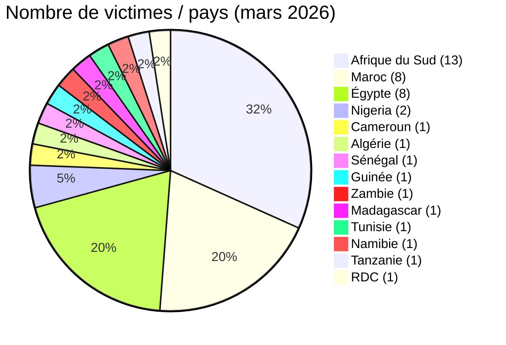
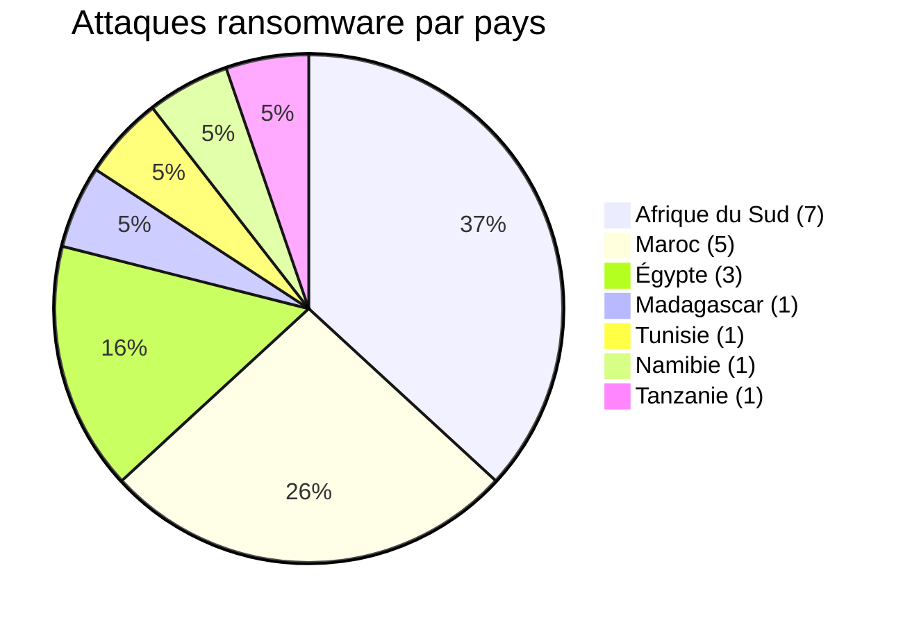
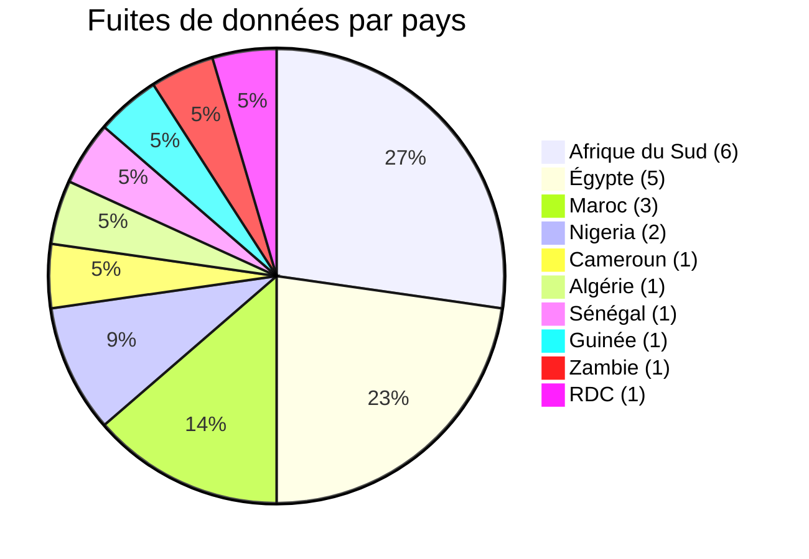
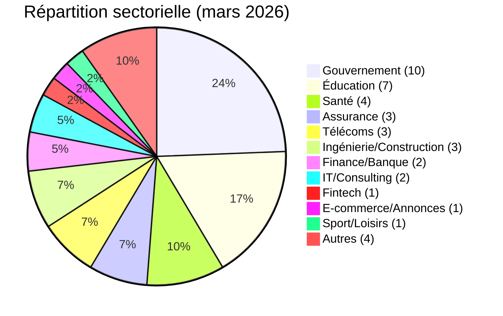
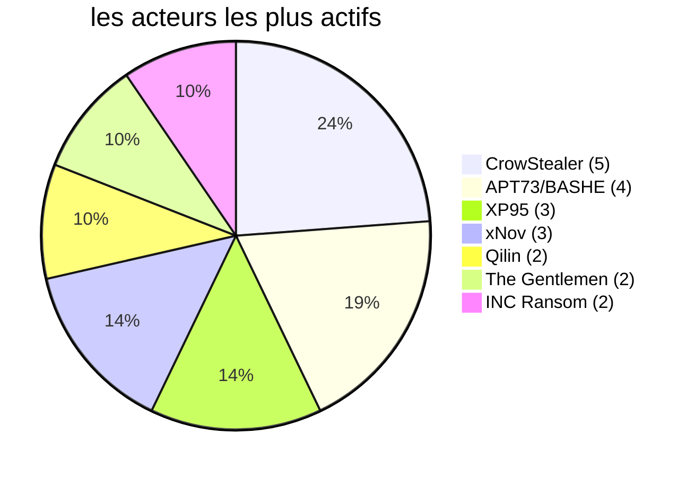

# Rapport CTI - Cyberattaques en Afrique (Mars 2026)
👉🏾 [**English version available here**](./README.md)
## 1. Synthèse exécutive

En mars 2026, **41 incidents cyber** ciblant des entités africaines ont été revendiqués ou détectés publiquement. Le continent fait face à une double menace : les **revendications ou publications ransomware** et les **fuites de données ou intrusions système**. Une publication ransomware ne permet pas, à elle seule, d’établir un chiffrement ou une interruption opérationnelle. Principales conclusions :

- **19 attaques de ransomware (46,3 %)** et **22 fuites de données / intrusions (53,7 %)**.
- **14 pays touchés** ; **Afrique du Sud** (13 incidents), **Maroc** (8) et **Égypte** (8) représentent 71 % des victimes.
- **27 acteurs distincts** ; **CrowStealer** (5 incidents), **APT73/BASHE** (4) et **XP95** (3) sont les plus actifs.
- **Secteurs gouvernemental et éducatif** : 41,5 % des victimes, montrant un ciblage stratégique des institutions publiques.
- Fuites massives : ministère de la Santé égyptien (3,8 M d’enregistrements), province de Gauteng (3,8 To), Remita Nigeria (3 To), Stats SA (154 Go). Au Maroc, plusieurs fuites majeures ont touché des institutions gouvernementales, dont le Ministère de la Justice (300 Go de dossiers judiciaires).
- Nouvel incident majeur : **UBA Sénégal** - un braquage cyber coordonné avec compromission du système, manipulation de bases de données et plus de 3 400 retraits frauduleux en GAB totalisant 1,143 milliard FCFA (~1,9 M USD), révélé en mars mais exécuté fin janvier.
- Menaces émergentes : **Loozap (Cameroun)** - 34 000 comptes utilisateurs divulgués (mots de passe en SHA1) ; **Ministère de la Santé de Guinée** - compromission suspectée des tableaux de bord DHIS2 par l’acteur Keymous.

### 📋 Liste des victimes

👉🏾 [Voir la liste complète des victimes](./victims_FR.md)

## 2. Méthodologie

- **Périmètre** : 54 pays africains.
- **Période** : 1er - 31 mars 2026 (incidents révélés ou revendiqués durant ce mois ; les attaques peuvent être antérieures).
- **Sources** : Dark web, DLS (sites de fuite), OSINT, canaux Telegram, forums underground, rapports médiatiques.
- **Inclusion** : incidents publiquement revendiqués ou attribués avec victime, pays et secteur identifiés.
- **Typologie** :
  - *Ransomware* : publication d’une victime ou revendication par un groupe ransomware. Le chiffrement n’est pas présumé sans élément probant.
  - *Fuite de données / intrusion* : exfiltration non chiffrée, base de données vendue ou publiée, ou compromission système menant à une fraude financière.

## 3. Vue d’ensemble

| Indicateur                     | Valeur |
|--------------------------------|--------|
| Nombre total de victimes       | 41     |
| Pays touchés                   | 14     |
| Acteurs distincts              | 27     |
| Incidents de ransomware        | 19 (46,3 %) |
| Fuites de données / intrusions | 22 (53,7 %) |

**Pays les plus ciblés :**
- 🇿🇦 Afrique du Sud : 13 victimes
- 🇲🇦 Maroc : 8 victimes
- 🇪🇬 Égypte : 8 victimes
- 🇳🇬 Nigeria : 2 victimes
- 🇨🇲 Cameroun : 1 victime
- 🇩🇿 Algérie : 1 victime
- 🇸🇳 Sénégal : 1 victime
- 🇬🇳 Guinée : 1 victime
- 🇿🇲 Zambie : 1 victime
- 🇲🇬 Madagascar : 1 victime
- 🇹🇳 Tunisie : 1 victime
- 🇳🇦 Namibie : 1 victime
- 🇹🇿 Tanzanie : 1 victime
- 🇨🇩 RDC : 1 victime

**Comparaison ransomware vs fuites de données par pays :**
| Pays                  | Ransomware | Fuites de données |
|-----------------------|------------|-------------------|
| Afrique du Sud        | 7          | 6                 |
| Maroc                 | 5          | 3                 |
| Égypte                | 3          | 5                 |
| Nigeria               | 0          | 2                 |
| Cameroun              | 0          | 1                 |
| Algérie               | 0          | 1                 |
| Sénégal               | 0          | 1                 |
| Guinée                | 0          | 1                 |
| Zambie                | 0          | 1                 |
| Madagascar            | 1          | 0                 |
| Tunisie               | 1          | 0                 |
| Namibie               | 1          | 0                 |
| Tanzanie              | 1          | 0                 |
| RDC                   | 0          | 1                 |

**Répartition sectorielle :**
| Secteur                    | Incidents | Pourcentage |
|----------------------------|-----------|-------------|
| Gouvernement / Admin       | 10        | 24,4 %      |
| Éducation / Université     | 7         | 17,1 %      |
| Santé                      | 4         | 9,8 %       |
| Assurance                  | 3         | 7,3 %       |
| Télécommunications         | 3         | 7,3 %       |
| Ingénierie/Construction    | 3         | 7,3 %       |
| Finance / Banque           | 2         | 4,9 %       |
| IT/Consulting              | 2         | 4,9 %       |
| Fintech                    | 1         | 2,4 %       |
| E-commerce / Petites annonces | 1      | 2,4 %       |
| Sport / Loisirs            | 1         | 2,4 %       |
| Autres                     | 4         | 9,8 %       |

**Acteurs les plus prolifiques :**
| Acteur           | Type           | Incidents | Cibles principales |
|------------------|----------------|-----------|---------------------|
| CrowStealer      | Courtier de données | 5    | Gouvernement et éducation égyptiens |
| APT73/BASHE      | Ransomware     | 4         | Institutions d’État marocaines |
| XP95             | Ransomware     | 3         | Gouvernement sud-africain |
| xNov             | Fuite de données | 3       | Supply chain marocaine, sport sud-africain, éducation |
| Qilin            | Ransomware     | 2         | Maroc, Madagascar |
| The Gentlemen    | Ransomware     | 2         | Tunisie, Afrique du Sud |
| INC Ransom       | Ransomware     | 2         | Namibie, Afrique du Sud |

## 4. Synthèse géographique

> **Pour le détail de chaque incident, voir [`victims_FR.md`](./victims_FR.md).**

- **Concentration :** l’Afrique du Sud (13), le Maroc (8) et l’Égypte (8) représentent 29 des 41 incidents, soit 70,7 % du mois.
- **Répartition des menaces :** 19 revendications ou publications ransomware et 22 fuites de données ou intrusions système ont été recensées dans 14 pays.
- **Exposition du secteur public :** les administrations et les établissements éducatifs restent très présents, avec des revendications importantes concernant des institutions en Égypte, au Maroc, en Afrique du Sud, au Sénégal et en Guinée.
- **Cas à fort impact :** le mois comprend la fraude signalée concernant UBA Sénégal et des revendications volumétriques attribuées au ministère égyptien de la Santé, au gouvernement provincial du Gauteng, à Remita et au ministère marocain de la Justice.

---

## 5. Analyse détaillée par type d’incident

### 5.1 Ransomware (19 incidents)

| Pays             | Attaques ransomware | Acteurs principaux |
|------------------|---------------------|---------------------|
| Afrique du Sud   | 7                   | XP95 (3), LockBit 5.0, Lynx, DragonForce, The Gentlemen, NightSpire, INC Ransom, Coinbase Cartel |
| Maroc            | 5                   | APT73/BASHE (3), Qilin, The Gentlemen |
| Égypte           | 3                   | Crypto24, PEAR, Payload |
| Madagascar       | 1                   | Qilin |
| Tunisie          | 1                   | The Gentlemen |
| Namibie          | 1                   | INC Ransom |
| Tanzanie         | 1                   | Morpheus |

**Observations clés** :
- **XP95** est devenu une menace majeure en Afrique du Sud : gouvernement de Gauteng (3,8 To), Stats SA (154 Go) et GCRA (147 Go). Les données sont vendues, pas seulement chiffrées.
- **APT73/BASHE** a ciblé des institutions stratégiques marocaines (HACA, Maroc Telecom, 2M TV, IRES), suggérant une motivation géopolitique.
- Le secteur des assurances lourdement touché en Afrique du Sud (Lion of Africa, The Unlimited).

### 5.2 Fuites de données / intrusions système (22 incidents)

| Pays             | Fuites/Intrusions | Acteurs principaux |
|------------------|-------------------|---------------------|
| Égypte           | 5                 | CrowStealer (5) |
| Afrique du Sud   | 6                 | xNov (2), TelephoneHooliganism, Blackwinter99, XP95|
| Maroc            | 3                 | xNov (2), anisanas2 |
| Nigeria          | 2                 | AshleyWood2022, Bytetobreach |
| Cameroun         | 1                 | zimablue |
| Algérie          | 1                 | Grubder |
| Sénégal          | 1                 | Réseau coordonné |
| Guinée           | 1                 | Keymous |
| Zambie           | 1                 | Spirigatito |
| RDC              | 1                 | privillege |

**Observations clés** :
- **CrowStealer** domine les fuites égyptiennes, y compris une base de données médicale de 3,8 millions de patients (ministère de la Santé) vendue 2 500 $.
- **xNov** a exposé des dossiers étudiants (ONOUSC, 3 631 entrées), les données supply chain de L’Oréal Maroc (296 pharmacies, 361 000 ventes, secrets OAuth2), et la base de données d’Eventing South Africa (équitation).
- **UBA Sénégal** (révélé en mars, exécuté fin janvier) : les attaquants ont compromis le système d’information interne, manipulé les bases de données (création/modification de comptes, augmentation des plafonds de retrait, transferts de fonds), puis coordonné plus de 3 400 retraits GAB en quelques heures, emportant 1,143 milliard FCFA (~1,9 M USD). Vulnérabilités probables : absence de SOC temps réel, procédures antifraude insuffisantes, possible complicité interne.
- **Loozap (Cameroun)** - 34 000 comptes utilisateurs divulgués avec mots de passe hashés en SHA1, adresses IP, données personnelles.
- **Ministère de la Santé de Guinée** - compromission suspectée des tableaux de bord DHIS2 par Keymous, exposant des outils de surveillance sanitaire et des données gouvernementales (emails, personnels).
- Fuites massives au Nigeria : Remita (3 To, incluant documents KYC et clés HSM gouvernementales) et université Ahmadu Bello (11 000+ dossiers).

## 6. Impact sectoriel

| Secteur                  | Incidents | Pourcentage |
|--------------------------|-----------|-------------|
| Gouvernement / Admin     | 10        | 24,4 %      |
| Éducation / Université   | 7         | 17,1 %      |
| Santé                    | 4         | 9,8 %       |
| Assurance                | 3         | 7,3 %       |
| Télécommunications       | 3         | 7,3 %       |
| Ingénierie/Construction  | 3         | 7,3 %       |
| Finance / Banque         | 2         | 4,9 %       |
| IT/Consulting            | 2         | 4,9 %       |
| Fintech                  | 1         | 2,4 %       |
| E-commerce / Annonces    | 1         | 2,4 %       |
| Sport / Loisirs          | 1         | 2,4 %       |
| Autres                   | 4         | 9,8 %       |

**Enseignements** :
- Le secteur public (gouvernement + éducation) représente **41,5 %** des incidents.
- Les données de santé restent très valorisées : fuite du ministère de la Santé égyptien (3,8 M d’enregistrements), fuites d’assurances sud-africaines, compromission du ministère de la Santé guinéen.
- Les télécoms (Orange Madagascar, Maroc Telecom) sont des cibles stratégiques.
- L’incident UBA Sénégal illustre une nouvelle tendance : **fraude financière directe par compromission système**, contournant le ransomware classique.
- Les plateformes de e‑commerce (Loozap) sont de plus en plus ciblées pour le vol d’identifiants.

## 7. Profil des acteurs

| Acteur           | Type           | Incidents | Cibles principales |
|------------------|----------------|-----------|---------------------|
| CrowStealer      | Courtier de données | 5    | Gouvernement et éducation égyptiens |
| APT73/BASHE      | Ransomware     | 4         | Institutions d’État marocaines |
| XP95             | Ransomware     | 3         | Gouvernement sud-africain |
| xNov             | Fuite de données | 3       | Supply chain marocaine, sport sud-africain, éducation |
| Qilin            | Ransomware     | 2         | Maroc, Madagascar |
| The Gentlemen    | Ransomware     | 2         | Tunisie, Afrique du Sud |
| INC Ransom       | Ransomware     | 2         | Namibie, Afrique du Sud |

**Acteurs émergents** : xNov (ciblage supply chain), XP95 (gouvernement sud-africain), zimablue (e‑commerce camerounais), Keymous (ministères de la santé ouest-africains), Grubder (secteur tech algérien).

### 7.1 Niveau de risque

| Pays | Risque |
|------|--------|
| Afrique du Sud | 🔴 Critique |
| Maroc | 🔴 Élevé |
| Égypte | 🔴 Élevé |
| Nigeria | 🟠 Moyen-Élevé |
| Sénégal | 🟠 Moyen (post-UBA) |
| Cameroun | 🟠 Moyen (émergent) |
| Guinée | 🟠 Moyen |
| Autres | 🟠 Moyen |

## 8. Tendances clés et lacunes de renseignement

### Tendances
1. **Évolution des ransomwares** - XP95 et d’autres vendent les données exfiltrées plutôt que de simplement chiffrer.
2. **Attaques de la supply chain** - Smarteez (prestataire de L’Oréal Maroc) montre la vulnérabilité des sous-traitants digitaux.
3. **Fuites massives de données de santé** - Ministère de la Santé égyptien (3,8 M d’enregistrements) révèle des failles dans la sécurité des systèmes publics.
4. **Ciblage géopolitique** - APT73/BASHE concentré sur les médias et télécoms d’État marocains.
5. **Fraude financière directe par compromission système** - UBA Sénégal démontre que les attaquants contournent le ransomware pour aller directement à l’argent, exploitant des SOC et contrôles antifraude faibles.
6. **Vol d’identifiants sur les plateformes e‑commerce** - Loozap (Cameroun) : fuite de 34 000 comptes avec hashage SHA1 faible.

### Lacunes
- De nombreuses attaques restent non détectées ou non déclarées ; cette liste ne couvre que les incidents publics.
- Les volumes de données annoncés peuvent être gonflés.
- L’attaque UBA Sénégal a eu lieu fin janvier mais n’a été révélée qu’en mars - délai important dans la prise de conscience publique.
- La compromission du ministère de la Santé guinéen reste partiellement confirmée (accès corrélé, pas de divulgation complète).

## 9. Cartographie MITRE ATT&CK (contextuelle)

| Phase | Technique | Portée analytique |
| :--- | :--- | :--- |
| Accès initial | T1566 - Phishing | Hypothèse de détection défensive, non observée à partir des seules revendications |
| Accès initial | T1190 - Exploit Public-Facing Application | Hypothèse de détection défensive, non observée à partir des seules revendications |
| Accès par comptes | T1078 - Valid Accounts | Pertinent pour les ventes d’accès ou d’identifiants, sans confirmer leur utilisation |
| Collecte | T1005 - Data from Local System | Hypothèse contextuelle lorsque des données internes sont publiées, le mécanisme de collecte restant inconnu |
| Impact | T1486 - Data Encrypted for Impact | Pertinent pour la préparation ransomware, sans confirmer un chiffrement pour chaque fiche |

> Ces techniques constituent des hypothèses défensives. Une revendication, une vente de données ou une publication sur un site de fuite ne suffit pas à les considérer comme observées.

## 10. Recommandations

### Pour les gouvernements et entreprises africains
- **Sécurité des bases de données** : chiffrement des données sensibles, contrôles d’accès, audits réguliers.
- **Gestion des risques tiers** : auditer les prestataires de services digitaux, imposer des clauses de cybersécurité.
- **Réponse aux incidents** : sauvegardes hors ligne, exercices de simulation, protocoles de communication.
- **Formation des utilisateurs** : sensibilisation au phishing (vecteur initial principal).
- **Supervision en temps réel** : déployer ou renforcer un SOC 24/7 ; mettre en place une détection d’anomalies transactionnelles (particulièrement pour les banques).
- **Mécanismes antifraude** : plafonds de retrait dynamiques, blocage automatique en cas de schéma anormal, analyse comportementale.
- **Sécurité des mots de passe** : imposer un hashage fort (bcrypt, Argon2) au lieu de SHA1 ; activer la MFA pour tous les comptes utilisateurs.

### Pour les analystes CTI
- Surveiller **XP95**, **xNov**, **zimablue**, **Keymous** pour de nouvelles campagnes.
- Cartographier les expositions de la supply chain (notamment marketing digital et logistique).
- Prioriser la surveillance des secteurs gouvernemental, éducatif et de la santé en Afrique du Nord, Ouest et Australe.
- Surveiller les **intrusions financières non ransomware** - UBA Sénégal n’est probablement pas un cas isolé.

## 11. Recommandations SOC tactiques

- Détection exfiltration (T1041)  
- Surveillance comptes privilégiés  
- Analyse trafic sortant  
- Monitoring API / OAuth  
- Pour les banques : détection en temps réel des anomalies de retraits GAB (vélocité, localisation, pics de montants)

## 12. Recommandations stratégiques

- Activer MFA  
- Segmenter le réseau (séparer réseau GAB du cœur bancaire)  
- Auditer les prestataires  
- Maintenir des sauvegardes offline  
- Effectuer des exercices de crise incluant des simulations red-team  
- **Cadre réglementaire** : les banques centrales devraient imposer des standards minimaux de SOC et de détection de fraude

## 13. Conclusion

Mars 2026 confirme que **l’Afrique est une cible privilégiée pour la cybercriminalité industrialisée**. La convergence des groupes ransomware, courtiers de données, attaques supply chain, intrusions financières directes (UBA Sénégal) et vols d’identifiants sur plateformes e‑commerce (Loozap) crée un environnement à haut risque. L’Afrique du Sud, le Maroc et l’Égypte restent les plus touchés, mais **l’Afrique de l’Ouest et centrale émergent comme de nouveaux points chauds** (Sénégal, Cameroun, Guinée). Les ministères de la santé sont de plus en plus ciblés, comme en Égypte et en Guinée. Les institutions financières et les plateformes de e‑commerce doivent urgemment renforcer leur supervision en temps réel, leurs capacités antifraude et la sécurité des mots de passe. AFRINTEL continuera de suivre ces évolutions.

**AFRINTEL** - Cyber Threat Intelligence africaine  
[GitHub AFRINTEL](https://github.com/Hatchepsoute/AFRINTEL)
