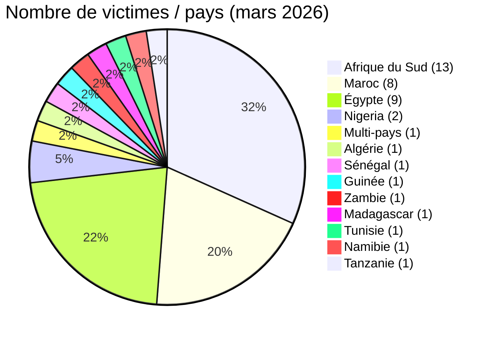
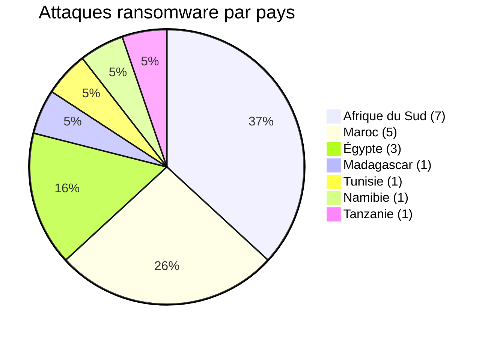
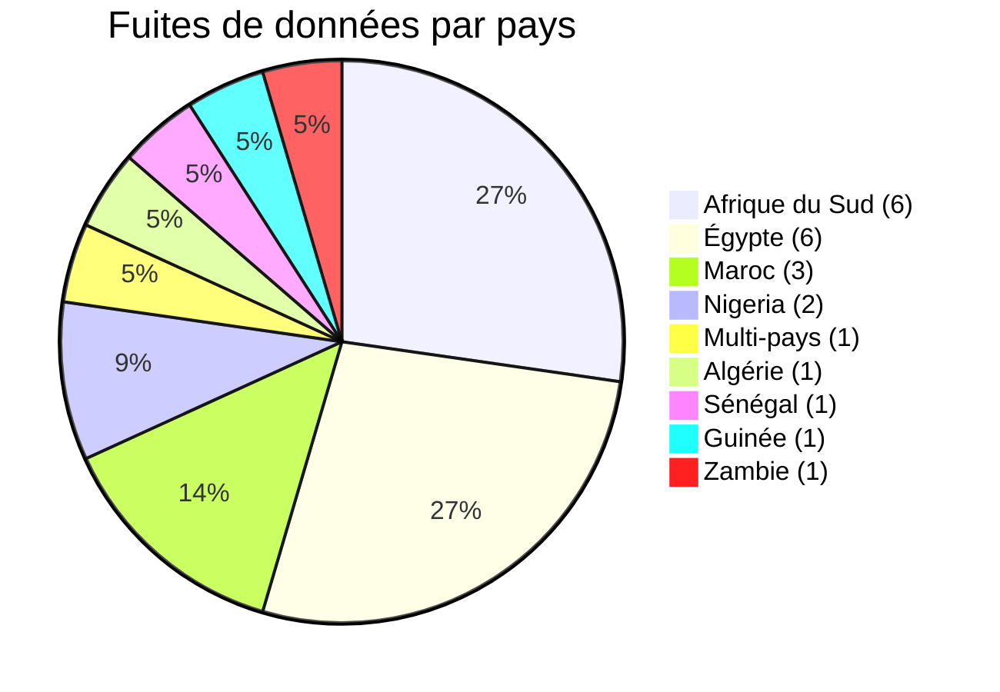
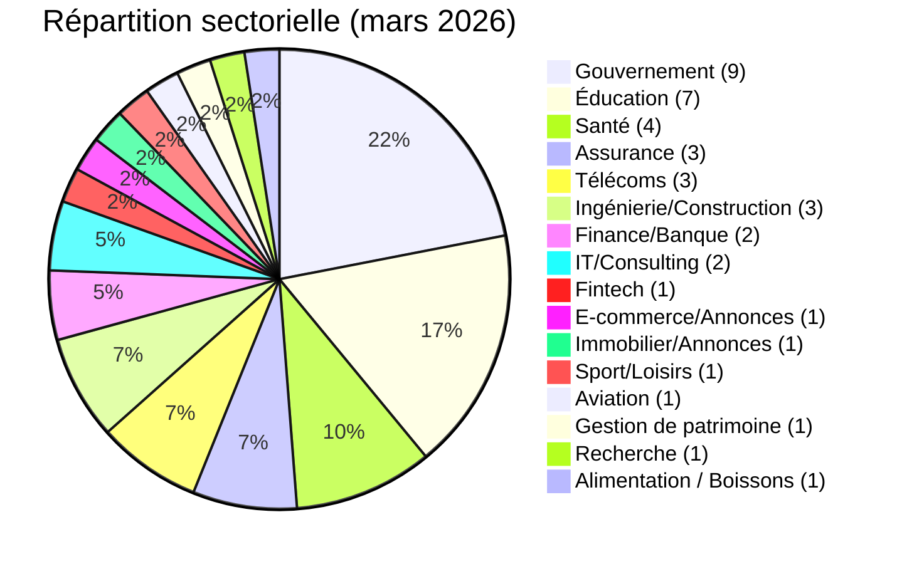
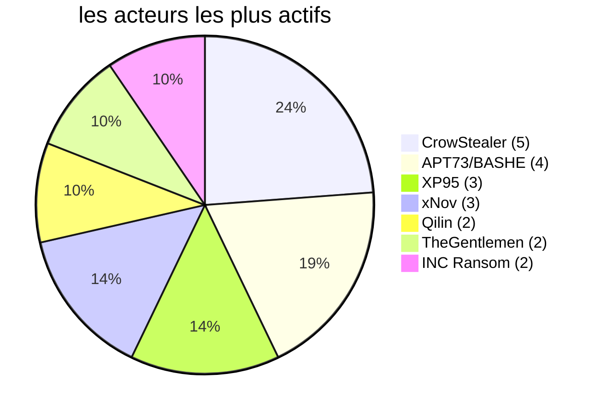

# Rapport CTI - Cyberattaques en Afrique (Mars 2026)
👉🏾 [**English version available here**](./README.md)
## 1. Synthèse exécutive

Mars 2026 a rapporté **41 incidents cyber** contre des cibles africaines, revendiqués ou détectés dans le mois. Le continent a continué de faire face au même double front que tout au long de l'année : **revendications ou publications ransomware** d'un côté, **fuites de données et intrusions système** de l'autre. Une publication ransomware, à elle seule, ne prouve ni chiffrement ni interruption d'activité. Principales conclusions :

- **19 attaques de ransomware (46,3 %)** et **22 fuites de données / intrusions (53,7 %)**.
- **13 pays touchés** ; **Afrique du Sud** (13 incidents), **Maroc** (8) et **Égypte** (9) représentent 73 % des victimes.
- **26 acteurs attribués et 1 incident sans attribution publique** ; **CrowStealer** (5 incidents), **APT73/BASHE** (4) et **XP95** (3) sont les plus actifs.
- **Secteurs gouvernemental et éducatif** : 39 % des victimes, montrant un ciblage stratégique des institutions publiques.
- Fuites massives : ministère de la Santé égyptien (3,8 M d’enregistrements), province de Gauteng (3,8 To), Remita Nigeria (3 To), Stats SA (154 Go). Au Maroc, plusieurs fuites majeures ont touché des institutions gouvernementales, dont le Ministère de la Justice (300 Go de dossiers judiciaires).
- Incident majeur actualisé : **UBA Sénégal** - l’avis ngCERT ngCERT-2026-060005 fait état de 3 421 transactions GAB. Les pertes avaient été précédemment rapportées à 1,143 milliard de FCFA ; le ngCERT les présente comme supérieures à 2 millions USD. L’opération a eu lieu fin janvier et a été révélée en mars.
- Menaces émergentes : **Loozap (Multi-pays)** - 34 000 comptes utilisateurs divulgués (mots de passe en SHA1), affectant des utilisateurs dans plusieurs pays africains ; **Ministère de la Santé de Guinée** - compromission suspectée des tableaux de bord DHIS2 par l’acteur Keymous.

### 📋 Liste des victimes

👉🏾 [Voir la liste complète des victimes](./victims_FR.md)

## 2. Méthodologie

- **Périmètre** : 54 pays africains.
- **Période** : 1er - 31 mars 2026 (incidents révélés ou revendiqués durant ce mois ; les attaques peuvent être antérieures).
- **Sources** : Dark web, DLS (sites de fuite), OSINT, canaux Telegram, forums underground, rapports médiatiques.
- **Inclusion** : incidents publiquement revendiqués ou attribués avec victime, pays et secteur identifiés.
- **Typologie** :
  - *Ransomware* : publication d’une victime ou revendication par un groupe ransomware. Le chiffrement n’est pas présumé sans élément probant.
  - *Fuite de données / intrusion* : exfiltration non chiffrée, base de données vendue ou publiée, ou compromission système menant à une fraude financière.

## 3. Vue d’ensemble

| Indicateur                     | Valeur |
|--------------------------------|--------|
| Nombre total de victimes       | 41     |
| Pays touchés                   | 12 (plus 1 incident multi-pays) |
| Acteurs attribués              | 26     |
| Incidents de ransomware        | 19 (46,3 %) |
| Fuites de données / intrusions | 22 (53,7 %) |

**Pays les plus ciblés :**
- 🇿🇦 Afrique du Sud : 13 victimes
- 🇲🇦 Maroc : 8 victimes
- 🇪🇬 Égypte : 9 victimes
- 🇳🇬 Nigeria : 2 victimes
- 🌍 Multi-pays (Afrique) : 1 victime
- 🇩🇿 Algérie : 1 victime
- 🇸🇳 Sénégal : 1 victime
- 🇬🇳 Guinée : 1 victime
- 🇿🇲 Zambie : 1 victime
- 🇲🇬 Madagascar : 1 victime
- 🇹🇳 Tunisie : 1 victime
- 🇳🇦 Namibie : 1 victime
- 🇹🇿 Tanzanie : 1 victime

**Comparaison ransomware vs fuites de données par pays :**
| Pays                  | Ransomware | Fuites de données |
|-----------------------|------------|-------------------|
| Afrique du Sud        | 7          | 6                 |
| Maroc                 | 5          | 3                 |
| Égypte                | 3          | 6                 |
| Nigeria               | 0          | 2                 |
| Multi-pays            | 0          | 1                 |
| Algérie               | 0          | 1                 |
| Sénégal               | 0          | 1                 |
| Guinée                | 0          | 1                 |
| Zambie                | 0          | 1                 |
| Madagascar            | 1          | 0                 |
| Tunisie               | 1          | 0                 |
| Namibie               | 1          | 0                 |
| Tanzanie              | 1          | 0                 |

**Répartition sectorielle :**
| Secteur                    | Incidents | Pourcentage |
|----------------------------|-----------|-------------|
| Gouvernement / Admin       | 9         | 22,0 %      |
| Éducation / Université     | 7         | 17,1 %      |
| Santé                      | 4         | 9,8 %       |
| Assurance                  | 3         | 7,3 %       |
| Télécommunications         | 3         | 7,3 %       |
| Ingénierie/Construction    | 3         | 7,3 %       |
| Finance / Banque           | 2         | 4,9 %       |
| IT/Consulting              | 2         | 4,9 %       |
| Fintech                    | 1         | 2,4 %       |
| E-commerce / Petites annonces | 1      | 2,4 %       |
| Immobilier / Petites annonces | 1      | 2,4 %       |
| Sport / Loisirs            | 1         | 2,4 %       |
| Aviation                   | 1         | 2,4 %       |
| Gestion de patrimoine      | 1         | 2,4 %       |
| Recherche / Think tank    | 1         | 2,4 %       |
| Alimentation / Boissons   | 1         | 2,4 %       |

**Acteurs les plus prolifiques :**
| Acteur           | Type           | Incidents | Cibles principales |
|------------------|----------------|-----------|---------------------|
| CrowStealer      | Courtier de données | 5    | Gouvernement et éducation égyptiens |
| APT73/BASHE      | Ransomware     | 4         | Institutions d’État marocaines |
| XP95             | Ransomware     | 3         | Gouvernement sud-africain |
| xNov             | Fuite de données | 3       | Supply chain marocaine, sport sud-africain, éducation |
| Qilin            | Ransomware     | 2         | Maroc, Madagascar |
| TheGentlemen    | Ransomware     | 2         | Tunisie, Afrique du Sud |
| INC Ransom       | Ransomware     | 2         | Namibie, Afrique du Sud |

## 4. Synthèse géographique

> **Pour le détail de chaque incident, voir [`victims_FR.md`](./victims_FR.md).**

- **Concentration :** Afrique du Sud (13), Maroc (8) et Égypte (8) réunissent 29 des 41 incidents du mois, 70,7 %.
- **Répartition des menaces :** 19 revendications ou publications ransomware, 22 fuites de données ou intrusions système, réparties dans 14 pays.
- **Exposition du secteur public :** administrations et établissements éducatifs restent très présents, avec des revendications qui touchent des institutions en Égypte, au Maroc, en Afrique du Sud, au Sénégal et en Guinée.
- **Cas à fort impact :** la fraude signalée sur UBA Sénégal, plus des revendications volumétriques contre le ministère égyptien de la Santé, le gouvernement provincial du Gauteng, Remita et le ministère marocain de la Justice.

---

## 5. Analyse détaillée par type d’incident

### 5.1 Ransomware (19 incidents)

| Pays             | Attaques ransomware | Acteurs principaux |
|------------------|---------------------|---------------------|
| Afrique du Sud   | 7                   | XP95 (3), LockBit 5.0, Lynx, DragonForce, TheGentlemen, NightSpire, INC Ransom, Coinbase Cartel |
| Maroc            | 5                   | APT73/BASHE (3), Qilin, TheGentlemen |
| Égypte           | 3                   | Crypto24, PEAR, Payload |
| Madagascar       | 1                   | Qilin |
| Tunisie          | 1                   | TheGentlemen |
| Namibie          | 1                   | INC Ransom |
| Tanzanie         | 1                   | Morpheus |

**Observations clés** :
- **XP95** est devenu une menace majeure en Afrique du Sud ce mois-ci : gouvernement de Gauteng (3,8 To), Stats SA (154 Go), GCRA (147 Go). Ici, les données sont vendues, pas seulement chiffrées.
- **APT73/BASHE** s'en est pris à des institutions stratégiques marocaines, HACA, Maroc Telecom, 2M TV, IRES, un schéma qui évoque plus une motivation géopolitique qu'un simple opportunisme.
- Les assurances ont aussi pris cher en Afrique du Sud : Lion of Africa, The Unlimited.

### 5.2 Fuites de données / intrusions système (22 incidents)

| Pays             | Fuites/Intrusions | Acteurs principaux |
|------------------|-------------------|---------------------|
| Égypte           | 6                 | CrowStealer (5), Al-Sheikh |
| Afrique du Sud   | 6                 | xNov (2), TelephoneHooliganism, Blackwinter99, XP95|
| Maroc            | 3                 | xNov (2), anisanas2 |
| Nigeria          | 2                 | AshleyWood2022, Bytetobreach |
| Multi-pays       | 1                 | zimablue |
| Algérie          | 1                 | Grubder |
| Sénégal          | 1                 | Non attribué |
| Guinée           | 1                 | Keymous |
| Zambie           | 1                 | Spirigatito |

**Observations clés** :
- **CrowStealer** domine les fuites égyptiennes, avec entre autres une base médicale de 3,8 millions de patients (ministère de la Santé) vendue 2 500 $.
- **xNov** a mis en circulation des dossiers étudiants (ONOUSC, 3 631 entrées), les données de la supply chain de L'Oréal Maroc (296 pharmacies, 361 000 ventes, secrets OAuth2), et une base équestre d'Eventing South Africa.
- **UBA Sénégal** (révélé en mars, mais l'opération remonte à fin janvier) : selon [l'avis ngCERT ngCERT-2026-060005](https://cert.gov.ng/advisories/alert-on-cyber-enabled-atm-cash-out-attacks-targeting-african-financial-institutions), le cash-out a impliqué 3 421 transactions GAB. Les pertes, d'abord chiffrées à 1,143 milliard de FCFA, sont désormais estimées par le ngCERT à plus de 2 millions USD. Un accès privilégié à l'infrastructure d'autorisation des cartes semble probable, mais la manière dont il a été obtenu, la séquence technique exacte et une éventuelle implication interne restent tous inconnus.
- **Loozap (multi-pays)**, 34 000 comptes divulgués avec mots de passe en SHA1, adresses IP et données personnelles, touchant des utilisateurs en Égypte, au Kenya, au Ghana, en Éthiopie, au Nigeria et au Mozambique.
- **Ministère de la Santé de Guinée**, compromission suspectée des tableaux de bord DHIS2 par Keymous, exposant des outils de surveillance sanitaire ainsi que des emails et dossiers du personnel.
- Deux grosses fuites nigérianes : Remita (3 To, dont des documents KYC et des clés HSM gouvernementales) et l'université Ahmadu Bello (11 000+ dossiers).

## 6. Impact sectoriel

| Secteur                  | Incidents | Pourcentage |
|--------------------------|-----------|-------------|
| Gouvernement / Admin     | 9         | 22,0 %      |
| Éducation / Université   | 7         | 17,1 %      |
| Santé                    | 4         | 9,8 %       |
| Assurance                | 3         | 7,3 %       |
| Télécommunications       | 3         | 7,3 %       |
| Ingénierie/Construction  | 3         | 7,3 %       |
| Finance / Banque         | 2         | 4,9 %       |
| IT/Consulting            | 2         | 4,9 %       |
| Fintech                  | 1         | 2,4 %       |
| E-commerce / Annonces    | 1         | 2,4 %       |
| Immobilier / Annonces    | 1         | 2,4 %       |
| Sport / Loisirs          | 1         | 2,4 %       |
| Aviation               | 1         | 2,4 %       |
| Gestion de patrimoine  | 1         | 2,4 %       |
| Recherche / Think tank| 1         | 2,4 %       |
| Alimentation / Boissons| 1        | 2,4 %       |

**Enseignements** :
- Le secteur public, gouvernement plus éducation, représente **39 %** des incidents du mois.
- Les données de santé restent une cible de choix : fuite du ministère de la Santé égyptien (3,8 M d'enregistrements), fuites d'assurances sud-africaines, compromission du ministère de la Santé guinéen, même tendance à chaque fois.
- Les télécoms, Orange Madagascar, Maroc Telecom, continuent de ressortir comme cibles stratégiques.
- UBA Sénégal mérite d'être isolé comme un risque à part : **fraude financière directe visant les contrôles d'autorisation des paiements**, loin du scénario ransomware classique.
- Les plateformes de e‑commerce (Loozap) sont de plus en plus ciblées pour le vol d’identifiants.

## 7. Profil des acteurs

| Acteur           | Type           | Incidents | Cibles principales |
|------------------|----------------|-----------|---------------------|
| CrowStealer      | Courtier de données | 5    | Gouvernement et éducation égyptiens |
| APT73/BASHE      | Ransomware     | 4         | Institutions d’État marocaines |
| XP95             | Ransomware     | 3         | Gouvernement sud-africain |
| xNov             | Fuite de données | 3       | Supply chain marocaine, sport sud-africain, éducation |
| Qilin            | Ransomware     | 2         | Maroc, Madagascar |
| TheGentlemen    | Ransomware     | 2         | Tunisie, Afrique du Sud |
| INC Ransom       | Ransomware     | 2         | Namibie, Afrique du Sud |

**Acteurs émergents** : xNov (ciblage supply chain), XP95 (gouvernement sud-africain), zimablue (e‑commerce camerounais), Keymous (ministères de la santé ouest-africains), Grubder (secteur tech algérien).

### 7.1 Niveau de risque

| Pays | Risque |
|------|--------|
| Afrique du Sud | 🔴 Critique |
| Maroc | 🔴 Élevé |
| Égypte | 🔴 Élevé |
| Nigeria | 🟠 Moyen-Élevé |
| Sénégal | 🟠 Moyen (post-UBA) |
| Multi-pays (Loozap) | 🟠 Moyen (émergent) |
| Guinée | 🟠 Moyen |
| Autres pays | 🟠 Moyen |

## 8. Tendances clés et lacunes de renseignement

### Tendances
1. **Le ransomware glisse vers l'extorsion de données.** XP95 et d'autres vendent maintenant ce qu'ils exfiltrent au lieu de se contenter de chiffrer.
2. **La supply chain devient un point d'entrée.** Smarteez, prestataire de L'Oréal Maroc, rappelle que les sous-traitants digitaux sont un maillon faible.
3. **Les fuites de données de santé prennent de l'ampleur.** Le ministère de la Santé égyptien, 3,8 M d'enregistrements, pointe de vraies failles dans la sécurité des systèmes publics.
4. **Certaines opérations semblent géopolitiques.** APT73/BASHE s'est concentré spécifiquement sur les médias et télécoms d'État marocains.
5. **UBA Sénégal, un autre genre de menace.** Fraude financière directe visant l'autorisation des paiements, cash-out coordonné à grande échelle. Les éléments publics ne disent ni comment l'accès a été obtenu ni quel contrôle SOC a lâché.
6. **Les identifiants e-commerce sont visés.** Loozap, multi-pays, 34 000 comptes, hashage SHA1 faible, plusieurs pays africains touchés d'un coup.

### Lacunes
- De nombreuses attaques restent non détectées ou non déclarées ; cette liste ne couvre que les incidents publics.
- Les volumes de données annoncés peuvent être gonflés.
- L’opération UBA Sénégal a eu lieu fin janvier, a été révélée en mars, puis documentée par le ngCERT le 25 juin 2026 ; le vecteur d’accès initial reste inconnu.
- La compromission du ministère de la Santé guinéen reste partiellement confirmée (accès corrélé, pas de divulgation complète).

## 9. Cartographie MITRE ATT&CK (contextuelle)

| Phase | Technique | Portée analytique |
| :--- | :--- | :--- |
| Accès initial | T1566 - Phishing | Hypothèse de détection défensive, non observée à partir des seules revendications |
| Accès initial | T1190 - Exploit Public-Facing Application | Hypothèse de détection défensive, non observée à partir des seules revendications |
| Accès par comptes | T1078 - Valid Accounts | Pertinent pour les ventes d’accès ou d’identifiants, sans confirmer leur utilisation |
| Collecte | T1005 - Data from Local System | Hypothèse contextuelle lorsque des données internes sont publiées, le mécanisme de collecte restant inconnu |
| Impact | T1486 - Data Encrypted for Impact | Pertinent pour la préparation ransomware, sans confirmer un chiffrement pour chaque fiche |

> Ces techniques constituent des hypothèses défensives. Une revendication, une vente de données ou une publication sur un site de fuite ne suffit pas à les considérer comme observées.

## 10. Recommandations

### Pour les gouvernements et entreprises africains
- **Sécurité des bases de données** : chiffrement des données sensibles, contrôles d’accès, audits réguliers.
- **Gestion des risques tiers** : auditer les prestataires de services digitaux, imposer des clauses de cybersécurité.
- **Réponse aux incidents** : sauvegardes hors ligne, exercices de simulation, protocoles de communication.
- **Formation des utilisateurs** : sensibilisation au phishing (vecteur initial principal).
- **Supervision en temps réel** : déployer ou renforcer un SOC 24/7 ; mettre en place une détection d’anomalies transactionnelles (particulièrement pour les banques).
- **Mécanismes antifraude** : plafonds de retrait dynamiques, blocage automatique en cas de schéma anormal, analyse comportementale.
- **Sécurité des mots de passe** : imposer un hashage fort (bcrypt, Argon2) au lieu de SHA1 ; activer la MFA pour tous les comptes utilisateurs.

### Pour les analystes CTI
- Surveiller **XP95**, **xNov**, **zimablue**, **Keymous** pour de nouvelles campagnes.
- Cartographier les expositions de la supply chain (notamment marketing digital et logistique).
- Prioriser la surveillance des secteurs gouvernemental, éducatif et de la santé en Afrique du Nord, Ouest et Australe.
- Surveiller les **intrusions financières non ransomware** - UBA Sénégal justifie une surveillance élargie des opérations de cash-out visant les institutions financières africaines.

## 11. Recommandations SOC tactiques

- Détection exfiltration (T1041)  
- Surveillance comptes privilégiés  
- Analyse trafic sortant  
- Monitoring API / OAuth  
- Pour les banques : détection en temps réel des anomalies de retraits GAB (vélocité, localisation, pics de montants)

## 12. Recommandations stratégiques

- Activer MFA  
- Segmenter le réseau (séparer réseau GAB du cœur bancaire)  
- Auditer les prestataires  
- Maintenir des sauvegardes offline  
- Effectuer des exercices de crise incluant des simulations red-team  
- **Cadre réglementaire** : les banques centrales devraient imposer des standards minimaux de SOC et de détection de fraude

## 13. Conclusion

Mars confirme que **l'Afrique est devenue une cible de choix pour une cybercriminalité industrialisée**. Groupes ransomware, courtiers de données, attaques supply chain, fraude financière directe (UBA Sénégal) et vol d'identifiants e-commerce (Loozap), tout ça converge en un seul mois pour créer un environnement vraiment à haut risque. L'Afrique du Sud, le Maroc et l'Égypte encaissent toujours le plus gros, mais **l'Afrique de l'Ouest émerge comme un nouveau point chaud**, Sénégal et Guinée tous les deux, avec en plus une fuite d'identifiants qui a touché plusieurs marchés e-commerce africains d'un coup. Les ministères de la santé continuent d'être visés, en Égypte comme en Guinée ce mois-ci. Institutions financières et plateformes e-commerce doivent avancer vite sur la supervision en temps réel, les contrôles antifraude et la sécurité des mots de passe. AFRINTEL continue de suivre ces évolutions.

**AFRINTEL** - Cyber Threat Intelligence africaine  
[GitHub AFRINTEL](https://github.com/Hatchepsoute/AFRINTEL)
