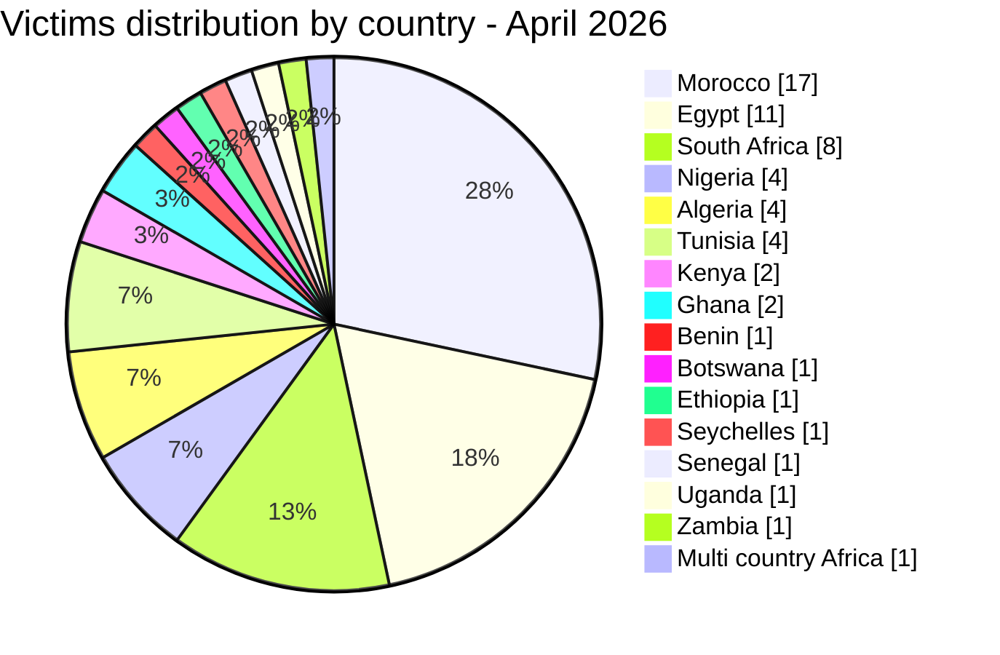
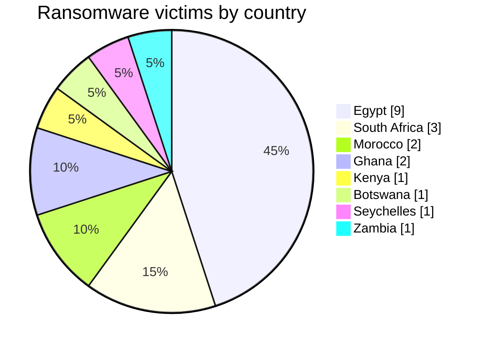
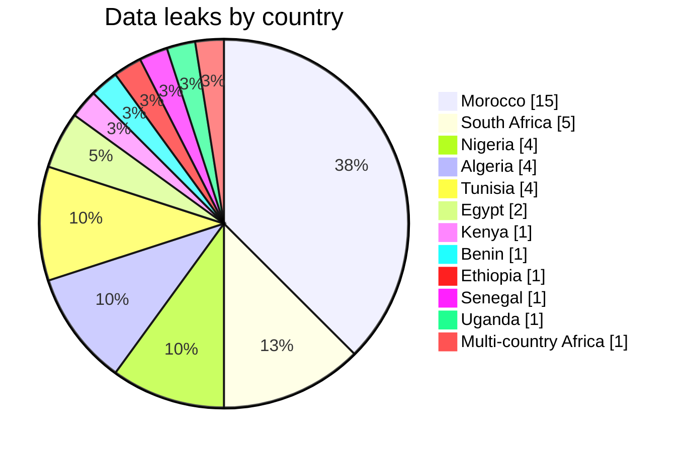
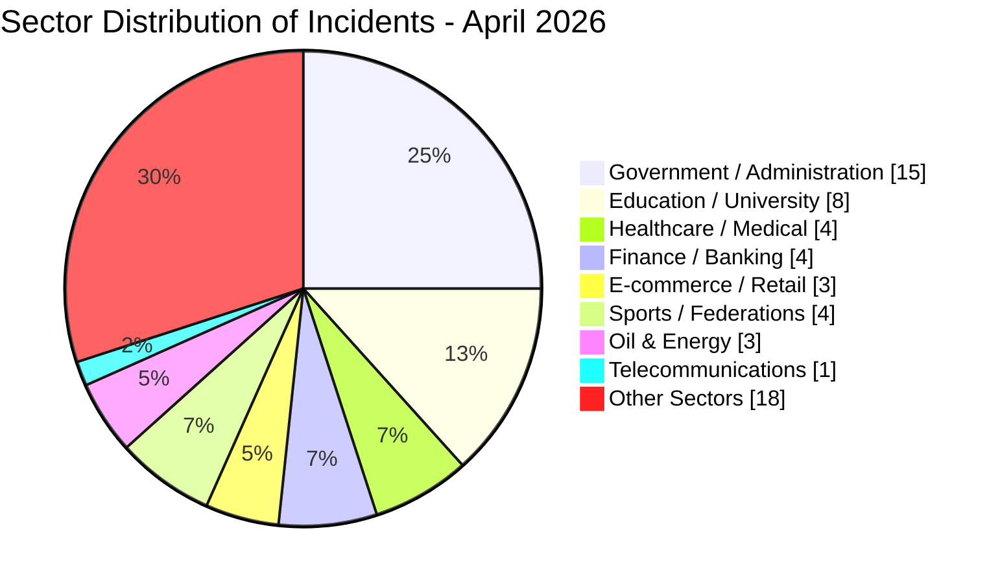
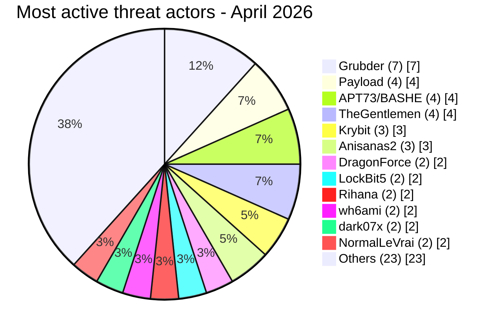

# CTI Report - Cyberattacks in Africa (April 2026)

👉🏾 [**French version available here**](./README_FR.md)

## 1. Executive summary

April 2026 recorded **60 publicly claimed cyber incidents** across Africa - **20 ransomware attacks** and **40 data leaks / access sales**. The threat landscape intensified with a surge in data broker activity, highly sensitive database exposures (royal staff, identity documents, medical records), and targeted access sales against government infrastructure. Ransomware groups **payload**, **apt73/bashe**, **thegentlemen**, and **krybit** maintained pressure, while data‑leak actors **Grubder**, **anisanas2**, **dark07x**, **wh6ami**, and **Rihana** dominated the underground market.

Key findings:
- **20 ransomware attacks (33.3%)** and **40 data leaks / access sales (66.7%)**.
- **16 countries** affected; **Morocco** (17 incidents), **Egypt** (11), **South Africa** (8) account for 60% of victims.
- **30+ distinct threat actors**; prolific data brokers **Grubder** (7 victims) and **anisanas2** (3 victims) lead.
- Government, education, and healthcare remain prime targets (combined 45%).
- Massive breaches: Royal Palace staff DB (3,300 records with CNIE), Pick n Pay ASAP/Bottles.com (full payment cards, GPS), Kenya Airports Authority (claimed 2 TB), CNSS Benin mailbox leak (7.1 GB).

### 📋 Victim list

👉🏾 [View full victim list](./victims.md)

## 2. Methodology

- **Scope**: 54 African countries.
- **Period**: 1-30 April 2026 (incidents disclosed or claimed during this month; actual attack dates may be earlier).
- **Sources**: Dark web, DLS (leak sites), OSINT, Telegram channels, underground forums.
- **Inclusion**: Publicly claimed or attributed incidents with identified victim, country, sector.
- **Typology**:
  - *Ransomware*: encryption + ransom demand.
  - *Data leak / access sale*: exfiltration without encryption, database sold/published, or access sale to compromised systems.

## 3. Global overview

| Indicator                  | Value |
|----------------------------|-------|
| Total victims              | 60    |
| Countries affected         | 16    |
| Distinct actors            | 30+   |
| Ransomware incidents       | 20 (33.3%) |
| Data leaks / access sales  | 40 (66.7%) |

### Country ranking

**All incidents combined (60):**
| Rank | Country | Incidents | Chart |
| :---: | :--- | :---: | :--- |
| **1** | 🇲🇦 Morocco | **17** | █████████████████ |
| **2** | 🇪🇬 Egypt | **11** | ███████████ |
| **3** | 🇿🇦 South Africa | **8** | ████████ |
| **4** | 🇳🇬 Nigeria | **4** | ████ |
| **5** | 🇩🇿 Algeria | **4** | ████ |
| **6** | 🇹🇳 Tunisia | **4** | ████ |
| **7** | 🇰🇪 Kenya | **2** | ██ |
| **8** | 🇬🇭 Ghana | **2** | ██ |
| **9** | 🇧🇯 Benin | **1** | █ |
| **10** | 🇧🇼 Botswana | **1** | █ |
| **11** | 🇪🇹 Ethiopia | **1** | █ |
| **12** | 🇸🇨 Seychelles | **1** | █ |
| **13** | 🇸🇳 Senegal | **1** | █ |
| **14** | 🇺🇬 Uganda | **1** | █ |
| **15** | 🇿🇲 Zambia | **1** | █ |
| **–** | 🌍 Multi‑country *(AO, ZA, NG)* | **1** | █ |

*Note: The multi-country incident is counted as 1 global victim.*

### 📊 Distribution by ransomware incidents (Total: 20)

| Rank | Country | Incidents | Chart |
| :---: | :--- | :---: | :--- |
| **1** | 🇪🇬 Egypt | **9** | █████████ |
| **2** | 🇿🇦 South Africa | **3** | ███ |
| **3** | 🇲🇦 Morocco | **2** | ██ |
| **4** | 🇬🇭 Ghana | **2** | ██ |
| **5** | 🇰🇪 Kenya | **1** | █ |
| **6** | 🇧🇼 Botswana | **1** | █ |
| **7** | 🇸🇨 Seychelles | **1** | █ |
| **8** | 🇿🇲 Zambia | **1** | █ |

### 📊 Distribution by data leak incidents (Total: 40)

| Rank | Country | Incidents | Chart |
| :---: | :--- | :---: | :--- |
| **1** | 🇲🇦 Morocco | **15** | ███████████████ |
| **2** | 🇿🇦 South Africa | **5** | █████ |
| **3** | 🇳🇬 Nigeria | **4** | ████ |
| **4** | 🇩🇿 Algeria | **4** | ████ |
| **5** | 🇹🇳 Tunisia | **4** | ████ |
| **6** | 🇪🇬 Egypt | **2** | ██ |
| **7** | 🇰🇪 Kenya | **1** | █ |
| **8** | 🇧🇯 Benin | **1** | █ |
| **9** | 🇪🇹 Ethiopia | **1** | █ |
| **10** | 🇸🇳 Senegal | **1** | █ |
| **11** | 🇺🇬 Uganda | **1** | █ |
| **–** | 🌍 Multi‑country Africa | **1** | █ |

### 📊 Ransomware vs. Data Leaks comparison by country

| Country | Ransomware | Data Leaks | Side-by-Side Distribution |
| :--- | :---: | :---: | :--- |
| 🇲🇦 Morocco | **2** | **15** | 🟧🟧 🟦🟦🟦🟦🟦🟦🟦🟦🟦🟦🟦🟦🟦🟦🟦 |
| 🇪🇬 Egypt | **9** | **2** | 🟧🟧🟧🟧🟧🟧🟧🟧🟧 🟦🟦 |
| 🇿🇦 South Africa | **3** | **5** | 🟧🟧🟧 🟦🟦🟦🟦🟦 |
| 🇳🇬 Nigeria | **0** | **4** | 🟦🟦🟦🟦 |
| 🇩🇿 Algeria | **0** | **4** | 🟦🟦🟦🟦 |
| 🇹🇳 Tunisia | **0** | **4** | 🟦🟦🟦🟦 |
| 🇰🇪 Kenya | **1** | **1** | 🟧 🟦 |
| 🇬🇭 Ghana | **2** | **0** | 🟧🟧 |
| 🇧🇯 Benin | **0** | **1** | 🟦 |
| 🇧🇼 Botswana | **1** | **0** | 🟧 |
| 🇪🇹 Ethiopia | **0** | **1** | 🟦 |
| 🇸🇨 Seychelles | **1** | **0** | 🟧 |
| 🇸🇳 Senegal | **0** | **1** | 🟦 |
| 🇺🇬 Uganda | **0** | **1** | 🟦 |
| 🇿🇲 Zambia | **1** | **0** | 🟧 |
| 🌍 Multi-country Africa | **0** | **1** | 🟦 |
| **Total (60)** | **20** | **40** | *Legend: 🟧 Ransomware \| 🟦 Data Leaks* |

### 📊 Summary of targeted sectors by country

| Rank | Country | Sector Vol. | Targeted Sectors & Breakdown |
| :---: | :--- | :--- | :--- |
| **1** | 🇲🇦 Morocco | ███████████████ | Education (**3**), Healthcare (**3**), Sports (**3**), Government (**2**), Finance (**2**), Digital Identity (**1**), Services (**1**), Food & Retail (**1**), Personal Data (**1**) |
| **2** | 🇪🇬 Egypt | █████████ | Education (**2**), Energy (**2**), Finance (**1**), Automotive (**1**), Engineering (**1**), Manufacturing (**1**), Construction (**1**) |
| **3** | 🇿🇦 South Africa | ███████ | E-commerce (**2**), Government (**2**), Education (**1**), Telecoms (**1**), Tourism (**1**), Food & Retail (**1**) + *Multi-country gouv. access* |
| **4** | 🇳🇬 Nigeria | ████ | Government (**3**), NGO (**1**) + *Multi-country gouv. access* |
| **5** | 🇩🇿 Algeria | ████ | Government (**2**), Insurance (**1**), Sports (**1**) |
| **6** | 🇹🇳 Tunisia | ████ | E-commerce (**1**), Education (**1**), Services (**1**), Social Network (**1**) |
| **7** | 🇰🇪 Kenya | ██ | Government (**1**), Aviation (**1**) |
| **8** | 🇬🇭 Ghana | ██ | Healthcare (**1**), Finance (**1**) |
| **9** | 🇧🇯 Benin | █ | Government (**1**) |
| **10** | 🇧🇼 Botswana | █ | Education (**1**) |
| **11** | 🇪🇹 Ethiopia | █ | Energy (**1**) |
| **12** | 🇸🇳 Senegal | █ | Government (**1**) |
| **13** | 🇸🇨 Seychelles | █ | Government (**1**) |
| **14** | 🇺🇬 Uganda | █ | Government (**1**) |
| **15** | 🇿🇲 Zambia | █ | Insurance (**1**) |
| **–** | 🌍 Angola | █ | *Multi-country government access (combined incident)* |

**Ransomware victims by country - April 2026**

**Data leaks by country - April 2026**

### 📊 Geographic Breakdown of incidents by region

| Region | Total Incidents | Ransomware | Leaks | Side-by-Side Distribution |
| :--- | :---: | :---: | :---: | :--- |
| **North Africa** | **36** (58.1 %) | 11 | 25 | 🟧🟧🟧🟧🟧🟧🟧🟧🟧🟧🟧 🟦🟦🟦🟦🟦🟦🟦🟦🟦🟦🟦🟦🟦🟦🟦🟦🟦🟦🟦🟦🟦🟦🟦 |
| **Southern Africa** | **11** (17.7 %) | 5 | 6 | 🟧🟧🟧🟧🟧 🟦🟦🟦🟦🟦🟦 |
| **West Africa** | **9** (14.5 %) | 2 | 7 | 🟧🟧 🟦🟦🟦🟦🟦🟦🟦 |
| **East Africa** | **5** (8.1 %) | 2 | 3 | 🟧🟧 🟦🟦🟦 |
| **Central Africa** | **1** (1.6 %) | 0 | 1 | 🟦 |
| **Total Regionalized** | **62** | **20** | **42** | |

*Legend: 🟧 Ransomware | 🟦 Data Leaks*

*Note: The regionalized total reaches 62 because the multi-country incident (Angola / Nigeria / South Africa), counted as a single incident in the global total of 60, was geographically distributed across regions to reflect its actual territorial impact.*

### 📊 Cyberattacks Breakdown by Activity Sector

| Activity Sector | Incidents | Share (%) | Chart |
| :--- | :---: | :---: | :--- |
| **Government / Administration** | **15** | 25.0 % | ███████████████ |
| **Education / University** | **8** | 13.3 % | ████████ |
| **Healthcare / Medical** | **4** | 6.7 % | ████ |
| **Finance / Banking** | **4** | 6.7 % | ████ |
| **Sports / Federations** | **4** | 6.7 % | ████ |
| **E-commerce / Retail** | **3** | 5.0 % | ███ |
| **Oil & Energy** | **3** | 5.0 % | ███ |
| **Telecommunications** | **1** | 1.7 % | █ |
| **Others** *(Miscellaneous sectors)* | **18** | 30.0 % | ██████████████████ |
| **Total** | **60** | **100 %** | |

**Sector distribution of Incidents - April 2026**

### 📊 Most Prolific Threat Actors and Groups

| Threat Actor / Group | Incidents | Primary Activity | Distribution & Method |
| :--- | :---: | :--- | :--- |
| **Grubder** | **7** | Data leaks | 🟦🟦🟦🟦🟦🟦🟦 |
| **Payload** | **4** | Ransomware | 🟧🟧🟧🟧 |
| **APT73 / BASHE** | **4** | Ransomware | 🟧🟧🟧🟧 |
| **TheGentlemen** | **4** | Ransomware | 🟧🟧🟧🟧 |
| **Krybit** | **3** | Ransomware | 🟧🟧🟧 |
| **Anisanas2** | **3** | Data leaks | 🟦🟦🟦 |
| **DragonForce** | **2** | Ransomware | 🟧🟧 |
| **LockBit5** | **2** | Ransomware | 🟧🟧 |
| **Rihana** | **2** | Data leaks | 🟦🟦 |
| **wh6ami** | **2** | Data leaks | 🟦🟦 |
| **dark07x** | **2** | Data leaks | 🟦🟦 |
| **NormalLeVrai** | **2** | Data leaks | 🟦🟦 |

*Legend: 🟧 Ransomware \| 🟦 Data Leaks*

**Most active threat actors - April 2026**

*Among the actors having carried out a single incident are notably Nullsec/0xLei, MDGhost, RubiconH4ck, Keymous, xNov, superduper1, w00l_ysh1, BlueEx, Sejjil, forrest, mecrobyte, and others (see the complete list of victims).*

## 4. Country-by-country overview

> All entries cover publicly claimed incidents only. Claims remain unverified unless independently confirmed.

### 🇲🇦 Morocco (17 incidents: 2 ransomware, 15 data leaks)

Morocco is the most affected country in April with 17 incidents, driven by a surge of data broker activity. The most critical breach involves the **LNM6 National Laboratory Mohammed VI** (anisanas2): 100 GB of medical PDF reports exposing HIV, HPV, STI, tuberculosis, hormonal, and genetic results, including paediatric and neonatal data. The **Royal Palace Staff database** (Rihana, 3,300 records with CNIE national ID numbers and physical addresses) raises spear-phishing and espionage risks for sensitive state personnel. **CNOPS** (>3 million records) exposes national health insurance members with full identity and CIN data. The **OFPPT** vocational training institution (anisanas2, >400,000 profiles) and **Al Akhawayn University** were also compromised. The **Royal Moroccan Football Federation** breach (MDGhost, 1.2 TB) includes data on minors. A dataset of 4 million Moroccan email addresses was also published for spam/phishing use. Ransomware activity includes Equatorial Coca-Cola Bottling (worldleaks) and planetsport.ma (LockBit 5.0).

### 🇪🇬 Egypt (11 incidents: 9 ransomware, 2 data leaks)

Egypt records the highest ransomware concentration in April with 9 attacks. The **payload** group led with 4 victims: United Finance Egypt (NBFI leasing/factoring), El Wastani Petroleum (oil/gas), Better House (real estate), and Oriental Weavers (world's largest carpet manufacturer). **APT73/BASHE** claimed Alexandria Petroleum (state oil refiner). **The Gentlemen** hit ACE Consulting Engineers (project management, 35+ countries). **LockBit 5.0** targeted a Mercedes-Benz authorized dealer. **DragonForce** struck AUG Pharma. Data leak activity remains lower but includes two large university breaches by Grubder: Cairo University (284,000 records with national IDs) and Ain Shams University (563,000 records with enrollment and authentication data).

### 🇿🇦 South Africa (8 incidents: 3 ransomware, 5 data leaks)

South Africa records a significant mix of ransomware and data broker activity. The most critical data breach is **Pick n Pay ASAP / Bottles.com** (p4pr1k4): payment card data including VISA, Mastercard, 3DS data, GPS delivery coordinates, and passwords. **Buffalo City Metropolitan Municipality** and the **Northern Cape Department of Roads & Public Works** (both by wh6ami) exposed administrative logs, tender data, and municipal employee records. Grubder sold two additional databases: Takealot.com (delivery addresses with home access instructions) and MySchool SA (437,000 student records). Ransomware groups DragonForce (Singita luxury lodges), Krybit (MegaSurf ISP), and The Gentlemen (Sunspray Food) all struck in April.

### 🇳🇬 Nigeria (4 incidents: 0 ransomware, 4 data leaks)

Nigeria records four data leak incidents with high sensitivity. **Oyo State Ministry of Trade** (AckLine): 275,000 commercial ID cards (21.5 GB) including facial photos, creating significant identity theft and KYC fraud risks. The **EFCC** (Nigeria's anti-corruption agency, ki4t/Nullsec Nigeria) had a partial SQL dump published exposing agent data, internal IPs, and bcrypt-hashed passwords. The **Federal Housing Authority** (0xLei/Nullsec) had source code and configuration files leaked. Welfare.org.ng (NormalLeVrai) had source code, backups, and 12,000+ records compromised.

### 🇩🇿 Algeria (4 incidents: 0 ransomware, 4 data leaks)

Algeria was exclusively targeted by data brokers in April. **Algeria Post** (BlueEx, 500,000+ records) is particularly critical: the leak includes photographs of Algerian national identity cards, enabling document fraud, SIM swapping, and identity impersonation at scale. **Inter Partner Assistance Algeria** (dark07x) exposed automobile accident reports, national ID cards, and insurance documents. The **Algiers Regional Football League** (dark07x) had player and coach data including identity documents exposed via the Foot'Up management platform. The **Ministry of Culture** (Grubder, 247,000 records) was also compromised.

### 🇹🇳 Tunisia (4 incidents: 0 ransomware, 4 data leaks)

Tunisia saw four data broker incidents. Grubder sold two large CRM databases: **Fatales.tn** (431,000 customers with booking history, VIP loyalty data, and payment info) and **NSSTunis** (312,000 records with demographic and marketing data). **Tawjih.tn**, a student guidance platform, was compromised by mecrobyte. **Exscape App** (forrest) exposed 5,000 profiles including GPS coordinates and potential minor user accounts.

### 🇰🇪 Kenya (2 incidents: 1 ransomware, 1 data leak)

Kenya faced high-impact targeting of critical public infrastructure. **IFMIS** (Kenya's national financial management system for all government levels) was claimed by APT73/BASHE, representing a direct threat to government financial operations. **Kenya Airports Authority** (KAA, RubiconH4ck) claims 2 TB of data including aviation information systems, posing risks to critical transport infrastructure confidentiality and operational security.

### 🇬🇭 Ghana (2 incidents: 2 ransomware, 0 data leaks)

Ghana recorded two ransomware incidents. **International Maritime Hospital** in Tema (The Gentlemen) is a government-affiliated healthcare facility. **Provident Insurance** (APT73/BASHE) is a private wealth management firm. Both sectors reflect the group's expansion beyond North and East Africa into West African service industries.

### 🇪🇹 Ethiopia (1 incident: 0 ransomware, 1 data leak)

**National Oil Ethiopia PLC** (ByteToBreach, 800+ GB ERP database) represents one of the most technically detailed claims of the month. The actor describes a full intrusion chain from initial Microsoft Exchange ProxyLogon exploitation to ransomware deployment, with access to client data, contracts, salaries, email accounts, and sensitive ERP systems.

### 🇧🇼 Botswana (1 incident: 1 ransomware)

Livingstone Kolobeng College, a private secondary school in Gaborone, was claimed by Krybit.

### 🇸🇨 Seychelles (1 incident: 1 ransomware)

The official e-government portal **egov.sc** was claimed by APT73/BASHE, targeting national digital public services infrastructure.

### 🇸🇳 Senegal (1 incident: 0 ransomware, 1 access sale)

**DGCPT** (Directorate General of Public Accounting and Treasury, w00l_ysh1): VPN credentials, Windows Server administrator access, Domain Controller access, and a network of 200+ computers were advertised for sale (VPN $500, servers $2,000, DC $15,000). If authentic, this constitutes an advanced compromise of Senegal's sovereign financial infrastructure.

### 🇧🇯 Benin (1 incident: 0 ransomware, 1 data leak)

**CNSS Benin** (National Social Security Fund, NormalLeVrai): 7.1 GB of mailbox data including approximately 5,993 emails, 9,019 attachments, and 31,000+ files. Content includes pension cards, identity documents, passports, HR data, medical data, and banking information related to insured individuals and retirees.

### 🇺🇬 Uganda (1 incident: 0 ransomware, 1 data leak)

**Uganda Ministry of Agriculture E-Extension** (vicmeow): CSV dump exposing emails, names, phone numbers, plaintext passwords, and an SMS gateway API token, enabling direct credential abuse and mass messaging operations.

### 🇿🇲 Zambia (1 incident: 1 ransomware)

**ZSIC Life** (insurance and wealth management) was claimed by Krybit ransomware.

### Multi-country incident

| Incident | Actor | Evidence type | Countries affected |
| :--- | :--- | :--- | :--- |
| Government mailboxes and eGov admin access sale | superduper1 | Claimed admin access: eGov panels, police mailboxes, military/intelligence access | 🇦🇴 Angola, 🇿🇦 South Africa, 🇳🇬 Nigeria |

---

## 5. Detailed analysis by incident type

### 5.1 Ransomware (20 incidents)

| Rank | Country | Attacks | Chart | Main Threat Actors |
| :---: | :--- | :---: | :--- | :--- |
| **1** | 🇪🇬 Egypt | **9** | █████████ | payload (4), dragonforce, lockbit5, thegentlemen, apt73/bashe |
| **2** | 🇿🇦 South Africa | **3** | ███ | dragonforce, krybit, thegentlemen |
| **3** | 🇲🇦 Morocco | **2** | ██ | worldleaks, lockbit5 |
| **4** | 🇬🇭 Ghana | **2** | ██ | thegentlemen, apt73/bashe |
| **5** | 🇰🇪 Kenya | **1** | █ | apt73/bashe |
| **6** | 🇧🇼 Botswana | **1** | █ | krybit |
| **7** | 🇸🇨 Seychelles | **1** | █ | apt73/bashe |
| **8** | 🇿🇲 Zambia | **1** | █ | krybit |

**Observations:** The **payload** ransomware group heavily targeted the Egyptian economy (finance, oil, manufacturing). The **apt73/bashe** group expanded its reach from government entities (Seychelles, Kenya) into the insurance and oil sectors.

### 5.2 Data leaks and access sales (40 incidents)

| Rank | Country | Incidents | Chart | Main Actors |
| :---: | :--- | :---: | :--- | :--- |
| **1** | 🇲🇦 Morocco | **15** | ███████████████ | anisanas2, Sejjil, Rihana, MDGhost, Keymous, xNov, bxxxx1 |
| **2** | 🇿🇦 South Africa | **5** | █████ | wh6ami, p4pr1k4, Grubder |
| **3** | 🇩🇿 Algeria | **4** | ████ | dark07x, BlueEx, Grubder |
| **4** | 🇹🇳 Tunisia | **4** | ████ | Grubder, mecrobyte, forrest |
| **5** | 🇳🇬 Nigeria | **4** | ████ | NormalLeVrai, 0xLei, ki4t, AckLine |
| **6** | 🇪🇬 Egypt | **2** | ██ | Grubder |
| **–** | 🌍 Others | **6** | ██████ | Various (see victim list) |

**Key observations:**
- **Grubder** dominated with 7 victims, selling databases from small CRM (Customer Relationship Management) to large university portals.
- **anisanas2** focused on Morocco, leaking student records, medical data, and football federation files.
- **dark07x** compromised Algerian insurance and football management platforms, exposing national ID cards and internal documents.
- Two massive municipality leaks in South Africa (Northern Cape Roads, Buffalo City) by **wh6ami** exposed tender processes and admin logs.
- The **Pick n Pay ASAP / Bottles.com** breach included full payment card data (VISA, Mastercard, 3DS) and passwords, representing one of the most dangerous e‑commerce breaches of the year.

## 6. Sectoral impact

| Activity Sector | Incidents | Share (%) | Visual Impact |
| :--- | :---: | :---: | :--- |
| **Government / Administration** | **15** | 25.0% | ███████████████ |
| **Education / University** | **8** | 13.3% | ████████ |
| **Healthcare / Medical** | **4** | 6.7% | ████ |
| **Finance / Banking** | **4** | 6.7% | ████ |
| **Sports / Federations** | **4** | 6.7% | ████ |
| **E-commerce / Retail** | **3** | 5.0% | ███ |
| **Oil & Energy** | **3** | 5.0% | ███ |
| **Telecommunications** | **1** | 1.7% | █ |
| **Others** *(Miscellaneous sectors)* | **18** | 30.0% | ██████████████████ |

**Key Observations:**
* **Public Sector Dominance:** Combined, the public sector (Government + Education) accounts for **38.3%** of all recorded incidents.
* **Critical Data Targets:** Healthcare and medical data remain highly coveted by threat actors (with breaches targeting critical entities like CNOPS, LNM6, Chezpara.ma, and SUPTECH SANTÉ).
* **Emerging Trends:** Sports federations (such as FRMF, FRMT, and LRFA) are rapidly emerging as prime targets for data leaks and extortion.

## 7. Threat actor profile

| Threat Actor / Group | Type | Incidents | Chart | Primary Targets |
| :--- | :--- | :---: | :--- | :--- |
| **Grubder** | Data broker | **7** | ███████ | Governments, universities, e‑commerce |
| **payload** | Ransomware | **4** | ████ | Finance, oil, industry |
| **APT73 / BASHE** | Ransomware | **4** | ████ | e‑government, oil, insurance |
| **TheGentlemen** | Ransomware | **4** | ████ | Health, food, engineering |
| **anisanas2** | Data leak | **3** | ███ | Education, health, Moroccan football |
| **dark07x** | Data leak | **2** | ██ | Insurance, Algerian football |
| **DragonForce** | Ransomware | **2** | ██ | Tourism, pharmaceutical industry |
| **LockBit5** | Ransomware | **2** | ██ | Automotive, sports |
| **wh6ami** | Data leak | **2** | ██ | South African municipalities |
| **Rihana** | Data leak | **2** | ██ | Royal household, emails |
| **NormalLeVrai** | Data leak | **2** | ██ | NGO, government (social security) |

**Emerging Actors:** * **wh6ami** (municipal admin access)
* **forrest** (mobile app data)
* **mecrobyte** (Tunisian education)
* **Keymous** (Moroccan tennis)

### 7.1 Risk assessment

| Country | Risk Level |
|--------|-----------|
| Morocco | 🔴 Critical |
| Egypt | 🔴 High |
| South Africa | 🔴 High |
| Nigeria | 🟠 Medium-High |
| Algeria | 🟠 Medium |
| Tunisia | 🟠 Medium |
| Others | 🟡 Low-Medium |

## 8. Key trends and intelligence gaps

### 📈 Key Cyber Threat Trends

* **Explosion of Data Broker Activity:** A massive surge in unauthorized monetization. A single prominent broker (**Grubder**) accounted for 7 distinct victims in April alone, successfully commercializing assets ranging from high-volume student enrollment records to corporate CRM databases.
* **Identity Documents as a Commodity:** Threat actors are systematically packaging and selling deeply sensitive personal files. Multiple underground listings actively offered batches of scanned passports, national IDs, and complete Know-Your-Customer (KYC) compliance packages (with major leaks hitting *Moroccan Identity Documents*, *Algeria Post*, and *Inter Partner Assistance*).
* **High-Value Access Sales Targeting Governments:** Initial Access Brokers (IABs) are significantly escalating their capabilities. Threat actors such as **superduper1** (offering multi-country government access) and **w00l_ysh1** (targeting the Senegal National Treasury) successfully auctioned high-privilege access, explicitly compromising Active Directory Domain Controllers.
* **Ransomware Portfolio Diversification:** Traditional extortion groups are expanding their scopes beyond standard corporate targets. Groups like **payload** have actively diversified their target selection, aggressively moving into heavy industry, real estate, automotive, and critical oil/energy infrastructures.
* **E-Commerce Breaches and Payment Data Exposure:** Supply chain and platform vulnerabilities are exposing critical financial data. The high-profile compromise of **Pick n Pay ASAP / Bottles.com** resulted in the exposure of full credit card details and 3D-Secure (3DS) logs, exposing systemic flaws in regional PCI-DSS compliance.
* **Targeted Mailbox Scraping Campaigns:** Attackers are prioritizing full email archive exfiltration to bypass traditional defenses. For instance, the complete official mailbox database of **CNSS Benin** was harvested and dumped, exposing highly sensitive personal records, pension cards, and official certificates of life.

## 9. MITRE ATT&CK mapping (contextual)

| Phase | Technique ID | Technique Name | Context / Incidents |
| :--- | :---: | :--- | :--- |
| **Initial Access / Persistence** | **T1078** | Valid Accounts | Pick n Pay, Royal Palace, Kenya Airports, DGCPT |
| **Collection** | **T1005** | Data from Local System | Pick n Pay/Bottles, Royal Palace DB, CNSS Benin |
| **Collection** | **T1114.002** | Remote Email Collection | CNSS Benin |
| **Privilege Escalation** | **T1068** | Exploitation for Privilege Escalation | DGCPT Senegal |
| **Lateral Movement** | **T1021.002** | SMB/Windows Admin Shares (RDP) | DGCPT Senegal |
| **Exfiltration** | **T1041** | Exfiltration Over C2 Channel | Pick n Pay/Bottles, Kenya Airports Authority |

> 🔑 **Common Core Techniques Identified Across Regional Campaigns:**
> * **T1190** – Exploit Public-Facing Application (Primary initial entry vector)
> * **T1078** – Valid Accounts (Exploited via stolen OAuth secrets and IAB listings)
> * **T1041** – Exfiltration Over C2 Channel (Bulk database and CRM extraction)
> * **T1486** – Data Encrypted for Impact (Ransomware deployment stage)

---

## 10. Recommendations

* **Governments:** Enforce phishing-resistant Multi-Factor Authentication (MFA) on all external-facing portals, run continuous security audits on e-gov infrastructures, and closely monitor underground forums for Initial Access Broker (IAB) listings.
* **Financial & E-commerce:** Tighten compliance with PCI-DSS frameworks, tokenize all cardholder and payment data at rest, and deploy real-time behavioral transaction monitoring.
* **Educational & Healthcare Institutions:** Enforce strict network segmentation (isolating medical/academic databases from general IT), encrypt sensitive databases natively, and conduct routine tabletop incident response exercises.
* **Individuals:** Maintain heightened vigilance against spear-phishing campaigns, leverage password managers, and completely rotate credentials following known local leaks.

---

## 11. SOC tactical recommendations

* **[T1078] Credential Abuse Detection:** Create high-fidelity alerting for unusual geolocation connections or concurrent active sessions involving administrative and government portals.
* **[T1005] Bulk Extraction Mitigation:** Implement data loss prevention (DLP) rules to detect and throttle abnormal bulk data downloads from critical healthcare or educational repositories.
* **[T1041] Exfiltration Monitoring:** Baseline outbound traffic volume patterns to catch large, unscheduled data exfiltrations to unauthorized external IP spaces.
* **[Banking Specific] Fraud Detection:** Fine-tune behavioral anomaly detection engines to flag sudden, high-frequency ATM withdrawal patterns or unauthorized administrative account modifications.

---

## 12. Strategic recommendations

* **Threat Intelligence Ecosystems:** Strengthen public-private threat intelligence sharing models, establishing early-warning pipelines specifically tailored around Initial Access Broker (IAB) telemetry.
* **Regulatory Frameworks:** Mandate strict third-party risk management assessments and hold regional mobile payment integrations accountable to unified PCI-DSS requirements.
* **Critical Infrastructure Resilience:** Legislate mandatory, active SOC monitoring capabilities and clear incident disclosure requirements for critical national infrastructure (CNI).

---

## 13. Conclusion

April 2026 recorded a notable escalation in data broker telemetry alongside highly invasive intrusions penetrating regional government, academic, and medical architectures. The proliferation of localized identity document marketplaces and active network access brokers highlights a rapidly maturing underground ecosystem across the continent. While Morocco, Egypt, and South Africa remain the primary targets, secondary focal points—including Algeria, Tunisia, and Kenya—are actively scaling in volume. 

**AFRINTEL** – African Cyber Threat Intelligence  
🔗 [GitHub AFRINTEL Repository](https://github.com/Hatchepsoute/AFRINTEL)
