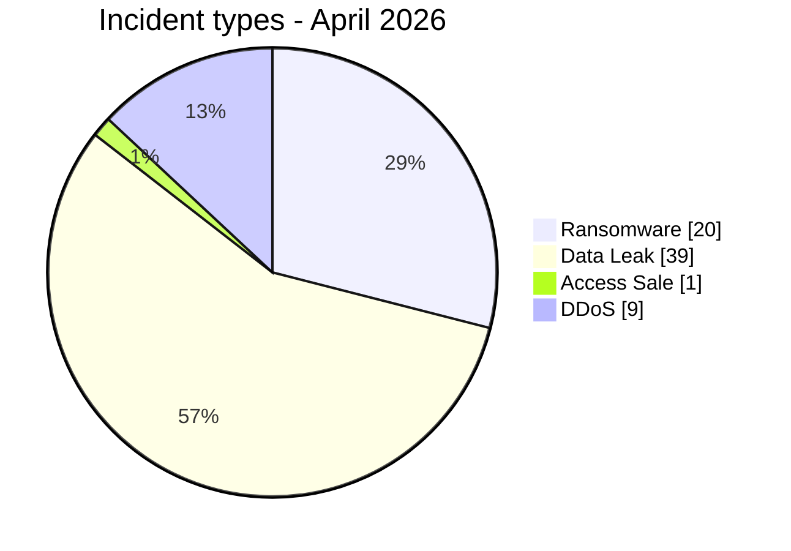
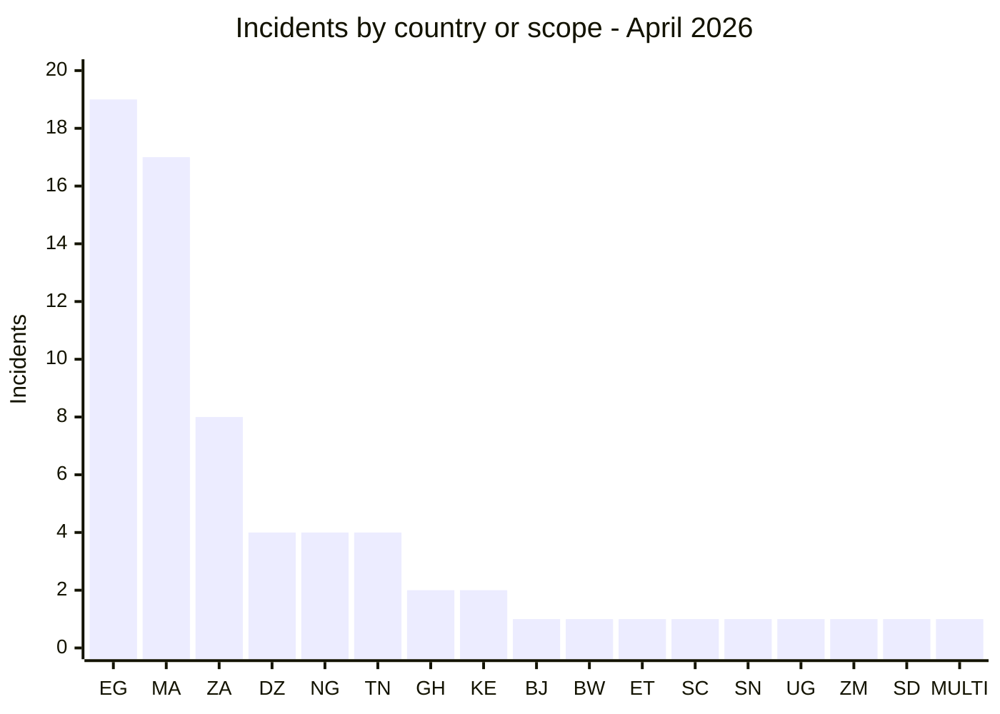
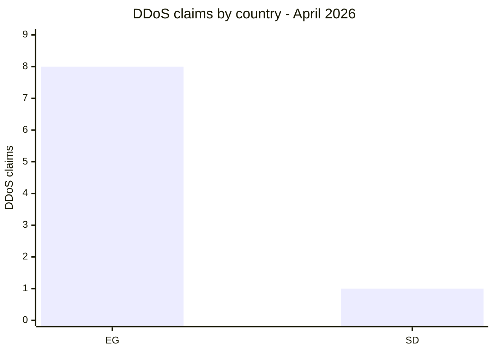
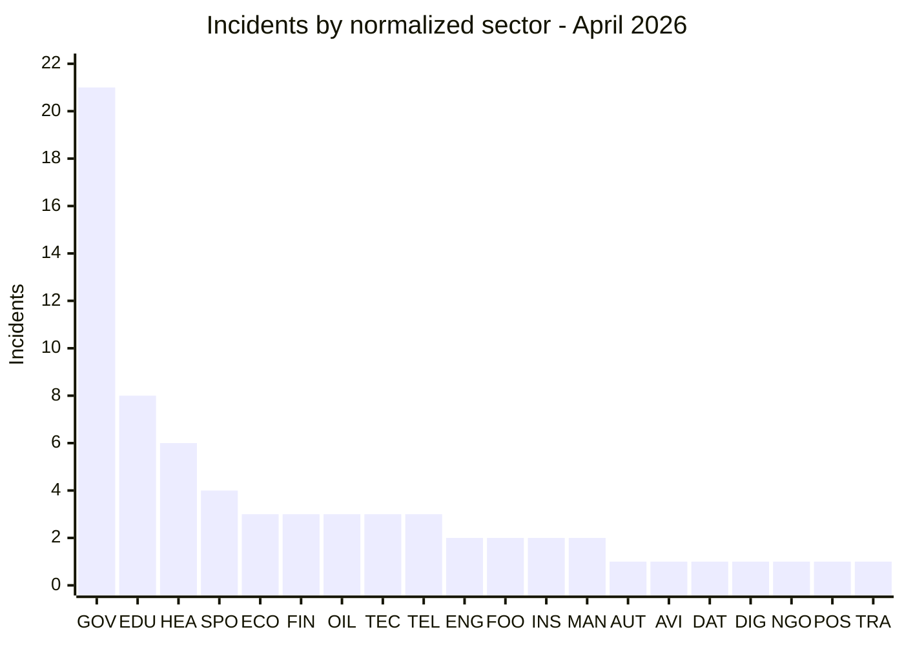
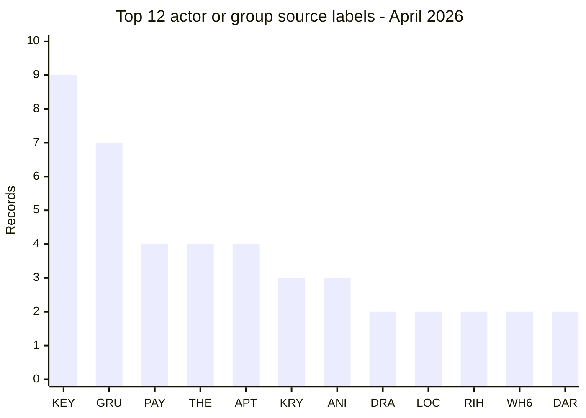
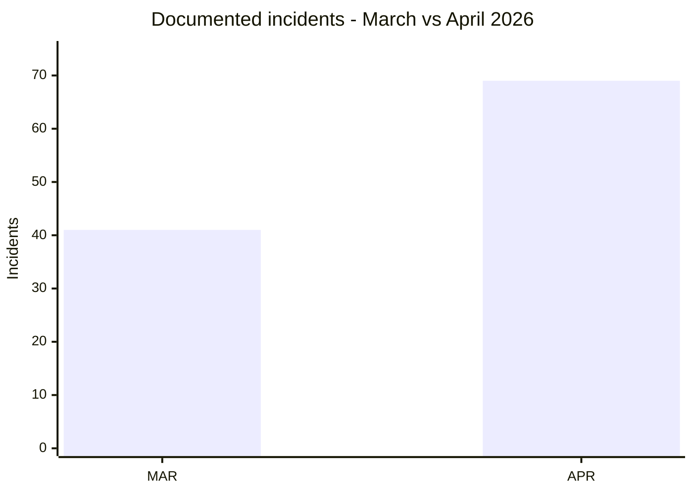

[](https://github.com/Hatchepsoute/AFRINTEL)


# CTI Report - Cyberattacks in Africa (April 2026)

👉🏾 [**French version available here**](./README_FR.md)

## 1. Executive summary

April 2026 contains **69 incidents** in the validated AFRINTEL corpus: **20 ransomware records (29.0%)**, **39 data leaks (56.5%)**, **1 access sale (1.4%)**, and **9 DDoS claims (13.0%)**.

**Egypt records 19 incidents**, followed by **Morocco with 17** and **South Africa with 8**. These three countries account for **44 of 69 records (63.8%)**.

The month combines ransomware, data exposure and brokerage, advertised privileged access, and actor-side DDoS claims. Notable records include a database attributed to Royal Palace staff in Morocco, the Pick n Pay ASAP / Bottles.com exposure in South Africa, a 2 TB ransomware claim involving the Kenya Airports Authority, and a 7.1 GB mailbox publication attributed to CNSS Benin.

> A claim or publication is not independent confirmation of compromise.

### Victim list

👉🏾 [View the full victim list](./victims.md)

---


### 1.1 Month-over-month comparison

> Comparison based on validated AFRINTEL monthly corpora. A change in documented records does not, by itself, prove a change in the real number of compromises.

| Indicator | March 2026 | April 2026 | Observed change |
|---|---:|---:|---:|
| Total incidents | 41 | 69 | **+28 (+68.3%)** |
| Ransomware | 19 | 20 | **+1 (+5.3%)** |
| Data Leak | 21 | 39 | **+18 (+85.7%)** |
| Access Sale | 0 | 1 | **+1 (new)** |
| DDoS | 0 | 9 | **+9 (new)** |
| Defacement | 0 | 0 | **0 (stable)** |
| Operational Fraud | 1 | 0 | **-1 (-100.0%)** |

> Reading rule: when the previous month is `0` and the current month is greater than `0`, the change is marked `new` instead of using an artificial percentage. Categories that are absent remain displayed as `0`.

## 2. Methodology

- **Scope:** African organizations, institutions and datasets documented in the April victim files.
- **Period:** 1-30 April 2026. Some publications concern earlier events identified during April.
- **Counting:** one victim card counts once globally. The multi-country card counts once globally and three times in the expanded geographic view.
- **Taxonomy:** Ransomware, Data Leak, Access Sale, DDoS, Defacement, Operational Fraud. April contains the first four categories.
- **Evidence:** a claim is not upgraded to a confirmed fact without independent support.
- **Sectors:** all 69 records are normalized into one primary category, with no residual `Other` category.

---

## 3. Global overview

| Indicator | April 2026 |
|---|---:|
| Total | **69** |
| Ransomware | **20 (29.0%)** |
| Data Leak | **39 (56.5%)** |
| Access Sale | **1 (1.4%)** |
| DDoS | **9 (13.0%)** |
| Direct country labels | **16** |
| Countries in expanded view | **17** |
| Geographic occurrences | **71** |
| Actor/group source labels | **37** |

### 3.1 Incident type distribution



**Color convention used in comparative views:** 🟧 Ransomware | 🟦 Data Leak / Access Sale | 🟥 DDoS.


### 3.2 Country ranking

| Code | Country / scope | Ransomware | Data Leak | Access Sale | DDoS | Total |
|---|---|---:|---:|---:|---:|---:|
| `EG` | Egypt | 9 | 2 | 0 | 8 | **19** |
| `MA` | Morocco | 2 | 15 | 0 | 0 | **17** |
| `ZA` | South Africa | 3 | 5 | 0 | 0 | **8** |
| `DZ` | Algeria | 0 | 4 | 0 | 0 | **4** |
| `NG` | Nigeria | 0 | 4 | 0 | 0 | **4** |
| `TN` | Tunisia | 0 | 4 | 0 | 0 | **4** |
| `GH` | Ghana | 2 | 0 | 0 | 0 | **2** |
| `KE` | Kenya | 1 | 1 | 0 | 0 | **2** |
| `BJ` | Benin | 0 | 1 | 0 | 0 | **1** |
| `BW` | Botswana | 1 | 0 | 0 | 0 | **1** |
| `ET` | Ethiopia | 0 | 1 | 0 | 0 | **1** |
| `SC` | Seychelles | 1 | 0 | 0 | 0 | **1** |
| `SN` | Senegal | 0 | 0 | 1 | 0 | **1** |
| `UG` | Uganda | 0 | 1 | 0 | 0 | **1** |
| `ZM` | Zambia | 1 | 0 | 0 | 0 | **1** |
| `SD` | Sudan | 0 | 0 | 0 | 1 | **1** |
| `MULTI` | Multi-country | 0 | 1 | 0 | 0 | **1** |
|  | **Total** | **20** | **39** | **1** | **9** | **69** |

```text
`EG` ███████████████████ 19
`MA` █████████████████ 17
`ZA` ████████ 8
`DZ` ████ 4
`NG` ████ 4
`TN` ████ 4
`GH` ██ 2
`KE` ██ 2
`BJ` █ 1
`BW` █ 1
`ET` █ 1
`SC` █ 1
`SN` █ 1
`UG` █ 1
`ZM` █ 1
`SD` █ 1
`MULTI` █ 1
```



**Country legend:** `EG` = Egypt | `MA` = Morocco | `ZA` = South Africa | `DZ` = Algeria | `NG` = Nigeria | `TN` = Tunisia | `GH` = Ghana | `KE` = Kenya | `BJ` = Benin | `BW` = Botswana | `ET` = Ethiopia | `SC` = Seychelles | `SN` = Senegal | `UG` = Uganda | `ZM` = Zambia | `SD` = Sudan | `MULTI` = Multi-country

### 3.3 Ransomware vs Data Leak / Access Sale by country

This visual comparison covers **60 of the 69 April incidents**: **20 ransomware records** and **40 Data Leak / Access Sale records**. For this comparison only, the **39 Data Leak incidents and 1 Access Sale are aggregated into one blue series**. Their structured counters remain separate elsewhere in the report.

The **9 DDoS claims are excluded from this two-category comparison** and shown separately below.

**Visual legend:** 🟧 Ransomware | 🟦 Data Leak / Access Sale | 🟥 DDoS

| Code | Country / scope | Ransomware | Bar | Data Leak / Access Sale | Bar |
|---|---|---:|---|---:|---|
| `EG` | Egypt | **9** | 🟧🟧🟧🟧🟧🟧🟧🟧🟧 | **2** | 🟦🟦 |
| `MA` | Morocco | **2** | 🟧🟧 | **15** | 🟦🟦🟦🟦🟦🟦🟦🟦🟦🟦🟦🟦🟦🟦🟦 |
| `ZA` | South Africa | **3** | 🟧🟧🟧 | **5** | 🟦🟦🟦🟦🟦 |
| `DZ` | Algeria | **0** | - | **4** | 🟦🟦🟦🟦 |
| `NG` | Nigeria | **0** | - | **4** | 🟦🟦🟦🟦 |
| `TN` | Tunisia | **0** | - | **4** | 🟦🟦🟦🟦 |
| `GH` | Ghana | **2** | 🟧🟧 | **0** | - |
| `KE` | Kenya | **1** | 🟧 | **1** | 🟦 |
| `BJ` | Benin | **0** | - | **1** | 🟦 |
| `BW` | Botswana | **1** | 🟧 | **0** | - |
| `ET` | Ethiopia | **0** | - | **1** | 🟦 |
| `SC` | Seychelles | **1** | 🟧 | **0** | - |
| `SN` | Senegal | **0** | - | **1** | 🟦 |
| `UG` | Uganda | **0** | - | **1** | 🟦 |
| `ZM` | Zambia | **1** | 🟧 | **0** | - |
| `SD` | Sudan | **0** | - | **0** | - |
| `MULTI` | Multi-country | **0** | - | **1** | 🟦 |
|  | **Compared total** | **20** |  | **40** |  |

```mermaid
xychart-beta
    title "Ransomware vs Data Leak / Access Sale by country - April 2026"
    x-axis ["EG", "MA", "ZA", "DZ", "NG", "TN", "GH", "KE", "BJ", "BW", "ET", "SC", "SN", "UG", "ZM", "SD", "MULTI"]
    y-axis "Incidents" 0 --> 16
    bar [9, 2, 3, 0, 0, 0, 2, 1, 0, 1, 0, 1, 0, 0, 1, 0, 0]
    bar [2, 15, 5, 4, 4, 4, 0, 1, 1, 0, 1, 0, 1, 1, 0, 0, 1]
```



**Series legend:** first bar series = 🟧 Ransomware | second bar series = 🟦 Data Leak / Access Sale.

**Country legend:** `EG` = Egypt | `MA` = Morocco | `ZA` = South Africa | `DZ` = Algeria | `NG` = Nigeria | `TN` = Tunisia | `GH` = Ghana | `KE` = Kenya | `BJ` = Benin | `BW` = Botswana | `ET` = Ethiopia | `SC` = Seychelles | `SN` = Senegal | `UG` = Uganda | `ZM` = Zambia | `SD` = Sudan | `MULTI` = Multi-country.

#### DDoS shown separately

| Code | Country | DDoS | Bar |
|---|---|---:|---|
| `EG` | Egypt | **8** | 🟥🟥🟥🟥🟥🟥🟥🟥 |
| `SD` | Sudan | **1** | 🟥 |
|  | **Total DDoS** | **9** | |



**DDoS legend:** 🟥 DDoS | `EG` = Egypt | `SD` = Sudan.

### 3.4 Geographic exposure by region


| Region | Ransomware | Data Leak | Access Sale | DDoS | Occurrences |
|---|---:|---:|---:|---:|---:|
| North Africa | 11 | 25 | 0 | 9 | **45** |
| Southern Africa | 5 | 6 | 0 | 0 | **11** |
| West Africa | 2 | 6 | 1 | 0 | **9** |
| East Africa | 1 | 3 | 0 | 0 | **4** |
| Indian Ocean | 1 | 0 | 0 | 0 | **1** |
| Central Africa | 0 | 1 | 0 | 0 | **1** |
| **Total** | **20** | **41** | **1** | **9** | **71** |

The expanded view contains 71 occurrences. The multi-country Data Leak record adds two occurrences beyond the deduplicated total, increasing Data Leak from 39 incidents to 41 geographic occurrences.


---

## 4. Detailed analysis by incident type

### 4.1 Ransomware - 20 incidents

Egypt records 9 ransomware publications, South Africa 3, Morocco and Ghana 2 each, then Kenya, Botswana, Seychelles and Zambia 1 each. The most frequent labels are Payload (4), APT73/BASHE (4), TheGentlemen (4), Krybit (3), DragonForce (2) and LockBit5 (2).

### 4.2 Data Leak - 39 incidents

Morocco records 15 direct leaks, South Africa 5, Algeria, Tunisia and Nigeria 4 each, Egypt 2, then Kenya, Benin, Ethiopia and Uganda 1 each. The multi-country record is also classified as Data Leak.

### 4.3 Access Sale - 1 incident

The DGCPT in Senegal is advertised with VPN credentials, administrator access and Domain Controller access. The validity of the advertised access is not independently confirmed.

### 4.4 DDoS - 9 incidents

The corpus contains 8 Egyptian targets and 1 Sudanese target, all attributed to Keymous+ in the source cards. Actor-side availability evidence does not establish traffic origin, method or duration.

---

## 5. Sectoral impact

| Code | Normalized sector | Incidents | Share |
|---|---|---:|---:|
| `GOV` | Government / Administration | 21 | 30.4% |
| `EDU` | Education / University | 8 | 11.6% |
| `HEA` | Healthcare / Medical | 6 | 8.7% |
| `SPO` | Sports / Federations | 4 | 5.8% |
| `ECO` | E-commerce / Retail | 3 | 4.3% |
| `FIN` | Finance / Banking | 3 | 4.3% |
| `OIL` | Oil & Energy | 3 | 4.3% |
| `TEC` | Technology / Digital Services | 3 | 4.3% |
| `TEL` | Telecommunications | 3 | 4.3% |
| `ENG` | Engineering / Construction | 2 | 2.9% |
| `FOO` | Food / Beverage | 2 | 2.9% |
| `INS` | Insurance / Assistance | 2 | 2.9% |
| `MAN` | Manufacturing / Industry | 2 | 2.9% |
| `AUT` | Automotive | 1 | 1.4% |
| `AVI` | Aviation / Transportation | 1 | 1.4% |
| `DAT` | Data / Marketing | 1 | 1.4% |
| `DIG` | Digital Identity / Data | 1 | 1.4% |
| `NGO` | NGO / Social Welfare | 1 | 1.4% |
| `POS` | Postal / Logistics | 1 | 1.4% |
| `TRA` | Travel / Tourism | 1 | 1.4% |
|  | **Total** | **69** | **100%** |



**Sector legend:** `GOV` = Government / Administration | `EDU` = Education / University | `HEA` = Healthcare / Medical | `SPO` = Sports / Federations | `ECO` = E-commerce / Retail | `FIN` = Finance / Banking | `OIL` = Oil & Energy | `TEC` = Technology / Digital Services | `TEL` = Telecommunications | `ENG` = Engineering / Construction | `FOO` = Food / Beverage | `INS` = Insurance / Assistance | `MAN` = Manufacturing / Industry | `AUT` = Automotive | `AVI` = Aviation / Transportation | `DAT` = Data / Marketing | `DIG` = Digital Identity / Data | `NGO` = NGO / Social Welfare | `POS` = Postal / Logistics | `TRA` = Travel / Tourism

Government / Administration leads with 21 records (30.4%), followed by Education / University with 8 (11.6%) and Healthcare / Medical with 6 (8.7%).


---

## 6. Threat Actor Profile

| Code | Actor / Group | Records | Dominant activity |
|---|---|---:|---|
| `KEY` | Keymous+ | **9** | DDoS |
| `GRU` | Grubder | **7** | Data leaks |
| `PAY` | Payload | **4** | Ransomware |
| `THE` | TheGentlemen | **4** | Ransomware |
| `APT` | APT73/BASHE | **4** | Ransomware |
| `KRY` | Krybit | **3** | Ransomware |
| `ANI` | anisanas2 | **3** | Data leaks |
| `DRA` | DragonForce | **2** | Ransomware |
| `LOC` | LockBit5 | **2** | Ransomware |
| `RIH` | Rihana | **2** | Data leaks |
| `WH6` | wh6ami | **2** | Data leaks |
| `DAR` | dark07x | **2** | Data leaks |



**Actor legend:** `KEY` = Keymous+ | `GRU` = Grubder | `PAY` = Payload | `THE` = TheGentlemen | `APT` = APT73/BASHE | `KRY` = Krybit | `ANI` = anisanas2 | `DRA` = DragonForce | `LOC` = LockBit5 | `RIH` = Rihana | `WH6` = wh6ami | `DAR` = dark07x

These 12 labels account for 44 records. The other 25 source labels occur once each. Keymous+ and Keymous remain separate because the naming similarity is not sufficient to merge them.

### 6.1 Monthly country exposure indicator

Volume-only April indicator: 🔴 High = 8+ records | 🟠 Medium = 2 to 7 | 🟡 Low-Medium = 1.

| Country | Records | Exposure |
|---|---:|---|
| 🇪🇬 Egypt | 19 | 🔴 High |
| 🇲🇦 Morocco | 17 | 🔴 High |
| 🇿🇦 South Africa | 8 | 🔴 High |
| 🇩🇿 Algeria | 4 | 🟠 Medium |
| 🇳🇬 Nigeria | 4 | 🟠 Medium |
| 🇹🇳 Tunisia | 4 | 🟠 Medium |
| 🇬🇭 Ghana | 2 | 🟠 Medium |
| 🇰🇪 Kenya | 2 | 🟠 Medium |


---

## 7. Key Trends & Intelligence Gaps

- April rises from **41 incidents in March to 69**, or **+28 (+68.3%)**.
- Data Leak represents **39 incidents (56.5%)**.
- Egypt, Morocco and South Africa account for **63.8%** of the corpus.
- Government / Administration is the leading sector with **21 records (30.4%)**.
- The corpus contains **37 distinct actor/group source labels**.



**Legend:** `MAR` = March 2026 | `APR` = April 2026.

**Priority gaps:** initial access is often unknown, claimed volumes are not uniformly verifiable, DDoS method cannot be identified from availability checks alone, and victim-side public DFIR reporting is limited in the reviewed sources.

---

## 8. MITRE ATT&CK Mapping - Contextual

| Technique | Name | Context | Assessment |
|---|---|---|---|
| T1190 | Exploit Public-Facing Application | National Oil Ethiopia, ProxyLogon described in the publication | Actor claim, not independently confirmed |
| T1078 | Valid Accounts | DGCPT access sale | Advertised access, validity not confirmed |
| T1498 | Network Denial of Service | 9 DDoS claims | Defensive context, specific technique not established |
| T1005 | Data from Local System | Database and internal-data publications | Analytical context, acquisition mechanism not established for every leak |

---

## 9. Recommendations

| Organization type | Priority actions |
|---|---|
| Government | MFA, PAM, administrative-portal monitoring, database export controls |
| Education | MFA, segmentation, helpdesk-account protection, database monitoring |
| Healthcare | Privileged-access review, sensitive-export encryption, bulk-query monitoring |
| Finance | VPN/PAM monitoring, authentication anomalies, exposed-credential controls |
| E-commerce | Sensitive-data minimization, export and third-party integration controls |
| Telecommunications | Harden exposed services and preserve availability telemetry |

---

## 10. SOC & Tactical Recommendations

| Qualification | Defensive action |
|---|---|
| Observed | Monitor bulk database reads and unusual exports |
| Observed | Alert on VPN and administrator-account anomalies |
| Observed | Preserve NetFlow, WAF, CDN and edge telemetry around DDoS claims |
| Hypothesis | Hunt for public-facing exploitation where the source explicitly claims it |
| Preventive | Phishing-resistant MFA and least privilege |
| Preventive | Segment backup, directory and administration planes |

---

## 11. Strategic Recommendations

1. Keep Data Leak and Access Sale separate in structured statistics.
2. Treat DDoS availability evidence as a distinct evidence class.
3. Prioritize identity and privileged-access governance.
4. Improve evidence retention and DFIR traceability where the context allows it.
5. Maintain one validated bilingual corpus for all statistics and STIX/OpenCTI outputs.

---

## 12. Conclusion

April 2026 confirms a further rise in documented cyber activity across Africa, with **69 incidents compared with 41 in March**. Data Leak dominates with **39 incidents**, while ransomware remains significant with **20 publications**, alongside **9 DDoS claims and 1 Access Sale**.

**Egypt, Morocco and South Africa account for 63.8% of the corpus.** For AFRINTEL, April reinforces the need to keep incident type, actor claim, available evidence and confidence level separate so monthly trends remain reproducible.

**AFRINTEL** - African Cyber Threat Intelligence

Repository: https://github.com/Hatchepsoute/AFRINTEL