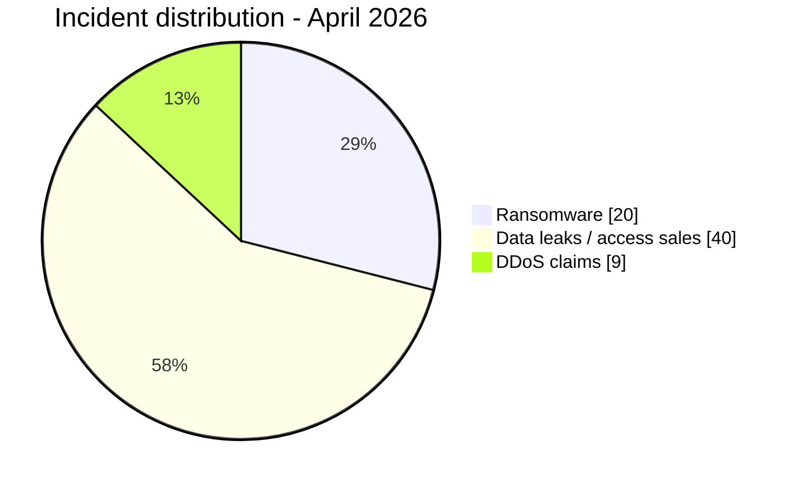

# CTI Report - Cyberattacks in Africa (April 2026)

👉🏾 [**French version available here**](./README_FR.md)

## 1. Executive summary

April 2026 includes **69 publicly claimed or documented cyber incidents** in the AFRINTEL corpus: **20 ransomware claims or publications**, **40 data leaks or access sales**, and **9 DDoS claims**.

The country-level reconciliation changes the April ranking materially. **Egypt records 19 incidents** once the eight Egyptian DDoS claims are included, ahead of **Morocco with 17** and **South Africa with 8**. One additional DDoS claim concerns Sudan.

Key findings:
- **20 ransomware incidents (29.0%)**, **40 data leaks / access sales (58.0%)**, and **9 DDoS claims (13.0%)**.
- **17 African countries** are represented after expanding the single multi-country record; 16 have a direct country-labelled record and Angola appears through the multi-country government-access claim.
- **Egypt (19)**, **Morocco (17)** and **South Africa (8)** account for **44 of 69 incidents (63.8%)**.
- The April DDoS set contains **8 Egyptian targets** and **1 Sudanese target**, all attributed in the victim cards to **Keymous+**.
- Government, education and healthcare together account for a large part of the non-DDoS corpus; the DDoS observations further increase public-sector exposure.

> The entries documented by AFRINTEL are claims, publications, leak-site listings or observed availability evidence. They do not independently confirm compromise, traffic origin, encryption or the complete intrusion chain unless the victim card contains supporting evidence.

### Victim list

👉🏾 [View full victim list](./victims.md)

---

## 2. Methodology

- **Scope:** African victims, institutions and datasets monitored by AFRINTEL.
- **Period:** 1-30 April 2026. Some source publications may refer to earlier compromise or leak dates.
- **Sources:** leak sites, underground forums, Telegram channels and OSINT material documented in the victim cards.
- **Counting rule:** each victim card is counted once in the global total. The multi-country government-access card is one incident globally but is expanded to its listed countries in geographic-exposure analysis.
- **Ransomware:** victim publication or claim by a ransomware group; encryption is not presumed without supporting evidence.
- **Data leak / access sale:** published or sampled data, database sale, credential exposure or access offer.
- **DDoS:** actor-claimed or availability-observed disruption. Availability evidence does not independently prove traffic origin, method, duration or impact.

---

## 3. Global overview

| Indicator | Value |
|---|---:|
| Total incidents | **69** |
| Ransomware | **20 (29.0%)** |
| Data leaks / access sales | **40 (58.0%)** |
| DDoS claims | **9 (13.0%)** |
| Direct country-labelled incidents | **68** |
| Multi-country incidents | **1** |
| Distinct African countries in expanded exposure | **17** |
| Expanded geographic occurrences | **71** |

### Country ranking - all incident types

| Rank | Country / record | Ransomware | Leaks / access | DDoS | Total |
| :---: | :--- | ---: | ---: | ---: | ---: |
| **1** | 🇪🇬 Egypt | 9 | 2 | 8 | **19** |
| **2** | 🇲🇦 Morocco | 2 | 15 | 0 | **17** |
| **3** | 🇿🇦 South Africa | 3 | 5 | 0 | **8** |
| **4** | 🇳🇬 Nigeria | 0 | 4 | 0 | **4** |
| **5** | 🇩🇿 Algeria | 0 | 4 | 0 | **4** |
| **6** | 🇹🇳 Tunisia | 0 | 4 | 0 | **4** |
| **7** | 🇰🇪 Kenya | 1 | 1 | 0 | **2** |
| **8** | 🇬🇭 Ghana | 2 | 0 | 0 | **2** |
| **9** | 🇧🇯 Benin | 0 | 1 | 0 | **1** |
| **10** | 🇧🇼 Botswana | 1 | 0 | 0 | **1** |
| **11** | 🇪🇹 Ethiopia | 0 | 1 | 0 | **1** |
| **12** | 🇸🇨 Seychelles | 1 | 0 | 0 | **1** |
| **13** | 🇸🇳 Senegal | 0 | 1 | 0 | **1** |
| **14** | 🇺🇬 Uganda | 0 | 1 | 0 | **1** |
| **15** | 🇿🇲 Zambia | 1 | 0 | 0 | **1** |
| **16** | 🇸🇩 Sudan | 0 | 0 | 1 | **1** |
| **–** | 🌍 Multi-country: Angola / South Africa / Nigeria | 0 | 1 | 0 | **1** |
| **Total** |  | **20** | **40** | **9** | **69** |

### Ransomware distribution

| Country | Incidents |
|---|---:|
| 🇪🇬 Egypt | 9 |
| 🇿🇦 South Africa | 3 |
| 🇲🇦 Morocco | 2 |
| 🇬🇭 Ghana | 2 |
| 🇰🇪 Kenya | 1 |
| 🇧🇼 Botswana | 1 |
| 🇸🇨 Seychelles | 1 |
| 🇿🇲 Zambia | 1 |
| **Total** | **20** |

### Data leaks / access sales distribution

| Country / record | Incidents |
|---|---:|
| 🇲🇦 Morocco | 15 |
| 🇿🇦 South Africa | 5 |
| 🇳🇬 Nigeria | 4 |
| 🇩🇿 Algeria | 4 |
| 🇹🇳 Tunisia | 4 |
| 🇪🇬 Egypt | 2 |
| 🇰🇪 Kenya | 1 |
| 🇧🇯 Benin | 1 |
| 🇪🇹 Ethiopia | 1 |
| 🇸🇳 Senegal | 1 |
| 🇺🇬 Uganda | 1 |
| 🌍 Multi-country: Angola / South Africa / Nigeria | 1 |
| **Total** | **40** |

### DDoS distribution

| Country | DDoS claims |
|---|---:|
| 🇪🇬 Egypt | **8** |
| 🇸🇩 Sudan | **1** |
| **Total** | **9** |

The DDoS cards concern Orange Egypt, Telecom Egypt, the Government of Egypt portal, the Ministries of Finance, Justice, Trade and Industry, Petroleum and Mineral Resources, the Egyptian State Information Service, and the Rapid Support Force website in Sudan.

---

## 4. Geographic exposure

The global total remains **69 incidents**. The multi-country government-access record is one incident globally but lists **Angola, South Africa and Nigeria**. Expanding that single record produces **71 geographic occurrences**.

| Region | Ransomware occurrences | Leak / access occurrences | DDoS occurrences | Total geographic occurrences |
|---|---:|---:|---:|---:|
| North Africa | 11 | 25 | 9 | **45** |
| Southern Africa | 5 | 6 | 0 | **11** |
| West Africa | 2 | 7 | 0 | **9** |
| East Africa | 2 | 3 | 0 | **5** |
| Central Africa | 0 | 1 | 0 | **1** |
| **Total** | **20** | **42** | **9** | **71** |

> This table measures geographic exposure, not deduplicated incident count. The leak/access column rises from 40 incidents to 42 occurrences because the single Angola/South Africa/Nigeria record is represented in each affected region.

---

## 5. Analysis by incident type

### 5.1 Ransomware - 20 incidents

Egypt is the leading ransomware country in April with **9 listings**, followed by South Africa with **3**, Morocco and Ghana with **2 each**, then Kenya, Botswana, Seychelles and Zambia with one each.

The most active ransomware names in the victim cards include **payload (4)**, **APT73/BASHE (4)**, **TheGentlemen (4)**, **krybit (3)**, **DragonForce (2)** and **LockBit5 (2)**. These counts describe publications in the AFRINTEL corpus; they do not establish a common campaign or shared access vector.

### 5.2 Data leaks and access sales - 40 incidents

Morocco leads this category with **15 records**, followed by South Africa with **5**, and Algeria, Tunisia and Nigeria with **4 each**. Egypt records **2**. Kenya, Benin, Ethiopia, Senegal and Uganda each have one direct record, plus the single multi-country government-access sale.

High-impact records documented in the victim cards include sensitive identity, financial, healthcare, academic, municipal and payment-related data. Examples include Royal Palace staff data in Morocco, CNSS Benin mailbox material, municipal records in South Africa, and the Pick n Pay ASAP / Bottles.com dataset.

### 5.3 DDoS claims - 9 incidents

All nine DDoS cards are attributed to **Keymous+** in the source files:
- **8 in Egypt**
- **1 in Sudan**

The source material records actor-side availability evidence such as Check-Host or equivalent results. AFRINTEL therefore retains the status as **Claim - Unverified** and does not infer the traffic source, technique, duration or confirmed victim impact.

---

## 6. Sectoral impact

To avoid mixing two different analytical methods, the sector view is presented in two parts.

### 6.1 Ransomware and data-leak/access corpus - 60 records

The pre-existing normalized sector view covers the **60 ransomware and leak/access records**:

| Normalized sector | Records | Share of 60 |
|---|---:|---:|
| Government / Administration | 15 | 25.0% |
| Education / University | 8 | 13.3% |
| Healthcare / Medical | 4 | 6.7% |
| Finance / Banking | 4 | 6.7% |
| Sports / Federations | 4 | 6.7% |
| E-commerce / Retail | 3 | 5.0% |
| Oil & Energy | 3 | 5.0% |
| Telecommunications | 1 | 1.7% |
| Other documented sectors | 18 | 30.0% |
| **Total** | **60** | **100%** |

### 6.2 DDoS sector distribution - 9 records

| Sector in victim cards | DDoS claims |
|---|---:|
| Government / Administration | **7** |
| Telecommunications | **2** |
| **Total** | **9** |

This split makes clear why the earlier sector table appeared to total 69 while its category rows actually summed to only 60.

---

## 7. Threat actor profile

| Threat actor / Group | Records | Dominant activity |
|---|---:|---|
| **Keymous+** | **9** | DDoS claims |
| **Grubder** | **7** | Data leaks |
| **payload** | **4** | Ransomware |
| **APT73 / BASHE** | **4** | Ransomware |
| **TheGentlemen** | **4** | Ransomware |
| **krybit** | **3** | Ransomware |
| **anisanas2** | **3** | Data leaks |
| **DragonForce** | **2** | Ransomware |
| **LockBit5** | **2** | Ransomware |
| **Rihana** | **2** | Data leaks |
| **wh6ami** | **2** | Data leaks |
| **dark07x** | **2** | Data leaks |
| **NormalLeVrai** | **2** | Data leaks / access |
| Records outside displayed ranking | **23** | Mixed |
| **Total** | **69** | |

> `Keymous+` and `Keymous` are kept as separate source labels in this monthly report. No identity equivalence is assumed from the naming similarity alone.

---

## 8. Key CTI trends and intelligence gaps

- **Egypt becomes the highest-volume country in April once DDoS records are included:** 19 incidents, including eight DDoS claims.
- **Morocco remains the leading data-leak country:** 15 leak/access records out of 17 total Moroccan incidents.
- **Government exposure is broader than the ransomware/leak view alone suggested:** seven of the nine DDoS cards are government/administration targets.
- **Data brokerage remains prominent:** the month includes structured CRM, identity, healthcare, education and administrative datasets advertised or published underground.
- **Availability evidence must remain separate from confirmed DDoS attribution:** the Keymous+ cards document actor-side claims and apparent unavailability, not independently verified traffic origin or method.

### Factual comparison with March 2026

This comparison preserves the March figures already present in the source report and corrects only the April side with the reconciled 69-card corpus.

| Indicator | March 2026 | April 2026 | Observed change |
|---|---:|---:|---:|
| Documented incidents | 41 | **69** | **+28 (+68.3%)** |
| Ransomware / extortion | 19 | **20** | **+1** |
| Other non-ransomware records | 22 | **49** | **+27** |

> The April non-ransomware value is 40 data leaks/access sales + 9 DDoS claims. The March categories are retained as stated in the existing report because this correction is based on the April source files.

---

## 9. MITRE ATT&CK mapping - contextual

| Phase | Technique | Analytical scope |
|---|---|---|
| Initial access | T1566 - Phishing | Defensive hypothesis; not observed from claims alone |
| Initial access | T1190 - Exploit Public-Facing Application | Defensive hypothesis unless documented by supporting evidence |
| Account access | T1078 - Valid Accounts | Relevant to credential and access-sale scenarios |
| Collection | T1005 - Data from Local System | Contextual hypothesis where internal data is published |
| Impact | T1486 - Data Encrypted for Impact | Use only when encryption is supported by evidence |

No ATT&CK technique is treated as observed solely because a victim appears on a leak site or underground post.

---

## 10. Defensive priorities

- Enforce phishing-resistant MFA on privileged, government, financial and externally exposed accounts.
- Monitor bulk exports, database dumps, unusual cloud-storage access and high-volume outbound transfers.
- Maintain rapid credential revocation workflows for access-sale or credential-exposure cases.
- Separate ransomware publication, confirmed encryption, data exfiltration and DDoS availability claims as distinct evidence fields.
- Preserve original publication date, AFRINTEL discovery date and evidence status for each record.

---

## 11. Conclusion

AFRINTEL records **69 April 2026 incidents**: **20 ransomware**, **40 data leaks / access sales** and **9 DDoS claims**. Once the DDoS cards are included in the country view, **Egypt leads with 19 incidents**, followed by **Morocco with 17** and **South Africa with 8**.

The April correction does not change the global count of 69; it corrects how those 69 records are distributed by country, region, sector view and threat actor.

**AFRINTEL** - African Cyber Threat Intelligence
