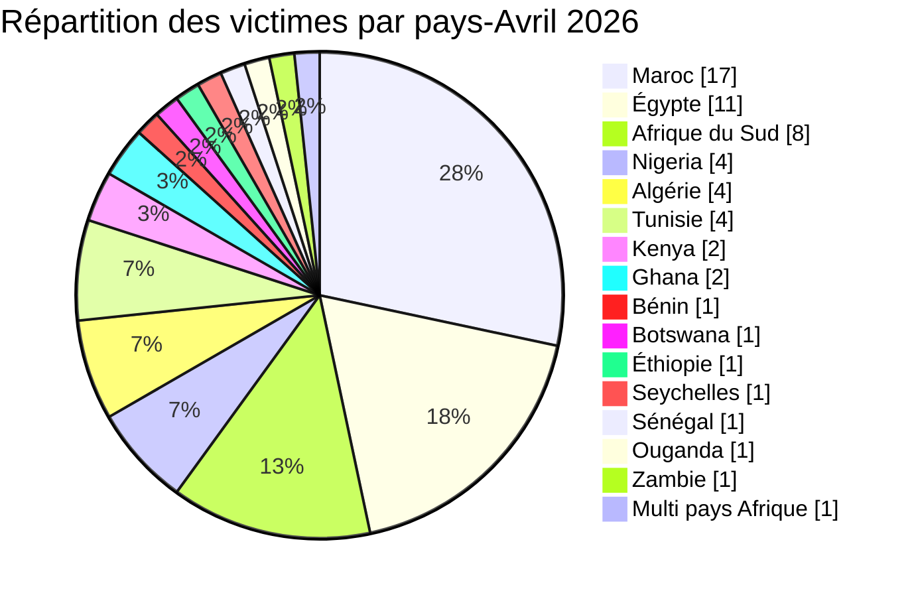
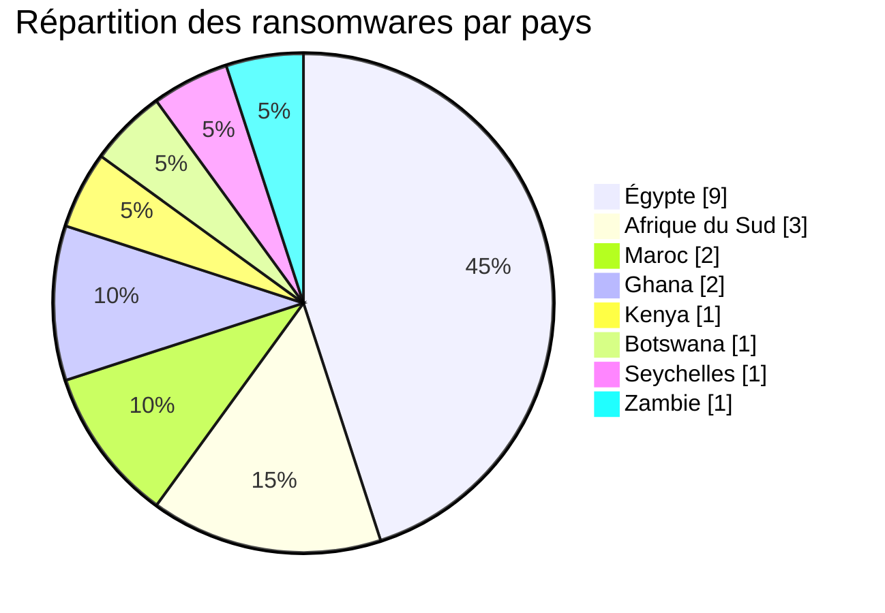
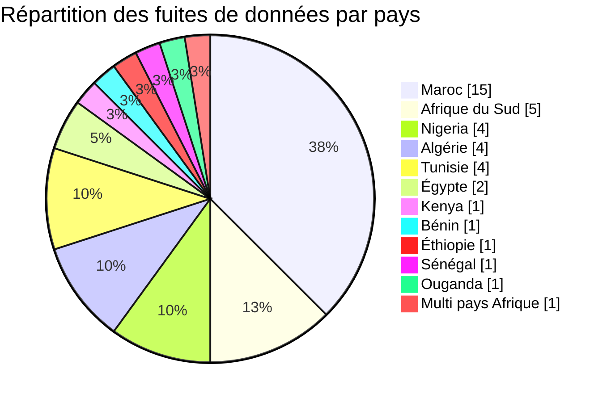
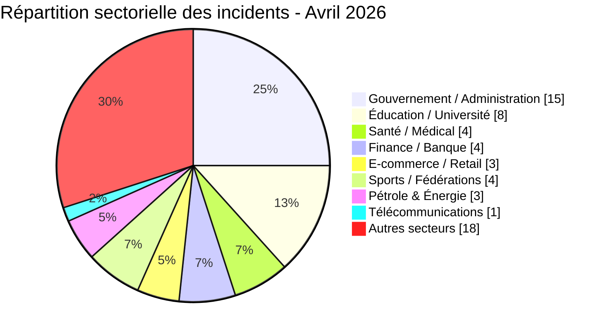
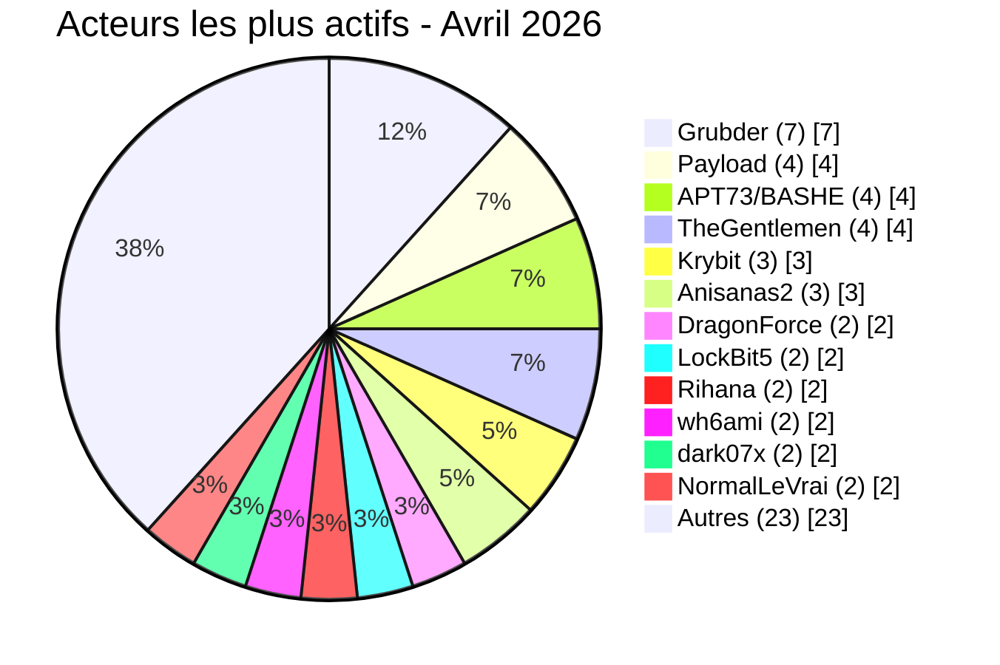

# Rapport CTI - menaces cyber en Afrique (Avril 2026)

👉🏾 [**English version available here**](./README.md)

## 1. Synthèse exécutive

Avril 2026 a enregistré **60 incidents cyber revendiqués publiquement** sur le continent - **20 ransomwares** et **40 fuites de données / ventes d’accès**. La menace s’intensifie avec une prolifération de courtiers de données, des expositions très sensibles (personnel du palais royal, documents d’identité, dossiers médicaux) et des ventes d’accès ciblant les gouvernements. Les groupes de ransomware **payload**, **apt73/bashe**, **thegentlemen** et **krybit** maintiennent la pression, tandis que les acteurs de fuites **Grubder**, **anisanas2**, **dark07x**, **wh6ami** et **Rihana** dominent le marché souterrain.

Principales conclusions :
- **20 ransomwares (33,3 %)** et **40 fuites de données / ventes d’accès (66,7 %)**.
- **16 pays** touchés ; le **Maroc** (17 incidents), l’**Égypte** (11) et l’**Afrique du Sud** (8) concentrent 60 % des victimes.
- Plus de **30 acteurs distincts** ; les courtiers de données **Grubder** (7 victimes) et **anisanas2** (3 victimes) en tête.
- Les secteurs gouvernemental, éducatif et de la santé restent les plus visés (45 % combinés).
- Brèches massives : base du personnel du Palais Royal (3 300 fiches avec CNIE), Pick n Pay ASAP/Bottles.com (données bancaires complètes), Kenya Airports Authority (2 To revendiqués), fuite de la messagerie CNSS Bénin (7,1 Go).

### 📋 Liste des victimes

👉🏾 [Voir la liste complète des victimes](./victims_FR.md)

## 2. Méthodologie

- **Périmètre** : 54 pays africains.
- **Période** : 1er - 30 avril 2026 (incidents révélés ou revendiqués ; les attaques peuvent être antérieures).
- **Sources** : Dark web, DLS, OSINT, Telegram, forums underground.
- **Inclusion** : incidents publiquement revendiqués avec victime, pays et secteur identifiés.
- **Typologie** :
  - *Ransomware* : publication d’une victime ou revendication par un groupe ransomware. Le chiffrement n’est pas présumé sans élément probant.
  - *Fuite de données / vente d’accès* : exfiltration sans chiffrement, base de données vendue ou publiée, ou vente d’accès à des systèmes compromis.

## 3. Vue d’ensemble

| Indicateur                     | Valeur |
|--------------------------------|--------|
| Nombre total de victimes       | 60     |
| Pays touchés                   | 16     |
| Acteurs distincts              | 30+    |
| Ransomwares                    | 20 (33,3 %) |
| Fuites de données / ventes d’accès | 40 (66,7 %) |

### Classement des pays les plus touchés

**Tous incidents confondus (60) :**
| Rang | Pays | Incidents | Graphique |
| :---: | :--- | :---: | :--- |
| **1** | 🇲🇦 Maroc | **17** | █████████████████ |
| **2** | 🇪🇬 Égypte | **11** | ███████████ |
| **3** | 🇿🇦 Afrique du Sud | **8** | ████████ |
| **4** | 🇳🇬 Nigeria | **4** | ████ |
| **5** | 🇩🇿 Algérie | **4** | ████ |
| **6** | 🇹🇳 Tunisie | **4** | ████ |
| **7** | 🇰🇪 Kenya | **2** | ██ |
| **8** | 🇬🇭 Ghana | **2** | ██ |
| **9** | 🇧🇯 Bénin | **1** | █ |
| **10** | 🇧🇼 Botswana | **1** | █ |
| **11** | 🇪🇹 Éthiopie | **1** | █ |
| **12** | 🇸🇨 Seychelles | **1** | █ |
| **13** | 🇸🇳 Sénégal | **1** | █ |
| **14** | 🇺🇬 Ouganda | **1** | █ |
| **15** | 🇿🇲 Zambie | **1** | █ |
| **–** | 🌍 Multi‑pays *(AO, ZA, NG)* | **1** | █ |

*Note : L'incident multi-pays est comptabilisé comme 1 victime globale.*

### 📊 Répartition des incidents par ransomware (Total : 20)

| Rang | Pays | Incidents | Graphique |
| :---: | :--- | :---: | :--- |
| **1** | 🇪🇬 Égypte | **9** | █████████ |
| **2** | 🇿🇦 Afrique du Sud | **3** | ███ |
| **3** | 🇲🇦 Maroc | **2** | ██ |
| **4** | 🇬🇭 Ghana | **2** | ██ |
| **5** | 🇰🇪 Kenya | **1** | █ |
| **6** | 🇧🇼 Botswana | **1** | █ |
| **7** | 🇸🇨 Seychelles | **1** | █ |
| **8** | 🇿🇲 Zambie | **1** | █ |

### 📊 Répartition des incidents par fuites de données (Total : 40)

| Rang | Pays | Incidents | Graphique |
| :---: | :--- | :---: | :--- |
| **1** | 🇲🇦 Maroc | **15** | ███████████████ |
| **2** | 🇿🇦 Afrique du Sud | **5** | █████ |
| **3** | 🇳🇬 Nigeria | **4** | ████ |
| **4** | 🇩🇿 Algérie | **4** | ████ |
| **5** | 🇹🇳 Tunisie | **4** | ████ |
| **6** | 🇪🇬 Égypte | **2** | ██ |
| **7** | 🇰🇪 Kenya | **1** | █ |
| **8** | 🇧🇯 Bénin | **1** | █ |
| **9** | 🇪🇹 Éthiopie | **1** | █ |
| **10** | 🇸🇳 Sénégal | **1** | █ |
| **11** | 🇺🇬 Ouganda | **1** | █ |
| **–** | 🌍 Multi‑pays Afrique | **1** | █ |

### Répartition des victimes par pays

### 📊 Comparaison Ransomwares vs. Fuites de Données par Pays

| Pays | Ransomware | Fuites | Répartition Côte-à-Côte |
| :--- | :---: | :---: | :--- |
| 🇲🇦 Maroc | **2** | **15** | 🟧🟧 🟦🟦🟦🟦🟦🟦🟦🟦🟦🟦🟦🟦🟦🟦🟦 |
| 🇪🇬 Égypte | **9** | **2** | 🟧🟧🟧🟧🟧🟧🟧🟧🟧 🟦🟦 |
| 🇿🇦 Afrique du Sud | **3** | **5** | 🟧🟧🟧 🟦🟦🟦🟦🟦 |
| 🇳🇬 Nigeria | **0** | **4** | 🟦🟦🟦🟦 |
| 🇩🇿 Algérie | **0** | **4** | 🟦🟦🟦🟦 |
| 🇹🇳 Tunisie | **0** | **4** | 🟦🟦🟦🟦 |
| 🇰🇪 Kenya | **1** | **1** | 🟧 🟦 |
| 🇬🇭 Ghana | **2** | **0** | 🟧🟧 |
| 🇧🇯 Bénin | **0** | **1** | 🟦 |
| 🇧🇼 Botswana | **1** | **0** | 🟧 |
| 🇪🇹 Éthiopie | **0** | **1** | 🟦 |
| 🇸🇨 Seychelles | **1** | **0** | 🟧 |
| 🇸🇳 Sénégal | **0** | **1** | 🟦 |
| 🇺🇬 Ouganda | **0** | **1** | 🟦 |
| 🇿🇲 Zambie | **1** | **0** | 🟧 |
| 🌍 Multi‑pays Afrique | **0** | **1** | 🟦 |
| **Total (60)** | **20** | **40** | *Légende : 🟧 Ransomware \| 🟦 Fuite de Données* |

### 📊 Synthèse des secteurs ciblés par pays

| Rang | Pays | Vol. Secteurs | Secteurs ciblés & Répartition |
| :---: | :--- | :--- | :--- |
| **1** | 🇲🇦 Maroc | ███████████████ | Éducation (**3**), Santé (**3**), Sports (**3**), Gouvernement (**2**), Finance (**2**), Identité numérique (**1**), Services (**1**), Agroalimentaire/Retail (**1**), Données personnelles (**1**) |
| **2** | 🇪🇬 Égypte | █████████ | Éducation (**2**), Énergie (**2**), Finance (**1**), Automobile (**1**), Ingénierie (**1**), Manufacture (**1**), Construction (**1**) |
| **3** | 🇿🇦 Afrique du Sud | ███████ | E‑commerce (**2**), Gouvernement (**2**), Éducation (**1**), Télécoms (**1**), Tourisme (**1**), Agroalimentaire (**1**) + *Accès gouv. multi‑pays* |
| **4** | 🇳🇬 Nigeria | ████ | Gouvernement (**3**), ONG (**1**) + *Accès gouv. multi‑pays* |
| **5** | 🇩🇿 Algérie | ████ | Gouvernement (**2**), Assurance (**1**), Sports (**1**) |
| **6** | 🇹🇳 Tunisie | ████ | E‑commerce (**1**), Éducation (**1**), Services (**1**), Réseau social (**1**) |
| **7** | 🇰🇪 Kenya | ██ | Gouvernement (**1**), Aviation (**1**) |
| **8** | 🇬🇭 Ghana | ██ | Santé (**1**), Finance (**1**) |
| **9** | 🇧🇯 Bénin | █ | Gouvernement (**1**) |
| **10** | 🇧🇼 Botswana | █ | Éducation (**1**) |
| **11** | 🇪🇹 Éthiopie | █ | Énergie (**1**) |
| **12** | 🇸🇳 Sénégal | █ | Gouvernement (**1**) |
| **13** | 🇸🇨 Seychelles | █ | Gouvernement (**1**) |
| **14** | 🇺🇬 Ouganda | █ | Gouvernement (**1**) |
| **15** | 🇿🇲 Zambie | █ | Assurance (**1**) |
| **–** | 🌍 Angola | █ | *Accès gouvernemental multi‑pays (incident combiné)* |

**Répartition des ransomwares par pays - Avril 2026**

**Fuites de données par pays - Avril 2026**

### 📊 Répartition géographique des incidents par région

| Région | Total Incidents | Ransomware | Fuites | Répartition Côte-à-Côte |
| :--- | :---: | :---: | :---: | :--- |
| **Afrique du Nord** | **36** (58,1 %) | 11 | 25 | 🟧🟧🟧🟧🟧🟧🟧🟧🟧🟧🟧 🟦🟦🟦🟦🟦🟦🟦🟦🟦🟦🟦🟦🟦🟦🟦🟦🟦🟦🟦🟦🟦🟦🟦  |
| **Afrique australe** | **11** (17,7 %) | 5 | 6 | 🟧🟧🟧🟧🟧 🟦🟦🟦🟦🟦🟦🟦|
| **Afrique de l'Ouest** | **9** (14,5 %) | 2 | 7 | 🟧🟧 🟦🟦🟦🟦🟦🟦🟦 |
| **Afrique de l'Est** | **5** (8,1 %) | 2 | 3 | 🟧🟧 🟦🟦🟦 |
| **Afrique centrale** | **1** (1,6 %) | 0 | 1 | 🟦 |
| **Total régionalisé** | **62** | **20** | **42** ||

*Légende : 🟧 Ransomware | 🟦 Fuites de données (Data Leaks)*
*Note : Le total régionalisé atteint 62 car l’incident multi-pays (Angola / Nigeria / Afrique du Sud), compté comme un seul incident dans le total global de 60, est ventilé par zones géographiques afin de refléter son impact territorial réel.*

### 📊 Répartition des cyberattaques par secteur d'activité

| Secteur d'activité | Incidents | Part (%) | Graphique |
| :--- | :---: | :---: | :--- |
| **Gouvernement / Administration** | **15** | 25,0 % | ███████████████ |
| **Éducation / Université** | **8** | 13,3 % | ████████ |
| **Santé / Médical** | **4** | 6,7 % | ████ |
| **Finance / Banque** | **4** | 6,7 % | ████ |
| **Sports / Fédérations** | **4** | 6,7 % | ████ |
| **E-commerce / Retail** | **3** | 5,0 % | ███ |
| **Pétrole & Énergie** | **3** | 5,0 % | ███ |
| **Télécommunications** | **1** | 1,7 % | █ |
| **Autres** *(Secteurs diffus)* | **18** | 30,0 % | ██████████████████ |
| **Total** | **60** | **100 %** | |

### 📊 Acteurs de menaces les plus actifs

| Acteur de menace / Groupe | Incidents | Activité dominante | Graphique & Méthode |
| :--- | :---: | :--- | :--- |
| **Grubder** | **7** | Fuites de données | 🟦🟦🟦🟦🟦🟦🟦 |
| **Payload** | **4** | Ransomware | 🟧🟧🟧🟧 |
| **APT73 / BASHE** | **4** | Ransomware | 🟧🟧🟧🟧 |
| **TheGentlemen** | **4** | Ransomware | 🟧🟧🟧🟧 |
| **Krybit** | **3** | Ransomware | 🟧🟧🟧 |
| **Anisanas2** | **3** | Fuites de données | 🟦🟦🟦 |
| **DragonForce** | **2** | Ransomware | 🟧🟧 |
| **LockBit5** | **2** | Ransomware | 🟧🟧 |
| **Rihana** | **2** | Fuites de données | 🟦🟦 |
| **wh6ami** | **2** | Fuites de données | 🟦🟦 |
| **dark07x** | **2** | Fuites de données | 🟦🟦 |
| **NormalLeVrai** | **2** | Fuites de données | 🟦🟦 |

*Légende : 🟧 Ransomware \| 🟦 Fuite de Données*

*Parmi les acteurs ayant réalisé un seul incident figurent notamment Nullsec/0xLei, MDGhost, RubiconH4ck, Keymous, xNov, superduper1, w00l_ysh1, BlueEx, Sejjil, forrest, mecrobyte, et d’autres (voir la liste complète des victimes).*

## 4. Synthèse géographique

> **Pour le détail de chaque incident, voir [`victims_FR.md`](./victims_FR.md).**

- **Concentration :** le Maroc (17), l’Égypte (11) et l’Afrique du Sud (8) représentent 36 des 60 incidents, soit 60 % du mois.
- **Répartition des menaces :** 20 revendications ou publications ransomware et 40 fuites de données ou ventes d’accès ont été recensées dans 16 pays.
- **Activité des acteurs :** Grubder arrive en tête des fuites avec 7 victimes. Payload, APT73/BASHE et TheGentlemen représentent chacun 4 revendications ransomware.
- **Expositions à fort impact :** les revendications notables concernent des données du personnel du Palais royal au Maroc, Pick n Pay ASAP/Bottles.com en Afrique du Sud, la Kenya Airports Authority et la CNSS du Bénin.

---

## 5. Analyse détaillée par type d’incident

### 5.1 Ransomware (20 incidents)

| Rang | Pays | Attaques | Graphique | Acteurs principaux |
| :---: | :--- | :---: | :--- | :--- |
| **1** | 🇪🇬 Égypte | **9** | █████████ | payload (4), dragonforce, lockbit5, thegentlemen, apt73/bashe |
| **2** | 🇿🇦 Afrique du Sud | **3** | ███ | dragonforce, krybit, thegentlemen |
| **3** | 🇲🇦 Maroc | **2** | ██ | worldleaks, lockbit5 |
| **4** | 🇬🇭 Ghana | **2** | ██ | thegentlemen, apt73/bashe |
| **5** | 🇰🇪 Kenya | **1** | █ | apt73/bashe |
| **6** | 🇧🇼 Botswana | **1** | █ | krybit |
| **7** | 🇸🇨 Seychelles | **1** | █ | apt73/bashe |
| **8** | 🇿🇲 Zambie | **1** | █ | krybit |

**Observations :** Le groupe ransomware **payload** a lourdement ciblé l’économie égyptienne (finance, pétrole, industrie). Le groupe **apt73/bashe** s’est étendu des gouvernements (Seychelles, Kenya) aux assurances et au pétrole.

### 5.2 Fuites de données et ventes d'accès (40 incidents)

| Rang | Pays | Incidents | Graphique | Acteurs principaux |
| :---: | :--- | :---: | :--- | :--- |
| **1** | 🇲🇦 Maroc | **15** | ███████████████ | anisanas2, Sejjil, Rihana, MDGhost, Keymous, xNov, bxxxx1 |
| **2** | 🇿🇦 Afrique du Sud | **5** | █████ | wh6ami, p4pr1k4, Grubder |
| **3** | 🇩🇿 Algérie | **4** | ████ | dark07x, BlueEx, Grubder |
| **4** | 🇹🇳 Tunisie | **4** | ████ | Grubder, mecrobyte, forrest |
| **5** | 🇳🇬 Nigeria | **4** | ████ | NormalLeVrai, 0xLei, ki4t, AckLine |
| **6** | 🇪🇬 Égypte | **2** | ██ | Grubder |
| **–** | 🌍 Autres | **6** | ██████ | Divers (voir liste des victimes) |

**Observations :** **Grubder** a vendu des bases allant de petites CRM (Customer Relationship Management) à des universités. **anisanas2** a ciblé la santé et le football marocains. **dark07x** a exposé des cartes d’identité et des dossiers automobiles. La fuite **Pick n Pay ASAP / Bottles.com** inclut des données de paiement complètes.

## 6. Impact sectoriel

| Secteur d'activité | Incidents | Part (%) | Impact visuel |
| :--- | :---: | :---: | :--- |
| **Gouvernement / Administration** | **15** | 25,0 % | ███████████████ |
| **Éducation / Université** | **8** | 13,3 % | ████████ |
| **Santé / Médical** | **4** | 6,7 % | ████ |
| **Finance / Banque** | **4** | 6,7 % | ████ |
| **Sports / Fédérations** | **4** | 6,7 % | ████ |
| **E-commerce / Retail** | **3** | 5,0 % | ███ |
| **Pétrole & Énergie** | **3** | 5,0 % | ███ |
| **Télécommunications** | **1** | 1,7 % | █ |
| **Autres** *(Secteurs diffus)* | **18** | 30,0 % | ██████████████████ |

**Observations clés :**
* **Dominance du secteur public :** Le bloc secteur public (Gouvernement + Éducation) concentre à lui seul **38,3 %** des incidents.
* **Données critiques convoitées :** Les données de santé restent une cible hautement stratégique pour les attaquants (incidents notables touchant la CNOPS, LNM6, Chezpara.ma et SUPTECH SANTÉ).
* **Nouvelles tendances :** Les fédérations et ligues sportives (FRMF, FRMT, LRFA) émergent désormais comme des cibles de choix pour l'exfiltration et la revente de données.

## 7. Profil des acteurs de menaces

| Acteur de menace / Groupe | Type | Incidents | Graphique | Cibles principales |
| :--- | :--- | :---: | :--- | :--- |
| **Grubder** | Data broker | **7** | ███████ | Gouvernements, universités, e‑commerce |
| **payload** | Ransomware | **4** | ████ | Finance, pétrole, industrie |
| **APT73 / BASHE** | Ransomware | **4** | ████ | e‑gouvernement, pétrole, assurance |
| **TheGentlemen** | Ransomware | **4** | ████ | Santé, agroalimentaire, ingénierie |
| **anisanas2** | Fuite de données | **3** | ███ | Éducation, santé, football marocain |
| **dark07x** | Fuite de données | **2** | ██ | Assurance, football algérien |
| **DragonForce** | Ransomware | **2** | ██ | Tourisme, industrie pharmaceutique |
| **LockBit5** | Ransomware | **2** | ██ | Automobile, sports |
| **wh6ami** | Fuite de données | **2** | ██ | Municipalités sud-africaines |
| **Rihana** | Fuite de données | **2** | ██ | Maison royale, emails |
| **NormalLeVrai** | Fuite de données | **2** | ██ | ONG, gouvernement (sécurité sociale) |

**Acteurs émergents :** * **wh6ami** (accès d'administration municipale)
* **forrest** (données d'applications mobiles)
* **mecrobyte** (éducation tunisienne)
* **Keymous** (tennis marocain)

### 7.1 Niveau de risque

| Pays | Risque |
|------|--------|
| Maroc | 🔴 Critique |
| Égypte | 🔴 Élevé |
| Afrique du Sud | 🔴 Élevé |
| Nigeria | 🟠 Moyen-Élevé |
| Algérie | 🟠 Moyen |
| Tunisie | 🟠 Moyen |
| Autres | 🟡 Faible-Moyen |

## 8. Tendances clés et lacunes de renseignement

### 📈 Tendances majeures des cybermenaces

* **Explosion de l'activité des Data Brokers :** On observe une monétisation agressive des données exfiltrées. Un seul acteur prolifique (**Grubder**) totalise à lui seul 7 victimes en un mois, revendant indifféremment des fichiers d'inscription universitaire ou des bases de données CRM d'entreprises.
* **Marchandisation des documents d'identité (KYC) :** Les pièces d'identité officielles deviennent des produits de commodité sur le *dark web*. Plusieurs publications d'acteurs de menaces proposaient des lots de passeports scannés, de cartes nationales d'identité et de dossiers de conformité KYC (notamment via des fuites ciblant les *Documents d'identité marocains*, *Algérie Poste*, ou encore *Inter Partner Assistance*).
* **Vente d'accès initiaux visant les infrastructures étatiques :** Les Initial Access Brokers (IAB) haussent considérablement leur niveau d'impact. Des profils comme **superduper1** (accès étatiques multi-pays) ou **w00l_ysh1** (Trésor Public du Sénégal) ont mis aux enchères des accès à privilèges élevés, incluant le compromis direct de Contrôleurs de Domaine (Domain Controllers).
* **Diversification du ciblage par Ransomware :** Les groupes d'extorsion traditionnels ne se cantonnent plus aux entreprises de services standard. Le groupe **payload**, par exemple, s'est diversifié de manière agressive dans l'industrie lourde, l'immobilier, l'automobile et les infrastructures énergétiques et pétrolières.
* **Compromission d'E-commerce et fuites de données de paiement :** Les failles applicatives exposent lourdement la chaîne monétique. L'incident ayant touché **Pick n Pay ASAP / Bottles.com** a révélé la fuite de numéros de cartes complets et de logs de validation 3D-Secure (3DS), illustrant un défaut majeur de conformité PCI-DSS dans la région.
* **Aspiration ciblée de messageries officielles (Mailbox Scraping) :** L'exfiltration d'archives de messagerie complètes s'affirme comme une méthode de choix pour contourner la persistance complexe. Le cas de la **CNSS Bénin**, dont l'intégralité de la boîte mail officielle a été siphonnée, a exposé des milliers de cartes de pensionnés et de certificats de vie.

## 9. Cartographie MITRE ATT&CK (contextuelle)

| Phase | Technique | Portée analytique |
| :--- | :--- | :--- |
| Accès initial | T1566 - Phishing | Hypothèse de détection défensive, non observée à partir des seules revendications |
| Accès initial | T1190 - Exploit Public-Facing Application | Hypothèse de détection défensive, non observée à partir des seules revendications |
| Accès par comptes | T1078 - Valid Accounts | Pertinent pour les ventes d’accès ou d’identifiants, sans confirmer leur utilisation |
| Collecte | T1005 - Data from Local System | Hypothèse contextuelle lorsque des données internes sont publiées, le mécanisme de collecte restant inconnu |
| Impact | T1486 - Data Encrypted for Impact | Pertinent pour la préparation ransomware, sans confirmer un chiffrement pour chaque fiche |

> Ces techniques constituent des hypothèses défensives. Une revendication, une vente de données ou une publication sur un site de fuite ne suffit pas à les considérer comme observées.

## 10. Recommandations globales

* **Gouvernements :** Imposer l'authentification multifacteur (MFA) forte sur tous les portails externes, auditer régulièrement les architectures e-gov et surveiller activement les places de marché cyber pour détecter la vente d'accès (IAB).
* **Secteur Financier & E-commerce :** Durcir l'application des contrôles PCI-DSS, généraliser la tokenisation des données de paiement au repos et déployer une surveillance comportementale des transactions.
* **Établissements d'Enseignement & de Santé :** Segmenter strictement les réseaux pour isoler les bases de données sensibles, chiffrer les données au repos et tester régulièrement les plans de réponse aux incidents (tabletop exercises).
* **Particuliers :** Redoubler de vigilance face aux campagnes de phishing ciblées et proscrire la réutilisation des mots de passe (particulièrement après les fuites massives de listes de diffusion locales).

---

## 11. Recommandations SOC tactiques

* **[T1078] Détection d'abus de privilèges :** Configurer des alertes sur les connexions géographiques anormales ou les sessions simultanées sur les portails d'administration étatiques.
* **[T1005] Surveillance des exfiltrations locales :** Mettre en place des règles de détection (DLP) sur les téléchargements de volumes massifs de données depuis les bases médicales ou universitaires.
* **[T1041] Analyse des flux sortants :** Établir une ligne de base (baseline) du trafic réseau sortant pour identifier des anomalies de volume vers des adresses IP externes non certifiées.
* **[Banque] Surveillance des anomalies de guichet :** Implémenter des profils de corrélation en temps réel pour détecter les vagues de retraits GAB/DAB inhabituelles ou les modifications suspectes de plafonds.

---

## 12. Recommandations stratégiques

* **Écosystème de Threat Intelligence :** Renforcer les partenariats public-privé de partage de renseignements sur les menaces, notamment pour anticiper les ventes de accès par les Initial Access Brokers (IAB).
* **Régulation sectorielle :** Durcir le cadre réglementaire des plateformes de paiement tierces en exigeant une conformité PCI-DSS stricte et vérifiée.
* **Résilience des infrastructures critiques :** Rendre obligatoire le maintien de capacités SOC opérationnelles et de mécanismes de notification d'incidents pour les opérateurs d'importance vitale (OIV).

---

## 13. Conclusion

Le mois d'avril 2026 s'est distingué par une accélération marquée des opérations des data brokers et par des intrusions profondes ciblant les infrastructures étatiques, éducatives et médicales africaines. L'expansion du commerce de documents d'identité et des ventes d'accès confirme la structuration d'une économie souterraine mature. Si le Maroc, l'Égypte et l'Afrique du Sud restent l'épicentre de cette activité, l'émergence de nouveaux foyers (Algérie, Tunisie, Kenya) appelle à une vigilance accrue. AFRINTEL poursuivra le suivi et la documentation de ces dynamiques de menaces.

**AFRINTEL** – African Cyber Threat Intelligence  
🔗 [Dépôt GitHub AFRINTEL](https://github.com/Hatchepsoute/AFRINTEL)
