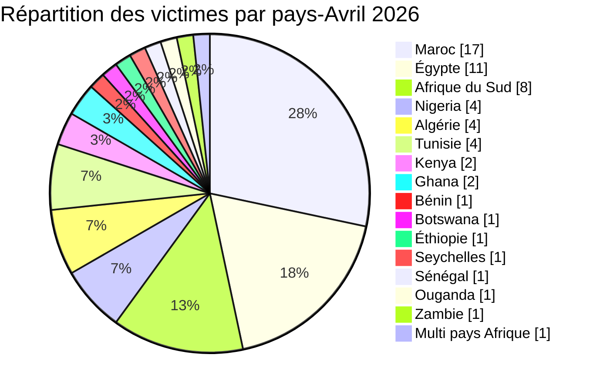
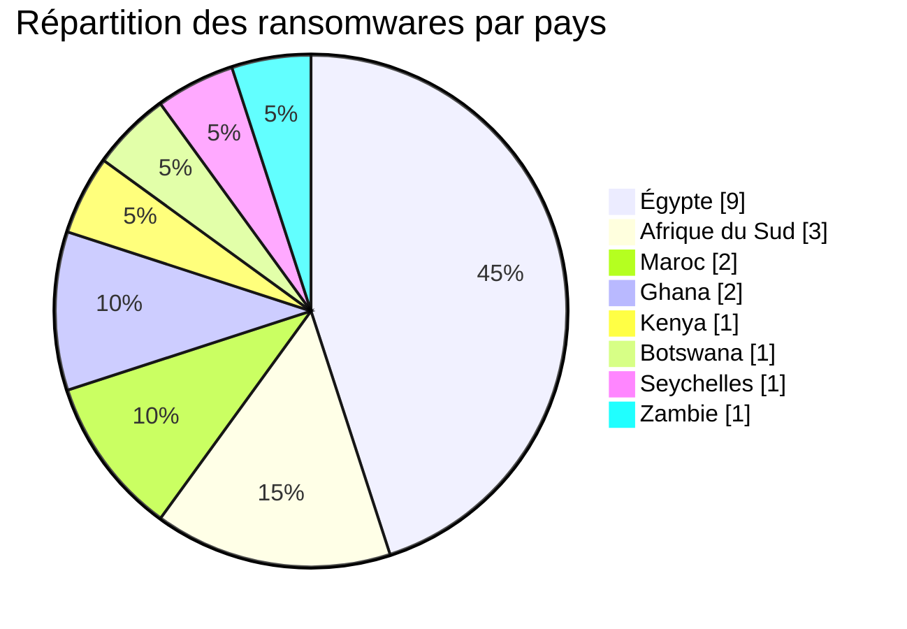
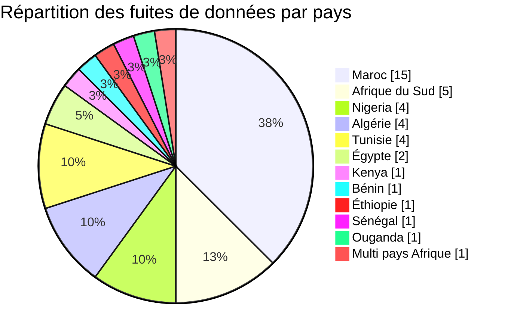
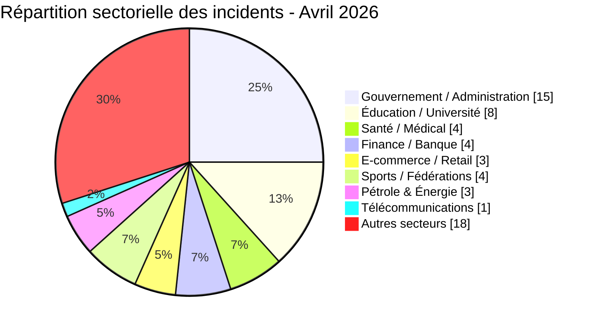
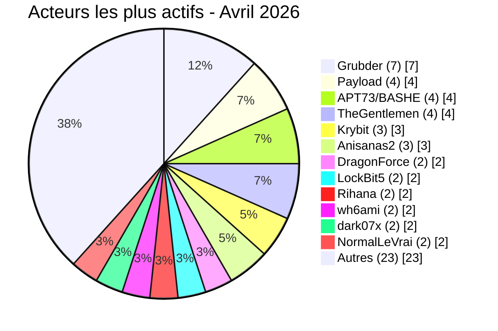

# Rapport CTI - menaces cyber en Afrique (Avril 2026)

👉🏾 [**English version available here**](./README.md)

## 1. Synthèse exécutive

Avril 2026 a enregistré **60 incidents cyber revendiqués publiquement** sur le continent - **20 ransomwares** et **40 fuites de données / ventes d’accès**. La menace s’intensifie avec une prolifération de courtiers de données, des expositions très sensibles (personnel du palais royal, documents d’identité, dossiers médicaux) et des ventes d’accès ciblant les gouvernements. Les groupes de ransomware **payload**, **apt73/bashe**, **thegentlemen** et **krybit** maintiennent la pression, tandis que les acteurs de fuites **Grubder**, **anisanas2**, **dark07x**, **wh6ami** et **Rihana** dominent le marché souterrain.

Principales conclusions :
- **20 ransomwares (33,3 %)** et **40 fuites de données / ventes d’accès (66,7 %)**.
- **16 pays** touchés ; le **Maroc** (17 incidents), l’**Égypte** (11) et l’**Afrique du Sud** (8) concentrent 60 % des victimes.
- Plus de **30 acteurs distincts** ; les courtiers de données **Grubder** (7 victimes) et **anisanas2** (3 victimes) en tête.
- Les secteurs gouvernemental, éducatif et de la santé restent les plus visés (45 % combinés).
- Brèches massives : base du personnel du Palais Royal (3 300 fiches avec CNIE), Pick n Pay ASAP/Bottles.com (données bancaires complètes), Kenya Airports Authority (2 To revendiqués), fuite de la messagerie CNSS Bénin (7,1 Go).

### 📋 Liste des victimes

👉🏾 [Voir la liste complète des victimes](./victims_FR.md)

## 2. Méthodologie

- **Périmètre** : 54 pays africains.
- **Période** : 1er - 30 avril 2026 (incidents révélés ou revendiqués ; les attaques peuvent être antérieures).
- **Sources** : Dark web, DLS, OSINT, Telegram, forums underground.
- **Inclusion** : incidents publiquement revendiqués avec victime, pays et secteur identifiés.
- **Typologie** :
  - *Ransomware* : chiffrement + demande de rançon.
  - *Fuite de données / vente d’accès* : exfiltration sans chiffrement, base de données vendue ou publiée, ou vente d’accès à des systèmes compromis.

## 3. Vue d’ensemble

| Indicateur                     | Valeur |
|--------------------------------|--------|
| Nombre total de victimes       | 60     |
| Pays touchés                   | 16     |
| Acteurs distincts              | 30+    |
| Ransomwares                    | 20 (33,3 %) |
| Fuites de données / ventes d’accès | 40 (66,7 %) |

### Classement des pays les plus touchés

**Tous incidents confondus (60) :**
| Rang | Pays | Incidents | Graphique |
| :---: | :--- | :---: | :--- |
| **1** | 🇲🇦 Maroc | **17** | █████████████████ |
| **2** | 🇪🇬 Égypte | **11** | ███████████ |
| **3** | 🇿🇦 Afrique du Sud | **8** | ████████ |
| **4** | 🇳🇬 Nigeria | **4** | ████ |
| **5** | 🇩🇿 Algérie | **4** | ████ |
| **6** | 🇹🇳 Tunisie | **4** | ████ |
| **7** | 🇰🇪 Kenya | **2** | ██ |
| **8** | 🇬🇭 Ghana | **2** | ██ |
| **9** | 🇧🇯 Bénin | **1** | █ |
| **10** | 🇧🇼 Botswana | **1** | █ |
| **11** | 🇪🇹 Éthiopie | **1** | █ |
| **12** | 🇸🇨 Seychelles | **1** | █ |
| **13** | 🇸🇳 Sénégal | **1** | █ |
| **14** | 🇺🇬 Ouganda | **1** | █ |
| **15** | 🇿🇲 Zambie | **1** | █ |
| **–** | 🌍 Multi‑pays *(AO, ZA, NG)* | **1** | █ |

*Note : L'incident multi-pays est comptabilisé comme 1 victime globale.*

### 📊 Répartition des incidents par ransomware (Total : 20)

| Rang | Pays | Incidents | Graphique |
| :---: | :--- | :---: | :--- |
| **1** | 🇪🇬 Égypte | **9** | █████████ |
| **2** | 🇿🇦 Afrique du Sud | **3** | ███ |
| **3** | 🇲🇦 Maroc | **2** | ██ |
| **4** | 🇬🇭 Ghana | **2** | ██ |
| **5** | 🇰🇪 Kenya | **1** | █ |
| **6** | 🇧🇼 Botswana | **1** | █ |
| **7** | 🇸🇨 Seychelles | **1** | █ |
| **8** | 🇿🇲 Zambie | **1** | █ |

### 📊 Répartition des incidents par fuites de données (Total : 40)

| Rang | Pays | Incidents | Graphique |
| :---: | :--- | :---: | :--- |
| **1** | 🇲🇦 Maroc | **15** | ███████████████ |
| **2** | 🇿🇦 Afrique du Sud | **5** | █████ |
| **3** | 🇳🇬 Nigeria | **4** | ████ |
| **4** | 🇩🇿 Algérie | **4** | ████ |
| **5** | 🇹🇳 Tunisie | **4** | ████ |
| **6** | 🇪🇬 Égypte | **2** | ██ |
| **7** | 🇰🇪 Kenya | **1** | █ |
| **8** | 🇧🇯 Bénin | **1** | █ |
| **9** | 🇪🇹 Éthiopie | **1** | █ |
| **10** | 🇸🇳 Sénégal | **1** | █ |
| **11** | 🇺🇬 Ouganda | **1** | █ |
| **–** | 🌍 Multi‑pays Afrique | **1** | █ |

### Répartition des victimes par pays

### 📊 Comparaison Ransomwares vs. Fuites de Données par Pays

| Pays | Ransomware | Fuites | Répartition Côte-à-Côte |
| :--- | :---: | :---: | :--- |
| 🇲🇦 Maroc | **2** | **15** | 🟧🟧 🟦🟦🟦🟦🟦🟦🟦🟦🟦🟦🟦🟦🟦🟦🟦 |
| 🇪🇬 Égypte | **9** | **2** | 🟧🟧🟧🟧🟧🟧🟧🟧🟧 🟦🟦 |
| 🇿🇦 Afrique du Sud | **3** | **5** | 🟧🟧🟧 🟦🟦🟦🟦🟦 |
| 🇳🇬 Nigeria | **0** | **4** | 🟦🟦🟦🟦 |
| 🇩🇿 Algérie | **0** | **4** | 🟦🟦🟦🟦 |
| 🇹🇳 Tunisie | **0** | **4** | 🟦🟦🟦🟦 |
| 🇰🇪 Kenya | **1** | **1** | 🟧 🟦 |
| 🇬🇭 Ghana | **2** | **0** | 🟧🟧 |
| 🇧🇯 Bénin | **0** | **1** | 🟦 |
| 🇧🇼 Botswana | **1** | **0** | 🟧 |
| 🇪🇹 Éthiopie | **0** | **1** | 🟦 |
| 🇸🇨 Seychelles | **1** | **0** | 🟧 |
| 🇸🇳 Sénégal | **0** | **1** | 🟦 |
| 🇺🇬 Ouganda | **0** | **1** | 🟦 |
| 🇿🇲 Zambie | **1** | **0** | 🟧 |
| 🌍 Multi‑pays Afrique | **0** | **1** | 🟦 |
| **Total (60)** | **20** | **40** | *Légende : 🟧 Ransomware \| 🟦 Fuite de Données* |

### 📊 Synthèse des secteurs ciblés par pays

| Rang | Pays | Vol. Secteurs | Secteurs ciblés & Répartition |
| :---: | :--- | :--- | :--- |
| **1** | 🇲🇦 Maroc | ███████████████ | Éducation (**3**), Santé (**3**), Sports (**3**), Gouvernement (**2**), Finance (**2**), Identité numérique (**1**), Services (**1**), Agroalimentaire/Retail (**1**), Données personnelles (**1**) |
| **2** | 🇪🇬 Égypte | █████████ | Éducation (**2**), Énergie (**2**), Finance (**1**), Automobile (**1**), Ingénierie (**1**), Manufacture (**1**), Construction (**1**) |
| **3** | 🇿🇦 Afrique du Sud | ███████ | E‑commerce (**2**), Gouvernement (**2**), Éducation (**1**), Télécoms (**1**), Tourisme (**1**), Agroalimentaire (**1**) + *Accès gouv. multi‑pays* |
| **4** | 🇳🇬 Nigeria | ████ | Gouvernement (**3**), ONG (**1**) + *Accès gouv. multi‑pays* |
| **5** | 🇩🇿 Algérie | ████ | Gouvernement (**2**), Assurance (**1**), Sports (**1**) |
| **6** | 🇹🇳 Tunisie | ████ | E‑commerce (**1**), Éducation (**1**), Services (**1**), Réseau social (**1**) |
| **7** | 🇰🇪 Kenya | ██ | Gouvernement (**1**), Aviation (**1**) |
| **8** | 🇬🇭 Ghana | ██ | Santé (**1**), Finance (**1**) |
| **9** | 🇧🇯 Bénin | █ | Gouvernement (**1**) |
| **10** | 🇧🇼 Botswana | █ | Éducation (**1**) |
| **11** | 🇪🇹 Éthiopie | █ | Énergie (**1**) |
| **12** | 🇸🇳 Sénégal | █ | Gouvernement (**1**) |
| **13** | 🇸🇨 Seychelles | █ | Gouvernement (**1**) |
| **14** | 🇺🇬 Ouganda | █ | Gouvernement (**1**) |
| **15** | 🇿🇲 Zambie | █ | Assurance (**1**) |
| **–** | 🌍 Angola | █ | *Accès gouvernemental multi‑pays (incident combiné)* |

**Répartition des ransomwares par pays - Avril 2026**

**Fuites de données par pays - Avril 2026**

### 📊 Répartition géographique des incidents par région

| Région | Total Incidents | Ransomware | Fuites | Répartition Côte-à-Côte |
| :--- | :---: | :---: | :---: | :--- |
| **Afrique du Nord** | **36** (58,1 %) | 11 | 25 | 🟧🟧🟧🟧🟧🟧🟧🟧🟧🟧🟧 🟦🟦🟦🟦🟦🟦🟦🟦🟦🟦🟦🟦🟦🟦🟦🟦🟦🟦🟦🟦🟦🟦🟦  |
| **Afrique australe** | **11** (17,7 %) | 5 | 6 | 🟧🟧🟧🟧🟧 🟦🟦🟦🟦🟦🟦🟦|
| **Afrique de l'Ouest** | **9** (14,5 %) | 2 | 7 | 🟧🟧 🟦🟦🟦🟦🟦🟦🟦 |
| **Afrique de l'Est** | **5** (8,1 %) | 2 | 3 | 🟧🟧 🟦🟦🟦 |
| **Afrique centrale** | **1** (1,6 %) | 0 | 1 | 🟦 |
| **Total régionalisé** | **62** | **20** | **42** ||

*Légende : 🟧 Ransomware | 🟦 Fuites de données (Data Leaks)*
*Note : Le total régionalisé atteint 62 car l’incident multi-pays (Angola / Nigeria / Afrique du Sud), compté comme un seul incident dans le total global de 60, est ventilé par zones géographiques afin de refléter son impact territorial réel.*

### 📊 Répartition des cyberattaques par secteur d'activité

| Secteur d'activité | Incidents | Part (%) | Graphique |
| :--- | :---: | :---: | :--- |
| **Gouvernement / Administration** | **15** | 25,0 % | ███████████████ |
| **Éducation / Université** | **8** | 13,3 % | ████████ |
| **Santé / Médical** | **4** | 6,7 % | ████ |
| **Finance / Banque** | **4** | 6,7 % | ████ |
| **Sports / Fédérations** | **4** | 6,7 % | ████ |
| **E-commerce / Retail** | **3** | 5,0 % | ███ |
| **Pétrole & Énergie** | **3** | 5,0 % | ███ |
| **Télécommunications** | **1** | 1,7 % | █ |
| **Autres** *(Secteurs diffus)* | **18** | 30,0 % | ██████████████████ |
| **Total** | **60** | **100 %** | |

### 📊 Acteurs de menaces les plus actifs

| Acteur de menace / Groupe | Incidents | Activité dominante | Graphique & Méthode |
| :--- | :---: | :--- | :--- |
| **Grubder** | **7** | Fuites de données | 🟦🟦🟦🟦🟦🟦🟦 |
| **Payload** | **4** | Ransomware | 🟧🟧🟧🟧 |
| **APT73 / BASHE** | **4** | Ransomware | 🟧🟧🟧🟧 |
| **TheGentlemen** | **4** | Ransomware | 🟧🟧🟧🟧 |
| **Krybit** | **3** | Ransomware | 🟧🟧🟧 |
| **Anisanas2** | **3** | Fuites de données | 🟦🟦🟦 |
| **DragonForce** | **2** | Ransomware | 🟧🟧 |
| **LockBit5** | **2** | Ransomware | 🟧🟧 |
| **Rihana** | **2** | Fuites de données | 🟦🟦 |
| **wh6ami** | **2** | Fuites de données | 🟦🟦 |
| **dark07x** | **2** | Fuites de données | 🟦🟦 |
| **NormalLeVrai** | **2** | Fuites de données | 🟦🟦 |

*Légende : 🟧 Ransomware \| 🟦 Fuite de Données*

*Parmi les acteurs ayant réalisé un seul incident figurent notamment Nullsec/0xLei, MDGhost, RubiconH4ck, Keymous, xNov, superduper1, w00l_ysh1, BlueEx, Sejjil, forrest, mecrobyte, et d’autres (voir la liste complète des victimes).*

## 4. Vue d’ensemble pays par pays

> Tous les éléments présentés proviennent d’incidents revendiqués sur le dark web, sur les sites web des groupes de ransomware et les forums underground.

### 🇲🇦 Maroc (17 incidents : 2 ransomwares, 15 fuites de données)

Le Maroc est le pays le plus touché en avril 2026 avec 17 incidents, alimentés par une vague concentrée d’activité de courtiers en données dans les secteurs de la santé, de l’éducation, du sport et de l’administration publique.

L’incident le plus critique est la revendication de l’acteur malveillant anisanas2 contre le Laboratoire National Mohammed VI (LNM6, 21 avril) : environ 100 Go de rapports médicaux PDF auraient été exfiltrés, exposant les identités complètes des patients ainsi que des résultats biologiques incluant des tests HIV, HPV, IST, tuberculose, données hormonales et génétiques, ainsi que des données pédiatriques et néonatales. Il s’agit de l’une des expositions de données médicales les plus critiques du dataset AFRINTEL.

L’acteur malveillant Rihana a revendiqué ce qu’il présente comme une base de données du personnel du Palais Royal (Dar El Makhzen, 14 avril), proposant environ 3 300 enregistrements incluant noms complets, numéros CNIE (identité nationale marocaine), adresses physiques, dates de naissance et dates de recrutement. Ces données augmentent significativement les risques d’ingénierie sociale ciblée et de harponnage contre du personnel institutionnel sensible.

L’acteur malveillant JBT2026, relayé par Jabaroot, a revendiqué une fuite depuis la CNOPS (8 avril), l’institution marocaine d’assurance maladie publique, affirmant disposer de plus de 3 millions d’enregistrements incluant noms complets, numéros d’adhésion, numéros d’identité nationale (CIN) et adresses physiques complètes des assurés.

L’acteur malveillant anisanas2 a revendiqué deux autres incidents dans le secteur éducatif : l’OFPPT (12 avril), principal établissement public de formation professionnelle au Maroc, avec plus de 400 000 profils incluant numéros d’identité nationale (CNI), codes Massar et journaux d’activité ; et l’Université Al Akhawayn (21 avril), une grande université marocaine d’Ifrane, avec un jeu de données que l’acteur décrit comme vérifié et authentique.

L’acteur malveillant MDGhost a revendiqué des données de la Fédération Royale Marocaine de Football (FRMF, 21 avril), proposant 1,2 To pour 10 000 dollars, affirmant disposer de fiches de licences de joueurs, d’identités complètes, de numéros de téléphone, de numéros de licences sportives et de données de mineurs.

L’acteur malveillant Sejjil a revendiqué des journaux financiers internes d’Al Barid Bank (19 avril), incluant des enregistrements de virements instantanés, d’opérations de prélèvement, de données d’agences et de montants de transactions. L’acteur malveillant xNov a revendiqué plus de 231 dossiers d’étudiants issus de SUPTECH SANTÉ (20 avril), une école marocaine d’ingénierie biomédicale, incluant des scans de cartes nationales d’identité, des scans de diplômes, des codes Massar et des données d’inscription. L’acteur malveillant Keymous a revendiqué environ 20 000 enregistrements de joueurs et membres de clubs de la Fédération Royale Marocaine de Tennis (FRMT, 29 avril), incluant noms, affiliations de clubs, genre et numéros de licences. L’acteur malveillant Rihana a également publié un jeu de 4 millions d’adresses email marocaines (29 avril), explicitement proposé pour des opérations de spam et de phishing de masse. L’acteur malveillant bxxxx1 a publié un dump SQL issu de GET / General Electric Trading (gemaroc.com, 13 avril), incluant du contenu ERP/CRM Dolibarr, des bases WordPress, des données RH et des données financières. L’acteur malveillant Richard2002 a revendiqué environ 400 000 enregistrements clients de Chezpara.ma (19 avril), une pharmacie en ligne marocaine. L’acteur malveillant Tanaka, attribué à Karuhunters, a revendiqué 41 772 enregistrements d’utilisateurs de Pharmacie.ma (21 avril). L’acteur malveillant kutam_dz a publié un dump SQL issu du Centre Régional d’Investissement de Rabat-Salé-Kénitra (CRI, 26 avril), exposant des dossiers professionnels principalement de notaires.

Côté ransomware, l’acteur malveillant worldleaks a revendiqué Equatorial Coca-Cola Bottling (22 avril), partenaire d’embouteillage de Coca-Cola opérant en Afrique du Nord et de l’Ouest. L’acteur malveillant LockBit 5.0 a revendiqué planetsport.ma (29 avril), le principal détaillant de matériel sportif du Maroc.

---

### 🇪🇬 Égypte (11 incidents : 9 ransomwares, 2 fuites de données)

L’Égypte enregistre la plus forte concentration de ransomwares en avril avec 9 attaques, ciblant la finance, l’énergie, l’industrie, la construction et l’ingénierie.

L’acteur malveillant payload a mené quatre attaques : United Finance Egypt (3 avril, institution financière non bancaire spécialisée dans le leasing, l’affacturage et les prêts hypothécaires), El Wastani Petroleum Company (8 avril, société pétrolière et gazière opérant dans le delta du Nil et le nord du Sinaï), Better House (20 avril, promoteur immobilier égyptien avec plus de 150 projets) et Oriental Weavers (16 avril, l’un des plus grands fabricants mondiaux de tapis, dont le siège est au Caire).

L’acteur malveillant TheGentlemen a revendiqué deux cibles égyptiennes : ACE Consulting Engineers (8 avril, cabinet international d’ingénierie et de gestion de projets opérant dans plus de 35 pays) et EEC Group (26 avril, conglomérat égyptien d’ingénierie, de construction et de structures métalliques). L’acteur malveillant APT73/BASHE a revendiqué Alexandria Petroleum Company (alx-pc.com, 27 avril), une raffinerie pétrolière publique. L’acteur malveillant LockBit 5.0 a ciblé German Auto Service (gas.mercedes-benz.com.eg, 6 avril), un concessionnaire Mercedes-Benz agréé à Gizeh. L’acteur malveillant DragonForce a revendiqué AUG Pharma (4 avril), une société pharmaceutique égyptienne.

Côté fuites de données, l’acteur malveillant Grubder a revendiqué deux grandes bases universitaires : l’Université du Caire (1er avril, environ 284 000 enregistrements incluant numéros d’identité nationale, données d’inscription et informations académiques) et l’Université Ain Shams (2 avril, environ 563 000 enregistrements incluant données d’authentification et statuts financiers).

---

### 🇿🇦 Afrique du Sud (8 incidents : 3 ransomwares, 5 fuites de données)

L’Afrique du Sud enregistre un mélange significatif de ransomwares et de ventes de bases de données sensibles, avec trois jeux de données gouvernementaux et municipaux parmi les incidents les plus critiques.

L’acteur malveillant p4pr1k4 a revendiqué Pick n Pay ASAP / Bottles.com (30 avril, découverte), la fuite de données la plus grave d’Afrique du Sud en avril : les données exposées comprennent noms complets, adresses email, numéros de téléphone, mots de passe, données de cartes bancaires VISA et Mastercard avec informations 3DS, adresses de livraison avec coordonnées GPS et notes de service client. Il s’agit de l’une des expositions e-commerce les plus dangereuses du dataset AFRINTEL 2026.

L’acteur malveillant wh6ami a revendiqué deux bases de données gouvernementales : la municipalité métropolitaine de Buffalo City (30 avril, découverte), exposant des adresses email gouvernementales, rôles d’utilisateurs, journaux d’actions administrateurs, données d’appels d’offres et dossiers d’employés municipaux ; et le Département des Routes et des Travaux publics du Cap-Nord (30 avril, découverte), exposant des échanges de formulaires de contact, demandes d’appels d’offres, candidatures de stagiaires, demandes de fournisseurs et informations sur des projets routiers.

L’acteur malveillant Grubder a revendiqué deux bases sud-africaines : Takealot.com (2 avril, un fichier CSV exposant des adresses de livraison détaillées, coordonnées GPS, numéros de téléphone et instructions d’accès au domicile pour le plus grand détaillant en ligne d’Afrique du Sud) et MySchool South Africa (2 avril, environ 437 000 dossiers d’élèves incluant noms, emails, téléphones, dates de naissance, informations d’inscription et statuts de paiement).

Côté ransomware, l’acteur malveillant DragonForce a revendiqué Singita (2 avril), une marque d’écotourisme de luxe exploitant des lodges et réserves naturelles à travers l’Afrique. L’acteur malveillant Krybit a revendiqué MegaSurf (megasurf.co.za, 9 avril), un FAI et opérateur de centre de données sud-africain. L’acteur malveillant TheGentlemen a revendiqué Sunspray Food (19 avril), le plus grand fabricant indépendant sud-africain d’ingrédients alimentaires séchés par atomisation.

---

### 🇳🇬 Nigéria (4 incidents : 0 ransomware, 4 fuites de données)

Le Nigéria enregistre quatre incidents de fuite de données à fort impact touchant les forces de l’ordre, l’administration publique, le logement et la société civile.

L’acteur malveillant AckLine a revendiqué le ministère du Commerce, de l’Industrie, des Investissements et des Coopératives de l’État d’Oyo (27 avril), alléguant une collecte par scraping d’environ 275 000 cartes d’identification commerciale (21,5 Go compressés) incluant noms complets, dates de naissance, adresses, informations professionnelles et photos biométriques. La nature biométrique de ces données amplifie significativement les risques d’usurpation d’identité et de fraude KYC.

Les acteurs malveillants ki4t et Nullsec Nigeria ont revendiqué un dump SQL partiel de l’EFCC (21 avril), l’agence nigériane de lutte contre la corruption, exposant des comptes utilisateurs, des données d’agents, des adresses IP internes, des adresses email, des numéros de téléphone et des hachages de mots de passe bcrypt. Les acteurs malveillants 0xLei et Nullsec ont revendiqué la Federal Housing Authority (FHA, 21 avril), un organisme public nigérian de logement, exposant environ 170 Mo de code source, fichiers backend et données de configuration. L’acteur malveillant NormalLeVrai a revendiqué Welfare.org.ng (6 avril), une plateforme nigériane de services communautaires, avec un accès allégué aux emails, au code source, aux sauvegardes et à une base de données de plus de 12 000 enregistrements.

---

### 🇩🇿 Algérie (4 incidents : 0 ransomware, 4 fuites de données)

L’Algérie a été exclusivement ciblée par des courtiers en données en avril, avec quatre incidents exposant des documents d’identité nationale, des dossiers d’assurance, des données sportives et des informations d’administration culturelle.

L’incident le plus critique implique l’acteur malveillant BlueEx, qui a revendiqué une base de plus de 500 000 enregistrements d’Algérie Poste (30 avril, découverte), incluant des photographies de cartes nationales d’identité algériennes accompagnées de noms complets, adresses email et numéros de téléphone. La présence d’images de documents officiels permet la fraude documentaire, le SIM swapping et l’usurpation d’identité à grande échelle.

L’acteur malveillant dark07x a revendiqué deux incidents : Inter Partner Assistance Algérie (30 avril, découverte), une société d’assistance automobile et d’assurance, avec exposition de rapports d’accidents automobiles, cartes d’identité nationale, documents d’assurance véhicule, ordres de service CRMA, signatures et tampons officiels et documents administratifs internes ; et la Ligue Régionale de Football d’Alger (LRFA) via la plateforme de gestion Foot’Up (30 avril, découverte), avec exposition de cartes d’identité nationale, licences sportives, données de joueurs, informations d’entraîneurs, feuilles de match et documents numérisés de plusieurs clubs de football algériens.

L’acteur malveillant Grubder a revendiqué le ministère de la Culture (1er avril), affirmant disposer d’environ 247 000 enregistrements incluant des contacts administratifs, des inscriptions à des événements culturels, des demandes de subventions, noms, emails, numéros de téléphone et informations de financement.

---

### 🇹🇳 Tunisie (4 incidents : 0 ransomware, 4 fuites de données)

La Tunisie a été touchée par quatre incidents de courtiers en données en avril, ciblant des plateformes CRM d’e-commerce, un service d’orientation académique et une application mobile sociale.

L’acteur malveillant Grubder a revendiqué deux grandes bases CRM : Fatales.tn (2 avril, environ 431 000 enregistrements clients incluant noms complets, historiques de réservations, niveaux de fidélité VIP, points de fidélité, dates de naissance et méthodes de paiement) et NSSTunis (2 avril, environ 312 000 enregistrements avec données démographiques, intérêts produits et segmentation marketing). L’acteur malveillant mecrobyte a revendiqué Tawjih.tn (26 avril), une plateforme tunisienne d’orientation académique pour bacheliers, avec une exposition potentielle de données personnelles et académiques liées aux comptes étudiants. L’acteur malveillant forrest a revendiqué Exscape App (30 avril, découverte), une application mobile sociale tunisienne, avec environ 5 000 profils d’utilisateurs incluant coordonnées GPS, dates de naissance et catégories d’âge indiquant des comptes potentiels de mineurs.

---

### 🇰🇪 Kenya (2 incidents : 1 ransomware, 1 fuite de données)

Le Kenya a fait face à des attaques ciblant des infrastructures publiques critiques en avril.

L’acteur malveillant APT73/BASHE a revendiqué l’IFMIS (13 avril), le Système Intégré de Gestion Financière kenyan utilisé par les administrations nationales et comtés pour gérer les fonds publics. Une compromission réelle de cette plateforme menacerait directement les opérations financières gouvernementales à tous les niveaux de l’État. L’acteur malveillant RubiconH4ck a revendiqué la Kenya Airports Authority (KAA, 16 avril), affirmant détenir environ 2 To de données incluant des systèmes d’information aéronautiques, des données d’utilisateurs et des registres de services internes, créant des risques potentiels pour la confidentialité et la sécurité opérationnelle des infrastructures aéroportuaires.

---

### 🇬🇭 Ghana (2 incidents : 2 ransomwares)

L’acteur malveillant TheGentlemen a revendiqué l’International Maritime Hospital de Tema (14 avril), un établissement de santé affilié au gouvernement spécialisé dans les soins maritimes et généraux. L’acteur malveillant APT73/BASHE a revendiqué Provident Insurance (providentgh.com, 27 avril), une société ghanéenne d’assurance et de gestion de patrimoine. Ces deux incidents illustrent l’expansion géographique de ces groupes au-delà de l’Afrique du Nord et de l’Est vers les secteurs de services ouest-africains.

---

### 🇪🇹 Éthiopie (1 incident : 1 fuite de données)

L’acteur malveillant ByteToBreach a revendiqué National Oil Ethiopia PLC (NOC, 1er avril, découverte), une grande entreprise énergétique éthiopienne active dans les opérations pétrolières et la distribution de carburant. La revendication publiée décrit une chaîne d’intrusion complète : accès initial via l’exploitation de Microsoft Exchange ProxyLogon, mouvement latéral dans l’infrastructure interne, exfiltration d’une base de données ERP dépassant prétendument 800 Go et déploiement final d’un ransomware. Les données exfiltrées revendiquées incluent des dossiers clients, des contrats, des salaires, des comptes email et des données opérationnelles ERP sensibles. Il s’agit de l’une des revendications de compromission les plus détaillées techniquement du dataset AFRINTEL d’avril 2026.

---

### 🇧🇼 Botswana (1 incident : 1 ransomware)

L’acteur malveillant Krybit a revendiqué Livingstone Kolobeng College (lkc.ac.bw, 4 avril), une école secondaire privée de Gaborone.

---

### 🇸🇨 Seychelles (1 incident : 1 ransomware)

L’acteur malveillant APT73/BASHE a revendiqué le portail officiel d’e-gouvernement des Seychelles, egov.sc (9 avril), ciblant la plateforme nationale de services publics numériques de la République des Seychelles.

---

### 🇸🇳 Sénégal (1 incident : 1 vente d’accès)

Le cybercriminel w00l_ysh1 a proposé à la vente des accès à la Direction Générale de la Comptabilité Publique et du Trésor (DGCPT, 5 avril, publication initialement datée du 8 mars), l’institution centrale du trésor sénégalais. Les accès revendiqués comprennent des identifiants VPN (500 dollars), un accès administrateur Windows Server à deux serveurs (2 000 dollars), un accès Contrôleur de Domaine (15 000 dollars) et une connectivité à un réseau de plus de 200 ordinateurs avec des bases de données financières et des serveurs internes. Un accès réel au Contrôleur de Domaine permettrait des mouvements latéraux, le déploiement d’un ransomware et une compromission totale de l’Active Directory de l’infrastructure financière souveraine du Sénégal.

---

### 🇧🇯 Bénin (1 incident : 1 fuite de données)

L’acteur malveillant NormalLeVrai a revendiqué la messagerie officielle de la CNSS Bénin (Caisse Nationale de Sécurité Sociale, 25 avril), publiant environ 7,1 Go de données : environ 5 993 emails, 9 019 pièces jointes et plus de 31 000 fichiers. Le contenu divulgué comprend des cartes de pension, des certificats de vie, des passeports, des cartes consulaires, des documents d’identité, des dossiers de bénéficiaires, des données RH et médicales, et des informations bancaires d’assurés et de retraités.

---

### 🇺🇬 Ouganda (1 incident : 1 fuite de données)

L’acteur malveillant vicmeow a revendiqué un dump CSV depuis la plateforme E-Extension du ministère de l’Agriculture de l’Ouganda (27 avril), exposant des adresses email, noms complets, numéros de téléphone, adresses postales, mots de passe en clair ou faibles et un token API de passerelle SMS. L’exposition du token API permet un accès non autorisé direct à la passerelle SMS, facilitant des opérations de messagerie de masse et l’usurpation de la plateforme.

---

### 🇿🇲 Zambie (1 incident : 1 ransomware)

L’acteur malveillant Krybit a revendiqué ZSIC Life (zsiclife.co.zm, 29 avril), une société zambienne d’assurance vie et de gestion de patrimoine.

---

### Incident multi-pays

Le cybercriminel superduper1 a proposé à la vente des accès administratifs à plusieurs infrastructures gouvernementales africaines (4 avril), revendiquant des panneaux d’administration eGov, des messageries de la police nationale angolaise, des domaines médicaux gouvernementaux en Angola, des accès liés aux secteurs militaires et du renseignement, des comptes gouvernementaux et sportifs sud-africains, et des comptes de personnel gouvernemental nigérian. Les éléments publiés suggèrent une revente d’identifiants compromis ou d’accès persistants ; aucune preuve technique indépendante ne confirme actuellement les accès revendiqués.

| Incident | Acteur | Type d’artefact | Pays concernés |
| :--- | :--- | :--- | :--- |
| Vente d’accès à des messageries et panneaux d’administration gouvernementaux | superduper1 | Accès admin revendiqué : panneaux eGov, messageries policières, accès militaires/renseignement | 🇦🇴 Angola, 🇿🇦 Afrique du Sud, 🇳🇬 Nigeria |

---

## 5. Analyse détaillée par type d’incident

### 5.1 Ransomware (20 incidents)

| Rang | Pays | Attaques | Graphique | Acteurs principaux |
| :---: | :--- | :---: | :--- | :--- |
| **1** | 🇪🇬 Égypte | **9** | █████████ | payload (4), dragonforce, lockbit5, thegentlemen, apt73/bashe |
| **2** | 🇿🇦 Afrique du Sud | **3** | ███ | dragonforce, krybit, thegentlemen |
| **3** | 🇲🇦 Maroc | **2** | ██ | worldleaks, lockbit5 |
| **4** | 🇬🇭 Ghana | **2** | ██ | thegentlemen, apt73/bashe |
| **5** | 🇰🇪 Kenya | **1** | █ | apt73/bashe |
| **6** | 🇧🇼 Botswana | **1** | █ | krybit |
| **7** | 🇸🇨 Seychelles | **1** | █ | apt73/bashe |
| **8** | 🇿🇲 Zambie | **1** | █ | krybit |

**Observations :** Le groupe ransomware **payload** a lourdement ciblé l’économie égyptienne (finance, pétrole, industrie). Le groupe **apt73/bashe** s’est étendu des gouvernements (Seychelles, Kenya) aux assurances et au pétrole.

### 5.2 Fuites de données et ventes d'accès (40 incidents)

| Rang | Pays | Incidents | Graphique | Acteurs principaux |
| :---: | :--- | :---: | :--- | :--- |
| **1** | 🇲🇦 Maroc | **15** | ███████████████ | anisanas2, Sejjil, Rihana, MDGhost, Keymous, xNov, bxxxx1 |
| **2** | 🇿🇦 Afrique du Sud | **5** | █████ | wh6ami, p4pr1k4, Grubder |
| **3** | 🇩🇿 Algérie | **4** | ████ | dark07x, BlueEx, Grubder |
| **4** | 🇹🇳 Tunisie | **4** | ████ | Grubder, mecrobyte, forrest |
| **5** | 🇳🇬 Nigeria | **4** | ████ | NormalLeVrai, 0xLei, ki4t, AckLine |
| **6** | 🇪🇬 Égypte | **2** | ██ | Grubder |
| **–** | 🌍 Autres | **6** | ██████ | Divers (voir liste des victimes) |

**Observations :** **Grubder** a vendu des bases allant de petites CRM (Customer Relationship Management) à des universités. **anisanas2** a ciblé la santé et le football marocains. **dark07x** a exposé des cartes d’identité et des dossiers automobiles. La fuite **Pick n Pay ASAP / Bottles.com** inclut des données de paiement complètes.

## 6. Impact sectoriel

| Secteur d'activité | Incidents | Part (%) | Impact visuel |
| :--- | :---: | :---: | :--- |
| **Gouvernement / Administration** | **15** | 25,0 % | ███████████████ |
| **Éducation / Université** | **8** | 13,3 % | ████████ |
| **Santé / Médical** | **4** | 6,7 % | ████ |
| **Finance / Banque** | **4** | 6,7 % | ████ |
| **Sports / Fédérations** | **4** | 6,7 % | ████ |
| **E-commerce / Retail** | **3** | 5,0 % | ███ |
| **Pétrole & Énergie** | **3** | 5,0 % | ███ |
| **Télécommunications** | **1** | 1,7 % | █ |
| **Autres** *(Secteurs diffus)* | **18** | 30,0 % | ██████████████████ |

**Observations clés :**
* **Dominance du secteur public :** Le bloc secteur public (Gouvernement + Éducation) concentre à lui seul **38,3 %** des incidents.
* **Données critiques convoitées :** Les données de santé restent une cible hautement stratégique pour les attaquants (incidents notables touchant la CNOPS, LNM6, Chezpara.ma et SUPTECH SANTÉ).
* **Nouvelles tendances :** Les fédérations et ligues sportives (FRMF, FRMT, LRFA) émergent désormais comme des cibles de choix pour l'exfiltration et la revente de données.

## 7. Profil des acteurs de menaces

| Acteur de menace / Groupe | Type | Incidents | Graphique | Cibles principales |
| :--- | :--- | :---: | :--- | :--- |
| **Grubder** | Data broker | **7** | ███████ | Gouvernements, universités, e‑commerce |
| **payload** | Ransomware | **4** | ████ | Finance, pétrole, industrie |
| **APT73 / BASHE** | Ransomware | **4** | ████ | e‑gouvernement, pétrole, assurance |
| **TheGentlemen** | Ransomware | **4** | ████ | Santé, agroalimentaire, ingénierie |
| **anisanas2** | Fuite de données | **3** | ███ | Éducation, santé, football marocain |
| **dark07x** | Fuite de données | **2** | ██ | Assurance, football algérien |
| **DragonForce** | Ransomware | **2** | ██ | Tourisme, industrie pharmaceutique |
| **LockBit5** | Ransomware | **2** | ██ | Automobile, sports |
| **wh6ami** | Fuite de données | **2** | ██ | Municipalités sud-africaines |
| **Rihana** | Fuite de données | **2** | ██ | Maison royale, emails |
| **NormalLeVrai** | Fuite de données | **2** | ██ | ONG, gouvernement (sécurité sociale) |

**Acteurs émergents :** * **wh6ami** (accès d'administration municipale)
* **forrest** (données d'applications mobiles)
* **mecrobyte** (éducation tunisienne)
* **Keymous** (tennis marocain)

### 7.1 Niveau de risque

| Pays | Risque |
|------|--------|
| Maroc | 🔴 Critique |
| Égypte | 🔴 Élevé |
| Afrique du Sud | 🔴 Élevé |
| Nigeria | 🟠 Moyen-Élevé |
| Algérie | 🟠 Moyen |
| Tunisie | 🟠 Moyen |
| Autres | 🟡 Faible-Moyen |

## 8. Tendances clés et lacunes de renseignement

### 📈 Tendances majeures des cybermenaces

* **Explosion de l'activité des Data Brokers :** On observe une monétisation agressive des données exfiltrées. Un seul acteur prolifique (**Grubder**) totalise à lui seul 7 victimes en un mois, revendant indifféremment des fichiers d'inscription universitaire ou des bases de données CRM d'entreprises.
* **Marchandisation des documents d'identité (KYC) :** Les pièces d'identité officielles deviennent des produits de commodité sur le *dark web*. Plusieurs publications d'acteurs de menaces proposaient des lots de passeports scannés, de cartes nationales d'identité et de dossiers de conformité KYC (notamment via des fuites ciblant les *Documents d'identité marocains*, *Algérie Poste*, ou encore *Inter Partner Assistance*).
* **Vente d'accès initiaux visant les infrastructures étatiques :** Les Initial Access Brokers (IAB) haussent considérablement leur niveau d'impact. Des profils comme **superduper1** (accès étatiques multi-pays) ou **w00l_ysh1** (Trésor Public du Sénégal) ont mis aux enchères des accès à privilèges élevés, incluant le compromis direct de Contrôleurs de Domaine (Domain Controllers).
* **Diversification du ciblage par Ransomware :** Les groupes d'extorsion traditionnels ne se cantonnent plus aux entreprises de services standard. Le groupe **payload**, par exemple, s'est diversifié de manière agressive dans l'industrie lourde, l'immobilier, l'automobile et les infrastructures énergétiques et pétrolières.
* **Compromission d'E-commerce et fuites de données de paiement :** Les failles applicatives exposent lourdement la chaîne monétique. L'incident ayant touché **Pick n Pay ASAP / Bottles.com** a révélé la fuite de numéros de cartes complets et de logs de validation 3D-Secure (3DS), illustrant un défaut majeur de conformité PCI-DSS dans la région.
* **Aspiration ciblée de messageries officielles (Mailbox Scraping) :** L'exfiltration d'archives de messagerie complètes s'affirme comme une méthode de choix pour contourner la persistance complexe. Le cas de la **CNSS Bénin**, dont l'intégralité de la boîte mail officielle a été siphonnée, a exposé des milliers de cartes de pensionnés et de certificats de vie.

## 9. Cartographie MITRE ATT&CK (contextuelle)

| Phase | Identifiant | Nom de la technique | Contexte / Incidents |
| :--- | :---: | :--- | :--- |
| **Accès Initial / Persistance** | **T1078** | Valid Accounts (Comptes valides) | Pick n Pay, Royal Palace, Kenya Airports, DGCPT |
| **Collecte** | **T1005** | Data from Local System | Pick n Pay/Bottles, Royal Palace DB, CNSS Bénin |
| **Collecte** | **T1114.002** | Remote Email Collection | CNSS Bénin |
| **Élévation de Privilèges** | **T1068** | Exploitation for Privilege Escalation | DGCPT Sénégal |
| **Déplacement Latéral** | **T1021.002** | SMB/Windows Admin Shares (RDP) | DGCPT Sénégal |
| **Exfiltration** | **T1041** | Exfiltration Over C2 Channel | Pick n Pay/Bottles, Kenya Airports Authority |

> 🔑 **Techniques génériques prédominantes observées sur la région :**
> * **T1190** – Exploit Public-Facing Application (Vecteur d'entrée principal sur les portails web)
> * **T1078** – Valid Accounts (Exploitation d'accès IAB et de secrets OAuth fuyards)
> * **T1041** – Exfiltration Over C2 Channel (Extraction massive de bases de données et CRM)
> * **T1486** – Data Encrypted for Impact (Phase finale de chiffrement par ransomware)

---

## 10. Recommandations globales

* **Gouvernements :** Imposer l'authentification multifacteur (MFA) forte sur tous les portails externes, auditer régulièrement les architectures e-gov et surveiller activement les places de marché cyber pour détecter la vente d'accès (IAB).
* **Secteur Financier & E-commerce :** Durcir l'application des contrôles PCI-DSS, généraliser la tokenisation des données de paiement au repos et déployer une surveillance comportementale des transactions.
* **Établissements d'Enseignement & de Santé :** Segmenter strictement les réseaux pour isoler les bases de données sensibles, chiffrer les données au repos et tester régulièrement les plans de réponse aux incidents (tabletop exercises).
* **Particuliers :** Redoubler de vigilance face aux campagnes de phishing ciblées et proscrire la réutilisation des mots de passe (particulièrement après les fuites massives de listes de diffusion locales).

---

## 11. Recommandations SOC tactiques

* **[T1078] Détection d'abus de privilèges :** Configurer des alertes sur les connexions géographiques anormales ou les sessions simultanées sur les portails d'administration étatiques.
* **[T1005] Surveillance des exfiltrations locales :** Mettre en place des règles de détection (DLP) sur les téléchargements de volumes massifs de données depuis les bases médicales ou universitaires.
* **[T1041] Analyse des flux sortants :** Établir une ligne de base (baseline) du trafic réseau sortant pour identifier des anomalies de volume vers des adresses IP externes non certifiées.
* **[Banque] Surveillance des anomalies de guichet :** Implémenter des profils de corrélation en temps réel pour détecter les vagues de retraits GAB/DAB inhabituelles ou les modifications suspectes de plafonds.

---

## 12. Recommandations stratégiques

* **Écosystème de Threat Intelligence :** Renforcer les partenariats public-privé de partage de renseignements sur les menaces, notamment pour anticiper les ventes de accès par les Initial Access Brokers (IAB).
* **Régulation sectorielle :** Durcir le cadre réglementaire des plateformes de paiement tierces en exigeant une conformité PCI-DSS stricte et vérifiée.
* **Résilience des infrastructures critiques :** Rendre obligatoire le maintien de capacités SOC opérationnelles et de mécanismes de notification d'incidents pour les opérateurs d'importance vitale (OIV).

---

## 13. Conclusion

Le mois d'avril 2026 s'est distingué par une accélération marquée des opérations des data brokers et par des intrusions profondes ciblant les infrastructures étatiques, éducatives et médicales africaines. L'expansion du commerce de documents d'identité et des ventes d'accès confirme la structuration d'une économie souterraine mature. Si le Maroc, l'Égypte et l'Afrique du Sud restent l'épicentre de cette activité, l'émergence de nouveaux foyers (Algérie, Tunisie, Kenya) appelle à une vigilance accrue. AFRINTEL poursuivra le suivi et la documentation de ces dynamiques de menaces.

**AFRINTEL** – African Cyber Threat Intelligence  
🔗 [Dépôt GitHub AFRINTEL](https://github.com/Hatchepsoute/AFRINTEL)
