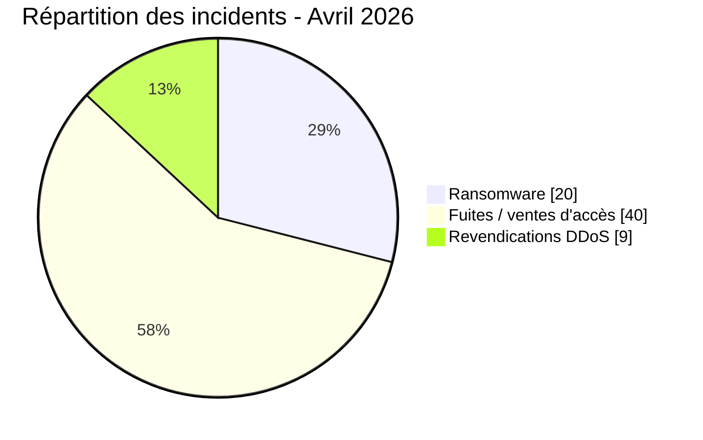

# Rapport CTI - menaces cyber en Afrique (Avril 2026)

👉🏾 [**English version available here**](./README.md)

## 1. Synthèse exécutive

Avril 2026 compte **69 incidents cyber revendiqués ou documentés publiquement** dans le corpus AFRINTEL : **20 revendications ou publications ransomware**, **40 fuites de données ou ventes d’accès** et **9 revendications DDoS**.

La réconciliation par pays modifie sensiblement le classement du mois. **L’Égypte totalise 19 incidents** après intégration des huit revendications DDoS égyptiennes, devant le **Maroc avec 17** et l’**Afrique du Sud avec 8**. Une revendication DDoS supplémentaire concerne le Soudan.

Principaux constats :
- **20 incidents ransomware (29,0 %)**, **40 fuites / ventes d’accès (58,0 %)** et **9 revendications DDoS (13,0 %)**.
- **17 pays africains** apparaissent dans la vue géographique développée ; 16 disposent d’au moins une fiche directement rattachée à un pays et l’Angola apparaît via l’incident multi-pays.
- **Égypte (19)**, **Maroc (17)** et **Afrique du Sud (8)** représentent **44 des 69 incidents (63,8 %)**.
- Le corpus DDoS d’avril contient **8 cibles égyptiennes** et **1 cible soudanaise**, toutes attribuées dans les fiches à **Keymous+**.
- Les secteurs gouvernemental, éducatif et de la santé occupent déjà une place importante dans les 60 fiches ransomware/fuites ; les observations DDoS renforcent encore l’exposition du secteur public.

> Les entrées AFRINTEL documentent des revendications, publications, annonces sur leak sites ou éléments d’indisponibilité observés. Elles ne confirment pas indépendamment une compromission, l’origine du trafic, le chiffrement ou la chaîne complète d’intrusion sans éléments probants supplémentaires.

### Liste des victimes

👉🏾 [Voir la liste complète des victimes](./victims_FR.md)

---

## 2. Méthodologie

- **Périmètre :** victimes, institutions et jeux de données africains suivis par AFRINTEL.
- **Période :** 1er-30 avril 2026. Certaines publications peuvent faire référence à une compromission ou une fuite antérieure.
- **Sources :** leak sites, forums underground, canaux Telegram et éléments OSINT documentés dans les fiches victimes.
- **Règle de comptage :** chaque fiche victime compte une fois dans le total global. L’incident multi-pays concernant des accès gouvernementaux compte pour un incident global, mais est développé par pays dans l’analyse géographique.
- **Ransomware :** publication ou revendication par un groupe ransomware ; le chiffrement n’est pas présumé sans preuve.
- **Fuite de données / vente d’accès :** données publiées ou échantillonnées, vente de base, exposition d’identifiants ou offre d’accès.
- **DDoS :** perturbation revendiquée ou indisponibilité observée. Un test de disponibilité ne prouve pas indépendamment l’origine du trafic, la méthode, la durée ou l’impact.

---

## 3. Vue d’ensemble

| Indicateur | Valeur |
|---|---:|
| Total incidents | **69** |
| Ransomware | **20 (29,0 %)** |
| Fuites / ventes d’accès | **40 (58,0 %)** |
| Revendications DDoS | **9 (13,0 %)** |
| Fiches directement rattachées à un pays | **68** |
| Incidents multi-pays | **1** |
| Pays africains distincts dans la vue développée | **17** |
| Occurrences géographiques développées | **71** |

### Classement des pays - tous types d’incidents

| Rang | Pays / fiche | Ransomware | Fuites / accès | DDoS | Total |
| :---: | :--- | ---: | ---: | ---: | ---: |
| **1** | 🇪🇬 Égypte | 9 | 2 | 8 | **19** |
| **2** | 🇲🇦 Maroc | 2 | 15 | 0 | **17** |
| **3** | 🇿🇦 Afrique du Sud | 3 | 5 | 0 | **8** |
| **4** | 🇳🇬 Nigeria | 0 | 4 | 0 | **4** |
| **5** | 🇩🇿 Algérie | 0 | 4 | 0 | **4** |
| **6** | 🇹🇳 Tunisie | 0 | 4 | 0 | **4** |
| **7** | 🇰🇪 Kenya | 1 | 1 | 0 | **2** |
| **8** | 🇬🇭 Ghana | 2 | 0 | 0 | **2** |
| **9** | 🇧🇯 Bénin | 0 | 1 | 0 | **1** |
| **10** | 🇧🇼 Botswana | 1 | 0 | 0 | **1** |
| **11** | 🇪🇹 Éthiopie | 0 | 1 | 0 | **1** |
| **12** | 🇸🇨 Seychelles | 1 | 0 | 0 | **1** |
| **13** | 🇸🇳 Sénégal | 0 | 1 | 0 | **1** |
| **14** | 🇺🇬 Ouganda | 0 | 1 | 0 | **1** |
| **15** | 🇿🇲 Zambie | 1 | 0 | 0 | **1** |
| **16** | 🇸🇩 Soudan | 0 | 0 | 1 | **1** |
| **–** | 🌍 Multi-pays : Angola / Afrique du Sud / Nigeria | 0 | 1 | 0 | **1** |
| **Total** |  | **20** | **40** | **9** | **69** |

### Répartition ransomware

| Pays | Incidents |
|---|---:|
| 🇪🇬 Égypte | 9 |
| 🇿🇦 Afrique du Sud | 3 |
| 🇲🇦 Maroc | 2 |
| 🇬🇭 Ghana | 2 |
| 🇰🇪 Kenya | 1 |
| 🇧🇼 Botswana | 1 |
| 🇸🇨 Seychelles | 1 |
| 🇿🇲 Zambie | 1 |
| **Total** | **20** |

### Répartition des fuites / ventes d’accès

| Pays / fiche | Incidents |
|---|---:|
| 🇲🇦 Maroc | 15 |
| 🇿🇦 Afrique du Sud | 5 |
| 🇳🇬 Nigeria | 4 |
| 🇩🇿 Algérie | 4 |
| 🇹🇳 Tunisie | 4 |
| 🇪🇬 Égypte | 2 |
| 🇰🇪 Kenya | 1 |
| 🇧🇯 Bénin | 1 |
| 🇪🇹 Éthiopie | 1 |
| 🇸🇳 Sénégal | 1 |
| 🇺🇬 Ouganda | 1 |
| 🌍 Multi-pays : Angola / Afrique du Sud / Nigeria | 1 |
| **Total** | **40** |

### Répartition DDoS

| Pays | Revendications DDoS |
|---|---:|
| 🇪🇬 Égypte | **8** |
| 🇸🇩 Soudan | **1** |
| **Total** | **9** |

Les fiches DDoS concernent Orange Egypt, Telecom Egypt, le portail du Gouvernement égyptien, les ministères des Finances, de la Justice, du Commerce et de l’Industrie, du Pétrole et des Ressources minérales, le State Information Service égyptien, ainsi que le site des Rapid Support Forces au Soudan.

---

## 4. Exposition géographique

Le total global reste **69 incidents**. L’incident d’accès gouvernemental multi-pays compte pour une seule fiche mais mentionne **l’Angola, l’Afrique du Sud et le Nigeria**. Son développement géographique porte la vue à **71 occurrences**.

| Région | Occurrences ransomware | Occurrences fuites / accès | Occurrences DDoS | Total occurrences géographiques |
|---|---:|---:|---:|---:|
| Afrique du Nord | 11 | 25 | 9 | **45** |
| Afrique australe | 5 | 6 | 0 | **11** |
| Afrique de l’Ouest | 2 | 7 | 0 | **9** |
| Afrique de l’Est | 2 | 3 | 0 | **5** |
| Afrique centrale | 0 | 1 | 0 | **1** |
| **Total** | **20** | **42** | **9** | **71** |

> Ce tableau mesure l’exposition géographique et non le nombre d’incidents dédupliqués. Les fuites/accès passent de 40 incidents à 42 occurrences parce que la fiche Angola/Afrique du Sud/Nigeria est représentée dans chaque région concernée.

---

## 5. Analyse par type d’incident

### 5.1 Ransomware - 20 incidents

L’Égypte est le premier pays ransomware en avril avec **9 publications**, devant l’Afrique du Sud avec **3**, le Maroc et le Ghana avec **2 chacun**, puis le Kenya, le Botswana, les Seychelles et la Zambie avec une fiche chacun.

Les groupes les plus présents dans les fiches ransomware sont notamment **payload (4)**, **APT73/BASHE (4)**, **TheGentlemen (4)**, **krybit (3)**, **DragonForce (2)** et **LockBit5 (2)**. Ces nombres décrivent les publications du corpus AFRINTEL et ne démontrent pas une campagne commune ou un vecteur d’accès partagé.

### 5.2 Fuites de données et ventes d’accès - 40 incidents

Le Maroc domine cette catégorie avec **15 fiches**, devant l’Afrique du Sud avec **5**, puis l’Algérie, la Tunisie et le Nigeria avec **4** chacun. L’Égypte en compte **2**. Le Kenya, le Bénin, l’Éthiopie, le Sénégal et l’Ouganda comptent chacun une fiche directe, auxquelles s’ajoute l’incident multi-pays de vente d’accès gouvernemental.

Parmi les expositions à fort impact documentées figurent des données d’identité, financières, médicales, académiques, municipales et liées au paiement. Les fiches concernent notamment des données attribuées au personnel du Palais royal au Maroc, à la CNSS du Bénin, à des collectivités sud-africaines et à Pick n Pay ASAP / Bottles.com.

### 5.3 Revendications DDoS - 9 incidents

Les neuf fiches DDoS sont attribuées à **Keymous+** dans les sources :
- **8 en Égypte**
- **1 au Soudan**

Les sources documentent des publications de l’acteur accompagnées de résultats de disponibilité de type Check-Host ou équivalent. AFRINTEL conserve donc le statut **Claim - Unverified** et ne déduit ni l’origine du trafic, ni la technique, ni la durée, ni l’impact confirmé.

---

## 6. Impact sectoriel

Afin de ne pas mélanger deux méthodes d’analyse, la vue sectorielle est séparée en deux parties.

### 6.1 Corpus ransomware et fuites/accès - 60 fiches

La normalisation sectorielle préexistante couvre les **60 fiches ransomware et fuites/accès** :

| Secteur normalisé | Fiches | Part sur 60 |
|---|---:|---:|
| Gouvernement / Administration | 15 | 25,0 % |
| Éducation / Université | 8 | 13,3 % |
| Santé / Médical | 4 | 6,7 % |
| Finance / Banque | 4 | 6,7 % |
| Sports / Fédérations | 4 | 6,7 % |
| E-commerce / Retail | 3 | 5,0 % |
| Pétrole & Énergie | 3 | 5,0 % |
| Télécommunications | 1 | 1,7 % |
| Autres secteurs documentés | 18 | 30,0 % |
| **Total** | **60** | **100 %** |

### 6.2 Répartition sectorielle des DDoS - 9 fiches

| Secteur dans les fiches victimes | Revendications DDoS |
|---|---:|
| Gouvernement / Administration | **7** |
| Télécommunications | **2** |
| **Total** | **9** |

Cette séparation explique pourquoi l’ancien tableau sectoriel annonçait un total de 69 alors que ses lignes de catégories ne totalisaient que 60.

---

## 7. Profil des acteurs / groupes

| Acteur / Groupe | Fiches | Activité dominante |
|---|---:|---|
| **Keymous+** | **9** | Revendications DDoS |
| **Grubder** | **7** | Fuites de données |
| **payload** | **4** | Ransomware |
| **APT73 / BASHE** | **4** | Ransomware |
| **TheGentlemen** | **4** | Ransomware |
| **krybit** | **3** | Ransomware |
| **anisanas2** | **3** | Fuites de données |
| **DragonForce** | **2** | Ransomware |
| **LockBit5** | **2** | Ransomware |
| **Rihana** | **2** | Fuites de données |
| **wh6ami** | **2** | Fuites de données |
| **dark07x** | **2** | Fuites de données |
| **NormalLeVrai** | **2** | Fuites / accès |
| Fiches hors classement affiché | **23** | Mixte |
| **Total** | **69** | |

> `Keymous+` et `Keymous` sont conservés comme deux libellés source distincts dans ce rapport mensuel. La similarité des noms ne suffit pas à établir qu’il s’agit du même acteur.

---

## 8. Tendances CTI et lacunes de renseignement

- **L’Égypte devient le pays au volume le plus élevé en avril après intégration des DDoS :** 19 incidents, dont huit revendications DDoS.
- **Le Maroc reste le principal pays pour les fuites :** 15 fuites/ventes d’accès sur 17 incidents marocains.
- **L’exposition gouvernementale est plus forte que ne le montrait la seule vue ransomware/fuites :** sept des neuf fiches DDoS concernent le secteur gouvernemental/administratif.
- **Le courtage de données reste très présent :** bases CRM, identités, santé, éducation et données administratives sont proposées ou publiées sur des espaces underground.
- **Les preuves d’indisponibilité doivent rester distinctes de l’attribution DDoS confirmée :** les fiches Keymous+ documentent des revendications et une indisponibilité apparente, pas l’origine ou la méthode du trafic de façon indépendante.

### Comparaison factuelle avec mars 2026

Cette comparaison conserve les valeurs de mars déjà présentes dans le rapport source et corrige uniquement la colonne d’avril à partir du corpus réconcilié de 69 fiches.

| Indicateur | Mars 2026 | Avril 2026 | Évolution observée |
|---|---:|---:|---:|
| Incidents documentés | 41 | **69** | **+28 (+68,3 %)** |
| Ransomware / extorsion | 19 | **20** | **+1** |
| Autres fiches non-ransomware | 22 | **49** | **+27** |

> La valeur d’avril hors ransomware correspond à 40 fuites/ventes d’accès + 9 revendications DDoS. Les catégories de mars sont conservées telles qu’elles figurent dans le rapport existant, cette correction étant fondée sur les fichiers sources d’avril.

---

## 9. Cartographie MITRE ATT&CK - contextuelle

| Phase | Technique | Périmètre analytique |
|---|---|---|
| Accès initial | T1566 - Phishing | Hypothèse défensive ; non observée à partir des seules revendications |
| Accès initial | T1190 - Exploit Public-Facing Application | Hypothèse défensive sauf preuve documentée |
| Accès aux comptes | T1078 - Valid Accounts | Pertinent pour les ventes d’accès et identifiants exposés |
| Collecte | T1005 - Data from Local System | Hypothèse contextuelle lorsqu’un corpus interne est publié |
| Impact | T1486 - Data Encrypted for Impact | À utiliser uniquement lorsque le chiffrement est étayé |

Aucune technique ATT&CK n’est considérée comme observée uniquement parce qu’une victime apparaît sur un leak site ou dans une publication underground.

---

## 10. Priorités défensives

- Imposer une MFA résistante au phishing sur les comptes privilégiés, gouvernementaux, financiers et exposés sur Internet.
- Surveiller les exports massifs, dumps de bases, accès anormaux au stockage cloud et volumes sortants inhabituels.
- Mettre en place des procédures rapides de révocation des identifiants lors de ventes d’accès ou d’expositions de credentials.
- Séparer dans les données CTI la publication ransomware, le chiffrement confirmé, l’exfiltration et les revendications d’indisponibilité DDoS.
- Conserver la date de publication initiale, la date de découverte AFRINTEL et le statut de preuve de chaque fiche.

---

## 11. Conclusion

AFRINTEL recense **69 incidents en avril 2026** : **20 ransomware**, **40 fuites / ventes d’accès** et **9 revendications DDoS**. Après intégration des fiches DDoS dans la vue par pays, **l’Égypte arrive en tête avec 19 incidents**, devant le **Maroc avec 17** et l’**Afrique du Sud avec 8**.

La correction d’avril ne modifie pas le total global de 69 ; elle corrige la manière dont ces 69 fiches sont ventilées par pays, région, vue sectorielle et acteur.

**AFRINTEL** - African Cyber Threat Intelligence
