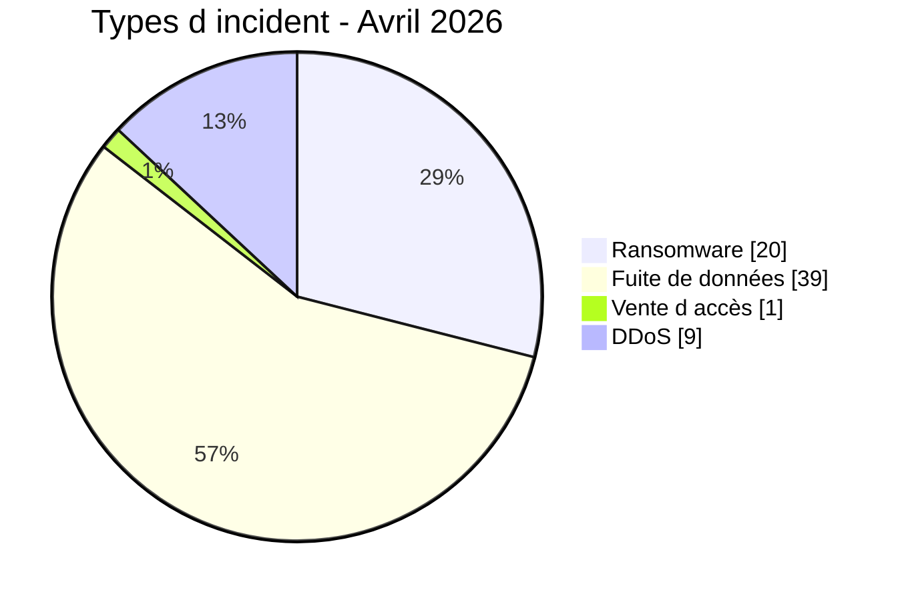
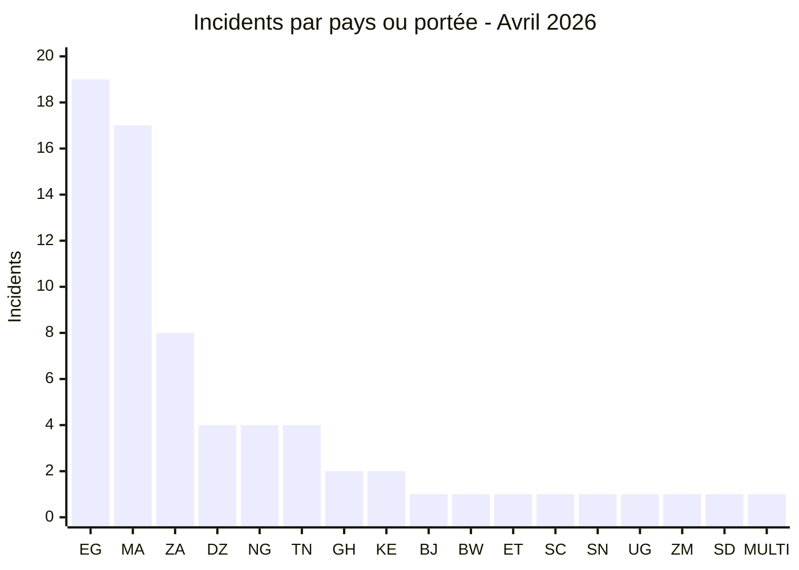
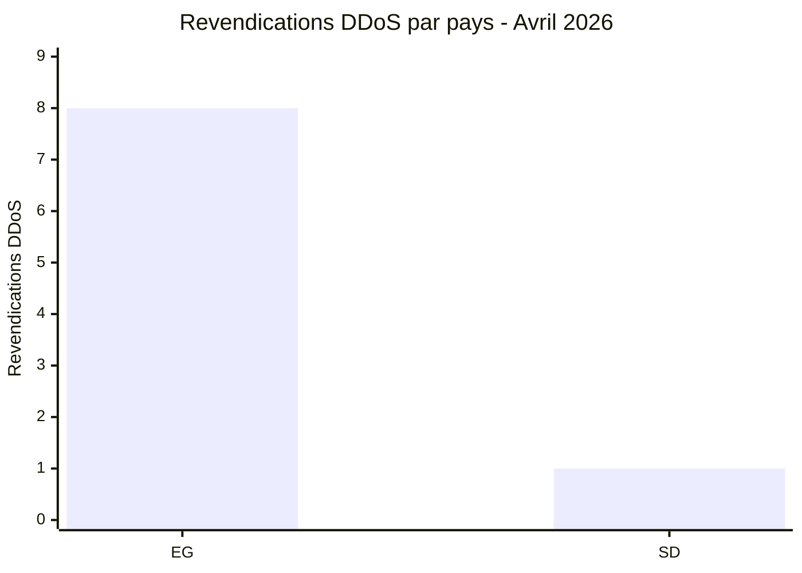
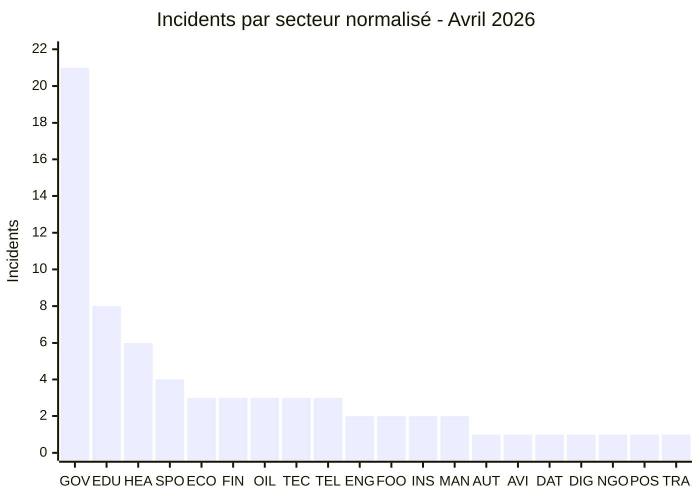
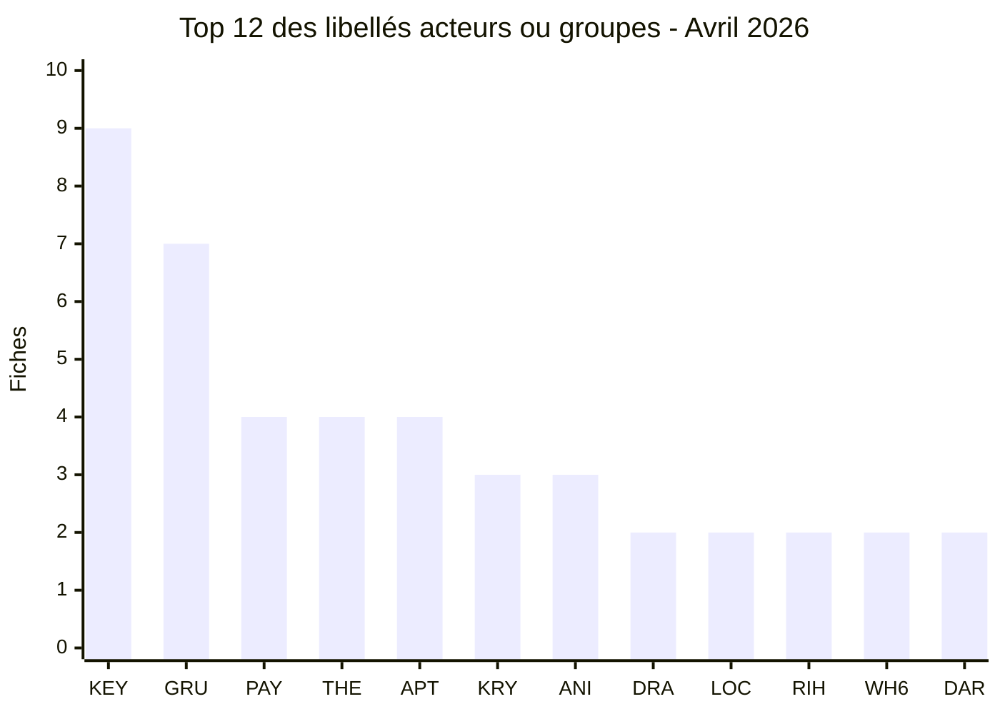
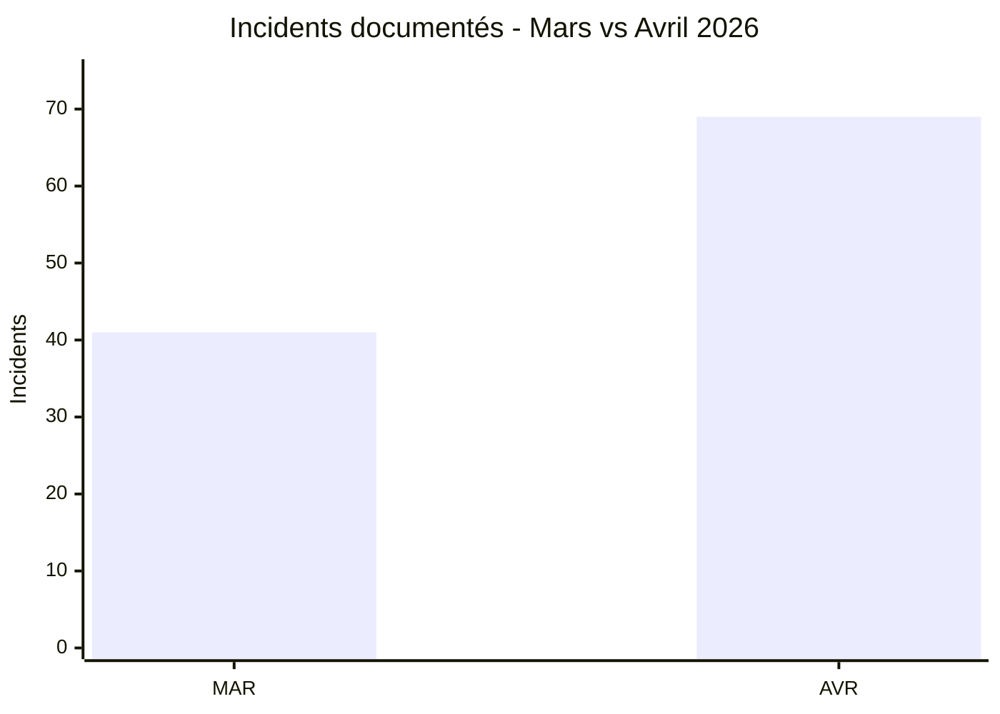

[](https://github.com/Hatchepsoute/AFRINTEL)


# Rapport CTI - Cyberattaques en Afrique (Avril 2026)

👉🏾 [**English version available here**](./README.md)

## 1. Synthèse exécutive

Avril 2026 contient **69 incidents** dans le corpus AFRINTEL validé : **20 ransomware (29,0 %)**, **39 fuites de données (56,5 %)**, **1 vente d'accès (1,4 %)** et **9 revendications DDoS (13,0 %)**.

**L'Égypte totalise 19 incidents**, devant le **Maroc avec 17** et l'**Afrique du Sud avec 8**. Ces trois pays représentent **44 des 69 fiches (63,8 %)**.

Le mois combine ransomware, exposition et courtage de données, vente d'accès privilégié et revendications DDoS. Les dossiers marquants comprennent notamment une base attribuée au personnel du Palais royal au Maroc, l'exposition Pick n Pay ASAP / Bottles.com en Afrique du Sud, une revendication de 2 To visant la Kenya Airports Authority et une publication de messageries de 7,1 Go attribuée à la CNSS du Bénin.

> Une revendication ou publication n'est pas une confirmation indépendante de compromission.

### Liste des victimes

👉🏾 [Voir la liste complète des victimes](./victims_FR.md)

---


### 1.1 Comparaison avec le mois précédent

> Comparaison fondée sur les corpus mensuels AFRINTEL validés. Une variation du nombre de fiches documentées ne prouve pas, à elle seule, une variation du nombre réel de compromissions.

| Indicateur | Mars 2026 | Avril 2026 | Évolution observée |
|---|---:|---:|---:|
| Total incidents | 41 | 69 | **+28 (+68,3 %)** |
| Ransomware | 19 | 20 | **+1 (+5,3 %)** |
| Data Leak | 21 | 39 | **+18 (+85,7 %)** |
| Access Sale | 0 | 1 | **+1 (nouveau)** |
| DDoS | 0 | 9 | **+9 (nouveau)** |
| Defacement | 0 | 0 | **0 (stable)** |
| Operational Fraud | 1 | 0 | **-1 (-100,0 %)** |

> Règle de lecture : si la valeur du mois précédent est `0` et celle du mois courant est supérieure à `0`, l'évolution est indiquée comme `nouveau` plutôt qu'avec un pourcentage artificiel. Les catégories absentes restent affichées à `0`.

## 2. Méthodologie

- **Périmètre :** organisations, institutions et jeux de données africains documentés dans les fiches d'avril.
- **Période :** 1er-30 avril 2026. Certaines publications concernent des événements antérieurs identifiés en avril.
- **Comptage :** une fiche victime compte une fois globalement. La fiche multi-pays compte une fois au global et trois fois dans la vue géographique développée.
- **Taxonomie :** Ransomware, Data Leak, Access Sale, DDoS, Defacement, Operational Fraud. Avril contient les quatre premières catégories.
- **Preuve :** une revendication ne devient pas un fait confirmé sans élément indépendant.
- **Secteurs :** les 69 fiches sont normalisées dans une catégorie principale, sans catégorie résiduelle `Autres`.

---

## 3. Vue d'ensemble

| Indicateur | Avril 2026 |
|---|---:|
| Total | **69** |
| Ransomware | **20 (29,0 %)** |
| Fuite de données | **39 (56,5 %)** |
| Vente d’accès | **1 (1,4 %)** |
| DDoS | **9 (13,0 %)** |
| Pays directs | **16** |
| Pays dans la vue développée | **17** |
| Occurrences géographiques | **71** |
| Libellés source acteurs/groupes | **37** |

### 3.1 Répartition par type



**Convention couleur utilisée dans les vues comparatives :** 🟧 Ransomware | 🟦 Fuite de données / Vente d'accès | 🟥 DDoS.


### 3.2 Classement pays

| Code | Pays / portée | Ransomware | Fuite | Vente d'accès | DDoS | Total |
|---|---|---:|---:|---:|---:|---:|
| `EG` | Égypte | 9 | 2 | 0 | 8 | **19** |
| `MA` | Maroc | 2 | 15 | 0 | 0 | **17** |
| `ZA` | Afrique du Sud | 3 | 5 | 0 | 0 | **8** |
| `DZ` | Algérie | 0 | 4 | 0 | 0 | **4** |
| `NG` | Nigeria | 0 | 4 | 0 | 0 | **4** |
| `TN` | Tunisie | 0 | 4 | 0 | 0 | **4** |
| `GH` | Ghana | 2 | 0 | 0 | 0 | **2** |
| `KE` | Kenya | 1 | 1 | 0 | 0 | **2** |
| `BJ` | Bénin | 0 | 1 | 0 | 0 | **1** |
| `BW` | Botswana | 1 | 0 | 0 | 0 | **1** |
| `ET` | Éthiopie | 0 | 1 | 0 | 0 | **1** |
| `SC` | Seychelles | 1 | 0 | 0 | 0 | **1** |
| `SN` | Sénégal | 0 | 0 | 1 | 0 | **1** |
| `UG` | Ouganda | 0 | 1 | 0 | 0 | **1** |
| `ZM` | Zambie | 1 | 0 | 0 | 0 | **1** |
| `SD` | Soudan | 0 | 0 | 0 | 1 | **1** |
| `MULTI` | Multi-pays | 0 | 1 | 0 | 0 | **1** |
|  | **Total** | **20** | **39** | **1** | **9** | **69** |

```text
`EG` ███████████████████ 19
`MA` █████████████████ 17
`ZA` ████████ 8
`DZ` ████ 4
`NG` ████ 4
`TN` ████ 4
`GH` ██ 2
`KE` ██ 2
`BJ` █ 1
`BW` █ 1
`ET` █ 1
`SC` █ 1
`SN` █ 1
`UG` █ 1
`ZM` █ 1
`SD` █ 1
`MULTI` █ 1
```



**Légende pays:** `EG` = Égypte | `MA` = Maroc | `ZA` = Afrique du Sud | `DZ` = Algérie | `NG` = Nigeria | `TN` = Tunisie | `GH` = Ghana | `KE` = Kenya | `BJ` = Bénin | `BW` = Botswana | `ET` = Éthiopie | `SC` = Seychelles | `SN` = Sénégal | `UG` = Ouganda | `ZM` = Zambie | `SD` = Soudan | `MULTI` = Multi-pays

### 3.3 Comparaison Ransomware vs Fuite / vente d'accès par pays

Cette comparaison visuelle couvre **60 des 69 incidents d'avril** : **20 ransomware** et **40 incidents Fuite de données / Vente d'accès**. Pour ce comparatif uniquement, les **39 fuites de données et 1 vente d'accès sont regroupées dans une même série bleue**. Les compteurs structurés restent séparés dans le reste du rapport.

Les **9 revendications DDoS sont exclues de ce comparatif à deux catégories** et présentées séparément ci-dessous.

**Légende visuelle :** 🟧 Ransomware | 🟦 Fuite de données / Vente d'accès | 🟥 DDoS

| Code | Pays / portée | Ransomware | Barre | Fuite / vente d'accès | Barre |
|---|---|---:|---|---:|---|
| `EG` | Égypte | **9** | 🟧🟧🟧🟧🟧🟧🟧🟧🟧 | **2** | 🟦🟦 |
| `MA` | Maroc | **2** | 🟧🟧 | **15** | 🟦🟦🟦🟦🟦🟦🟦🟦🟦🟦🟦🟦🟦🟦🟦 |
| `ZA` | Afrique du Sud | **3** | 🟧🟧🟧 | **5** | 🟦🟦🟦🟦🟦 |
| `DZ` | Algérie | **0** | - | **4** | 🟦🟦🟦🟦 |
| `NG` | Nigeria | **0** | - | **4** | 🟦🟦🟦🟦 |
| `TN` | Tunisie | **0** | - | **4** | 🟦🟦🟦🟦 |
| `GH` | Ghana | **2** | 🟧🟧 | **0** | - |
| `KE` | Kenya | **1** | 🟧 | **1** | 🟦 |
| `BJ` | Bénin | **0** | - | **1** | 🟦 |
| `BW` | Botswana | **1** | 🟧 | **0** | - |
| `ET` | Éthiopie | **0** | - | **1** | 🟦 |
| `SC` | Seychelles | **1** | 🟧 | **0** | - |
| `SN` | Sénégal | **0** | - | **1** | 🟦 |
| `UG` | Ouganda | **0** | - | **1** | 🟦 |
| `ZM` | Zambie | **1** | 🟧 | **0** | - |
| `SD` | Soudan | **0** | - | **0** | - |
| `MULTI` | Multi-pays | **0** | - | **1** | 🟦 |
|  | **Total comparé** | **20** |  | **40** |  |

```mermaid
xychart-beta
    title "Ransomware vs Fuite / vente d'accès par pays - Avril 2026"
    x-axis ["EG", "MA", "ZA", "DZ", "NG", "TN", "GH", "KE", "BJ", "BW", "ET", "SC", "SN", "UG", "ZM", "SD", "MULTI"]
    y-axis "Incidents" 0 --> 16
    bar [9, 2, 3, 0, 0, 0, 2, 1, 0, 1, 0, 1, 0, 0, 1, 0, 0]
    bar [2, 15, 5, 4, 4, 4, 0, 1, 1, 0, 1, 0, 1, 1, 0, 0, 1]
```



**Légende des séries :** première série de barres = 🟧 Ransomware | deuxième série de barres = 🟦 Fuite de données / Vente d'accès.

**Légende pays :** `EG` = Égypte | `MA` = Maroc | `ZA` = Afrique du Sud | `DZ` = Algérie | `NG` = Nigeria | `TN` = Tunisie | `GH` = Ghana | `KE` = Kenya | `BJ` = Bénin | `BW` = Botswana | `ET` = Éthiopie | `SC` = Seychelles | `SN` = Sénégal | `UG` = Ouganda | `ZM` = Zambie | `SD` = Soudan | `MULTI` = Multi-pays.

#### DDoS présenté séparément

| Code | Pays | DDoS | Barre |
|---|---|---:|---|
| `EG` | Égypte | **8** | 🟥🟥🟥🟥🟥🟥🟥🟥 |
| `SD` | Soudan | **1** | 🟥 |
|  | **Total DDoS** | **9** | |



**Légende DDoS :** 🟥 DDoS | `EG` = Égypte | `SD` = Soudan.

### 3.4 Exposition géographique par région


| Région | Ransomware | Fuite | Vente d'accès | DDoS | Occurrences |
|---|---:|---:|---:|---:|---:|
| Afrique du Nord | 11 | 25 | 0 | 9 | **45** |
| Afrique australe | 5 | 6 | 0 | 0 | **11** |
| Afrique de l'Ouest | 2 | 6 | 1 | 0 | **9** |
| Afrique de l'Est | 1 | 3 | 0 | 0 | **4** |
| Océan Indien | 1 | 0 | 0 | 0 | **1** |
| Afrique centrale | 0 | 1 | 0 | 0 | **1** |
| **Total** | **20** | **41** | **1** | **9** | **71** |

La vue développée compte 71 occurrences. La fiche multi-pays de type Data Leak ajoute deux occurrences par rapport au total dédupliqué, ce qui porte les fuites de 39 incidents à 41 occurrences géographiques.


---

## 4. Analyse détaillée par type d'incident

### 4.1 Ransomware - 20 incidents

L'Égypte compte 9 publications ransomware, l'Afrique du Sud 3, le Maroc et le Ghana 2 chacun, puis le Kenya, le Botswana, les Seychelles et la Zambie 1 chacun. Les groupes les plus fréquents sont Payload (4), APT73/BASHE (4), TheGentlemen (4), Krybit (3), DragonForce (2) et LockBit5 (2).

### 4.2 Fuite de données - 39 incidents

Le Maroc compte 15 fuites directes, l'Afrique du Sud 5, l'Algérie, la Tunisie et le Nigeria 4 chacun, l'Égypte 2, puis le Kenya, le Bénin, l'Éthiopie et l'Ouganda 1 chacun. La fiche multi-pays est également classée Data Leak.

### 4.3 Vente d'accès - 1 incident

La DGCPT au Sénégal fait l'objet d'une annonce proposant notamment des identifiants VPN, des accès administrateur et un accès Domain Controller. La validité de ces accès n'est pas confirmée indépendamment.

### 4.4 DDoS - 9 incidents

Les fiches comptent 8 cibles en Égypte et 1 au Soudan, toutes attribuées à Keymous+ dans les sources. Les éléments de disponibilité côté acteur ne permettent pas d'établir l'origine du trafic, la méthode ou la durée.

---

## 5. Impact sectoriel

| Code | Secteur normalisé | Incidents | Part |
|---|---|---:|---:|
| `GOV` | Gouvernement / Administration | 21 | 30,4 % |
| `EDU` | Éducation / Université | 8 | 11,6 % |
| `HEA` | Santé / Médical | 6 | 8,7 % |
| `SPO` | Sports / Fédérations | 4 | 5,8 % |
| `ECO` | E-commerce / Retail | 3 | 4,3 % |
| `FIN` | Finance / Banque | 3 | 4,3 % |
| `OIL` | Pétrole / Énergie | 3 | 4,3 % |
| `TEC` | Technologie / Services numériques | 3 | 4,3 % |
| `TEL` | Télécommunications | 3 | 4,3 % |
| `ENG` | Ingénierie / Construction | 2 | 2,9 % |
| `FOO` | Agroalimentaire / Boissons | 2 | 2,9 % |
| `INS` | Assurance / Assistance | 2 | 2,9 % |
| `MAN` | Industrie / Fabrication | 2 | 2,9 % |
| `AUT` | Automobile | 1 | 1,4 % |
| `AVI` | Aviation / Transport | 1 | 1,4 % |
| `DAT` | Données / Marketing | 1 | 1,4 % |
| `DIG` | Identité numérique / Données | 1 | 1,4 % |
| `NGO` | ONG / Aide sociale | 1 | 1,4 % |
| `POS` | Services postaux / Logistique | 1 | 1,4 % |
| `TRA` | Voyage / Tourisme | 1 | 1,4 % |
|  | **Total** | **69** | **100 %** |



**Légende secteurs:** `GOV` = Gouvernement / Administration | `EDU` = Éducation / Université | `HEA` = Santé / Médical | `SPO` = Sports / Fédérations | `ECO` = E-commerce / Retail | `FIN` = Finance / Banque | `OIL` = Pétrole / Énergie | `TEC` = Technologie / Services numériques | `TEL` = Télécommunications | `ENG` = Ingénierie / Construction | `FOO` = Agroalimentaire / Boissons | `INS` = Assurance / Assistance | `MAN` = Industrie / Fabrication | `AUT` = Automobile | `AVI` = Aviation / Transport | `DAT` = Données / Marketing | `DIG` = Identité numérique / Données | `NGO` = ONG / Aide sociale | `POS` = Services postaux / Logistique | `TRA` = Voyage / Tourisme

Gouvernement / Administration arrive en tête avec 21 fiches (30,4 %), devant Éducation / Université avec 8 (11,6 %) et Santé / Médical avec 6 (8,7 %).


---

## 6. Profil des acteurs / groupes

| Code | Acteur / Groupe | Fiches | Activité dominante |
|---|---|---:|---|
| `KEY` | Keymous+ | **9** | DDoS |
| `GRU` | Grubder | **7** | Fuites de données |
| `PAY` | Payload | **4** | Ransomware |
| `THE` | TheGentlemen | **4** | Ransomware |
| `APT` | APT73/BASHE | **4** | Ransomware |
| `KRY` | Krybit | **3** | Ransomware |
| `ANI` | anisanas2 | **3** | Fuites de données |
| `DRA` | DragonForce | **2** | Ransomware |
| `LOC` | LockBit5 | **2** | Ransomware |
| `RIH` | Rihana | **2** | Fuites de données |
| `WH6` | wh6ami | **2** | Fuites de données |
| `DAR` | dark07x | **2** | Fuites de données |



**Légende acteurs:** `KEY` = Keymous+ | `GRU` = Grubder | `PAY` = Payload | `THE` = TheGentlemen | `APT` = APT73/BASHE | `KRY` = Krybit | `ANI` = anisanas2 | `DRA` = DragonForce | `LOC` = LockBit5 | `RIH` = Rihana | `WH6` = wh6ami | `DAR` = dark07x

Ces 12 libellés représentent 44 fiches. Les 25 autres libellés source apparaissent une fois chacun. Keymous+ et Keymous restent séparés faute d'élément permettant de les fusionner.

### 6.1 Indicateur mensuel d exposition par pays

Indicateur fondé uniquement sur le volume d'avril : 🔴 Élevé = 8+ fiches | 🟠 Moyen = 2 à 7 | 🟡 Faible à moyen = 1.

| Pays | Fiches | Exposition |
|---|---:|---|
| 🇪🇬 Égypte | 19 | 🔴 Élevé |
| 🇲🇦 Maroc | 17 | 🔴 Élevé |
| 🇿🇦 Afrique du Sud | 8 | 🔴 Élevé |
| 🇩🇿 Algérie | 4 | 🟠 Moyen |
| 🇳🇬 Nigeria | 4 | 🟠 Moyen |
| 🇹🇳 Tunisie | 4 | 🟠 Moyen |
| 🇬🇭 Ghana | 2 | 🟠 Moyen |
| 🇰🇪 Kenya | 2 | 🟠 Moyen |


---

## 7. Tendances clés & lacunes de renseignement

- Avril passe de **41 incidents en mars à 69**, soit **+28 (+68,3 %)**.
- Data Leak représente **39 incidents (56,5 %)**.
- Égypte, Maroc et Afrique du Sud concentrent **63,8 %** du corpus.
- Gouvernement / Administration est le premier secteur avec **21 fiches (30,4 %)**.
- Le corpus contient **37 libellés source distincts** d'acteurs/groupes.



**Légende :** `MAR` = Mars 2026 | `AVR` = Avril 2026.

**Lacunes prioritaires :** vecteurs d'accès initiaux souvent inconnus, volumes revendiqués non uniformément vérifiables, absence de méthode DDoS identifiable à partir des seuls tests de disponibilité, et faible disponibilité de rapports DFIR publics côté victime dans les sources consultées.

---

## 8. Cartographie MITRE ATT&CK - contextuelle

| Technique | Nom | Contexte | Évaluation |
|---|---|---|---|
| T1190 | Exploit Public-Facing Application | National Oil Ethiopia, ProxyLogon décrit dans la publication | Revendication acteur, non confirmée indépendamment |
| T1078 | Valid Accounts | Vente d'accès DGCPT | Accès annoncé, validité non confirmée |
| T1498 | Network Denial of Service | 9 revendications DDoS | Contexte défensif, technique précise non établie |
| T1005 | Data from Local System | Publications de bases et données internes | Contexte analytique, mécanisme d'acquisition non établi pour chaque fuite |

---

## 9. Recommandations

| Type d'organisation | Actions prioritaires |
|---|---|
| Gouvernement | MFA, PAM, surveillance des portails administratifs, contrôle des exports de bases |
| Éducation | MFA, segmentation, protection des comptes helpdesk, surveillance des bases |
| Santé | Revue des accès privilégiés, chiffrement des exports sensibles, surveillance des requêtes massives |
| Finance | Surveillance VPN/PAM, anomalies d'authentification, contrôle des identifiants exposés |
| E-commerce | Minimisation des données sensibles, contrôle des exports et des intégrations tierces |
| Télécommunications | Durcissement des services exposés et conservation de la télémétrie de disponibilité |

---

## 10. Recommandations SOC & tactiques

| Qualification | Action défensive |
|---|---|
| Observé | Surveiller lectures massives de bases et exports inhabituels |
| Observé | Alerter sur anomalies VPN et comptes administrateur |
| Observé | Conserver NetFlow, WAF, CDN et télémétrie edge autour des revendications DDoS |
| Hypothèse | Rechercher une exploitation d'applications exposées lorsque la source la revendique |
| Préventif | MFA résistante au phishing et moindre privilège |
| Préventif | Segmenter sauvegardes, annuaires et plans d'administration |

---

## 11. Recommandations stratégiques

1. Séparer Data Leak et Access Sale dans les statistiques structurées.
2. Traiter les éléments de disponibilité DDoS comme une classe de preuve distincte.
3. Prioriser la gouvernance des identités et accès privilégiés.
4. Améliorer la conservation des preuves et la traçabilité DFIR lorsque le cadre le permet.
5. Maintenir un corpus bilingue validé pour toutes les statistiques et sorties STIX/OpenCTI.

---

## 12. Conclusion

Avril 2026 confirme une nouvelle hausse de l'activité cyber documentée en Afrique, avec **69 incidents contre 41 en mars**. Les fuites de données dominent avec **39 incidents**, tandis que le ransomware reste important avec **20 publications**, auxquels s'ajoutent **9 revendications DDoS et 1 vente d'accès**.

**L'Égypte, le Maroc et l'Afrique du Sud concentrent 63,8 % du corpus.** Pour AFRINTEL, avril confirme la nécessité de séparer le type d'incident, la revendication de l'acteur, les preuves disponibles et le niveau de confiance afin de produire des tendances reproductibles.

**AFRINTEL** - African Cyber Threat Intelligence

Dépôt: https://github.com/Hatchepsoute/AFRINTEL