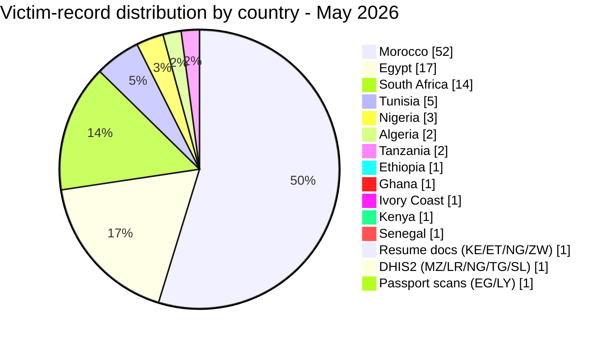
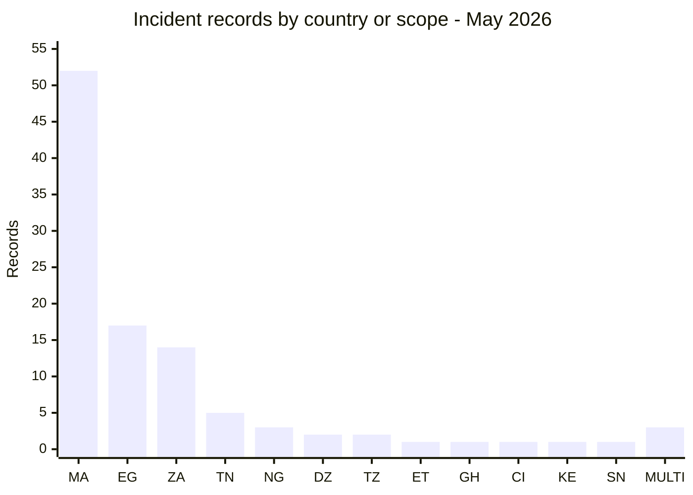
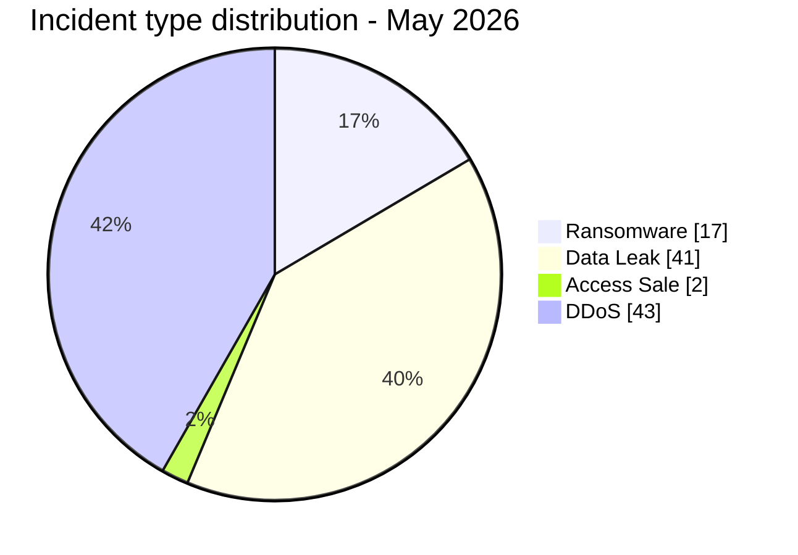
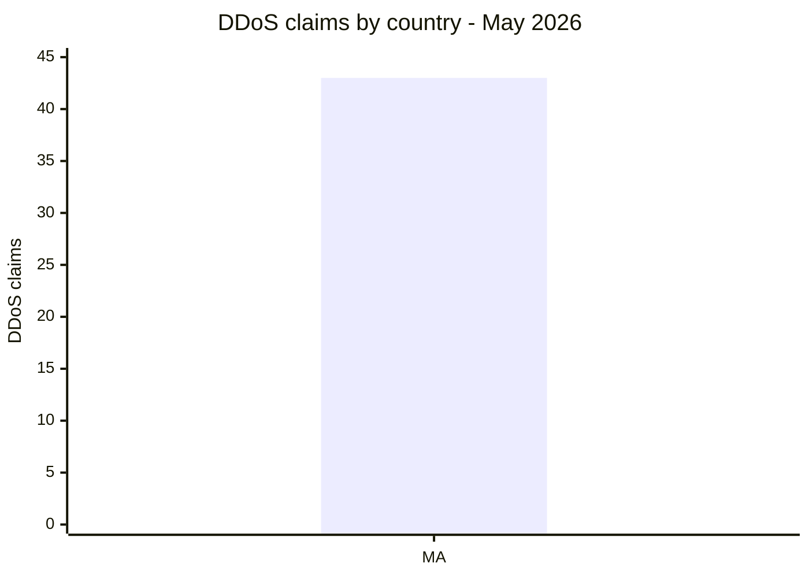
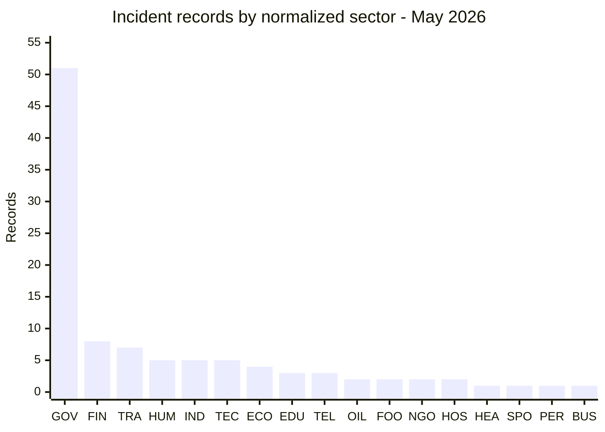
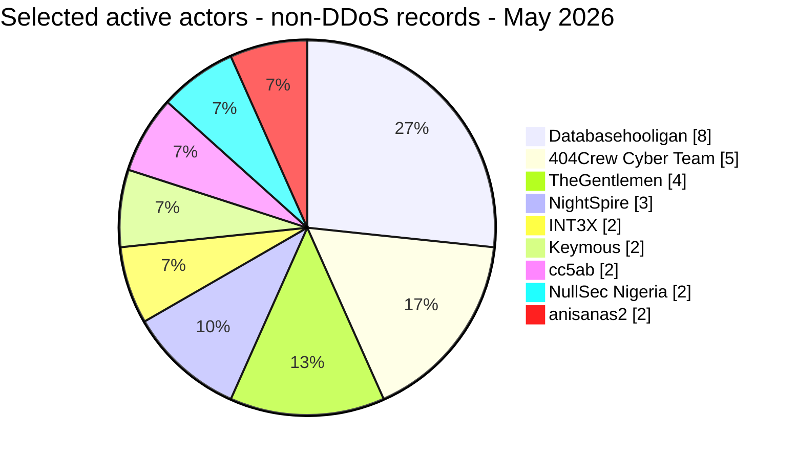
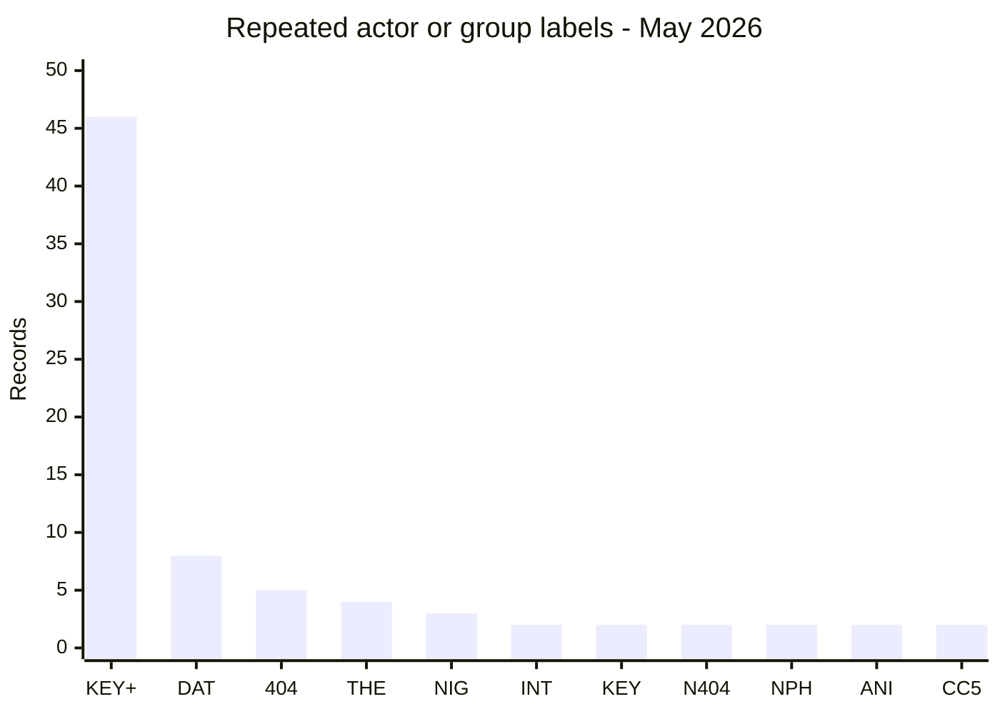
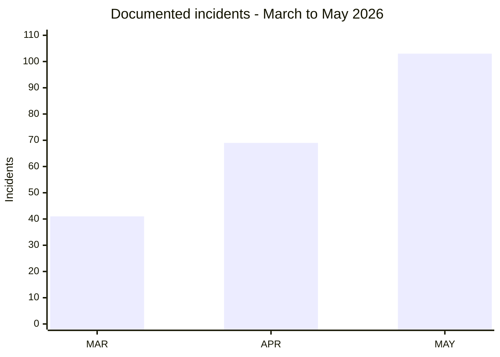

# CTI report - cyberattacks in Africa (May 2026)

👉🏾 [**French version available here**](./README_FR.md)

## 1. Executive summary

May 2026 brought in **103 publicly reported or claimed cyber incidents** across Africa, **17 ransomware listings or disclosures**, **41 data leaks, 2 access sales** and **43 DDoS claims**. Egyptian education entities kept coming up throughout the month, alongside publications under the OpSouthAfrica banner, steady Databasehooligan sales across four countries, and three separate NightSpire listings targeting Egyptian organizations.

Key findings:
- **17 ransomware listings or disclosures (16.5%)**, **41 data leaks (39.8%), 2 access sales (1.9%)** and **43 DDoS claims (41.7%)**.
- **12 countries** are directly affected, with 6 additional countries exposed through 3 multi-country incidents; **Morocco** (52 incidents), **Egypt** (17), **South Africa** (14), and **Tunisia** (5) account for **88 of the 100 direct records (88.0%)**, or **85.4% of all 103 records**.
- Claims attributed to **TheGentlemen** concerned organizations in four countries in one month (Egypt, Tunisia, Ghana, Ivory Coast); **NightSpire** claimed three Egyptian targets.
- **Databasehooligan** was associated with the highest number of dataset sale offers, with 8 organizations across Tunisia, South Africa, Egypt, and Algeria.
- Claims concerning Egyptian education included the Ministry of Education (26.8M student records), Professional Academy for Teachers (1.2M teacher records), Mansoura University (989K records), and a joint Educational & HR database (37 GB). The complete claimed volumes were not independently confirmed.
- Tanzania Police webmail: an actor offered a dataset allegedly containing 10,000+ officer accounts with plaintext passwords. AFRINTEL did not test the credentials.
- Trésor Public du Sénégal: analysed files support a claim involving approximately 1.66M records, but do not independently establish the full intrusion sequence, encryption or ransomware deployment.

### Victim list

👉🏾 [View full victim list](./victims.md)

---

### 1.1 Month-over-month comparison

> Comparison based on validated AFRINTEL monthly corpora. A change in documented records does not, by itself, prove a change in the real number of compromises.

| Indicator | April 2026 | May 2026 | Observed change |
|---|---:|---:|---:|
| Total incidents | 69 | 103 | **+34 (+49.3%)** |
| Ransomware | 20 | 17 | **-3 (-15.0%)** |
| Data Leak | 39 | 41 | **+2 (+5.1%)** |
| Access Sale | 1 | 2 | **+1 (+100.0%)** |
| DDoS | 9 | 43 | **+34 (+377.8%)** |
| Defacement | 0 | 0 | **0 (stable)** |
| Operational Fraud | 0 | 0 | **0 (stable)** |

> Reading rule: when the previous month is `0` and the current month is greater than `0`, the change is marked `new` instead of using an artificial percentage. Categories that are absent remain displayed as `0`.

## 2. Methodology

- **Scope**: 54 African countries.
- **Period**: 1-31 May 2026 (incidents disclosed or claimed during this month; actual attack dates may be earlier).
- **Sources**: Dark web, DLS (leak sites), OSINT, Telegram channels, underground forums.
- **Inclusion**: Publicly claimed or attributed incidents with identified victim, country, and sector.
- **Typology**:
  - *Ransomware*: victim publication or claim by a ransomware group. Encryption is not presumed without supporting evidence.
  - *Data leak / access sale*: exfiltration without encryption, database sold/published, or access sale to compromised systems.
  - *DDoS*: actor-claimed or availability-observed disruption; the test does not independently prove traffic origin.

---

## 3. Global overview

| Indicator | Value |
|---|---|
| Total victims | 103 |
| Countries affected | 18 (12 direct + 6 via multi-country incidents) |
| Distinct actors | 31 named sources or actors |
| Ransomware incidents | 17 (16.5%) |
| Data leaks | 41 (39.8%) |
| Access sales | 2 (1.9%) |
| DDoS claims | 43 (41.7%) |

### Country ranking

**All incidents combined (103):**

| Rank | Country / record scope | Incidents | Chart |
| :---: | :--- | :---: | :--- |
| **1** | 🇲🇦 Morocco | **52** | ██████████████████████████ |
| **2** | 🇪🇬 Egypt | **17** | █████████ |
| **3** | 🇿🇦 South Africa | **14** | ███████ |
| **4** | 🇹🇳 Tunisia | **5** | ███ |
| **5** | 🇳🇬 Nigeria | **3** | ██ |
| **6** | 🇩🇿 Algeria | **2** | █ |
| **7** | 🇹🇿 Tanzania | **2** | █ |
| **8** | 🇪🇹 Ethiopia | **1** | █ |
| **9** | 🇬🇭 Ghana | **1** | █ |
| **10** | 🇨🇮 Ivory Coast | **1** | █ |
| **11** | 🇰🇪 Kenya | **1** | █ |
| **12** | 🇸🇳 Senegal | **1** | █ |
| **-** | 🇰🇪 Kenya / 🇪🇹 Ethiopia / 🇳🇬 Nigeria / 🇿🇼 Zimbabwe (Resume docs) | **1** | █ |
| **-** | 🇲🇿 Mozambique / 🇱🇷 Liberia / 🇳🇬 Nigeria / 🇹🇬 Togo / 🇸🇱 Sierra Leone (DHIS2) | **1** | █ |
| **-** | 🇪🇬 Egypt / 🇱🇾 Libya (Passport scans) | **1** | █ |

> The first 12 rows represent **100 single-country records**. The final 3 rows are multi-country incidents counted once each, bringing the global total to **103**.

**Country code legend:** `MA` = Morocco | `EG` = Egypt | `ZA` = South Africa | `TN` = Tunisia | `NG` = Nigeria | `DZ` = Algeria | `TZ` = Tanzania | `ET` = Ethiopia | `GH` = Ghana | `CI` = Ivory Coast | `KE` = Kenya | `SN` = Senegal | `MULTI` = 3 multi-country records

### Ransomware distribution (Total: 17)

| Rank | Country | Incidents | Chart |
| :---: | :--- | :---: | :--- |
| **1** | 🇪🇬 Egypt | **7** | ███████ |
| **2** | 🇳🇬 Nigeria | **3** | ███ |
| **3** | 🇹🇳 Tunisia | **2** | ██ |
| **4** | 🇿🇦 South Africa | **2** | ██ |
| **5** | 🇬🇭 Ghana | **1** | █ |
| **6** | 🇸🇳 Senegal | **1** | █ |
| **7** | 🇨🇮 Ivory Coast | **1** | █ |

### Data Leak distribution (Total: 41)

| Country / record scope | Incidents |
|---|---:|
| 🇿🇦 South Africa | **12** |
| 🇪🇬 Egypt | **10** |
| 🇲🇦 Morocco | **8** |
| 🇹🇳 Tunisia | **3** |
| 🇩🇿 Algeria | **2** |
| 🇹🇿 Tanzania | **2** |
| 🇪🇹 Ethiopia | **1** |
| 🇰🇪 Kenya | **1** |
| 🇰🇪🇪🇹🇳🇬🇿🇼 Resume docs | **1** |
| 🇪🇬🇱🇾 Passport scans | **1** |
| **Total** | **41** |

### Access Sale distribution (Total: 2)

| Country / record scope | Incidents |
|---|---:|
| 🇲🇦 Morocco - Spacex.ma | **1** |
| 🇲🇿🇱🇷🇳🇬🇹🇬🇸🇱 DHIS2 | **1** |
| **Total** | **2** |

### Ransomware vs Data Leak / Access Sale comparison by country

This visual comparison covers the **60 non-DDoS records**: **17 ransomware records** and **43 Data Leak / Access Sale records**. The blue series combines **41 Data Leak incidents and 2 Access Sales** for visual comparison only. Their structured counters remain separate elsewhere in the report.

The **43 DDoS claims are excluded from this comparison** and displayed separately below.

**Visual legend:** 🟧 Ransomware | 🟦 Data Leak / Access Sale | 🟥 DDoS

| Code | Country / scope | Ransomware | Bar | Data Leak / Access Sale | Bar |
|---|---|---:|---|---:|---|
| `MA` | Morocco | **0** | - | **9** | 🟦🟦🟦🟦🟦🟦🟦🟦🟦 |
| `EG` | Egypt | **7** | 🟧🟧🟧🟧🟧🟧🟧 | **10** | 🟦🟦🟦🟦🟦🟦🟦🟦🟦🟦 |
| `ZA` | South Africa | **2** | 🟧🟧 | **12** | 🟦🟦🟦🟦🟦🟦🟦🟦🟦🟦🟦🟦 |
| `TN` | Tunisia | **2** | 🟧🟧 | **3** | 🟦🟦🟦 |
| `NG` | Nigeria | **3** | 🟧🟧🟧 | **0** | - |
| `DZ` | Algeria | **0** | - | **2** | 🟦🟦 |
| `TZ` | Tanzania | **0** | - | **2** | 🟦🟦 |
| `ET` | Ethiopia | **0** | - | **1** | 🟦 |
| `GH` | Ghana | **1** | 🟧 | **0** | - |
| `CI` | Ivory Coast | **1** | 🟧 | **0** | - |
| `KE` | Kenya | **0** | - | **1** | 🟦 |
| `SN` | Senegal | **1** | 🟧 | **0** | - |
| `MULTI` | Multi-country records | **0** | - | **3** | 🟦🟦🟦 |
|  | **Compared total** | **17** |  | **43** |  |

```mermaid
xychart-beta
    title "Ransomware vs Data Leak / Access Sale by country - May 2026"
    x-axis ["MA", "EG", "ZA", "TN", "NG", "DZ", "TZ", "ET", "GH", "CI", "KE", "SN", "MULTI"]
    y-axis "Incidents" 0 --> 13
    bar [0, 7, 2, 2, 3, 0, 0, 0, 1, 1, 0, 1, 0]
    bar [9, 10, 12, 3, 0, 2, 2, 1, 0, 0, 1, 0, 3]
```

**Series legend:** first bar series = 🟧 Ransomware | second bar series = 🟦 Data Leak / Access Sale.

**Country legend:** `MA` = Morocco | `EG` = Egypt | `ZA` = South Africa | `TN` = Tunisia | `NG` = Nigeria | `DZ` = Algeria | `TZ` = Tanzania | `ET` = Ethiopia | `GH` = Ghana | `CI` = Ivory Coast | `KE` = Kenya | `SN` = Senegal | `MULTI` = 3 multi-country records.

**Color convention used in comparative views:** 🟧 Ransomware | 🟦 Data Leak / Access Sale | 🟥 DDoS.

### DDoS distribution

| Code | Country | DDoS | Bar |
|---|---|---:|---|
| `MA` | Morocco | **43** | 🟥🟥🟥🟥🟥🟥🟥🟥🟥🟥🟥🟥🟥🟥🟥🟥🟥🟥🟥🟥🟥🟥🟥🟥🟥🟥🟥🟥🟥🟥🟥🟥🟥🟥🟥🟥🟥🟥🟥🟥🟥🟥🟥 |
|  | **Total** | **43** | |

**DDoS legend:** 🟥 DDoS | `MA` = Morocco.

The 43 DDoS entries are retrospective Keymous+ target-date observations involving Moroccan targets. They remain actor-side availability claims: the documented checks do not independently establish traffic origin, technique, duration, or successful impact.

### Geographic breakdown by region

> Regional values below use the **103 deduplicated records**. The three multi-country incidents remain separate rather than being expanded into each affected country.

| Region / record scope | Total records | Ransomware | Leaks / access | DDoS | Share of 103 |
| :--- | ---: | ---: | ---: | ---: | ---: |
| **North Africa** | **76** | 9 | 24 | 43 | **73.8%** |
| **Southern Africa** | **14** | 2 | 12 | 0 | **13.6%** |
| **West Africa** | **6** | 6 | 0 | 0 | **5.8%** |
| **East Africa** | **4** | 0 | 4 | 0 | **3.9%** |
| **Multi-country records** | **3** | 0 | 3 | 0 | **2.9%** |
| **Total** | **103** | **17** | **43** | **43** | **100%** |

### Sector distribution

The source cards use two additional government labels (`Government / Diplomacy` and `Government / Civil Aviation`). They are normalized below into **Government / Administration**, giving 51 government/public-administration records in total.

| Activity sector | Incidents | Share |
| :--- | ---: | ---: |
| **Government / Administration** | **51** | **49.5%** |
| **Finance / Banking** | **8** | **7.8%** |
| **Transport / Logistics** | **7** | **6.8%** |
| **Human Resources / Recruitment** | **5** | **4.9%** |
| **Industry / Automotive / Manufacturing** | **5** | **4.9%** |
| **Technology / Hosting** | **5** | **4.9%** |
| **E-commerce / Retail** | **4** | **3.9%** |
| **Education / University** | **3** | **2.9%** |
| **Telecommunications** | **3** | **2.9%** |
| **Oil & Energy** | **2** | **1.9%** |
| **Food / Beverage / Restaurants** | **2** | **1.9%** |
| **NGO / Social Welfare** | **2** | **1.9%** |
| **Hospitality / Events** | **2** | **1.9%** |
| **Healthcare / Medical** | **1** | **1.0%** |
| **Sports / Federations** | **1** | **1.0%** |
| **Personal Data Aggregation** | **1** | **1.0%** |
| **Business Services** | **1** | **1.0%** |
| **Total** | **103** | **100%** |

**Sector code legend:** `GOV` = Government / Administration | `FIN` = Finance / Banking | `TRA` = Transport / Logistics | `HUM` = Human Resources / Recruitment | `IND` = Industry / Automotive / Manufacturing | `TEC` = Technology / Hosting | `ECO` = E-commerce / Retail | `EDU` = Education / University | `TEL` = Telecommunications | `OIL` = Oil & Energy | `FOO` = Food / Beverage / Restaurants | `NGO` = NGO / Social Welfare | `HOS` = Hospitality / Events | `HEA` = Healthcare / Medical | `SPO` = Sports / Federations | `PER` = Personal Data Aggregation | `BUS` = Business Services

### Most prolific threat actors and groups

> To keep the comparison meaningful, this ranking covers the **60 ransomware and data-leak/access-sale records**. The 43 DDoS records attributed to Keymous+ are analysed separately in section 4.3.

| Threat actor / Group | Incidents | Primary activity |
| :--- | ---: | :--- |
| **Databasehooligan** | **8** | Data leaks / sales |
| **404Crew Cyber Team** | **5** | Data leaks / coalition activity |
| **TheGentlemen** | **4** | Ransomware |
| **NightSpire** | **3** | Ransomware |
| **INT3X** | **2** | Data leaks |
| **Keymous** | **2** | Data leaks / access sales |
| **cc5ab** | **2** | Data leaks |
| **NullSec Nigeria** | **2** | Data leaks / coalition activity |
| **anisanas2** | **2** | Data leaks / data sales |

### Geographic summary

> **For details of each incident, see [`victims.md`](./victims.md).**

- **Concentration:** Egypt (17), South Africa (14), Morocco (52) and Tunisia (5) account for 88 of 103 incidents, or 85.4% of the month.
- **Threat mix:** 17 ransomware claims or publications, 41 data leaks, 2 access sales and 43 DDoS claims were recorded. The incidents concern 18 African countries: 12 directly and 6 additional countries through multi-country exposure.
- **Campaign activity:** Egyptian education entities faced several large claims, while OpSouthAfrica targeted public institutions and Databasehooligan appeared across four countries.
- **High-impact exposures:** notable cases involved Tanzanian police webmail accounts and the AuditTeam claim concerning the Trésor Public du Sénégal.

---

## 4. Detailed analysis by incident type

### 4.1 Ransomware (17 incidents)

| Rank | Country | Listings or disclosures | Main threat actors |
| :---: | :--- | :---: | :--- |
| **1** | 🇪🇬 Egypt | **7** | NightSpire (3), TheGentlemen, Qilin, LockBit 5.0, Lamashtu |
| **2** | 🇳🇬 Nigeria | **3** | MedusaLocker, KillSec, 0day Syndicate |
| **3** | 🇹🇳 Tunisia | **2** | TheGentlemen, Titan |
| **4** | 🇿🇦 South Africa | **2** | PrinzEugen, Stormous |
| **5** | 🇬🇭 Ghana | **1** | TheGentlemen |
| **6** | 🇸🇳 Senegal | **1** | AuditTeam |
| **7** | 🇨🇮 Ivory Coast | **1** | TheGentlemen |

**Observations:** NightSpire put out three Egyptian victim listings this month. TheGentlemen spread widest geographically, claims in four countries. Stormous claimed the Consumer Goods Council of South Africa (CGCSA), which had been miscounted as a non-ransomware data leak, now reclassified as a ransomware listing. For the Trésor Public du Sénégal, the analysed files back the data-exposure claim, but they don't independently confirm ransomware deployment, encryption or the full intrusion sequence.

### 4.2 Data leaks and access sales - structured split: 41 Data Leak + 2 Access Sale

| Rank | Country | Incidents | Main actors |
| :---: | :--- | :---: | :--- |
| **1** | 🇿🇦 South Africa | **12** | Databasehooligan, 404Crew CT, NullSec Nigeria, Kazu, cc5ab |
| **2** | 🇪🇬 Egypt | **10** | INT3X, Revesky, cc5ab, DR-X-LOL, CrowStealer, bigF, Keymous, Databasehooligan |
| **3** | 🇲🇦 Morocco | **9** | Sejjil, superstarkmc, JBT2026, fexus, DarkMafiaX, anisanas2 |
| **4** | 🇹🇳 Tunisia | **3** | Databasehooligan (3) |
| **5** | 🇩🇿 Algeria | **2** | kamalsheikhxx, Databasehooligan |
| **6** | 🇹🇿 Tanzania | **2** | XOverStm, Kampuchean |
| **7** | 🇪🇹 Ethiopia | **1** | 404Crew Cyber Team |
| **-** | 🇰🇪🇪🇹🇳🇬🇿🇼 Resume docs | **1** | attackercompany |
| **-** | 🇲🇿🇱🇷🇳🇬🇹🇬🇸🇱 DHIS2 | **1** | Keymous |
| **-** | 🇪🇬🇱🇾 Passport scans | **1** | raylie |

**Key observations:**
- **Databasehooligan** targeted CRM-structured databases across four countries, selling between $900 and $1,400 per dataset, with victims including Telkom SA (742K records), Wanderers Club SA (674K), Wuzzuf.net Egypt (672K), MyTelnet Tunisia, OptionCarriere.tn, Keejob, MIDAS SA, and OGEBC Algeria.
- The **404Crew Cyber Team** coalition (with NullSec Nigeria, NullSec Philippines, and Infernalis) ran a sustained campaign against South African institutions under the "OpSouthAfrica" banner, targeting Ephraim Mogale Municipality, DCS, Bellavista School, SITA, SARS, mevent., CERVI, and Sheriff Randburg West. The same actor also advertised Ethiopia's NGO Registration Database for sale.
- Claims concerning Egypt’s education sector referenced four datasets or entities. Their temporal proximity warrants monitoring but does not establish a shared vulnerability or coordinated campaign.
- **Tanzania Police** webmail was put up for sale with 10,000+ officer accounts and plaintext passwords, posing critical law enforcement exposure.

---

### 4.3 DDoS claims (43 incidents)

The retrospective Keymous+ collection adds 43 Moroccan target-date observations between 9 and 28 May 2026. Each target in a dated availability publication counts as one incident; duplicate captures of the same target in the same window are deduplicated. Check-Host and Cloudflare results document apparent unavailability, but do not independently prove traffic origin, DDoS method or successful impact.

## 5. Sectoral impact

| Activity sector | Incidents | Share |
| :--- | ---: | ---: |
| **Government / Administration** | **51** | **49.5%** |
| **Finance / Banking** | **8** | **7.8%** |
| **Transport / Logistics** | **7** | **6.8%** |
| **Human Resources / Recruitment** | **5** | **4.9%** |
| **Industry / Automotive / Manufacturing** | **5** | **4.9%** |
| **Technology / Hosting** | **5** | **4.9%** |
| **E-commerce / Retail** | **4** | **3.9%** |
| **Education / University** | **3** | **2.9%** |
| **Telecommunications** | **3** | **2.9%** |
| **Oil & Energy** | **2** | **1.9%** |
| **Food / Beverage / Restaurants** | **2** | **1.9%** |
| **NGO / Social Welfare** | **2** | **1.9%** |
| **Hospitality / Events** | **2** | **1.9%** |
| **Healthcare / Medical** | **1** | **1.0%** |
| **Sports / Federations** | **1** | **1.0%** |
| **Personal Data Aggregation** | **1** | **1.0%** |
| **Business Services** | **1** | **1.0%** |
| **Total** | **103** | **100%** |

**Key observations:**
- Government / Administration represents **51 of 103 records (49.5%)**, driven in part by the retrospective Moroccan DDoS corpus and public-sector leak/access claims.
- Finance / Banking accounts for 8 records and Transport / Logistics for 7.
- Education / University records 3 primary-sector entries; mixed government/education datasets remain classified under the primary sector recorded in the victim card.
- The analysed Trésor Public files and the Tanzania Police webmail offer are high-sensitivity public-sector cases, but neither establishes the complete intrusion path.

---

## 6. Threat actor profile

> The table below focuses on ransomware and data-leak/access-sale activity; the 43 DDoS claims attributed to Keymous+ are treated separately in section 4.3.

| Threat actor | Type | Incidents | Primary targets |
| :--- | :--- | :---: | :--- |
| **Databasehooligan** | Account offering datasets for sale | **8** | CRM/recruitment databases (multi-country) |
| **TheGentlemen** | Ransomware | **4** | Industry, automotive, food (4 countries) |
| **404Crew Cyber Team** | Data leak (coalitions) | **5+** | South African public institutions, Ethiopian civil society registry |
| **NightSpire** | Ransomware | **3** | Egyptian finance and food services |
| **INT3X** | Data leak | **2** | Egyptian education institutions |
| **Keymous** | Access sale / data leak | **2** | Health systems, telecom (multi-country) |
| **cc5ab** | Data leak | **2** | Egyptian and Kenyan government |
| **NullSec Nigeria** | Data leak (coalitions) | **2+** | South African government agencies |
| **anisanas2** | Data leak | **2** | Moroccan infrastructure (RADEM, multi-entity bundle sale) |

**Emerging actors:**
- **PrinzEugen** (Standard Bank claim)
- **Lamashtu** (Luna Group Egypt)
- **Kampuchean** (Tanzania Police webmail)
- **JBT2026** (Watiqa.ma Morocco civil registry)

**Actor/group code legend:** `KEY+` = Keymous+ | `DAT` = Databasehooligan | `404` = 404Crew Cyber Team | `THE` = TheGentlemen | `NIG` = NightSpire | `INT` = INT3X | `KEY` = Keymous | `N404` = NullSec Nigeria x 404Crew Cyber Team x Infernalis | `NPH` = NullSec Nigeria x NullSec Philippines | `ANI` = anisanas2 | `CC5` = cc5ab

> Provenance annotations are normalized for this chart. Coalition labels remain distinct, and Keymous is not merged with Keymous+.

### 6.1 Risk assessment

| Country | Risk level |
|---|---|
| Egypt | 🔴 Critical |
| South Africa | 🔴 Critical |
| Morocco | 🟠 High |
| Tunisia | 🟠 High |
| Nigeria | 🟠 Medium-High |
| Algeria | 🟡 Medium |
| Tanzania | 🟠 Medium-High |
| Remaining countries | 🟡 Low-Medium |

---

## 7. Key trends and intelligence gaps

- **Egyptian education keeps getting hit.** Four separate records this month. Whether that's a coordinated campaign or just a shared infrastructure weakness is still an open question.
- **"OpSouthAfrica" looks like a coalition effort.** 404Crew Cyber Team, NullSec Nigeria and Infernalis together targeted at least eight South African institutions in May, mixing data leaks with political messaging around xenophobia grievances.
- **Databasehooligan is selling everywhere.** Eight structured CRM or consumer datasets, Tunisia, South Africa, Egypt, Algeria, offered for sale. Nothing in the source records ties them to one platform or a shared access vector.
- **NightSpire stayed focused on Egypt.** Three victim listings this month, worth watching, not yet proof of a coordinated campaign.
- **Government email is becoming an access vector in its own right.** Moroccan government credential exposure (827K lines), a Tanzanian police webmail sale, multi-country EDR-fraud account offers, all point to a growing market for impersonating law enforcement.
- **DHIS2 access being sold across seven countries** (Mozambique, Liberia, Nigeria, Bhutan, Honduras, Togo, Sierra Leone) is a real threat to public-health data sovereignty on its own.
- **Morocco kept getting targeted.** Two large claims landed in the final ten days of May: RADEM Meknès (1.1 million documents claimed) and a bundled sale advertised at over 12 million lines across several institutions. anisanas2 had already published Morocco-related claims in April, so the activity is repeating, though nothing establishes a shared access vector between the two.

---

**Time legend:** `MAR` = March 2026 | `APR` = April 2026 | `MAY` = May 2026.

### Factual comparison with April 2026

This comparison uses the monthly victim and incident data for [April](../04-april/victims.md) and [May](./victims.md). It describes AFRINTEL's documented publications only and does not infer a change in the actual number of compromises.

| Indicator | April 2026 | May 2026 | Observed change |
| :--- | ---: | ---: | :--- |
| Documented incidents | 69 | 103 | **+34 (+49.3%)** |
| Ransomware | 20 | 17 | **-3 (-15.0%)** |
| Data leaks + access sales | 40 | **43 (41 + 2)** | **+3 (+7.5%)** |
| DDoS claims | 9 | 43 | **+34 (+377.8%)** |

The month-on-month variation reflects changes in AFRINTEL's collected public record. It may depend on publication timing, retrospective collection, multi-country counting rules, reposts or monitoring coverage, and should not be read as a confirmed change in the true number of compromises.

## 8. MITRE ATT&CK mapping (contextual)

| Phase | Technique | Analytical scope |
| :--- | :--- | :--- |
| Initial access | T1566 - Phishing | Defensive detection hypothesis, not observed from the claims alone |
| Initial access | T1190 - Exploit Public-Facing Application | Defensive detection hypothesis, not observed from the claims alone |
| Account access | T1078 - Valid Accounts | Relevant to access or credential sales, without confirming use of the accounts |
| Collection | T1005 - Data from Local System | Contextual hypothesis when internal data is published; the collection mechanism remains unknown |
| Impact | T1486 - Data Encrypted for Impact | Relevant to ransomware preparedness, without confirming encryption for every entry |

> These techniques are defensive hypotheses. A claim, data sale or leak-site publication is not sufficient to treat them as observed.

## 9. Recommendations

- **Governments:** Enforce MFA on all administrative and educational portals; audit credential exposure on underground forums; treat the Moroccan gov credential leak as a systemic identity risk requiring immediate password resets across all affected platforms.
- **Educational institutions:** Isolate student and staff databases from public-facing web infrastructure; encrypt sensitive data at rest; implement audit logging on administrative platforms.
- **Financial sector:** Monitor ransomware DLS for pre-publication indicators; maintain offline backups; review third-party data flows for CRM and e-payment platforms.
- **Law enforcement:** Treat the Tanzania Police webmail sale/claimed exposure as a potential operational security risk; rotate all affected credentials; implement DMARC/DKIM on government email domains.
- **Healthcare:** Audit DHIS2 administrative accounts immediately; rotate credentials; restrict admin panel access to internal networks only.

---

## 10. SOC tactical recommendations

- **[T1078] Credential monitoring:** Correlate dark web leak data against internal user directories; flag accounts exposed in Moroccan gov, Tanzania Police, and Stats SA claims.
- **[T1190] API exposure:** Implement authenticated access controls on all public-facing APIs; scan for unauthenticated S3 buckets and exposed admin panels.
- **[T1486] Ransomware detection:** Monitor for unusual volume encryption activity, shadow copy deletion (vssadmin), and lateral movement via SMB/RDP from new admin accounts.
- **[Data broker activity]:** Establish a threat intelligence feed tracking Databasehooligan, 404Crew, and NightSpire for early warning of new African targets.

---

## 11. Strategic recommendations

- Establish cross-sector notification channels for repeated claims affecting public institutions and critical services.
- Require periodic audits of cloud storage, exposed APIs and privileged accounts in government, education and financial services.
- Coordinate with platforms and national CERTs on abuse of government or law-enforcement identities.

---

## 12. Conclusion

May closed at **103 publicly reported or claimed incidents**, up from 69 in April (**+49.3%**): **17 ransomware records, 41 data leaks, 2 access sales and 43 DDoS claims**.

Morocco accounted for **52 records**, followed by Egypt (17), South Africa (14) and Tunisia (5). Together, these four countries represent **85.4% of the complete May corpus**.

The month shows a threat landscape extending beyond ransomware, combining availability attacks, data publication, credential exposure and access brokerage. For AFRINTEL, keeping incident type, actor claim, available evidence and confidence level separate remains essential for reproducible monthly analysis.

**AFRINTEL** - African Cyber Threat Intelligence
🔗 [GitHub AFRINTEL Repository](https://github.com/Hatchepsoute/AFRINTEL)
