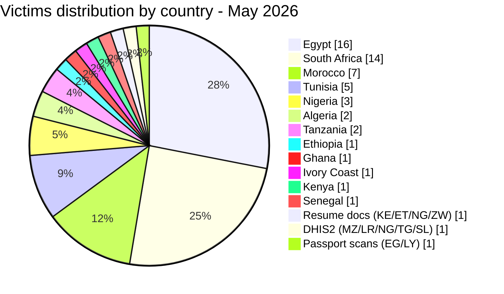
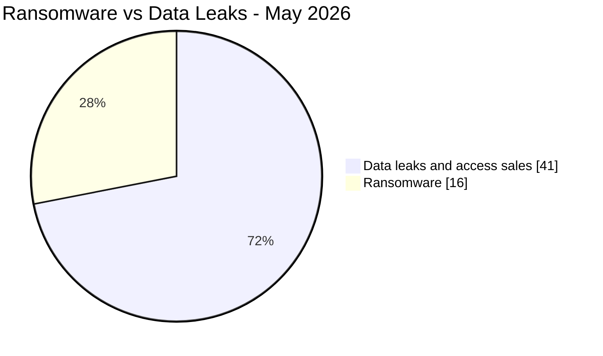
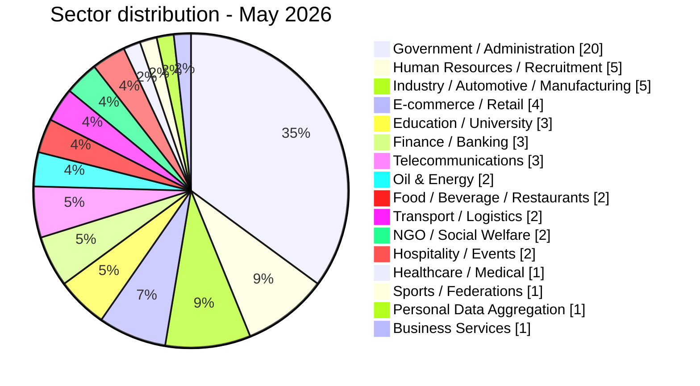
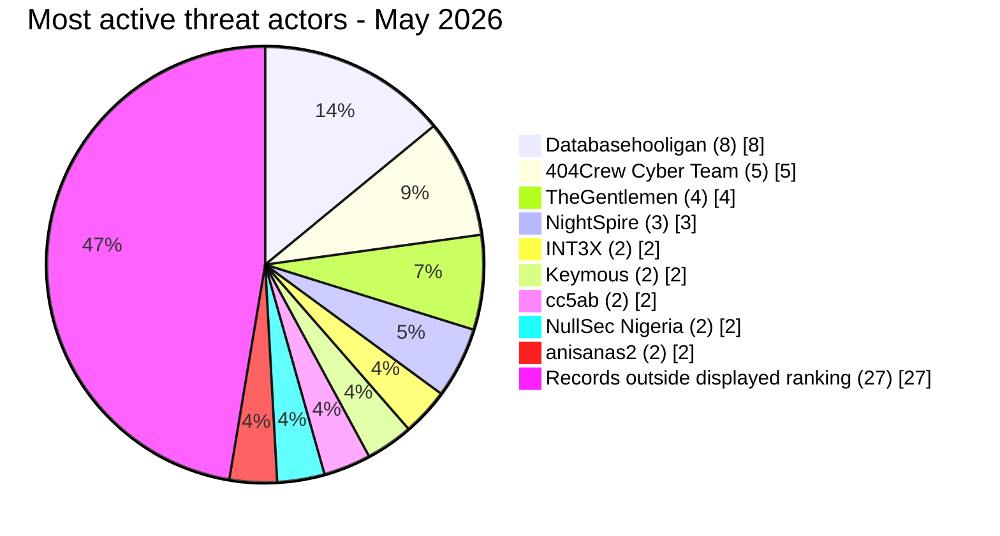

# CTI report - cyberattacks in Africa (May 2026)

👉🏾 [**French version available here**](./README_FR.md)

## 1. Executive summary

May 2026 recorded **57 publicly reported or claimed cyber incidents** across Africa: **16 ransomware listings or disclosures** and **41 data leaks / access sales**. The month included repeated claims affecting Egyptian education entities, publications under the OpSouthAfrica banner, sustained Databasehooligan sales across four countries and three NightSpire victim listings concerning Egyptian organizations.

Key findings:
- **16 ransomware listings or disclosures (28.1%)** and **41 data leaks / access sales (71.9%)**.
- **12 countries** affected, plus 3 multi-country incidents; **Egypt** (16 incidents), **South Africa** (14), **Morocco** (7), and **Tunisia** (5) account for 73.7% of victims.
- Claims attributed to **TheGentlemen** concerned organizations in four countries in one month (Egypt, Tunisia, Ghana, Ivory Coast); **NightSpire** claimed three Egyptian targets.
- **Databasehooligan** was associated with the highest number of dataset sale offers, with 8 organizations across Tunisia, South Africa, Egypt, and Algeria.
- Claims concerning Egyptian education included the Ministry of Education (26.8M student records), Professional Academy for Teachers (1.2M teacher records), Mansoura University (989K records), and a joint Educational & HR database (37 GB). The complete claimed volumes were not independently confirmed.
- Tanzania Police webmail: an actor offered a dataset allegedly containing 10,000+ officer accounts with plaintext passwords. AFRINTEL did not test the credentials.
- Trésor Public du Sénégal: analysed files support a claim involving approximately 1.66M records, but do not independently establish the full intrusion sequence, encryption or ransomware deployment.

### Victim list

👉🏾 [View full victim list](./victims.md)

---

## 2. Methodology

- **Scope**: 54 African countries.
- **Period**: 1-31 May 2026 (incidents disclosed or claimed during this month; actual attack dates may be earlier).
- **Sources**: Dark web, DLS (leak sites), OSINT, Telegram channels, underground forums.
- **Inclusion**: Publicly claimed or attributed incidents with identified victim, country, and sector.
- **Typology**:
  - *Ransomware*: victim publication or claim by a ransomware group. Encryption is not presumed without supporting evidence.
  - *Data leak / access sale*: exfiltration without encryption, database sold/published, or access sale to compromised systems.

---

## 3. Global overview

| Indicator | Value |
|---|---|
| Total victims | 57 |
| Countries affected | 18 (12 direct + 6 via multi-country incidents) |
| Distinct actors | 31 named sources or actors |
| Ransomware incidents | 16 (28.1%) |
| Data leaks / access sales | 41 (71.9%) |

### Country ranking

**All incidents combined (57):**

| Rank | Country | Incidents | Chart |
| :---: | :--- | :---: | :--- |
| **1** | 🇪🇬 Egypt | **16** | ████████████████ |
| **2** | 🇿🇦 South Africa | **14** | ██████████████ |
| **3** | 🇲🇦 Morocco | **7** | ███████ |
| **4** | 🇹🇳 Tunisia | **5** | █████ |
| **5** | 🇳🇬 Nigeria | **3** | ███ |
| **6** | 🇩🇿 Algeria | **2** | ██ |
| **7** | 🇹🇿 Tanzania | **2** | ██ |
| **8** | 🇪🇹 Ethiopia | **1** | █ |
| **9** | 🇬🇭 Ghana | **1** | █ |
| **10** | 🇨🇮 Ivory Coast | **1** | █ |
| **11** | 🇰🇪 Kenya | **1** | █ |
| **12** | 🇸🇳 Senegal | **1** | █ |
| **-** | 🇰🇪 Kenya / 🇪🇹 Ethiopia / 🇳🇬 Nigeria / 🇿🇼 Zimbabwe (Resume docs) | **1** | █ |
| **-** | 🇲🇿 Mozambique / 🇱🇷 Liberia / 🇳🇬 Nigeria / 🇹🇬 Togo / 🇸🇱 Sierra Leone (DHIS2) | **1** | █ |
| **-** | 🇪🇬 Egypt / 🇱🇾 Libya (Passport scans) | **1** | █ |

### Ransomware distribution (Total: 16)

| Rank | Country | Incidents | Chart |
| :---: | :--- | :---: | :--- |
| **1** | 🇪🇬 Egypt | **7** | ███████ |
| **2** | 🇳🇬 Nigeria | **3** | ███ |
| **3** | 🇹🇳 Tunisia | **2** | ██ |
| **4** | 🇿🇦 South Africa | **1** | █ |
| **5** | 🇬🇭 Ghana | **1** | █ |
| **6** | 🇸🇳 Senegal | **1** | █ |
| **7** | 🇨🇮 Ivory Coast | **1** | █ |

### Data leaks / access sales distribution (Total: 41)

| Rank | Country | Incidents | Chart |
| :---: | :--- | :---: | :--- |
| **1** | 🇿🇦 South Africa | **13** | █████████████ |
| **2** | 🇪🇬 Egypt | **9** | █████████ |
| **3** | 🇲🇦 Morocco | **7** | ███████ |
| **4** | 🇹🇳 Tunisia | **3** | ███ |
| **5** | 🇩🇿 Algeria | **2** | ██ |
| **6** | 🇹🇿 Tanzania | **2** | ██ |
| **7** | 🇪🇹 Ethiopia | **1** | █ |
| **8** | 🇰🇪 Kenya | **1** | █ |
| **-** | 🇰🇪🇪🇹🇳🇬🇿🇼 Resume docs | **1** | █ |
| **-** | 🇲🇿🇱🇷🇳🇬🇹🇬🇸🇱 DHIS2 | **1** | █ |
| **-** | 🇪🇬🇱🇾 Passport scans | **1** | █ |

### Ransomware vs. data leaks comparison by country

| Country | Ransomware | Data Leaks | Side-by-side distribution |
| :--- | :---: | :---: | :--- |
| 🇪🇬 Egypt | **7** | **9** | 🟧🟧🟧🟧🟧🟧🟧 🟦🟦🟦🟦🟦🟦🟦🟦🟦 |
| 🇿🇦 South Africa | **1** | **13** | 🟧 🟦🟦🟦🟦🟦🟦🟦🟦🟦🟦🟦🟦🟦 |
| 🇲🇦 Morocco | **0** | **7** | 🟦🟦🟦🟦🟦🟦🟦 |
| 🇹🇳 Tunisia | **2** | **3** | 🟧🟧 🟦🟦🟦 |
| 🇳🇬 Nigeria | **3** | **0** | 🟧🟧🟧 |
| 🇩🇿 Algeria | **0** | **2** | 🟦🟦 |
| 🇹🇿 Tanzania | **0** | **2** | 🟦🟦 |
| 🇪🇹 Ethiopia | **0** | **1** | 🟦 |
| 🇬🇭 Ghana | **1** | **0** | 🟧 |
| 🇨🇮 Ivory Coast | **1** | **0** | 🟧 |
| 🇰🇪 Kenya | **0** | **1** | 🟦 |
| 🇸🇳 Senegal | **1** | **0** | 🟧 |
| 🇰🇪🇪🇹🇳🇬🇿🇼 Resume docs | **0** | **1** | 🟦 |
| 🇲🇿🇱🇷🇳🇬🇹🇬🇸🇱 DHIS2 | **0** | **1** | 🟦 |
| 🇪🇬🇱🇾 Passport scans | **0** | **1** | 🟦 |
| **Total (57)** | **16** | **41** | *Legend: 🟧 Ransomware \| 🟦 Data Leaks* |

### Geographic breakdown by region

| Region | Total incidents | Ransomware | Leaks | Side-by-side |
| :--- | :---: | :---: | :---: | :--- |
| **North Africa** | **30** (52.6%) | 9 | 21 | 🟧🟧🟧🟧🟧🟧🟧🟧🟧 🟦🟦🟦🟦🟦🟦🟦🟦🟦🟦🟦🟦🟦🟦🟦🟦🟦🟦🟦🟦🟦 |
| **Southern Africa** | **14** (24.6%) | 1 | 13 | 🟧 🟦🟦🟦🟦🟦🟦🟦🟦🟦🟦🟦🟦🟦 |
| **West Africa** | **6** (10.5%) | 6 | 0 | 🟧🟧🟧🟧🟧🟧 |
| **East Africa** | **4** (7.0%) | 0 | 4 | 🟦🟦🟦🟦 |
| 🇰🇪🇪🇹🇳🇬🇿🇼🇲🇿🇱🇷🇹🇬🇸🇱🇱🇾 Multi-country (3 incidents) | **3** (5.3%) | 0 | 3 | 🟦🟦🟦 |

*Legend: 🟧 Ransomware | 🟦 Data Leaks*

### Sector distribution

| Activity sector | Incidents | Share (%) | Chart |
| :--- | :---: | :---: | :--- |
| **Government / Administration** | **20** | 35.09% | ████████████████████ |
| **Human Resources / Recruitment** | **5** | 8.77% | █████ |
| **Industry / Automotive / Manufacturing** | **5** | 8.77% | █████ |
| **E-commerce / Retail** | **4** | 7.02% | ████ |
| **Education / University** | **3** | 5.26% | ███ |
| **Finance / Banking** | **3** | 5.26% | ███ |
| **Telecommunications** | **3** | 5.26% | ███ |
| **Oil & Energy** | **2** | 3.51% | ██ |
| **Food / Beverage / Restaurants** | **2** | 3.51% | ██ |
| **Transport / Logistics** | **2** | 3.51% | ██ |
| **NGO / Social Welfare** | **2** | 3.51% | ██ |
| **Hospitality / Events** | **2** | 3.51% | ██ |
| **Healthcare / Medical** | **1** | 1.75% | █ |
| **Sports / Federations** | **1** | 1.75% | █ |
| **Personal Data Aggregation** | **1** | 1.75% | █ |
| **Business Services** | **1** | 1.75% | █ |
| **Total** | **57** | **100%** | |

### Most prolific threat actors and groups

| Threat actor / Group | Incidents | Primary activity | Chart |
| :--- | :---: | :--- | :--- |
| **Databasehooligan** | **8** | Data leaks / sales | 🟦🟦🟦🟦🟦🟦🟦🟦 |
| **404Crew Cyber Team** | **5** | Data leaks (coalitions) | 🟦🟦🟦🟦🟦 |
| **TheGentlemen** | **4** | Ransomware | 🟧🟧🟧🟧 |
| **NightSpire** | **3** | Ransomware | 🟧🟧🟧 |
| **INT3X** | **2** | Data leaks | 🟦🟦 |
| **Keymous** | **2** | Data leaks / access sales | 🟦🟦 |
| **cc5ab** | **2** | Data leaks | 🟦🟦 |
| **NullSec Nigeria** | **2** | Data leaks (coalitions) | 🟦🟦 |
| **anisanas2** | **2** | Data leaks / data sales (Morocco) | 🟦🟦 |

*Legend: 🟧 Ransomware \| 🟦 Data Leaks*

---

### Geographic summary

> **For details of each incident, see [`victims.md`](./victims.md).**

- **Concentration:** Egypt (16), South Africa (14), Morocco (7) and Tunisia (5) account for 42 of 57 incidents, or 73.7% of the month.
- **Threat mix:** 16 ransomware claims or publications and 41 data leaks or access sales were recorded. The incidents concern 18 African countries: 12 directly and 6 additional countries through multi-country exposure.
- **Campaign activity:** Egyptian education entities faced several large claims, while OpSouthAfrica targeted public institutions and Databasehooligan appeared across four countries.
- **High-impact exposures:** notable cases involved Tanzanian police webmail accounts and the AuditTeam claim concerning the Trésor Public du Sénégal.

---

## 4. Detailed analysis by incident type

### 4.1 Ransomware (16 incidents)

| Rank | Country | Listings or disclosures | Main threat actors |
| :---: | :--- | :---: | :--- |
| **1** | 🇪🇬 Egypt | **7** | NightSpire (3), TheGentlemen, Qilin, LockBit 5.0, Lamashtu |
| **2** | 🇳🇬 Nigeria | **3** | MedusaLocker, KillSec, 0day Syndicate |
| **3** | 🇹🇳 Tunisia | **2** | TheGentlemen, Titan |
| **4** | 🇿🇦 South Africa | **1** | PrinzEugen |
| **5** | 🇬🇭 Ghana | **1** | TheGentlemen |
| **6** | 🇸🇳 Senegal | **1** | AuditTeam |
| **7** | 🇨🇮 Ivory Coast | **1** | TheGentlemen |

**Observations:** NightSpire published three Egyptian victim listings during the month. TheGentlemen showed the widest geographic distribution, with claims in four countries. For the Trésor Public du Sénégal, the analysed files support the data-exposure claim, but do not independently confirm ransomware deployment, encryption or the complete intrusion sequence.

### 4.2 Data leaks & access sales (41 incidents)

| Rank | Country | Incidents | Main actors |
| :---: | :--- | :---: | :--- |
| **1** | 🇿🇦 South Africa | **13** | Databasehooligan, 404Crew CT, NullSec Nigeria, Kazu, cc5ab |
| **2** | 🇪🇬 Egypt | **9** | INT3X, Revesky, cc5ab, DR-X-LOL, CrowStealer, bigF, Keymous, Databasehooligan |
| **3** | 🇲🇦 Morocco | **7** | Sejjil, superstarkmc, JBT2026, fexus, DarkMafiaX, anisanas2 |
| **4** | 🇹🇳 Tunisia | **3** | Databasehooligan (3) |
| **5** | 🇩🇿 Algeria | **2** | kamalsheikhxx, Databasehooligan |
| **6** | 🇹🇿 Tanzania | **2** | XOverStm, Kampuchean |
| **7** | 🇪🇹 Ethiopia | **1** | 404Crew Cyber Team |
| **-** | 🇰🇪🇪🇹🇳🇬🇿🇼 Resume docs | **1** | attackercompany |
| **-** | 🇲🇿🇱🇷🇳🇬🇹🇬🇸🇱 DHIS2 | **1** | Keymous |
| **-** | 🇪🇬🇱🇾 Passport scans | **1** | raylie |

**Key observations:**
- **Databasehooligan** targeted CRM-structured databases across four countries, selling between $900 and $1,400 per dataset, with victims including Telkom SA (742K records), Wanderers Club SA (674K), Wuzzuf.net Egypt (672K), MyTelnet Tunisia, OptionCarriere.tn, Keejob, MIDAS SA, and OGEBC Algeria.
- The **404Crew Cyber Team** coalition (with NullSec Nigeria, NullSec Philippines, and Infernalis) ran a sustained campaign against South African institutions under the "OpSouthAfrica" banner, targeting Ephraim Mogale Municipality, DCS, Bellavista School, SITA, SARS, mevent., CERVI, and Sheriff Randburg West. The same actor also advertised Ethiopia's NGO Registration Database for sale.
- Claims concerning Egypt’s education sector referenced four datasets or entities. Their temporal proximity warrants monitoring but does not establish a shared vulnerability or coordinated campaign.
- **Tanzania Police** webmail was put up for sale with 10,000+ officer accounts and plaintext passwords, posing critical law enforcement exposure.

---

## 5. Sectoral impact

| Activity sector | Incidents | Share (%) | Visual impact |
| :--- | :---: | :---: | :--- |
| **Government / Administration** | **20** | 35.09% | ████████████████████ |
| **Human Resources / Recruitment** | **5** | 8.77% | █████ |
| **Industry / Automotive / Manufacturing** | **5** | 8.77% | █████ |
| **E-commerce / Retail** | **4** | 7.02% | ████ |
| **Education / University** | **3** | 5.26% | ███ |
| **Finance / Banking** | **3** | 5.26% | ███ |
| **Telecommunications** | **3** | 5.26% | ███ |
| **Oil & Energy** | **2** | 3.51% | ██ |
| **Food / Beverage / Restaurants** | **2** | 3.51% | ██ |
| **Transport / Logistics** | **2** | 3.51% | ██ |
| **NGO / Social Welfare** | **2** | 3.51% | ██ |
| **Hospitality / Events** | **2** | 3.51% | ██ |
| **Healthcare / Medical** | **1** | 1.75% | █ |
| **Sports / Federations** | **1** | 1.75% | █ |
| **Personal Data Aggregation** | **1** | 1.75% | █ |
| **Business Services** | **1** | 1.75% | █ |
| **Total** | **57** | **100%** | |

**Key observations:**
- Government / Administration accounts for 20 incidents. The former residual category has been fully reclassified into eight explicit sectors, led by Human Resources / Recruitment and Industry / Automotive / Manufacturing with 5 incidents each.
- Education / University records 3 incidents. Claims affecting mixed government and education datasets are classified under their primary Government / Administration sector.
- The analysed Trésor Public files and the Tanzania Police webmail offer are high-sensitivity public-sector cases, but neither establishes the complete intrusion path.

---

## 6. Threat actor profile

| Threat actor | Type | Incidents | Primary targets |
| :--- | :--- | :---: | :--- |
| **Databasehooligan** | Account offering datasets for sale | **8** | CRM/recruitment databases (multi-country) |
| **TheGentlemen** | Ransomware | **4** | Industry, automotive, food (4 countries) |
| **404Crew Cyber Team** | Data leak (coalitions) | **5+** | South African public institutions, Ethiopian civil society registry |
| **NightSpire** | Ransomware | **3** | Egyptian finance and food services |
| **INT3X** | Data leak | **2** | Egyptian education institutions |
| **Keymous** | Access sale / data leak | **2** | Health systems, telecom (multi-country) |
| **cc5ab** | Data leak | **2** | Egyptian and Kenyan government |
| **NullSec Nigeria** | Data leak (coalitions) | **2+** | South African government agencies |
| **anisanas2** | Data leak | **2** | Moroccan infrastructure (RADEM, multi-entity bundle sale) |

**Emerging actors:**
- **PrinzEugen** (Standard Bank claim)
- **Lamashtu** (Luna Group Egypt)
- **Kampuchean** (Tanzania Police webmail)
- **JBT2026** (Watiqa.ma Morocco civil registry)

### 6.1 Risk assessment

| Country | Risk level |
|---|---|
| Egypt | 🔴 Critical |
| South Africa | 🔴 Critical |
| Morocco | 🟠 High |
| Tunisia | 🟠 High |
| Nigeria | 🟠 Medium-High |
| Algeria | 🟡 Medium |
| Tanzania | 🟠 Medium-High |
| Remaining countries | 🟡 Low-Medium |

---

## 7. Key trends and intelligence gaps

- **Repeated education-sector claims:** Four Egyptian education-related records were documented. A coordinated campaign or shared infrastructure weakness remains an analytical hypothesis.
- **"OpSouthAfrica" coalition campaign:** The 404Crew Cyber Team, NullSec Nigeria, and Infernalis targeted at least eight South African institutions in May, combining data leak publication with political messaging around xenophobia grievances.
- **Databasehooligan dataset sale offers:** Eight structured CRM or consumer datasets concerning organizations in Tunisia, South Africa, Egypt, and Algeria were offered for sale. The source records do not establish a shared platform or common access vector.
- **NightSpire concentration on Egypt:** Three victim listings concerned Egyptian organizations. This is a monitoring signal, not proof of a coordinated campaign.
- **Government email accounts as access vectors:** Moroccan government credential exposure (827K lines), Tanzanian police webmail sale, and multi-country EDR-fraud account offers signal a growing market for law enforcement impersonation.
- **Multi-country health system compromise:** The DHIS2 access sale affecting seven countries (Mozambique, Liberia, Nigeria, Bhutan, Honduras, Togo, Sierra Leone) represents a critical threat to public health data sovereignty.
- **Repeated targeting of Morocco:** Two large-scale claims were recorded in the final ten days of May: RADEM Meknès, involving a claimed 1.1 million documents, and a bundled sale advertised as containing more than 12 million lines and documents from several institutions and companies. The anisanas2 actor had also published Morocco-related claims in April 2026, indicating repeated activity without establishing a shared access vector.

---

## 8. MITRE ATT&CK mapping (contextual)

| Phase | Technique | Analytical scope |
| :--- | :--- | :--- |
| Initial access | T1566 - Phishing | Defensive detection hypothesis, not observed from the claims alone |
| Initial access | T1190 - Exploit Public-Facing Application | Defensive detection hypothesis, not observed from the claims alone |
| Account access | T1078 - Valid Accounts | Relevant to access or credential sales, without confirming use of the accounts |
| Collection | T1005 - Data from Local System | Contextual hypothesis when internal data is published; the collection mechanism remains unknown |
| Impact | T1486 - Data Encrypted for Impact | Relevant to ransomware preparedness, without confirming encryption for every entry |

> These techniques are defensive hypotheses. A claim, data sale or leak-site publication is not sufficient to treat them as observed.

## 9. Recommendations

- **Governments:** Enforce MFA on all administrative and educational portals; audit credential exposure on underground forums; treat the Moroccan gov credential leak as a systemic identity risk requiring immediate password resets across all affected platforms.
- **Educational institutions:** Isolate student and staff databases from public-facing web infrastructure; encrypt sensitive data at rest; implement audit logging on administrative platforms.
- **Financial sector:** Monitor ransomware DLS for pre-publication indicators; maintain offline backups; review third-party data flows for CRM and e-payment platforms.
- **Law enforcement:** Treat the Tanzania Police webmail compromise as an active operational security risk; rotate all affected credentials; implement DMARC/DKIM on government email domains.
- **Healthcare:** Audit DHIS2 administrative accounts immediately; rotate credentials; restrict admin panel access to internal networks only.

---

## 10. SOC tactical recommendations

- **[T1078] Credential monitoring:** Correlate dark web leak data against internal user directories; flag accounts exposed in Moroccan gov, Tanzania Police, and Stats SA claims.
- **[T1190] API exposure:** Implement authenticated access controls on all public-facing APIs; scan for unauthenticated S3 buckets and exposed admin panels.
- **[T1486] Ransomware detection:** Monitor for unusual volume encryption activity, shadow copy deletion (vssadmin), and lateral movement via SMB/RDP from new admin accounts.
- **[Data broker activity]:** Establish a threat intelligence feed tracking Databasehooligan, 404Crew, and NightSpire for early warning of new African targets.

---

## 11. Strategic recommendations

- Establish cross-sector notification channels for repeated claims affecting public institutions and critical services.
- Require periodic audits of cloud storage, exposed APIs and privileged accounts in government, education and financial services.
- Coordinate with platforms and national CERTs on abuse of government or law-enforcement identities.

---

## 12. Conclusion

May 2026 recorded 57 publicly reported or claimed incidents, down from 60 in April (-3; -5.0%). Ransomware records decreased from 20 to 16 (-20.0%), while data leaks and access sales increased from 40 to 41 (+2.5%). Egypt and South Africa accounted for 52.6% of direct incidents. Repeated education-sector claims in Egypt, publications under the OpSouthAfrica banner and dataset sale offers associated with Databasehooligan across four countries were the main observed patterns.

**AFRINTEL** - African Cyber Threat Intelligence
🔗 [GitHub AFRINTEL Repository](https://github.com/Hatchepsoute/AFRINTEL)
