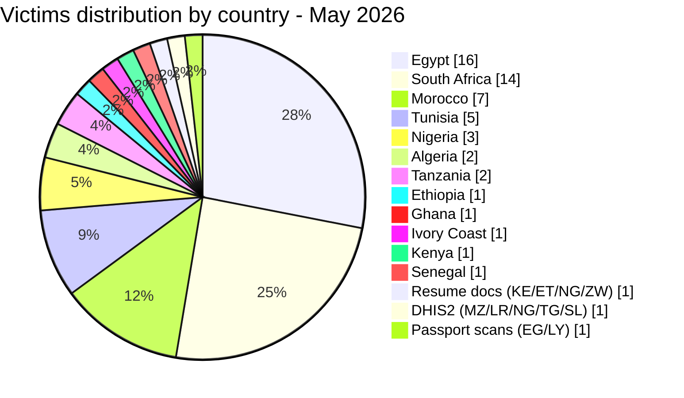
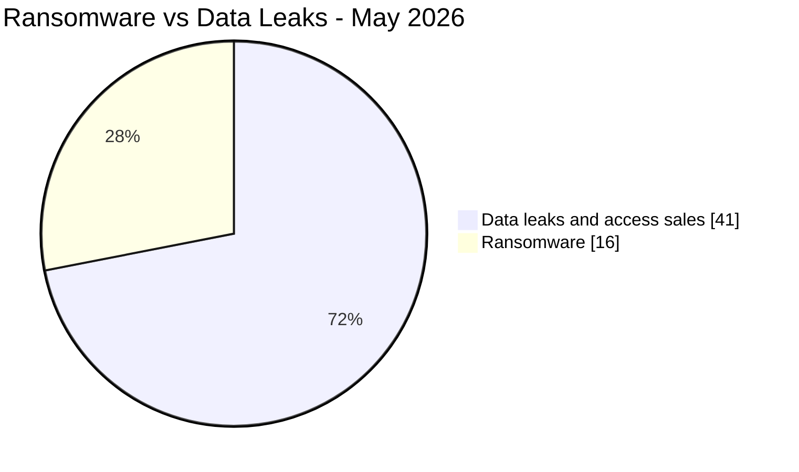
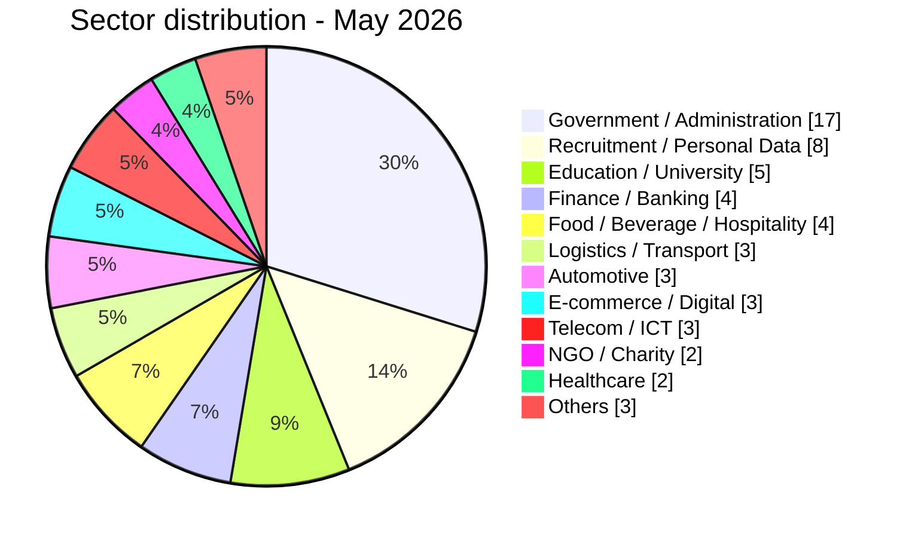
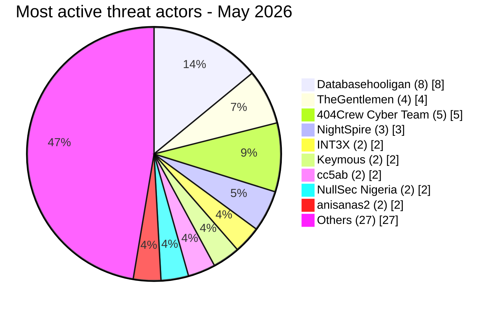

# CTI report - cyberattacks in Africa (May 2026)

👉🏾 [**French version available here**](./README_FR.md)

## 1. Executive summary

May 2026 recorded **57 publicly claimed cyber incidents** across Africa: **16 ransomware attacks** and **41 data leaks / access sales**. The month was marked by a sustained assault on the Egyptian education sector, a coordinated campaign against South African public institutions (OpSouthAfrica), the dominance of the **Databasehooligan** data broker across four countries, and three NightSpire ransomware hits against Egyptian targets in a single month.

Key findings:
- **16 ransomware attacks (28.1%)** and **41 data leaks / access sales (71.9%)**.
- **12 countries** affected, plus 3 multi-country incidents; **Egypt** (16 incidents), **South Africa** (14), **Morocco** (7), and **Tunisia** (5) account for 73.7% of victims.
- **TheGentlemen** ransomware group hit four countries in one month (Egypt, Tunisia, Ghana, Ivory Coast); **NightSpire** claimed three Egyptian targets.
- **Databasehooligan** dominated data broker activity with 8 victims across Tunisia, South Africa, Egypt, and Algeria.
- Egyptian education sector under systemic attack: Ministry of Education (26.8M student records), Professional Academy for Teachers (1.2M teacher records), Mansoura University (989K records), and a joint Educational & HR database (37 GB).
- Tanzania Police webmail leaked: 10,000+ officer accounts with plaintext passwords offered for sale.
- Trésor Public du Sénégal (national treasury): AuditTeam ransomware with confirmed data exfiltration (~1.66M records across three Oracle databases plus 18 months of SICA payroll files).

### Victim list

👉🏾 [View full victim list](./victims.md)

---

## 2. Methodology

- **Scope**: 54 African countries.
- **Period**: 1-31 May 2026 (incidents disclosed or claimed during this month; actual attack dates may be earlier).
- **Sources**: Dark web, DLS (leak sites), OSINT, Telegram channels, underground forums.
- **Inclusion**: Publicly claimed or attributed incidents with identified victim, country, and sector.
- **Typology**:
  - *Ransomware*: encryption + ransom demand.
  - *Data leak / access sale*: exfiltration without encryption, database sold/published, or access sale to compromised systems.

> All claims from cybercriminal forums, leak sites, and underground channels are treated as **unverified claims** unless independently corroborated.

---

## 3. Global overview

| Indicator | Value |
|---|---|
| Total victims | 57 |
| Countries affected | 18 (12 direct + 6 via multi-country incidents) |
| Distinct actors | 25+ |
| Ransomware incidents | 16 (28.1%) |
| Data leaks / access sales | 41 (71.9%) |

### Country ranking

**All incidents combined (57):**

| Rank | Country | Incidents | Chart |
| :---: | :--- | :---: | :--- |
| **1** | 🇪🇬 Egypt | **16** | ████████████████ |
| **2** | 🇿🇦 South Africa | **14** | ██████████████ |
| **3** | 🇲🇦 Morocco | **7** | ███████ |
| **4** | 🇹🇳 Tunisia | **5** | █████ |
| **5** | 🇳🇬 Nigeria | **3** | ███ |
| **6** | 🇩🇿 Algeria | **2** | ██ |
| **7** | 🇹🇿 Tanzania | **2** | ██ |
| **8** | 🇪🇹 Ethiopia | **1** | █ |
| **9** | 🇬🇭 Ghana | **1** | █ |
| **10** | 🇨🇮 Ivory Coast | **1** | █ |
| **11** | 🇰🇪 Kenya | **1** | █ |
| **12** | 🇸🇳 Senegal | **1** | █ |
| **–** | 🇰🇪 Kenya / 🇪🇹 Ethiopia / 🇳🇬 Nigeria / 🇿🇼 Zimbabwe (Resume docs) | **1** | █ |
| **–** | 🇲🇿 Mozambique / 🇱🇷 Liberia / 🇳🇬 Nigeria / 🇹🇬 Togo / 🇸🇱 Sierra Leone (DHIS2) | **1** | █ |
| **–** | 🇪🇬 Egypt / 🇱🇾 Libya (Passport scans) | **1** | █ |

### Ransomware distribution (Total: 16)

| Rank | Country | Incidents | Chart |
| :---: | :--- | :---: | :--- |
| **1** | 🇪🇬 Egypt | **7** | ███████ |
| **2** | 🇳🇬 Nigeria | **3** | ███ |
| **3** | 🇹🇳 Tunisia | **2** | ██ |
| **4** | 🇿🇦 South Africa | **1** | █ |
| **5** | 🇬🇭 Ghana | **1** | █ |
| **6** | 🇸🇳 Senegal | **1** | █ |
| **7** | 🇨🇮 Ivory Coast | **1** | █ |

### Data leaks / access sales distribution (Total: 41)

| Rank | Country | Incidents | Chart |
| :---: | :--- | :---: | :--- |
| **1** | 🇿🇦 South Africa | **13** | █████████████ |
| **2** | 🇪🇬 Egypt | **9** | █████████ |
| **3** | 🇲🇦 Morocco | **7** | ███████ |
| **4** | 🇹🇳 Tunisia | **3** | ███ |
| **5** | 🇩🇿 Algeria | **2** | ██ |
| **6** | 🇹🇿 Tanzania | **2** | ██ |
| **7** | 🇪🇹 Ethiopia | **1** | █ |
| **8** | 🇰🇪 Kenya | **1** | █ |
| **–** | 🇰🇪🇪🇹🇳🇬🇿🇼 Resume docs | **1** | █ |
| **–** | 🇲🇿🇱🇷🇳🇬🇹🇬🇸🇱 DHIS2 | **1** | █ |
| **–** | 🇪🇬🇱🇾 Passport scans | **1** | █ |

### Ransomware vs. data leaks comparison by country

| Country | Ransomware | Data Leaks | Side-by-side distribution |
| :--- | :---: | :---: | :--- |
| 🇪🇬 Egypt | **7** | **9** | 🟧🟧🟧🟧🟧🟧🟧 🟦🟦🟦🟦🟦🟦🟦🟦🟦 |
| 🇿🇦 South Africa | **1** | **13** | 🟧 🟦🟦🟦🟦🟦🟦🟦🟦🟦🟦🟦🟦🟦 |
| 🇲🇦 Morocco | **0** | **7** | 🟦🟦🟦🟦🟦🟦🟦 |
| 🇹🇳 Tunisia | **2** | **3** | 🟧🟧 🟦🟦🟦 |
| 🇳🇬 Nigeria | **3** | **0** | 🟧🟧🟧 |
| 🇩🇿 Algeria | **0** | **2** | 🟦🟦 |
| 🇹🇿 Tanzania | **0** | **2** | 🟦🟦 |
| 🇪🇹 Ethiopia | **0** | **1** | 🟦 |
| 🇬🇭 Ghana | **1** | **0** | 🟧 |
| 🇨🇮 Ivory Coast | **1** | **0** | 🟧 |
| 🇰🇪 Kenya | **0** | **1** | 🟦 |
| 🇸🇳 Senegal | **1** | **0** | 🟧 |
| 🇰🇪🇪🇹🇳🇬🇿🇼 Resume docs | **0** | **1** | 🟦 |
| 🇲🇿🇱🇷🇳🇬🇹🇬🇸🇱 DHIS2 | **0** | **1** | 🟦 |
| 🇪🇬🇱🇾 Passport scans | **0** | **1** | 🟦 |
| **Total (57)** | **16** | **41** | *Legend: 🟧 Ransomware \| 🟦 Data Leaks* |

### Geographic breakdown by region

| Region | Total incidents | Ransomware | Leaks | Side-by-side |
| :--- | :---: | :---: | :---: | :--- |
| **North Africa** | **30** (52.6%) | 9 | 21 | 🟧🟧🟧🟧🟧🟧🟧🟧🟧 🟦🟦🟦🟦🟦🟦🟦🟦🟦🟦🟦🟦🟦🟦🟦🟦🟦🟦🟦🟦🟦 |
| **Southern Africa** | **14** (24.6%) | 1 | 13 | 🟧 🟦🟦🟦🟦🟦🟦🟦🟦🟦🟦🟦🟦🟦 |
| **West Africa** | **6** (10.5%) | 6 | 0 | 🟧🟧🟧🟧🟧🟧 |
| **East Africa** | **4** (7.0%) | 0 | 4 | 🟦🟦🟦🟦 |
| 🇰🇪🇪🇹🇳🇬🇿🇼🇲🇿🇱🇷🇹🇬🇸🇱🇱🇾 Multi-country (3 incidents) | **3** (5.3%) | 0 | 3 | 🟦🟦🟦 |

*Legend: 🟧 Ransomware | 🟦 Data Leaks*

### Sector distribution

| Activity sector | Incidents | Share (%) | Chart |
| :--- | :---: | :---: | :--- |
| **Government / Administration** | **17** | 29.8% | █████████████████ |
| **Recruitment / Personal Data** | **8** | 14.0% | ████████ |
| **Education / University** | **5** | 8.8% | █████ |
| **Finance / Banking** | **4** | 7.0% | ████ |
| **Food / Beverage / Hospitality** | **4** | 7.0% | ████ |
| **Logistics / Transport** | **3** | 5.3% | ███ |
| **Automotive** | **3** | 5.3% | ███ |
| **E-commerce / Digital** | **3** | 5.3% | ███ |
| **Telecom / ICT** | **3** | 5.3% | ███ |
| **NGO / Charity** | **2** | 3.5% | ██ |
| **Healthcare** | **2** | 3.5% | ██ |
| **Others** | **3** | 5.3% | ███ |
| **Total** | **57** | **100%** | |

### Most prolific threat actors and groups

| Threat actor / Group | Incidents | Primary activity | Chart |
| :--- | :---: | :--- | :--- |
| **Databasehooligan** | **8** | Data leaks / sales | 🟦🟦🟦🟦🟦🟦🟦🟦 |
| **TheGentlemen** | **4** | Ransomware | 🟧🟧🟧🟧 |
| **404Crew Cyber Team** | **5** | Data leaks (coalitions) | 🟦🟦🟦🟦🟦 |
| **NightSpire** | **3** | Ransomware | 🟧🟧🟧 |
| **INT3X** | **2** | Data leaks | 🟦🟦 |
| **Keymous** | **2** | Data leaks / access sales | 🟦🟦 |
| **cc5ab** | **2** | Data leaks | 🟦🟦 |
| **NullSec Nigeria** | **2** | Data leaks (coalitions) | 🟦🟦 |
| **anisanas2** | **2** | Data leaks / data sales (Morocco) | 🟦🟦 |

*Legend: 🟧 Ransomware \| 🟦 Data Leaks*

---

## 4. Country Breakdown - Concise summary (with key dates)

> **For full details on each incident (data volumes, sample analysis, actor tactics, etc.), please refer to the complete victim list:** [`victims.md`](./victims.md)

---

### 🇪🇬 Egypt (16 incidents: 7 ransomware, 9 leaks)

**Ransomware (7):**
- **The ransomware group NightSpire** (3 targets, May 24‑26): Papa John's Egypt, Rawaj Consumer Finance, B Investments Holding
- **The ransomware group TheGentlemen** (May 9): Misr Chemical Industries
- **The ransomware group Lamashtu** (May 4): Luna Group (agri‑food)
- **The ransomware group LockBit 5.0** (May 7): Rhactus Hotel
- **The ransomware group Qilin** (May 8): Imex International (logistics)

**Education sector leaks (4):**
- **The threat actor Revesky** (May 13 – Ministry of Education): 26.8M students + 3.8M teachers
- **The threat actor INT3X** (May 10 – Mansoura University): 989,000 students (2012‑2026)
- **The threat actor INT3X** (May 16 – Professional Academy for Teachers): 1.2M teachers
- **The threat actor bigF** (May 4): 37 GB (Mansoura + Galala), 1.5M students

**Other leaks (5):**
- **The threat actor CrowStealer** (May 2 – Ministry of Manpower): 34,528 workers/expatriates
- **The threat actor cc5ab** (May 12 – FutureShop): exposed API – 3,893 customers, 5,181 orders, S3 bucket
- **The threat actor DR‑X‑LOL** (May 15 – Baitzakat.org.eg): 300,000 citizens (national ID numbers)
- **The cybercriminal Databasehooligan** (May 24 – Wuzzuf.net): 672,000 job seekers (ID documents, videos) → $1,100
- **The threat actor Keymous** (May 28 – Citex Systems): employee and project data

---

### 🇿🇦 South Africa (14 incidents: 1 ransomware, 13 leaks)

**Ransomware (1):**
- **The ransomware group PrinzEugen** (May 4 – Standard Bank Group) – unverified claim

**"OpSouthAfrica" Campaign (8) – coalition of 404Crew Cyber Team, NullSec Nigeria, NullSec Philippines & Infernalis (May 15‑24):**
- **Ephraim Mogale Municipality** (May 15): 111 GB administrative documents
- **Bellavista School** (May 15): student/parent data
- **Department of Correctional Services** (May 16): internal documents
- **CERVI My Private Care** (May 24): banking details + BHF provider numbers
- **mevent.** (May 24): contact data of nurses
- **Sheriff Randburg West** (May 24): citizen data
- **SITA** (May 23): exposed credentials
- **SARS** (May 23): email/password pairs (origin uncertain, third‑party data)

**Sales by the cybercriminal Databasehooligan (May 27):**
- **Telkom**: 742,000 customers (ID numbers, billing, tickets) → $900
- **Wanderers Club**: 674,000 members (sports memberships) → $1,400
- **MIDAS**: 463,000 customers/logistics (VAT numbers) → $1,100

**Other leaks (2):**
- **The threat actor Stormous** (May 5 – CGCSA): 20 GB, Sage 200 Evolution (finances, inventories)
- **The threat actor Kazu** (May 17 – Stats SA): 154 GB, 453,000 files (ID cards, census)

---

### 🇲🇦 Morocco (7 leaks)

- **The threat actor Sejjil** (May 12 – SDTM/Barid Al‑Maghrib): 129 CSV files from SAGE ERP, MD5 hashes, RIB numbers, national IDs
- **The threat actor superstarkmc** (May 17 – Government platforms): 827,000 credentials (Massar, Moutamadris, Waliye, Tax.gov, TGR)
- **The threat actor JBT2026** (May 20 – Watiqa.ma): 695,400 civil registry records
- **The threat actor fexus** (May 21 – Avito.ma): emails, phones, plaintext passwords
- **The threat actor DarkMafiaX** (May 22 – Spacex.ma): disclosed admin credentials
- **The threat actor anisanas2** (May 22 – RADEM Meknès): ~1.1 million documents exfiltrated (customer data: names, addresses, contract numbers; operational data: distribution routes, branch offices); critical exposure of a public regional utility managing water and electricity infrastructure
- **The threat actors anisanas2 / PKA291** (May 31 – Massive Moroccan database sale): over 12 million lines and documents covering Ministry of Justice (2M docs, 150,000 court files, $3,000), NARSA (2M lines, $800), OFPPT (400,000 lines), delivery companies (8M lines) and an insurance company (initial access); global bundle priced at $5,500

---

### 🇹🇳 Tunisia (5 incidents: 2 ransomware, 3 leaks)

**Ransomware (2):**
- **The ransomware group TheGentlemen** (May 12 – SETCAR): automotive parts manufacturer
- **The ransomware group Titan** (May 18 – CRIT Tunisie): HR / staffing services

**Leaks (3) – the cybercriminal Databasehooligan (May 27‑31):**
- **Keejob** (May 27): 137,000 records → $1,400
- **MyTelnet** (May 27): subscriber CRM profiles
- **OptionCarriere.tn** (May 31): 274,000 records (candidates, employers) → $1,300

---

### 🇳🇬 Nigeria (3 ransomware)

- **The ransomware group MedusaLocker** (May 5 – ActionAid/TACOSA): humanitarian NGO
- **The ransomware group KillSec** (May 9 – MRS Holdings): energy conglomerate
- **The ransomware group 0day Syndicate** (May 28 – XL Africa Group): B2B services

Multi‑country also involved: **The threat actor attackercompany** (Resume docs) and **the threat actor Keymous** (DHIS2).

---

### 🇩🇿 Algeria (2 leaks)

- **The threat actor kamalsheikhxx** (May 4 – Ministry of Pharmaceutical Industry): 34.3 GB, 52,000 files (2019‑2025)
- **The cybercriminal Databasehooligan** (May 19 – OGEBC cultural heritage): 425,000 records → $900

---

### 🇹🇿 Tanzania (2 leaks)

- **The cybercriminal XOverStm** (May 3 – Citizen database): 120,000 records (names, addresses, phones) → $350
- **The cybercriminal Kampuchean** (May 22 – Police webmail): 10,000 officer accounts, plaintext passwords → $550

---

### 🇪🇹 Ethiopia (1 leak)

- **The threat actor 404Crew Cyber Team** (May 15 – NGO Registration Database): 3,668 civil society organization records from Ethiopia's NGO registration and auditing agency, including names, registration metadata, certificate numbers, categories, addresses, and contact emails.

---

### 🇸🇳 Senegal (1 ransomware - CRITICAL)

- **The ransomware group AuditTeam** (May 17‑18 – Public Treasury): ~1,659,735 records exfiltrated
  - **Server 10.6.0.61** (Oracle): dumps of `COLLOC.REDEVABLES` (960,146 taxpayers with NINEA), `GFORD.ORD_MANDATS` (659,195 payment orders with bank details), `COLLOC.CO_PERSONNELS` (40,394 employees with salaries)
  - **Server 10.6.0.26** (SICA): 18 months of payroll and transfer files
  - Persistent access confirmed ~9 days before public claim

---

### 🇬🇭 Ghana (1 ransomware)

- **The ransomware group TheGentlemen** (May 6 – Kasapreko): beverage manufacturer

---

### 🇨🇮 Ivory Coast (1 ransomware)

- **The ransomware group TheGentlemen** (May 28 – Mayelia Automotive): vehicle inspection services

---

### 🇰🇪 Kenya (1 leak)

- **The threat actor cc5ab** (May 16 – Land Surveyors Board): 175 licensed surveyors, 730 assistants (national IDs), full API docs, Django admin panel, PostgreSQL config, JWT params

---

### Multi-country incidents (3)

| Incident | Actor | Date | Countries affected |
|----------|-------|------|-------------------|
| Resume docs | **The threat actor attackercompany** | May 5 | 🇰🇪🇪🇹🇳🇬🇿🇼 (Kenya, Ethiopia, Nigeria, Zimbabwe) |
| DHIS2 / Ministries of Health | **The threat actor Keymous** | May 13 | 🇲🇿🇱🇷🇳🇬🇹🇬🇸🇱 (Mozambique, Liberia, Nigeria, Togo, Sierra Leone) |
| Passport scans | **The threat actor raylie** | May 18 | 🇪🇬🇱🇾 (Egypt, Libya) |

---

**Global summary (57 incidents, 18 countries):** Egypt (16) and South Africa (14) account for 52.6% of all incidents. The Egyptian education sector alone exposed over 28 million records. The most critical incidents are the Senegal Public Treasury breach (~1.66M records) and the Tanzanian police webmail sale (10,000 plaintext officer accounts). **The cybercriminal Databasehooligan** dominates data brokerage with 8 structured sales across four countries.

> **For complete technical details, sample analysis, and full victim descriptions, see:** [`victims.md`](./victims.md)

---

## 5. Detailed analysis by incident type

### 5.1 Ransomware (16 incidents)

| Rank | Country | Attacks | Main threat actors |
| :---: | :--- | :---: | :--- |
| **1** | 🇪🇬 Egypt | **7** | NightSpire (3), TheGentlemen, Qilin, LockBit 5.0, Lamashtu |
| **2** | 🇳🇬 Nigeria | **3** | MedusaLocker, KillSec, 0day Syndicate |
| **3** | 🇹🇳 Tunisia | **2** | TheGentlemen, Titan |
| **4** | 🇿🇦 South Africa | **1** | PrinzEugen |
| **5** | 🇬🇭 Ghana | **1** | TheGentlemen |
| **6** | 🇸🇳 Senegal | **1** | AuditTeam |
| **7** | 🇨🇮 Ivory Coast | **1** | TheGentlemen |

**Observations:** **NightSpire** claimed three Egyptian targets in the same month (Papa John's, Rawaj Consumer Finance, B Investments), establishing itself as the leading ransomware group on the continent for May. **TheGentlemen** demonstrated notable geographic reach, hitting four countries in a single month. The attack on the **Trésor Public du Sénégal** represents the highest-impact government ransomware incident of the month. Technical analysis confirms double-extortion: data was exfiltrated from two internal servers (Oracle DB + SICA payroll system) approximately 9 days before the ransomware was deployed, yielding approximately 1,659,735 records including a national taxpayer registry (~960K), a payroll register (~40K), and a full public payment order database (~659K) containing NINEA identifiers and beneficiary banking coordinates.

### 5.2 Data leaks & access sales (41 incidents)

| Rank | Country | Incidents | Main actors |
| :---: | :--- | :---: | :--- |
| **1** | 🇿🇦 South Africa | **13** | Databasehooligan, 404Crew CT, NullSec Nigeria, Kazu, cc5ab |
| **2** | 🇪🇬 Egypt | **9** | INT3X, Revesky, cc5ab, DR-X-LOL, CrowStealer, bigF, Keymous, Databasehooligan |
| **3** | 🇲🇦 Morocco | **7** | Sejjil, superstarkmc, JBT2026, fexus, DarkMafiaX, anisanas2, PKA291 |
| **4** | 🇹🇳 Tunisia | **3** | Databasehooligan (3) |
| **5** | 🇩🇿 Algeria | **2** | kamalsheikhxx, Databasehooligan |
| **6** | 🇹🇿 Tanzania | **2** | XOverStm, Kampuchean |
| **7** | 🇪🇹 Ethiopia | **1** | 404Crew Cyber Team |
| **–** | 🇰🇪🇪🇹🇳🇬🇿🇼 Resume docs | **1** | attackercompany |
| **–** | 🇲🇿🇱🇷🇳🇬🇹🇬🇸🇱 DHIS2 | **1** | Keymous |
| **–** | 🇪🇬🇱🇾 Passport scans | **1** | raylie |

**Key observations:**
- **Databasehooligan** targeted CRM-structured databases across four countries, selling between $900 and $1,400 per dataset, with victims including Telkom SA (742K records), Wanderers Club SA (674K), Wuzzuf.net Egypt (672K), MyTelnet Tunisia, OptionCarriere.tn, Keejob, MIDAS SA, and OGEBC Algeria.
- The **404Crew Cyber Team** coalition (with NullSec Nigeria, NullSec Philippines, and Infernalis) ran a sustained campaign against South African institutions under the "OpSouthAfrica" banner, targeting Ephraim Mogale Municipality, DCS, Bellavista School, SITA, SARS, mevent., CERVI, and Sheriff Randburg West. The same actor also advertised Ethiopia's NGO Registration Database for sale.
- Egypt's **education sector** faced a systemic breach wave: the Ministry of Education (26.8M student records), Professional Academy for Teachers (1.2M teacher records), Mansoura University (989K students), and a combined Educational & HR database (37 GB).
- **Tanzania Police** webmail was put up for sale with 10,000+ officer accounts and plaintext passwords, posing critical law enforcement exposure.

---

## 6. Sectoral impact

| Activity sector | Incidents | Share (%) | Visual impact |
| :--- | :---: | :---: | :--- |
| **Government / Administration** | **17** | 29.8% | █████████████████ |
| **Recruitment / Personal Data** | **8** | 14.0% | ████████ |
| **Education / University** | **5** | 8.8% | █████ |
| **Finance / Banking** | **4** | 7.0% | ████ |
| **Food / Beverage / Hospitality** | **4** | 7.0% | ████ |
| **Logistics / Transport** | **3** | 5.3% | ███ |
| **Automotive** | **3** | 5.3% | ███ |
| **E-commerce / Digital** | **3** | 5.3% | ███ |
| **Telecom / ICT** | **3** | 5.3% | ███ |
| **NGO / Charity** | **2** | 3.5% | ██ |
| **Healthcare** | **2** | 3.5% | ██ |
| **Others** | **3** | 5.3% | ███ |

**Key observations:**
- **Government dominance:** The public sector (Government + Education) accounts for 38.6% of all May incidents, confirming the persistent targeting of African state infrastructure.
- **Education under systemic assault:** Egypt's education sector alone contributed 4 of the 5 education incidents, with total exposure exceeding 28 million student and teacher records.
- **Recruitment / Personal Data surge:** Databasehooligan's focus on CRM-structured recruitment and consumer platforms (Keejob, MyTelnet, OptionCarriere.tn, Wuzzuf.net, MIDAS, Telkom, Wanderers Club) drove the second-largest sector.
- **Critical infrastructure targeted:** The Trésor Public du Sénégal confirms double-extortion with ~1.66M records exfiltrated (national taxpayer registry, payroll, payment orders with NINEA and banking data). The Tanzania Police webmail sale represents a parallel threat to law enforcement operational security.

---

## 7. Threat actor profile

| Threat actor | Type | Incidents | Primary targets |
| :--- | :--- | :---: | :--- |
| **Databasehooligan** | Data broker | **8** | CRM/recruitment databases (multi-country) |
| **TheGentlemen** | Ransomware | **4** | Industry, automotive, food (4 countries) |
| **404Crew Cyber Team** | Data leak (coalitions) | **5+** | South African public institutions, Ethiopian civil society registry |
| **NightSpire** | Ransomware | **3** | Egyptian finance and food services |
| **INT3X** | Data leak | **2** | Egyptian education institutions |
| **Keymous** | Access sale / data leak | **2** | Health systems, telecom (multi-country) |
| **cc5ab** | Data leak | **2** | Egyptian and Kenyan government |
| **NullSec Nigeria** | Data leak (coalitions) | **2+** | South African government agencies |
| **anisanas2** | Data leak | **2** | Moroccan infrastructure (RADEM, multi-entity bundle sale) |

**Emerging actors:**
- **PrinzEugen** (Standard Bank claim)
- **Lamashtu** (Luna Group Egypt)
- **Kampuchean** (Tanzania Police webmail)
- **JBT2026** (Watiqa.ma Morocco civil registry)
- **PKA291** (coordinated Moroccan database extraction campaign)

### 7.1 Risk assessment

| Country | Risk level |
|---|---|
| Egypt | 🔴 Critical |
| South Africa | 🔴 Critical |
| Morocco | 🟠 High |
| Tunisia | 🟠 High |
| Nigeria | 🟠 Medium-High |
| Algeria | 🟡 Medium |
| Tanzania | 🟠 Medium-High |
| Others | 🟡 Low-Medium |

---

## 8. Key trends

- **Education sector as strategic target:** The simultaneous breach of four Egyptian education entities exposing tens of millions of student and teacher records suggests either a coordinated campaign or opportunistic exploitation of shared infrastructure vulnerabilities.
- **"OpSouthAfrica" coalition campaign:** The 404Crew Cyber Team, NullSec Nigeria, and Infernalis targeted at least eight South African institutions in May, combining data leak publication with political messaging around xenophobia grievances.
- **Databasehooligan CRM sweep:** The same data broker sold structured CRM / consumer databases from eight organizations across Tunisia, South Africa, Egypt, and Algeria, suggesting systematic exploitation of a shared vulnerability or common platform.
- **NightSpire concentration on Egypt:** Three Egyptian targets in one month by a single ransomware group suggests a focused campaign against Egyptian business infrastructure, particularly in finance and consumer services.
- **Government email accounts as access vectors:** Moroccan government credential exposure (827K lines), Tanzanian police webmail sale, and multi-country EDR-fraud account offers signal a growing market for law enforcement impersonation.
- **Multi-country health system compromise:** The DHIS2 access sale affecting seven countries (Mozambique, Liberia, Nigeria, Bhutan, Honduras, Togo, Sierra Leone) represents a critical threat to public health data sovereignty.
- **Persistent targeting of Morocco:** Two large-scale incidents were recorded in the final ten days of May: the RADEM Meknès breach (1.1 million documents from a critical water and electricity utility) and a bundled sale of over 12 million lines and documents covering the Ministry of Justice, NARSA, OFPPT, and private companies. The anisanas2/PKA291 actor had already targeted Morocco in April 2026, confirming a sustained, coordinated campaign.

---

## 9. MITRE ATT&CK mapping (contextual)

| Phase | Technique ID | Technique name | Context |
| :--- | :---: | :--- | :--- |
| **Initial Access** | **T1190** | Exploit Public-Facing Application | FutureShop API, Mansoura University, LSB Kenya |
| **Initial Access** | **T1078** | Valid Accounts | Moroccan gov credentials, Tanzania Police, DHIS2 health platform credentials (URL/password pairs published) |
| **Collection** | **T1005** | Data from Local System | PAT Egypt, SDTM Morocco, SITA SA |
| **Collection** | **T1114.002** | Remote Email Collection | Tanzania Police webmail |
| **Exfiltration** | **T1041** | Exfiltration Over C2 Channel | Wuzzuf.net, Telkom, CGCSA |
| **Impact** | **T1486** | Data Encrypted for Impact | All ransomware incidents |
| **Privilege Escalation** | **T1078.003** | Local Accounts | DHIS2 admin credentials |

> Common cross-campaign techniques:
> - **T1190** – Exploit Public-Facing Application (primary entry vector for data leaks)
> - **T1078** – Valid Accounts (credential theft, IAB listings, infostealer logs)
> - **T1486** – Data Encrypted for Impact (ransomware deployment)
> - **T1041** – Exfiltration Over C2 Channel (bulk database extraction)

---

## 10. Recommendations

- **Governments:** Enforce MFA on all administrative and educational portals; audit credential exposure on underground forums; treat the Moroccan gov credential leak as a systemic identity risk requiring immediate password resets across all affected platforms.
- **Educational institutions:** Isolate student and staff databases from public-facing web infrastructure; encrypt sensitive data at rest; implement audit logging on administrative platforms.
- **Financial sector:** Monitor ransomware DLS for pre-publication indicators; maintain offline backups; review third-party data flows for CRM and e-payment platforms.
- **Law enforcement:** Treat the Tanzania Police webmail compromise as an active operational security risk; rotate all affected credentials; implement DMARC/DKIM on government email domains.
- **Healthcare:** Audit DHIS2 administrative accounts immediately; rotate credentials; restrict admin panel access to internal networks only.

---

## 11. SOC tactical recommendations

- **[T1078] Credential monitoring:** Correlate dark web leak data against internal user directories; flag accounts exposed in Moroccan gov, Tanzania Police, and Stats SA claims.
- **[T1190] API exposure:** Implement authenticated access controls on all public-facing APIs; scan for unauthenticated S3 buckets and exposed admin panels.
- **[T1486] Ransomware detection:** Monitor for unusual volume encryption activity, shadow copy deletion (vssadmin), and lateral movement via SMB/RDP from new admin accounts.
- **[Data broker activity]:** Establish a threat intelligence feed tracking Databasehooligan, 404Crew, and NightSpire for early warning of new African targets.

---

## 12. Conclusion

May 2026 confirmed the continued maturation of threat actor activity targeting Africa, with both volume (57 incidents) and severity (millions of records, critical infrastructure ransomware) remaining high. Egypt and South Africa jointly absorbed 52.6% of recorded incidents. The systematic exposure of education records in Egypt and the sustained OpSouthAfrica coalition campaign represent the defining threat patterns of the month. The rise of Databasehooligan as a dominant data broker and NightSpire as an emerging ransomware group signals the ongoing evolution of the criminal ecosystem.

**AFRINTEL** – African Cyber Threat Intelligence
🔗 [GitHub AFRINTEL Repository](https://github.com/Hatchepsoute/AFRINTEL)
