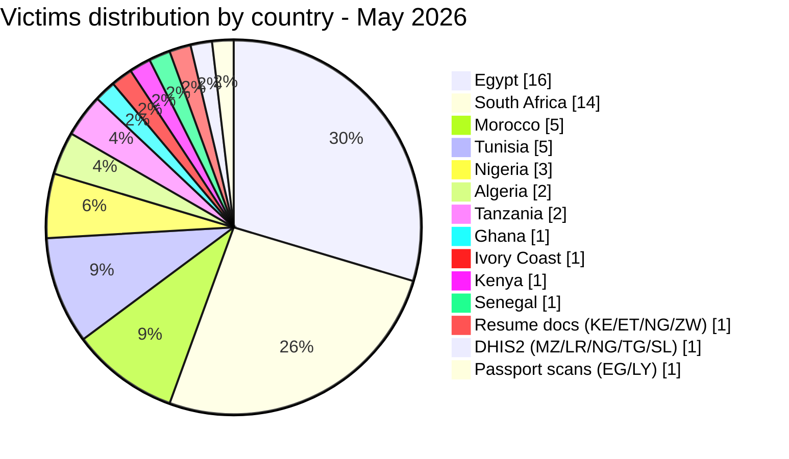
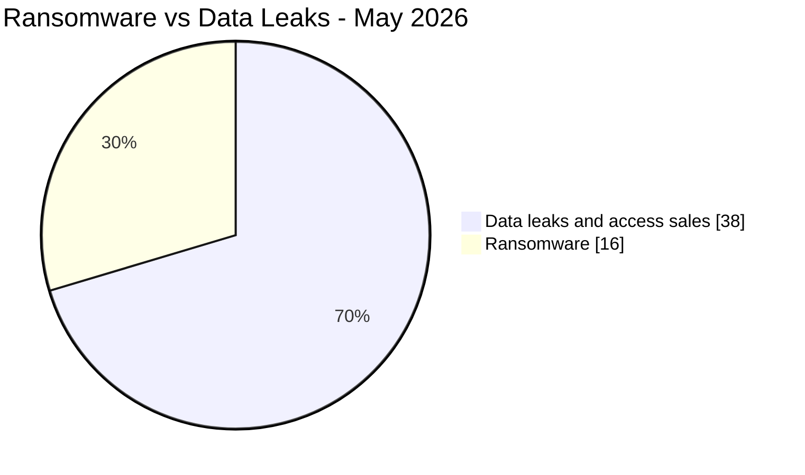
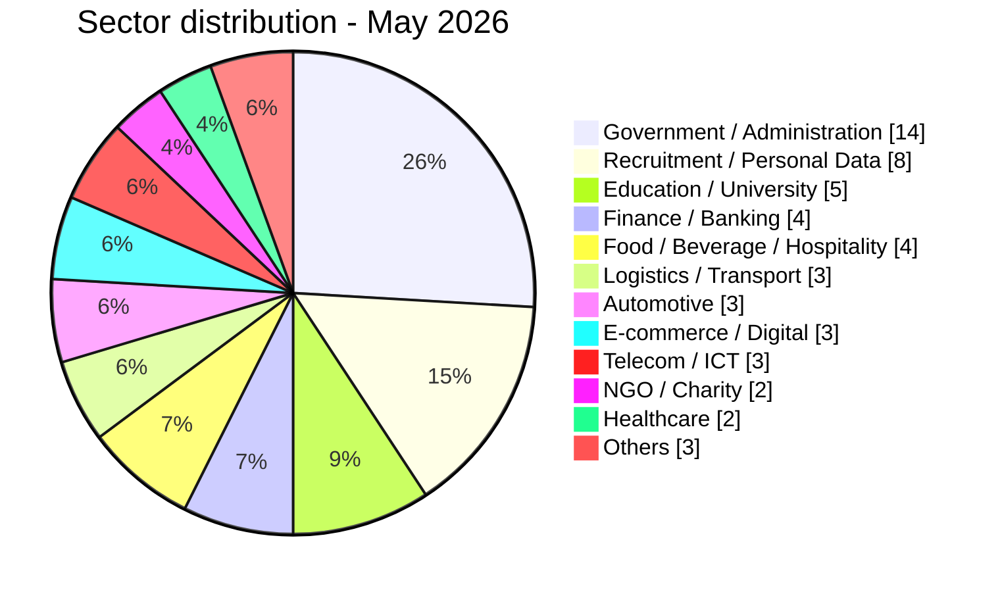
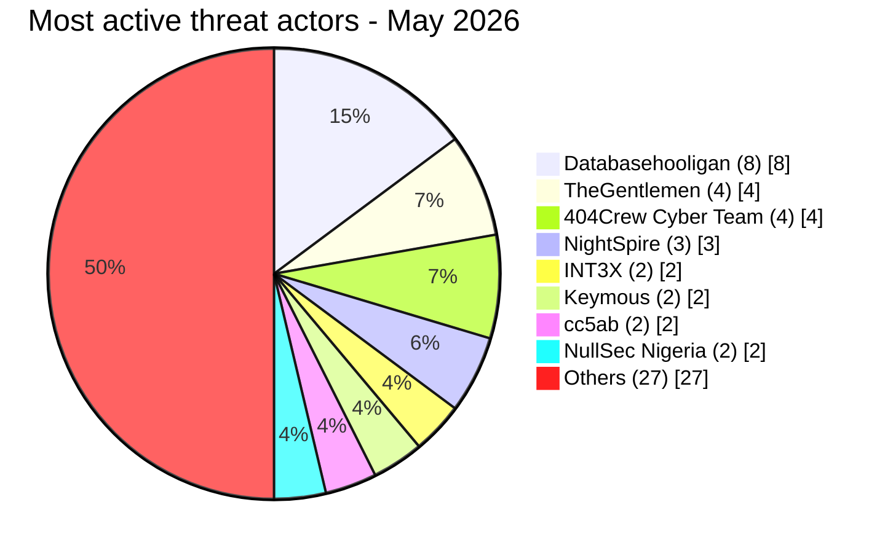

# CTI report - cyberattacks in Africa (May 2026)

👉🏾 [**French version available here**](./README_FR.md)

## 1. Executive summary

May 2026 recorded **54 publicly claimed cyber incidents** across Africa: **16 ransomware attacks** and **38 data leaks / access sales**. The month was marked by a sustained assault on the Egyptian education sector, a coordinated campaign against South African public institutions (OpSouthAfrica), the dominance of the **Databasehooligan** data broker across four countries, and three NightSpire ransomware hits against Egyptian targets in a single month.

Key findings:
- **16 ransomware attacks (29.6%)** and **38 data leaks / access sales (70.4%)**.
- **11 countries** affected, plus 3 multi-country incidents; **Egypt** (16 incidents), **South Africa** (14), **Morocco** (5), and **Tunisia** (5) account for 74% of victims.
- **TheGentlemen** ransomware group hit four countries in one month (Egypt, Tunisia, Ghana, Ivory Coast); **NightSpire** claimed three Egyptian targets.
- **Databasehooligan** dominated data broker activity with 8 victims across Tunisia, South Africa, Egypt, and Algeria.
- Egyptian education sector under systemic attack: Ministry of Education (26.8M student records), Professional Academy for Teachers (1.2M teacher records), Mansoura University (989K records), and a joint Educational & HR database (37 GB).
- Tanzania Police webmail leaked: 10,000+ officer accounts with plaintext passwords offered for sale.
- Trésor Public du Sénégal (national treasury): AuditTeam ransomware with confirmed data exfiltration (~1.66M records across three Oracle databases plus 18 months of SICA payroll files).

### Victim list

👉🏾 [View full victim list](./victims.md)

---

## 2. Methodology

- **Scope**: 54 African countries.
- **Period**: 1-31 May 2026 (incidents disclosed or claimed during this month; actual attack dates may be earlier).
- **Sources**: Dark web, DLS (leak sites), OSINT, Telegram channels, underground forums.
- **Inclusion**: Publicly claimed or attributed incidents with identified victim, country, and sector.
- **Typology**:
  - *Ransomware*: encryption + ransom demand.
  - *Data leak / access sale*: exfiltration without encryption, database sold/published, or access sale to compromised systems.

> All claims from cybercriminal forums, leak sites, and underground channels are treated as **unverified claims** unless independently corroborated.

---

## 3. Global overview

| Indicator | Value |
|---|---|
| Total victims | 54 |
| Countries affected | 18 (11 direct + 7 via multi-country incidents) |
| Distinct actors | 25+ |
| Ransomware incidents | 16 (29.6%) |
| Data leaks / access sales | 38 (70.4%) |

### Country ranking

**All incidents combined (54):**

| Rank | Country | Incidents | Chart |
| :---: | :--- | :---: | :--- |
| **1** | 🇪🇬 Egypt | **16** | ████████████████ |
| **2** | 🇿🇦 South Africa | **14** | ██████████████ |
| **3** | 🇲🇦 Morocco | **5** | █████ |
| **4** | 🇹🇳 Tunisia | **5** | █████ |
| **5** | 🇳🇬 Nigeria | **3** | ███ |
| **6** | 🇩🇿 Algeria | **2** | ██ |
| **7** | 🇹🇿 Tanzania | **2** | ██ |
| **8** | 🇬🇭 Ghana | **1** | █ |
| **9** | 🇨🇮 Ivory Coast | **1** | █ |
| **10** | 🇰🇪 Kenya | **1** | █ |
| **11** | 🇸🇳 Senegal | **1** | █ |
| **–** | 🇰🇪 Kenya / 🇪🇹 Ethiopia / 🇳🇬 Nigeria / 🇿🇼 Zimbabwe (Resume docs) | **1** | █ |
| **–** | 🇲🇿 Mozambique / 🇱🇷 Liberia / 🇳🇬 Nigeria / 🇹🇬 Togo / 🇸🇱 Sierra Leone (DHIS2) | **1** | █ |
| **–** | 🇪🇬 Egypt / 🇱🇾 Libya (Passport scans) | **1** | █ |

### Ransomware distribution (Total: 16)

| Rank | Country | Incidents | Chart |
| :---: | :--- | :---: | :--- |
| **1** | 🇪🇬 Egypt | **7** | ███████ |
| **2** | 🇳🇬 Nigeria | **3** | ███ |
| **3** | 🇹🇳 Tunisia | **2** | ██ |
| **4** | 🇿🇦 South Africa | **1** | █ |
| **5** | 🇬🇭 Ghana | **1** | █ |
| **6** | 🇸🇳 Senegal | **1** | █ |
| **7** | 🇨🇮 Ivory Coast | **1** | █ |

### Data leaks / access sales distribution (Total: 38)

| Rank | Country | Incidents | Chart |
| :---: | :--- | :---: | :--- |
| **1** | 🇿🇦 South Africa | **13** | █████████████ |
| **2** | 🇪🇬 Egypt | **9** | █████████ |
| **3** | 🇲🇦 Morocco | **5** | █████ |
| **4** | 🇹🇳 Tunisia | **3** | ███ |
| **5** | 🇩🇿 Algeria | **2** | ██ |
| **6** | 🇹🇿 Tanzania | **2** | ██ |
| **7** | 🇰🇪 Kenya | **1** | █ |
| **–** | 🇰🇪🇪🇹🇳🇬🇿🇼 Resume docs | **1** | █ |
| **–** | 🇲🇿🇱🇷🇳🇬🇹🇬🇸🇱 DHIS2 | **1** | █ |
| **–** | 🇪🇬🇱🇾 Passport scans | **1** | █ |

### Ransomware vs. data leaks comparison by country

| Country | Ransomware | Data Leaks | Side-by-side distribution |
| :--- | :---: | :---: | :--- |
| 🇪🇬 Egypt | **7** | **9** | 🟧🟧🟧🟧🟧🟧🟧 🟦🟦🟦🟦🟦🟦🟦🟦🟦 |
| 🇿🇦 South Africa | **1** | **13** | 🟧 🟦🟦🟦🟦🟦🟦🟦🟦🟦🟦🟦🟦🟦 |
| 🇲🇦 Morocco | **0** | **5** | 🟦🟦🟦🟦🟦 |
| 🇹🇳 Tunisia | **2** | **3** | 🟧🟧 🟦🟦🟦 |
| 🇳🇬 Nigeria | **3** | **0** | 🟧🟧🟧 |
| 🇩🇿 Algeria | **0** | **2** | 🟦🟦 |
| 🇹🇿 Tanzania | **0** | **2** | 🟦🟦 |
| 🇬🇭 Ghana | **1** | **0** | 🟧 |
| 🇨🇮 Ivory Coast | **1** | **0** | 🟧 |
| 🇰🇪 Kenya | **0** | **1** | 🟦 |
| 🇸🇳 Senegal | **1** | **0** | 🟧 |
| 🇰🇪🇪🇹🇳🇬🇿🇼 Resume docs | **0** | **1** | 🟦 |
| 🇲🇿🇱🇷🇳🇬🇹🇬🇸🇱 DHIS2 | **0** | **1** | 🟦 |
| 🇪🇬🇱🇾 Passport scans | **0** | **1** | 🟦 |
| **Total (54)** | **16** | **38** | *Legend: 🟧 Ransomware \| 🟦 Data Leaks* |

### Geographic breakdown by region

| Region | Total incidents | Ransomware | Leaks | Side-by-side |
| :--- | :---: | :---: | :---: | :--- |
| **North Africa** | **28** (51.9%) | 7 | 21 | 🟧🟧🟧🟧🟧🟧🟧 🟦🟦🟦🟦🟦🟦🟦🟦🟦🟦🟦🟦🟦🟦🟦🟦🟦🟦🟦🟦🟦 |
| **Southern Africa** | **15** (27.8%) | 1 | 14 | 🟧 🟦🟦🟦🟦🟦🟦🟦🟦🟦🟦🟦🟦🟦🟦 |
| **West Africa** | **5** (9.3%) | 4 | 1 | 🟧🟧🟧🟧 🟦 |
| **East Africa** | **3** (5.6%) | 0 | 3 | 🟦🟦🟦 |
| 🇰🇪🇪🇹🇳🇬🇿🇼🇲🇿🇱🇷🇹🇬🇸🇱🇱🇾 Multi-country (3 incidents) | **3** (5.6%) | 0 | 3 | 🟦🟦🟦 |

*Legend: 🟧 Ransomware | 🟦 Data Leaks*

### Sector distribution

| Activity sector | Incidents | Share (%) | Chart |
| :--- | :---: | :---: | :--- |
| **Government / Administration** | **14** | 25.9% | ██████████████ |
| **Recruitment / Personal Data** | **8** | 14.8% | ████████ |
| **Education / University** | **5** | 9.3% | █████ |
| **Finance / Banking** | **4** | 7.4% | ████ |
| **Food / Beverage / Hospitality** | **4** | 7.4% | ████ |
| **Logistics / Transport** | **3** | 5.6% | ███ |
| **Automotive** | **3** | 5.6% | ███ |
| **E-commerce / Digital** | **3** | 5.6% | ███ |
| **Telecom / ICT** | **3** | 5.6% | ███ |
| **NGO / Charity** | **2** | 3.7% | ██ |
| **Healthcare** | **2** | 3.7% | ██ |
| **Others** | **3** | 5.6% | ███ |
| **Total** | **54** | **100%** | |

### Most prolific threat actors and groups

| Threat actor / Group | Incidents | Primary activity | Chart |
| :--- | :---: | :--- | :--- |
| **Databasehooligan** | **8** | Data leaks / sales | 🟦🟦🟦🟦🟦🟦🟦🟦 |
| **TheGentlemen** | **4** | Ransomware | 🟧🟧🟧🟧 |
| **404Crew Cyber Team** | **4** | Data leaks (coalitions) | 🟦🟦🟦🟦 |
| **NightSpire** | **3** | Ransomware | 🟧🟧🟧 |
| **INT3X** | **2** | Data leaks | 🟦🟦 |
| **Keymous** | **2** | Data leaks / access sales | 🟦🟦 |
| **cc5ab** | **2** | Data leaks | 🟦🟦 |
| **NullSec Nigeria** | **2** | Data leaks (coalitions) | 🟦🟦 |

*Legend: 🟧 Ransomware \| 🟦 Data Leaks*

---

## 4. Country-by-country overview

> All items presented originate from incidents claimed on the dark web, on ransomware group websites, and underground forums.

### 🇪🇬 Egypt (16 incidents: 7 ransomware, 9 data leaks)

Egypt was the most targeted country in May 2026, accounting for 30% of all incidents. The education sector bore the brunt of the month's data exfiltration wave.

**Ransomware (7):** The threat actor NightSpire claimed three Egyptian victims in quick succession: Papa John's Egypt (May 24), Rawaj Consumer Finance (May 24), and B Investments Holding (May 26). The threat actor Lamashtu claimed Luna Group (May 4), a major Egyptian food processing and household care conglomerate. The threat actor LockBit 5.0 targeted Rhactus Hotel (May 7). The threat actor Qilin claimed Imex International, a logistics and freight forwarding firm (May 8). The threat actor TheGentlemen claimed Misr Chemical Industries (May 9), a major industrial manufacturer.

**Education data leaks (4):** The threat actor Revesky claimed the compromise of Egypt's Ministry of Education on May 13, asserting possession of approximately 26.8 million student records and 3.8 million teacher and administrator records, along with full administrative access to educational platform functions. The threat actor INT3X claimed two targets: Mansoura University (May 10, approximately 989,000 student records including national ID numbers spanning 2012-2026) and the Professional Academy for Teachers (May 16, approximately 1.2 million teacher records with teacher codes, job positions, and school affiliations). The threat actor bigF claimed a combined Educational and HR database (May 4), approximately 37 GB across institutions including Mansoura and Galala universities, with over 1.5 million student records and close to 60 million combined entries.

**Other data leaks (5):** The threat actor CrowStealer claimed a data leak from Egypt's Ministry of Manpower (May 2), exposing worker and expatriate records including national ID numbers and passport data. The threat actor cc5ab published an unauthenticated API exposure affecting FutureShop, an Egyptian e-commerce platform (May 12), disclosing 3,893 customer records, 5,181 orders, 2,438 delivery addresses with GPS coordinates, and 60 store profiles with commercial registration documents. The threat actor DR-X-LOL published a leak from Baitzakat.org.eg (May 15), claiming over 300,000 Egyptian citizen records including national ID numbers and government affiliation. The threat actor Databasehooligan offered the Wuzzuf.net recruitment database for sale (May 24), claiming approximately 672,000 records including identity document images and biometric verification videos. The threat actor Keymous claimed access to Citex Systems (May 28), an Egyptian telecommunications and ICT company, exposing employee records and internal project data.

**Multi-country:** Egypt was also among the countries affected by the passport scan leak published by the threat actor raylie (May 18), which exposed full passport document images across more than 20 countries.

---

### 🇿🇦 South Africa (14 incidents: 1 ransomware, 13 data leaks)

South Africa was the second most targeted country, with 13 out of 14 incidents being data leaks. Eight of those were part of the coordinated "OpSouthAfrica" campaign.

**OpSouthAfrica campaign (8 institutions):** A coalition comprising the threat actors 404Crew Cyber Team, NullSec Nigeria, NullSec Philippines, and Infernalis ran a sustained campaign targeting South African public institutions. The threat actors NullSec Nigeria, 404Crew Cyber Team, and Infernalis claimed Ephraim Mogale Local Municipality (May 15, Limpopo Province), asserting possession of approximately 111 GB of administrative documents and official correspondence. The same coalition claimed the Department of Correctional Services (May 16), publishing internal procurement documents and official communications from the National Commissioner. The threat actor 404Crew Cyber Team claimed Bellavista School (May 15), exposing student and parent registration records. On May 23, the threat actors NullSec Nigeria and NullSec Philippines claimed the State Information Technology Agency (SITA) and the South African Revenue Service (SARS), publishing credential samples; the SARS dataset primarily contained third-party email-password combinations, requiring additional validation to confirm a direct SARS compromise. On May 24, the threat actor 404Crew Cyber Team claimed CERVI My Private Care (a digital healthcare platform), publishing banking details and BHF practice numbers of healthcare providers; it also claimed mevent. (a healthcare staffing platform, with nurse contact records across multiple South African provinces) and Sheriff Randburg West (a judicial enforcement office), exposing citizen contact data from online submissions.

**Data broker sales (3 victims):** The threat actor Databasehooligan sold three South African commercial databases on May 27: Telkom (approximately 742,000 customer records including national ID numbers, billing data, and support ticket history for $900), Wanderers Club (approximately 674,000 member records including sports membership categories and event bookings for $1,400), and MIDAS automotive parts distributor (approximately 463,000 customer and logistics records including VAT numbers for $1,100).

**Other data leaks (2):** The threat actor Stormous (operating as XOverStm) published approximately 20 GB of data allegedly from the Consumer Goods Council of South Africa (CGCSA, May 5), including a complete Sage 200 Evolution database backup with financial records, customer accounts, and IT asset inventories. The threat actor Kazu claimed sale of 154 GB of data containing over 453,000 files from Statistics South Africa (Stats SA, May 17), including census documents, national ID card scans, and fieldworker records.

**Ransomware (1):** The threat actor PrinzEugen claimed Standard Bank Group (May 4), Africa's largest bank by assets. No data sample was published at the time of observation; the claim is unverified.

---

### 🇲🇦 Morocco (5 data leaks)

The threat actor Sejjil claimed the complete ERP and financial infrastructure of SDTM, a logistics subsidiary of Groupe Barid Al-Maghrib (May 12), alleging 129 structured CSV files from SAGE ERP systems including ERP user accounts, MD5 password hashes, active session tokens, bank account identifiers (RIB), and customer national ID references. The threat actor superstarkmc claimed a large-scale credential leak from multiple Moroccan government platforms (May 17), asserting approximately 827,000 credential lines from services including Massar, Moutamadris, Waliye, Tax.gov.ma, and the Treasury General (TGR), covering education, taxation, and administrative portals. The threat actor JBT2026 claimed a database from Watiqa.ma (May 20), the official Moroccan civil registry online platform, with approximately 695,400 records including full names, birth dates, addresses, and civil registry details. The threat actor fexus claimed a data leak from Avito.ma (May 21), Morocco's leading classified ad marketplace, with email addresses, phone numbers, and plaintext passwords. The threat actor DarkMafiaX disclosed what appears to be an administrative credential for Spacex.ma (May 22), a Moroccan online store, providing potential access to the admin panel, customer data, and web infrastructure.

---

### 🇹🇳 Tunisia (5 incidents: 2 ransomware, 3 data leaks)

The threat actor TheGentlemen claimed a ransomware attack against SETCAR, a Tunisian automotive manufacturer and equipment company (May 12). The threat actor Titan claimed CRIT Tunisie (May 18), a subsidiary of the French CRIT Group specializing in workforce staffing and HR services. The three data leaks were all carried out by the threat actor Databasehooligan across the final days of May: Keejob (May 27, approximately 137,000 records including job applications, cover letters, and salary expectations for $1,400), MyTelnet (May 27, subscriber CRM profiles with demographic data, loyalty points, and usage history), and OptionCarriere.tn (May 31, approximately 274,000 records covering job seekers, application history, and recruiting company data for $1,300).

---

### 🇳🇬 Nigeria (3 ransomware)

Three distinct ransomware operators each targeted one Nigerian organization. The threat actor MedusaLocker claimed ActionAid / TACOSA (May 5), an international humanitarian NGO; the claim involved community program data and beneficiary information. The threat actor KillSec claimed MRS Holdings (May 9), a major Nigerian energy conglomerate active in oil, gas, and power. The threat actor 0day Syndicate claimed XL Africa Group (May 28), a diversified B2B outsourcing group with operations in Nigeria, Ghana, Liberia, and Sierra Leone. Nigeria was also among the countries affected by the Resume docs multi-country incident (the threat actor attackercompany) and the DHIS2 Ministries of Health access sale (the threat actor Keymous). The DHIS2 incident is particularly significant: the published artifacts include URL/username/password pairs for government health platform instances, indicating a credible compromise of administrative accounts rather than a conventional data dump.

---

### 🇩🇿 Algeria (2 data leaks)

The threat actor kamalsheikhxx claimed a 34.3 GB leak from Algeria's Ministry of Pharmaceutical Industry (May 4), involving over 52,000 files covering the 2019-2025 period: drug import reports, pharmaceutical commercial registers, customs declarations, psychotropic substance lists, and personal data of company officials. The threat actor Databasehooligan offered the database of Algeria's OGEBC (Office de Gestion des Biens Culturels) for sale at $900 (May 19), claiming 425,000 records from a national cultural heritage management institution, including customer contact data, order histories, support tickets, and internal notes.

---

### 🇹🇿 Tanzania (2 data leaks)

The threat actor XOverStm offered a database of 120,000+ Tanzanian citizen records for sale (May 3) at $350, including full names, physical addresses, mobile numbers, and cities, described by the seller as active and validated data. The cybercriminal Kampuchean then offered the complete webmail database of the Tanzanian police (tpf.go.tz) for $550 (May 22), claiming over 10,000 full police officer email accounts with plaintext (dehashed) passwords. This second claim is particularly critical: access to official police email accounts enables impersonation of officers, exposure of active investigation data, and leverage to reset connected administrative systems.

---

### 🇸🇳 Senegal (1 ransomware)

The threat actor AuditTeam claimed the compromise of the Trésor Public du Sénégal, the institution responsible for managing Senegal's public finances (May 17-18). Technical analysis of the exfiltrated samples confirms the actor had covert access to two internal servers approximately 9 days before the public claim. Server 10.6.0.61 yielded three Oracle database dumps: a government personnel and payroll registry (~40,394 records including employee bank details and salary amounts), a national taxpayer and debtor registry (~960,146 records with taxpayer IDs, addresses, and business registration numbers), and a complete public payment order database (~659,195 records with NINEA identifiers and full beneficiary banking coordinates). Server 10.6.0.26 (SICA payroll system) contained 18 months of wire transfer and salary operation files through May 8, 2026. Total estimated exposure: approximately 1,659,735 database entries. This is the most severe ransomware incident in the AFRINTEL May 2026 dataset, representing a Level 4 impact on Senegal's critical financial infrastructure.

---

### 🇬🇭 Ghana (1 ransomware)

The threat actor TheGentlemen claimed a ransomware attack against Kasapreko (May 6), one of Ghana's largest beverage manufacturers and distributors, with products distributed across multiple African markets.

---

### 🇨🇮 Ivory Coast (1 ransomware)

The threat actor TheGentlemen claimed a ransomware attack against Mayelia Automotive (May 28), an Ivorian company specializing in vehicle inspection and automotive services.

---

### 🇰🇪 Kenya (1 data leak)

The threat actor cc5ab claimed the compromise of the Land Surveyors Board of Kenya (LSB, May 16), a government body responsible for licensing land surveyors. The claimed exposure included 175 licensed surveyor records, 730 survey assistant records with national ID numbers, full API documentation with endpoint parameters, Django admin panel access, and PostgreSQL configuration data including JWT-related settings. This combination of personal data and technical infrastructure details could facilitate both identity fraud and future attacks against the organization. Kenya was also among the countries included in the Resume docs multi-country incident (the threat actor attackercompany).

---

### 🇲🇿 Mozambique / 🇱🇷 Liberia / 🇹🇬 Togo / 🇸🇱 Sierra Leone (exposure via DHIS2)

These four countries were exclusively affected by the leak of DHIS2 access credentials claimed by the threat actor Keymous (on May 13th). The published artifacts include several combinations of URLs, usernames, and passwords targeting DHIS2 instances operated by government health institutions in each country.

---

### Multi-country incidents (3 data leaks, 11 countries)

Three incidents each affected multiple African countries simultaneously. Each is counted once in the global total of 54.

| Incident | Actor | Evidence type | Countries affected |
|---|---|---|---|
| Resume docs data leak | attackercompany | Database published | 🇰🇪 Kenya, 🇪🇹 Ethiopia, 🇳🇬 Nigeria, 🇿🇼 Zimbabwe |
| DHIS2 / Ministries of health | Keymous | URL/credential pairs published (admin account access) | 🇲🇿 Mozambique, 🇱🇷 Liberia, 🇳🇬 Nigeria, 🇹🇬 Togo, 🇸🇱 Sierra Leone |
| Passport scans | raylie | Document images published | 🇪🇬 Egypt, 🇱🇾 Libya |

---

## 5. Detailed analysis by incident type

### 5.1 Ransomware (16 incidents)

| Rank | Country | Attacks | Main threat actors |
| :---: | :--- | :---: | :--- |
| **1** | 🇪🇬 Egypt | **7** | NightSpire (3), TheGentlemen, Qilin, LockBit 5.0, Lamashtu |
| **2** | 🇳🇬 Nigeria | **3** | MedusaLocker, KillSec, 0day Syndicate |
| **3** | 🇹🇳 Tunisia | **2** | TheGentlemen, Titan |
| **4** | 🇿🇦 South Africa | **1** | PrinzEugen |
| **5** | 🇬🇭 Ghana | **1** | TheGentlemen |
| **6** | 🇸🇳 Senegal | **1** | AuditTeam |
| **7** | 🇨🇮 Ivory Coast | **1** | TheGentlemen |

**Observations:** **NightSpire** claimed three Egyptian targets in the same month (Papa John's, Rawaj Consumer Finance, B Investments), establishing itself as the leading ransomware group on the continent for May. **TheGentlemen** demonstrated notable geographic reach, hitting four countries in a single month. The attack on the **Trésor Public du Sénégal** represents the highest-impact government ransomware incident of the month. Technical analysis confirms double-extortion: data was exfiltrated from two internal servers (Oracle DB + SICA payroll system) approximately 9 days before the ransomware was deployed, yielding approximately 1,659,735 records including a national taxpayer registry (~960K), a payroll register (~40K), and a full public payment order database (~659K) containing NINEA identifiers and beneficiary banking coordinates.

### 5.2 Data leaks & access sales (38 incidents)

| Rank | Country | Incidents | Main actors |
| :---: | :--- | :---: | :--- |
| **1** | 🇿🇦 South Africa | **13** | Databasehooligan, 404Crew CT, NullSec Nigeria, Kazu, cc5ab |
| **2** | 🇪🇬 Egypt | **9** | INT3X, Revesky, cc5ab, DR-X-LOL, CrowStealer, bigF, Keymous, Databasehooligan |
| **3** | 🇲🇦 Morocco | **5** | Sejjil, superstarkmc, JBT2026, fexus, DarkMafiaX |
| **4** | 🇹🇳 Tunisia | **3** | Databasehooligan (3) |
| **5** | 🇩🇿 Algeria | **2** | kamalsheikhxx, Databasehooligan |
| **6** | 🇹🇿 Tanzania | **2** | XOverStm, Kampuchean |
| **–** | 🇰🇪🇪🇹🇳🇬🇿🇼 Resume docs | **1** | attackercompany |
| **–** | 🇲🇿🇱🇷🇳🇬🇹🇬🇸🇱 DHIS2 | **1** | Keymous |
| **–** | 🇪🇬🇱🇾 Passport scans | **1** | raylie |

**Key observations:**
- **Databasehooligan** targeted CRM-structured databases across four countries, selling between $900 and $1,400 per dataset, with victims including Telkom SA (742K records), Wanderers Club SA (674K), Wuzzuf.net Egypt (672K), MyTelnet Tunisia, OptionCarriere.tn, Keejob, MIDAS SA, and OGEBC Algeria.
- The **404Crew Cyber Team** coalition (with NullSec Nigeria, NullSec Philippines, and Infernalis) ran a sustained campaign against South African institutions under the "OpSouthAfrica" banner, targeting Ephraim Mogale Municipality, DCS, Bellavista School, SITA, SARS, mevent., CERVI, and Sheriff Randburg West.
- Egypt's **education sector** faced a systemic breach wave: the Ministry of Education (26.8M student records), Professional Academy for Teachers (1.2M teacher records), Mansoura University (989K students), and a combined Educational & HR database (37 GB).
- **Tanzania Police** webmail was put up for sale with 10,000+ officer accounts and plaintext passwords, posing critical law enforcement exposure.

---

## 6. Sectoral impact

| Activity sector | Incidents | Share (%) | Visual impact |
| :--- | :---: | :---: | :--- |
| **Government / Administration** | **14** | 25.9% | ██████████████ |
| **Recruitment / Personal Data** | **8** | 14.8% | ████████ |
| **Education / University** | **5** | 9.3% | █████ |
| **Finance / Banking** | **4** | 7.4% | ████ |
| **Food / Beverage / Hospitality** | **4** | 7.4% | ████ |
| **Logistics / Transport** | **3** | 5.6% | ███ |
| **Automotive** | **3** | 5.6% | ███ |
| **E-commerce / Digital** | **3** | 5.6% | ███ |
| **Telecom / ICT** | **3** | 5.6% | ███ |
| **NGO / Charity** | **2** | 3.7% | ██ |
| **Healthcare** | **2** | 3.7% | ██ |
| **Others** | **3** | 5.6% | ███ |

**Key observations:**
- **Government dominance:** The public sector (Government + Education) accounts for 35.2% of all May incidents, confirming the persistent targeting of African state infrastructure.
- **Education under systemic assault:** Egypt's education sector alone contributed 4 of the 5 education incidents, with total exposure exceeding 28 million student and teacher records.
- **Recruitment / Personal Data surge:** Databasehooligan's focus on CRM-structured recruitment and consumer platforms (Keejob, MyTelnet, OptionCarriere.tn, Wuzzuf.net, MIDAS, Telkom, Wanderers Club) drove the second-largest sector.
- **Critical infrastructure targeted:** The Trésor Public du Sénégal confirms double-extortion with ~1.66M records exfiltrated (national taxpayer registry, payroll, payment orders with NINEA and banking data). The Tanzania Police webmail sale represents a parallel threat to law enforcement operational security.

---

## 7. Threat actor profile

| Threat actor | Type | Incidents | Primary targets |
| :--- | :--- | :---: | :--- |
| **Databasehooligan** | Data broker | **8** | CRM/recruitment databases (multi-country) |
| **TheGentlemen** | Ransomware | **4** | Industry, automotive, food (4 countries) |
| **404Crew Cyber Team** | Data leak (coalitions) | **4+** | South African public institutions |
| **NightSpire** | Ransomware | **3** | Egyptian finance and food services |
| **INT3X** | Data leak | **2** | Egyptian education institutions |
| **Keymous** | Access sale / data leak | **2** | Health systems, telecom (multi-country) |
| **cc5ab** | Data leak | **2** | Egyptian and Kenyan government |
| **NullSec Nigeria** | Data leak (coalitions) | **2+** | South African government agencies |

**Emerging actors:**
- **PrinzEugen** (Standard Bank claim)
- **Lamashtu** (Luna Group Egypt)
- **Kampuchean** (Tanzania Police webmail)
- **JBT2026** (Watiqa.ma Morocco civil registry)

### 7.1 Risk assessment

| Country | Risk level |
|---|---|
| Egypt | 🔴 Critical |
| South Africa | 🔴 Critical |
| Morocco | 🟠 High |
| Tunisia | 🟠 High |
| Nigeria | 🟠 Medium-High |
| Algeria | 🟡 Medium |
| Tanzania | 🟠 Medium-High |
| Others | 🟡 Low-Medium |

---

## 8. Key trends

- **Education sector as strategic target:** The simultaneous breach of four Egyptian education entities exposing tens of millions of student and teacher records suggests either a coordinated campaign or opportunistic exploitation of shared infrastructure vulnerabilities.
- **"OpSouthAfrica" coalition campaign:** The 404Crew Cyber Team, NullSec Nigeria, and Infernalis targeted at least eight South African institutions in May, combining data leak publication with political messaging around xenophobia grievances.
- **Databasehooligan CRM sweep:** The same data broker sold structured CRM / consumer databases from eight organizations across Tunisia, South Africa, Egypt, and Algeria, suggesting systematic exploitation of a shared vulnerability or common platform.
- **NightSpire concentration on Egypt:** Three Egyptian targets in one month by a single ransomware group suggests a focused campaign against Egyptian business infrastructure, particularly in finance and consumer services.
- **Government email accounts as access vectors:** Moroccan government credential exposure (827K lines), Tanzanian police webmail sale, and multi-country EDR-fraud account offers signal a growing market for law enforcement impersonation.
- **Multi-country health system compromise:** The DHIS2 access sale affecting seven countries (Mozambique, Liberia, Nigeria, Bhutan, Honduras, Togo, Sierra Leone) represents a critical threat to public health data sovereignty.

---

## 9. MITRE ATT&CK mapping (contextual)

| Phase | Technique ID | Technique name | Context |
| :--- | :---: | :--- | :--- |
| **Initial Access** | **T1190** | Exploit Public-Facing Application | FutureShop API, Mansoura University, LSB Kenya |
| **Initial Access** | **T1078** | Valid Accounts | Moroccan gov credentials, Tanzania Police, DHIS2 health platform credentials (URL/password pairs published) |
| **Collection** | **T1005** | Data from Local System | PAT Egypt, SDTM Morocco, SITA SA |
| **Collection** | **T1114.002** | Remote Email Collection | Tanzania Police webmail |
| **Exfiltration** | **T1041** | Exfiltration Over C2 Channel | Wuzzuf.net, Telkom, CGCSA |
| **Impact** | **T1486** | Data Encrypted for Impact | All ransomware incidents |
| **Privilege Escalation** | **T1078.003** | Local Accounts | DHIS2 admin credentials |

> Common cross-campaign techniques:
> - **T1190** – Exploit Public-Facing Application (primary entry vector for data leaks)
> - **T1078** – Valid Accounts (credential theft, IAB listings, infostealer logs)
> - **T1486** – Data Encrypted for Impact (ransomware deployment)
> - **T1041** – Exfiltration Over C2 Channel (bulk database extraction)

---

## 10. Recommendations

- **Governments:** Enforce MFA on all administrative and educational portals; audit credential exposure on underground forums; treat the Moroccan gov credential leak as a systemic identity risk requiring immediate password resets across all affected platforms.
- **Educational institutions:** Isolate student and staff databases from public-facing web infrastructure; encrypt sensitive data at rest; implement audit logging on administrative platforms.
- **Financial sector:** Monitor ransomware DLS for pre-publication indicators; maintain offline backups; review third-party data flows for CRM and e-payment platforms.
- **Law enforcement:** Treat the Tanzania Police webmail compromise as an active operational security risk; rotate all affected credentials; implement DMARC/DKIM on government email domains.
- **Healthcare:** Audit DHIS2 administrative accounts immediately; rotate credentials; restrict admin panel access to internal networks only.

---

## 11. SOC tactical recommendations

- **[T1078] Credential monitoring:** Correlate dark web leak data against internal user directories; flag accounts exposed in Moroccan gov, Tanzania Police, and Stats SA claims.
- **[T1190] API exposure:** Implement authenticated access controls on all public-facing APIs; scan for unauthenticated S3 buckets and exposed admin panels.
- **[T1486] Ransomware detection:** Monitor for unusual volume encryption activity, shadow copy deletion (vssadmin), and lateral movement via SMB/RDP from new admin accounts.
- **[Data broker activity]:** Establish a threat intelligence feed tracking Databasehooligan, 404Crew, and NightSpire for early warning of new African targets.

---

## 12. Conclusion

May 2026 confirmed the continued maturation of threat actor activity targeting Africa, with both volume (54 incidents) and severity (millions of records, critical infrastructure ransomware) remaining high. Egypt and South Africa jointly absorbed 56% of recorded incidents. The systematic exposure of education records in Egypt and the sustained OpSouthAfrica coalition campaign represent the defining threat patterns of the month. The rise of Databasehooligan as a dominant data broker and NightSpire as an emerging ransomware group signals the ongoing evolution of the criminal ecosystem.

**AFRINTEL** – African Cyber Threat Intelligence
🔗 [GitHub AFRINTEL Repository](https://github.com/Hatchepsoute/AFRINTEL)
