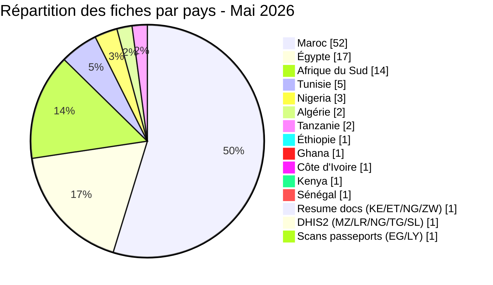
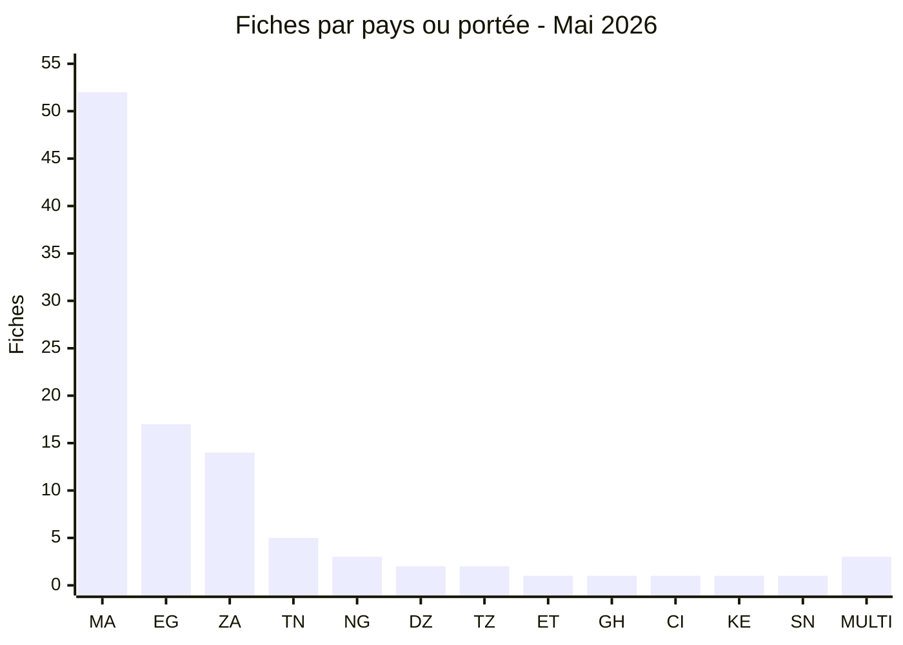
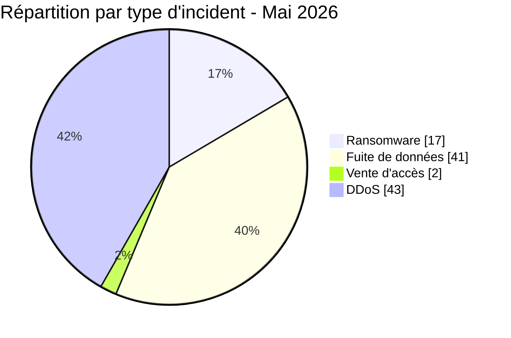
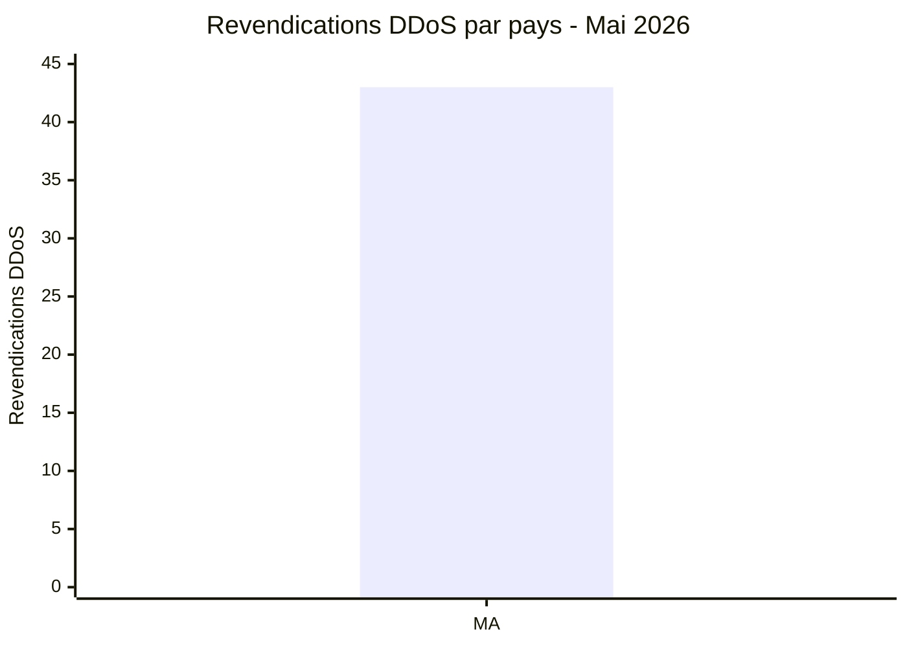
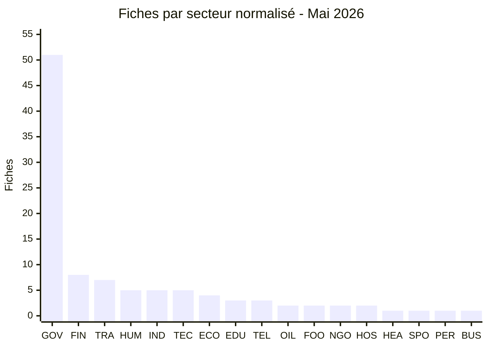
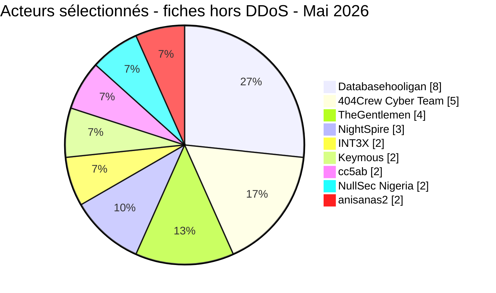
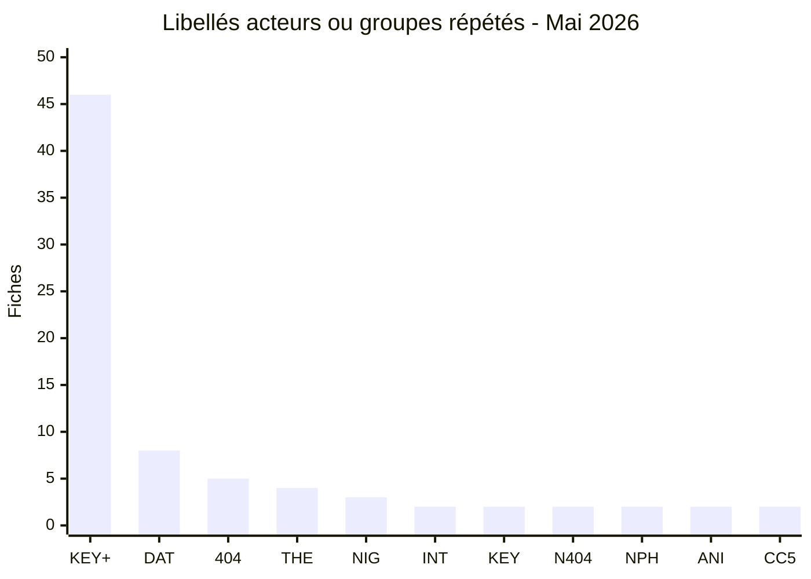
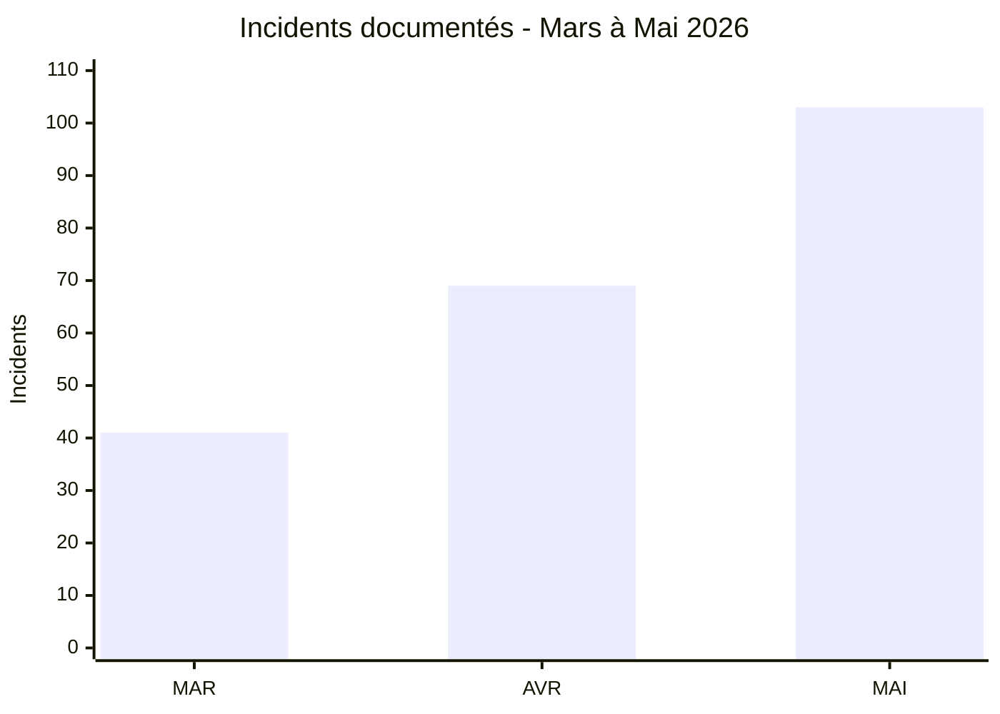

# Rapport CTI - menaces cyber en Afrique (Mai 2026)

👉🏾 [**English version available here**](./README.md)

## 1. Synthèse exécutive

Mai 2026 a rapporté **103 incidents cyber signalés ou revendiqués publiquement** en Afrique, **17 publications ou divulgations ransomware**, **41 fuites de données, 2 ventes d'accès** et **43 revendications DDoS**. Les entités éducatives égyptiennes sont revenues tout au long du mois, aux côtés de publications sous la bannière OpSouthAfrica, de ventes régulières attribuées à Databasehooligan dans quatre pays et de trois publications NightSpire visant des organisations égyptiennes.

Les **43 fiches DDoS** correspondent à des revendications ou observations de disponibilité datées attribuées à Keymous+. Certaines concernent les mêmes organisations à des dates différentes ; le corpus ne permet pas d'établir que les 43 fiches correspondent à des attaques techniquement indépendantes.

Principales conclusions :
- **17 ransomwares (16,5 %)**, **41 fuites de données (39,8 %), 2 ventes d'accès (1,9 %)** et **43 revendications DDoS (41,7 %)**.
- **12 pays** sont directement touchés, auxquels s’ajoutent **6 pays supplémentaires** exposés via **3 incidents multi-pays** ; **le Maroc** (52 incidents), **l’Égypte** (17), **l’Afrique du Sud** (14) et **la Tunisie** (5) concentrent **88 des 100 fiches mono-pays (88,0 %)**, soit **85,4 % des 103 fiches**.
- Des revendications attribuées à **TheGentlemen** concernent quatre pays en un mois (Égypte, Tunisie, Ghana, Côte d'Ivoire) ; **NightSpire** a revendiqué trois cibles égyptiennes.
- **Databasehooligan** est associé à 8 publications de vente en Tunisie, Afrique du Sud, Égypte et Algérie.
- Les revendications concernant l’éducation égyptienne mentionnent quatre entités ou jeux de données ; les volumes complets ne sont pas confirmés indépendamment.
- Messagerie de la police tanzanienne : un acteur propose un jeu de données prétendument associé à plus de 10 000 comptes. AFRINTEL n’a pas testé les identifiants.
- Trésor public du Sénégal : les fichiers analysés étayent une revendication portant sur environ 1,66 million d’enregistrements, sans établir indépendamment la séquence complète, le chiffrement ou le déploiement d’un ransomware.

### Liste des victimes

👉🏾 [Voir la liste complète des victimes](./victims_FR.md)

---

### 1.1 Comparaison avec le mois précédent

> Comparaison fondée sur les corpus mensuels AFRINTEL validés. Une variation du nombre de fiches documentées ne prouve pas, à elle seule, une variation du nombre réel de compromissions.

| Indicateur | Avril 2026 | Mai 2026 | Évolution observée |
|---|---:|---:|---:|
| Total incidents | 69 | 103 | **+34 (+49,3 %)** |
| Ransomware | 20 | 17 | **-3 (-15,0 %)** |
| Data Leak | 39 | 41 | **+2 (+5,1 %)** |
| Access Sale | 1 | 2 | **+1 (+100,0 %)** |
| DDoS | 9 | 43 | **+34 (+377,8 %)** |
| Defacement | 0 | 0 | **0 (stable)** |
| Operational Fraud | 0 | 0 | **0 (stable)** |

> Règle de lecture : si la valeur du mois précédent est `0` et celle du mois courant est supérieure à `0`, l'évolution est indiquée comme `nouveau` plutôt qu'avec un pourcentage artificiel. Les catégories absentes restent affichées à `0`.

## 2. Méthodologie

- **Périmètre** : 54 pays africains.
- **Période** : 1er - 31 mai 2026 (incidents révélés ou revendiqués ; les attaques peuvent être antérieures).
- **Sources** : Dark web, DLS, OSINT, canaux Telegram, forums underground.
- **Inclusion** : incidents publiquement revendiqués avec victime, pays et secteur identifiés.
- **Typologie** :
  - *Ransomware* : publication d’une victime ou revendication par un groupe ransomware. Le chiffrement n’est pas présumé sans élément probant.
  - *Fuite de données / vente d'accès* : exfiltration sans chiffrement, base vendue ou publiée, ou vente d'accès compromis.
  - *DDoS* : interruption revendiquée ou indisponibilité observée ; le test ne prouve pas indépendamment l'origine du trafic.

> Toutes les revendications issues de forums cybercriminels, leak sites et canaux underground sont traitées comme des **revendications non confirmées** sauf corroboration indépendante.

---

## 3. Vue d'ensemble

| Indicateur | Valeur |
|---|---|
| Total victimes | 103 |
| Pays touchés | 18 (12 directs + 6 via incidents multi-pays) |
| Acteurs ou sources nommés distincts | 31 |
| Incidents ransomware | 17 (16,5 %) |
| Fuites de données | 41 (39,8 %) |
| Ventes d'accès | 2 (1,9 %) |
| Revendications DDoS | 43 (41,7 %) |

### Classement des pays les plus touchés

**Tous incidents confondus (103) :**

| Rang | Pays / périmètre de la fiche | Incidents | Graphique |
| :---: | :--- | :---: | :--- |
| **1** | 🇲🇦 Maroc | **52** | ██████████████████████████ |
| **2** | 🇪🇬 Égypte | **17** | █████████ |
| **3** | 🇿🇦 Afrique du Sud | **14** | ███████ |
| **4** | 🇹🇳 Tunisie | **5** | ███ |
| **5** | 🇳🇬 Nigeria | **3** | ██ |
| **6** | 🇩🇿 Algérie | **2** | █ |
| **7** | 🇹🇿 Tanzanie | **2** | █ |
| **8** | 🇪🇹 Éthiopie | **1** | █ |
| **9** | 🇬🇭 Ghana | **1** | █ |
| **10** | 🇨🇮 Côte d'Ivoire | **1** | █ |
| **11** | 🇰🇪 Kenya | **1** | █ |
| **12** | 🇸🇳 Sénégal | **1** | █ |
| **-** | 🇰🇪 Kenya / 🇪🇹 Éthiopie / 🇳🇬 Nigeria / 🇿🇼 Zimbabwe (Resume docs) | **1** | █ |
| **-** | 🇲🇿 Mozambique / 🇱🇷 Liberia / 🇳🇬 Nigeria / 🇹🇬 Togo / 🇸🇱 Sierra Leone (DHIS2) | **1** | █ |
| **-** | 🇪🇬 Égypte / 🇱🇾 Libye (Scans de passeports) | **1** | █ |

> Les 12 premières lignes représentent **100 fiches mono-pays**. Les 3 dernières correspondent à des incidents multi-pays comptés une fois chacun, portant le total global à **103**.

**Légende codes pays :** `MA` = Maroc | `EG` = Égypte | `ZA` = Afrique du Sud | `TN` = Tunisie | `NG` = Nigeria | `DZ` = Algérie | `TZ` = Tanzanie | `ET` = Éthiopie | `GH` = Ghana | `CI` = Côte d'Ivoire | `KE` = Kenya | `SN` = Sénégal | `MULTI` = 3 fiches multi-pays

### Répartition des incidents ransomware (Total : 17)

| Rang | Pays | Incidents | Graphique |
| :---: | :--- | :---: | :--- |
| **1** | 🇪🇬 Égypte | **7** | ███████ |
| **2** | 🇳🇬 Nigeria | **3** | ███ |
| **3** | 🇹🇳 Tunisie | **2** | ██ |
| **4** | 🇿🇦 Afrique du Sud | **2** | ██ |
| **5** | 🇬🇭 Ghana | **1** | █ |
| **6** | 🇸🇳 Sénégal | **1** | █ |
| **7** | 🇨🇮 Côte d'Ivoire | **1** | █ |

### Répartition des fuites de données (Total : 41)

| Pays / périmètre | Incidents |
|---|---:|
| 🇿🇦 Afrique du Sud | **12** |
| 🇪🇬 Égypte | **10** |
| 🇲🇦 Maroc | **8** |
| 🇹🇳 Tunisie | **3** |
| 🇩🇿 Algérie | **2** |
| 🇹🇿 Tanzanie | **2** |
| 🇪🇹 Éthiopie | **1** |
| 🇰🇪 Kenya | **1** |
| 🇰🇪🇪🇹🇳🇬🇿🇼 Documents CV | **1** |
| 🇪🇬🇱🇾 Scans de passeports | **1** |
| **Total** | **41** |

### Répartition des ventes d'accès (Total : 2)

| Pays / périmètre | Incidents |
|---|---:|
| 🇲🇦 Maroc - Spacex.ma | **1** |
| 🇲🇿🇱🇷🇳🇬🇹🇬🇸🇱 DHIS2 | **1** |
| **Total** | **2** |

### Comparaison Ransomware vs Fuite / vente d'accès par pays

Cette comparaison visuelle couvre les **60 fiches hors DDoS** : **17 ransomware** et **43 fiches Fuite de données / Vente d'accès**. La série bleue regroupe **41 fuites de données et 2 ventes d'accès** uniquement pour la comparaison visuelle. Les compteurs structurés restent séparés dans le reste du rapport.

Les **43 revendications DDoS sont exclues de ce comparatif** et présentées séparément ci-dessous.

**Légende visuelle :** 🟧 Ransomware | 🟦 Fuite de données / Vente d'accès | 🟥 DDoS

| Code | Pays / portée | Ransomware | Barre | Fuite / vente d'accès | Barre |
|---|---|---:|---|---:|---|
| `MA` | Maroc | **0** | - | **9** | 🟦🟦🟦🟦🟦🟦🟦🟦🟦 |
| `EG` | Égypte | **7** | 🟧🟧🟧🟧🟧🟧🟧 | **10** | 🟦🟦🟦🟦🟦🟦🟦🟦🟦🟦 |
| `ZA` | Afrique du Sud | **2** | 🟧🟧 | **12** | 🟦🟦🟦🟦🟦🟦🟦🟦🟦🟦🟦🟦 |
| `TN` | Tunisie | **2** | 🟧🟧 | **3** | 🟦🟦🟦 |
| `NG` | Nigeria | **3** | 🟧🟧🟧 | **0** | - |
| `DZ` | Algérie | **0** | - | **2** | 🟦🟦 |
| `TZ` | Tanzanie | **0** | - | **2** | 🟦🟦 |
| `ET` | Éthiopie | **0** | - | **1** | 🟦 |
| `GH` | Ghana | **1** | 🟧 | **0** | - |
| `CI` | Côte d'Ivoire | **1** | 🟧 | **0** | - |
| `KE` | Kenya | **0** | - | **1** | 🟦 |
| `SN` | Sénégal | **1** | 🟧 | **0** | - |
| `MULTI` | Fiches multi-pays | **0** | - | **3** | 🟦🟦🟦 |
|  | **Total comparé** | **17** |  | **43** |  |

```mermaid
xychart-beta
    title "Ransomware vs Fuite / vente d'accès par pays - Mai 2026"
    x-axis ["MA", "EG", "ZA", "TN", "NG", "DZ", "TZ", "ET", "GH", "CI", "KE", "SN", "MULTI"]
    y-axis "Incidents" 0 --> 13
    bar [0, 7, 2, 2, 3, 0, 0, 0, 1, 1, 0, 1, 0]
    bar [9, 10, 12, 3, 0, 2, 2, 1, 0, 0, 1, 0, 3]
```

**Légende des séries :** première série de barres = 🟧 Ransomware | deuxième série de barres = 🟦 Fuite de données / Vente d'accès.

**Légende pays :** `MA` = Maroc | `EG` = Égypte | `ZA` = Afrique du Sud | `TN` = Tunisie | `NG` = Nigeria | `DZ` = Algérie | `TZ` = Tanzanie | `ET` = Éthiopie | `GH` = Ghana | `CI` = Côte d'Ivoire | `KE` = Kenya | `SN` = Sénégal | `MULTI` = 3 fiches multi-pays.

**Convention couleur utilisée dans les vues comparatives :** 🟧 Ransomware | 🟦 Fuite de données / Vente d'accès | 🟥 DDoS.

### Répartition DDoS

| Code | Pays | DDoS | Barre |
|---|---|---:|---|
| `MA` | Maroc | **43** | 🟥🟥🟥🟥🟥🟥🟥🟥🟥🟥🟥🟥🟥🟥🟥🟥🟥🟥🟥🟥🟥🟥🟥🟥🟥🟥🟥🟥🟥🟥🟥🟥🟥🟥🟥🟥🟥🟥🟥🟥🟥🟥🟥 |
|  | **Total** | **43** | |

**Légende DDoS :** 🟥 DDoS | `MA` = Maroc.

Les 43 fiches DDoS correspondent à des observations rétrospectives Keymous+ visant des cibles marocaines. Les tests de disponibilité documentés ne permettent pas, à eux seuls, d'établir l'origine du trafic, la technique DDoS, la durée ni l'impact effectif.

### Répartition géographique par région

> Les valeurs régionales utilisent les **103 fiches dédupliquées**. Les trois incidents multi-pays restent séparés et ne sont pas développés dans chaque pays concerné.

| Région / périmètre | Total fiches | Ransomware | Fuites / accès | DDoS | Part des 103 |
| :--- | ---: | ---: | ---: | ---: | ---: |
| **Afrique du Nord** | **76** | 9 | 24 | 43 | **73,8 %** |
| **Afrique australe** | **14** | 2 | 12 | 0 | **13,6 %** |
| **Afrique de l'Ouest** | **6** | 6 | 0 | 0 | **5,8 %** |
| **Afrique de l'Est** | **4** | 0 | 4 | 0 | **3,9 %** |
| **Fiches multi-pays** | **3** | 0 | 3 | 0 | **2,9 %** |
| **Total** | **103** | **17** | **43** | **43** | **100 %** |

### Répartition sectorielle

Les fiches sources utilisent également les libellés `Government / Diplomacy` et `Government / Civil Aviation`. Ils sont normalisés ci-dessous dans **Gouvernement / Administration**, soit 51 fiches au total.

| Secteur d'activité | Incidents | Part |
| :--- | ---: | ---: |
| **Gouvernement / Administration** | **51** | **49,5 %** |
| **Finance / Banque** | **8** | **7,8 %** |
| **Transport / Logistique** | **7** | **6,8 %** |
| **Ressources humaines / Recrutement** | **5** | **4,9 %** |
| **Industrie / Automobile / Fabrication** | **5** | **4,9 %** |
| **Technologies / Hébergement** | **5** | **4,9 %** |
| **E-commerce / Retail** | **4** | **3,9 %** |
| **Éducation / Université** | **3** | **2,9 %** |
| **Télécommunications** | **3** | **2,9 %** |
| **Pétrole & Énergie** | **2** | **1,9 %** |
| **Alimentation / Boissons / Restauration** | **2** | **1,9 %** |
| **ONG / Action sociale** | **2** | **1,9 %** |
| **Hôtellerie / Événementiel** | **2** | **1,9 %** |
| **Santé / Médical** | **1** | **1,0 %** |
| **Sports / Fédérations** | **1** | **1,0 %** |
| **Agrégation de données personnelles** | **1** | **1,0 %** |
| **Services aux entreprises** | **1** | **1,0 %** |
| **Total** | **103** | **100 %** |

**Légende codes secteurs :** `GOV` = Gouvernement / Administration | `FIN` = Finance / Banque | `TRA` = Transport / Logistique | `HUM` = Ressources humaines / Recrutement | `IND` = Industrie / Automobile / Fabrication | `TEC` = Technologies / Hébergement | `ECO` = E-commerce / Retail | `EDU` = Éducation / Université | `TEL` = Télécommunications | `OIL` = Pétrole / Énergie | `FOO` = Alimentation / Boissons / Restauration | `NGO` = ONG / Action sociale | `HOS` = Hôtellerie / Événementiel | `HEA` = Santé / Médical | `SPO` = Sports / Fédérations | `PER` = Agrégation de données personnelles | `BUS` = Services aux entreprises

### Acteurs de menaces les plus actifs

> Pour éviter de mélanger deux corpus de nature différente, ce classement porte sur les **60 fiches ransomware et fuites/ventes d’accès**. Les 43 fiches DDoS attribuées à Keymous+ sont traitées séparément en section 4.3.

| Acteur / Groupe | Incidents | Activité principale |
| :--- | ---: | :--- |
| **Databasehooligan** | **8** | Fuites / ventes de données |
| **404Crew Cyber Team** | **5** | Fuites / activité de coalition |
| **TheGentlemen** | **4** | Ransomware |
| **NightSpire** | **3** | Ransomware |
| **INT3X** | **2** | Fuites de données |
| **Keymous** | **2** | Fuites / ventes d’accès |
| **cc5ab** | **2** | Fuites de données |
| **NullSec Nigeria** | **2** | Fuites / activité de coalition |
| **anisanas2** | **2** | Fuites / ventes de données |

### Synthèse géographique

> **Pour le détail de chaque incident, voir [`victims_FR.md`](./victims_FR.md).**

- **Concentration :** l’Égypte (17), l’Afrique du Sud (14), le Maroc (52) et la Tunisie (5) représentent 88 des 103 incidents, soit 85,4 % du mois.
- **Répartition des menaces :** 17 revendications ou publications ransomware et 43 fuites de données ou ventes d’accès ont été recensées. Les incidents concernent 18 pays africains : 12 directement et 6 pays supplémentaires par exposition multi-pays.
- **Activité de campagne :** plusieurs entités éducatives égyptiennes ont fait l’objet de revendications importantes, tandis qu’OpSouthAfrica ciblait des institutions publiques et que Databasehooligan apparaissait dans quatre pays.
- **Expositions à fort impact :** les cas notables concernent des comptes de messagerie de la police tanzanienne et la revendication d’AuditTeam visant le Trésor public du Sénégal.

---

## 4. Analyse détaillée par type d'incident

### 4.1 Ransomware (17 incidents)

| Rang | Pays | Publications ou divulgations | Acteurs principaux |
| :---: | :--- | :---: | :--- |
| **1** | 🇪🇬 Égypte | **7** | NightSpire (3), TheGentlemen, Qilin, LockBit 5.0, Lamashtu |
| **2** | 🇳🇬 Nigeria | **3** | MedusaLocker, KillSec, 0day Syndicate |
| **3** | 🇹🇳 Tunisie | **2** | TheGentlemen, Titan |
| **4** | 🇿🇦 Afrique du Sud | **2** | PrinzEugen, Stormous |
| **5** | 🇬🇭 Ghana | **1** | TheGentlemen |
| **6** | 🇸🇳 Sénégal | **1** | AuditTeam |
| **7** | 🇨🇮 Côte d'Ivoire | **1** | TheGentlemen |

**Observations :** NightSpire a publié trois victimes égyptiennes ce mois-ci. TheGentlemen affiche la répartition géographique la plus large, avec des revendications dans quatre pays. Stormous a revendiqué le Consumer Goods Council of South Africa (CGCSA), un cas d'abord comptabilisé à tort comme une simple fuite de données, reclassé ici en publication ransomware. Pour le Trésor public du Sénégal, les fichiers analysés étayent bien la revendication d'exposition, mais ne confirment ni le déploiement du ransomware, ni le chiffrement, ni la séquence complète de l'intrusion.

### 4.2 Fuites et ventes d'accès - ventilation structurée : 41 Data Leak + 2 Access Sale

| Rang | Pays | Incidents | Acteurs principaux |
| :---: | :--- | :---: | :--- |
| **1** | 🇿🇦 Afrique du Sud | **12** | Databasehooligan, 404Crew CT, NullSec Nigeria, Kazu, cc5ab |
| **2** | 🇪🇬 Égypte | **9** | INT3X, Revesky, cc5ab, DR-X-LOL, CrowStealer, bigF, Keymous, Databasehooligan |
| **3** | 🇲🇦 Maroc | **8** | Sejjil, superstarkmc, JBT2026, fexus, DarkMafiaX, anisanas2 |
| **4** | 🇹🇳 Tunisie | **3** | Databasehooligan (3) |
| **5** | 🇩🇿 Algérie | **2** | kamalsheikhxx, Databasehooligan |
| **6** | 🇹🇿 Tanzanie | **2** | XOverStm, Kampuchean |
| **7** | 🇪🇹 Éthiopie | **1** | 404Crew Cyber Team |
| **-** | 🇰🇪🇪🇹🇳🇬🇿🇼 Resume docs | **1** | attackercompany |
| **-** | 🇲🇿🇱🇷🇳🇬🇹🇬🇸🇱 DHIS2 | **1** | Keymous |
| **-** | 🇪🇬🇱🇾 Scans de passeports | **1** | raylie |

**Observations :** l'Afrique du Sud concentre le plus de fuites et ventes d'accès (12), portées par Databasehooligan, 404Crew Cyber Team, NullSec Nigeria, Kazu et cc5ab. L'Égypte suit avec 9 incidents, le Maroc avec 8. Trois publications multi-pays complètent le tableau du mois : les CV divulgués (Kenya, Éthiopie, Nigeria, Zimbabwe), l'accès DHIS2 (Mozambique, Liberia, Nigeria, Togo, Sierra Leone) et des scans de passeports (Égypte, Libye).

---

### 4.3 Revendications DDoS (43 observations)

La collecte rétrospective de publications Keymous+ ajoute 43 observations marocaines datées entre le 9 et le 28 mai 2026. Chaque cible présente dans une publication de disponibilité datée compte comme une observation documentée ; les captures répétées d une même cible dans la même fenêtre sont dédupliquées. Certaines observations concernent la même organisation à des dates différentes et ne correspondent pas nécessairement à des attaques techniques distinctes. Les résultats Check-Host et Cloudflare documentent une indisponibilité apparente, mais ne prouvent pas indépendamment l origine du trafic, la méthode DDoS ni l impact effectif.

## 5. Impact sectoriel

| Secteur d'activité | Incidents | Part |
| :--- | ---: | ---: |
| **Gouvernement / Administration** | **51** | **49,5 %** |
| **Finance / Banque** | **8** | **7,8 %** |
| **Transport / Logistique** | **7** | **6,8 %** |
| **Ressources humaines / Recrutement** | **5** | **4,9 %** |
| **Industrie / Automobile / Fabrication** | **5** | **4,9 %** |
| **Technologies / Hébergement** | **5** | **4,9 %** |
| **E-commerce / Retail** | **4** | **3,9 %** |
| **Éducation / Université** | **3** | **2,9 %** |
| **Télécommunications** | **3** | **2,9 %** |
| **Pétrole & Énergie** | **2** | **1,9 %** |
| **Alimentation / Boissons / Restauration** | **2** | **1,9 %** |
| **ONG / Action sociale** | **2** | **1,9 %** |
| **Hôtellerie / Événementiel** | **2** | **1,9 %** |
| **Santé / Médical** | **1** | **1,0 %** |
| **Sports / Fédérations** | **1** | **1,0 %** |
| **Agrégation de données personnelles** | **1** | **1,0 %** |
| **Services aux entreprises** | **1** | **1,0 %** |
| **Total** | **103** | **100 %** |

**Observations clés :**
- Gouvernement / Administration représente **51 des 103 fiches (49,5 %)**, notamment sous l’effet du corpus DDoS marocain rétrospectif et des revendications visant le secteur public.
- Finance / Banque compte 8 fiches et Transport / Logistique 7.
- Éducation / Université compte 3 fiches classées sous ce secteur principal ; les jeux mixtes gouvernement/éducation conservent le secteur principal indiqué dans la fiche victime.
- Les fichiers analysés du Trésor public et l’offre concernant la messagerie de la police tanzanienne sont des cas publics à forte sensibilité, sans établir le chemin complet de l’intrusion.

---

## 6. Profil des acteurs de menaces

> Le tableau ci-dessous se concentre sur les ransomwares et les fuites/ventes d’accès ; les 43 revendications DDoS attribuées à Keymous+ sont traitées séparément plus haut.

| Acteur | Type | Incidents | Cibles principales |
| :--- | :--- | :---: | :--- |
| **Databasehooligan** | Compte proposant des jeux de données à la vente | **8** | Bases CRM/recrutement (multi-pays) |
| **TheGentlemen** | Ransomware | **4** | Industrie, automobile, agroalimentaire (4 pays) |
| **404Crew Cyber Team** | Fuites (coalitions) | **5+** | Institutions publiques sud-africaines, registre éthiopien de la société civile |
| **NightSpire** | Ransomware | **3** | Finance et restauration en Égypte |
| **INT3X** | Fuites de données | **2** | Éducation égyptienne |
| **Keymous** | Ventes d'accès | **2** | Systèmes de santé, télécoms (multi-pays) |
| **cc5ab** | Fuites de données | **2** | Gouvernements égyptien et kenyan |
| **NullSec Nigeria** | Fuites (coalitions) | **2+** | Agences gouvernementales sud-africaines |
| **anisanas2** | Fuites de données | **2** | Infrastructures marocaines (RADEM, vente massive multi-entités) |

**Acteurs émergents :** PrinzEugen (Standard Bank), Lamashtu (Luna Group), Kampuchean (Police tanzanienne), JBT2026 (Watiqa.ma), anisanas2 (vente massive marocaine).

**Légende codes acteurs/groupes :** `KEY+` = Keymous+ | `DAT` = Databasehooligan | `404` = 404Crew Cyber Team | `THE` = TheGentlemen | `NIG` = NightSpire | `INT` = INT3X | `KEY` = Keymous | `N404` = NullSec Nigeria x 404Crew Cyber Team x Infernalis | `NPH` = NullSec Nigeria x NullSec Philippines | `ANI` = anisanas2 | `CC5` = cc5ab

> Les mentions de provenance sont normalisées pour ce graphique. Les coalitions restent distinctes et Keymous n'est pas fusionné avec Keymous+.

### 6.1 Niveau de risque

| Pays | Risque |
|---|---|
| Égypte | 🔴 Critique |
| Afrique du Sud | 🔴 Critique |
| Maroc | 🟠 Élevé |
| Tunisie | 🟠 Élevé |
| Nigeria | 🟠 Moyen-élevé |
| Tanzanie | 🟠 Moyen-élevé |
| Algérie | 🟡 Moyen |
| Pays restants | 🟡 Faible-Moyen |

---

## 7. Tendances clés et lacunes de renseignement

- **L'éducation égyptienne continue d'être touchée.** Quatre fiches ce mois-ci. Campagne coordonnée ou simple faiblesse d'infrastructure partagée, la question reste ouverte.
- **"OpSouthAfrica" ressemble à un effort de coalition.** 404Crew, NullSec Nigeria et Infernalis ont ciblé ensemble au moins huit institutions sud-africaines en mai, mêlant publication de données et discours politique autour des tensions xénophobes.
- **Databasehooligan vend un peu partout.** Huit jeux de données structurés proposés dans quatre pays. Rien dans les fiches sources ne les relie à une plateforme commune ou un vecteur d'accès partagé.
- **NightSpire est resté concentré sur l'Égypte.** Trois publications ce mois-ci, un signal à surveiller, pas encore une preuve de campagne coordonnée.
- **Les comptes email gouvernementaux deviennent un vecteur d'accès à part entière.** Identifiants gouvernementaux marocains exposés (827 000 lignes), messagerie de la police tanzanienne en vente, offres de comptes pour requêtes EDR frauduleuses dans plusieurs pays : un marché d'usurpation d'autorité publique qui grandit.
- **L'accès DHIS2 vendu dans sept pays** (Mozambique, Liberia, Nigeria, Bhoutan, Honduras, Togo, Sierra Leone) représente à lui seul une menace critique pour la souveraineté des données de santé publique.
- **Le Maroc reste une cible récurrente.** Deux revendications importantes dans les dix derniers jours de mai : RADEM Meknès (1,1 million de documents revendiqués) et une vente groupée annoncée à plus de 12 millions de lignes. anisanas2 avait déjà publié des revendications marocaines en avril, l'activité se répète donc, sans qu'un vecteur d'accès commun soit établi entre les deux.

---

**Légende temporelle :** `MAR` = Mars 2026 | `AVR` = Avril 2026 | `MAI` = Mai 2026.

### Comparaison factuelle avec avril 2026

Cette comparaison utilise les données mensuelles relatives aux victimes et incidents de [avril](../04-april/victims_FR.md) et de [mai](./victims_FR.md). Elle décrit uniquement les publications recensées par AFRINTEL et ne conclut pas à une variation du nombre réel de compromissions.

| Indicateur | Avril 2026 | Mai 2026 | Évolution observée |
| :--- | ---: | ---: | :--- |
| Incidents documentés | 69 | 103 | **+34 (+49,3 %)** |
| Ransomware | 20 | 17 | **-3 (-15,0 %)** |
| Fuites de données / ventes d’accès | 40 | 43 | **+3 (+7,5 %)** |
| Revendications DDoS | 9 | 43 | **+34 (+377,8 %)** |

La variation mensuelle reflète l’évolution des publications publiques collectées par AFRINTEL. Elle peut dépendre du calendrier de publication, de la collecte rétrospective, des règles de comptage multi-pays, des republications ou de la couverture de veille, et ne doit pas être interprétée comme une évolution confirmée du nombre réel de compromissions.

## 8. Cartographie MITRE ATT&CK (contextuelle)

| Phase | Technique | Portée analytique |
| :--- | :--- | :--- |
| Accès initial | T1566 - Phishing | Hypothèse de détection défensive, non observée à partir des seules revendications |
| Accès initial | T1190 - Exploit Public-Facing Application | Hypothèse de détection défensive, non observée à partir des seules revendications |
| Accès par comptes | T1078 - Valid Accounts | Pertinent pour les ventes d’accès ou d’identifiants, sans confirmer leur utilisation |
| Collecte | T1005 - Data from Local System | Hypothèse contextuelle lorsque des données internes sont publiées, le mécanisme de collecte restant inconnu |
| Impact | T1486 - Data Encrypted for Impact | Pertinent pour la préparation ransomware, sans confirmer un chiffrement pour chaque fiche |

> Ces techniques constituent des hypothèses défensives. Une revendication, une vente de données ou une publication sur un site de fuite ne suffit pas à les considérer comme observées.

## 9. Recommandations

- **Gouvernements :** Imposer l'authentification multifacteur (MFA) sur tous les portails administratifs et éducatifs ; auditer l'exposition d'identifiants sur les forums underground ; traiter la fuite des identifiants gouvernementaux marocains comme un risque d'identité systémique nécessitant une réinitialisation immédiate des mots de passe.
- **Institutions éducatives :** Isoler les bases de données étudiants et enseignants des interfaces web exposées ; chiffrer les données sensibles au repos ; activer les logs d'audit sur les plateformes administratives.
- **Secteur financier :** Surveiller les DLS ransomware pour des indicateurs de publication imminente ; maintenir des sauvegardes hors ligne ; auditer les flux de données tiers pour les CRM et plateformes de paiement.
- **Forces de l'ordre :** Traiter l’offre concernant la messagerie de la police tanzanienne comme un risque opérationnel potentiel ; réinitialiser tous les identifiants affectés ; déployer DMARC/DKIM sur les domaines email gouvernementaux.
- **Santé :** Auditer immédiatement les comptes administrateurs DHIS2 ; restreindre l'accès aux panneaux d'administration aux seuls réseaux internes.

---

## 10. Recommandations SOC tactiques

- **[T1078] Surveillance des identifiants :** Corréler les données de fuites avec les annuaires internes ; signaler les comptes exposés dans les incidents Maroc, Police tanzanienne et Stats SA.
- **[T1190] Exposition API :** Imposer l'authentification sur toutes les API publiques ; scanner les buckets S3 non authentifiés et les panneaux d'administration exposés.
- **[T1486] Détection ransomware :** Surveiller les activités de chiffrement volumétrique, la suppression de copies shadow (vssadmin) et les mouvements latéraux via SMB/RDP.
- **[Data brokers] Veille :** Surveiller Databasehooligan, 404Crew et NightSpire pour anticiper de nouvelles cibles africaines.

---

## 11. Recommandations stratégiques

- Mettre en place des canaux de notification intersectoriels pour les revendications répétées visant les institutions publiques et les services essentiels.
- Imposer des audits périodiques du stockage cloud, des API exposées et des comptes privilégiés dans les secteurs public, éducatif et financier.
- Coordonner les plateformes et les CERT nationaux face aux abus d’identités gouvernementales ou policières.

---

## 12. Conclusion

Mai se clôture avec **103 incidents signalés ou revendiqués publiquement**, contre 69 en avril (**+49,3 %**) : **17 ransomware, 41 fuites de données, 2 ventes d'accès et 43 revendications DDoS**.

Le Maroc représente **52 fiches**, devant l'Égypte (17), l'Afrique du Sud (14) et la Tunisie (5). Ensemble, ces quatre pays concentrent **85,4 % du corpus complet de mai**.

Le mois montre un paysage de menace qui dépasse le ransomware et combine indisponibilité, publication de données, exposition d'identifiants et courtage d'accès. Pour AFRINTEL, la séparation entre type d'incident, revendication de l'acteur, preuves disponibles et niveau de confiance reste essentielle pour produire une analyse mensuelle reproductible.

**AFRINTEL** - African Cyber Threat Intelligence
🔗 [Dépôt GitHub AFRINTEL](https://github.com/Hatchepsoute/AFRINTEL)
