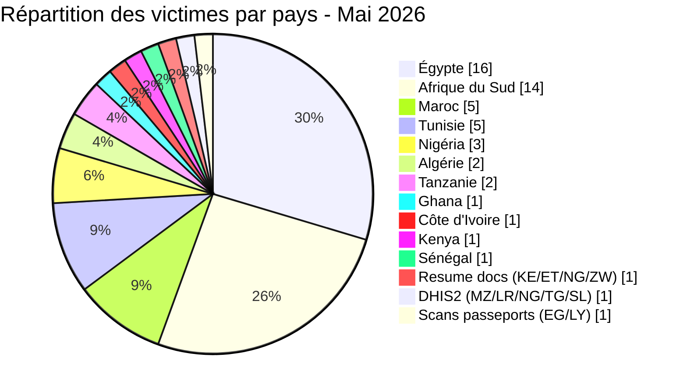
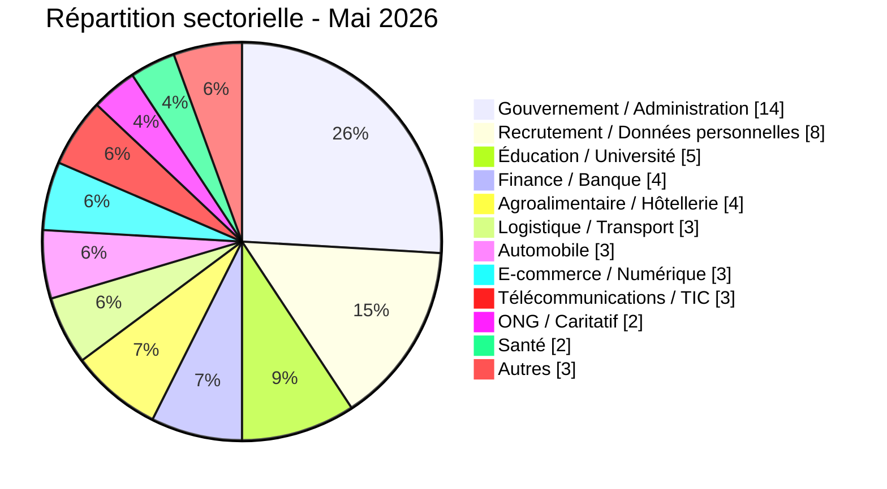
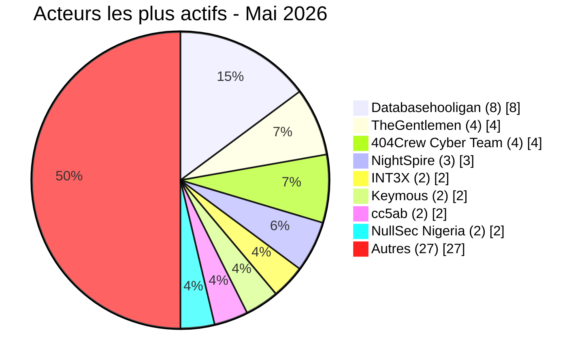

# Rapport CTI - menaces cyber en Afrique (Mai 2026)

👉🏾 [**English version available here**](./README.md)

## 1. Synthèse exécutive

Mai 2026 a enregistré **54 incidents cyber revendiqués publiquement** sur le continent : **16 ransomwares** et **38 fuites de données / ventes d'accès**. Le mois a été marqué par une offensive systématique contre le secteur éducatif égyptien, une campagne coordonnée contre les institutions publiques sud-africaines (OpSouthAfrica), la domination du data broker **Databasehooligan** dans quatre pays, et trois revendications du groupe **NightSpire** contre des cibles égyptiennes sur le même mois.

Principales conclusions :
- **16 ransomwares (29,6 %)** et **38 fuites de données / ventes d'accès (70,4 %)**.
- **11 pays** touchés, plus 3 incidents multi-pays ; **l'Égypte** (16 incidents), **l'Afrique du Sud** (14), **le Maroc** (5) et **la Tunisie** (5) concentrent 74 % des victimes.
- **TheGentlemen** a frappé quatre pays en un mois (Égypte, Tunisie, Ghana, Côte d'Ivoire) ; **NightSpire** a revendiqué trois cibles égyptiennes.
- **Databasehooligan** domine l'activité data broker avec 8 victimes en Tunisie, Afrique du Sud, Égypte et Algérie.
- Le secteur éducatif égyptien sous attaque systémique : Ministère de l'Éducation (26,8 millions d'enregistrements élèves), Professional Academy for Teachers (1,2 million d'enseignants), Université de Mansoura (989 000 enregistrements), bases RH et éducatives (37 Go).
- La messagerie de la police tanzanienne compromise : 10 000 comptes officiers avec mots de passe en clair mis en vente.
- Trésor Public du Sénégal : ransomware AuditTeam avec exfiltration de données confirmée (~1,66 million d'enregistrements dans trois bases Oracle, plus 18 mois de fichiers opérationnels SICA).

### Liste des victimes

👉🏾 [Voir la liste complète des victimes](./victims_FR.md)

---

## 2. Méthodologie

- **Périmètre** : 54 pays africains.
- **Période** : 1er - 31 mai 2026 (incidents révélés ou revendiqués ; les attaques peuvent être antérieures).
- **Sources** : Dark web, DLS, OSINT, canaux Telegram, forums underground.
- **Inclusion** : incidents publiquement revendiqués avec victime, pays et secteur identifiés.
- **Typologie** :
  - *Ransomware* : chiffrement + demande de rançon.
  - *Fuite de données / vente d'accès* : exfiltration sans chiffrement, base vendue ou publiée, ou vente d'accès compromis.

> Toutes les revendications issues de forums cybercriminels, leak sites et canaux underground sont traitées comme des **revendications non confirmées** sauf corroboration indépendante.

---

## 3. Vue d'ensemble

| Indicateur | Valeur |
|---|---|
| Total victimes | 54 |
| Pays touchés | 18 (11 directs + 7 via incidents multi-pays) |
| Acteurs distincts | 25+ |
| Incidents ransomware | 16 (29,6 %) |
| Fuites de données / ventes d'accès | 38 (70,4 %) |

### Classement des pays les plus touchés

**Tous incidents confondus (54) :**

| Rang | Pays | Incidents | Graphique |
| :---: | :--- | :---: | :--- |
| **1** | 🇪🇬 Égypte | **16** | ████████████████ |
| **2** | 🇿🇦 Afrique du Sud | **14** | ██████████████ |
| **3** | 🇲🇦 Maroc | **5** | █████ |
| **4** | 🇹🇳 Tunisie | **5** | █████ |
| **5** | 🇳🇬 Nigeria | **3** | ███ |
| **6** | 🇩🇿 Algérie | **2** | ██ |
| **7** | 🇹🇿 Tanzanie | **2** | ██ |
| **8** | 🇬🇭 Ghana | **1** | █ |
| **9** | 🇨🇮 Côte d'Ivoire | **1** | █ |
| **10** | 🇰🇪 Kenya | **1** | █ |
| **11** | 🇸🇳 Sénégal | **1** | █ |
| **–** | 🇰🇪 Kenya / 🇪🇹 Éthiopie / 🇳🇬 Nigéria / 🇿🇼 Zimbabwe (Resume docs) | **1** | █ |
| **–** | 🇲🇿 Mozambique / 🇱🇷 Liberia / 🇳🇬 Nigéria / 🇹🇬 Togo / 🇸🇱 Sierra Leone (DHIS2) | **1** | █ |
| **–** | 🇪🇬 Égypte / 🇱🇾 Libye (Scans de passeports) | **1** | █ |

### Répartition des incidents ransomware (Total : 16)

| Rang | Pays | Incidents | Graphique |
| :---: | :--- | :---: | :--- |
| **1** | 🇪🇬 Égypte | **7** | ███████ |
| **2** | 🇳🇬 Nigeria | **3** | ███ |
| **3** | 🇹🇳 Tunisie | **2** | ██ |
| **4** | 🇿🇦 Afrique du Sud | **1** | █ |
| **5** | 🇬🇭 Ghana | **1** | █ |
| **6** | 🇸🇳 Sénégal | **1** | █ |
| **7** | 🇨🇮 Côte d'Ivoire | **1** | █ |

### Répartition des fuites de données / ventes d'accès (Total : 38)

| Rang | Pays | Incidents | Graphique |
| :---: | :--- | :---: | :--- |
| **1** | 🇿🇦 Afrique du Sud | **13** | █████████████ |
| **2** | 🇪🇬 Égypte | **9** | █████████ |
| **3** | 🇲🇦 Maroc | **5** | █████ |
| **4** | 🇹🇳 Tunisie | **3** | ███ |
| **5** | 🇩🇿 Algérie | **2** | ██ |
| **6** | 🇹🇿 Tanzanie | **2** | ██ |
| **7** | 🇰🇪 Kenya | **1** | █ |
| **–** | 🇰🇪🇪🇹🇳🇬🇿🇼 Resume docs | **1** | █ |
| **–** | 🇲🇿🇱🇷🇳🇬🇹🇬🇸🇱 DHIS2 | **1** | █ |
| **–** | 🇪🇬🇱🇾 Scans de passeports | **1** | █ |

### Comparaison ransomware vs. fuites par pays

| Pays | Ransomware | Fuites | Répartition côte-à-côte |
| :--- | :---: | :---: | :--- |
| 🇪🇬 Égypte | **7** | **9** | 🟧🟧🟧🟧🟧🟧🟧 🟦🟦🟦🟦🟦🟦🟦🟦🟦 |
| 🇿🇦 Afrique du Sud | **1** | **13** | 🟧 🟦🟦🟦🟦🟦🟦🟦🟦🟦🟦🟦🟦🟦 |
| 🇲🇦 Maroc | **0** | **5** | 🟦🟦🟦🟦🟦 |
| 🇹🇳 Tunisie | **2** | **3** | 🟧🟧 🟦🟦🟦 |
| 🇳🇬 Nigeria | **3** | **0** | 🟧🟧🟧 |
| 🇩🇿 Algérie | **0** | **2** | 🟦🟦 |
| 🇹🇿 Tanzanie | **0** | **2** | 🟦🟦 |
| 🇬🇭 Ghana | **1** | **0** | 🟧 |
| 🇨🇮 Côte d'Ivoire | **1** | **0** | 🟧 |
| 🇰🇪 Kenya | **0** | **1** | 🟦 |
| 🇸🇳 Sénégal | **1** | **0** | 🟧 |
| 🇰🇪🇪🇹🇳🇬🇿🇼 Resume docs | **0** | **1** | 🟦 |
| 🇲🇿🇱🇷🇳🇬🇹🇬🇸🇱 DHIS2 | **0** | **1** | 🟦 |
| 🇪🇬🇱🇾 Scans de passeports | **0** | **1** | 🟦 |
| **Total (54)** | **16** | **38** | *Légende : 🟧 Ransomware \| 🟦 Fuites de données* |

### Répartition géographique par région

| Région | Total incidents | Ransomware | Fuites | Répartition côte-à-côte |
| :--- | :---: | :---: | :---: | :--- |
| **Afrique du Nord** | **28** (51,9 %) | 7 | 21 | 🟧🟧🟧🟧🟧🟧🟧 🟦🟦🟦🟦🟦🟦🟦🟦🟦🟦🟦🟦🟦🟦🟦🟦🟦🟦🟦🟦🟦 |
| **Afrique australe** | **15** (27,8 %) | 1 | 14 | 🟧 🟦🟦🟦🟦🟦🟦🟦🟦🟦🟦🟦🟦🟦🟦 |
| **Afrique de l'Ouest** | **5** (9,3 %) | 4 | 1 | 🟧🟧🟧🟧 🟦 |
| **Afrique de l'Est** | **3** (5,6 %) | 0 | 3 | 🟦🟦🟦 |
| 🇰🇪🇪🇹🇳🇬🇿🇼🇲🇿🇱🇷🇹🇬🇸🇱🇱🇾 Multi-pays (3 incidents) | **3** (5,6 %) | 0 | 3 | 🟦🟦🟦 |

*Légende : 🟧 Ransomware | 🟦 Fuites de données*

### Répartition sectorielle

| Secteur d'activité | Incidents | Part (%) | Graphique |
| :--- | :---: | :---: | :--- |
| **Gouvernement / Administration** | **14** | 25,9 % | ██████████████ |
| **Recrutement / Données personnelles** | **8** | 14,8 % | ████████ |
| **Éducation / Université** | **5** | 9,3 % | █████ |
| **Finance / Banque** | **4** | 7,4 % | ████ |
| **Agroalimentaire / Hôtellerie** | **4** | 7,4 % | ████ |
| **Logistique / Transport** | **3** | 5,6 % | ███ |
| **Automobile** | **3** | 5,6 % | ███ |
| **E-commerce / Numérique** | **3** | 5,6 % | ███ |
| **Télécommunications / TIC** | **3** | 5,6 % | ███ |
| **ONG / Caritatif** | **2** | 3,7 % | ██ |
| **Santé** | **2** | 3,7 % | ██ |
| **Autres** | **3** | 5,6 % | ███ |
| **Total** | **54** | **100 %** | |

### Acteurs de menaces les plus actifs

| Acteur / Groupe | Incidents | Activité principale | Graphique |
| :--- | :---: | :--- | :--- |
| **Databasehooligan** | **8** | Fuites / ventes de données | 🟦🟦🟦🟦🟦🟦🟦🟦 |
| **TheGentlemen** | **4** | Ransomware | 🟧🟧🟧🟧 |
| **404Crew Cyber Team** | **4** | Fuites de données (coalitions) | 🟦🟦🟦🟦 |
| **NightSpire** | **3** | Ransomware | 🟧🟧🟧 |
| **INT3X** | **2** | Fuites de données | 🟦🟦 |
| **Keymous** | **2** | Ventes d'accès / fuites | 🟦🟦 |
| **cc5ab** | **2** | Fuites de données | 🟦🟦 |
| **NullSec Nigeria** | **2** | Fuites (coalitions) | 🟦🟦 |

*Légende : 🟧 Ransomware \| 🟦 Fuites de données*

---

## 4. Bilan par pays

> Tous les éléments présentés proviennent d’incidents revendiqués sur le dark web, sur les sites web des groupes de ransomware et les forums underground.

### 🇪🇬 Égypte (16 incidents : 7 ransomwares, 9 fuites de données)

L’Égypte est le pays le plus ciblé en mai 2026, représentant 30 % de l’ensemble des incidents. Le secteur de l’éducation a subi une vague coordonnée d’exfiltrations de données.

**Ransomware (7) :** L’acteur malveillant NightSpire a revendiqué trois victimes égyptiennes en l’espace de quelques jours : Papa John’s Egypt (24 mai), Rawaj Consumer Finance (24 mai) et B Investments Holding (26 mai). L’acteur malveillant Lamashtu a ciblé Luna Group (4 mai), un conglomérat industriel egyptien spécialisé dans l’agroalimentaire et les produits ménagers. L’acteur malveillant LockBit 5.0 a revendiqué Rhactus Hotel (7 mai). L’acteur malveillant Qilin a ciblé Imex International, une entreprise égyptienne de logistique internationale (8 mai). L’acteur malveillant TheGentlemen a revendiqué Misr Chemical Industries (9 mai), un acteur industriel majeur dans la chimie.

**Fuites données éducation (4) :** L’acteur malveillant Revesky a revendiqué la compromission du ministère de l’Éducation égyptien le 13 mai, affirmant détenir environ 26,8 millions d’enregistrements d’élèves et 3,8 millions d’enregistrements d’enseignants et d’administrateurs, ainsi qu’un accès administratif complet aux plateformes éducatives. L’acteur malveillant INT3X a ciblé deux organisations : l’université de Mansoura (10 mai, environ 989 000 enregistrements d’étudiants incluant les numéros nationaux d’identité, couvrant 2012-2026) et la Professional Academy for Teachers (16 mai, environ 1,2 million d’enregistrements d’enseignants avec codes de poste, matières enseignées et affectations d’établissements). L’acteur malveillant bigF a revendiqué une base combinée éducation et RH (4 mai), représentant environ 37 Go liés à plusieurs institutions dont les universités de Mansoura et de Galala, avec plus de 1,5 million d’enregistrements d’étudiants.

**Autres fuites (5) :** L’acteur malveillant CrowStealer a revendiqué une fuite depuis le ministère de la Main-d’oeuvre égyptien (2 mai), exposant des données de travailleurs et d’expatriés incluant numéros nationaux d’identité et numéros de passeport. L’acteur malveillant cc5ab a publié une exposition d’API non authentifiée affectant FutureShop, une plateforme de e-commerce égyptienne (12 mai), révélant 3 893 enregistrements clients, 5 181 commandes, 2 438 adresses de livraison avec coordonnées GPS et 60 profils de boutiques avec documents de registre commercial. L’acteur malveillant DR-X-LOL a publié une fuite depuis Baitzakat.org.eg (15 mai), revendiquant plus de 300 000 enregistrements de citoyens égyptiens incluant les numéros nationaux d’identité et des affiliations gouvernementales. L’acteur malveillant Databasehooligan a mis en vente la base de données de Wuzzuf.net (24 mai), la principale plateforme de recrutement égyptienne, revendiquant environ 672 000 enregistrements dont des images de pièces d’identité et des vidéos de vérification biométrique. L’acteur malveillant Keymous a revendiqué un accès à Citex Systems (28 mai), une entreprise égyptienne de télécommunications et d’informatique, exposant des données employés et des informations de gestion de projets internes.

**Multi-pays :** L’Égypte a également été touchée par la fuite de scans de passeports publiée par l’acteur malveillant raylie (18 mai), qui a exposé des images de documents de passeport de plus de 20 pays.

---

### 🇿🇦 Afrique du Sud (14 incidents : 1 ransomware, 13 fuites de données)

L’Afrique du Sud est le deuxième pays le plus ciblé : 13 incidents sur 14 sont des fuites de données, dont 8 s’inscrivent dans la campagne coordonnée "OpSouthAfrica".

**Campagne OpSouthAfrica (8 institutions) :** Une coalition composée des acteurs malveillants 404Crew Cyber Team, NullSec Nigeria, NullSec Philippines et Infernalis a mené une campagne soutenue contre des institutions publiques sud-africaines. Les acteurs malveillants NullSec Nigeria, 404Crew Cyber Team et Infernalis ont revendiqué la municipalité d’Ephraim Mogale (15 mai, province du Limpopo), affirmant détenir environ 111 Go de documents administratifs et de correspondances officielles. La même coalition a revendiqué le Département des Services correctionnels (16 mai), publiant des documents de marchés publics et des communications officielles du Commissaire national. L’acteur malveillant 404Crew Cyber Team a revendiqué Bellavista School (15 mai), exposant des enregistrements d’inscription d’élèves et de parents. Le 23 mai, les acteurs malveillants NullSec Nigeria et NullSec Philippines ont revendiqué la State Information Technology Agency (SITA) et le South African Revenue Service (SARS), publiant des échantillons d’identifiants ; le jeu de données SARS contient principalement des couples email/mot de passe d’organisations tierces, nécessitant une validation complémentaire pour confirmer une compromission directe du SARS. Le 24 mai, l’acteur malveillant 404Crew Cyber Team a revendiqué CERVI My Private Care (plateforme de santé numérique), publiant des coordonnées bancaires et numéros BHF de prestataires de soins ; il a également revendiqué mevent. (plateforme de personnel de santé, avec des données de contact d’infirmières dans plusieurs provinces sud-africaines) et Sheriff Randburg West (office d’exécution judiciaire), exposant des données de contact de citoyens ayant utilisé ses services en ligne.

**Ventes data broker (3 victimes) :** L’acteur malveillant Databasehooligan a vendu trois bases de données commerciales sud-africaines le 27 mai : Telkom (environ 742 000 enregistrements clients incluant numéros nationaux d’identité, données de facturation et historique de tickets d’assistance, à 900 dollars), Wanderers Club (environ 674 000 enregistrements de membres incluant catégories d’adhésion sportive et réservations d’événements, à 1 400 dollars) et MIDAS, distributeur de pièces automobiles (environ 463 000 enregistrements clients et logistiques incluant numéros de TVA, à 1 100 dollars).

**Autres fuites (2) :** L’acteur malveillant Stormous (opérant sous le pseudonyme XOverStm) a publié environ 20 Go de données prétendument issues du Consumer Goods Council of South Africa (CGCSA, 5 mai), incluant une sauvegarde complète de la base Sage 200 Evolution avec registres financiers, comptes clients et inventaires informatiques. L’acteur malveillant Kazu a revendiqué la vente de 154 Go de données et de plus de 453 000 fichiers issus de Statistics South Africa (Stats SA, 17 mai), incluant des documents de recensement, des scans de cartes d’identité nationales et des dossiers d’agents de terrain.

**Ransomware (1) :** L’acteur malveillant PrinzEugen a revendiqué Standard Bank Group (4 mai), le plus grand groupe bancaire africain en termes d’actifs. Aucun échantillon de données n’a été publié au moment de l’observation ; la revendication reste non vérifiée.

---

### 🇲🇦 Maroc (5 fuites de données)

L’acteur malveillant Sejjil a revendiqué la compromission complète de l’infrastructure ERP et financière de SDTM, filiale logistique du Groupe Barid Al-Maghrib (12 mai), affirmant détenir 129 fichiers CSV structurés issus de systèmes SAGE ERP, incluant des comptes utilisateurs ERP, des hachages de mots de passe MD5, des jetons de session actifs, des identifiants bancaires (RIB) et des références d’identité nationale de clients. L’acteur malveillant superstarkmc a revendiqué une fuite massive d’identifiants depuis plusieurs plateformes gouvernementales marocaines (17 mai), affirmant détenir environ 827 000 lignes d’identifiants provenant de services tels que Massar, Moutamadris, Waliye, Tax.gov.ma et la Trésorerie Générale du Royaume (TGR), couvrant l’éducation, la fiscalité et les portails administratifs. L’acteur malveillant JBT2026 a revendiqué une base de données issue de Watiqa.ma (20 mai), la plateforme officielle marocaine de demande de documents d’état civil, avec environ 695 400 enregistrements incluant noms complets, dates de naissance, adresses et données d’état civil. L’acteur malveillant fexus a revendiqué une fuite de données depuis Avito.ma (21 mai), la principale plateforme marocaine d’annonces en ligne, avec des adresses email, numéros de téléphone et mots de passe en clair. L’acteur malveillant DarkMafiaX a divulgué ce qui semble être un identifiant administratif pour Spacex.ma (22 mai), une boutique en ligne marocaine, permettant un accès potentiel au panneau d’administration, aux données clients et à l’infrastructure web.

---

### 🇹🇳 Tunisie (5 incidents : 2 ransomwares, 3 fuites de données)

L’acteur malveillant TheGentlemen a revendiqué une attaque par ransomware contre SETCAR, un fabricant tunisien de pièces automobiles et équipements (12 mai). L’acteur malveillant Titan a revendiqué CRIT Tunisie (18 mai), filiale du groupe français CRIT spécialisée dans le placement de personnel et les services RH. Les trois fuites de données ont été menées par l’acteur malveillant Databasehooligan au cours des derniers jours de mai : Keejob (27 mai, environ 137 000 enregistrements incluant candidatures, lettres de motivation et attentes salariales, à 1 400 dollars), MyTelnet (27 mai, profils CRM d’abonnés avec données démographiques, points de fidélité et historiques d’utilisation) et OptionCarriere.tn (31 mai, environ 274 000 enregistrements couvrant candidats, historiques de candidatures et informations d’entreprises recruteuses, à 1 300 dollars).

---

### 🇳🇬 Nigéria (3 ransomwares)

Trois opérateurs distincts ont chacun ciblé une organisation nigériane. L’acteur malveillant MedusaLocker a revendiqué ActionAid / TACOSA (5 mai), une ONG humanitaire internationale ; la revendication concerne des données de programmes communautaires et des informations sur les bénéficiaires. L’acteur malveillant KillSec a revendiqué MRS Holdings (9 mai), un grand conglomérat énergétique nigérian actif dans le pétrole, le gaz et l’électricité. L’acteur malveillant 0day Syndicate a revendiqué XL Africa Group (28 mai), un groupe de services externalisés B2B avec des opérations au Nigéria, au Ghana, au Liberia et en Sierra Leone. Le Nigéria a également été touché par l’incident multi-pays Resume docs (l’acteur malveillant attackercompany) et la vente d’accès DHIS2 aux ministères de la santé (l’acteur malveillant Keymous). L’incident DHIS2 est particulièrement significatif : les artefacts publiés incluent des couples URL/identifiant/mot de passe ciblant des instances de plateformes gouvernementales de santé, indiquant une compromission crédible de comptes administratifs plutôt qu’un simple dump de données.

---

### 🇩🇿 Algérie (2 fuites de données)

L’acteur malveillant kamalsheikhxx a revendiqué une fuite de 34,3 Go depuis le ministère algérien de l’Industrie pharmaceutique (4 mai), couvrant plus de 52 000 fichiers sur la période 2019-2025 : rapports d’importation de médicaments, registres commerciaux pharmaceutiques, déclarations douanières, listes de substances psychotropes et données personnelles de responsables d’entreprises. L’acteur malveillant Databasehooligan a mis en vente la base de données de l’OGEBC (Office de Gestion des Biens Culturels) pour 900 dollars (19 mai), revendiquant 425 000 enregistrements issus d’un organisme public de gestion du patrimoine culturel national, incluant données de contact clients, historiques de commandes, tickets d’assistance et notes internes.

---

### 🇹🇿 Tanzanie (2 fuites de données)

L’acteur malveillant XOverStm a proposé à la vente une base de données de plus de 120 000 enregistrements de citoyens tanzaniens (3 mai) pour 350 dollars, incluant noms complets, adresses physiques, numéros de téléphone et villes de résidence, décrits par le vendeur comme des données actives et validées. Le cybercriminel Kampuchean a ensuite proposé à la vente la base complète de messagerie de la police tanzanienne (domaine tpf.go.tz) pour 550 dollars (22 mai), revendiquant plus de 10 000 comptes email complets d’officiers de police avec mots de passe en clair (déhachés). Cette seconde revendication est particulièrement critique : l’accès à des comptes email officiels de police permet d’usurper l’identité d’officiers, d’accéder à des données d’enquêtes actives et d’obtenir des points d’entrée vers d’autres systèmes administratifs connectés.

---

### 🇸🇳 Sénégal (1 ransomware)

L’acteur malveillant AuditTeam a revendiqué la compromission du Trésor Public du Sénégal, l’institution chargée de la gestion des finances publiques du pays (17-18 mai). L’analyse technique des échantillons exfiltrés confirme que l’acteur avait un accès covert à deux serveurs internes environ 9 jours avant la revendication publique. Le serveur 10.6.0.61 a livré trois dumps de bases Oracle : un registre du personnel et de la paie de l’État (~40 394 enregistrements incluant coordonnées bancaires et montants de salaires), un registre national des contribuables et débiteurs (~960 146 enregistrements avec identifiants fiscaux, adresses et numéros d’immatriculation) et une base complète d’ordres de paiement publics (~659 195 enregistrements incluant les NINEA et coordonnées bancaires complètes des bénéficiaires). Le serveur 10.6.0.26 (système SICA de gestion des salaires) contenait 18 mois de fichiers de virements et d’opérations salariales jusqu’au 8 mai 2026. Exposition totale estimée : environ 1 659 735 entrées de bases de données. Il s’agit de l’incident ransomware le plus grave du dataset AFRINTEL de mai 2026, représentant un impact de niveau 4 sur l’infrastructure financière critique du Sénégal.

---

### 🇬🇭 Ghana (1 ransomware)

L’acteur malveillant TheGentlemen a revendiqué une attaque par ransomware contre Kasapreko (6 mai), l’un des plus grands fabricants et distributeurs de boissons du Ghana, dont les produits sont distribués sur plusieurs marchés africains.

---

### 🇨🇮 Côte d’Ivoire (1 ransomware)

L’acteur malveillant TheGentlemen a revendiqué une attaque par ransomware contre Mayelia Automotive (28 mai), une entreprise ivoirienne spécialisée dans le contrôle technique et les services automobiles.

---

### 🇰🇪 Kenya (1 fuite de données)

L’acteur malveillant cc5ab a revendiqué la compromission du Land Surveyors Board of Kenya (LSB, 16 mai), l’organe gouvernemental chargé de l’agrément des géomètres. La revendication inclut 175 enregistrements de géomètres agréés, 730 enregistrements d’assistants géomètres avec numéros nationaux d’identité, la documentation complète de l’API avec paramètres de requêtes, un accès au panneau d’administration Django et des données de configuration PostgreSQL incluant des paramètres JWT. La combinaison de données personnelles et d’informations techniques sur l’infrastructure pourrait faciliter à la fois des fraudes à l’identité et de futures attaques contre l’organisation. Le Kenya a également été inclus dans l’incident multi-pays Resume docs (l’acteur malveillant attackercompany).

---

### 🇲🇿 Mozambique / 🇱🇷 Liberia / 🇹🇬 Togo / 🇸🇱 Sierra Leone (exposition via DHIS2)

Ces quatre pays ont été touchés exclusivement par la divulgation d’identifiants d’accès DHIS2, revendiquée par l’acteur malveillant Keymous (le 13 mai). Les artefacts publiés incluent plusieurs combinaisons URL/identifiant/mot de passe ciblant des instances DHIS2 exploitées par des institutions sanitaires gouvernementales dans chacun de ces pays. 

---

### Incidents multi-pays (3 fuites de données, 11 pays)

Trois incidents ont touché plusieurs pays africains simultanément. Chacun est comptabilisé une seule fois dans le total global de 54.

| Incident | Acteur | Type d’artefact | Pays concernés |
|---|---|---|---|
| Fuite de CV (Resume docs) | attackercompany | Base de données publiée | 🇰🇪 Kenya, 🇪🇹 Éthiopie, 🇳🇬 Nigéria, 🇿🇼 Zimbabwe |
| DHIS2 / Ministères de la santé | Keymous | Couples URL/identifiant/mot de passe (accès admin) | 🇲🇿 Mozambique, 🇱🇷 Liberia, 🇳🇬 Nigéria, 🇹🇬 Togo, 🇸🇱 Sierra Leone |
| Scans de passeports | raylie | Images de documents publiées | 🇪🇬 Égypte, 🇱🇾 Libye |

---

## 5. Analyse détaillée par type d'incident

### 5.1 Ransomware (16 incidents)

| Rang | Pays | Attaques | Acteurs principaux |
| :---: | :--- | :---: | :--- |
| **1** | 🇪🇬 Égypte | **7** | NightSpire (3), TheGentlemen, Qilin, LockBit 5.0, Lamashtu |
| **2** | 🇳🇬 Nigeria | **3** | MedusaLocker, KillSec, 0day Syndicate |
| **3** | 🇹🇳 Tunisie | **2** | TheGentlemen, Titan |
| **4** | 🇿🇦 Afrique du Sud | **1** | PrinzEugen |
| **5** | 🇬🇭 Ghana | **1** | TheGentlemen |
| **6** | 🇸🇳 Sénégal | **1** | AuditTeam |
| **7** | 🇨🇮 Côte d'Ivoire | **1** | TheGentlemen |

**Observations :** **NightSpire** a revendiqué trois cibles égyptiennes en un mois (Papa John's, Rawaj Consumer Finance, B Investments). **TheGentlemen** a démontré une portée géographique inédite en frappant quatre pays différents. L'attaque contre le **Trésor Public du Sénégal** représente l'incident ransomware le plus grave du mois. L'analyse technique confirme une double extorsion : les données ont été exfiltrées depuis deux serveurs internes (Oracle DB + système SICA de paie) environ 9 jours avant le déploiement du ransomware, totalisant environ 1 659 735 enregistrements : registre national des contribuables (~960K), registre du personnel (~40K) et base complète des ordres de paiement publics (~659K) incluant les NINEA et coordonnées bancaires des bénéficiaires.

### 5.2 Fuites de données et ventes d'accès (38 incidents)

| Rang | Pays | Incidents | Acteurs principaux |
| :---: | :--- | :---: | :--- |
| **1** | 🇿🇦 Afrique du Sud | **13** | Databasehooligan, 404Crew CT, NullSec Nigeria, Kazu, cc5ab |
| **2** | 🇪🇬 Égypte | **9** | INT3X, Revesky, cc5ab, DR-X-LOL, CrowStealer, bigF, Keymous, Databasehooligan |
| **3** | 🇲🇦 Maroc | **5** | Sejjil, superstarkmc, JBT2026, fexus, DarkMafiaX |
| **4** | 🇹🇳 Tunisie | **3** | Databasehooligan (3) |
| **5** | 🇩🇿 Algérie | **2** | kamalsheikhxx, Databasehooligan |
| **6** | 🇹🇿 Tanzanie | **2** | XOverStm, Kampuchean |
| **–** | 🇰🇪🇪🇹🇳🇬🇿🇼 Resume docs | **1** | attackercompany |
| **–** | 🇲🇿🇱🇷🇳🇬🇹🇬🇸🇱 DHIS2 | **1** | Keymous |
| **–** | 🇪🇬🇱🇾 Scans de passeports | **1** | raylie |

**Observations :** **Databasehooligan** a ciblé des bases CRM structurées dans quatre pays, à des prix allant de 900 à 1 400 dollars. La coalition **404Crew x NullSec Nigeria** a mené une campagne soutenue contre les institutions sud-africaines sous le nom "OpSouthAfrica". L'Égypte a subi une vague de compromissions touchant les systèmes éducatifs avec plus de 28 millions d'enregistrements exposés. La vente de la messagerie de la police tanzanienne représente une menace critique pour les opérations judiciaires du pays.

---

## 6. Impact sectoriel

| Secteur d'activité | Incidents | Part (%) | Impact visuel |
| :--- | :---: | :---: | :--- |
| **Gouvernement / Administration** | **14** | 25,9 % | ██████████████ |
| **Recrutement / Données personnelles** | **8** | 14,8 % | ████████ |
| **Éducation / Université** | **5** | 9,3 % | █████ |
| **Finance / Banque** | **4** | 7,4 % | ████ |
| **Agroalimentaire / Hôtellerie** | **4** | 7,4 % | ████ |
| **Logistique / Transport** | **3** | 5,6 % | ███ |
| **Automobile** | **3** | 5,6 % | ███ |
| **E-commerce / Numérique** | **3** | 5,6 % | ███ |
| **Télécommunications / TIC** | **3** | 5,6 % | ███ |
| **ONG / Caritatif** | **2** | 3,7 % | ██ |
| **Santé** | **2** | 3,7 % | ██ |
| **Autres** | **3** | 5,6 % | ███ |

**Observations clés :**
- **Dominance du secteur public :** Gouvernement et éducation réunis représentent 35,2 % des incidents de mai.
- **Éducation égyptienne sous attaque systémique :** Quatre entités éducatives compromises avec plus de 28 millions d'enregistrements d'élèves et d'enseignants exposés.
- **Vague de bases CRM :** L'activité de Databasehooligan sur les plateformes de recrutement et de consommateurs (Keejob, MyTelnet, OptionCarriere.tn, Wuzzuf.net, MIDAS, Telkom, Wanderers Club) constitue la deuxième menace sectorielle du mois.
- **Infrastructure critique ciblée :** Le Trésor Public du Sénégal confirme une double extorsion avec ~1,66 million d'enregistrements exfiltrés (registre national des contribuables, paie, ordres de paiement avec NINEA et données bancaires). La vente de la messagerie de la police tanzanienne constitue une menace parallèle sur la sécurité opérationnelle des forces de l'ordre.

---

## 7. Profil des acteurs de menaces

| Acteur | Type | Incidents | Cibles principales |
| :--- | :--- | :---: | :--- |
| **Databasehooligan** | Data broker | **8** | Bases CRM/recrutement (multi-pays) |
| **TheGentlemen** | Ransomware | **4** | Industrie, automobile, agroalimentaire (4 pays) |
| **404Crew Cyber Team** | Fuites (coalitions) | **4+** | Institutions publiques sud-africaines |
| **NightSpire** | Ransomware | **3** | Finance et restauration en Égypte |
| **INT3X** | Fuites de données | **2** | Éducation égyptienne |
| **Keymous** | Ventes d'accès | **2** | Systèmes de santé, télécoms (multi-pays) |
| **cc5ab** | Fuites de données | **2** | Gouvernements égyptien et kenyan |
| **NullSec Nigeria** | Fuites (coalitions) | **2+** | Agences gouvernementales sud-africaines |

**Acteurs émergents :** PrinzEugen (Standard Bank), Lamashtu (Luna Group), Kampuchean (Police tanzanienne), JBT2026 (Watiqa.ma).

### 7.1 Niveau de risque

| Pays | Risque |
|---|---|
| Égypte | 🔴 Critique |
| Afrique du Sud | 🔴 Critique |
| Maroc | 🟠 Élevé |
| Tunisie | 🟠 Élevé |
| Nigeria | 🟠 Moyen-élevé |
| Tanzanie | 🟠 Moyen-élevé |
| Algérie | 🟡 Moyen |
| Autres | 🟡 Faible-Moyen |

---

## 8. Tendances clés

- **Le secteur éducatif comme cible stratégique :** La compromission simultanée de quatre entités éducatives égyptiennes expose des dizaines de millions d'enregistrements, suggérant l'exploitation d'une vulnérabilité commune ou d'une infrastructure partagée.
- **Campagne "OpSouthAfrica" :** La coalition 404Crew / NullSec Nigeria / Infernalis a ciblé au moins huit institutions sud-africaines en mai, en mêlant publication de données et revendications politiques liées aux tensions xénophobes.
- **Balayage CRM par Databasehooligan :** Le même acteur a vendu des bases structurées CRM/consommateurs dans quatre pays, suggérant l'exploitation systématique d'une vulnérabilité ou d'une plateforme commune.
- **Concentration de NightSpire sur l'Égypte :** Trois cibles égyptiennes en un mois pour un même groupe ransomware.
- **Comptes gouvernementaux comme vecteurs d'accès :** L'exposition des identifiants de plateformes gouvernementales marocaines (827 000 lignes), la vente de la messagerie de la police tanzanienne et les offres de comptes pour fausses requêtes EDR signalent un marché croissant d'usurpation d'autorité publique.
- **Compromission multi-pays DHIS2 :** La vente d'accès à sept pays (Mozambique, Liberia, Nigeria, Bhoutan, Honduras, Togo, Sierra Leone) représente une menace critique pour les systèmes de surveillance sanitaire africains.

---

## 9. Cartographie MITRE ATT&CK (contextuelle)

| Phase | Identifiant | Nom de la technique | Contexte |
| :--- | :---: | :--- | :--- |
| **Accès initial** | **T1190** | Exploit Public-Facing Application | FutureShop API, Mansoura University, LSB Kenya |
| **Accès initial** | **T1078** | Valid Accounts | Identifiants gouvernementaux marocains, Police tanzanienne, identifiants DHIS2 (couples URL/mot de passe publiés) |
| **Collecte** | **T1005** | Data from Local System | PAT Égypte, SDTM Maroc, SITA Afrique du Sud |
| **Collecte** | **T1114.002** | Remote Email Collection | Messagerie Police tanzanienne |
| **Exfiltration** | **T1041** | Exfiltration Over C2 Channel | Wuzzuf.net, Telkom, CGCSA |
| **Impact** | **T1486** | Data Encrypted for Impact | Tous les incidents ransomware |
| **Élévation de privilèges** | **T1078.003** | Local Accounts | Identifiants admin DHIS2 |

---

## 10. Recommandations

- **Gouvernements :** Imposer l'authentification multifacteur (MFA) sur tous les portails administratifs et éducatifs ; auditer l'exposition d'identifiants sur les forums underground ; traiter la fuite des identifiants gouvernementaux marocains comme un risque d'identité systémique nécessitant une réinitialisation immédiate des mots de passe.
- **Institutions éducatives :** Isoler les bases de données étudiants et enseignants des interfaces web exposées ; chiffrer les données sensibles au repos ; activer les logs d'audit sur les plateformes administratives.
- **Secteur financier :** Surveiller les DLS ransomware pour des indicateurs de publication imminente ; maintenir des sauvegardes hors ligne ; auditer les flux de données tiers pour les CRM et plateformes de paiement.
- **Forces de l'ordre :** Traiter la compromission de la messagerie de la police tanzanienne comme un risque opérationnel actif ; réinitialiser tous les identifiants affectés ; déployer DMARC/DKIM sur les domaines email gouvernementaux.
- **Santé :** Auditer immédiatement les comptes administrateurs DHIS2 ; restreindre l'accès aux panneaux d'administration aux seuls réseaux internes.

---

## 11. Recommandations SOC (tactiques)

- **[T1078] Surveillance des identifiants :** Corréler les données de fuites avec les annuaires internes ; signaler les comptes exposés dans les incidents Maroc, Police tanzanienne et Stats SA.
- **[T1190] Exposition API :** Imposer l'authentification sur toutes les API publiques ; scanner les buckets S3 non authentifiés et les panneaux d'administration exposés.
- **[T1486] Détection ransomware :** Surveiller les activités de chiffrement volumétrique, la suppression de copies shadow (vssadmin) et les mouvements latéraux via SMB/RDP.
- **[Data brokers] Veille :** Surveiller Databasehooligan, 404Crew et NightSpire pour anticiper de nouvelles cibles africaines.

---

## 12. Conclusion

Mai 2026 confirme la maturité croissante de l'écosystème cybercriminel ciblant l'Afrique, avec un volume (54 incidents) et une sévérité (millions d'enregistrements, ransomware sur infrastructure critique) toujours élevés. L'Égypte et l'Afrique du Sud concentrent à elles seules 56 % des incidents enregistrés. L'exposition systémique du secteur éducatif égyptien et la campagne soutenue OpSouthAfrica représentent les menaces structurantes du mois. La montée de Databasehooligan comme data broker dominant et de NightSpire comme groupe ransomware émergent témoignent de l'évolution continue de l'écosystème criminel.

**AFRINTEL** – African Cyber Threat Intelligence
🔗 [Dépôt GitHub AFRINTEL](https://github.com/Hatchepsoute/AFRINTEL)
