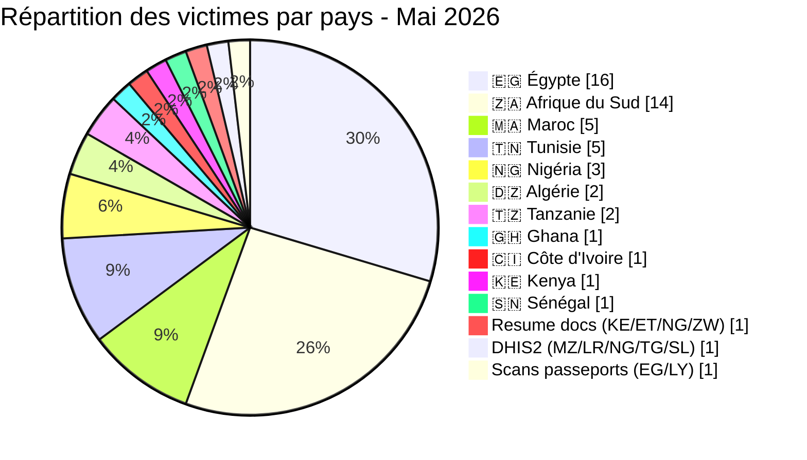
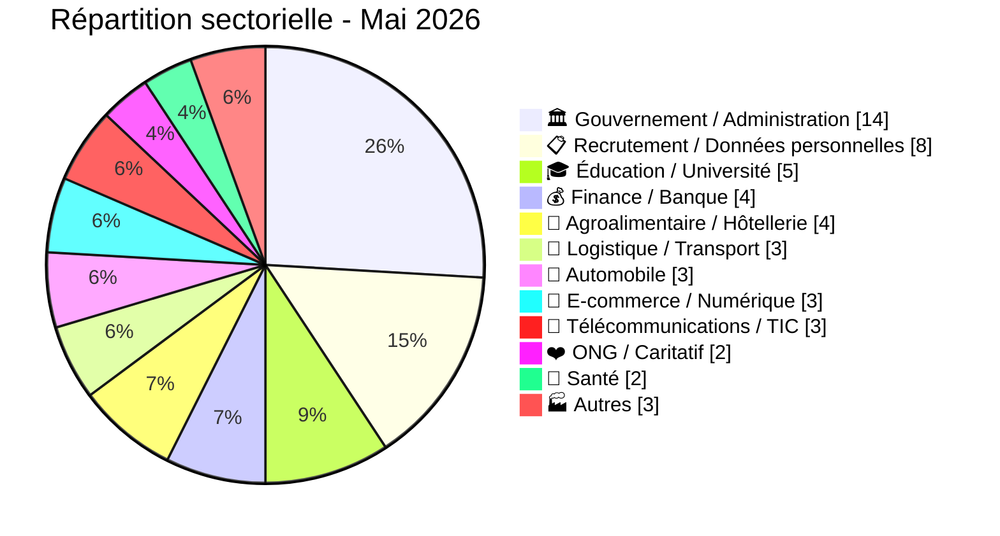
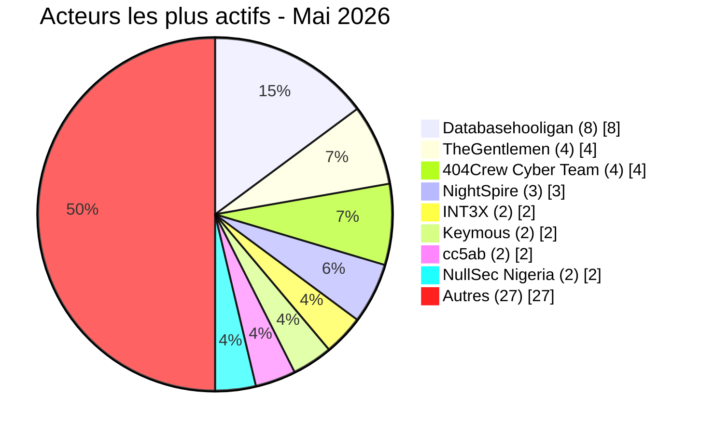

# Rapport CTI - menaces cyber en Afrique (Mai 2026)

👉🏾 [**English version available here**](./README.md)

## 1. Synthèse exécutive

Mai 2026 a enregistré **54 incidents cyber revendiqués publiquement** sur le continent : **16 ransomwares** et **38 fuites de données / ventes d'accès**. Le mois a été marqué par une offensive systématique contre le secteur éducatif égyptien, une campagne coordonnée contre les institutions publiques sud-africaines (OpSouthAfrica), la domination du data broker **Databasehooligan** dans quatre pays, et trois revendications du groupe **NightSpire** contre des cibles égyptiennes sur le même mois.

Principales conclusions :
- **16 ransomwares (29,6 %)** et **38 fuites de données / ventes d'accès (70,4 %)**.
- **11 pays** touchés, plus 3 incidents multi-pays ; **l'Égypte** (16 incidents), **l'Afrique du Sud** (14), **le Maroc** (5) et **la Tunisie** (5) concentrent 74 % des victimes.
- **TheGentlemen** a frappé quatre pays en un mois (Égypte, Tunisie, Ghana, Côte d'Ivoire) ; **NightSpire** a revendiqué trois cibles égyptiennes.
- **Databasehooligan** domine l'activité data broker avec 8 victimes en Tunisie, Afrique du Sud, Égypte et Algérie.
- Le secteur éducatif égyptien sous attaque systémique : Ministère de l'Éducation (26,8 millions d'enregistrements élèves), Professional Academy for Teachers (1,2 million d'enseignants), Université de Mansoura (989 000 enregistrements), bases RH et éducatives (37 Go).
- La messagerie de la police tanzanienne compromise : 10 000 comptes officiers avec mots de passe en clair mis en vente.
- Trésor Public du Sénégal : ransomware AuditTeam avec exfiltration de données confirmée (~1,66 million d'enregistrements dans trois bases Oracle, plus 18 mois de fichiers opérationnels SICA).

### Liste des victimes

👉🏾 [Voir la liste complète des victimes](./victims_FR.md)

---

## 2. Méthodologie

- **Périmètre** : 54 pays africains.
- **Période** : 1er - 31 mai 2026 (incidents révélés ou revendiqués ; les attaques peuvent être antérieures).
- **Sources** : Dark web, DLS, OSINT, canaux Telegram, forums underground.
- **Inclusion** : incidents publiquement revendiqués avec victime, pays et secteur identifiés.
- **Typologie** :
  - *Ransomware* : chiffrement + demande de rançon.
  - *Fuite de données / vente d'accès* : exfiltration sans chiffrement, base vendue ou publiée, ou vente d'accès compromis.

> Toutes les revendications issues de forums cybercriminels, leak sites et canaux underground sont traitées comme des **revendications non confirmées** sauf corroboration indépendante.

---

## 3. Vue d'ensemble

| Indicateur | Valeur |
|---|---|
| Total victimes | 54 |
| Pays touchés | 18 (11 directs + 7 via incidents multi-pays) |
| Acteurs distincts | 25+ |
| Incidents ransomware | 16 (29,6 %) |
| Fuites de données / ventes d'accès | 38 (70,4 %) |

### Classement des pays les plus touchés

**Tous incidents confondus (54) :**

| Rang | Pays | Incidents | Graphique |
| :---: | :--- | :---: | :--- |
| **1** | 🇪🇬 Égypte | **16** | ████████████████ |
| **2** | 🇿🇦 Afrique du Sud | **14** | ██████████████ |
| **3** | 🇲🇦 Maroc | **5** | █████ |
| **4** | 🇹🇳 Tunisie | **5** | █████ |
| **5** | 🇳🇬 Nigeria | **3** | ███ |
| **6** | 🇩🇿 Algérie | **2** | ██ |
| **7** | 🇹🇿 Tanzanie | **2** | ██ |
| **8** | 🇬🇭 Ghana | **1** | █ |
| **9** | 🇨🇮 Côte d'Ivoire | **1** | █ |
| **10** | 🇰🇪 Kenya | **1** | █ |
| **11** | 🇸🇳 Sénégal | **1** | █ |
| **–** | 🇰🇪 Kenya / 🇪🇹 Éthiopie / 🇳🇬 Nigéria / 🇿🇼 Zimbabwe (Resume docs) | **1** | █ |
| **–** | 🇲🇿 Mozambique / 🇱🇷 Liberia / 🇳🇬 Nigéria / 🇹🇬 Togo / 🇸🇱 Sierra Leone (DHIS2) | **1** | █ |
| **–** | 🇪🇬 Égypte / 🇱🇾 Libye (Scans de passeports) | **1** | █ |

### Répartition des incidents ransomware (Total : 16)

| Rang | Pays | Incidents | Graphique |
| :---: | :--- | :---: | :--- |
| **1** | 🇪🇬 Égypte | **7** | ███████ |
| **2** | 🇳🇬 Nigeria | **3** | ███ |
| **3** | 🇹🇳 Tunisie | **2** | ██ |
| **4** | 🇿🇦 Afrique du Sud | **1** | █ |
| **5** | 🇬🇭 Ghana | **1** | █ |
| **6** | 🇸🇳 Sénégal | **1** | █ |
| **7** | 🇨🇮 Côte d'Ivoire | **1** | █ |

### Répartition des fuites de données / ventes d'accès (Total : 38)

| Rang | Pays | Incidents | Graphique |
| :---: | :--- | :---: | :--- |
| **1** | 🇿🇦 Afrique du Sud | **13** | █████████████ |
| **2** | 🇪🇬 Égypte | **9** | █████████ |
| **3** | 🇲🇦 Maroc | **5** | █████ |
| **4** | 🇹🇳 Tunisie | **3** | ███ |
| **5** | 🇩🇿 Algérie | **2** | ██ |
| **6** | 🇹🇿 Tanzanie | **2** | ██ |
| **7** | 🇰🇪 Kenya | **1** | █ |
| **–** | 🇰🇪🇪🇹🇳🇬🇿🇼 Resume docs | **1** | █ |
| **–** | 🇲🇿🇱🇷🇳🇬🇹🇬🇸🇱 DHIS2 | **1** | █ |
| **–** | 🇪🇬🇱🇾 Scans de passeports | **1** | █ |

### Comparaison ransomware vs. fuites par pays

| Pays | Ransomware | Fuites | Répartition côte-à-côte |
| :--- | :---: | :---: | :--- |
| 🇪🇬 Égypte | **7** | **9** | 🟧🟧🟧🟧🟧🟧🟧 🟦🟦🟦🟦🟦🟦🟦🟦🟦 |
| 🇿🇦 Afrique du Sud | **1** | **13** | 🟧 🟦🟦🟦🟦🟦🟦🟦🟦🟦🟦🟦🟦🟦 |
| 🇲🇦 Maroc | **0** | **5** | 🟦🟦🟦🟦🟦 |
| 🇹🇳 Tunisie | **2** | **3** | 🟧🟧 🟦🟦🟦 |
| 🇳🇬 Nigeria | **3** | **0** | 🟧🟧🟧 |
| 🇩🇿 Algérie | **0** | **2** | 🟦🟦 |
| 🇹🇿 Tanzanie | **0** | **2** | 🟦🟦 |
| 🇬🇭 Ghana | **1** | **0** | 🟧 |
| 🇨🇮 Côte d'Ivoire | **1** | **0** | 🟧 |
| 🇰🇪 Kenya | **0** | **1** | 🟦 |
| 🇸🇳 Sénégal | **1** | **0** | 🟧 |
| 🇰🇪🇪🇹🇳🇬🇿🇼 Resume docs | **0** | **1** | 🟦 |
| 🇲🇿🇱🇷🇳🇬🇹🇬🇸🇱 DHIS2 | **0** | **1** | 🟦 |
| 🇪🇬🇱🇾 Scans de passeports | **0** | **1** | 🟦 |
| **Total (54)** | **16** | **38** | *Légende : 🟧 Ransomware \| 🟦 Fuites de données* |

### Répartition géographique par région

| Région | Total incidents | Ransomware | Fuites | Répartition côte-à-côte |
| :--- | :---: | :---: | :---: | :--- |
| **Afrique du Nord** | **28** (51,9 %) | 7 | 21 | 🟧🟧🟧🟧🟧🟧🟧 🟦🟦🟦🟦🟦🟦🟦🟦🟦🟦🟦🟦🟦🟦🟦🟦🟦🟦🟦🟦🟦 |
| **Afrique australe** | **15** (27,8 %) | 1 | 14 | 🟧 🟦🟦🟦🟦🟦🟦🟦🟦🟦🟦🟦🟦🟦🟦 |
| **Afrique de l'Ouest** | **5** (9,3 %) | 4 | 1 | 🟧🟧🟧🟧 🟦 |
| **Afrique de l'Est** | **3** (5,6 %) | 0 | 3 | 🟦🟦🟦 |
| 🇰🇪🇪🇹🇳🇬🇿🇼🇲🇿🇱🇷🇹🇬🇸🇱🇱🇾 Multi-pays (3 incidents) | **3** (5,6 %) | 0 | 3 | 🟦🟦🟦 |

*Légende : 🟧 Ransomware | 🟦 Fuites de données*

### Répartition sectorielle

| Secteur d'activité | Incidents | Part (%) | Graphique |
| :--- | :---: | :---: | :--- |
| **Gouvernement / Administration** | **14** | 25,9 % | ██████████████ |
| **Recrutement / Données personnelles** | **8** | 14,8 % | ████████ |
| **Éducation / Université** | **5** | 9,3 % | █████ |
| **Finance / Banque** | **4** | 7,4 % | ████ |
| **Agroalimentaire / Hôtellerie** | **4** | 7,4 % | ████ |
| **Logistique / Transport** | **3** | 5,6 % | ███ |
| **Automobile** | **3** | 5,6 % | ███ |
| **E-commerce / Numérique** | **3** | 5,6 % | ███ |
| **Télécommunications / TIC** | **3** | 5,6 % | ███ |
| **ONG / Caritatif** | **2** | 3,7 % | ██ |
| **Santé** | **2** | 3,7 % | ██ |
| **Autres** | **3** | 5,6 % | ███ |
| **Total** | **54** | **100 %** | |

### Acteurs de menaces les plus actifs

| Acteur / Groupe | Incidents | Activité principale | Graphique |
| :--- | :---: | :--- | :--- |
| **Databasehooligan** | **8** | Fuites / ventes de données | 🟦🟦🟦🟦🟦🟦🟦🟦 |
| **TheGentlemen** | **4** | Ransomware | 🟧🟧🟧🟧 |
| **404Crew Cyber Team** | **4** | Fuites de données (coalitions) | 🟦🟦🟦🟦 |
| **NightSpire** | **3** | Ransomware | 🟧🟧🟧 |
| **INT3X** | **2** | Fuites de données | 🟦🟦 |
| **Keymous** | **2** | Ventes d'accès / fuites | 🟦🟦 |
| **cc5ab** | **2** | Fuites de données | 🟦🟦 |
| **NullSec Nigeria** | **2** | Fuites (coalitions) | 🟦🟦 |

*Légende : 🟧 Ransomware \| 🟦 Fuites de données*

---

## 4. Bilan par pays

> Toutes les entrées couvrent uniquement les incidents publiquement revendiqués. Les revendications restent non confirmées sauf corroboration indépendante.

### 🇪🇬 Égypte (16 incidents : 7 ransomwares, 9 fuites de données)

- **Ransomware (7) :** NightSpire a revendiqué trois cibles (Papa John's, Rawaj Consumer Finance, B Investments) ; TheGentlemen, Qilin, LockBit 5.0 et Lamashtu (Luna Group) ont chacun revendiqué une victime supplémentaire.
- **Fuites éducation (4) :** Ministère de l'Éducation (26,8 millions d'enregistrements élèves, Revesky), Professional Academy for Teachers (1,2 million, INT3X), Université de Mansoura (989K), base combinée éducation et RH (37 Go, INT3X). Exposition totale : plus de 28 millions d'enregistrements.
- **Autres fuites (5) :** Wuzzuf.net (672K enregistrements, Databasehooligan) ; revendications de cc5ab, DR-X-LOL, CrowStealer, bigF et Keymous.
- Touchée également par l'incident multi-pays : scans de passeports (raylie).

### 🇿🇦 Afrique du Sud (14 incidents : 1 ransomware, 13 fuites de données)

- **Campagne OpSouthAfrica :** La coalition 404Crew Cyber Team (NullSec Nigeria, NullSec Philippines, Infernalis) a revendiqué 8 institutions : Ephraim Mogale Municipality, DCS, Bellavista School, SITA, SARS, mevent., CERVI, Sheriff Randburg West.
- **Data broker (3) :** Databasehooligan a vendu Telkom SA (742K), Wanderers Club (674K) et MIDAS SA.
- **Autres fuites (2) :** cc5ab et Kazu ont chacun revendiqué une cible sud-africaine.
- **Ransomware (1) :** PrinzEugen a revendiqué Standard Bank (non vérifié, aucun échantillon publié).

### 🇲🇦 Maroc (5 fuites de données)

- Cinq revendications : Sejjil, superstarkmc, JBT2026 (registre civil Watiqa.ma), fexus, DarkMafiaX.
- Exposition principale : environ 827 000 lignes d'identifiants depuis des plateformes gouvernementales (Massar, Moutamadris, Waliye, Tax.gov.ma, TGR et autres portails administratifs).

### 🇹🇳 Tunisie (5 incidents : 2 ransomwares, 3 fuites de données)

- **Ransomware (2) :** TheGentlemen et Titan ont chacun revendiqué une victime tunisienne.
- **Data broker (3) :** Databasehooligan a vendu trois bases de plateformes d'emploi (MyTelnet, OptionCarriere.tn, Keejob).

### 🇳🇬 Nigéria (3 ransomwares)

- Trois groupes distincts ont chacun revendiqué une victime : MedusaLocker, KillSec, 0day Syndicate. Aucune fuite de données directement attribuée à une cible nigériane.
- Touché par deux incidents multi-pays : Resume docs (attackercompany) et DHIS2 (Keymous).

### 🇩🇿 Algérie (2 fuites de données)

- Databasehooligan a vendu la base de l'OGEBC (Office de Gestion des Biens Culturels), 425K enregistrements.
- kamalsheikhxx a revendiqué une fuite algérienne supplémentaire.

### 🇹🇿 Tanzanie (2 fuites de données)

- Kampuchean a mis en vente l'accès à la messagerie de la police tanzanienne : 10 000+ comptes officiers avec mots de passe en clair, exposition critique pour les forces de l'ordre.
- XOverStm a revendiqué une vente de base de données supplémentaire.

### 🇸🇳 Sénégal (1 ransomware)

- AuditTeam a ciblé le Trésor Public du Sénégal. Double extorsion confirmée : environ 1,66 million d'enregistrements exfiltrés dans trois bases Oracle (registre national des contribuables ~960K, registre du personnel ~40K, ordres de paiement publics ~659K incluant les NINEA et coordonnées bancaires des bénéficiaires).

### 🇬🇭 Ghana (1 ransomware)

- TheGentlemen a revendiqué une victime ghanéenne.

### 🇨🇮 Côte d'Ivoire (1 ransomware)

- TheGentlemen a revendiqué une victime en Côte d'Ivoire.

### 🇰🇪 Kenya (1 fuite de données)

- cc5ab a revendiqué une fuite depuis une cible kenyane. Touché également par l'incident multi-pays Resume docs (attackercompany).

### Incidents multi-pays (3 fuites de données, 11 pays)

Trois incidents ont touché plusieurs pays africains simultanément. Chacun est comptabilisé une seule fois dans le total global de 54.

| Incident | Acteur | Pays concernés |
|---|---|---|
| Fuite de CV (Resume docs) | attackercompany | 🇰🇪 Kenya, 🇪🇹 Éthiopie, 🇳🇬 Nigéria, 🇿🇼 Zimbabwe |
| DHIS2 / Ministères de la santé | Keymous | 🇲🇿 Mozambique, 🇱🇷 Liberia, 🇳🇬 Nigéria, 🇹🇬 Togo, 🇸🇱 Sierra Leone |
| Scans de passeports | raylie | 🇪🇬 Égypte, 🇱🇾 Libye |

---

## 5. Analyse détaillée par type d'incident

### 5.1 Ransomware (16 incidents)

| Rang | Pays | Attaques | Acteurs principaux |
| :---: | :--- | :---: | :--- |
| **1** | 🇪🇬 Égypte | **7** | NightSpire (3), TheGentlemen, Qilin, LockBit 5.0, Lamashtu |
| **2** | 🇳🇬 Nigeria | **3** | MedusaLocker, KillSec, 0day Syndicate |
| **3** | 🇹🇳 Tunisie | **2** | TheGentlemen, Titan |
| **4** | 🇿🇦 Afrique du Sud | **1** | PrinzEugen |
| **5** | 🇬🇭 Ghana | **1** | TheGentlemen |
| **6** | 🇸🇳 Sénégal | **1** | AuditTeam |
| **7** | 🇨🇮 Côte d'Ivoire | **1** | TheGentlemen |

**Observations :** **NightSpire** a revendiqué trois cibles égyptiennes en un mois (Papa John's, Rawaj Consumer Finance, B Investments). **TheGentlemen** a démontré une portée géographique inédite en frappant quatre pays différents. L'attaque contre le **Trésor Public du Sénégal** représente l'incident ransomware le plus grave du mois. L'analyse technique confirme une double extorsion : les données ont été exfiltrées depuis deux serveurs internes (Oracle DB + système SICA de paie) environ 9 jours avant le déploiement du ransomware, totalisant environ 1 659 735 enregistrements : registre national des contribuables (~960K), registre du personnel (~40K) et base complète des ordres de paiement publics (~659K) incluant les NINEA et coordonnées bancaires des bénéficiaires.

### 5.2 Fuites de données et ventes d'accès (38 incidents)

| Rang | Pays | Incidents | Acteurs principaux |
| :---: | :--- | :---: | :--- |
| **1** | 🇿🇦 Afrique du Sud | **13** | Databasehooligan, 404Crew CT, NullSec Nigeria, Kazu, cc5ab |
| **2** | 🇪🇬 Égypte | **9** | INT3X, Revesky, cc5ab, DR-X-LOL, CrowStealer, bigF, Keymous, Databasehooligan |
| **3** | 🇲🇦 Maroc | **5** | Sejjil, superstarkmc, JBT2026, fexus, DarkMafiaX |
| **4** | 🇹🇳 Tunisie | **3** | Databasehooligan (3) |
| **5** | 🇩🇿 Algérie | **2** | kamalsheikhxx, Databasehooligan |
| **6** | 🇹🇿 Tanzanie | **2** | XOverStm, Kampuchean |
| **–** | 🇰🇪🇪🇹🇳🇬🇿🇼 Resume docs | **1** | attackercompany |
| **–** | 🇲🇿🇱🇷🇳🇬🇹🇬🇸🇱 DHIS2 | **1** | Keymous |
| **–** | 🇪🇬🇱🇾 Scans de passeports | **1** | raylie |

**Observations :** **Databasehooligan** a ciblé des bases CRM structurées dans quatre pays, à des prix allant de 900 à 1 400 dollars. La coalition **404Crew x NullSec Nigeria** a mené une campagne soutenue contre les institutions sud-africaines sous le nom "OpSouthAfrica". L'Égypte a subi une vague de compromissions touchant les systèmes éducatifs avec plus de 28 millions d'enregistrements exposés. La vente de la messagerie de la police tanzanienne représente une menace critique pour les opérations judiciaires du pays.

---

## 6. Impact sectoriel

| Secteur d'activité | Incidents | Part (%) | Impact visuel |
| :--- | :---: | :---: | :--- |
| **Gouvernement / Administration** | **14** | 25,9 % | ██████████████ |
| **Recrutement / Données personnelles** | **8** | 14,8 % | ████████ |
| **Éducation / Université** | **5** | 9,3 % | █████ |
| **Finance / Banque** | **4** | 7,4 % | ████ |
| **Agroalimentaire / Hôtellerie** | **4** | 7,4 % | ████ |
| **Logistique / Transport** | **3** | 5,6 % | ███ |
| **Automobile** | **3** | 5,6 % | ███ |
| **E-commerce / Numérique** | **3** | 5,6 % | ███ |
| **Télécommunications / TIC** | **3** | 5,6 % | ███ |
| **ONG / Caritatif** | **2** | 3,7 % | ██ |
| **Santé** | **2** | 3,7 % | ██ |
| **Autres** | **3** | 5,6 % | ███ |

**Observations clés :**
- **Dominance du secteur public :** Gouvernement et éducation réunis représentent 35,2 % des incidents de mai.
- **Éducation égyptienne sous attaque systémique :** Quatre entités éducatives compromises avec plus de 28 millions d'enregistrements d'élèves et d'enseignants exposés.
- **Vague de bases CRM :** L'activité de Databasehooligan sur les plateformes de recrutement et de consommateurs (Keejob, MyTelnet, OptionCarriere.tn, Wuzzuf.net, MIDAS, Telkom, Wanderers Club) constitue la deuxième menace sectorielle du mois.
- **Infrastructure critique ciblée :** Le Trésor Public du Sénégal confirme une double extorsion avec ~1,66 million d'enregistrements exfiltrés (registre national des contribuables, paie, ordres de paiement avec NINEA et données bancaires). La vente de la messagerie de la police tanzanienne constitue une menace parallèle sur la sécurité opérationnelle des forces de l'ordre.

---

## 7. Profil des acteurs de menaces

| Acteur | Type | Incidents | Cibles principales |
| :--- | :--- | :---: | :--- |
| **Databasehooligan** | Data broker | **8** | Bases CRM/recrutement (multi-pays) |
| **TheGentlemen** | Ransomware | **4** | Industrie, automobile, agroalimentaire (4 pays) |
| **404Crew Cyber Team** | Fuites (coalitions) | **4+** | Institutions publiques sud-africaines |
| **NightSpire** | Ransomware | **3** | Finance et restauration en Égypte |
| **INT3X** | Fuites de données | **2** | Éducation égyptienne |
| **Keymous** | Ventes d'accès | **2** | Systèmes de santé, télécoms (multi-pays) |
| **cc5ab** | Fuites de données | **2** | Gouvernements égyptien et kenyan |
| **NullSec Nigeria** | Fuites (coalitions) | **2+** | Agences gouvernementales sud-africaines |

**Acteurs émergents :** PrinzEugen (Standard Bank), Lamashtu (Luna Group), Kampuchean (Police tanzanienne), JBT2026 (Watiqa.ma).

### 7.1 Niveau de risque

| Pays | Risque |
|---|---|
| Égypte | 🔴 Critique |
| Afrique du Sud | 🔴 Critique |
| Maroc | 🟠 Élevé |
| Tunisie | 🟠 Élevé |
| Nigeria | 🟠 Moyen-élevé |
| Tanzanie | 🟠 Moyen-élevé |
| Algérie | 🟡 Moyen |
| Autres | 🟡 Faible-Moyen |

---

## 8. Tendances clés

- **Le secteur éducatif comme cible stratégique :** La compromission simultanée de quatre entités éducatives égyptiennes expose des dizaines de millions d'enregistrements, suggérant l'exploitation d'une vulnérabilité commune ou d'une infrastructure partagée.
- **Campagne "OpSouthAfrica" :** La coalition 404Crew / NullSec Nigeria / Infernalis a ciblé au moins huit institutions sud-africaines en mai, en mêlant publication de données et revendications politiques liées aux tensions xénophobes.
- **Balayage CRM par Databasehooligan :** Le même acteur a vendu des bases structurées CRM/consommateurs dans quatre pays, suggérant l'exploitation systématique d'une vulnérabilité ou d'une plateforme commune.
- **Concentration de NightSpire sur l'Égypte :** Trois cibles égyptiennes en un mois pour un même groupe ransomware.
- **Comptes gouvernementaux comme vecteurs d'accès :** L'exposition des identifiants de plateformes gouvernementales marocaines (827 000 lignes), la vente de la messagerie de la police tanzanienne et les offres de comptes pour fausses requêtes EDR signalent un marché croissant d'usurpation d'autorité publique.
- **Compromission multi-pays DHIS2 :** La vente d'accès à sept pays (Mozambique, Liberia, Nigeria, Bhoutan, Honduras, Togo, Sierra Leone) représente une menace critique pour les systèmes de surveillance sanitaire africains.

---

## 9. Cartographie MITRE ATT&CK (contextuelle)

| Phase | Identifiant | Nom de la technique | Contexte |
| :--- | :---: | :--- | :--- |
| **Accès initial** | **T1190** | Exploit Public-Facing Application | FutureShop API, Mansoura University, LSB Kenya |
| **Accès initial** | **T1078** | Valid Accounts | Identifiants gouvernementaux marocains, Police tanzanienne |
| **Collecte** | **T1005** | Data from Local System | PAT Égypte, SDTM Maroc, SITA Afrique du Sud |
| **Collecte** | **T1114.002** | Remote Email Collection | Messagerie Police tanzanienne |
| **Exfiltration** | **T1041** | Exfiltration Over C2 Channel | Wuzzuf.net, Telkom, CGCSA |
| **Impact** | **T1486** | Data Encrypted for Impact | Tous les incidents ransomware |
| **Élévation de privilèges** | **T1078.003** | Local Accounts | Identifiants admin DHIS2 |

---

## 10. Recommandations

- **Gouvernements :** Imposer l'authentification multifacteur (MFA) sur tous les portails administratifs et éducatifs ; auditer l'exposition d'identifiants sur les forums underground ; traiter la fuite des identifiants gouvernementaux marocains comme un risque d'identité systémique nécessitant une réinitialisation immédiate des mots de passe.
- **Institutions éducatives :** Isoler les bases de données étudiants et enseignants des interfaces web exposées ; chiffrer les données sensibles au repos ; activer les logs d'audit sur les plateformes administratives.
- **Secteur financier :** Surveiller les DLS ransomware pour des indicateurs de publication imminente ; maintenir des sauvegardes hors ligne ; auditer les flux de données tiers pour les CRM et plateformes de paiement.
- **Forces de l'ordre :** Traiter la compromission de la messagerie de la police tanzanienne comme un risque opérationnel actif ; réinitialiser tous les identifiants affectés ; déployer DMARC/DKIM sur les domaines email gouvernementaux.
- **Santé :** Auditer immédiatement les comptes administrateurs DHIS2 ; restreindre l'accès aux panneaux d'administration aux seuls réseaux internes.

---

## 11. Recommandations SOC (tactiques)

- **[T1078] Surveillance des identifiants :** Corréler les données de fuites avec les annuaires internes ; signaler les comptes exposés dans les incidents Maroc, Police tanzanienne et Stats SA.
- **[T1190] Exposition API :** Imposer l'authentification sur toutes les API publiques ; scanner les buckets S3 non authentifiés et les panneaux d'administration exposés.
- **[T1486] Détection ransomware :** Surveiller les activités de chiffrement volumétrique, la suppression de copies shadow (vssadmin) et les mouvements latéraux via SMB/RDP.
- **[Data brokers] Veille :** Surveiller Databasehooligan, 404Crew et NightSpire pour anticiper de nouvelles cibles africaines.

---

## 12. Conclusion

Mai 2026 confirme la maturité croissante de l'écosystème cybercriminel ciblant l'Afrique, avec un volume (54 incidents) et une sévérité (millions d'enregistrements, ransomware sur infrastructure critique) toujours élevés. L'Égypte et l'Afrique du Sud concentrent à elles seules 56 % des incidents enregistrés. L'exposition systémique du secteur éducatif égyptien et la campagne soutenue OpSouthAfrica représentent les menaces structurantes du mois. La montée de Databasehooligan comme data broker dominant et de NightSpire comme groupe ransomware émergent témoignent de l'évolution continue de l'écosystème criminel.

**AFRINTEL** – African Cyber Threat Intelligence
🔗 [Dépôt GitHub AFRINTEL](https://github.com/Hatchepsoute/AFRINTEL)
