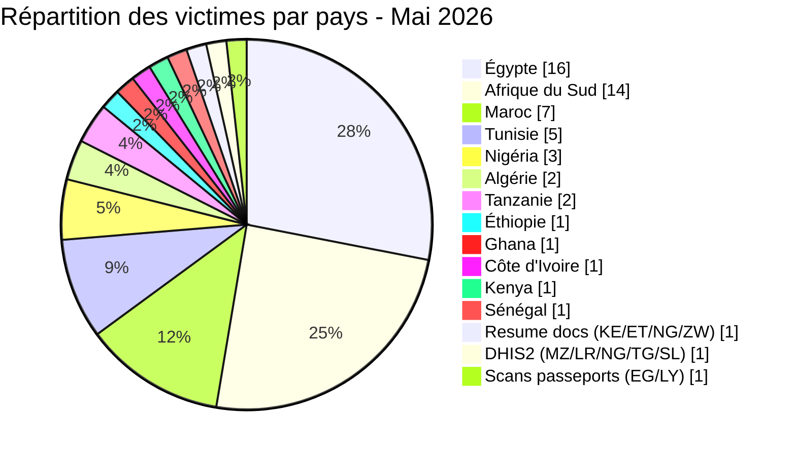
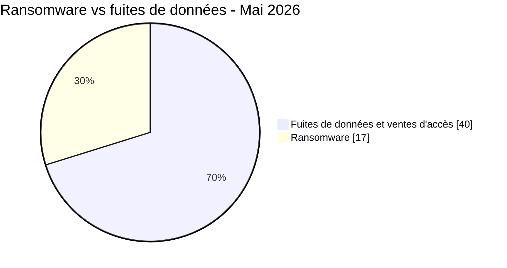
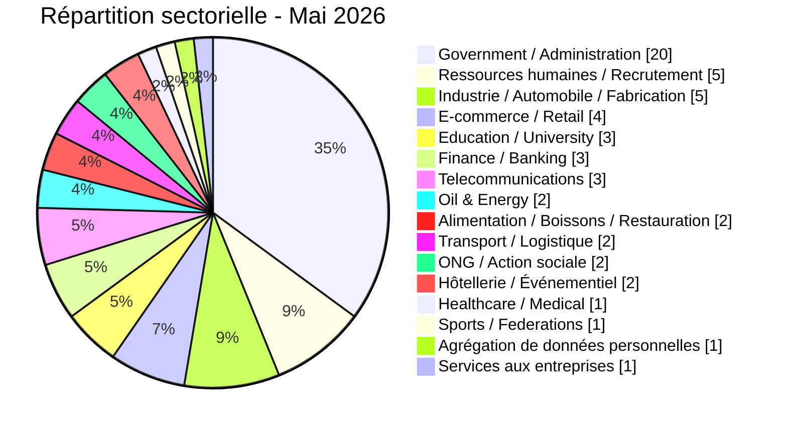
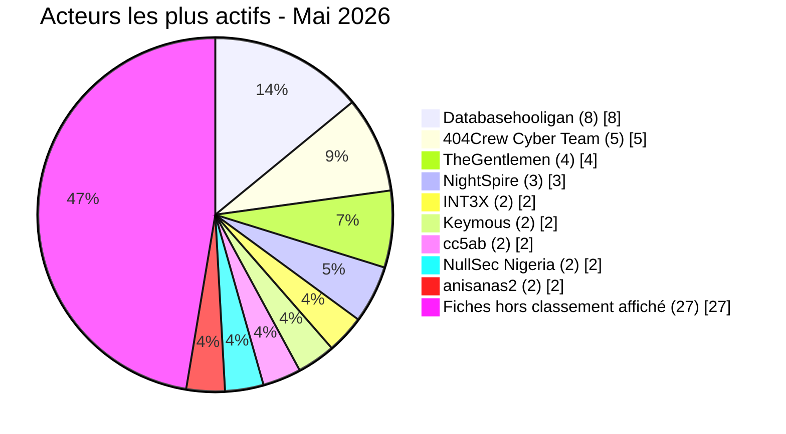

# Rapport CTI - menaces cyber en Afrique (Mai 2026)

👉🏾 [**English version available here**](./README.md)

## 1. Synthèse exécutive

Mai 2026 recense **57 incidents cyber signalés ou revendiqués publiquement** en Afrique : **17 publications ou divulgations ransomware** et **40 fuites de données / ventes d’accès**. Le mois comprend des revendications répétées visant des entités éducatives égyptiennes, des publications sous la bannière OpSouthAfrica, des ventes attribuées à Databasehooligan dans quatre pays et trois publications NightSpire concernant des organisations égyptiennes.

Principales conclusions :
- **17 ransomwares (29,8 %)** et **40 fuites de données / ventes d'accès (70,2 %)**.
- **12 pays** touchés, plus 3 incidents multi-pays ; **l'Égypte** (16 incidents), **l'Afrique du Sud** (14), **le Maroc** (7) et **la Tunisie** (5) concentrent 73,7 % des victimes.
- Des revendications attribuées à **TheGentlemen** concernent quatre pays en un mois (Égypte, Tunisie, Ghana, Côte d'Ivoire) ; **NightSpire** a revendiqué trois cibles égyptiennes.
- **Databasehooligan** est associé à 8 publications de vente en Tunisie, Afrique du Sud, Égypte et Algérie.
- Les revendications concernant l’éducation égyptienne mentionnent quatre entités ou jeux de données ; les volumes complets ne sont pas confirmés indépendamment.
- Messagerie de la police tanzanienne : un acteur propose un jeu de données prétendument associé à plus de 10 000 comptes. AFRINTEL n’a pas testé les identifiants.
- Trésor public du Sénégal : les fichiers analysés étayent une revendication portant sur environ 1,66 million d’enregistrements, sans établir indépendamment la séquence complète, le chiffrement ou le déploiement d’un ransomware.

### Liste des victimes

👉🏾 [Voir la liste complète des victimes](./victims_FR.md)

---

## 2. Méthodologie

- **Périmètre** : 54 pays africains.
- **Période** : 1er - 31 mai 2026 (incidents révélés ou revendiqués ; les attaques peuvent être antérieures).
- **Sources** : Dark web, DLS, OSINT, canaux Telegram, forums underground.
- **Inclusion** : incidents publiquement revendiqués avec victime, pays et secteur identifiés.
- **Typologie** :
  - *Ransomware* : publication d’une victime ou revendication par un groupe ransomware. Le chiffrement n’est pas présumé sans élément probant.
  - *Fuite de données / vente d'accès* : exfiltration sans chiffrement, base vendue ou publiée, ou vente d'accès compromis.

> Toutes les revendications issues de forums cybercriminels, leak sites et canaux underground sont traitées comme des **revendications non confirmées** sauf corroboration indépendante.

---

## 3. Vue d'ensemble

| Indicateur | Valeur |
|---|---|
| Total victimes | 57 |
| Pays touchés | 18 (12 directs + 6 via incidents multi-pays) |
| Acteurs ou sources nommés distincts | 31 |
| Incidents ransomware | 17 (29,8 %) |
| Fuites de données / ventes d'accès | 40 (70,2 %) |

### Classement des pays les plus touchés

**Tous incidents confondus (57) :**

| Rang | Pays | Incidents | Graphique |
| :---: | :--- | :---: | :--- |
| **1** | 🇪🇬 Égypte | **16** | ████████████████ |
| **2** | 🇿🇦 Afrique du Sud | **14** | ██████████████ |
| **3** | 🇲🇦 Maroc | **7** | ███████ |
| **4** | 🇹🇳 Tunisie | **5** | █████ |
| **5** | 🇳🇬 Nigeria | **3** | ███ |
| **6** | 🇩🇿 Algérie | **2** | ██ |
| **7** | 🇹🇿 Tanzanie | **2** | ██ |
| **8** | 🇪🇹 Éthiopie | **1** | █ |
| **9** | 🇬🇭 Ghana | **1** | █ |
| **10** | 🇨🇮 Côte d'Ivoire | **1** | █ |
| **11** | 🇰🇪 Kenya | **1** | █ |
| **12** | 🇸🇳 Sénégal | **1** | █ |
| **-** | 🇰🇪 Kenya / 🇪🇹 Éthiopie / 🇳🇬 Nigéria / 🇿🇼 Zimbabwe (Resume docs) | **1** | █ |
| **-** | 🇲🇿 Mozambique / 🇱🇷 Liberia / 🇳🇬 Nigéria / 🇹🇬 Togo / 🇸🇱 Sierra Leone (DHIS2) | **1** | █ |
| **-** | 🇪🇬 Égypte / 🇱🇾 Libye (Scans de passeports) | **1** | █ |

### Répartition des incidents ransomware (Total : 17)

| Rang | Pays | Incidents | Graphique |
| :---: | :--- | :---: | :--- |
| **1** | 🇪🇬 Égypte | **7** | ███████ |
| **2** | 🇳🇬 Nigeria | **3** | ███ |
| **3** | 🇹🇳 Tunisie | **2** | ██ |
| **4** | 🇿🇦 Afrique du Sud | **2** | ██ |
| **5** | 🇬🇭 Ghana | **1** | █ |
| **6** | 🇸🇳 Sénégal | **1** | █ |
| **7** | 🇨🇮 Côte d'Ivoire | **1** | █ |

### Répartition des fuites de données / ventes d'accès (Total : 40)

| Rang | Pays | Incidents | Graphique |
| :---: | :--- | :---: | :--- |
| **1** | 🇿🇦 Afrique du Sud | **12** | ████████████ |
| **2** | 🇪🇬 Égypte | **9** | █████████ |
| **3** | 🇲🇦 Maroc | **7** | ███████ |
| **4** | 🇹🇳 Tunisie | **3** | ███ |
| **5** | 🇩🇿 Algérie | **2** | ██ |
| **6** | 🇹🇿 Tanzanie | **2** | ██ |
| **7** | 🇪🇹 Éthiopie | **1** | █ |
| **8** | 🇰🇪 Kenya | **1** | █ |
| **-** | 🇰🇪🇪🇹🇳🇬🇿🇼 Resume docs | **1** | █ |
| **-** | 🇲🇿🇱🇷🇳🇬🇹🇬🇸🇱 DHIS2 | **1** | █ |
| **-** | 🇪🇬🇱🇾 Scans de passeports | **1** | █ |

### Comparaison ransomware vs. fuites par pays

| Pays | Ransomware | Fuites | Répartition côte-à-côte |
| :--- | :---: | :---: | :--- |
| 🇪🇬 Égypte | **7** | **9** | 🟧🟧🟧🟧🟧🟧🟧 🟦🟦🟦🟦🟦🟦🟦🟦🟦 |
| 🇿🇦 Afrique du Sud | **2** | **12** | 🟧🟧 🟦🟦🟦🟦🟦🟦🟦🟦🟦🟦🟦🟦 |
| 🇲🇦 Maroc | **0** | **7** | 🟦🟦🟦🟦🟦🟦🟦 |
| 🇹🇳 Tunisie | **2** | **3** | 🟧🟧 🟦🟦🟦 |
| 🇳🇬 Nigeria | **3** | **0** | 🟧🟧🟧 |
| 🇩🇿 Algérie | **0** | **2** | 🟦🟦 |
| 🇹🇿 Tanzanie | **0** | **2** | 🟦🟦 |
| 🇪🇹 Éthiopie | **0** | **1** | 🟦 |
| 🇬🇭 Ghana | **1** | **0** | 🟧 |
| 🇨🇮 Côte d'Ivoire | **1** | **0** | 🟧 |
| 🇰🇪 Kenya | **0** | **1** | 🟦 |
| 🇸🇳 Sénégal | **1** | **0** | 🟧 |
| 🇰🇪🇪🇹🇳🇬🇿🇼 Resume docs | **0** | **1** | 🟦 |
| 🇲🇿🇱🇷🇳🇬🇹🇬🇸🇱 DHIS2 | **0** | **1** | 🟦 |
| 🇪🇬🇱🇾 Scans de passeports | **0** | **1** | 🟦 |
| **Total (57)** | **17** | **40** | *Légende : 🟧 Ransomware \| 🟦 Fuites de données* |

### Répartition géographique par région

| Région | Total incidents | Ransomware | Fuites | Répartition côte-à-côte |
| :--- | :---: | :---: | :---: | :--- |
| **Afrique du Nord** | **30** (52,6 %) | 9 | 21 | 🟧🟧🟧🟧🟧🟧🟧🟧🟧 🟦🟦🟦🟦🟦🟦🟦🟦🟦🟦🟦🟦🟦🟦🟦🟦🟦🟦🟦🟦🟦 |
| **Afrique australe** | **14** (24,6 %) | 2 | 12 | 🟧🟧 🟦🟦🟦🟦🟦🟦🟦🟦🟦🟦🟦🟦 |
| **Afrique de l'Ouest** | **6** (10,5 %) | 6 | 0 | 🟧🟧🟧🟧🟧🟧 |
| **Afrique de l'Est** | **4** (7,0 %) | 0 | 4 | 🟦🟦🟦🟦 |
| 🇰🇪🇪🇹🇳🇬🇿🇼🇲🇿🇱🇷🇹🇬🇸🇱🇱🇾 Multi-pays (3 incidents) | **3** (5,3 %) | 0 | 3 | 🟦🟦🟦 |

*Légende : 🟧 Ransomware | 🟦 Fuites de données*

### Répartition sectorielle

| Secteur d'activité | Incidents | Part (%) | Graphique |
| :--- | :---: | :---: | :--- |
| **Government / Administration** | **20** | 35,09 % | ████████████████████ |
| **Ressources humaines / Recrutement** | **5** | 8,77 % | █████ |
| **Industrie / Automobile / Fabrication** | **5** | 8,77 % | █████ |
| **E-commerce / Retail** | **4** | 7,02 % | ████ |
| **Education / University** | **3** | 5,26 % | ███ |
| **Finance / Banking** | **3** | 5,26 % | ███ |
| **Telecommunications** | **3** | 5,26 % | ███ |
| **Oil & Energy** | **2** | 3,51 % | ██ |
| **Alimentation / Boissons / Restauration** | **2** | 3,51 % | ██ |
| **Transport / Logistique** | **2** | 3,51 % | ██ |
| **ONG / Action sociale** | **2** | 3,51 % | ██ |
| **Hôtellerie / Événementiel** | **2** | 3,51 % | ██ |
| **Healthcare / Medical** | **1** | 1,75 % | █ |
| **Sports / Federations** | **1** | 1,75 % | █ |
| **Agrégation de données personnelles** | **1** | 1,75 % | █ |
| **Services aux entreprises** | **1** | 1,75 % | █ |
| **Total** | **57** | **100 %** | |

### Acteurs de menaces les plus actifs

| Acteur / Groupe | Incidents | Activité principale | Graphique |
| :--- | :---: | :--- | :--- |
| **Databasehooligan** | **8** | Fuites / ventes de données | 🟦🟦🟦🟦🟦🟦🟦🟦 |
| **404Crew Cyber Team** | **5** | Fuites de données (coalitions) | 🟦🟦🟦🟦🟦 |
| **TheGentlemen** | **4** | Ransomware | 🟧🟧🟧🟧 |
| **NightSpire** | **3** | Ransomware | 🟧🟧🟧 |
| **INT3X** | **2** | Fuites de données | 🟦🟦 |
| **Keymous** | **2** | Ventes d'accès / fuites | 🟦🟦 |
| **cc5ab** | **2** | Fuites de données | 🟦🟦 |
| **NullSec Nigeria** | **2** | Fuites (coalitions) | 🟦🟦 |
| **anisanas2** | **2** | Fuites / ventes de données (Maroc) | 🟦🟦 |

*Légende : 🟧 Ransomware \| 🟦 Fuites de données*

---

### Synthèse géographique

> **Pour le détail de chaque incident, voir [`victims_FR.md`](./victims_FR.md).**

- **Concentration :** l’Égypte (16), l’Afrique du Sud (14), le Maroc (7) et la Tunisie (5) représentent 42 des 57 incidents, soit 73,7 % du mois.
- **Répartition des menaces :** 17 revendications ou publications ransomware et 40 fuites de données ou ventes d’accès ont été recensées. Les incidents concernent 18 pays africains : 12 directement et 6 pays supplémentaires par exposition multi-pays.
- **Activité de campagne :** plusieurs entités éducatives égyptiennes ont fait l’objet de revendications importantes, tandis qu’OpSouthAfrica ciblait des institutions publiques et que Databasehooligan apparaissait dans quatre pays.
- **Expositions à fort impact :** les cas notables concernent des comptes de messagerie de la police tanzanienne et la revendication d’AuditTeam visant le Trésor public du Sénégal.

---

## 4. Analyse détaillée par type d'incident

### 4.1 Ransomware (17 incidents)

| Rang | Pays | Publications ou divulgations | Acteurs principaux |
| :---: | :--- | :---: | :--- |
| **1** | 🇪🇬 Égypte | **7** | NightSpire (3), TheGentlemen, Qilin, LockBit 5.0, Lamashtu |
| **2** | 🇳🇬 Nigeria | **3** | MedusaLocker, KillSec, 0day Syndicate |
| **3** | 🇹🇳 Tunisie | **2** | TheGentlemen, Titan |
| **4** | 🇿🇦 Afrique du Sud | **2** | PrinzEugen, Stormous |
| **5** | 🇬🇭 Ghana | **1** | TheGentlemen |
| **6** | 🇸🇳 Sénégal | **1** | AuditTeam |
| **7** | 🇨🇮 Côte d'Ivoire | **1** | TheGentlemen |

**Observations :** NightSpire a publié trois victimes égyptiennes pendant le mois. TheGentlemen présente la plus large répartition géographique, avec des revendications dans quatre pays. Stormous a revendiqué le Consumer Goods Council of South Africa (CGCSA), auparavant comptabilisé à tort comme une simple fuite de données ; le cas est reclassé en publication ransomware. Pour le Trésor public du Sénégal, les fichiers analysés étayent la revendication d’exposition, sans confirmer le déploiement du ransomware, le chiffrement ou la séquence complète.

### 4.2 Fuites de données et ventes d'accès (40 incidents)

| Rang | Pays | Incidents | Acteurs principaux |
| :---: | :--- | :---: | :--- |
| **1** | 🇿🇦 Afrique du Sud | **12** | Databasehooligan, 404Crew CT, NullSec Nigeria, Kazu, cc5ab |
| **2** | 🇪🇬 Égypte | **9** | INT3X, Revesky, cc5ab, DR-X-LOL, CrowStealer, bigF, Keymous, Databasehooligan |
| **3** | 🇲🇦 Maroc | **7** | Sejjil, superstarkmc, JBT2026, fexus, DarkMafiaX, anisanas2 |
| **4** | 🇹🇳 Tunisie | **3** | Databasehooligan (3) |
| **5** | 🇩🇿 Algérie | **2** | kamalsheikhxx, Databasehooligan |
| **6** | 🇹🇿 Tanzanie | **2** | XOverStm, Kampuchean |
| **7** | 🇪🇹 Éthiopie | **1** | 404Crew Cyber Team |
| **-** | 🇰🇪🇪🇹🇳🇬🇿🇼 Resume docs | **1** | attackercompany |
| **-** | 🇲🇿🇱🇷🇳🇬🇹🇬🇸🇱 DHIS2 | **1** | Keymous |
| **-** | 🇪🇬🇱🇾 Scans de passeports | **1** | raylie |

**Observations :** NightSpire a publié trois victimes égyptiennes pendant le mois. TheGentlemen présente la plus large répartition géographique, avec des revendications dans quatre pays. Pour le Trésor public du Sénégal, les fichiers analysés étayent la revendication d’exposition, sans confirmer le déploiement du ransomware, le chiffrement ou la séquence complète.

---

## 5. Impact sectoriel

| Secteur d'activité | Incidents | Part (%) | Impact visuel |
| :--- | :---: | :---: | :--- |
| **Government / Administration** | **20** | 35,09 % | ████████████████████ |
| **Ressources humaines / Recrutement** | **5** | 8,77 % | █████ |
| **Industrie / Automobile / Fabrication** | **5** | 8,77 % | █████ |
| **E-commerce / Retail** | **4** | 7,02 % | ████ |
| **Education / University** | **3** | 5,26 % | ███ |
| **Finance / Banking** | **3** | 5,26 % | ███ |
| **Telecommunications** | **3** | 5,26 % | ███ |
| **Oil & Energy** | **2** | 3,51 % | ██ |
| **Alimentation / Boissons / Restauration** | **2** | 3,51 % | ██ |
| **Transport / Logistique** | **2** | 3,51 % | ██ |
| **ONG / Action sociale** | **2** | 3,51 % | ██ |
| **Hôtellerie / Événementiel** | **2** | 3,51 % | ██ |
| **Healthcare / Medical** | **1** | 1,75 % | █ |
| **Sports / Federations** | **1** | 1,75 % | █ |
| **Agrégation de données personnelles** | **1** | 1,75 % | █ |
| **Services aux entreprises** | **1** | 1,75 % | █ |
| **Total** | **57** | **100 %** | |

**Observations clés :**
- Government / Administration compte 20 incidents. L’ancienne catégorie résiduelle a été entièrement reclassée dans huit secteurs explicites, principalement Ressources humaines / Recrutement et Industrie / Automobile / Fabrication avec 5 incidents chacun.
- Education / University compte 3 incidents. Les jeux de données mixtes gouvernement et éducation sont classés selon leur secteur principal, Government / Administration.
- Les fichiers analysés du Trésor public et l'offre concernant la messagerie de la police tanzanienne sont des cas publics à forte sensibilité, sans établir le chemin complet de l'intrusion.

---

## 6. Profil des acteurs de menaces

| Acteur | Type | Incidents | Cibles principales |
| :--- | :--- | :---: | :--- |
| **Databasehooligan** | Compte proposant des jeux de données à la vente | **8** | Bases CRM/recrutement (multi-pays) |
| **TheGentlemen** | Ransomware | **4** | Industrie, automobile, agroalimentaire (4 pays) |
| **404Crew Cyber Team** | Fuites (coalitions) | **5+** | Institutions publiques sud-africaines, registre éthiopien de la société civile |
| **NightSpire** | Ransomware | **3** | Finance et restauration en Égypte |
| **INT3X** | Fuites de données | **2** | Éducation égyptienne |
| **Keymous** | Ventes d'accès | **2** | Systèmes de santé, télécoms (multi-pays) |
| **cc5ab** | Fuites de données | **2** | Gouvernements égyptien et kenyan |
| **NullSec Nigeria** | Fuites (coalitions) | **2+** | Agences gouvernementales sud-africaines |
| **anisanas2** | Fuites de données | **2** | Infrastructures marocaines (RADEM, vente massive multi-entités) |

**Acteurs émergents :** PrinzEugen (Standard Bank), Lamashtu (Luna Group), Kampuchean (Police tanzanienne), JBT2026 (Watiqa.ma), anisanas2 (vente massive marocaine).

### 6.1 Niveau de risque

| Pays | Risque |
|---|---|
| Égypte | 🔴 Critique |
| Afrique du Sud | 🔴 Critique |
| Maroc | 🟠 Élevé |
| Tunisie | 🟠 Élevé |
| Nigeria | 🟠 Moyen-élevé |
| Tanzanie | 🟠 Moyen-élevé |
| Algérie | 🟡 Moyen |
| Pays restants | 🟡 Faible-Moyen |

---

## 7. Tendances clés et lacunes de renseignement

- **Revendications répétées dans l’éducation :** quatre entrées liées à l’éducation égyptienne sont documentées. Une campagne coordonnée ou une faiblesse d’infrastructure commune reste une hypothèse analytique.
- **Campagne "OpSouthAfrica" :** La coalition 404Crew / NullSec Nigeria / Infernalis a ciblé au moins huit institutions sud-africaines en mai, en mêlant publication de données et revendications politiques liées aux tensions xénophobes.
- **Publications CRM de Databasehooligan :** huit jeux de données structurés ont été proposés à la vente dans quatre pays. Les fiches sources n’établissent ni plateforme partagée ni vecteur d’accès commun.
- **Concentration de NightSpire sur l’Égypte :** trois publications concernent des organisations égyptiennes. Il s’agit d’un signal de surveillance, pas d’une preuve de campagne coordonnée.
- **Comptes gouvernementaux comme vecteurs d'accès :** L'exposition des identifiants de plateformes gouvernementales marocaines (827 000 lignes), la vente de la messagerie de la police tanzanienne et les offres de comptes pour fausses requêtes EDR signalent un marché croissant d'usurpation d'autorité publique.
- **Compromission multi-pays DHIS2 :** La vente d'accès à sept pays (Mozambique, Liberia, Nigeria, Bhoutan, Honduras, Togo, Sierra Leone) représente une menace critique pour les systèmes de surveillance sanitaire africains.
- **Activité répétée visant le Maroc :** deux revendications importantes apparaissent en fin de mois, RADEM Meknès et une vente groupée multi-entités. anisanas2 apparaît aussi dans les données d’avril ; cette continuité justifie une surveillance sans établir un vecteur d’accès commun.

---

## 8. Cartographie MITRE ATT&CK (contextuelle)

| Phase | Technique | Portée analytique |
| :--- | :--- | :--- |
| Accès initial | T1566 - Phishing | Hypothèse de détection défensive, non observée à partir des seules revendications |
| Accès initial | T1190 - Exploit Public-Facing Application | Hypothèse de détection défensive, non observée à partir des seules revendications |
| Accès par comptes | T1078 - Valid Accounts | Pertinent pour les ventes d’accès ou d’identifiants, sans confirmer leur utilisation |
| Collecte | T1005 - Data from Local System | Hypothèse contextuelle lorsque des données internes sont publiées, le mécanisme de collecte restant inconnu |
| Impact | T1486 - Data Encrypted for Impact | Pertinent pour la préparation ransomware, sans confirmer un chiffrement pour chaque fiche |

> Ces techniques constituent des hypothèses défensives. Une revendication, une vente de données ou une publication sur un site de fuite ne suffit pas à les considérer comme observées.

## 9. Recommandations

- **Gouvernements :** Imposer l'authentification multifacteur (MFA) sur tous les portails administratifs et éducatifs ; auditer l'exposition d'identifiants sur les forums underground ; traiter la fuite des identifiants gouvernementaux marocains comme un risque d'identité systémique nécessitant une réinitialisation immédiate des mots de passe.
- **Institutions éducatives :** Isoler les bases de données étudiants et enseignants des interfaces web exposées ; chiffrer les données sensibles au repos ; activer les logs d'audit sur les plateformes administratives.
- **Secteur financier :** Surveiller les DLS ransomware pour des indicateurs de publication imminente ; maintenir des sauvegardes hors ligne ; auditer les flux de données tiers pour les CRM et plateformes de paiement.
- **Forces de l'ordre :** Traiter l’offre concernant la messagerie de la police tanzanienne comme un risque opérationnel potentiel ; réinitialiser tous les identifiants affectés ; déployer DMARC/DKIM sur les domaines email gouvernementaux.
- **Santé :** Auditer immédiatement les comptes administrateurs DHIS2 ; restreindre l'accès aux panneaux d'administration aux seuls réseaux internes.

---

## 10. Recommandations SOC tactiques

- **[T1078] Surveillance des identifiants :** Corréler les données de fuites avec les annuaires internes ; signaler les comptes exposés dans les incidents Maroc, Police tanzanienne et Stats SA.
- **[T1190] Exposition API :** Imposer l'authentification sur toutes les API publiques ; scanner les buckets S3 non authentifiés et les panneaux d'administration exposés.
- **[T1486] Détection ransomware :** Surveiller les activités de chiffrement volumétrique, la suppression de copies shadow (vssadmin) et les mouvements latéraux via SMB/RDP.
- **[Data brokers] Veille :** Surveiller Databasehooligan, 404Crew et NightSpire pour anticiper de nouvelles cibles africaines.

---

## 11. Recommandations stratégiques

- Mettre en place des canaux de notification intersectoriels pour les revendications répétées visant les institutions publiques et les services essentiels.
- Imposer des audits périodiques du stockage cloud, des API exposées et des comptes privilégiés dans les secteurs public, éducatif et financier.
- Coordonner les plateformes et les CERT nationaux face aux abus d’identités gouvernementales ou policières.

---

## 12. Conclusion

Mai 2026 recense 57 incidents signalés ou revendiqués publiquement, contre 60 en avril (-3 ; -5,0 %). Les fiches ransomware passent de 20 à 17 (-15,0 %), tandis que les fuites de données et ventes d’accès restent stables à 40 (0,0 %). L’Égypte et l’Afrique du Sud représentent 52,6 % des incidents directs. Les revendications liées à l’éducation égyptienne, les publications sous la bannière OpSouthAfrica et les offres de vente associées à Databasehooligan dans quatre pays constituent les principaux schémas observés.

**AFRINTEL** - African Cyber Threat Intelligence
🔗 [Dépôt GitHub AFRINTEL](https://github.com/Hatchepsoute/AFRINTEL)
