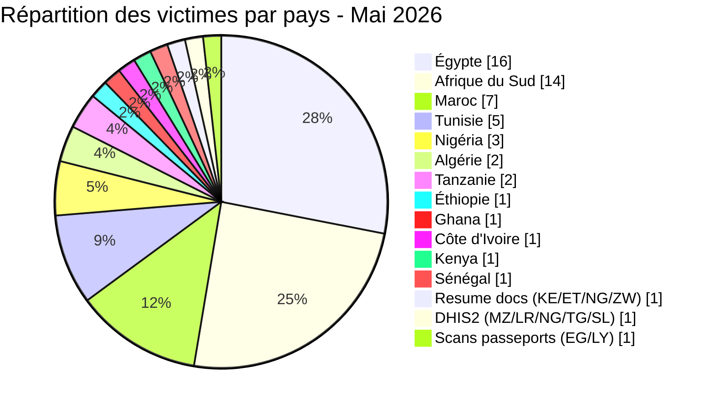
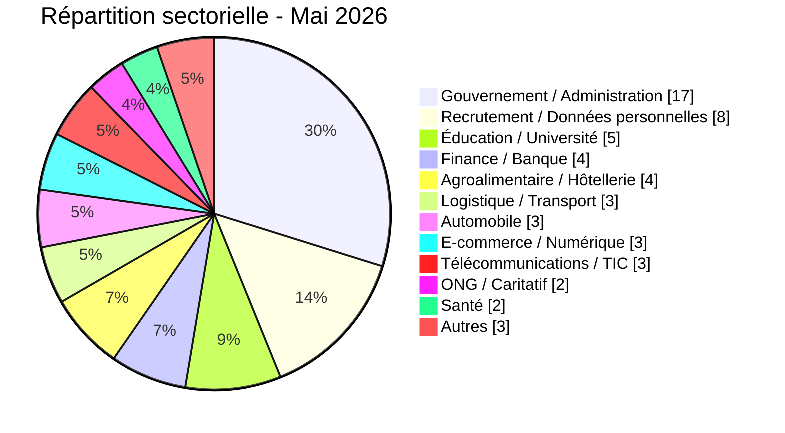
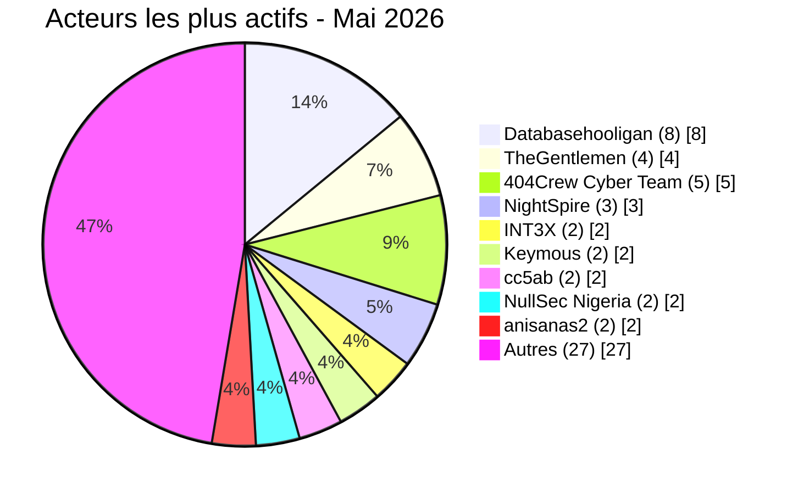

# Rapport CTI - menaces cyber en Afrique (Mai 2026)

👉🏾 [**English version available here**](./README.md)

## 1. Synthèse exécutive

Mai 2026 a enregistré **57 incidents cyber revendiqués publiquement** sur le continent : **16 ransomwares** et **41 fuites de données / ventes d'accès**. Le mois a été marqué par une offensive systématique contre le secteur éducatif égyptien, une campagne coordonnée contre les institutions publiques sud-africaines (OpSouthAfrica), la domination du data broker **Databasehooligan** dans quatre pays, et trois revendications du groupe **NightSpire** contre des cibles égyptiennes sur le même mois.

Principales conclusions :
- **16 ransomwares (28,1 %)** et **41 fuites de données / ventes d'accès (71,9 %)**.
- **12 pays** touchés, plus 3 incidents multi-pays ; **l'Égypte** (16 incidents), **l'Afrique du Sud** (14), **le Maroc** (7) et **la Tunisie** (5) concentrent 73,7 % des victimes.
- **TheGentlemen** a frappé quatre pays en un mois (Égypte, Tunisie, Ghana, Côte d'Ivoire) ; **NightSpire** a revendiqué trois cibles égyptiennes.
- **Databasehooligan** domine l'activité data broker avec 8 victimes en Tunisie, Afrique du Sud, Égypte et Algérie.
- Le secteur éducatif égyptien sous attaque systémique : Ministère de l'Éducation (26,8 millions d'enregistrements élèves), Professional Academy for Teachers (1,2 million d'enseignants), Université de Mansoura (989 000 enregistrements), bases RH et éducatives (37 Go).
- La messagerie de la police tanzanienne compromise : 10 000 comptes officiers avec mots de passe en clair mis en vente.
- Trésor Public du Sénégal : ransomware AuditTeam avec exfiltration de données confirmée (~1,66 million d'enregistrements dans trois bases Oracle, plus 18 mois de fichiers opérationnels SICA).

### Liste des victimes

👉🏾 [Voir la liste complète des victimes](./victims_FR.md)

---

## 2. Méthodologie

- **Périmètre** : 54 pays africains.
- **Période** : 1er - 31 mai 2026 (incidents révélés ou revendiqués ; les attaques peuvent être antérieures).
- **Sources** : Dark web, DLS, OSINT, canaux Telegram, forums underground.
- **Inclusion** : incidents publiquement revendiqués avec victime, pays et secteur identifiés.
- **Typologie** :
  - *Ransomware* : chiffrement + demande de rançon.
  - *Fuite de données / vente d'accès* : exfiltration sans chiffrement, base vendue ou publiée, ou vente d'accès compromis.

> Toutes les revendications issues de forums cybercriminels, leak sites et canaux underground sont traitées comme des **revendications non confirmées** sauf corroboration indépendante.

---

## 3. Vue d'ensemble

| Indicateur | Valeur |
|---|---|
| Total victimes | 57 |
| Pays touchés | 18 (12 directs + 6 via incidents multi-pays) |
| Acteurs distincts | 25+ |
| Incidents ransomware | 16 (28,1 %) |
| Fuites de données / ventes d'accès | 41 (71,9 %) |

### Classement des pays les plus touchés

**Tous incidents confondus (57) :**

| Rang | Pays | Incidents | Graphique |
| :---: | :--- | :---: | :--- |
| **1** | 🇪🇬 Égypte | **16** | ████████████████ |
| **2** | 🇿🇦 Afrique du Sud | **14** | ██████████████ |
| **3** | 🇲🇦 Maroc | **7** | ███████ |
| **4** | 🇹🇳 Tunisie | **5** | █████ |
| **5** | 🇳🇬 Nigeria | **3** | ███ |
| **6** | 🇩🇿 Algérie | **2** | ██ |
| **7** | 🇹🇿 Tanzanie | **2** | ██ |
| **8** | 🇪🇹 Éthiopie | **1** | █ |
| **9** | 🇬🇭 Ghana | **1** | █ |
| **10** | 🇨🇮 Côte d'Ivoire | **1** | █ |
| **11** | 🇰🇪 Kenya | **1** | █ |
| **12** | 🇸🇳 Sénégal | **1** | █ |
| **–** | 🇰🇪 Kenya / 🇪🇹 Éthiopie / 🇳🇬 Nigéria / 🇿🇼 Zimbabwe (Resume docs) | **1** | █ |
| **–** | 🇲🇿 Mozambique / 🇱🇷 Liberia / 🇳🇬 Nigéria / 🇹🇬 Togo / 🇸🇱 Sierra Leone (DHIS2) | **1** | █ |
| **–** | 🇪🇬 Égypte / 🇱🇾 Libye (Scans de passeports) | **1** | █ |

### Répartition des incidents ransomware (Total : 16)

| Rang | Pays | Incidents | Graphique |
| :---: | :--- | :---: | :--- |
| **1** | 🇪🇬 Égypte | **7** | ███████ |
| **2** | 🇳🇬 Nigeria | **3** | ███ |
| **3** | 🇹🇳 Tunisie | **2** | ██ |
| **4** | 🇿🇦 Afrique du Sud | **1** | █ |
| **5** | 🇬🇭 Ghana | **1** | █ |
| **6** | 🇸🇳 Sénégal | **1** | █ |
| **7** | 🇨🇮 Côte d'Ivoire | **1** | █ |

### Répartition des fuites de données / ventes d'accès (Total : 41)

| Rang | Pays | Incidents | Graphique |
| :---: | :--- | :---: | :--- |
| **1** | 🇿🇦 Afrique du Sud | **13** | █████████████ |
| **2** | 🇪🇬 Égypte | **9** | █████████ |
| **3** | 🇲🇦 Maroc | **7** | ███████ |
| **4** | 🇹🇳 Tunisie | **3** | ███ |
| **5** | 🇩🇿 Algérie | **2** | ██ |
| **6** | 🇹🇿 Tanzanie | **2** | ██ |
| **7** | 🇪🇹 Éthiopie | **1** | █ |
| **8** | 🇰🇪 Kenya | **1** | █ |
| **–** | 🇰🇪🇪🇹🇳🇬🇿🇼 Resume docs | **1** | █ |
| **–** | 🇲🇿🇱🇷🇳🇬🇹🇬🇸🇱 DHIS2 | **1** | █ |
| **–** | 🇪🇬🇱🇾 Scans de passeports | **1** | █ |

### Comparaison ransomware vs. fuites par pays

| Pays | Ransomware | Fuites | Répartition côte-à-côte |
| :--- | :---: | :---: | :--- |
| 🇪🇬 Égypte | **7** | **9** | 🟧🟧🟧🟧🟧🟧🟧 🟦🟦🟦🟦🟦🟦🟦🟦🟦 |
| 🇿🇦 Afrique du Sud | **1** | **13** | 🟧 🟦🟦🟦🟦🟦🟦🟦🟦🟦🟦🟦🟦🟦 |
| 🇲🇦 Maroc | **0** | **7** | 🟦🟦🟦🟦🟦🟦🟦 |
| 🇹🇳 Tunisie | **2** | **3** | 🟧🟧 🟦🟦🟦 |
| 🇳🇬 Nigeria | **3** | **0** | 🟧🟧🟧 |
| 🇩🇿 Algérie | **0** | **2** | 🟦🟦 |
| 🇹🇿 Tanzanie | **0** | **2** | 🟦🟦 |
| 🇪🇹 Éthiopie | **0** | **1** | 🟦 |
| 🇬🇭 Ghana | **1** | **0** | 🟧 |
| 🇨🇮 Côte d'Ivoire | **1** | **0** | 🟧 |
| 🇰🇪 Kenya | **0** | **1** | 🟦 |
| 🇸🇳 Sénégal | **1** | **0** | 🟧 |
| 🇰🇪🇪🇹🇳🇬🇿🇼 Resume docs | **0** | **1** | 🟦 |
| 🇲🇿🇱🇷🇳🇬🇹🇬🇸🇱 DHIS2 | **0** | **1** | 🟦 |
| 🇪🇬🇱🇾 Scans de passeports | **0** | **1** | 🟦 |
| **Total (57)** | **16** | **41** | *Légende : 🟧 Ransomware \| 🟦 Fuites de données* |

### Répartition géographique par région

| Région | Total incidents | Ransomware | Fuites | Répartition côte-à-côte |
| :--- | :---: | :---: | :---: | :--- |
| **Afrique du Nord** | **30** (52,6 %) | 9 | 21 | 🟧🟧🟧🟧🟧🟧🟧🟧🟧 🟦🟦🟦🟦🟦🟦🟦🟦🟦🟦🟦🟦🟦🟦🟦🟦🟦🟦🟦🟦🟦 |
| **Afrique australe** | **14** (24,6 %) | 1 | 13 | 🟧 🟦🟦🟦🟦🟦🟦🟦🟦🟦🟦🟦🟦🟦 |
| **Afrique de l'Ouest** | **6** (10,5 %) | 6 | 0 | 🟧🟧🟧🟧🟧🟧 |
| **Afrique de l'Est** | **4** (7,0 %) | 0 | 4 | 🟦🟦🟦🟦 |
| 🇰🇪🇪🇹🇳🇬🇿🇼🇲🇿🇱🇷🇹🇬🇸🇱🇱🇾 Multi-pays (3 incidents) | **3** (5,3 %) | 0 | 3 | 🟦🟦🟦 |

*Légende : 🟧 Ransomware | 🟦 Fuites de données*

### Répartition sectorielle

| Secteur d'activité | Incidents | Part (%) | Graphique |
| :--- | :---: | :---: | :--- |
| **Gouvernement / Administration** | **17** | 29,8 % | █████████████████ |
| **Recrutement / Données personnelles** | **8** | 14,0 % | ████████ |
| **Éducation / Université** | **5** | 8,8 % | █████ |
| **Finance / Banque** | **4** | 7,0 % | ████ |
| **Agroalimentaire / Hôtellerie** | **4** | 7,0 % | ████ |
| **Logistique / Transport** | **3** | 5,3 % | ███ |
| **Automobile** | **3** | 5,3 % | ███ |
| **E-commerce / Numérique** | **3** | 5,3 % | ███ |
| **Télécommunications / TIC** | **3** | 5,3 % | ███ |
| **ONG / Caritatif** | **2** | 3,5 % | ██ |
| **Santé** | **2** | 3,5 % | ██ |
| **Autres** | **3** | 5,3 % | ███ |
| **Total** | **57** | **100 %** | |

### Acteurs de menaces les plus actifs

| Acteur / Groupe | Incidents | Activité principale | Graphique |
| :--- | :---: | :--- | :--- |
| **Databasehooligan** | **8** | Fuites / ventes de données | 🟦🟦🟦🟦🟦🟦🟦🟦 |
| **TheGentlemen** | **4** | Ransomware | 🟧🟧🟧🟧 |
| **404Crew Cyber Team** | **5** | Fuites de données (coalitions) | 🟦🟦🟦🟦🟦 |
| **NightSpire** | **3** | Ransomware | 🟧🟧🟧 |
| **INT3X** | **2** | Fuites de données | 🟦🟦 |
| **Keymous** | **2** | Ventes d'accès / fuites | 🟦🟦 |
| **cc5ab** | **2** | Fuites de données | 🟦🟦 |
| **NullSec Nigeria** | **2** | Fuites (coalitions) | 🟦🟦 |
| **anisanas2** | **2** | Fuites / ventes de données (Maroc) | 🟦🟦 |

*Légende : 🟧 Ransomware \| 🟦 Fuites de données*

---

## 4. Bilan par pays - Résumé succinct (avec dates clés)

> **Pour tous les détails techniques (volumes de données, analyses d'échantillons, tactiques des acteurs, etc.), veuillez consulter la liste complète des victimes :** [`victims_FR.md`](./victims_FR.md)

---

### 🇪🇬 Égypte (16 incidents : 7 ransomwares, 9 fuites)

**Ransomwares (7) :**
- **Le groupe ransomware NightSpire** (3 cibles, 24-26 mai) : Papa John's Egypt, Rawaj Consumer Finance, B Investments Holding
- **Le groupe ransomware TheGentlemen** (9 mai) : Misr Chemical Industries
- **Le groupe ransomware Lamashtu** (4 mai) : Luna Group (agroalimentaire)
- **Le groupe ransomware LockBit 5.0** (7 mai) : Rhactus Hotel
- **Le groupe ransomware Qilin** (8 mai) : Imex International (logistique)

**Fuites dans le secteur éducatif (4) :**
- **L'acteur malveillant Revesky** (13 mai - Ministère de l'Éducation) : 26,8M d'élèves + 3,8M d'enseignants
- **L'acteur malveillant INT3X** (10 mai - Université de Mansoura) : 989 000 étudiants (2012-2026)
- **L'acteur malveillant INT3X** (16 mai - Professional Academy for Teachers) : 1,2M d'enseignants
- **L'acteur malveillant bigF** (4 mai) : 37 Go (Mansoura + Galala), 1,5M d'étudiants

**Autres fuites (5) :**
- **L'acteur malveillant CrowStealer** (2 mai - Ministère du Travail) : 34 528 travailleurs/expatriés
- **L'acteur malveillant cc5ab** (12 mai - FutureShop) : API exposée - 3 893 clients, 5 181 commandes, bucket S3
- **L'acteur malveillant DR-X-LOL** (15 mai - Baitzakat.org.eg) : 300 000 citoyens (numéros d'identité nationale)
- **Le cybercriminel Databasehooligan** (24 mai - Wuzzuf.net) : 672 000 chercheurs d'emploi (documents d'identité, vidéos) - 1 100 $
- **L'acteur malveillant Keymous** (28 mai - Citex Systems) : données employés et projets

---

### 🇿🇦 Afrique du Sud (14 incidents : 1 ransomware, 13 fuites)

**Ransomware (1) :**
- **Le groupe ransomware PrinzEugen** (4 mai - Standard Bank Group) : revendication non vérifiée

**Campagne "OpSouthAfrica" (8) - coalition des acteurs malveillants 404Crew Cyber Team, NullSec Nigeria, NullSec Philippines et Infernalis (15-24 mai) :**
- **Municipalité d'Ephraim Mogale** (15 mai) : 111 Go de documents administratifs
- **Bellavista School** (15 mai) : données élèves/parents
- **Department of Correctional Services** (16 mai) : documents internes
- **CERVI My Private Care** (24 mai) : coordonnées bancaires + numéros BHF des prestataires
- **mevent.** (24 mai) : données de contact d'infirmières
- **Sheriff Randburg West** (24 mai) : données de citoyens
- **SITA** (23 mai) : identifiants exposés
- **SARS** (23 mai) : couples email/mot de passe (origine incertaine, données tiers)

**Ventes du cybercriminel Databasehooligan (27 mai) :**
- **Telkom** : 742 000 clients (NID, facturation, tickets) - 900 $
- **Wanderers Club** : 674 000 membres (adhésions sportives) - 1 400 $
- **MIDAS** : 463 000 clients/logistique (TVA) - 1 100 $

**Autres fuites (2) :**
- **L'acteur malveillant Stormous** (5 mai - CGCSA) : 20 Go, base Sage 200 Evolution (finances, inventaires)
- **L'acteur malveillant Kazu** (17 mai - Stats SA) : 154 Go, 453 000 fichiers (cartes d'identité, recensement)

---

### 🇲🇦 Maroc (7 fuites)

- **L'acteur malveillant Sejjil** (12 mai - SDTM/Groupe Barid Al-Maghrib) : 129 fichiers CSV SAGE ERP, hashes MD5, RIB, CIN
- **L'acteur malveillant superstarkmc** (17 mai - Plateformes gouvernementales) : 827 000 identifiants (Massar, Moutamadris, Waliye, Tax.gov, TGR)
- **L'acteur malveillant JBT2026** (20 mai - Watiqa.ma) : 695 400 enregistrements d'état civil
- **L'acteur malveillant fexus** (21 mai - Avito.ma) : emails, téléphones, mots de passe en clair
- **L'acteur malveillant DarkMafiaX** (22 mai - Spacex.ma) : identifiants admin divulgués
- **L'acteur malveillant anisanas2** (22 mai - RADEM Meknès) : ~1,1 million de documents exfiltrés (données clients eau/électricité : noms, adresses, numéros de contrat ; données opérationnelles : tournées, agences) ; exposition critique d'une infrastructure publique régionale
- **Les acteurs malveillants anisanas2 / PKA291** (31 mai - Vente massive de bases marocaines) : plus de 12 millions de lignes et documents couvrant le Ministère de la Justice (2M docs, 150 000 dossiers judiciaires, 3 000 USD), NARSA (2M lignes, 800 USD), OFPPT (400 000 lignes), livraison (8M lignes) et une compagnie d'assurance (accès initial) ; bundle global estimé à 5 500 USD

---

### 🇹🇳 Tunisie (5 incidents : 2 ransomwares, 3 fuites)

**Ransomwares (2) :**
- **Le groupe ransomware TheGentlemen** (12 mai - SETCAR) : fabricant de pièces automobiles
- **Le groupe ransomware Titan** (18 mai - CRIT Tunisie) : RH / placement de personnel

**Fuites (3) - le cybercriminel Databasehooligan (27-31 mai) :**
- **Keejob** (27 mai) : 137 000 enregistrements - 1 400 $
- **MyTelnet** (27 mai) : profils CRM abonnés
- **OptionCarriere.tn** (31 mai) : 274 000 enregistrements (candidats, employeurs) - 1 300 $

---

### 🇳🇬 Nigeria (3 ransomwares)

- **Le groupe ransomware MedusaLocker** (5 mai - ActionAid/TACOSA) : ONG humanitaire
- **Le groupe ransomware KillSec** (9 mai - MRS Holdings) : conglomérat énergétique
- **Le groupe ransomware 0day Syndicate** (28 mai - XL Africa Group) : services B2B

Incidents multi-pays impliquant également le Nigeria : **l'acteur malveillant attackercompany** (Resume docs) et **l'acteur malveillant Keymous** (DHIS2).

---

### 🇩🇿 Algérie (2 fuites)

- **L'acteur malveillant kamalsheikhxx** (4 mai - Ministère de l'Industrie Pharmaceutique) : 34,3 Go, 52 000 fichiers (2019-2025)
- **Le cybercriminel Databasehooligan** (19 mai - OGEBC patrimoine culturel) : 425 000 enregistrements - 900 $

---

### 🇹🇿 Tanzanie (2 fuites)

- **Le cybercriminel XOverStm** (3 mai - Base citoyens) : 120 000 enregistrements (noms, adresses, téléphones) - 350 $
- **Le cybercriminel Kampuchean** (22 mai - Webmail police) : 10 000 comptes officiers, mots de passe en clair - 550 $

---

### 🇪🇹 Éthiopie (1 fuite)

- **L'acteur malveillant 404Crew Cyber Team** (15 mai - NGO Registration Database) : 3 668 enregistrements d'organisations de la société civile issus de l'agence éthiopienne d'enregistrement et d'audit des ONG, incluant noms, métadonnées d'enregistrement, numéros de certificat, catégories, adresses et emails de contact.

---

### 🇸🇳 Sénégal (1 ransomware - CRITIQUE)

- **Le groupe ransomware AuditTeam** (17-18 mai - Trésor Public) : ~1 659 735 enregistrements exfiltrés
  - **Serveur 10.6.0.61** (Oracle) : dumps des tables `COLLOC.REDEVABLES` (960 146 contribuables avec NINEA), `GFORD.ORD_MANDATS` (659 195 ordres de paiement avec coordonnées bancaires), `COLLOC.CO_PERSONNELS` (40 394 agents avec salaires)
  - **Serveur 10.6.0.26** (SICA) : 18 mois de fichiers de paie et de virements
  - Accès persistant confirmé ~9 jours avant la revendication publique

---

### 🇬🇭 Ghana (1 ransomware)

- **Le groupe ransomware TheGentlemen** (6 mai - Kasapreko) : fabricant de boissons

---

### 🇨🇮 Côte d'Ivoire (1 ransomware)

- **Le groupe ransomware TheGentlemen** (28 mai - Mayelia Automotive) : services de contrôle technique

---

### 🇰🇪 Kenya (1 fuite)

- **L'acteur malveillant cc5ab** (16 mai - Land Surveyors Board) : 175 géomètres agréés, 730 assistants (NID), documentation complète de l'API, panneau d'administration Django, configuration PostgreSQL et paramètres JWT

---

### Incidents multi-pays (3)

| Incident | Acteur | Date | Pays concernés |
|----------|--------|------|----------------|
| Resume docs | **L'acteur malveillant attackercompany** | 5 mai | 🇰🇪🇪🇹🇳🇬🇿🇼 (Kenya, Éthiopie, Nigeria, Zimbabwe) |
| DHIS2 / Ministères de la Santé | **L'acteur malveillant Keymous** | 13 mai | 🇲🇿🇱🇷🇳🇬🇹🇬🇸🇱 (Mozambique, Liberia, Nigeria, Togo, Sierra Leone) |
| Scans de passeports | **L'acteur malveillant raylie** | 18 mai | 🇪🇬🇱🇾 (Égypte, Libye) |

---

**Synthèse globale (57 incidents, 18 pays) :** L'Égypte (16) et l'Afrique du Sud (14) concentrent à elles seules 52,6 % des incidents. Le secteur éducatif égyptien a exposé à lui seul plus de 28 millions d'enregistrements. Les incidents les plus critiques sont la fuite du Trésor Public sénégalais (~1,66M d'enregistrements) et la vente de la messagerie de la police tanzanienne (10 000 comptes d'officiers en clair). **Le cybercriminel Databasehooligan** domine le courtage de données avec 8 ventes structurées à travers quatre pays.

> **Pour les détails techniques complets, analyses d'échantillons et descriptions détaillées des victimes, voir :** [`victims_FR.md`](./victims_FR.md)

---

## 5. Analyse détaillée par type d'incident

### 5.1 Ransomware (16 incidents)

| Rang | Pays | Attaques | Acteurs principaux |
| :---: | :--- | :---: | :--- |
| **1** | 🇪🇬 Égypte | **7** | NightSpire (3), TheGentlemen, Qilin, LockBit 5.0, Lamashtu |
| **2** | 🇳🇬 Nigeria | **3** | MedusaLocker, KillSec, 0day Syndicate |
| **3** | 🇹🇳 Tunisie | **2** | TheGentlemen, Titan |
| **4** | 🇿🇦 Afrique du Sud | **1** | PrinzEugen |
| **5** | 🇬🇭 Ghana | **1** | TheGentlemen |
| **6** | 🇸🇳 Sénégal | **1** | AuditTeam |
| **7** | 🇨🇮 Côte d'Ivoire | **1** | TheGentlemen |

**Observations :** **NightSpire** a revendiqué trois cibles égyptiennes en un mois (Papa John's, Rawaj Consumer Finance, B Investments). **TheGentlemen** a démontré une portée géographique inédite en frappant quatre pays différents. L'attaque contre le **Trésor Public du Sénégal** représente l'incident ransomware le plus grave du mois. L'analyse technique confirme une double extorsion : les données ont été exfiltrées depuis deux serveurs internes (Oracle DB + système SICA de paie) environ 9 jours avant le déploiement du ransomware, totalisant environ 1 659 735 enregistrements : registre national des contribuables (~960K), registre du personnel (~40K) et base complète des ordres de paiement publics (~659K) incluant les NINEA et coordonnées bancaires des bénéficiaires.

### 5.2 Fuites de données et ventes d'accès (41 incidents)

| Rang | Pays | Incidents | Acteurs principaux |
| :---: | :--- | :---: | :--- |
| **1** | 🇿🇦 Afrique du Sud | **13** | Databasehooligan, 404Crew CT, NullSec Nigeria, Kazu, cc5ab |
| **2** | 🇪🇬 Égypte | **9** | INT3X, Revesky, cc5ab, DR-X-LOL, CrowStealer, bigF, Keymous, Databasehooligan |
| **3** | 🇲🇦 Maroc | **7** | Sejjil, superstarkmc, JBT2026, fexus, DarkMafiaX, anisanas2, PKA291 |
| **4** | 🇹🇳 Tunisie | **3** | Databasehooligan (3) |
| **5** | 🇩🇿 Algérie | **2** | kamalsheikhxx, Databasehooligan |
| **6** | 🇹🇿 Tanzanie | **2** | XOverStm, Kampuchean |
| **7** | 🇪🇹 Éthiopie | **1** | 404Crew Cyber Team |
| **–** | 🇰🇪🇪🇹🇳🇬🇿🇼 Resume docs | **1** | attackercompany |
| **–** | 🇲🇿🇱🇷🇳🇬🇹🇬🇸🇱 DHIS2 | **1** | Keymous |
| **–** | 🇪🇬🇱🇾 Scans de passeports | **1** | raylie |

**Observations :** **Databasehooligan** a ciblé des bases CRM structurées dans quatre pays, à des prix allant de 900 à 1 400 dollars. La coalition **404Crew x NullSec Nigeria** a mené une campagne soutenue contre les institutions sud-africaines sous le nom "OpSouthAfrica", tandis que 404Crew Cyber Team a également mis en vente la base d'enregistrement des ONG éthiopiennes. L'Égypte a subi une vague de compromissions touchant les systèmes éducatifs avec plus de 28 millions d'enregistrements exposés. La vente de la messagerie de la police tanzanienne représente une menace critique pour les opérations judiciaires du pays.

---

## 6. Impact sectoriel

| Secteur d'activité | Incidents | Part (%) | Impact visuel |
| :--- | :---: | :---: | :--- |
| **Gouvernement / Administration** | **17** | 29,8 % | █████████████████ |
| **Recrutement / Données personnelles** | **8** | 14,0 % | ████████ |
| **Éducation / Université** | **5** | 8,8 % | █████ |
| **Finance / Banque** | **4** | 7,0 % | ████ |
| **Agroalimentaire / Hôtellerie** | **4** | 7,0 % | ████ |
| **Logistique / Transport** | **3** | 5,3 % | ███ |
| **Automobile** | **3** | 5,3 % | ███ |
| **E-commerce / Numérique** | **3** | 5,3 % | ███ |
| **Télécommunications / TIC** | **3** | 5,3 % | ███ |
| **ONG / Caritatif** | **2** | 3,5 % | ██ |
| **Santé** | **2** | 3,5 % | ██ |
| **Autres** | **3** | 5,3 % | ███ |

**Observations clés :**
- **Dominance du secteur public :** Gouvernement et éducation réunis représentent 38,6 % des incidents de mai.
- **Éducation égyptienne sous attaque systémique :** Quatre entités éducatives compromises avec plus de 28 millions d'enregistrements d'élèves et d'enseignants exposés.
- **Vague de bases CRM :** L'activité de Databasehooligan sur les plateformes de recrutement et de consommateurs (Keejob, MyTelnet, OptionCarriere.tn, Wuzzuf.net, MIDAS, Telkom, Wanderers Club) constitue la deuxième menace sectorielle du mois.
- **Infrastructure critique ciblée :** Le Trésor Public du Sénégal confirme une double extorsion avec ~1,66 million d'enregistrements exfiltrés (registre national des contribuables, paie, ordres de paiement avec NINEA et données bancaires). La vente de la messagerie de la police tanzanienne constitue une menace parallèle sur la sécurité opérationnelle des forces de l'ordre.

---

## 7. Profil des acteurs de menaces

| Acteur | Type | Incidents | Cibles principales |
| :--- | :--- | :---: | :--- |
| **Databasehooligan** | Data broker | **8** | Bases CRM/recrutement (multi-pays) |
| **TheGentlemen** | Ransomware | **4** | Industrie, automobile, agroalimentaire (4 pays) |
| **404Crew Cyber Team** | Fuites (coalitions) | **5+** | Institutions publiques sud-africaines, registre éthiopien de la société civile |
| **NightSpire** | Ransomware | **3** | Finance et restauration en Égypte |
| **INT3X** | Fuites de données | **2** | Éducation égyptienne |
| **Keymous** | Ventes d'accès | **2** | Systèmes de santé, télécoms (multi-pays) |
| **cc5ab** | Fuites de données | **2** | Gouvernements égyptien et kenyan |
| **NullSec Nigeria** | Fuites (coalitions) | **2+** | Agences gouvernementales sud-africaines |
| **anisanas2** | Fuites de données | **2** | Infrastructures marocaines (RADEM, vente massive multi-entités) |

**Acteurs émergents :** PrinzEugen (Standard Bank), Lamashtu (Luna Group), Kampuchean (Police tanzanienne), JBT2026 (Watiqa.ma), PKA291 (vente massive marocaine).

### 7.1 Niveau de risque

| Pays | Risque |
|---|---|
| Égypte | 🔴 Critique |
| Afrique du Sud | 🔴 Critique |
| Maroc | 🟠 Élevé |
| Tunisie | 🟠 Élevé |
| Nigeria | 🟠 Moyen-élevé |
| Tanzanie | 🟠 Moyen-élevé |
| Algérie | 🟡 Moyen |
| Autres | 🟡 Faible-Moyen |

---

## 8. Tendances clés

- **Le secteur éducatif comme cible stratégique :** La compromission simultanée de quatre entités éducatives égyptiennes expose des dizaines de millions d'enregistrements, suggérant l'exploitation d'une vulnérabilité commune ou d'une infrastructure partagée.
- **Campagne "OpSouthAfrica" :** La coalition 404Crew / NullSec Nigeria / Infernalis a ciblé au moins huit institutions sud-africaines en mai, en mêlant publication de données et revendications politiques liées aux tensions xénophobes.
- **Balayage CRM par Databasehooligan :** Le même acteur a vendu des bases structurées CRM/consommateurs dans quatre pays, suggérant l'exploitation systématique d'une vulnérabilité ou d'une plateforme commune.
- **Concentration de NightSpire sur l'Égypte :** Trois cibles égyptiennes en un mois pour un même groupe ransomware.
- **Comptes gouvernementaux comme vecteurs d'accès :** L'exposition des identifiants de plateformes gouvernementales marocaines (827 000 lignes), la vente de la messagerie de la police tanzanienne et les offres de comptes pour fausses requêtes EDR signalent un marché croissant d'usurpation d'autorité publique.
- **Compromission multi-pays DHIS2 :** La vente d'accès à sept pays (Mozambique, Liberia, Nigeria, Bhoutan, Honduras, Togo, Sierra Leone) représente une menace critique pour les systèmes de surveillance sanitaire africains.
- **Campagne persistante contre le Maroc :** Deux incidents d'envergure s'ajoutent en fin de mois : la compromission de la RADEM Meknès (1,1 million de documents d'infrastructure critique eau/électricité) et une vente massive agrégant plus de 12 millions de lignes issues du Ministère de la Justice, de la NARSA, de l'OFPPT et de plusieurs entreprises privées. L'acteur anisanas2/PKA291 a déjà ciblé le Maroc en avril 2026, confirmant une persistance de la menace.

---

## 9. Cartographie MITRE ATT&CK (contextuelle)

| Phase | Identifiant | Nom de la technique | Contexte |
| :--- | :---: | :--- | :--- |
| **Accès initial** | **T1190** | Exploit Public-Facing Application | FutureShop API, Mansoura University, LSB Kenya |
| **Accès initial** | **T1078** | Valid Accounts | Identifiants gouvernementaux marocains, Police tanzanienne, identifiants DHIS2 (couples URL/mot de passe publiés) |
| **Collecte** | **T1005** | Data from Local System | PAT Égypte, SDTM Maroc, SITA Afrique du Sud |
| **Collecte** | **T1114.002** | Remote Email Collection | Messagerie Police tanzanienne |
| **Exfiltration** | **T1041** | Exfiltration Over C2 Channel | Wuzzuf.net, Telkom, CGCSA |
| **Impact** | **T1486** | Data Encrypted for Impact | Tous les incidents ransomware |
| **Élévation de privilèges** | **T1078.003** | Local Accounts | Identifiants admin DHIS2 |

---

## 10. Recommandations

- **Gouvernements :** Imposer l'authentification multifacteur (MFA) sur tous les portails administratifs et éducatifs ; auditer l'exposition d'identifiants sur les forums underground ; traiter la fuite des identifiants gouvernementaux marocains comme un risque d'identité systémique nécessitant une réinitialisation immédiate des mots de passe.
- **Institutions éducatives :** Isoler les bases de données étudiants et enseignants des interfaces web exposées ; chiffrer les données sensibles au repos ; activer les logs d'audit sur les plateformes administratives.
- **Secteur financier :** Surveiller les DLS ransomware pour des indicateurs de publication imminente ; maintenir des sauvegardes hors ligne ; auditer les flux de données tiers pour les CRM et plateformes de paiement.
- **Forces de l'ordre :** Traiter la compromission de la messagerie de la police tanzanienne comme un risque opérationnel actif ; réinitialiser tous les identifiants affectés ; déployer DMARC/DKIM sur les domaines email gouvernementaux.
- **Santé :** Auditer immédiatement les comptes administrateurs DHIS2 ; restreindre l'accès aux panneaux d'administration aux seuls réseaux internes.

---

## 11. Recommandations SOC (tactiques)

- **[T1078] Surveillance des identifiants :** Corréler les données de fuites avec les annuaires internes ; signaler les comptes exposés dans les incidents Maroc, Police tanzanienne et Stats SA.
- **[T1190] Exposition API :** Imposer l'authentification sur toutes les API publiques ; scanner les buckets S3 non authentifiés et les panneaux d'administration exposés.
- **[T1486] Détection ransomware :** Surveiller les activités de chiffrement volumétrique, la suppression de copies shadow (vssadmin) et les mouvements latéraux via SMB/RDP.
- **[Data brokers] Veille :** Surveiller Databasehooligan, 404Crew et NightSpire pour anticiper de nouvelles cibles africaines.

---

## 12. Conclusion

Mai 2026 confirme la maturité croissante de l'écosystème cybercriminel ciblant l'Afrique, avec un volume (57 incidents) et une sévérité (millions d'enregistrements, ransomware sur infrastructure critique) toujours élevés. L'Égypte et l'Afrique du Sud concentrent à elles seules 52,6 % des incidents enregistrés. L'exposition systémique du secteur éducatif égyptien et la campagne soutenue OpSouthAfrica représentent les menaces structurantes du mois. La montée de Databasehooligan comme data broker dominant et de NightSpire comme groupe ransomware émergent témoignent de l'évolution continue de l'écosystème criminel.

**AFRINTEL** – African Cyber Threat Intelligence
🔗 [Dépôt GitHub AFRINTEL](https://github.com/Hatchepsoute/AFRINTEL)
