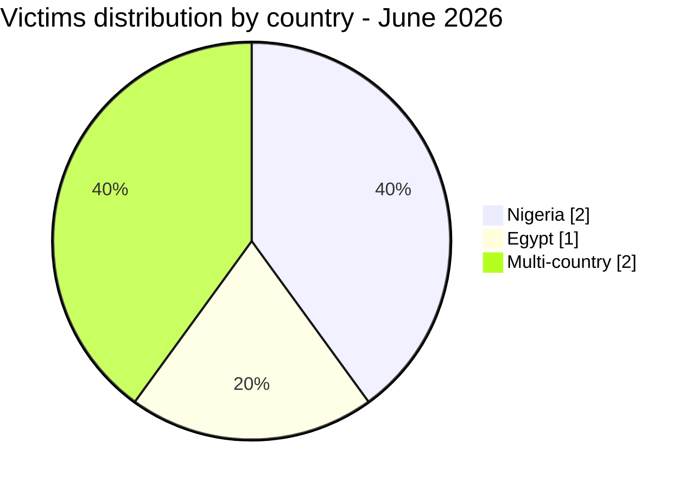
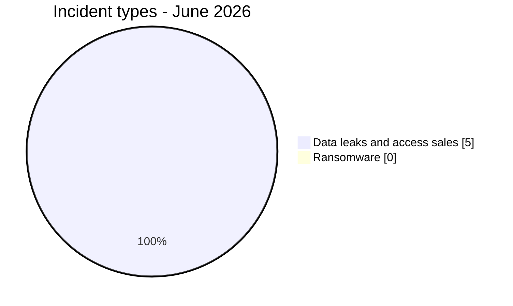
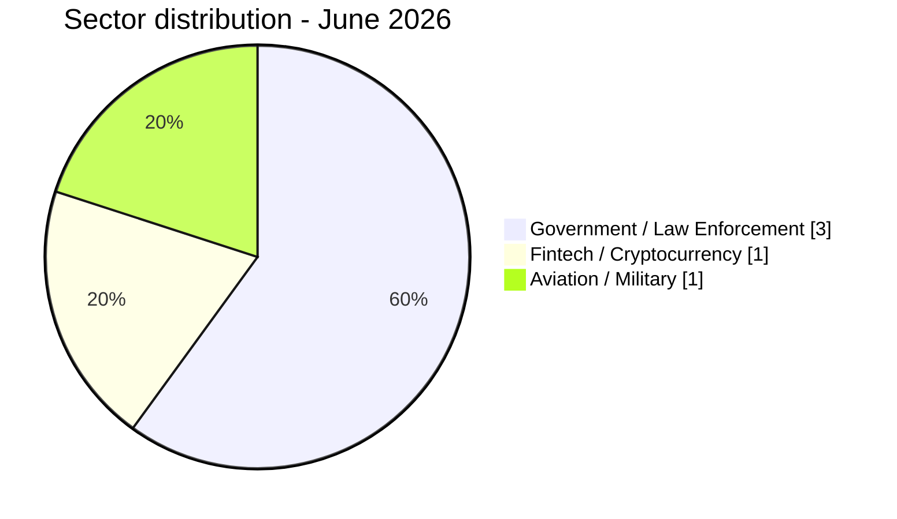

# CTI report - cyberattacks in Africa (June 2026)

👉🏾 [**French version available here**](./README_FR.md)

## 1. Executive summary

June 2026 recorded **5 publicly claimed cyber incidents** across Africa, exclusively in the form of **data leaks, database sales, and access sales**. No ransomware incidents were documented this month. The period was characterized by two major themes: the catastrophic data leak targeting Nigeria's largest crypto-to-Naira exchange (Jeroid.co), and a coordinated market for law enforcement portal access and government email addresses affecting multiple African countries.

Key findings:
- **0 ransomware attacks** and **5 data leaks / access sales (100%)**.
- **2 countries** directly affected (Egypt, Nigeria) plus **2 multi-country incidents** touching up to 11 African nations.
- **Jeroid.co (Nigeria):** one of the most severe fintech data leaks recorded on the continent, with 312,433 users, 759,900 wallets ($306M TVL), 110,282 BVN, 64,300 NIN, and 70,956 biometric face verification photos exposed on a public S3 bucket.
- **Law enforcement portal access sales:** two separate actors ("Convince" and "Governor") sold active government and police credentials specifically usable to submit Emergency Disclosure Requests (EDR) to Meta, Google, TikTok, and X, targeting at least 11 African countries.
- **Egypt:** aviation and military personnel data (pilots from Egypt Air, Qatar Airways, Suez Canal Authority, and the Ministry of Civil Aviation) exposed and offered for sale.
- **Nigeria:** two incidents in the same month – Jeroid.co fintech breach and the NILDS government institution claim.

> All claims from cybercriminal forums, leak sites, and underground channels are treated as **unverified claims** unless independently corroborated.

### Victim list

👉🏾 [View full victim list](./victims.md)

---

## 2. Methodology

- **Scope**: 54 African countries.
- **Period**: 1-21 June 2026 (incidents disclosed or claimed during this period; actual attack dates may be earlier).
- **Sources**: Dark web, DLS (leak sites), OSINT, Telegram channels, underground forums.
- **Inclusion**: Publicly claimed or attributed incidents with identified victim, country, and sector.
- **Typology**:
  - *Ransomware*: encryption + ransom demand.
  - *Data leak / access sale*: exfiltration without encryption, database sold/published, or access sale to compromised systems or credentials.

> All claims from cybercriminal forums, leak sites, and underground channels are treated as **unverified claims** unless independently corroborated.

---

## 3. Global overview

| Indicator | Value |
|---|---|
| Total incidents | 5 |
| Countries directly affected | 2 (+ multi-country) |
| Distinct actors | 5 |
| Ransomware incidents | 0 (0%) |
| Data leaks / access sales | 5 (100%) |

### Country breakdown

| Rank | Country | Incidents | Chart |
| :---: | :--- | :---: | :--- |
| **1** | 🇳🇬 Nigeria | **2** | ██ |
| **2** | 🇪🇬 Egypt | **1** | █ |
| **–** | 🌍 Multi-country | **2** | ██ |

### Incident type distribution

### Sector distribution

| Activity sector | Incidents | Share (%) | Chart |
| :--- | :---: | :---: | :--- |
| **Government / Law Enforcement** | **3** | 60% | ███ |
| **Fintech / Cryptocurrency** | **1** | 20% | █ |
| **Aviation / Military** | **1** | 20% | █ |
| **Total** | **5** | **100%** | |

---

## 4. Detailed analysis by incident type

### 4.1 Ransomware (0 incidents)

No ransomware incidents documented in June 2026.

### 4.2 Data leaks & access sales (5 incidents)

| Date | Country | Organization / Target | Actor | Sector |
| :--- | :---: | :--- | :--- | :--- |
| June 6 | 🇪🇬 Egypt | Egyptian Pilots Database | Xyphorix | Aviation / Military |
| June 10 | 🇳🇬 Nigeria | Jeroid.co | burti | Fintech / Crypto |
| June 13 | 🇳🇬 Nigeria | NILDS | 404Crew CT x NullSec Nigeria | Government / Legislative |
| June 17 | 🌍 Multi-country | Gov. institutions (EDR emails) | Convince | Government / Law Enforcement |
| June 20 | 🌍 Multi-country | Gov. portal access (LEP accounts) | Governor | Government / Law Enforcement |

**Key observations:**
- **Jeroid.co** represents the most impactful incident: 312,433 users, 759,900 wallets with a combined TVL of $306M, 110,282 Bank Verification Numbers (BVN), 64,300 National ID Numbers (NIN), and 70,956 biometric face verification photos stored on an unauthenticated public S3 bucket. 65,013 users had full Level 3 KYC (BVN + NIN + face scan + identity document). The asking price was $2,000 USD.
- **Convince** (Immortal forum) sold active government email addresses from 8 African countries, combined with a complete EDR tutorial, enabling impersonation of official law enforcement to extract user data from Google, Meta, and Telegram.
- **Governor** ([Citizen] forum) went a step further by selling fully operational law enforcement portal accounts already authenticated on Meta, TikTok, and X interfaces – allowing direct data subpoena and emergency requests without needing to draft fake correspondence.
- **NILDS Nigeria:** the National Institute for Legislative and Democratic Studies was claimed by the 404Crew Cyber Team x NullSec Nigeria coalition, with database structures and admin credentials allegedly exposed.
- **Egyptian pilots database** exposes military and civil aviation personnel from Egypt Air, Qatar Airways, Petroleum Air Services, Suez Canal Authority, and the Ministry of Civil Aviation.

---

## 5. Threat actor profile

| Actor | Type | Incidents | Primary targets |
| :--- | :--- | :---: | :--- |
| **Convince** | Access sale (EDR credentials) | **1** | African government / law enforcement (8 countries) |
| **Governor** | Access sale (LEP accounts) | **1** | African government / law enforcement (9 countries) |
| **burti** | Data broker | **1** | Nigerian fintech (Jeroid.co) |
| **404Crew CT x NullSec Nigeria** | Data leak (coalition) | **1** | Nigerian government |
| **Xyphorix** | Data broker | **1** | Egyptian aviation / military |

### Risk assessment

| Country | Risk level |
|---|---|
| Nigeria | 🔴 Critical |
| Egypt | 🟠 High |
| Ethiopia, Tanzania, Kenya, Angola, Zambia, Morocco, Algeria | 🟠 Medium-High (EDR access exposure) |

---

## 6. Key trends

- **No ransomware this month:** a notable contrast with May 2026 (16 ransomware incidents). The trend for June 2026 is dominated by data sales and access monetization.
- **Law enforcement impersonation as an emerging market:** the simultaneous appearance of two actors selling government credentials specifically for EDR/LEP abuse signals the consolidation of a specialized criminal service targeting Africa's law enforcement infrastructure.
- **Fintech as high-value target:** Jeroid.co's exposure illustrates the extreme concentration of sensitive financial and biometric data in African fintech platforms – BVN and NIN are master identity keys in Nigeria's banking system; their combined exposure with biometric data enables complete identity fraud.
- **Nigeria targeted twice:** the NILDS government claim and the Jeroid.co breach make Nigeria the most exposed country of the month in terms of data sensitivity.
- **Multi-country law enforcement exposure:** the EDR and LEP access sales collectively expose government and police institutions in at least 11 African countries, creating structural vulnerability across the continent's digital governance.

---

## 7. MITRE ATT&CK mapping (contextual)

| Phase | Technique ID | Technique name | Context |
| :--- | :---: | :--- | :--- |
| **Collection** | **T1005** | Data from Local System | Jeroid.co database, NILDS, Egyptian pilots |
| **Exfiltration** | **T1537** | Transfer Data to Cloud Account | S3 bucket exposure (Jeroid.co biometric data) |
| **Initial Access** | **T1078** | Valid Accounts | Government / police credentials sold by Convince, Governor |
| **Resource Development** | **T1586** | Compromise Accounts | Law enforcement portal accounts (Governor) |
| **Impact** | **T1565.001** | Stored Data Manipulation | Potential via LEP access (content removal, account suspension) |

---

## 8. Recommendations

- **Fintech platforms:** audit all data storage policies; S3 buckets containing biometric data must never be publicly accessible; implement encryption at rest for all KYC documents and face verification assets; review data minimization practices.
- **Governments (Nigeria, Egypt, Tanzania, Kenya, Ethiopia, Angola, Zambia, Morocco, Algeria):** immediately audit government email account inventories; rotate credentials for all law enforcement email addresses; report to relevant social media platforms any suspected misuse of official law enforcement portal access; implement MFA on all government email systems.
- **Law enforcement agencies:** contact Meta, Google, TikTok, and X to verify the validity of emergency data requests submitted via African government accounts in recent months; treat any unusual EDR approval as potentially fraudulent.
- **Fintech users (Nigeria):** Nigerian citizens using Jeroid.co should monitor their BVN and NIN for unauthorized linked accounts; consider requesting a BVN verification with their bank.
- **SOC teams:** correlate exposure indicators from Convince and Governor listings against internal government email directories; flag any account also appearing in the sold credentials catalogues.

---

## 9. SOC tactical recommendations

- **[T1078] Credential monitoring:** cross-reference the sold government email addresses (Ethiopia, Tanzania, Angola, Kenya, Zambia, Nigeria, Egypt, Morocco) against internal IAM directories; flag accounts present in both.
- **[T1537] S3 exposure detection:** scan all cloud storage buckets for public access policies on assets containing biometric or KYC data; enforce bucket-level access control lists.
- **[T1586] Law enforcement portal audit:** request audit logs from Meta, TikTok, and X law enforcement portals for all requests filed using African government credentials since January 2026.
- **[Fintech breach response]:** Nigerian financial institutions should monitor for unusual BVN-linked account opening patterns that could signal Jeroid.co data being used for loan fraud or account takeover.

---

## 10. Conclusion

June 2026 recorded fewer incidents than May 2026 in absolute terms, but the qualitative impact remains significant. The Jeroid.co breach stands as one of the largest fintech data exposures documented on the African continent, combining financial, biometric, and identity data at scale. The dual appearance of EDR and LEP access sales targeting African law enforcement represents a structural threat to digital governance across the region. The absence of ransomware activity may reflect seasonal patterns or a temporary shift in actor priorities, but should not be interpreted as a reduction in overall risk.

**AFRINTEL** – African Cyber Threat Intelligence
🔗 [GitHub AFRINTEL Repository](https://github.com/Hatchepsoute/AFRINTEL)
